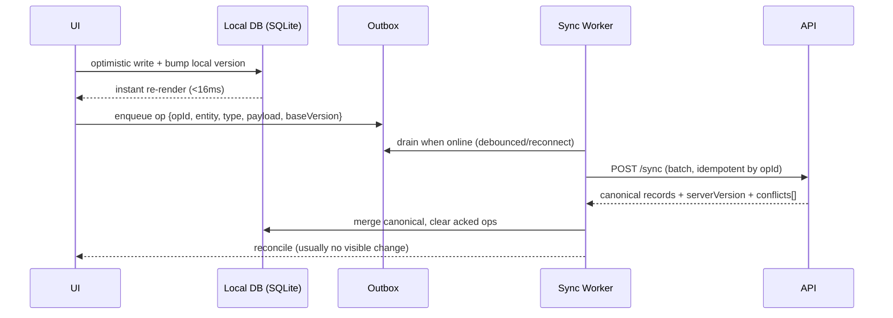

# 02 · Architecture & Tech Stack

> Follows the [Master PRD Template](./00-prd-template.md). This is the engineering contract:
> how Numil is built so any engineer can navigate the codebase and extend it consistently.

> ⚠️ **Expo SDK 57 has breaking changes.** Confirm every API against the versioned docs at
> <https://docs.expo.dev/versions/v57.0.0/> before writing code. Versions below are copied
> verbatim from `package.json`, `app.json`, and `eas.json` — do not invent APIs/versions.

---

## 1. Purpose

Numil is an **Expo (SDK 57) + React Native 0.86**, iOS-first, offline-first productivity
platform. This module defines the runtime, navigation, state, sync, module boundaries,
folder structure, environments, and build pipeline so the team can build the 43 product
modules **without architectural ambiguity.**

**The problem this solves.** A phone-first, offline-first app that also serves enterprises
has three hard constraints at once: (1) 60fps native feel on iOS, (2) full offline usability
with lossless sync, and (3) server-authoritative RBAC/audit. A muddled architecture makes any
one of these leak into the others (e.g., optimistic UI that corrupts data, or permission
checks bolted onto the client). The architecture below keeps these concerns cleanly layered.

**Engineering goals**
- **One codebase, iOS-first:** RN + Expo managed workflow; Android/web as secondary targets.
- **Offline is the default path**, not a mode: every mutation flows through a local store +
  outbox; the network is a background reconciler.
- **Server is the source of truth**; the client is a fast cache + a queue of pending writes.
- **Module boundaries are enforceable:** feature folders own their domain logic; shared libs
  own cross-cutting concerns.

**KPIs this module moves:** cold-start time, crash-free sessions, sync success rate, bundle
size / OTA update size, and developer velocity (time-to-add-a-screen).

---

## 2. Navigation

**Navigation library:** `expo-router` `~57.0.4` (file-based routing under `src/app`).
**Native tabs:** `expo-router/unstable-native-tabs` (used in `src/components/app-tabs.tsx`).
Deep links use the `numil://` scheme declared in `app.json`. Typed routes are enabled
(`app.json → experiments.typedRoutes: true`), so route params are type-checked.

**Route → file mapping (current + proposed)**

| Route | File | Presentation |
|-------|------|--------------|
| `/` (Home) | `src/app/index.js` (→ dashboard) | tab root |
| `/explore` | `src/app/explore.tsx` (placeholder) | to be replaced by modules |
| `/(auth)/*` | `src/app/(auth)/…` (proposed) | modal stack |
| `/(tabs)/*` | `src/app/(tabs)/…` (proposed) | native tabs |
| `/task/[id]` | `src/app/task/[id].tsx` (proposed) | sheet (from list) / push (deep link) |
| `/project/[id]` | `src/app/project/[id].tsx` (proposed) | push |

**Deep links:** `numil://task/{id}`, `numil://project/{id}`, `numil://inbox`,
`numil://ai?prompt=…`. Full map in [04-navigation-sidebar.md](./04-navigation-sidebar.md).
On tap, the app restores the correct workspace before routing.

**Modal vs push:** sheets (medium→large detents) for quick view/edit that must keep context;
push for deep-linked/standalone screens with a back stack + breadcrumb.

---

## 3. Complete UI Layout

Architecturally, the "UI layout" is the **provider + shell tree** every screen mounts inside.

```text
┌───────────────────────────────────────────────┐
│  RootLayout  src/app/_layout.tsx                │
│  ├─ SafeAreaProvider (react-native-safe-area…)  │
│  ├─ GestureHandlerRootView (gesture-handler)    │
│  ├─ ThemeProvider (Colors light/dark, theme.ts) │
│  ├─ QueryClientProvider (React Query — proposed)│
│  ├─ SessionProvider (Zustand — proposed)        │
│  └─ Stack / Drawer                              │
│      └─ NativeTabs  src/components/app-tabs.tsx │
│          ├─ Home    → stack → task/[id]         │
│          ├─ Tasks   → stack → task/[id]         │
│          ├─ Calendar→ stack → task/[id]         │
│          ├─ Inbox   → stack                     │
│          └─ More    → stack (search/reports/…)  │
└───────────────────────────────────────────────┘
```

- **Providers order matters:** safe-area → gestures → theme → data → session → navigation,
  so gestures and safe insets are available to every route.
- **iOS specifics:** `expo-glass-effect` glass nav/tab bars; `expo-symbols` for SF Symbols;
  large titles that collapse on scroll; Dynamic Island + home-indicator safe areas honored
  via `react-native-safe-area-context` and `BottomTabInset` (50 on iOS) from
  `src/constants/theme.ts`.
- **iPad / landscape:** the Drawer becomes a persistent sidebar; a split view keeps
  sidebar · list · detail on screen. Portrait iPad collapses to two columns.
- **Splash:** `expo-splash-screen` (`#208AEF`, `splash-icon.png`, width 76) per `app.json`.

---

## 4. Complete Component Breakdown

The architectural "components" are the **layers and where each dependency lives.**

| Layer | Packages (from `package.json`) | Role |
|-------|--------------------------------|------|
| Runtime | `react-native@0.86.0`, `react@19.2.3`, `react-dom@19.2.3` | New Architecture era |
| Framework | `expo@~57.0.4`, `expo-constants@~57.0.3`, `expo-dev-client@~57.0.5` | Managed workflow + dev client |
| Routing | `expo-router@~57.0.4`, `expo-linking@~57.0.2` | File routes + deep links |
| Native UI | `@expo/ui@~57.0.4`, `expo-glass-effect@~57.0.0`, `expo-symbols@~57.0.0`, `expo-system-ui@~57.0.0`, `expo-status-bar@~57.0.0` | iOS glass, SF Symbols, chrome |
| Animation | `react-native-reanimated@4.5.0`, `react-native-worklets@0.10.0` | UI-thread animations |
| Gestures | `react-native-gesture-handler@~2.32.0` | Swipe, drag, edge-pan |
| Screens/insets | `react-native-screens@4.25.2`, `react-native-safe-area-context@~5.7.0` | Native screens + safe areas |
| Media/fonts | `expo-image@~57.0.0`, `expo-font@~57.0.0` | Fast images, custom fonts |
| Device/web | `expo-device@~57.0.0`, `expo-web-browser@~57.0.0`, `react-native-web@~0.21.0` | Device info, in-app browser, web target |
| Language/build | `typescript@~6.0.3`, `@types/react@~19.2.2`, `expo-router/entry` (main) | Strict TS, entry point |

**Design tokens** (`src/constants/theme.ts`): `Colors` (light/dark: `text`, `background`,
`backgroundElement`, `backgroundSelected`, `textSecondary`), `Fonts`
(`sans`/`serif`/`rounded`/`mono` via `Platform.select`, e.g. iOS `ui-rounded`), `Spacing`
(`half:2, one:4, two:8, three:16, four:24, five:32, six:64`), `BottomTabInset`
(iOS 50 / Android 80), `MaxContentWidth: 800`. Styling base via `@/global.css` (imported by
`theme.ts`). Full system in [03-design-system-ui.md](./03-design-system-ui.md).

**Proposed dependencies (not yet installed — add with `npx expo install <pkg>`):**

| Need | Library | Why |
|------|---------|-----|
| Local notifications | `expo-notifications` | Schedule reminders/alerts on-device |
| Secure storage | `expo-secure-store` | Tokens/keys in Keychain (never AsyncStorage) |
| Biometrics | `expo-local-authentication` | Face ID / Touch ID app lock |
| Local DB | `expo-sqlite` (or WatermelonDB) | Offline-first mirror + outbox |
| Server state | `@tanstack/react-query` | Caching, retries, background sync |
| Client state | Zustand | Session/UI/theme state |
| Date/time | `date-fns` + `date-fns-tz` | Durations, recurrence, timezones |
| Forms | `react-hook-form` + `zod` | Validated forms + schemas |
| Bottom sheets | `@gorhom/bottom-sheet` | iOS-style detented sheets |
| Haptics | `expo-haptics` | Tactile feedback |

---

## 5. Modern Features (architecture capabilities)

Each capability: Purpose · Workflow · UI · Permissions · Offline · API · DB · Notify · AC.

### 5.1 File-based typed routing ✅ v1
- **Purpose:** predictable navigation with compile-time-safe params.
- **Workflow:** add a file under `src/app` → route exists; `typedRoutes` types params.
- **UI:** native stack/tabs/sheets via `expo-router`.
- **Permissions:** route guards redirect unauthenticated users to `(auth)`.
- **Offline:** routing is client-only; screens hydrate from local DB.
- **API/DB:** none directly. **Notify:** deep links resolve to routes.
- **AC:** every deep link resolves or shows a graceful "not available" screen.

### 5.2 Offline-first data layer ✅ v1
- **Purpose:** the app works with no network; the network reconciles in the background.
- **Workflow:** UI writes to local SQLite (optimistic) → enqueue op in outbox → sync worker
  flushes on connectivity. Detailed in [shared/offline-sync-engine.md](./shared/offline-sync-engine.md).
- **UI:** instant optimistic re-render; a subtle "will sync" chip; non-blocking error banner.
- **Permissions:** ops re-checked server-side on flush (`403` → rollback).
- **Offline:** this *is* the offline feature. **API:** `GET/POST /sync`.
- **DB:** local mirror tables + `outbox(opId, entity, type, payload, baseVersion, clientTs)`.
- **Notify:** none. **AC:** create/edit/complete/reorder/comment all work offline losslessly.

### 5.3 Optimistic UI with server reconciliation ✅ v1
- Writes apply locally in < 16ms; server responds with canonical records; client reconciles
  by monotonic `version`; stale/echo of own ops ignored. Conflicts resolve field-level LWW.

### 5.4 Realtime sync over WebSocket ✅ v1
- Subscribe to `org:` / `project:` / `task:` / `user:` channels
  ([shared/api-conventions.md](./shared/api-conventions.md)); reconcile by `version`; missed
  events recovered via delta `GET /sync?since=`. Presence/typing ephemeral.

### 5.5 New Architecture + React Compiler 🔜 v1.1
- RN 0.86 New Architecture (Fabric/TurboModules) + `experiments.reactCompiler: true`
  (`app.json`) reduce manual memoization; validate each screen under the compiler before GA.

### 5.6 OTA updates & feature flags 🟣 v2
- EAS Update for incremental JS delivery; remote config + flags in
  [42-feature-flags-remote-config.md](./42-feature-flags-remote-config.md).

---

## 6. Smart AI Features

Architecture-side concerns for the AI copilot ([19-ai-assistant-copilot.md](./19-ai-assistant-copilot.md)):
- **On-device NLP** (dates/priority/labels) runs off the main thread for offline capture;
  server LLM capabilities are network-gated and queued when offline.
- **Streaming** responses via SSE/WebSocket; requests are cancelable to keep UI responsive.
- **Proposal-first writes:** AI never mutates the local store directly; it produces proposals
  the user accepts, which then flow through the normal optimistic write path.
- **Governance hooks:** every AI call passes org settings + quota checks server-side; the
  client only renders availability. RAG retrieval is permission-filtered.

---

## 7. Productivity Features (developer experience)

- **`npm start` / `npm run ios`** (Expo dev client via `expo-dev-client`) for fast iteration.
- **`npm run lint`** (`expo lint`) enforces style; TypeScript `~6.0.3` strict typing.
- **Typed routes** eliminate a class of navigation bugs.
- **Fast refresh + Reanimated worklets** keep the animation loop on the UI thread.
- **`reset-project` script** (`scripts/reset-project.js`) scaffolds a clean starting point.
- **Path alias** `@/…` (e.g., `@/global.css`) for import ergonomics.

---

## 8. Enterprise Features (platform)

**Server-side RBAC/ABAC** ([shared/rbac-permissions.md](./shared/rbac-permissions.md)) is the
only security boundary; the client mirrors it as UX. Platform/admin capability matrix:

| Platform capability | Owner | Admin | Manager | Member | Guest |
|--------------------|:-----:|:-----:|:-------:|:------:|:-----:|
| Use app / offline sync | ✅ | ✅ | ✅ | ✅ | ✅ |
| Access admin/config surfaces | ✅ | ✅ | scoped | ❌ | ❌ |
| Manage environments / secrets (EAS) | ✅ | via console | ❌ | ❌ | ❌ |
| Manage feature flags / remote config | ✅ | ✅ | ❌ | ❌ | ❌ |
| View audit log / SIEM stream | ✅ | ✅ | scoped | ❌ | ❌ |
| Org data export / erasure | ✅ | ✅ | ❌ | ❌ | ❌ |
| Billing | ✅ | ❌ | ❌ | ❌ | ❌ |

(All enforced server-side; the RN client only hides/disables affordances.)

- **Server-side RBAC/ABAC** ([shared/rbac-permissions.md](./shared/rbac-permissions.md)) is
  the only security boundary; the client mirrors it as UX.
- **Environments** (dev/preview/production) isolate data + keys; secrets via EAS secrets +
  remote config, never in the bundle ([shared/security-baseline.md](./shared/security-baseline.md)).
- **Auditability:** all mutations produce `activity_log` entries
  ([29-activity-feed-audit-logs.md](./29-activity-feed-audit-logs.md)).
- **Optional at-rest DB encryption** (SQLCipher) for regulated orgs.
- **Data residency / region pinning** (🟣 v2) for enterprise contracts.

---

## 9. Collaboration Features (sync architecture)

- **Realtime channels** power presence, typing, and live task updates.
- **Append-only comments/activity** merge by id and never conflict.
- **Multi-device:** per-device `deviceId` + cursors; server fans out changes via push +
  WebSocket; optimistic edits reconcile via versioning.
- **Live co-editing** of rich text (🟣 v2) via CRDT/OT; v1 uses field-locking + LWW with a
  "being edited by …" indicator.

---

## 10. Offline Architecture

Deltas over [shared/offline-sync-engine.md](./shared/offline-sync-engine.md):
- **Storage layers:** local DB (`expo-sqlite`/WatermelonDB) · outbox (SQLite table) · blob
  cache (FS + `expo-image` cache, LRU) · secure store (Keychain via `expo-secure-store`) ·
  analytics buffer (SQLite).
- **Sync triggers:** app foreground (immediate delta pull + outbox flush), debounced flush
  (250ms) on online mutation, reconnect (flush→pull), background (`BGTaskScheduler` +
  push-triggered silent sync).
- **Conflict policy:** scalar field-level LWW; structural conflicts → server wins with a
  non-blocking notice; append-only merges by id; `order` uses fractional indexing.
- **Retry:** exponential backoff (1s→2s→4s… cap 5m) with jitter; permanent failure shows
  "Couldn't sync N changes — Retry."



---

## 11. Security

Deltas over [shared/security-baseline.md](./shared/security-baseline.md):
- **Token storage:** Keychain via `expo-secure-store` only; short-lived access JWT (~15m) +
  rotating refresh; silent refresh on 401; refresh-reuse revokes the token family.
- **Transport:** TLS 1.2+; certificate pinning for `api.numil.app` with backup pins +
  kill-switch. `ITSAppUsesNonExemptEncryption: false` (`app.json`) = standard HTTPS only.
- **No secrets in bundle:** EAS secrets + remote config; environment-scoped API bases.
- **Authorization is server-side**; the RN client never makes a security decision, only a UX
  one (hide/disable). Jailbreak best-effort detection warns + restricts sensitive actions.

---

## 12. Notification System

Deltas over [12-notifications-alerts.md](./12-notifications-alerts.md):
- **Local reminders** scheduled via `expo-notifications` (proposed) on-device so they fire
  offline; editing due/scheduled reschedules them atomically.
- **Push** via APNs for assignments/mentions/realtime; **silent content-available** push
  triggers a targeted background sync (`BGTaskScheduler`).
- **Deep-link routing:** notification categories carry actions (Complete/Snooze/Reply/Open)
  and deep links that restore the workspace before navigating.

---

## 13. Accessibility

Deltas over [shared/accessibility-spec.md](./shared/accessibility-spec.md):
- **Architectural enablement:** the `ThemeProvider` exposes high-contrast + Dynamic Type
  tokens; components consume scalable font tokens so AX5 reflows without clipping.
- **Reduce Transparency** swaps `expo-glass-effect` surfaces for solid `backgroundElement`.
- **Reduce Motion** is read once at the provider level and passed to Reanimated to swap
  movement for cross-fades. All navigation is reachable via keyboard/Switch Control on iPad.

---

## 14. Animations

Deltas over [shared/animation-spec.md](./shared/animation-spec.md):
- **Engine:** `react-native-reanimated@4.5.0` + `react-native-worklets@0.10.0` run
  animations as worklets on the UI thread; gestures via `react-native-gesture-handler`.
- **Never animate layout on the JS thread**; prefer `transform`/`opacity` (GPU).
- Shared-element hero (row → Task Detail), `spring.gentle` sheets/drawer, checkbox-complete
  with `expo-haptics` (proposed). 60fps budget, 120fps ProMotion aware.

---

## 15. Performance

- **Lists:** FlashList windowing with stable keys; memoized rows; swipe actions inside the
  row component; date math precomputed off the render path.
- **Startup:** minimize root providers' synchronous work; lazy-mount heavy editors/pickers;
  `expo-splash-screen` hides only after first frame data is ready.
- **Images:** `expo-image` with placeholders + disk cache; right-sized thumbnails.
- **Memoization:** React Compiler (`experiments.reactCompiler`) reduces manual `memo`; still
  verify hot paths.
- **Budgets:** cold start < 1.8s (iPhone 12); screen-from-cache < 150ms; optimistic write
  < 16ms; JS thread free during scroll/gesture.
- **Bundle/OTA:** code-split routes; keep the initial JS lean; ship incremental EAS updates.

---

## 16. Database Design

**Client-side (local mirror + queue).** The server model is canonical
([17-data-model-api.md](./17-data-model-api.md)); the client stores a subset for offline use:

```text
-- Local SQLite (mirror of server, subset)
tasks(id, org_id, project_id?, owner_id, assignee_id?, title, description_json,
      status, priority, due_at?, due_has_time, scheduled_at?, duration_min?,
      recurrence_json?, completed_at?, order, version, updated_at, dirty, deleted_at?)
projects(id, org_id, name, color, visibility, archived_at?, version)
comments(id, task_id, author_id, body_json, mentions[], version, created_at)   -- append-only
-- Queue + meta
outbox(op_id PK, entity, type, entity_id, payload_json, base_version, client_ts, device_id, retries)
sync_meta(entity, cursor, last_pulled_at)
analytics_buffer(event_id PK, name, props_json, created_at, flushed)
```

**Indexes (local):** `tasks(assignee_id, due_at)`, `tasks(project_id, status)`,
`tasks(due_at) WHERE completed_at IS NULL`, `outbox(created_at)`. **Constraints:** `dirty`
flags rows with unsynced changes; `version` reconciles with server; **soft delete** via
`deleted_at` tombstones; `outbox` rows are never evicted until acked. Append-only tables
(comments/activity) merge by id.

---

## 17. API Design

Follows [shared/api-conventions.md](./shared/api-conventions.md). Base
`https://api.numil.app/v1`; Bearer auth; ISO-8601 UTC; UUIDs; `Idempotency-Key` on mutations;
cursor pagination; `If-Match`/`ETag` concurrency. Architecture-critical endpoints:

| Method | Path | Purpose |
|--------|------|---------|
| POST | `/auth/login` · `/auth/refresh` | Session tokens |
| GET | `/sync?since=<cursor>` | Delta pull (changed entities) |
| POST | `/sync` | Batch outbox ops (idempotent by `opId`) |
| GET | `/tasks?filter[...]&sort=&cursor=&expand=` | List with filter/sort/expand |
| PATCH | `/tasks/:id` (If-Match) | Optimistic partial update |
| WS | `wss://rt.numil.app/v1?token=` | Realtime channels |

**Sample batch sync request/response**
```http
POST /v1/sync
Authorization: Bearer <token>   Idempotency-Key: batch_7f...
{ "ops": [
  { "opId":"op_1","entity":"task","type":"update","entityId":"task_abc",
    "payload":{"status":"done","completedAt":"2026-07-16T21:40:00Z"},"baseVersion":12 }
] , "since": "cursor_998" }
```
```json
{ "data": { "applied": ["op_1"],
  "entities": [ { "type":"task","id":"task_abc","version":13,"status":"done" } ],
  "conflicts": [], "nextCursor": "cursor_1001" },
  "meta": { "requestId": "req_01H..." } }
```

**Errors:** `409 conflict` (version), `409 gone` (deleted parent), `403 forbidden` (scope),
`429 rate_limited` (`Retry-After`). **Realtime envelope:** `{ type, channel, version, data,
ts }` reconciled by `version`.

---

## 18. Edge Cases

- **Clock skew:** server timestamps authoritative; `clientTs` only breaks ties.
- **Op references a deleted parent:** server `409 gone` → drop op + notify.
- **Permission lost mid-edit:** op `403` → roll back local change + notice.
- **Duplicate create after retry:** deduped by `opId` idempotency.
- **App killed mid-sync:** outbox is durable; resumes on next launch.
- **Storage full:** pause blob caching; keep metadata sync; warn user; never evict outbox.
- **Schema migration:** versioned local migrations run on launch before providers mount.
- **Token expiry offline:** queue continues; auth-required pulls wait for reconnect + refresh.
- **New Architecture / React Compiler regressions:** feature-flag rollback per screen.
- **Web target gaps:** `react-native-web` unsupported native modules degrade gracefully.

---

## 19. User States

- **First-time / cold start:** splash → auth → local DB seeded on first sync.
- **Returning:** hydrate instantly from local DB; background delta pull.
- **Offline / poor network:** optimistic writes; queued ops; "will sync" chip; no dead
  spinners.
- **Power user (iPad + keyboard):** split view, shortcuts, command palette.
- **Guest:** scoped local mirror (only shared resources).
- **Admin/Owner:** same client; extra server-authorized surfaces (audit, settings).
- **Dark mode / large text / a11y:** token-driven; verified at AX5 + high contrast.
- **Migration in progress:** brief "updating" state while local migrations run.

---

## 20. Analytics Events

Schema per [shared/analytics-taxonomy.md](./shared/analytics-taxonomy.md); events are
offline-buffered and deduped by `event_id`. Architecture-relevant events:

| event | key properties |
|-------|----------------|
| `app_opened` | `cold_start`, `startup_ms` |
| `sync_completed` | `ops_sent`, `entities_pulled`, `duration_ms`, `had_conflicts` |
| `sync_failed` | `error_code`, `retry_count` |
| `screen_viewed` | `screen`, `referrer` |
| `error_shown` | `code`, `screen` |
| `ota_update_applied` | `runtime_version` |
| `offline_write_queued` | `entity`, `type` |

---

## 21. Acceptance Criteria

1. App boots on iOS Simulator and physical iPhone via the Expo dev client.
2. Navigation matches the provider/shell tree (safe-area → gestures → theme → data → session → nav).
3. Native bottom tabs render via `expo-router/unstable-native-tabs`.
4. Typed routes (`typedRoutes`) type-check route params at build time.
5. Deep links (`numil://…`) resolve to the correct route and restore workspace.
6. Every mutation writes to local SQLite optimistically in < 16ms.
7. Ops enqueue in a durable outbox and survive app kill.
8. Sync flushes on foreground, debounced online mutation, and reconnect.
9. Retried ops never duplicate (opId idempotency).
10. Scalar conflicts resolve field-level LWW; append-only merges by id.
11. Realtime updates reconcile by monotonic `version`; own echoes ignored.
12. Missed realtime events recover via `GET /sync?since=`.
13. Auth tokens are stored only in Keychain (`expo-secure-store`), never AsyncStorage.
14. Silent refresh on 401; refresh reuse revokes the token family.
15. Certificate pinning is active for the API domain with a rotation path.
16. No secrets ship in the JS bundle; env-scoped bases via EAS.
17. Dependency versions match `package.json` exactly (no invented versions).
18. `app.json` scheme `numil`, bundle id `com.sanketsss.numil`, EAS projectId present.
19. Reanimated animations run as worklets on the UI thread (no JS-thread layout anim).
20. FlashList lists scroll at 60fps (120fps ProMotion) with memoized rows.
21. Cold start reaches interactive Home in < 1.8s on iPhone 12.
22. Screen open from cached data is < 150ms.
23. `npm run lint` and TypeScript strict checks pass.
24. Local schema migrations run before providers mount.
25. Storage-full pauses media caching but never drops outbox data.
26. Reduce Motion / Reduce Transparency read at provider level and honored.
27. Splash (`expo-splash-screen`, `#208AEF`) hides only after first data frame.
28. EAS build profiles (development/preview/production) build successfully.
29. Production builds auto-increment version (`eas.json → autoIncrement`).
30. Web target degrades gracefully where native modules are unavailable.
31. Personal task data never syncs into contexts the user can't access.
32. Analytics events are offline-buffered and deduped by `event_id`.

---

## 22. Future Roadmap

- **V1 (✅):** expo-router file routing, native tabs, offline-first SQLite + outbox,
  optimistic UI, realtime WebSocket, Keychain auth, EAS dev/preview/prod profiles.
- **V1.1 (🔜):** New Architecture + React Compiler GA per-screen, `expo-notifications`
  local reminders, `@gorhom/bottom-sheet` sheets, background sync via `BGTaskScheduler`.
- **V2 (🟣):** EAS Update OTA + remote config/flags, GraphQL read layer for reports,
  SQLCipher at-rest encryption, live co-editing (CRDT), data residency.
- **Future (💡):** modular monorepo (workspaces) if the app grows, shared native modules for
  widgets/Watch, on-device model runtime.
- **Experimental (🧪):** partial server-driven UI for remote-configurable screens.
- **AI track:** on-device NLP acceleration (Apple Intelligence, module 34), streaming infra.
- **Enterprise track:** SIEM streaming, per-region deployment, MDM/device allow-listing.
