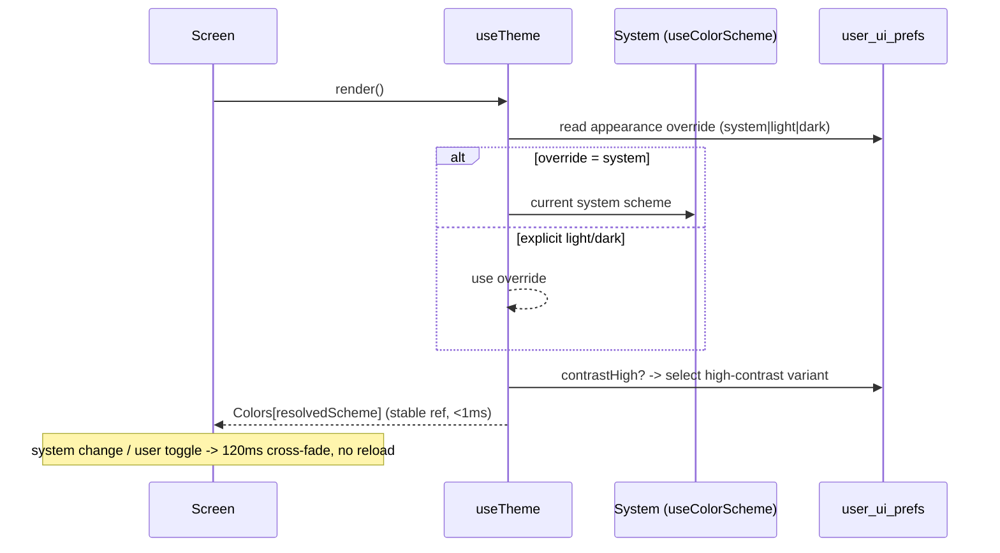

# 03 · Design System & UI

> Follows the [Master PRD Template](./00-prd-template.md). This is the **canonical design
> doc**: every other module links here for tokens, components, motion, and iconography
> instead of re-defining them. It is the single source of truth for how Numil looks and
> feels on iOS — "simple by default, deep on demand."

---

## 1. Purpose

The Design System defines Numil's visual language and the reusable component library that
makes 40+ modules feel like **one cohesive, native iOS app**. It is not a screen; it is the
infrastructure every screen consumes.

**User problem it solves.** Productivity apps drift into inconsistency (Jira/ClickUp) —
different paddings, colors, and controls per screen create cognitive load and slow the app.
Numil must feel as calm and consistent as **Things 3** and **Apple Reminders**, while
scaling to **Linear/Notion-grade** density on demand. A shared token + component layer is
what keeps the "primary action obvious in one thumb tap" promise across the whole product.

**Consumer goals (the teams who use this doc)**
- Build any screen from pre-approved primitives without re-deciding spacing/color/type.
- Guarantee light/dark/high-contrast/Dynamic Type parity for free.
- Ship iOS-native affordances (sheets, swipe, context menus, haptics, SF Symbols).
- Keep bundle size and render cost predictable via a fixed component set.

**Business goals**
- Velocity: new modules assemble from a catalog instead of custom UI.
- Brand: a recognizable, premium, restrained aesthetic.
- Accessibility & compliance: WCAG 2.2 AA baked into primitives, reducing per-screen risk.

**KPIs:** % of screens using only tokenized values (target 100%, enforced by lint), design
QA defects per release, Dynamic Type/AX5 clipping bugs (→0), component reuse rate, and
time-to-build a new screen.

The real token source lives in `src/constants/theme.ts`; theme-aware primitives live in
`src/components/` (`themed-text.tsx`, `themed-view.tsx`) resolved through the
`useTheme()` hook in `src/hooks/use-theme.ts`.

---

## 2. Navigation

The design system has **no user-facing route** — it is imported, not visited. Its "entry
points" are developer-facing and the theme-preference surface it powers.

**Consumption entry points**
- Import tokens: `import { Colors, Fonts, Spacing } from '@/constants/theme'`.
- Import primitives: `ThemedText`, `ThemedView` from `@/components/*`.
- Resolve active palette at runtime: `useTheme()` (returns `Colors.light | Colors.dark`).
- Tab-bar iconography and layout constants come from `src/components/app-tabs.tsx` and
  `BottomTabInset` / `MaxContentWidth` in `theme.ts`.

**User-facing theming controls** live in [15 · Profile & Settings](./15-profile-settings.md):
Appearance (System / Light / Dark), Text Size (defers to iOS Dynamic Type), Increase
Contrast, Reduce Motion mirror, and (v2) Density (Comfortable / Compact). Org-level design
defaults (brand accent, default appearance) are set in
[30 · Workspace Administration](./30-workspace-administration.md).

**App identity (from `app.json`):** scheme `numil://`, bundle `com.sanketsss.numil`, splash
background `#208AEF` (the seed for the `tint` token), `userInterfaceStyle: automatic`
(system-driven light/dark). There are **no deep links** into the design system itself.

**Transitions** between themes are instantaneous cross-fades (see §14); switching appearance
never causes a flash of unstyled content because tokens resolve synchronously via `useTheme`.

**Appearance-resolution sequence** (how a screen picks its palette):



---

## 3. Complete UI Layout

The design system expresses layout through a **canonical screen skeleton** every module
inherits: large-title header → scrollable content → optional floating primary action →
bottom tab bar. Below is the reference skeleton with iOS spacing annotations.

```text
┌───────────────────────────────────────────────┐
│▔▔▔▔▔  Dynamic Island / status bar safe area  ▔▔│  ← inset from safe-area-context
├───────────────────────────────────────────────┤
│  Large Title                          ⊙ avatar │  ← collapses to inline title on scroll
│  Subtitle / count                       ⌕  ⋯   │  ← glass nav bar, blurs under content
├───────────────────────────────────────────────┤
│  ▓ Section header (sticky)                      │
│  ┌─────────────────────────────────────────┐  │
│  │ (◯) Task title              ⚑  📅  👤     │  │  ← TaskRow, min 44pt, swipeable
│  └─────────────────────────────────────────┘  │
│  ┌─────────────────────────────────────────┐  │
│  │ (◯) Another task                 #label  │  │
│  └─────────────────────────────────────────┘  │
│                                                 │
│           (generous empty space = calm)         │
│                                                 │
│                                       ╭──────╮  │
│                                       │  ＋   │  │  ← FAB / QuickAdd, thumb zone
│                                       ╰──────╯  │
├───────────────────────────────────────────────┤
│   ▤ Home    ✓ Tasks    ⧉ Cal    ⋯ More         │  ← tab bar + home-indicator inset
└───────────────────────────────────────────────┘
```

**Layout rules encoded by the system**
- **Top:** glass (`UIBlurEffect`-style) nav bar with iOS **large title** that collapses to
  a compact inline title on scroll; content scrolls *under* the blur. Respects the Dynamic
  Island + top safe-area inset via `react-native-safe-area-context`.
- **Horizontal gutters:** `Spacing.three` (16pt) screen padding; cards inset a further
  `Spacing.three`.
- **Content column:** capped at `MaxContentWidth` (800pt) and centered on iPad/large screens.
- **Bottom:** primary action floats in the thumb zone; the tab bar reserves `BottomTabInset`
  (iOS 50 / Android 80) plus the home-indicator safe area.
- **Empty space is a feature:** at rest a screen shows one primary action + ≤5 secondary
  affordances (north-star rule); everything else hides behind `⋯`, long-press, and sheets.
- **Landscape / iPad:** the column centers with side margins up to `MaxContentWidth`; master–
  detail modules (Task Detail, Projects) become **two-pane** with a persistent sidebar.
- **Sheets** use 16pt top-corner radius, grabber handle, and medium→large detents.

---

## 4. Complete Component Breakdown

The catalog is grouped by tier. **Primitives** are theme-aware building blocks; **controls**
are interactive; **composites** assemble primitives for domain use. All resolve color via
`useTheme()` and spacing via `Spacing`.

| Tier | Components |
|------|-----------|
| Primitives | `ThemedText` (types: `default`/`title`/`subtitle`/`small`/`smallBold`/`link`/`linkPrimary`/`code`), `ThemedView`, `Surface`/`Card`, `Divider`/`Separator`, `Spacer`, `Icon` (SF Symbols via `expo-symbols`), `Avatar`, `Badge`, `Skeleton` |
| Buttons & inputs | `Button` (primary/secondary/tonal/plain/destructive), `IconButton`, `FAB`, `TextField`, `SearchField`, `Toggle`/`Switch`, `Checkbox`/`TaskCheckbox`, `SegmentedControl`, `Stepper`, `Slider`, `Picker`/`PickerSheet` |
| Chips & indicators | `Chip`, `LabelChip`, `DueChip`, `PriorityFlag`, `StatusChip`, `ProgressBar`, `ProgressRing`, `AvatarStack`, `Tag`, `CountBadge`, `PresenceDot` |
| Rows & lists | `ListRow`, `DisclosureRow`, `TaskRow`, `SectionHeader` (sticky), `SwipeActions`, `EmptyState`, `LoadMoreFooter` |
| Overlays | `BottomSheet` (`@gorhom/bottom-sheet`), `ContextMenu` (iOS), `Popover`, `ActionSheet`, `Alert`/`ConfirmDialog`, `Toast`/`Snackbar` (with undo), `Banner` (offline/error/info), `Tooltip`, `Coachmark` |
| Navigation | `GlassNavBar`, `LargeTitleHeader`, `TabBar`, `Breadcrumb`, `Segmented` view switcher, `BackButton` |
| Content editors | `RichTextEditor`, `MarkdownRenderer`, `InlineEditor`, `EmojiPicker`, `AttachmentGrid`, `MediaPreview`, `LinkPreviewCard`, `VoiceRecorder` |
| AI & collab | `AIButton` (✨), `AIResponseCard`, `ReactionBar`, `MentionAutocomplete`, `CommentBubble`, `TypingIndicator` |
| Feedback | `HapticsService`, `LoadingDots`, `PullToRefresh`, `ShimmerPlaceholder` |

Existing in-repo primitives this catalog builds on:

```11:31:src/components/themed-text.tsx
export function ThemedText({ style, type = 'default', themeColor, ...rest }: ThemedTextProps) {
  const theme = useTheme();

  return (
    <Text
      style={[
        { color: theme[themeColor ?? 'text'] },
        type === 'default' && styles.default,
        type === 'title' && styles.title,
        type === 'small' && styles.small,
        type === 'smallBold' && styles.smallBold,
        type === 'subtitle' && styles.subtitle,
        type === 'link' && styles.link,
        type === 'linkPrimary' && styles.linkPrimary,
        type === 'code' && styles.code,
        style,
      ]}
      {...rest}
    />
  );
}
```

```12:16:src/components/themed-view.tsx
export function ThemedView({ style, lightColor, darkColor, type, ...otherProps }: ThemedViewProps) {
  const theme = useTheme();

  return <View style={[{ backgroundColor: theme[type ?? 'background'] }, style]} {...otherProps} />;
}
```

Every component documents: props, states (default/pressed/disabled/loading/selected/error),
tokens consumed, VoiceOver contract, and Reduce-Motion behavior. New screens **must** compose
from this catalog; bespoke UI requires a design-system PR that adds a reusable primitive.

---

## 5. Modern Features

Each capability of the design system, framed as the template's feature contract:
**Purpose · Workflow · UI · Permissions · Offline · API · DB · Notify · AC.**

### 5.1 Design token system ✅
- **Purpose:** one source of truth for color/spacing/type so screens never hardcode values.
- **Workflow:** import from `theme.ts`; resolve palette with `useTheme()`; a lint rule
  (`no-magic-color`/`no-magic-spacing`) fails builds that use raw hex or px.
- **UI:** invisible; expressed through every component.
- **Permissions:** N/A (developer-facing).
- **Offline:** fully offline — tokens are compiled into the bundle, no network.
- **API (token API):** `Colors.light|dark[token]`, `Spacing[step]`, `Fonts[family]`,
  `BottomTabInset`, `MaxContentWidth`.
- **DB:** none for base tokens; user overrides (appearance/density) persisted per §16.
- **Notify:** none.
- **AC:** 100% of shipped screens pass the token lint; no raw hex/px in `src/app/**`.

**Base color tokens** (canonical, in `src/constants/theme.ts` — do **not** fork these):

```10:25:src/constants/theme.ts
export const Colors = {
  light: {
    text: '#000000',
    background: '#ffffff',
    backgroundElement: '#F0F0F3',
    backgroundSelected: '#E0E1E6',
    textSecondary: '#60646C',
  },
  dark: {
    text: '#ffffff',
    background: '#000000',
    backgroundElement: '#212225',
    backgroundSelected: '#2E3135',
    textSecondary: '#B0B4BA',
  },
} as const;
```

**Semantic token extensions** (proposed additions to `Colors.light`/`Colors.dark`; the seed
`tint` matches the splash `#208AEF` in `app.json`). These add *meaning* on top of the base
neutrals and must never be hardcoded per-screen:

| Token | Light | Dark | Use |
|-------|-------|------|-----|
| `tint` | `#208AEF` | `#3A9BFF` | Primary brand/action (matches splash `#208AEF`) |
| `success` | `#1F9D55` | `#31C48D` | Completed / positive |
| `warning` | `#B7791F` | `#F6C445` | Due soon |
| `danger` | `#D64545` | `#FF6B6B` | Overdue / destructive |
| `priorityLow` | `#8A8F98` | `#9CA3AF` | Low priority |
| `priorityMed` | `#B7791F` | `#F6C445` | Medium priority |
| `priorityHigh` | `#E8833A` | `#FF9F45` | High priority |
| `priorityUrgent` | `#D64545` | `#FF6B6B` | Urgent priority |
| `separator` | `#E3E4E8` | `#2A2C30` | Hairline dividers |
| `onTint` | `#FFFFFF` | `#0A0A0A` | Text/icon on `tint` fills (contrast-checked) |

**Font families** resolve to the iOS system faces (SF Pro / SF Rounded / SF Mono) via `Fonts`:

```29:52:src/constants/theme.ts
export const Fonts = Platform.select({
  ios: {
    /** iOS `UIFontDescriptorSystemDesignDefault` */
    sans: 'system-ui',
    /** iOS `UIFontDescriptorSystemDesignSerif` */
    serif: 'ui-serif',
    /** iOS `UIFontDescriptorSystemDesignRounded` */
    rounded: 'ui-rounded',
    /** iOS `UIFontDescriptorSystemDesignMonospaced` */
    mono: 'ui-monospace',
  },
  default: {
    sans: 'normal',
    serif: 'serif',
    rounded: 'normal',
    mono: 'monospace',
  },
  web: {
    sans: 'var(--font-display)',
    serif: 'var(--font-serif)',
    rounded: 'var(--font-rounded)',
    mono: 'var(--font-mono)',
  },
});
```

**Spacing & layout constants** (4pt base scale; all paddings/margins/gaps use these steps):

```54:65:src/constants/theme.ts
export const Spacing = {
  half: 2,
  one: 4,
  two: 8,
  three: 16,
  four: 24,
  five: 32,
  six: 64,
} as const;

export const BottomTabInset = Platform.select({ ios: 50, android: 80 }) ?? 0;
export const MaxContentWidth = 800;
```

Usage rules: screen gutters = `Spacing.three` (16); card radius 12–16pt; sheet top radius 16pt;
row height ≥44pt (task rows ~64pt); content column caps at `MaxContentWidth` (800pt).

### 5.2 Theming engine (light / dark / high-contrast) ✅
- **Purpose:** automatic light/dark + optional high-contrast, matching iOS.
- **Workflow:** `userInterfaceStyle: automatic` (app.json) drives `useColorScheme()`;
  `useTheme()` returns the active `Colors` object; user can override to Light/Dark in Settings.
- **UI:** instant cross-fade on change; no unstyled flash (synchronous resolve).
- **Permissions:** N/A.
- **Offline:** full.
- **API:** `useTheme()`, `useColorScheme()`; high-contrast variant selected when
  `AccessibilityInfo.isHighTextContrastEnabled`.
- **DB:** `appearance` pref in local settings + synced user profile (see §16).
- **Notify:** none.
- **AC:** both themes pass 4.5:1 text contrast; override persists across launches.

### 5.3 Component library delivery ✅
- **Purpose:** ship a consistent catalog (see §4) consumed by all modules.
- **Workflow:** teams import components; Storybook-style catalog screen (dev build) renders
  every state; visual-regression snapshots gate merges.
- **UI:** the catalog itself + each component's documented states.
- **Permissions:** N/A.
- **Offline:** full.
- **API:** typed React props per component; variants via `variant`/`type` props.
- **DB:** none.
- **Notify:** none.
- **AC:** every catalog component has default/pressed/disabled/loading/error snapshots at
  default + AX5 Dynamic Type, light + dark.

### 5.4 Dynamic Type & typography scale ✅
- **Purpose:** text scales with the user's iOS text-size setting without clipping.
- **Workflow:** styles use scalable sizes mapped to iOS text styles; layouts reflow.
- **UI:** Large Title → Caption ramp (see the typography table below).
- **Permissions:** N/A.
- **Offline:** full.
- **API:** `ThemedText type="..."`; `allowFontScaling` on by default.
- **DB:** none (system setting).
- **Notify:** none.
- **AC:** no essential text clips at AX5; line-height scales proportionally.

**Typography ramp** (points at default Dynamic Type; each maps to an iOS text style and scales
XS→AX5). `ThemedText` `type` props map onto this ramp:

| Style | `ThemedText type` | Size / line-height | Weight | Use |
|-------|-------------------|--------------------|--------|-----|
| Large Title | `title` | 34 / 41 | Bold | Screen headers (Home, My Tasks) |
| Title 1 | `title` | 28 / 34 | Bold | Section headers |
| Title 3 | `subtitle` | 20 / 25 | Semibold | Card titles |
| Body | `default` | 17 / 24 | Regular | Task titles, content |
| Callout | `default` | 16 / 22 | Regular | Secondary content |
| Subhead | `small` | 15 / 20 | Regular | Metadata (due dates) |
| Footnote | `small` | 13 / 18 | Regular | Timestamps, captions |
| Caption | `small` | 12 / 16 | Regular | Labels, chips |
| Link | `link` / `linkPrimary` | 14 / 30 | Regular | Inline links |
| Code | `code` | 12 / 16 | Mono | Inline code / IDs |

The in-repo `ThemedText` styles (see §4 code reference) are the concrete implementation; new
text must use a `type` rather than ad-hoc `fontSize`.

### 5.5 iOS interaction patterns ✅
- **Purpose:** native swipe, long-press context menus, pull-to-refresh, sheets, haptics.
- **Workflow:** `SwipeActions` (right → Complete, left → Snooze/Delete/Assign), iOS
  `ContextMenu` on long-press, `PullToRefresh` on lists, `BottomSheet` for detail/pickers.
- **UI:** finger-tracking swipe pills; context-menu preview; grabber sheets.
- **Permissions:** action availability follows resource RBAC (destructive hidden if not
  allowed).
- **Offline:** all gestures work offline (optimistic).
- **API:** `<SwipeActions leading={[Complete]} trailing={[Snooze, Delete]} />`.
- **DB:** none (renders others' data).
- **Notify:** none directly.
- **AC:** swipe/long-press/pull-to-refresh function on all lists; haptics fire per §14 map.

### 5.6 Glass materials & elevation ✅
- **Purpose:** native depth via translucent blur (nav bar, tab bar, sheets).
- **Workflow:** blur materials layer over content; solid fallback under Reduce Transparency.
- **UI:** `GlassNavBar`, `TabBar`, sheet backdrops; elevation via subtle shadow + separator.
- **Permissions:** N/A.
- **Offline:** full.
- **API:** `Surface` `elevation` prop (0–4) → shadow token; `blur` prop toggles material.
- **DB:** none.
- **Notify:** none.
- **AC:** Reduce Transparency swaps blur for `backgroundElement`; contrast preserved.

### 5.7 Density modes (Comfortable / Compact) 🟣
- **Purpose:** power users (esp. iPad) get more rows per screen; casual users stay calm.
- **Workflow:** Settings → Density; a multiplier scales row heights and paddings.
- **UI:** `TaskRow` shrinks from ~64pt to ~48pt; chips tighten.
- **Permissions:** per-user preference.
- **Offline:** full.
- **API:** `useDensity()` returns spacing multiplier applied to `Spacing`.
- **DB:** `density` pref (§16).
- **Notify:** none.
- **AC:** density persists; never reduces tap targets below 44pt.

---

## 6. Smart AI Features

The design system provides the **shared surfaces** the [AI Assistant & Copilot](./19-ai-assistant-copilot.md)
renders into — it does not run models. Contributions:

| Capability | Design-system responsibility |
|-----------|------------------------------|
| ✨ entry point | `AIButton` — a standardized sparkle affordance used identically in every composer/overflow, with a Reduce-Motion-safe micro-animation. |
| Streaming answers | `AIResponseCard` with `StreamingCursor`, per-chunk fade-in, and `accessibilityLiveRegion` politeness baked in. |
| Proposals | `TaskProposalCard` / `DiffPreview` with a standardized `[Accept][Edit][Undo]` action bar so AI never mutates without confirmation. |
| Provenance | `SourceCitationChip` + `AIDisclosureBadge` for RAG answers and governance transparency. |
| Theming of AI | AI surfaces reuse `tint` for accents and never introduce off-token colors. |

**Design-native AI (💡 Experimental):** an internal "token contrast auditor" that flags any
new component whose color pair fails 4.5:1, and a layout linter that detects >1 primary
action per screen. These assist designers, not end users, and are logged as build warnings.

---

## 7. Productivity Features

The system optimizes for **speed of building calm, fast screens**:
- **QuickAdd primitives** (`QuickAddBar`, inline NLP highlight styles) so every module gets a
  <5s capture surface with consistent look.
- **Swipe/long-press quick actions** standardized so muscle memory transfers across screens.
- **Keyboard & Full Keyboard Access** styles (focus ring token, `⌘K` command palette shell on
  iPad) shared by all modules.
- **Skeletons over spinners** everywhere via `Skeleton`/`ShimmerPlaceholder` — perceived
  performance is a design default, not a per-screen choice.
- **Empty states** (`EmptyState`) with icon + one-line + single CTA to keep new users moving.

---

## 8. Enterprise Features

- **Org brand theming (🔜):** admins set a brand `tint` and default appearance in
  [30 · Workspace Administration](./30-workspace-administration.md); the token layer applies it
  app-wide without code changes (validated for contrast before it can be saved).
- **White-label (🟣):** app icon/splash/accent overrides for enterprise plans (build-time via
  EAS, project `fc24f4f1-…` in `app.json`).
- **Accessibility compliance as contract:** WCAG 2.2 AA is enforced in primitives, giving
  enterprises a defensible baseline (see [40 · Security & Compliance Center](./40-security-compliance-center.md)).
- **Design governance:** additions require a catalog PR + visual-regression + contrast check,
  preventing drift across a large org's screens.

**Design & appearance permission matrix** (who can change what; roles per
[shared/rbac-permissions.md](./shared/rbac-permissions.md)):

| Action | Owner | Admin | Manager | Member | Guest |
|--------|:-----:|:-----:|:-------:|:------:|:-----:|
| Set personal appearance/density/contrast | ✅ | ✅ | ✅ | ✅ | ✅ |
| Set org default appearance | ✅ | ✅ | ❌ | ❌ | ❌ |
| Set org brand `tint` / logo | ✅ | ✅ | ❌ | ❌ | ❌ |
| White-label build overrides (🟣) | ✅ | ❌ | ❌ | ❌ | ❌ |
| Add/modify design-system component (repo) | dev team via PR + review | | | | |

Personal UI prefs are always self-serve; org-wide visual identity is Owner/Admin-gated and
contrast-validated server-side before it can be saved.

---

## 9. Collaboration Features

The design system supplies the **shared collaboration primitives** used by Task Detail, Chat,
and Docs so collaboration looks identical everywhere:
- `PresenceDot` / `AvatarStack` (who's here), `TypingIndicator`, `ReactionBar`,
  `MentionAutocomplete`, `CommentBubble`.
- Consistent realtime affordances (live-update highlight flash on changed rows, `motion.fast`).
- A single `Coachmark`/`Tooltip` style for guided, non-blocking collaboration hints.

These are visual contracts only; behavior/permissions live in the consuming modules
([10 · Task Detail](./10-task-detail.md), [26 · Team Chat](./26-team-chat-collaboration.md)).

---

## 10. Offline Architecture

Deltas over [shared/offline-sync-engine.md](./shared/offline-sync-engine.md):
- The design system is **100% offline** — tokens and components are bundled; no runtime fetch.
- The only persisted state is **user UI preferences** (appearance, density, contrast, reduce-
  motion mirror). These write locally first (optimistic) and sync to the user profile as a
  normal `update` op; last-write-wins across devices.
- No design asset is blocked by network; brand-theme overrides fetched once are cached and
  reused offline with the last-known value.

---

## 11. Security

Deltas over [shared/security-baseline.md](./shared/security-baseline.md):
- The design layer stores **no secrets or PII**; theme prefs contain no sensitive data.
- Brand-theme override URLs (logos) are validated (allowed hosts, size/type) and rendered via
  `expo-image` with no HTML injection surface.
- `MarkdownRenderer`/`RichTextEditor` are shared primitives that **sanitize** input (no
  script/HTML execution) — a single audited implementation reduces XSS risk across modules.
- Respects `ITSAppUsesNonExemptEncryption: false` (app.json): standard HTTPS only, no custom
  crypto in the UI layer.

---

## 12. Notification System

Deltas over [12 · Notifications & Alerts](./12-notifications-alerts.md):
- The design system contributes **visual notification primitives**: in-app `Banner`,
  `Toast`/`Snackbar` (with undo), `CountBadge` (tab/app badge styling), and the notification
  content styles used on Live Activities / Dynamic Island.
- It does **not** schedule or deliver notifications; it standardizes how they look and how
  action buttons are laid out so every module's alerts are visually consistent.

---

## 13. Accessibility

Deltas over [shared/accessibility-spec.md](./shared/accessibility-spec.md) — the design system
is where a11y is **implemented**, so this section is unusually load-bearing:
- Every primitive ships a VoiceOver contract (role, label, value, hint, `accessibilityActions`).
- Dynamic Type: `ThemedText` scales XS→AX5; snapshot tests run at AX5 to catch clipping.
- Reduce Motion / Reduce Transparency / Increase Contrast / Bold Text honored by tokens.
- Color is **never** the only signal: priority = flag + label + color; status = chip + text.
- Minimum tap target 44×44pt (48pt for primary) enforced by `Button`/`IconButton` defaults.
- Full RTL via logical `start/end` spacing; pseudo-locale smoke test in CI.

---

## 14. Animations

Deltas over [shared/animation-spec.md](./shared/animation-spec.md) — the design system owns the
motion tokens other modules reference:
- Exposes `motion.instant|fast|base|slow` and `spring.snappy|gentle|bouncy` (Reanimated 4
  worklets, UI thread) plus the `expo-haptics` map.
- **Press:** scale 1→0.97 (`motion.fast`) + `impactLight`. **Checkbox complete:** ring fill +
  checkmark draw + `notificationSuccess`. **Sheet:** `spring.gentle`. **Toast:** slide-up +
  fade `motion.base`.
- **Theme switch:** 120ms cross-fade, never a hard cut.
- Reduce Motion swaps movement for cross-fades; disables confetti/parallax/shimmer globally
  from one place (so no module re-implements it).

---

## 15. Performance

- **Zero runtime token cost:** `Colors`/`Spacing`/`Fonts` are `as const` objects — no theme
  provider re-render storms; `useTheme()` returns a stable reference per scheme.
- **List virtualization:** all list composites assume **FlashList**; `TaskRow` is memoized and
  avoids inline style objects (styles precomputed with tokens).
- **GPU-friendly motion:** animate `transform`/`opacity` only; 60fps (ProMotion 120fps aware).
- **Image pipeline:** `expo-image` with placeholders + LRU cache for avatars/attachments.
- **Bundle discipline:** SF Symbols via `expo-symbols` (no icon-font bloat); heavy editors
  (`RichTextEditor`, pickers) are lazy-imported/code-split by consuming screens.
- **Budget:** design layer adds <150KB gzip; theme resolve <1ms; no main-thread jank on
  appearance change.

---

## 16. Database Design

The design system persists only **UI preferences**; visual tokens are code, not data.

```text
user_ui_prefs(user_id→users, appearance, contrast_high, reduce_motion_override,
              density, dynamic_type_override?, updated_at, version)
              -- appearance ∈ {system,light,dark}; density ∈ {comfortable,compact}
org_brand_theme(org_id→orgs, tint_hex, appearance_default, logo_url?, updated_at, version)
              -- enterprise brand overrides; contrast-validated before write
design_tokens(version, name, light_hex, dark_hex, contrast_ratio, category)
              -- OPTIONAL server registry mirroring theme.ts for a future no-ship theming API
```

**Relationships:** `user_ui_prefs` 1:1 `users`; `org_brand_theme` 1:1 `orgs`.
**Indexes:** `user_ui_prefs(user_id)` PK; `org_brand_theme(org_id)` PK.
**Constraints:** `tint_hex` must pass server-side contrast validation (≥4.5:1 vs both
backgrounds) before insert/update; `density`/`appearance` are enumerated.
**Soft-delete/history:** prefs are last-write-wins scalars (no soft delete); `org_brand_theme`
changes append a row to the org audit log (who/what/when) via [29 · Activity & Audit](./29-activity-feed-audit-logs.md).
Aligns with [17 · Data Model & API](./17-data-model-api.md).

---

## 17. API Design

Follows [shared/api-conventions.md](./shared/api-conventions.md). The design system's runtime
API is mostly **client-side** (token/hook API); the network surface is limited to preferences
and enterprise brand theming.

| Method | Path | Purpose |
|--------|------|---------|
| GET | `/me/ui-prefs` | Fetch the user's appearance/density/contrast prefs |
| PATCH | `/me/ui-prefs` (If-Match) | Update UI prefs (partial) |
| GET | `/orgs/:id/brand-theme` | Fetch org brand tint/appearance/logo |
| PUT | `/orgs/:id/brand-theme` (Admin) | Set org brand (contrast-validated) |
| GET | `/design-tokens?version=` 💡 | Optional server token registry (future OTA theming) |

**Realtime:** `user:{id}` → `ui_prefs.updated` (multi-device sync); `org:{id}` →
`brand_theme.updated` (apply new accent live). **Errors:** `422 validation_failed` when a
brand `tint` fails contrast (`details[].field = "tintHex"`); `403 forbidden` for non-admin
brand writes. **Idempotency-Key** on writes.

**Sample request/response**
```http
PATCH /v1/me/ui-prefs   If-Match: 4
Content-Type: application/json
Idempotency-Key: 6f1c…

{ "appearance": "dark", "density": "compact", "contrastHigh": true }
```
```json
{
  "data": { "userId": "u_88", "appearance": "dark", "density": "compact",
            "contrastHigh": true, "reduceMotionOverride": false, "version": 5 },
  "meta": { "requestId": "req_9a2" }
}
```

---

## 18. Edge Cases

- **System appearance changes mid-session** (auto light→dark at sunset): tokens re-resolve via
  `useColorScheme`; screens cross-fade with no reload.
- **User override vs system:** explicit Light/Dark wins over `automatic` until reset.
- **AX5 + Compact density:** density never shrinks below 44pt targets; density is capped when
  Dynamic Type is very large.
- **Reduce Transparency on glass surfaces:** blur → solid `backgroundElement`; borders added
  to preserve separation.
- **Brand tint fails contrast:** save blocked with a specific message; last valid tint kept.
- **Missing/oversized org logo:** falls back to monogram avatar; oversized rejected.
- **RTL locale:** all `start/end` spacing mirrors; icons that imply direction flip.
- **Offline pref change then remote change:** last-write-wins by server timestamp; UI reconciles
  silently.
- **New token referenced before defined (dev error):** typed access fails at compile time.
- **ProMotion vs 60Hz device:** motion tokens are duration-based, not frame-based — identical
  feel on both.

---

## 19. User States

- **First-time:** default System appearance, Comfortable density; coach-marks use `Coachmark`.
- **Returning/power (iPad):** may enable Compact density + keyboard focus ring; two-pane layouts.
- **Guest:** identical visual system; only content scope differs (no design change).
- **Manager/Admin/Owner:** Admin/Owner additionally see org brand-theme controls (module 30).
- **Offline / poor network:** full visual fidelity; no spinners — skeletons only.
- **Tablet/landscape:** centered `MaxContentWidth` column; two-pane where applicable.
- **Dark mode:** `Colors.dark` palette; true-black background (`#000000`) for OLED.
- **Large text / high contrast / bold text / reduce motion:** all honored via tokens.
- **RTL:** fully mirrored.

---

## 20. Analytics Events

Schema per [shared/analytics-taxonomy.md](./shared/analytics-taxonomy.md). The design system
emits only **preference + a11y** events (never content).

| event | key properties |
|-------|----------------|
| `appearance_changed` | `to` (system/light/dark), `source` (settings/system) |
| `density_changed` | `to` (comfortable/compact) |
| `contrast_toggled` | `enabled` |
| `dynamic_type_detected` | `size_bucket` (xs…ax5) |
| `reduce_motion_detected` | `enabled` |
| `brand_theme_updated` | `org_id`, `changed` (tint/appearance/logo) |
| `component_error_boundary` | `component`, `screen` (render failure telemetry, no content) |

These power adoption dashboards (e.g., % on dark mode, AX5 usage informing QA priorities).

---

## 21. Acceptance Criteria

1. All screens resolve color exclusively through `useTheme()` / `Colors` tokens.
2. All spacing uses the `Spacing` scale; no magic px values in `src/app/**`.
3. The token lint (`no-magic-color`/`no-magic-spacing`) fails builds on violations.
4. Light and dark themes both pass ≥4.5:1 text contrast (≥3:1 large text/icons).
5. A high-contrast variant exists and is applied when the system flag is on.
6. `userInterfaceStyle: automatic` drives light/dark; user override persists across launches.
7. Theme switching cross-fades with no flash of unstyled content.
8. `ThemedText` scales from XS to AX5 without clipping essential text.
9. Line-height scales proportionally with Dynamic Type.
10. Every catalog component documents default/pressed/disabled/loading/error states.
11. Visual-regression snapshots exist per component at default + AX5, light + dark.
12. Minimum tap target is 44×44pt (48pt primary), enforced by `Button`/`IconButton`.
13. Swipe (right=Complete, left=Snooze/Delete/Assign) works on all list composites.
14. Long-press opens an iOS context menu on task rows.
15. Pull-to-refresh works on all scrollable lists.
16. Bottom sheets use 16pt top radius, grabber, and medium→large detents.
17. Glass nav bar/tab bar blur content and respect safe areas + Dynamic Island.
18. Reduce Transparency swaps blur for solid `backgroundElement`.
19. Reduce Motion disables confetti/parallax/shimmer globally and uses cross-fades.
20. Haptics fire per the shared map (light press, success complete, warning destructive).
21. Content column caps at `MaxContentWidth` (800pt) and centers on iPad/landscape.
22. Master–detail modules render two-pane on iPad/landscape.
23. Tab bar reserves `BottomTabInset` + home-indicator safe area.
24. SF Symbols are used via `expo-symbols` (no bespoke icon font).
25. All interactive elements expose VoiceOver role/label/value/hint + actions.
26. Color is never the sole signal (icon/label always paired).
27. RTL layouts mirror using logical start/end spacing.
28. `MarkdownRenderer`/`RichTextEditor` sanitize input against script/HTML injection.
29. UI preferences persist locally and sync via `PATCH /me/ui-prefs`.
30. Brand `tint` save is blocked (`422`) unless it passes server contrast validation.
31. Org brand-theme updates apply live via realtime without an app restart.
32. Skeletons replace spinners on all loading states.
33. `EmptyState` (icon + one-line + single CTA) is used for all empty lists.
34. Density mode (🟣) never reduces tap targets below 44pt.
35. Design-layer bundle impact stays <150KB gzip; appearance change causes no main-thread jank.
36. Analytics emit preference/a11y events only — never task content or PII.
37. At-rest screens honor the north-star rule: ≤1 primary + ≤5 secondary affordances.

---

## 22. Future Roadmap

- **V1 (✅):** token system, light/dark theming engine, component catalog, Dynamic Type,
  iOS interaction patterns, glass materials, motion + haptic tokens, WCAG 2.2 AA primitives.
- **V1.1 (🔜):** org brand `tint` + default appearance, high-contrast token set polish,
  command-palette shell for iPad, richer coach-mark system.
- **V2 (🟣):** density modes (Comfortable/Compact), white-label build overrides, live
  co-branding, expanded two-pane/split-view layouts, server-driven token registry preview.
- **Future (💡):** OTA theming (ship token updates without an app release), per-project accent
  colors, generative theme-from-logo, spatial/visionOS layout variants.
- **Experimental (🧪):** automated contrast auditor + "one-primary-action" layout linter in CI,
  motion personalization respecting per-user comfort.
- **AI track:** design-lint copilot that suggests the correct component/token for a mockup.
- **Enterprise track:** design compliance report (contrast/a11y coverage) exportable for audits.
