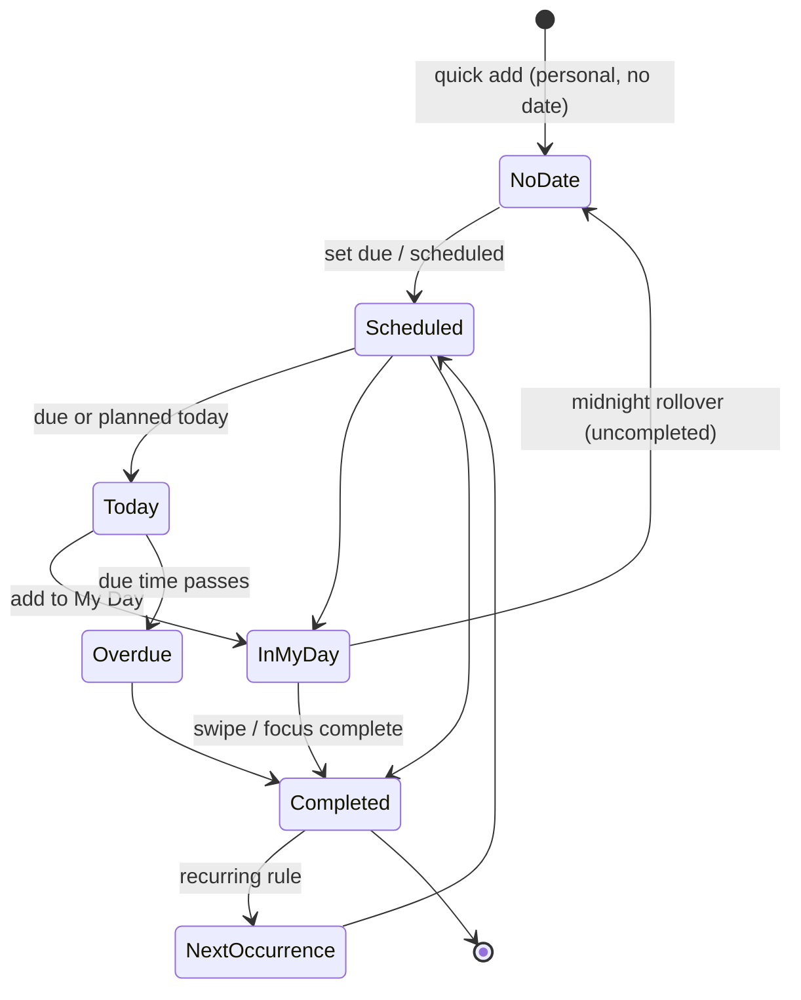

# 08 · My Tasks (Individual)

> Follows the [Master PRD Template](./00-prd-template.md). My Tasks is the personal command
> center — one place for everything a single human owns, whether it's a private personal
> task or a team task assigned to them.

---

## 1. Purpose

My Tasks is the individual's home base: a single, calm surface that merges **private
personal tasks** with **every team task assigned to them** across all projects. It answers
one question better than any other screen — *"What should I do, and when?"* — the way
Things 3, Todoist, TickTick, and Microsoft To Do do, but with Numil's org-aware data model.

**User problem it solves.** Team members live inside many projects; their own commitments
are scattered across boards they don't own. Personal reminders ("call the dentist") don't
belong in a shared project at all. Without a unified personal view, people either drop work
or build a shadow list in Notes. My Tasks consolidates both worlds without leaking personal
data into the org.

**User goals**
- See a trustworthy, complete picture of *my* obligations (personal + assigned).
- Triage fast: complete, reschedule, reprioritize with one thumb.
- Plan a day with **My Day** (Microsoft To Do) and enter **Focus** on a single task.
- Capture a personal task in <5s via Quick Add without choosing a project.

**Business goals**
- Daily active anchor screen → drives retention and habit formation (`app_opened` → My Tasks).
- Surfaces assigned team work → feeds collaboration and completion metrics.
- Home for monetized personal power (AI day planning, Focus, unlimited reminders).

**KPIs:** DAU landing on My Tasks, tasks completed/day, `my_day_added` adoption,
reschedule-vs-overdue ratio (planning health), % personal tasks with due dates, first-week
retention for users who add ≥3 personal tasks.

---

## 2. Navigation

**Entry points**
- **Tab bar → My Tasks** (`checklist` icon) — default landing tab for individual-mode users.
- Sidebar **Quick Views** (Today, Upcoming, Assigned to me, Flagged) deep-link into filtered
  My Tasks. See [04 · Navigation & Sidebar](./04-navigation-sidebar.md).
- Home dashboard "My day" card → My Tasks scoped to today. See [07 · Home Dashboard](./07-home-dashboard.md).
- Deep link `numil://my-tasks?view=today`, `numil://my-tasks?group=priority`.
- Widget / Live Activity tap → My Tasks (Today). See [33 · Widgets, Live Activities & Watch](./33-widgets-live-activities-watch.md).

**Route:** `src/app/(tabs)/my-tasks/index.tsx`. Grouping/sort/filter live in the URL/query
state so views are shareable and restorable. Tapping a row **pushes or sheet-presents**
[10 · Task Detail](./10-task-detail.md) (`numil://task/{id}`).

**Navigation hierarchy & breadcrumbs**
```text
My Tasks ▸ [segment: Personal | Assigned to me | All] ▸ [group section]
```

**Transitions**
- Segment switch: content cross-fades (`motion.fast`); scroll position preserved per segment.
- Row → detail: shared-element hero on title + color dot (`motion.slow`).
- Quick Add: bottom sheet rises (`spring.gentle`); My Day and Focus open as full-screen
  push and cover-sheet respectively.

**Modal vs push:** Task detail is a **sheet** from a row (list stays underneath); **push**
when arriving from a deep link/widget. Focus mode is a **full-screen cover** (immersive).

---

## 3. Complete UI Layout

```text
┌───────────────────────────────────────────────┐
│  My Tasks                         ⌕   ⚙︎   ＋   │  ← large title, search, view/sort, add
│  ( Personal ) ( Assigned ) ( All )              │  ← segmented control
├───────────────────────────────────────────────┤
│  ☀️ My Day · 4 planned            Plan ▸        │  ← My Day banner (collapsible)
├───────────────────────────────────────────────┤
│  Group: Due date ▾    Sort: Manual ▾   ⚑ Filter │  ← grouping/sort/filter bar (sticky)
├───────────────────────────────────────────────┤
│  ▾ OVERDUE (2)                                  │  ← section header w/ count
│   ◯  Send invoice           ⚑  Yesterday        │  ← TaskRow: check, title, flag, due
│   ◯  Reply to Priya   #Marketing  ⏰ 9:00        │  ← team task shows project chip
│  ▾ TODAY (3)                                    │
│   ◯  Draft Q3 email   ▓▓░ 2/4    🔁  5:00 PM     │  ← subtask progress + recurrence
│   ◯  Gym                          ☀️            │  ← in My Day (sun glyph)
│  ▾ TOMORROW (1)   …                             │
│  ▸ NO DATE (5)                                  │  ← collapsed section
│  ─────────────────────────────────────────────  │
│  ▸ Completed (12)                    Show ▾     │  ← collapsed completed
├───────────────────────────────────────────────┤
│  ✨  ⌨︎  Add a task…              📅  ⚑   ➤      │  ← Quick Add bar (NLP + chips)
└───────────────────────────────────────────────┘
```

- **Top:** iOS **large title** "My Tasks" that collapses to an inline title on scroll,
  respecting Dynamic Island + top safe area. Trailing: search, a `view/sort` control
  (opens sheet), and a single primary **＋**. The **segmented control** (Personal /
  Assigned / All) is the one prominent secondary affordance.
- **My Day banner:** a slim, dismissible strip showing today's planned count and a **Plan**
  action; collapses to nothing when My Day is empty (calm-by-default).
- **Grouping/sort/filter bar:** sticky under the header; shows current group + sort as
  disclosure chips; a `⚑ Filter` chip badges when filters are active.
- **Middle:** a sectioned, virtualized list of `TaskRow`s. Sections have counts and are
  collapsible; the user's collapse state persists. Team tasks display a project color chip;
  personal tasks show none. Empty properties never render (no clutter).
- **Bottom:** the **Quick Add** bar floats above the keyboard + home-indicator safe area,
  with an ✨AI/NLP affordance, keyboard, and quick date/flag chips.
- **Landscape / iPad:** two-pane — the list on the left (master), Task Detail inspector on
  the right (detail). Grouping/sort move into a left sidebar rail. My Day gets its own
  right-pane planning column.
- **Tab bar:** visible on the list; hidden inside Focus mode.

---

## 4. Complete Component Breakdown

| Area | Components |
|------|-----------|
| Header | `LargeTitleHeader`, `SearchButton`, `ViewSortButton`, `AddButton` (FAB-in-nav), `SegmentedControl` (Personal/Assigned/All) |
| My Day | `MyDayBanner`, `MyDayPlanButton`, `MyDayChip` (sun glyph on rows) |
| Toolbar | `GroupByChip`, `SortChip`, `FilterChip` (badged), `ViewSwitchSegmented` (List/Board 🔜) |
| List | `SectionListVirtualized` (FlashList), `SectionHeader` (title+count, collapse chevron), `TaskRow`, `CompletedSectionToggle` |
| TaskRow | `TaskCheckbox` (animated), `TaskTitle`, `PriorityFlag`, `DueChip`, `ProjectChip`, `LabelChip`, `ProgressBar`/`ProgressRing`, `RecurrenceGlyph`, `AssigneeAvatar` (assigned tasks only), drag handle |
| Swipe / menu | `SwipeActionsLeading` (Complete), `SwipeActionsTrailing` (Snooze/Reschedule/Delete), `ContextMenu` (long-press), `RescheduleSheet` (Today/Tomorrow/Next week/Pick), `MultiSelectBar` (bulk) |
| Quick Add | `QuickAddBar`, `NLPParseHighlighter`, `AIButton`, `InlineDateChip`, `InlinePriorityChip`, `SendButton` |
| Focus | `FocusCover`, `FocusTimer` (Pomodoro), `NowPlayingTask`, `FocusExitButton` |
| Feedback | `Skeleton` rows, `Toast`/`Snackbar` (undo), `Banner` (offline/sync), `EmptyState`, `AllCaughtUpState` |
| AI | `AIDayPlanSheet`, `SuggestionChipRow` (parse preview) |

Primitives live in [03 · Design System & UI](./03-design-system-ui.md).

---

## 5. Modern Features

Each feature: **Purpose · Workflow · UI · Permissions · Offline · API · DB · Notify · AC.**
The lifecycle these features drive for a task surfaced in My Tasks:



### 5.1 Unified personal + assigned inbox ✅ v1
- **Purpose:** one list for private tasks and team tasks assigned to me.
- **Workflow:** the list unions `tasks WHERE owner=me AND project_id IS NULL` (personal)
  with `tasks WHERE assignee_id=me` (team). Segments filter the union.
- **UI:** segmented control; team rows carry a project chip + assignee is implicit (me).
- **Permissions:** personal tasks private to the owner (even Admins can't read); team tasks
  follow project role (see matrix).
- **Offline:** both sets mirrored locally; fully editable offline.
- **API:** `GET /me/tasks?segment=personal|assigned|all&filter[...]`.
- **DB:** `tasks.owner_id`, `tasks.assignee_id`, `tasks.project_id` (null ⇒ personal).
- **Notify:** none on view; assignment arrival already notified upstream.
- **AC:** personal tasks never appear for other users; assigned tasks appear within 1 sync.

### 5.2 Grouping & sorting ✅ v1
- **Purpose:** reshape the same tasks for different mental models.
- **Workflow:** pick **Group by** (Due date / Priority / Project / Label / None) and **Sort**
  (Due, Priority, Created, Alphabetical, **Manual**). Choice persists per segment per user.
- **UI:** `GroupByChip` + `SortChip` open a compact sheet with radio options.
- **Permissions:** personal preference; no gating.
- **Offline:** grouping/sort computed locally; instant.
- **API:** persisted as a lightweight user view: `PUT /me/views/my-tasks`.
- **DB:** `user_view_prefs(user_id, screen, group_by, sort, filter_json)`.
- **Notify:** none.
- **AC:** default group = Due date (Overdue/Today/Tomorrow/This week/Later/No date);
  selections survive relaunch; Manual sort enables drag.

### 5.3 Swipe actions & context menu ✅ v1
- **Purpose:** triage without opening detail.
- **Workflow:** **swipe leading → Complete**; **swipe trailing → Snooze / Reschedule /
  Delete**. Long-press → context menu (Edit, Set date, Priority, Add to My Day, Move to
  project, Flag, Delete). A partial swipe reveals the first action; full swipe commits.
- **UI:** `SwipeActions*` pills grow past threshold with a haptic; `ContextMenu` popover.
- **Permissions:** delete/complete allowed for owner (personal) or assignee/contributor
  (team). Viewers can't complete.
- **Offline:** all actions optimistic + queued.
- **API:** `POST /tasks/:id/complete`, `PATCH /tasks/:id`, `DELETE /tasks/:id`.
- **DB:** `completed_at`, `due_at`, `deleted_at` (soft), `activity_log` row.
- **Notify:** completing a team task notifies watchers; reschedule reschedules reminders.
- **AC:** every swipe is undoable via 5s snackbar; full-swipe-complete fires success haptic.

### 5.4 Quick Add with NLP ✅ v1
- **Purpose:** capture in one line; default to a **personal** task.
- **Workflow:** type "Pay rent tomorrow 9am !high #home every month" → parses due, time,
  priority, label, recurrence. New items default to personal (no project). A leading `#`
  can target a project the user can create in.
- **UI:** `QuickAddBar` with inline parse highlights; confirm chip preview; ✨ opens fuller AI.
- **Permissions:** any member can create personal tasks; project targeting needs create scope.
- **Offline:** on-device parser handles date/priority/label offline; server LLM enrich online.
- **API:** `POST /tasks` (or `POST /ai/parse` when ✨ used). See [19 · AI Assistant & Copilot](./19-ai-assistant-copilot.md).
- **DB:** inserts `tasks`; recurrence stored as `recurrence_json`.
- **Notify:** schedules local reminders per parsed/default offsets.
- **AC:** captured task appears instantly at top of the right group; parse is editable before commit.

### 5.5 My Day (Microsoft To Do) ✅ v1
- **Purpose:** a deliberate daily plan separate from due dates — pick what to actually do today.
- **Workflow:** add a task to **My Day** (swipe/menu/detail) → it appears in the My Day banner
  and a dedicated My Day filter. My Day auto-clears at local midnight (completed stay in
  history; uncompleted return to their normal place, with an optional "carry over" prompt).
- **UI:** `MyDayBanner` with count + **Plan** (opens AI day plan); sun glyph on member rows.
- **Permissions:** personal; applies to any task the user can see (personal or assigned).
- **Offline:** membership stored locally; midnight rollover computed on device in local tz.
- **API:** `POST /me/my-day` `{taskId, date}`, `DELETE /me/my-day/:taskId`.
- **DB:** `my_day(user_id, task_id, planned_date)` UNIQUE(user_id, task_id, planned_date).
- **Notify:** optional morning "Plan your day" nudge (see notifications module).
- **AC:** My Day resets at local midnight; carry-over prompt offered once; count is accurate.

### 5.6 Focus mode on a task ✅ v1
- **Purpose:** hide everything except the current task + a timer.
- **Workflow:** from a row/detail → **Focus** → full-screen cover with the task, its
  subtasks, and a Pomodoro timer; completing subtasks/task available inline; time logs
  against the task. Deep integration in [35 · Focus, Pomodoro & Habits](./35-focus-pomodoro-habits.md).
- **UI:** `FocusCover`, `FocusTimer`, minimal chrome; Dynamic Island shows the running timer.
- **Permissions:** any task the user can edit.
- **Offline:** timer + completion fully offline; time entries queue.
- **API:** `POST /tasks/:id/time-entries` (see [21 · Time Tracking & Timesheets](./21-time-tracking-timesheets.md)).
- **DB:** `time_entries(task_id, user_id, started_at, ended_at, source)`.
- **Notify:** Live Activity for the running session (module 33).
- **AC:** Focus suppresses notifications per Focus filter; time logs attach to the task.

### 5.7 Flag / Today shortcuts & manual reorder ✅ v1
- **Purpose:** lightweight prioritization and personal ordering.
- **Workflow:** flag a task (Apple Reminders-style) for a Flagged quick view; drag rows to
  reorder within a group when Sort = Manual (fractional indexing).
- **UI:** `PriorityFlag` toggle; drag handle appears in Manual sort.
- **Offline:** flag + order optimistic.
- **API:** `PATCH /tasks/:id {flagged, order}`.
- **DB:** `tasks.flagged bool`, `tasks.order float`.
- **AC:** reorder persists and survives sync; flag surfaces in the Flagged quick view.

### 5.8 Personal Board view 🔜 v1.1
- **Purpose:** kanban of personal tasks by a personal status (To do / Doing / Done) or by
  a self-managed pipeline.
- **Workflow:** switch view to **Board**; drag cards between columns; columns are a personal
  preference (not org statuses).
- **UI:** `BoardView`, `BoardColumn`, draggable `TaskCard`.
- **DB:** `tasks.personal_status` enum (personal scope only).
- **AC:** board and list stay in sync; drag persists offline.

---

## 6. Smart AI Features

Powered by [19 · AI Assistant & Copilot](./19-ai-assistant-copilot.md). In-context surfaces
on My Tasks (all **proposal-first**: preview + Accept/Edit/Undo):

| Capability (`id`) | What it does on My Tasks |
|-------------------|--------------------------|
| `nl_parse` | Quick Add parses natural language into a structured personal task. |
| `day_plan` | "Plan my day" fills **My Day** and proposes time blocks around meetings. |
| `auto_prioritize` | Suggests an order for today based on due, priority, effort. |
| `time_estimate` | Proposes `duration_min` for tasks lacking one (from similar past tasks). |
| `smart_schedule` | Proposes `scheduled_at` for undated tasks in free calendar time. |
| `auto_label` | Suggests labels for personal tasks from content. |
| `voice_to_task` / `ocr_to_task` | Dictate or snap a note → personal task with detected date. |
| `focus_suggest` | "What should I focus on now?" picks the highest-leverage task. |

Every action logs `ai_invoked {capability, accepted, latency_ms}`, respects org AI settings,
and never mutates data without confirmation. Personal-task content is scoped to the user
only (never used as org RAG context).

---

## 7. Productivity Features

- **My Day ritual** (§5.5) + morning "Plan my day" and evening "carry over" nudges.
- **Focus / Pomodoro** on any task (§5.6) with Dynamic Island Live Activity.
- **Energy/effort tags** (light / medium / deep) power AI day planning ordering.
- **Quick reschedule chips** (Today / Tomorrow / Next week) via swipe or long-press.
- **Streaks & achievements** on completion feed gamification (module 35).
- **Time blocking:** "Schedule" a task creates a calendar block of `duration_min`
  (see [11 · Calendar & Scheduling](./11-calendar-scheduling.md)).
- **Keyboard-first on iPad:** `⌘N` new task, `⌘F` search, `1/2/3` switch segments,
  arrow-key row navigation, space to complete.

---

## 8. Enterprise Features

My Tasks is individual-scoped, so enterprise concerns focus on **privacy** and **governance**:

- **Personal-privacy guarantee:** personal tasks (`project_id IS NULL`) are never readable
  by Admins, Managers, or reports — enforced server-side (see [shared/rbac-permissions.md](./shared/rbac-permissions.md)).
- **Assigned-work visibility:** managers see a member's *assigned team tasks* only through
  project/report scopes, never personal ones. See [16 · Reports & Analytics](./16-reports-analytics.md).
- **Retention & compliance:** completed personal tasks honor the org retention policy only
  for org-owned data; purely personal tasks follow the user's account retention.
- **Automation hooks:** completing an assigned task can trigger project automation rules
  (see [20 · Automation & Workflow Rules](./20-automation-workflow-rules.md)); personal tasks
  can have **personal automations** (e.g., auto-add to My Day).
- **DLP / AI governance:** AI features here obey org enable/disable flags; personal content
  excluded from org training/RAG.

---

## 9. Collaboration Features

My Tasks is deliberately single-player, but assigned team tasks retain their social surface:
- Opening an assigned task shows the shared **comment thread**, `@mentions`, reactions, and
  presence (all rendered in [10 · Task Detail](./10-task-detail.md)).
- **Reassign / hand off** from the context menu notifies the new assignee.
- **Delegate** 🟣 v2: forward a personal task to a teammate (converts to a shared task on accept).
- Personal tasks have **private notes** only — no shared thread, no watchers.

---

## 10. Offline Architecture

Deltas over [shared/offline-sync-engine.md](./shared/offline-sync-engine.md):
- Personal + assigned tasks are mirrored locally; the unified query runs against the local DB
  so My Tasks renders instantly offline.
- Grouping, sorting, filtering, flagging, My Day membership, and manual order all compute and
  persist locally; ops queue in the outbox with `opId` idempotency.
- **My Day midnight rollover** is computed on-device from local tz — never depends on server.
- Assigned tasks that are remotely deleted/reassigned away are removed on next delta pull with
  a non-blocking "removed from your list" notice (never a hard error).

---

## 11. Security

Deltas over [shared/security-baseline.md](./shared/security-baseline.md):
- The union query is **scoped server-side**: personal branch filters `owner_id = me AND
  project_id IS NULL`; assigned branch filters `assignee_id = me` within accessible projects.
- Personal task titles/notes never enter logs, analytics, or org search indexes.
- Biometric **App Lock** can gate the whole app; personal tasks inherit that protection.
- Deep links (`numil://task/{id}`) re-authorize on open; no client-trusted access.

**Who can see/act on My Tasks items** (org roles; full model in [shared/rbac-permissions.md](./shared/rbac-permissions.md)):

| Action | Owner | Admin | Manager | Member | Guest |
|--------|:-----:|:-----:|:-------:|:------:|:-----:|
| View **own** personal tasks | ✅ | ✅ | ✅ | ✅ | ✅ |
| View **another user's** personal task | ❌ | ❌ | ❌ | ❌ | ❌ |
| See a member's **assigned team** tasks | report scope | report scope | own team | ❌ | ❌ |
| Complete a task **assigned to them** | ✅ | ✅ | ✅ | ✅ | shared |
| Add any **visible** task to My Day | ✅ | ✅ | ✅ | ✅ | shared |
| Reassign an assigned team task | ✅ | ✅ | ✅ | project-policy | ❌ |

Personal tasks (`project_id IS NULL`) are **owner-only** regardless of org role.

---

## 12. Notification System

Deltas over the canonical [12 · Notifications & Alerts](./12-notifications-alerts.md):
- Emits/handles: per-task **reminders**, **due-soon**, **overdue**, plus opt-in **My Day
  morning nudge** ("Plan your day") and **evening carry-over** prompt.
- Assigned-task events (assignment, mention, comment, status) arrive via the shared pipeline
  and deep-link back into My Tasks or Task Detail.
- Rescheduling via swipe atomically cancels/re-schedules that task's local notifications.
- Focus mode applies the user's **Focus filter**, suppressing non-urgent alerts.

---

## 13. Accessibility

Deltas over [shared/accessibility-spec.md](./shared/accessibility-spec.md):
- `TaskRow` announces "title, priority, due, project (if team)"; exposes `accessibilityActions`
  Complete / Reschedule / Add to My Day / Delete matching the swipe/menu actions.
- Section headers announce collapse state + count ("Today, 3 tasks, expanded, heading").
- Segmented control announces selected segment; group/sort chips announce current value.
- My Day sun glyph has a text alternative ("In My Day"); manual-reorder supports the VoiceOver
  drag rotor and magic-tap to complete.
- Quick Add parse highlights are announced ("due tomorrow 9 AM detected").

---

## 14. Animations

Deltas over [shared/animation-spec.md](./shared/animation-spec.md):
- Complete: checkbox ring-fill + strike, row settles into **Completed** over `motion.base`;
  confetti only on all-clear ("You're all caught up") or a streak milestone.
- Swipe pills track the finger 1:1; threshold haptic; release settles `spring.snappy`.
- Section collapse: height + opacity `motion.base`; My Day banner slides in/out.
- Add: new row springs in at the top of its group; Quick Add bar lifts with the keyboard.
- Segment switch cross-fades content; Reduce Motion swaps all movement for 120ms fades.

---

## 15. Performance

- Sectioned list virtualized with **FlashList**; sticky headers; recycled `TaskRow`s.
- The union query is a single indexed local read; grouping/sorting done in a memoized
  selector off the render path.
- Swipe/complete are optimistic; network writes are debounced (250ms) and off the main thread.
- My Day / Today counts derived from the same in-memory dataset (no extra fetch).
- Screen open target **<150ms** from cache; adding a task re-renders only the affected section.
- Budgets: idle CPU ~0; scroll at 60/120fps (ProMotion); memory footprint bounded by window size.

---

## 16. Database Design

Aligns with [17 · Data Model & API](./17-data-model-api.md). My Tasks reuses the `tasks`
entity (see [10 · Task Detail](./10-task-detail.md) for the full schema) plus personal-scoped
tables:

```text
tasks(id, org_id, project_id?, owner_id, assignee_id?, title, description_json,
      status, personal_status?, priority, flagged, due_at?, due_has_time,
      scheduled_at?, duration_min?, effort?, recurrence_json?, completed_at?,
      order, version, created_at, updated_at, deleted_at?)
      -- project_id NULL  ⇒ personal task (owner-only visibility)
my_day(user_id, task_id→tasks, planned_date, added_at)   UNIQUE(user_id, task_id, planned_date)
user_view_prefs(user_id, screen, segment, group_by, sort, filter_json, updated_at)
                                          PK(user_id, screen, segment)
time_entries(id, task_id→tasks, user_id, started_at, ended_at?, source)  -- focus/pomodoro
```

**Indexes:** `tasks(owner_id) WHERE project_id IS NULL AND deleted_at IS NULL` (personal),
`tasks(assignee_id, due_at) WHERE completed_at IS NULL` (assigned/overdue),
`my_day(user_id, planned_date)`, full-text on personal `title` (private index, per-user).
**Constraints:** personal task ⇒ `project_id IS NULL` AND `assignee_id = owner_id`;
`my_day.planned_date` in owner's tz. **Soft delete** via `deleted_at`. **History:**
completions recorded in `activity_log`; time entries append-only.

---

## 17. API Design

Follows [shared/api-conventions.md](./shared/api-conventions.md).

| Method | Path | Purpose |
|--------|------|---------|
| GET | `/me/tasks?segment=personal\|assigned\|all&group=&sort=&filter[...]&cursor=` | Unified list |
| POST | `/tasks` (Idempotency-Key) | Create (personal by default) |
| PATCH | `/tasks/:id` (If-Match) | Edit fields (flag, order, due, priority) |
| POST | `/tasks/:id/complete` | Complete (+spawn recurrence) |
| DELETE | `/tasks/:id` | Soft delete |
| POST | `/me/my-day` · DELETE `/me/my-day/:taskId` | My Day membership |
| GET | `/me/my-day?date=` | Today's My Day set |
| PUT | `/me/views/my-tasks` | Persist group/sort/filter prefs |
| POST | `/tasks/:id/time-entries` | Focus/Pomodoro time log |
| POST | `/ai/parse` · `/ai/plan?scope=day` | NLP capture · day plan (module 19) |

**Realtime:** subscribe `user:{id}` — `task.updated`, `task.assigned`, `task.deleted`,
`notification.created`. Reconcile by `version`.
**Errors:** `409 conflict` (version), `403 forbidden` (scope), `409 gone` (deleted).
**Idempotency-Key** on all mutations; `filter` multi-value = comma (OR within key).

**Sample request/response**
```http
GET /v1/me/tasks?segment=all&group=due&sort=-priority&filter[due]=overdue,today
X-Org-Id: org_9f3  Authorization: Bearer <token>
```
```json
{
  "data": [
    { "id": "tsk_01", "title": "Send invoice", "isPersonal": true,
      "dueAt": "2026-07-15T09:00:00Z", "dueHasTime": true, "priority": "high",
      "flagged": true, "inMyDay": false, "group": "overdue", "version": 4 },
    { "id": "tsk_02", "title": "Reply to Priya", "isPersonal": false,
      "projectId": "prj_mkt", "projectName": "Marketing", "assigneeId": "usr_me",
      "dueAt": "2026-07-16T03:30:00Z", "dueHasTime": true, "group": "today", "version": 11 }
  ],
  "meta": { "nextCursor": null, "total": 2, "requestId": "req_7c2" }
}
```

---

## 18. Edge Cases

- **Assigned task loses your assignment:** removed on next pull with a toast; no dead row.
- **Personal task viewed by Admin via API probing:** server returns `403/404` (ownership rule).
- **Timezone travel / DST:** groups (Today/Overdue) and My Day rollover recompute in local tz.
- **Duplicate Quick Add (retry):** deduped by `Idempotency-Key`/`opId`.
- **Task deleted elsewhere while open:** graceful "no longer available" + back.
- **Manual sort + incoming remote reorder:** fractional indexing merges without renumber storm.
- **My Day for a task due in the past:** allowed (you can still choose to do it today).
- **Recurring personal task completion offline:** next instance generated locally, reconciled
  on sync (no duplicate occurrence).
- **Segment empty (e.g., no personal tasks):** shows segment-specific empty state, not a blank.
- **Storage full:** metadata still edits; Focus time entries still log (tiny); media deferred.
- **Permission lost mid-edit on a team task:** next mutation `403` → rollback + notice.
- **Carry-over prompt while offline at midnight:** queued; shown at next foreground.

---

## 19. User States

- **First-time:** empty state with sample chips (Today/Tomorrow) + a coach-mark on Quick Add
  and ✨; My Day banner introduces itself once.
- **Returning/power:** remembered group/sort per segment; keyboard-driven on iPad; AI planning.
- **All caught up:** celebratory "You're all caught up" with subtle confetti (once).
- **Guest:** sees only assigned tasks from explicitly shared projects; no personal tab hint.
- **Manager/Admin/Owner:** identical personal experience; org role never exposes personal tasks.
- **Offline / poor network:** fully usable; "will sync" chip; no dead spinners.
- **Tablet / landscape:** two-pane master–detail with a planning column.
- **Dark mode / large text / a11y:** tokens + Dynamic Type; VoiceOver flows verified at AX5.

---

## 20. Analytics Events

Schema per [shared/analytics-taxonomy.md](./shared/analytics-taxonomy.md). Module-specific:

| event | key properties |
|-------|----------------|
| `my_tasks_viewed` | `segment` (personal/assigned/all), `group`, `sort` |
| `task_created` | `source` (quickadd/ai/voice), `is_personal`, `has_due`, `has_time`, `priority` |
| `task_completed` | `via` (swipe/menu/detail/focus), `was_overdue`, `is_personal` |
| `task_rescheduled` | `via` (swipe/menu), `target` (today/tomorrow/nextweek/pick) |
| `group_changed` / `sort_changed` | `value` |
| `filter_applied` | `dimensions` |
| `my_day_added` / `my_day_removed` | `is_personal`, `count_after` |
| `my_day_carryover_prompt` | `action` (carried/dismissed) |
| `focus_started` | `from` (row/detail), `is_personal` |
| `flag_toggled` | `on` |
| `ai_invoked` | `capability`, `accepted`, `latency_ms` |
| `manual_reorder` | `group` |

No task titles/notes are ever included (PII scrubbing at SDK boundary).

---

## 21. Acceptance Criteria

1. My Tasks lists personal tasks (`project_id IS NULL`, owner = me) and team tasks assigned to me.
2. Personal tasks are never visible to any other user, including Admins/Owners.
3. Segmented control filters Personal / Assigned / All; selection persists per user.
4. Assigned tasks appear here within one sync of assignment.
5. Group by Due date / Priority / Project / Label / None all work; default = Due date.
6. Sort by Due / Priority / Created / Alphabetical / Manual all work and persist per segment.
7. Manual sort enables drag reorder; order persists across relaunch and sync.
8. Default due grouping shows Overdue / Today / Tomorrow / This week / Later / No date.
9. Section headers show counts and collapse/expand; collapse state persists.
10. Swipe leading completes; swipe trailing offers Snooze/Reschedule/Delete.
11. Long-press opens a context menu with Edit/Set date/Priority/Add to My Day/Move/Flag/Delete.
12. Every destructive/complete action offers a 5s undo snackbar.
13. Quick Add creates a personal task by default and parses date/time/priority/label/recurrence.
14. Quick Add parse is editable before commit and works offline (on-device parser).
15. New task appears instantly at the top of its correct group (optimistic).
16. Adding to My Day shows it in the My Day banner and My Day filter with a sun glyph.
17. My Day resets at local midnight; a one-time carry-over prompt is offered.
18. Focus mode opens a full-screen single-task view with a Pomodoro timer and logs time.
19. Focus suppresses non-urgent notifications per the user's Focus filter.
20. Flagging a task surfaces it in the Flagged quick view.
21. Reschedule via swipe atomically reschedules the task's local reminders.
22. Recurring personal tasks regenerate correctly on completion (no duplicate occurrence).
23. Completing an assigned task notifies its watchers.
24. Times display in the user's local zone; stored UTC; DST-safe grouping.
25. Group/Today/Overdue recompute correctly on timezone travel.
26. Fully functional offline; edits queue and sync losslessly; retries never duplicate.
27. Remotely unassigned/deleted tasks disappear with a non-blocking notice.
28. Screen opens in <150ms from cached data.
29. Two-pane master–detail renders on iPad/landscape.
30. VoiceOver labels + custom actions present on all rows and controls.
31. Reduce Motion disables confetti/hero; state feedback retained.
32. AX5 Dynamic Type reflows without clipping essential text.
33. AI day plan proposes My Day + time blocks; proposal-first with Accept/Edit/Undo.
34. AI actions log `ai_invoked` with accepted flag; respect org AI settings.
35. Analytics events fire with correct properties (incl. offline-buffered) and no PII.
36. Empty and all-caught-up states render (never a blank list).
37. Keyboard shortcuts (⌘N/⌘F/segment keys/space complete) work on iPad.
38. Permission lost mid-edit on a team task rolls back with a clear notice.
39. Personal task content excluded from logs, analytics, and org search/RAG.
40. Badge/counts (Today, My Day, Overdue) match the visible dataset exactly.

---

## 22. Future Roadmap

- **V1 (✅):** unified personal+assigned list, grouping/sorting, swipe/menu/bulk, Quick Add
  NLP, My Day, Focus, flag, manual reorder, offline, reminders, core AI (parse/plan/estimate).
- **V1.1 (🔜):** personal Board view, richer day-planning UI, drag from "unscheduled" tray,
  My Day smart suggestions, saved personal filters.
- **V2 (🟣):** delegate/hand-off personal tasks, personal automations, cross-device My Day
  continuity, personal custom fields.
- **Future (💡):** natural-language "clean up my list," habit-linked personal tasks, location
  reminders on personal tasks.
- **Experimental (🧪):** proactive "you have a free 30 min — knock out X?" nudges; auto-Focus.
- **AI track:** energy-aware ordering, at-risk detection for personal commitments (module 36).
- **Enterprise track:** stronger personal/work data separation controls, per-user retention.
