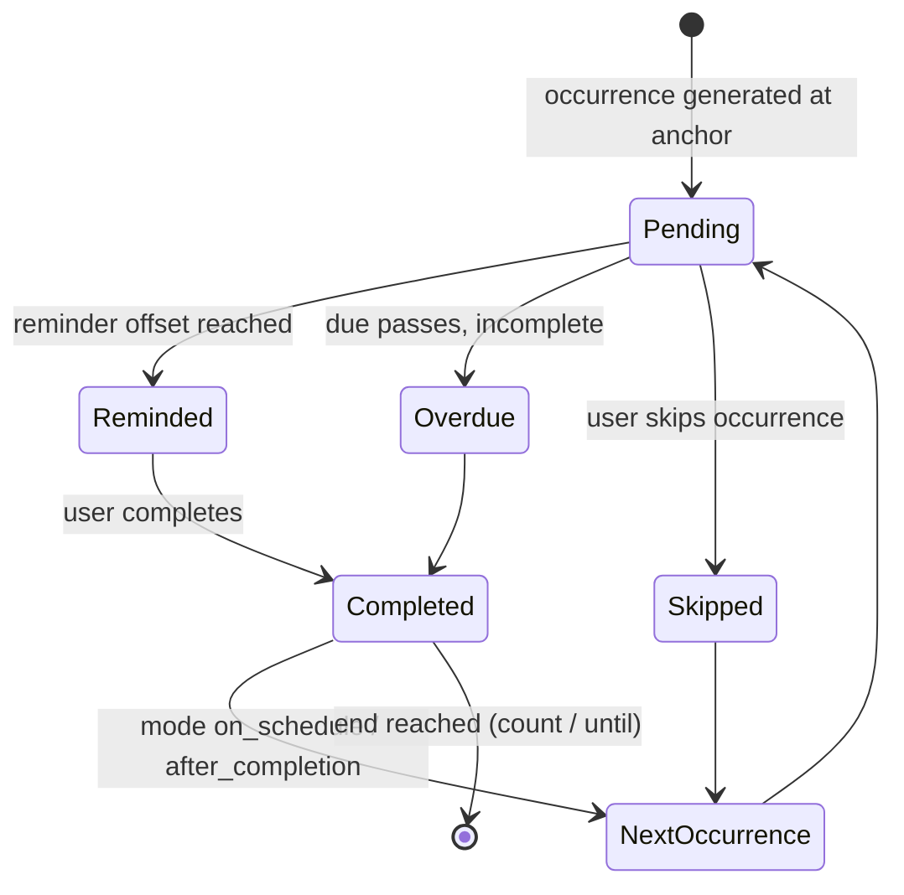

# 11 · Calendar & Scheduling

> Follows the [Master PRD Template](./00-prd-template.md). Calendar is Numil's visual home
> for *when* — the time model (due vs scheduled vs duration), time zones/DST, recurrence,
> drag-reschedule, and time blocking that power Motion/Sunsama-style planning.

---

## 1. Purpose

Calendar gives every task a place in time and turns a list of obligations into a plan. It
defines the canonical **time model** the whole app relies on — due vs scheduled, all-day vs
timed, duration, time zones, DST, and recurrence — and renders it as Day / Week / Month /
Agenda views. It competes with Fantastical (views), Things 3 (calendar+tasks), Motion &
Sunsama (time blocking + auto-planning) while staying calm and native.

**User problem it solves.** A due date says *when it's owed*, not *when you'll do it*. Lists
answer "what"; calendars answer "when." Without a unified time model, reminders misfire across
time zones, recurring tasks drift, and users can't block focused time. Calendar makes the
scheduling model explicit and correct, then lets users drag work into their day.

**User goals**
- See tasks (and meetings) laid out by time; spot overload and gaps.
- Distinguish "due" from "scheduled to work on," and block duration.
- Drag to reschedule / resize to re-estimate in one gesture.
- Trust recurrence and cross-timezone reminders to be exactly right.

**Business goals**
- Anchor Motion-style **AI planning** (module 19) → premium differentiation.
- Increase % of tasks with scheduled time → higher completion + reminder value.
- Calendar integrations (EventKit/Google) → stickiness (module 32).

**KPIs:** `calendar_viewed` by mode, % tasks scheduled, drag-reschedule usage, time-blocked
minutes/user, recurrence adoption, reminder on-time rate (±60s), plan-adoption from AI.

---

## 2. Navigation

**Entry points**
- **Tab bar → Calendar** (`calendar` icon).
- Embedded **Calendar view** inside a project (see [09 · Team Tasks & Projects](./09-team-tasks-projects.md)).
- Mini-agenda on [07 · Home Dashboard](./07-home-dashboard.md).
- Task Detail "Schedule on calendar" → creates a time block (see [10 · Task Detail](./10-task-detail.md)).
- Deep link `numil://calendar?mode=week&date=2026-07-16`, `numil://calendar/task/{id}`.
- Widget / Live Activity "Up next" tap (see [33 · Widgets, Live Activities & Watch](./33-widgets-live-activities-watch.md)).

**Route:** `src/app/(tabs)/calendar/index.tsx?mode=day|week|month|agenda&date=`. Mode + date
live in query state so a view is deep-linkable and restorable. Tapping a block opens Task
Detail (sheet from calendar; push when deep-linked).

**Navigation hierarchy & breadcrumbs**
```text
Calendar ▸ [mode] ▸ [date range]      (project embed: Project ▸ Calendar)
```

**Transitions**
- Mode switch: segmented control; content cross-fades (`motion.base`).
- Week/month paging: horizontal swipe, 1:1 tracked, `spring.gentle` settle.
- Block → detail: shared-element hero on title + color (`motion.slow`).
- Drag-reschedule/resize: block follows finger on the UI thread; snap grid + haptic on drop.

**Modal vs push:** Calendar is a **tab** (root). Task detail is a **sheet**; the date/duration
sub-editors are **nested sheets** so calendar context is never lost.

---

## 3. Complete UI Layout

```text
┌───────────────────────────────────────────────┐
│  July 2026                     Today   ⌕   ＋   │  ← large title (month), jump-to-today
│  ( Day )  ( Week )  ( Month )  ( Agenda )        │  ← mode switch (segmented)
├───────────────────────────────────────────────┤   ── WEEK VIEW ──
│      Mon15 Tue16 Wed17 Thu18 Fri19 Sat Sun      │  ← day headers (today highlighted)
│ all │  ▢Due  ▢          ▢Report              │ │  ← all-day / due-only strip
│─────┼───────────────────────────────────────── │
│ 9AM │      ┌Standup┐                            │  ← meetings (from EventKit) muted
│10AM │      │       │  ┌─Draft email─┐           │  ← scheduled task block (sized=duration)
│11AM │ ─────┼───────┼──● now-line ────┼───────── │  ← now-line indicator
│12PM │      └───────┘                            │
│ 1PM │           ┌─Deep work: specs──────┐       │  ← time block (resizable)
│ … scroll hours (configurable start/end) …       │
├───────────────────────────────────────────────┤
│  Unscheduled (3)  ▸  drag onto a slot to plan   │  ← unscheduled tray (🔜)
│   ▢ Call vendor   ▢ Review PR   ▢ Pay invoice   │
├───────────────────────────────────────────────┤
│  ✨ Plan my day        ⏱ 4h blocked · 2h free   │  ← AI plan + capacity summary
└───────────────────────────────────────────────┘
```

- **Top:** large title reflecting the visible range (month/week); a **Today** button jumps to
  now; search + primary **＋**. Respects Dynamic Island + safe areas. Large title collapses on scroll.
- **Mode switch:** one segmented control (Day / Week / Month / Agenda) — the single prominent
  secondary control.
- **Day/Week body:** an hour grid (configurable working hours, e.g., 8 AM–8 PM, with off-hours
  dimmed and collapsible). **Scheduled tasks** render as blocks sized by `duration_min`;
  **meetings** from connected calendars render muted (read-only). A **now-line** tracks the
  current time. **All-day / due-only** tasks sit in a top strip.
- **Month body:** classic grid; per-day dots/counts; tap a day → Day view for that date.
- **Agenda body:** chronological list grouped by day (Overdue at top, then Today, Tomorrow, …).
- **Unscheduled tray (🔜):** a horizontal shelf of undated/unscheduled tasks; drag onto a slot to plan.
- **Bottom:** an **AI "Plan my day"** affordance + a capacity summary (blocked vs free).
- **Landscape / iPad:** Week/Day widen; a right-hand **inspector** shows the selected task;
  the unscheduled tray becomes a left rail (Sunsama-style planning).

---

## 4. Complete Component Breakdown

| Area | Components |
|------|-----------|
| Header | `LargeTitleHeader` (range label), `TodayButton`, `SearchButton`, `AddButton`, `ModeSwitchSegmented` (Day/Week/Month/Agenda) |
| Day/Week grid | `TimeGrid` (hour rows), `HourLabelColumn`, `NowLine`, `AllDayStrip`, `DayHeader` (weekday+date), `WorkingHoursShade`, `GridSlot` (tap-to-create) |
| Blocks | `TaskBlock` (draggable+resizable), `MeetingBlock` (read-only, from EventKit), `MultiDayBar`, `OverlapLayout` (side-by-side columns), `ResizeHandle`, `DragGhost` |
| Month | `MonthGrid`, `DayCell` (dots/count), `MoreBadge` |
| Agenda | `AgendaSectionList`, `AgendaDayHeader`, `TaskRow`, `OverdueHeader` |
| Planning | `UnscheduledTray` (🔜), `UnscheduledChip`, `CapacitySummary`, `AIPlanButton`, `SchedulePreview` (drag-to-adjust) |
| Editors | `DateTimePickerSheet`, `DurationPicker`, `RecurrenceEditor`, `TimezonePicker`, `RescheduleMenu` (Today/Tomorrow/Next week/Pick) |
| Feedback | `Skeleton` (grid/agenda), `Toast`/`Snackbar` (undo), `Banner` (offline/DST/no-sync), `EmptyDayState`, `ConfirmDialog` (recurrence scope) |
| Integrations | `CalendarSourceToggle`, `AccountBadge` (Apple/Google), `SyncStatusChip` |

Primitives are defined in [03 · Design System & UI](./03-design-system-ui.md).

---

## 5. Modern Features

Each feature: **Purpose · Workflow · UI · Permissions · Offline · API · DB · Notify · AC.**
The lifecycle of a recurring occurrence the scheduler manages:



### 5.1 Four views: Day / Week / Month / Agenda ✅ v1
- **Purpose:** the right granularity for the task at hand.
- **Workflow:** switch mode; page by swipe; tap a day (Month) to drill into Day.
- **UI:** `ModeSwitchSegmented`, `TimeGrid`, `MonthGrid`, `AgendaSectionList`.
- **Permissions:** personal tasks only on owner's calendar; team tasks per project access.
- **Offline:** all modes render from local cache.
- **API:** `GET /calendar?from=&to=&sources=tasks,meetings`.
- **DB:** reads `tasks(due_at, scheduled_at, duration_min)` + cached external events.
- **Notify:** none on view.
- **AC:** each mode renders tasks at correct local times; paging preserves selection.

### 5.2 Time model: due vs scheduled vs duration ✅ v1
- **Purpose:** separate deadline from work time and reserve duration.
- **Workflow:** a task can be **due Fri 5 PM** yet **scheduled Thu 2–3 PM** with **duration
  60m**. Calendar shows scheduled blocks; agenda/overdue logic uses due.
- **UI:** distinct visual treatment (due chip vs scheduled block); duration = block height.
- **Permissions:** edit per task permission.
- **Offline:** edits optimistic.
- **API:** `PATCH /tasks/:id {dueAt, dueHasTime, scheduledAt, durationMin}`.
- **DB:** `tasks.due_at`, `due_has_time`, `scheduled_at`, `duration_min`.
- **Notify:** changing due/scheduled reschedules reminders atomically.
- **AC:** due/scheduled/duration independently editable; block height == duration.

### 5.3 Time zones & DST correctness ✅ v1
- **Purpose:** be correct for travelers, remote teams, and DST edges.
- **Workflow:** all timestamps stored **UTC**; rendered in the device/user tz. Traveling
  re-renders times to the new local zone (the underlying instant is unchanged). Team tasks
  show each viewer their local time (optional project/org tz label).
- **UI:** `TimezonePicker` (advanced); a "shown in <tz>" hint when device tz ≠ home tz.
- **Permissions:** n/a.
- **Offline:** tz math is on-device (IANA tz database via the platform).
- **API:** timestamps ISO-8601 UTC per [shared/api-conventions.md](./shared/api-conventions.md).
- **DB:** UTC instants + optional `tz` for floating/all-day semantics.
- **Notify:** reminders delivered at correct **local wall-clock** time; DST-safe.
- **AC:** a 9:00 AM local reminder fires at 9:00 AM after a DST transition or tz change.

### 5.4 Recurrence (repeat rules) ✅ v1
- **Purpose:** model repeating work precisely (Todoist/Things/iCalendar RRULE-like).
- **Workflow:** choose frequency — **daily / weekly (by weekdays) / monthly (by date or nth
  weekday) / yearly / every N units**; plus **after-completion intervals** ("3 days after I
  complete it"); **end conditions** (never / after N / until date). Edit scope: **this
  occurrence / this & future / all**.
- **UI:** `RecurrenceEditor` (presets + custom); scope `ConfirmDialog` on edit/delete.
- **Permissions:** edit per task permission.
- **Offline:** next instance generated locally on completion/date; reconciled on sync.
- **API:** `recurrence_json` on the task; `POST /tasks/:id/complete` spawns next occurrence.
- **DB:** `recurrence_json` (freq, interval, byWeekday[], byMonthDay, bySetPos, count?, until?,
  mode `on_schedule|after_completion`); occurrences share a `series_id`.
- **Notify:** each occurrence schedules its own reminders from its dates.
- **AC:** all frequencies + end conditions supported; edit scope applied correctly; history kept.

### 5.5 Drag-to-reschedule & resize-to-re-estimate ✅ v1
- **Purpose:** replan in one gesture.
- **Workflow:** drag a `TaskBlock` to a new day/time (Day/Week) → updates `scheduled_at`;
  drag its `ResizeHandle` → updates `duration_min`. Snap to a grid (default 15 min);
  cross-midnight and cross-day drags supported.
- **UI:** block tracks finger on UI thread; snap guides; haptic on drop; ghost during drag.
- **Permissions:** Viewers can't drag (read-only); Contributor+/owner can.
- **Offline:** optimistic; queued op with `baseVersion`.
- **API:** `PATCH /tasks/:id {scheduledAt, durationMin}` (If-Match).
- **DB:** updates `scheduled_at`, `duration_min`, `version`; `activity_log` row.
- **Notify:** reschedules the task's local reminders atomically.
- **AC:** drag/resize persist, snap to grid, reschedule reminders, and are undoable.

### 5.6 Tap-to-create & quick reschedule ✅ v1
- **Purpose:** create at a time, or nudge existing tasks fast.
- **Workflow:** tap an empty slot → quick-create a task scheduled there; long-press a task →
  **Reschedule menu** (Today / Tomorrow / Next week / Pick).
- **UI:** `GridSlot` tap; `RescheduleMenu`.
- **Offline:** optimistic.
- **API:** `POST /tasks {scheduledAt, durationMin}`; `PATCH /tasks/:id`.
- **DB:** inserts/updates `tasks`.
- **Notify:** schedules reminders per defaults.
- **AC:** tap-create places the task at the slot; reschedule menu updates time + reminders.

### 5.7 Time blocking & unscheduled tray 🔜 v1.1
- **Purpose:** Sunsama-style planning — pull undated work into today's free time.
- **Workflow:** the **Unscheduled tray** lists tasks without `scheduled_at`; drag one onto a
  slot to block time. Capacity summary shows blocked vs free hours.
- **UI:** `UnscheduledTray`, `CapacitySummary`, drag onto grid.
- **Permissions:** per task.
- **Offline:** full.
- **API:** `PATCH /tasks/:id {scheduledAt}`.
- **DB:** `scheduled_at` set.
- **Notify:** reminders scheduled from new time.
- **AC:** dragging from tray schedules the task and removes it from the tray.

### 5.8 External calendar sync (EventKit / Google) 🔜 v1.1
- **Purpose:** see meetings alongside tasks; two-way where possible.
- **Workflow:** connect Apple Calendar (EventKit) / Google; meetings render read-only;
  optionally push Numil scheduled blocks to a chosen calendar. Details in
  [32 · Integrations](./32-integrations.md).
- **UI:** `CalendarSourceToggle`, `AccountBadge`, `SyncStatusChip`.
- **Permissions:** device calendar permission; per-account.
- **Offline:** last-synced events cached; changes queue.
- **API:** `POST /integrations/calendar/sync`; local `expo-calendar`/EventKit bridge.
- **DB:** `external_events(source, external_id, start, end, title_ref)` cache.
- **Notify:** meeting-adjacent focus-block suggestions (module 19 `meeting_detect`).
- **AC:** meetings appear read-only; no double-booking when AI plans around them.

### 5.9 AI auto-scheduling (Motion) 🔜 → link module 19
- **Purpose:** auto-fit tasks into free time by priority, due, duration, energy.
- **Workflow:** "**Plan my day/week**" proposes blocks respecting meetings + working/quiet
  hours; user drags to tweak in `SchedulePreview`, then accepts. Fully reversible.
- Deep spec in [19 · AI Assistant & Copilot](./19-ai-assistant-copilot.md) (`day_plan`/`smart_schedule`).
- **AC:** never double-books; respects working/quiet hours; proposal-first with Undo.

---

## 6. Smart AI Features

Powered by [19 · AI Assistant & Copilot](./19-ai-assistant-copilot.md). Calendar surfaces
(all proposal-first: preview + Accept/Edit/Undo):

| Capability (`id`) | What it does on Calendar |
|-------------------|--------------------------|
| `day_plan` / `week_plan` | Auto-blocks tasks into free time (Motion/Sunsama-style). |
| `smart_schedule` | Suggests `scheduled_at` for a single undated task in the best free slot. |
| `meeting_detect` | Suggests focus blocks around detected meetings; buffers before/after. |
| `time_estimate` | Fills `duration_min` (block height) from similar past tasks. |
| `auto_prioritize` | Orders the day's blocks by priority/effort/energy. |
| `deadline_predict` | Flags tasks whose due date is unrealistic given the schedule ("at risk"). |
| `nl_parse` | "Lunch with Sam Thu 12–1" → scheduled block via Quick Add. |

Every action logs `ai_invoked {capability, accepted, latency_ms}`, respects org AI settings,
never double-books, and never writes without confirmation.

---

## 7. Productivity Features

- **Time blocking** (§5.7) and **capacity summary** (blocked vs free) for realistic days.
- **Working hours & focus windows:** per-user working hours shade the grid and constrain AI planning.
- **Time blocking → Focus:** start a [35 · Focus, Pomodoro & Habits](./35-focus-pomodoro-habits.md)
  session directly from a scheduled block; the running timer shows in the Dynamic Island.
- **Daily/weekly planning rituals** (Sunsama): "Plan my day" morning, "Shut down" evening review.
- **Duration estimates** roll into [21 · Time Tracking & Timesheets](./21-time-tracking-timesheets.md).
- **Keyboard/pointer on iPad:** arrow keys move selection; drag with pointer; `T` = Today.

---

## 8. Enterprise Features

- **Org/project time zone display:** optionally label team blocks in a canonical project tz
  to coordinate distributed teams.
- **Working-hours & availability policy:** org defaults for working hours/holidays inform AI
  planning and workload (see [09 · Team Tasks & Projects](./09-team-tasks-projects.md) Workload).
- **Calendar integration governance:** admins can allow/deny external calendar connectors and
  data flow (see [32 · Integrations](./32-integrations.md) and [40 · Security & Compliance Center](./40-security-compliance-center.md)).
- **Audit:** reschedule/duration changes recorded in the task `activity_log`
  (see [29 · Activity Feed & Audit Logs](./29-activity-feed-audit-logs.md)).
- **Automation:** "when scheduled within 24h, remind assignee"; scheduling can trigger rules
  (see [20 · Automation & Workflow Rules](./20-automation-workflow-rules.md)).

---

## 9. Collaboration Features

- **Shared project calendars:** the project Calendar view shows the team's scheduled/due tasks;
  each viewer sees their local time.
- **Assignment-aware blocks:** a block shows its assignee avatar; rescheduling a team task
  notifies watchers/assignee.
- **Presence:** who's viewing the project calendar (realtime) — see [09](./09-team-tasks-projects.md).
- **Availability overlay** 🟣 v2: see teammates' busy/free (respecting privacy) when scheduling.
- **Meeting → task:** turn a detected meeting's action items into tasks (module 19 `action_items`).

---

## 10. Offline Architecture

Deltas over [shared/offline-sync-engine.md](./shared/offline-sync-engine.md):
- Tasks with due/scheduled times are mirrored locally; all four views render offline.
- **Drag-reschedule/resize** are optimistic ops with `baseVersion`; scalar last-write-wins on conflict.
- **Recurrence generation** happens on-device on completion/date; reconciled on sync so no
  duplicate occurrence is created if the server also generated one (dedupe by `series_id` + slot).
- **Time-zone/DST math is fully local** (platform IANA db) — never blocked by network.
- External calendar events are cached read-only; connector sync resumes on reconnect.

---

## 11. Security

Deltas over [shared/security-baseline.md](./shared/security-baseline.md):
- The calendar query is **scope-filtered server-side**: personal tasks only for the owner;
  team tasks per project membership. No over-fetch.
- External calendar data (EventKit/Google) is treated as sensitive: cached encrypted at rest
  (enterprise SQLCipher option), never sent to analytics, and access-scoped per user.
- Device calendar permission requested with clear purpose; revocation handled gracefully.
- Meeting titles from external sources are never logged; only opaque refs in analytics.

**Who can view/act on calendar items** (org roles; project roles Lead/Contributor/Viewer
overlay these; full model in [shared/rbac-permissions.md](./shared/rbac-permissions.md)):

| Action | Owner | Admin | Manager | Member | Guest |
|--------|:-----:|:-----:|:-------:|:------:|:-----:|
| View own **personal** calendar | ✅ | ✅ | ✅ | ✅ | ✅ |
| View a **project** calendar | ✅ | ✅ | ✅ | member | shared |
| View **org-readable** project calendar | ✅ | ✅ | ✅ | ✅ | shared |
| Drag-reschedule / resize a team task | ✅ | ✅ | ✅ | contributor+ | ❌ |
| Tap-to-create in a project | ✅ | ✅ | ✅ | contributor+ | ❌ |
| Connect an external calendar (self) | ✅ | ✅ | ✅ | ✅ | policy |

Viewers and org-readable non-members see the calendar **read-only** (no drag/resize/create).

---

## 12. Notification System

Deltas over the canonical [12 · Notifications & Alerts](./12-notifications-alerts.md):
- Calendar is a primary **source of reminders**: reminders anchor to **due** or **scheduled**
  time (user choice); all-day/due-only tasks use the default reminder time.
- Editing due/scheduled or dragging a block **atomically cancels/reschedules** that task's
  local notifications.
- Each recurring occurrence schedules its own reminders from its dates.
- "Starting soon" nudges for scheduled blocks (opt-in) and Live Activity for the active block
  (module 33). AI planning "your week is planned" completion notification.

---

## 13. Accessibility

Deltas over [shared/accessibility-spec.md](./shared/accessibility-spec.md):
- Time grid is navigable without drag: a `TaskBlock` exposes **Reschedule** and **Change
  duration** `accessibilityActions` with value announcements ("Scheduled Thursday 2 to 3 PM,
  60 minutes").
- The now-line and current time are announced on demand; day headers announce full dates.
- Month `DayCell` announces "July 16, 3 tasks, has overdue".
- Recurrence editor fields are fully labeled; scope dialog reads options.
- Off-hours shading and today highlight never rely on color alone (labels + position).

---

## 14. Animations

Deltas over [shared/animation-spec.md](./shared/animation-spec.md):
- **Drag block:** lift (scale 1.02 + shadow), snap guides, grid-snap haptic on drop, settle
  `spring.gentle`; **resize** grows/shrinks height live.
- Mode switch + week/month paging cross-fade/slide (`motion.base`); now-line updates smoothly.
- Block → detail shared-element hero (`motion.slow`).
- AI plan accept: proposed blocks animate into place (shared-element to their slots).
- Reduce Motion swaps movement for cross-fades; drag still works via accessibility action.

---

## 15. Performance

- Only the visible date range is queried (`from`/`to`); adjacent ranges prefetched for smooth paging.
- Day/Week grids render only visible hour rows + visible blocks; overlap layout computed in a
  memoized worklet-friendly selector.
- Drag/resize run entirely on the UI thread (reanimated); writes debounced (250ms) off main path.
- Month/Agenda virtualized (FlashList); external events merged from cache (no per-frame fetch).
- Recurrence expansion is bounded (generate lazily; never materialize infinite series).
- Screen open target **<200ms** from cache; 60/120fps scrolling and dragging.

---

## 16. Database Design

Aligns with [17 · Data Model & API](./17-data-model-api.md). Calendar reads the shared `tasks`
entity's time fields plus recurrence + external-event cache:

```text
tasks(id, org_id, project_id?, owner_id, assignee_id?, title,
      due_at?, due_has_time, scheduled_at?, duration_min?, tz?,      -- time model
      recurrence_json?, series_id?, completed_at?, version, ..., deleted_at?)
recurrences(series_id, anchor_at, freq, interval, by_weekday[], by_month_day?, by_set_pos?,
            mode, count?, until_at?, tz)                             -- normalized rule (optional)
task_occurrences(id, series_id, task_id→tasks, occurrence_at, status, generated_at)  -- history
external_events(id, user_id, source, external_id, start_at, end_at, all_day,
                title_ref, calendar_id, updated_at)  UNIQUE(user_id, source, external_id)  -- cache
calendar_prefs(user_id, working_start, working_end, week_start, day_start_hour, day_end_hour,
               default_reminder_anchor, show_declined, home_tz)
```

**Indexes:** `tasks(owner_id, scheduled_at)` + `tasks(assignee_id, scheduled_at)` (day/week),
`tasks(due_at) WHERE completed_at IS NULL` (agenda/overdue), `external_events(user_id, start_at)`,
`task_occurrences(series_id, occurrence_at)`. **Constraints:** `duration_min > 0` when set;
`scheduled_at`/`due_at` are UTC instants; recurrence requires an anchor; occurrences unique per
`(series_id, occurrence_at)` to prevent duplicates. **Soft delete** via `deleted_at`; reschedule
history in `activity_log`.

---

## 17. API Design

Follows [shared/api-conventions.md](./shared/api-conventions.md).

| Method | Path | Purpose |
|--------|------|---------|
| GET | `/calendar?from=&to=&sources=tasks,meetings&tz=` | Blocks + events for a range |
| GET | `/calendar/agenda?from=&cursor=` | Chronological agenda (paginated) |
| PATCH | `/tasks/:id` (If-Match) | Reschedule/resize (`scheduledAt`,`durationMin`,`dueAt`) |
| POST | `/tasks` (Idempotency-Key) | Tap-create at a slot |
| POST | `/tasks/:id/complete` | Complete (+spawn next occurrence) |
| PATCH | `/tasks/:id/recurrence` | Set/update recurrence rule |
| POST | `/tasks/:id/recurrence/skip` | Skip an occurrence |
| GET/PUT | `/me/calendar-prefs` | Working hours / week start / anchor |
| POST | `/integrations/calendar/sync` | External calendar sync (🔜) |
| POST | `/ai/plan?scope=day\|week` · `/ai/schedule` | AI planning (module 19) |

**Realtime:** `user:{id}` + `project:{id}` — `task.updated` (reschedule), `task.created`,
`external.synced`. Reconcile by `version`.
**Errors:** `409 conflict` (version), `403 forbidden` (scope/Viewer), `422 validation_failed`
(bad duration/tz). **Idempotency-Key** on all mutations.

**Sample request/response (drag-reschedule)**
```http
PATCH /v1/tasks/tsk_42   If-Match: 7   X-Org-Id: org_9f3
Idempotency-Key: 9a2f...   Authorization: Bearer <token>
{ "scheduledAt": "2026-07-16T13:00:00Z", "durationMin": 90 }
```
```json
{
  "data": { "id": "tsk_42", "scheduledAt": "2026-07-16T13:00:00Z", "durationMin": 90,
            "dueAt": "2026-07-17T21:00:00Z", "version": 8 },
  "meta": { "requestId": "req_c07" }
}
```

---

## 18. Edge Cases

- **DST transition:** a 9:00 AM local reminder/block stays at 9:00 AM local across the change;
  a block spanning the "spring-forward" gap is clamped/adjusted with a notice.
- **Time-zone travel:** all times re-render to the new local zone; the instant is unchanged.
- **All-day vs timed:** dragging an all-day task onto a timed slot promotes it to timed (adds a time).
- **Cross-midnight block:** allowed; renders across both days in Day/Week.
- **Overlapping blocks:** laid out side-by-side (column split); no data loss.
- **Recurrence generation failure:** retried; user sees "next occurrence pending" (never a duplicate).
- **Editing "all" occurrences while offline:** queued; applied to the series on sync.
- **Viewer drags a block:** blocked (read-only) with a subtle explanation.
- **External calendar permission revoked:** meetings disappear with a reconnect banner; tasks unaffected.
- **Conflicting reschedule (two devices):** scalar LWW by server timestamp; loser sees updated position.
- **Task deleted while shown:** block fades out on next sync.
- **Duplicate submit (retry):** deduped by `Idempotency-Key`/`opId`.
- **Duration set to 0/negative:** rejected (`422`) with a hint.

---

## 19. User States

- **First-time:** Week view on today; a coach-mark explains due vs scheduled and "drag to plan."
- **Returning/power:** remembered mode + working hours; AI planning ritual; keyboard/pointer on iPad.
- **Empty day:** "Nothing scheduled — tap a time to add" (calm, not blank).
- **Guest:** sees only shared project tasks on the project calendar; no personal calendar.
- **Manager/Lead:** project calendar with team blocks; workload cross-link.
- **Offline / poor network:** cached views; reschedules queue; "will sync" chip; no dead spinners.
- **Tablet / landscape:** wider Day/Week + inspector + unscheduled rail.
- **Traveling / different tz:** "shown in <local tz>" hint; times recompute.
- **Dark mode / large text / a11y:** tokens + Dynamic Type; VoiceOver reschedule actions verified.

---

## 20. Analytics Events

Schema per [shared/analytics-taxonomy.md](./shared/analytics-taxonomy.md). Module-specific:

| event | key properties |
|-------|----------------|
| `calendar_viewed` | `mode` (day/week/month/agenda), `is_project` |
| `calendar_date_changed` | `direction` (prev/next/today), `mode` |
| `task_scheduled` | `via` (drag/tap/tray/ai), `has_duration` |
| `task_rescheduled` | `via` (drag/menu/ai), `delta_min` |
| `task_resized` | `duration_min` |
| `slot_tap_create` | `mode` |
| `recurrence_set` | `freq`, `mode` (on_schedule/after_completion), `has_end` |
| `recurrence_edited` | `scope` (this/this_future/all) |
| `unscheduled_tray_used` | `count` |
| `calendar_connected` | `provider` (apple/google) |
| `ai_plan_invoked` | `scope` (day/week), `accepted`, `blocks` |
| `tz_change_detected` | `from_tz`, `to_tz` |

Meeting/task titles are never logged (PII scrubbing at SDK boundary).

---

## 21. Acceptance Criteria

1. Day / Week / Month / Agenda modes render tasks at correct local times.
2. Mode switch preserves the focused date and selection.
3. Week/Month paging swipes smoothly and updates the range label.
4. "Today" jumps to the current date in any mode.
5. Due, scheduled, and duration are independently editable and displayed distinctly.
6. Scheduled task block height equals its `duration_min`.
7. Meetings from connected calendars render read-only (🔜) and never editable.
8. All-day / due-only tasks appear in the all-day strip.
9. The now-line tracks the current time and updates over the session.
10. Times display in the user's local zone; stored UTC; DST-safe.
11. A 9:00 AM local reminder fires at 9:00 AM local after a DST transition.
12. Traveling to a new time zone re-renders times without changing the underlying instant.
13. Team tasks show each viewer their own local time (optional project-tz label).
14. Recurrence supports daily/weekly(by weekday)/monthly(by date & nth weekday)/yearly/every-N.
15. After-completion recurrence ("N days after complete") works.
16. Recurrence end conditions (never / after N / until date) all apply.
17. Editing a recurring task offers scope: this / this & future / all — applied correctly.
18. Completing a recurring task spawns the next occurrence and retains history (no duplicate).
19. Dragging a block reschedules `scheduled_at` and snaps to the grid.
20. Resizing a block updates `duration_min`.
21. Drag/resize reschedule the task's local reminders atomically.
22. Tapping an empty slot quick-creates a task scheduled at that time.
23. Long-press reschedule menu (Today/Tomorrow/Next week/Pick) updates time + reminders.
24. Unscheduled tray (🔜) lists undated tasks; dragging one schedules it and removes it from the tray.
25. Capacity summary shows blocked vs free hours for the day.
26. AI "Plan my day/week" proposes blocks respecting meetings + working/quiet hours; no double-book.
27. AI schedule proposals are editable (drag) before accept and fully reversible.
28. Cross-midnight and overlapping blocks render correctly without data loss.
29. Viewers cannot drag/reschedule (read-only) but can view.
30. Personal tasks appear only on the owner's calendar; team tasks per project access.
31. Fully functional offline; reschedules/creates queue and sync losslessly; retries never duplicate.
32. Recurrence generation offline reconciles without creating duplicate occurrences.
33. Screen opens in <200ms from cache; drag/scroll at 60/120fps.
34. VoiceOver exposes Reschedule and Change-duration actions without drag; values announced.
35. Off-hours shading / today highlight never rely on color alone; AX5 reflows without clipping.
36. Reduce Motion disables block-lift; reschedule works via accessibility action.
37. Working hours / week start / reminder anchor preferences persist and shade the grid.
38. External calendar permission revocation removes meetings gracefully; tasks unaffected.
39. Analytics events fire with correct properties (incl. offline-buffered) and no PII.
40. Reschedule/duration changes are recorded in the task audit log.

---

## 22. Future Roadmap

- **V1 (✅):** Day/Week/Month/Agenda, due-vs-scheduled-vs-duration model, tz/DST correctness,
  full recurrence + edit scopes, drag-reschedule/resize, tap-to-create, quick reschedule, offline.
- **V1.1 (🔜):** unscheduled tray + time blocking, capacity summary, EventKit/Google two-way
  sync, AI day/week planning UI, working-hours shading, starting-soon nudges + Live Activity.
- **V2 (🟣):** team availability overlay, timeline/Gantt scheduling, resource/capacity planning,
  travel-time buffers, multi-calendar overlays.
- **Future (💡):** natural-language scheduling everywhere, location-aware time blocks, smart
  "reschedule everything after this slips" replanning.
- **Experimental (🧪):** fully autonomous continuous re-planning (Motion-style) with approval gates.
- **AI track:** meeting-aware focus buffers, energy-based block ordering, at-risk deadline replanning (module 36).
- **Enterprise track:** org working-hours/holiday calendars, tz-coordination dashboards, connector governance.
