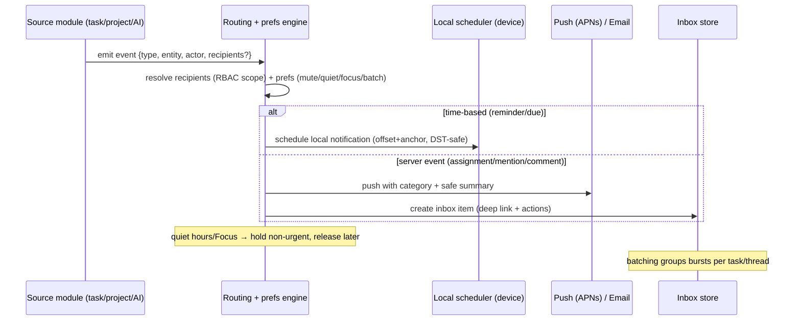

# 12 · Notifications & Alerts

> Follows the [Master PRD Template](./00-prd-template.md). **This is the canonical
> notifications module** — every other doc's "Section 12" links here and lists only its
> deltas. It defines reminder timing, delivery (push/local/email), the Inbox, digests,
> snooze, quiet hours, Focus filters, categories/action buttons, and escalation.

---

## 1. Purpose

Notifications make sure the **right person is reminded of the right thing at the right time**,
without becoming noise. This module owns the end-to-end alerting system: reminder timing
rules, local + push + email delivery, the in-app **Inbox**, digests, **snooze**, **quiet
hours**, **Focus filters**, notification **categories/action buttons**, Live Activities /
Dynamic Island hooks, and **escalation**. It blends Todoist/Things reliability with
Slack/Linear-grade routing while staying calm and iOS-native.

**User problem it solves.** Reminders are worthless if they fire late, in the wrong time zone,
or bury the user in noise. Teams need assignment/mention alerts that arrive instantly; humans
need quiet hours and digests so the app respects their attention. A single, trustworthy
notification system is the backbone of a productivity app.

**User goals**
- Be reminded reliably (±60s), even offline, even across DST.
- Act from the lock screen (Complete / Snooze / Reply) without opening the app.
- Control the volume: quiet hours, per-project preferences, digests, Focus filters.
- Have one **Inbox** that shows everything actionable, grouped and dismissible.

**Business goals**
- Reminder reliability drives retention and trust (the "does it actually remind me?" test).
- Assignment/mention alerts drive collaboration loops and re-engagement.
- Digests bring users back daily; a healthy notification system protects long-term retention.

**KPIs:** `reminder_scheduled → reminder_fired` within ±60s rate, notification open rate,
snooze rate, opt-out/mute rate (noise signal), assignment→open latency, digest open rate,
permission-grant rate.

---

## 2. Navigation

**Entry points**
- **Inbox tab** (`bell` icon) — the in-app feed of alerts (badge = actionable count).
- **Settings → Notifications** — preferences (see [15 · Profile & Settings](./15-profile-settings.md)).
- **System notifications** (lock screen / banner / Notification Center) with action buttons.
- **Dynamic Island / Live Activities** for time-sensitive/ongoing items (see [33 · Widgets, Live Activities & Watch](./33-widgets-live-activities-watch.md)).
- Deep links: `numil://inbox`, `numil://inbox?filter=mentions`, `numil://task/{id}` (from a push),
  `numil://settings/notifications`.

**Route:** `src/app/(tabs)/inbox/index.tsx`; preferences at `src/app/settings/notifications.tsx`.
Tapping an inbox item or notification deep-links to its target (task/project/comment).

**Navigation hierarchy & breadcrumbs**
```text
Inbox ▸ [filter: All | Mentions | Assignments | Overdue | Comments] ▸ [item → target]
```

**Transitions**
- Inbox item → target: push/sheet to Task Detail (`motion.slow` hero on the task).
- Notification tap (app cold/warm): route resolves after auth; graceful loading, never a dead spinner.
- Snooze/quiet-hours actions: inline, optimistic; a toast confirms.

**Modal vs push:** Inbox is a **tab** (root). Preferences open as **push** from Settings.
Snooze picker is a **sheet**; a notification's action buttons act **without** opening the app.

---

## 3. Complete UI Layout

```text
┌───────────────────────────────────────────────┐
│  Inbox                        Mark all read  ⚙︎ │  ← large title + bulk + settings
│  (All)(Mentions)(Assignments)(Overdue)(Comments)│  ← filter segmented (scrollable)
├───────────────────────────────────────────────┤
│  ▾ TODAY                                        │
│  🔴 Overdue · Send invoice           9:00 AM  ⋯ │  ← unread dot, type glyph, time, menu
│     [ Complete ]  [ Snooze ▾ ]                  │  ← inline action buttons
│  💬 @you  Marco: "can you review?"    8:12 AM   │  ← mention (grouped under task)
│  👤 Assigned · Draft Q3 email · Marketing 7:40  │
│  ▾ YESTERDAY                                    │
│  ✅ Priya completed "Build hero"     Tue        │
│  ─────────────────────────────────────────────  │
│  🌙 Quiet hours until 7:00 AM · 3 held          │  ← quiet-hours banner (held count)
└───────────────────────────────────────────────┘

   ── LOCK-SCREEN NOTIFICATION (category: TASK_REMINDER) ──
┌───────────────────────────────────────────────┐
│  Numil · Reminder                        now    │
│  Send invoice — due 9:00 AM                     │
│  [ Complete ]   [ Snooze ]   [ Open ]           │  ← iOS category action buttons
└───────────────────────────────────────────────┘
```

- **Top:** large title "Inbox"; **Mark all read** + settings gear. Respects Dynamic Island +
  safe areas; large title collapses on scroll.
- **Filter bar:** a scrollable segmented control (All / Mentions / Assignments / Overdue /
  Comments) — the primary way to slice the feed.
- **Feed:** chronological, grouped by day; each row = type glyph + concise summary + time +
  unread dot + `⋯`. Actionable items (overdue, mention) expose **inline action buttons**.
  Related items (multiple comments on one task) **collapse into a thread group**.
- **Quiet-hours / Focus banner:** when active, a slim banner shows held count and time of release.
- **Bottom:** no composer here; swipe a row for **Mark read / Snooze / Mute thread**.
- **Empty state:** "You're all caught up" with a calm illustration.
- **Landscape / iPad:** two-pane — Inbox list left, selected item's target (Task Detail) right.

---

## 4. Complete Component Breakdown

| Area | Components |
|------|-----------|
| Header | `LargeTitleHeader`, `MarkAllReadButton`, `SettingsButton`, `FilterSegmentedScroll` |
| Feed | `SectionListVirtualized` (FlashList), `DayHeader`, `NotificationRow` (glyph, title, time, unread dot), `ThreadGroupRow` (collapsed), `InlineActionBar` ([Complete]/[Snooze]/[Reply]) |
| Row bits | `TypeGlyph` (reminder/assignment/mention/comment/status/overdue/security), `UnreadDot`, `RelativeTime`, `RowMenu` (`⋯`), swipe actions (Read/Snooze/Mute) |
| Banners | `QuietHoursBanner`, `FocusFilterBanner`, `PermissionBanner` (push disabled), `OfflineBanner` |
| Snooze | `SnoozeSheet` (10 min / 1 hr / this evening / tomorrow / pick), `RescheduleMenu` |
| Preferences | `MasterPushToggle`, `PerTypeToggleList`, `DefaultReminderTimeRow`, `DefaultOffsetRow`, `QuietHoursEditor`, `DigestScheduleEditor`, `PerProjectPrefList` (mute / mentions-only / all) |
| System | iOS **notification categories** (`TASK_REMINDER`, `ASSIGNMENT`, `MENTION`, `COMMENT`, `DIGEST`, `SECURITY`) with action buttons; `LiveActivity` (module 33) |
| Feedback | `Skeleton` rows, `Toast`/`Snackbar` (undo mute/read), `EmptyState`, `AllCaughtUpState` |

Primitives are defined in [03 · Design System & UI](./03-design-system-ui.md).

---

## 5. Modern Features

Each feature: **Purpose · Workflow · UI · Permissions · Offline · API · DB · Notify · AC.**

### 5.1 Reminder timing rules ✅ v1
- **Purpose:** fire reminders precisely relative to a task's time.
- **Workflow:** a task has **one or more reminders**, each an **offset** relative to its
  **anchor** (due by default, switchable to scheduled/start). Presets: at time (0), 5/10/15/30
  min before, 1/2 hr before, 1 day / 2 days / 1 week before, or **Custom** (any date+time).
  **All-day/due-only** tasks fire at the user's **default reminder time** (Settings; default
  **9:00 AM local**) on the offset day.
- **UI:** `ReminderEditorSheet` (add multiple, choose anchor). Detail rail shows "⏰ 2 reminders".
- **Permissions:** the task's owner/assignee sets their reminders.
- **Offline:** local notifications are **pre-scheduled on-device** so they fire without network.
- **API:** reminders stored on the task (`POST/PATCH /tasks/:id/reminders`).
- **DB:** `reminders(id, task_id, offset_min, anchor, custom_at?)`.
- **Notify:** self (local); DST-safe wall-clock delivery.
- **AC:** multiple reminders fire; editing the anchor/time reschedules them atomically.

### 5.2 Notification channels: local / push / email ✅ v1
- **Purpose:** reliable delivery across states and devices.
- **Workflow:** **local** notifications (`expo-notifications`) for time-based reminders
  (offline-proof); **push** (APNs) for server events (assignment/mention/comment) + cross-device
  sync; **email** for high-signal or off-app events (invites, security, opt-in digests).
- **UI:** channel choice is implicit per type; Settings governs email opt-in.
- **Permissions:** respects iOS system permission; email respects account preferences.
- **Offline:** local fires offline; push/email queue server-side and deliver on reconnect.
- **API:** server `POST /notifications` fan-out; device token registration `POST /devices`.
- **DB:** `notifications`, `devices(user_id, apns_token, platform, last_seen)`.
- **Notify:** the system itself.
- **AC:** local reminders fire with no network; push arrives promptly; email for designated types.

### 5.3 Notification categories & action buttons ✅ v1
- **Purpose:** act from the lock screen without opening the app.
- **Workflow:** each notification carries an iOS **category** defining action buttons —
  `TASK_REMINDER` → **Complete / Snooze / Open**; `MENTION`/`COMMENT` → **Reply / Open**;
  `ASSIGNMENT` → **Open / Snooze**; `DIGEST` → **Open**; `SECURITY` → **Review**.
- **UI:** system action buttons; a text-input action for **Reply** (inline).
- **Permissions:** actions re-check permission on execution (e.g., can this user complete?).
- **Offline:** Complete/Snooze queue locally and reconcile; Reply queues as a comment op.
- **API:** action handlers call `POST /tasks/:id/complete`, snooze reschedule, `POST /tasks/:id/comments`.
- **DB:** writes the corresponding entity + `activity_log`.
- **Notify:** completing may notify watchers; replying notifies mentioned/watchers.
- **AC:** all category actions work from the lock screen; Reply posts a comment.

### 5.4 In-app Inbox ✅ v1
- **Purpose:** one actionable feed of everything relevant.
- **Workflow:** chronological, grouped by day; filter All / Mentions / Assignments / Overdue /
  Comments; each item deep-links to its target; inline mark-read/complete/snooze/mute; **Mark
  all read**; per-thread **mute**. Related items collapse into a thread group.
- **UI:** `FilterSegmentedScroll`, `NotificationRow`, `ThreadGroupRow`, `InlineActionBar`.
- **Permissions:** shows only notifications the user is entitled to; guests scoped to shares.
- **Offline:** inbox served from local cache; read/mute optimistic.
- **API:** `GET /notifications?filter=&cursor=`, `POST /notifications/read`, `POST /notifications/mute`.
- **DB:** `notifications(read_at?, muted)`; `notification_mutes(user_id, thread_key)`.
- **Notify:** n/a (this is the sink).
- **AC:** filters work; deep-links resolve; mark-all-read and mute persist and sync.

### 5.5 Snooze ✅ v1
- **Purpose:** defer an alert without changing the task's due date.
- **Workflow:** from a notification or inbox item → **Snooze** (10 min / 1 hr / this evening /
  tomorrow / pick a time). Reschedules the reminder only; the task's due date is unchanged
  unless the user explicitly reschedules.
- **UI:** `SnoozeSheet` presets + custom picker.
- **Permissions:** owner/assignee.
- **Offline:** reschedules the local notification on-device.
- **API:** `POST /notifications/:id/snooze {until}` (syncs across devices).
- **DB:** `notifications.snoozed_until`; local reminder rescheduled.
- **Notify:** re-fires at the snooze time.
- **AC:** snooze reschedules the alert, not the due date; syncs across devices.

### 5.6 Quiet hours & batching ✅ v1
- **Purpose:** protect attention; reduce noise.
- **Workflow:** **Quiet hours** window (default off; suggested 10 PM–7 AM) holds **non-urgent**
  notifications and releases them at the window's end; urgent/overdue/security can **override**
  (user choice). **Batching:** comment/status bursts on the same task batch (default 15 min).
- **UI:** `QuietHoursEditor`, `QuietHoursBanner` (held count + release time).
- **Permissions:** per-user; org can suggest defaults.
- **Offline:** hold/release computed on-device from local tz.
- **API:** prefs `PUT /me/notification-prefs`; server respects window for push.
- **DB:** `notification_prefs(quiet_start, quiet_end, urgent_override, batch_window_min, …)`.
- **Notify:** held items delivered as a grouped release.
- **AC:** non-urgent held during quiet hours and released after; urgent can override.

### 5.7 Digests (daily / weekly) ✅ v1
- **Purpose:** a single summary instead of many pings.
- **Workflow:** **Daily digest** (default 8:00 AM) = today's due + overdue + newly assigned;
  **Weekly digest** (default Mon 8:00 AM) = week ahead + last week's completions. Times + opt-in
  are user-configurable; org can set defaults.
- **UI:** `DigestScheduleEditor`; a rich digest push/inbox card.
- **Permissions:** per-user opt-in.
- **Offline:** digest composed server-side; delivered on reconnect if offline at send.
- **API:** `PUT /me/notification-prefs {daily, weekly}`; server scheduler emits digests.
- **DB:** `notification_prefs` digest fields.
- **Notify:** digest push + inbox item at configured local time.
- **AC:** digests deliver at configured local times with accurate contents.

### 5.8 Focus filters (iOS Focus integration) ✅ v1
- **Purpose:** align Numil alerts with the user's iOS **Focus** (Work/Personal/Sleep/DND).
- **Workflow:** map Numil notification types to allow/suppress per iOS Focus via a **Focus
  filter**; e.g., "Work Focus → only assignments/mentions." Numil's in-app Focus mode
  (module 35) applies the same filter locally.
- **UI:** iOS Focus filter configuration + an in-app hint; `FocusFilterBanner` when active.
- **Permissions:** per-user; uses the iOS Focus Filter API.
- **Offline:** filter evaluated on-device.
- **API:** local; no server round-trip required for suppression.
- **DB:** `notification_prefs.focus_filter_json`.
- **Notify:** suppressed types are held (surface in Inbox, no interruption).
- **AC:** during a mapped Focus, only allowed types interrupt; the rest appear silently in Inbox.

### 5.9 Escalation ✅ v1 / 🔜
- **Purpose:** ensure critical items aren't missed.
- **Workflow:** overdue tasks nudge the assignee; if still incomplete after a policy window,
  **escalate** to the manager (opt-in per project). SLA-based escalation (🔜) via
  [20 · Automation & Workflow Rules](./20-automation-workflow-rules.md).
- **UI:** escalation is a normal notification to the manager, tagged "Escalated."
- **Permissions:** manager opt-in; respects personal privacy (personal tasks never escalate).
- **Offline:** server-driven; delivered on reconnect.
- **API:** automation `POST /automation/rules` (trigger: overdue+N); `POST /notifications`.
- **DB:** `escalation_rules(project_id, after_min, notify_role)`.
- **Notify:** manager receives an escalation push + inbox.
- **AC:** escalation fires only after the window; personal tasks never escalate.

---

## 6. Smart AI Features

Powered by [19 · AI Assistant & Copilot](./19-ai-assistant-copilot.md). Notifications-related
AI (all proposal-first / opt-in):

| Capability (`id`) | What it does |
|-------------------|--------------|
| `smart_notify` 🔜 | Learns best delivery windows (when you actually act) and nudges then. |
| `digest_summarize` | AI-written digest narrative ("3 due, 1 at risk; suggest starting X"). |
| `smart_reply` | 1-tap reply suggestions on mention/comment notifications (confirm to send). |
| `priority_triage` 🔜 | Ranks the Inbox by likely importance; surfaces "needs you" first. |
| `risk_alert` | "AI found 3 at-risk tasks" opt-in insight digest (module 36). |
| `quiet_learn` 🧪 | Suggests quiet-hours windows from usage patterns. |

All AI notification features are **opt-in**, never auto-send, log `ai_invoked`, and never
include task content in analytics.

---

## 7. Productivity Features

- **Snooze presets** tuned for productivity ("this evening", "tomorrow morning").
- **Digest as a daily plan** — the morning digest can launch **My Day** / "Plan my day"
  (see [08 · My Tasks](./08-my-tasks.md) and [11 · Calendar & Scheduling](./11-calendar-scheduling.md)).
- **Focus mode integration:** starting an in-app Focus session applies the Focus filter and
  shows a Live Activity (module 33/35).
- **Batching + quiet hours** reduce context-switching; "held" items batch into one release.
- **Reminder anchor choice** (due vs scheduled) supports "remind me when I planned to do it."

---

## 8. Enterprise Features

- **Org notification defaults & policy:** admins set default reminder time, digest defaults,
  and which types are allowed/required org-wide (users can be more restrictive, not less for
  security). See [30 · Workspace Administration](./30-workspace-administration.md).
- **Escalation & SLA policy** per project (§5.9) via [20 · Automation & Workflow Rules](./20-automation-workflow-rules.md).
- **Deliverability & audit:** delivery attempts/results logged (bounce, APNs failure) for
  reliability monitoring; security notifications (new-device login) are immutable-audited
  (see [29 · Activity Feed & Audit Logs](./29-activity-feed-audit-logs.md)).
- **Email domain / branding** (enterprise): org-branded digest/invite emails.
- **Privacy:** admins can set defaults but **cannot read** the content of muted/personal items;
  notification content follows the org retention policy.

---

## 9. Collaboration Features

- **Mentions** (`@user`) → immediate notification with **Reply** action; group `@channel`/
  `@project` (🔜) fan out with rate protection.
- **Assignment / reassignment** → immediate alert to the new assignee.
- **Watchers/followers** → batched comment/status updates without being the assignee.
- **Reactions** (opt-in) → lightweight "Priya reacted ❤️".
- **Reply from notification** posts a comment inline (queued offline) — see [10 · Task Detail](./10-task-detail.md).
- **Read receipts** on mentions 🟣 v2 (per org policy).

---

## 10. Offline Architecture

Deltas over [shared/offline-sync-engine.md](./shared/offline-sync-engine.md):
- **Local reminders are pre-scheduled on-device** and fire without network (the reliability
  backbone). Editing/completing/deleting a task **cancels/reschedules** its local notifications.
- Inbox is served from the local mirror; **read/mute/snooze** are optimistic ops with `opId`.
- **Reply-from-notification** enqueues a comment op that syncs on reconnect (mentions resolve on send).
- Quiet-hours / Focus-filter hold/release and digest timing are computed on-device in local tz.
- Push/email are inherently server-driven and are **buffered server-side**, delivered on reconnect;
  the Inbox reconciles via `GET /sync?since=` so nothing is missed after offline periods.

---

## 11. Security

Deltas over [shared/security-baseline.md](./shared/security-baseline.md):
- Notification payloads carry **no sensitive body** beyond what the recipient is entitled to;
  content is fetched authorized on open (push shows a safe summary).
- Delivery is **scoped**: a user only receives notifications for entities they can access;
  guests are share-scoped; personal tasks never notify anyone but the owner.
- **Security notifications** (new-device login, password/role change) bypass quiet hours and
  are audited immutably; they can never be muted below a safety floor.
- APNs device tokens stored server-side and rotated; revoked on logout/device removal.
- No task titles/PII in analytics or logs (summaries scrubbed at the SDK boundary).

**Who can do what with notifications** (org roles; full model in
[shared/rbac-permissions.md](./shared/rbac-permissions.md)):

| Action | Owner | Admin | Manager | Member | Guest |
|--------|:-----:|:-----:|:-------:|:------:|:-----:|
| Control **own** notification prefs | ✅ | ✅ | ✅ | ✅ | ✅ |
| Receive assignment/mention for accessible items | ✅ | ✅ | ✅ | ✅ | shared |
| Opt into **team overdue / escalation** alerts | ✅ | ✅ | ✅ | ❌ | ❌ |
| Set **org notification defaults** | ✅ | ✅ | ❌ | ❌ | ❌ |
| View **deliverability audit** | ✅ | ✅ | scoped | ❌ | ❌ |
| Read content of muted / personal items | ❌ | ❌ | ❌ | ❌ | ❌ |

Personal-task notifications reach **only the owner**; security notifications cannot be muted
below the safety floor by anyone.

---

## 12. Notification System

**This module _is_ the canonical Notification System.** Other modules' Section 12 links here
and lists only their deltas (which events they emit and who receives them). The cross-module
contract:

**Event → notification pipeline**


**Notification type registry** (canonical; modules reference these `type` ids):

| Type (`id`) | Trigger | Recipients | Channels | Category (actions) | Urgent? |
|-------------|---------|-----------|----------|--------------------|:-------:|
| `reminder` | Reminder offset reached | Owner/assignee | Local + push | `TASK_REMINDER` (Complete/Snooze/Open) | via anchor |
| `due_soon` | Approaching due | Owner/assignee | Local + push | `TASK_REMINDER` | no |
| `overdue` | Due passed, incomplete | Assignee (+manager opt) | Push + inbox | `TASK_REMINDER` | yes |
| `assignment` | Assigned/reassigned | New assignee | Push + inbox | `ASSIGNMENT` (Open/Snooze) | yes |
| `mention` | @mentioned | Mentioned user | Push + inbox | `MENTION` (Reply/Open) | yes |
| `comment` | New comment on watched task | Watchers/assignee | Push (batched) + inbox | `COMMENT` (Reply/Open) | no |
| `status_change` | Task moved (→Done/Review) | Watchers/assignee | Inbox (+push opt) | `COMMENT` | no |
| `approval_request` 🔜 | Approval needed | Approver | Push + inbox | `ASSIGNMENT` | yes |
| `invite` | Added to org/project | Invited user | Push + inbox + email | `ASSIGNMENT` | yes |
| `daily_digest` | Scheduled (8:00 AM) | Opted-in | Push + inbox | `DIGEST` (Open) | no |
| `weekly_digest` | Scheduled (Mon 8:00 AM) | Opted-in | Push + inbox | `DIGEST` | no |
| `escalation` | Overdue + policy window | Manager | Push + inbox | `ASSIGNMENT` | yes |
| `security` | New-device login, etc. | Account owner | Push + email | `SECURITY` (Review) | yes (bypass) |
| `ai_insight` | AI risk/health (opt-in) | User | Push + inbox | `DIGEST` | no |

**Reminder timing rules (detailed)** — a task can carry multiple reminders, each an offset:
- Presets: at time (0), 5/10/15/30 min before, 1/2 hr before, 1 day / 2 days / 1 week before, Custom.
- All-day/due-only tasks fire at the **default reminder time** (default 9:00 AM local) on the offset day.
- Anchor = **due** by default; switchable to **scheduled/start**.
- Each recurring occurrence schedules its own reminders from its dates.
- Time zone: computed from UTC, delivered at the correct **local** wall-clock time; DST-safe.

**Defaults summary**

| Setting | Default |
|---------|---------|
| Default reminder time (all-day) | 9:00 AM local |
| Default new-task reminder offset | None (org/global default configurable) |
| Daily digest | 8:00 AM local |
| Weekly digest | Monday 8:00 AM local |
| Quiet hours | Off (suggested 10 PM–7 AM) |
| Comment batching window | 15 minutes |
| Escalation window | 24 h overdue (per project) |
| Security/OTP alerts | Immediate; bypass quiet hours |

---

## 13. Accessibility

Deltas over [shared/accessibility-spec.md](./shared/accessibility-spec.md):
- `NotificationRow` announces type + summary + relative time + read state
  ("Mention, Marco: can you review, 8:12 AM, unread"); exposes `accessibilityActions`
  Complete / Snooze / Reply / Mute matching the visible/swipe actions.
- System notification action buttons inherit VoiceOver labels; **Reply** text field is reachable.
- Quiet-hours / Focus banners announce state and release time.
- Badge count changes announced; unread dot has a text alternative (not color-only).
- Digest cards read as a structured summary (counts first, then items).

---

## 14. Animations

Deltas over [shared/animation-spec.md](./shared/animation-spec.md):
- New inbox item slides + fades in (`motion.base`); read → dot fades, row de-emphasizes.
- Swipe actions track the finger 1:1; threshold haptic; release settles `spring.snappy`.
- Mark-all-read: unread dots fade in a quick stagger.
- Thread group expand/collapse animates height/opacity; quiet-hours release animates a grouped drop-in.
- Reduce Motion swaps movement for 120ms cross-fades; state changes remain clear.

---

## 15. Performance

- Inbox virtualized (**FlashList**); rows recycled; cursor pagination; older items lazy-loaded.
- **Local scheduling budget:** iOS caps pending local notifications (~64); Numil schedules the
  **nearest-horizon** reminders and rehydrates the queue on foreground/background sync so long-
  range reminders aren't dropped.
- Push handled by a lightweight notification service extension for safe-summary + grouping; no heavy work.
- Read/mute/snooze are optimistic; server writes debounced/batched.
- Badge recompute is O(unread window); derived from the same cached dataset.
- Screen open target **<150ms** from cache; no blocking network for the feed.

---

## 16. Database Design

Aligns with [17 · Data Model & API](./17-data-model-api.md).

```text
notifications(id, org_id, user_id→recipient, type, entity_type, entity_id,
              actor_id?, summary, deep_link, category, urgent, read_at?, muted,
              snoozed_until?, batch_key?, created_at)
reminders(id, task_id→tasks, offset_min, anchor, custom_at?, created_at)   -- anchor: due|scheduled
notification_prefs(user_id, push_enabled, per_type_json, default_reminder_time,
                   default_offset_min?, quiet_start?, quiet_end?, urgent_override,
                   batch_window_min, daily_digest, daily_time, weekly_digest, weekly_dow,
                   weekly_time, focus_filter_json, updated_at)             PK(user_id)
project_notification_prefs(user_id, project_id, mode)   -- mute|mentions_only|all  PK(user_id,project_id)
notification_mutes(user_id, thread_key, created_at)      PK(user_id, thread_key)
devices(id, user_id, apns_token, platform, app_version, last_seen, revoked_at?)
notification_deliveries(id, notification_id→notifications, channel, status, provider_id?,
                        error?, attempted_at)             -- deliverability audit
escalation_rules(id, project_id→projects, after_min, notify_role, enabled)
```

**Indexes:** `notifications(user_id, created_at)` (feed), `notifications(user_id) WHERE read_at
IS NULL` (badge), `reminders(task_id)`, `notification_deliveries(notification_id)`,
`devices(user_id) WHERE revoked_at IS NULL`. **Constraints:** `reminders.anchor ∈ {due,scheduled}`;
personal-task notifications only to owner; security notifications non-mutable below the safety
floor. **Retention:** notifications purge per org policy (default 90 days); deliveries retained
for reliability monitoring; **soft delete** not required (append-only feed, read/muted flags).

---

## 17. API Design

Follows [shared/api-conventions.md](./shared/api-conventions.md).

| Method | Path | Purpose |
|--------|------|---------|
| GET | `/notifications?filter=&cursor=` | Inbox feed (paginated) |
| POST | `/notifications/read` `{ids[] \| all}` | Mark read |
| POST | `/notifications/:id/snooze` `{until}` | Snooze (reschedule alert) |
| POST | `/notifications/mute` `{threadKey}` · DELETE | Mute/unmute a thread |
| GET/PUT | `/me/notification-prefs` | User preferences |
| PUT | `/me/project-notification-prefs/:projectId` | Per-project mode |
| POST/PATCH/DELETE | `/tasks/:id/reminders` | Manage a task's reminders |
| POST | `/devices` · DELETE `/devices/:id` | Register/revoke APNs token |
| POST | `/notifications` (internal, service) | Emit (from source modules/automation) |
| GET | `/notifications/deliveries?cursor=` (admin) | Deliverability audit |

**Realtime:** channel `user:{id}` — `notification.created`, `notification.read`,
`notification.snoozed`. Badge updates pushed; reconcile via `GET /sync?since=`.
**Errors:** `403 forbidden` (scope), `409 conflict` (version), `422 validation_failed`
(bad offset/anchor), `429 rate_limited` (fan-out protection). **Idempotency-Key** on mutations
and on internal emit (dedupe repeat events).

**Sample request/response (snooze from a reminder)**
```http
POST /v1/notifications/ntf_77/snooze   X-Org-Id: org_9f3
Idempotency-Key: 1b8e...   Authorization: Bearer <token>
{ "until": "2026-07-16T18:00:00Z" }
```
```json
{
  "data": { "id": "ntf_77", "type": "reminder", "snoozedUntil": "2026-07-16T18:00:00Z",
            "read_at": null, "deepLink": "numil://task/tsk_01" },
  "meta": { "requestId": "req_d13" }
}
```

---

## 18. Edge Cases

- **Push permission denied:** Inbox + local reminders still work; a banner explains how to enable push.
- **Local notification cap (~64) exceeded:** schedule nearest horizon, rehydrate on foreground/background sync.
- **DST transition:** a 9:00 AM local reminder fires at 9:00 AM local; offsets recompute around the shift.
- **Time-zone travel:** pending local reminders recompute to the new local wall-clock.
- **Task edited/completed/deleted:** its local notifications are canceled/rescheduled atomically.
- **Reply-from-notification offline:** queued as a comment op; posts on reconnect (mentions resolve then).
- **Permission lost before an event fires:** server suppresses delivery (scope re-checked at send).
- **Duplicate emit (source retry):** deduped by `Idempotency-Key`/event key (one notification).
- **Quiet hours spanning midnight:** window wraps correctly; release at window end.
- **Muted thread receives a mention of you:** mention still notifies (safety override of mute).
- **APNs token invalid/expired:** delivery marked failed, token pruned; falls back to inbox/email.
- **Digest send while offline:** delivered on reconnect; not duplicated.
- **Escalation on a completed-just-now task:** suppressed (state re-checked at escalation time).
- **Guest receives event for a now-unshared resource:** suppressed; inbox item removed on sync.

---

## 19. User States

- **First-time:** system push permission primer (value-framed) before the OS prompt; sample inbox.
- **Returning/power:** tuned quiet hours + per-project modes; digests; Focus filters.
- **Permission denied:** in-app inbox + local reminders; persistent enable-push banner.
- **Guest:** only notifications for shared projects/tasks.
- **Manager:** opt-in overdue/escalation alerts for the team; personal tasks never surfaced.
- **Admin/Owner:** org defaults + deliverability audit; cannot read muted/personal content.
- **Offline / poor network:** local reminders fire; push/email buffered; inbox from cache.
- **Quiet hours / Focus active:** non-urgent held; banner shows held count + release time.
- **Tablet / landscape:** two-pane inbox + target.
- **Dark mode / large text / a11y:** tokens + Dynamic Type; VoiceOver actions verified at AX5.

---

## 20. Analytics Events

Schema per [shared/analytics-taxonomy.md](./shared/analytics-taxonomy.md). Module-specific
(extends the core catalog):

| event | key properties |
|-------|----------------|
| `notification_permission` | `granted` |
| `reminder_scheduled` | `offset_min`, `anchor`, `count` |
| `reminder_fired` | `type`, `channel` (local/push) |
| `reminder_opened` | `type`, `action` (open/complete/snooze/reply) |
| `notification_action` | `type`, `action`, `from` (lockscreen/inbox) |
| `notification_snoozed` | `preset` (10m/1h/evening/tomorrow/custom) |
| `inbox_viewed` | `filter` |
| `inbox_mark_all_read` | `count` |
| `thread_muted` / `thread_unmuted` | `entity_type` |
| `quiet_hours_changed` | `enabled` |
| `quiet_hours_held` | `count` |
| `focus_filter_applied` | `focus` (work/personal/sleep) |
| `digest_delivered` / `digest_opened` | `cadence` (daily/weekly) |
| `escalation_fired` | `after_min` |
| `notification_pref_changed` | `type`, `enabled` |

Delivery reliability funnel: `reminder_scheduled → reminder_fired` within ±60s. No task
titles/PII in any property (scrubbed at the SDK boundary).

---

## 21. Acceptance Criteria

1. Reminders fire within ±60s of the scheduled local time, including across DST.
2. A task can have multiple reminders; all fire.
3. Reminder anchor (due vs scheduled) is selectable and honored.
4. All-day/due-only tasks fire at the default reminder time (default 9:00 AM local).
5. Editing a task's time/anchor reschedules its reminders atomically.
6. Each recurring occurrence schedules its own reminders from its dates.
7. Local reminders fire with no network connection.
8. Push (APNs) events (assignment/mention/comment) arrive promptly and deep-link correctly.
9. Email is used for invites, security, and opt-in digests.
10. Notification categories expose the right action buttons per type.
11. Complete / Snooze / Reply / Open actions work from the lock screen.
12. Reply-from-notification posts a comment (queued offline, sent on reconnect).
13. The Inbox lists all entitled notifications, grouped by day, with unread indicators.
14. Inbox filters (All/Mentions/Assignments/Overdue/Comments) work.
15. Related items collapse into a thread group.
16. Mark-all-read and per-thread mute persist and sync across devices.
17. Snooze reschedules the alert only; the task's due date is unchanged.
18. Snooze presets (10 min/1 hr/this evening/tomorrow/pick) all work.
19. Quiet hours hold non-urgent notifications and release them at window end.
20. Urgent/overdue/security can override quiet hours per user choice.
21. Quiet hours spanning midnight wrap correctly.
22. Comment/status bursts batch within the configured window.
23. Daily and weekly digests deliver at configured local times with accurate contents.
24. Focus filters suppress non-allowed types during a mapped iOS Focus; suppressed items still appear in Inbox.
25. In-app Focus mode applies the same filter and shows a Live Activity.
26. Escalation fires only after the policy window; personal tasks never escalate.
27. Badge count matches actionable inbox items (overdue + unread) exactly.
28. iOS notification grouping avoids spam (grouped by project/thread).
29. Notifications are scoped: users only receive what they can access; guests are share-scoped.
30. Personal-task reminders/notifications are visible only to the owner.
31. Security notifications bypass quiet hours and are audited immutably; cannot be muted below the safety floor.
32. Duplicate emits are deduped (one notification per event).
33. Editing/completing/deleting a task cancels/reschedules its local notifications.
34. Timezone travel recomputes pending local reminders to the new local wall-clock.
35. The nearest-horizon local scheduling respects the iOS pending cap and rehydrates on sync.
36. Push permission denial leaves inbox + local reminders functional with a clear enable banner.
37. Preferences (master push, per-type, default time/offset, quiet hours, digests, per-project) persist.
38. Analytics events fire with correct properties (incl. offline-buffered) and no PII.
39. VoiceOver announces rows + actions; unread state is not color-only; AX5 reflows without clipping.
40. Reduce Motion disables slide animations; state feedback retained.
41. Deliverability failures (invalid APNs token) are recorded and fall back to inbox/email.
42. Muted thread still notifies on a direct @mention of the user (safety override).

---

## 22. Future Roadmap

- **V1 (✅):** reminder timing rules, local + push + email, categories/action buttons, Inbox +
  filters, snooze, quiet hours + batching, daily/weekly digests, Focus filters, basic escalation,
  per-type + per-project preferences, offline reliability.
- **V1.1 (🔜):** SLA-based escalation, `@channel`/`@project` group mentions with rate protection,
  approval-request notifications, smart delivery-window learning, AI Inbox triage.
- **V2 (🟣):** read receipts on mentions, cross-device snooze continuity refinements, rich
  actionable digests, per-notification granular controls, org-branded emails.
- **Future (💡):** location-based reminders, calendar-aware "when you're free" delivery,
  Apple Watch complications for the next reminder.
- **Experimental (🧪):** fully adaptive quiet-hours learned from behavior; proactive "you tend to
  miss Friday deadlines — want an earlier reminder?".
- **AI track:** at-risk digests (module 36), smart-reply everywhere, priority triage.
- **Enterprise track:** deliverability dashboards, SIEM feed of security notifications,
  required-notification policy, per-org retention of notification data.
