# 13 · Organization, Members & Roles

> Follows the [Master PRD Template](./00-prd-template.md). This module owns the **tenant, its
> people, and their authority**. The authorization model is canonical in
> [shared/rbac-permissions.md](./shared/rbac-permissions.md); this doc documents the UI,
> lifecycle, and org-specific rules. Admin-facing platform controls live in
> [30 · Workspace Administration](./30-workspace-administration.md).

---

## 1. Purpose

This module manages the **organization (tenant)** — its profile, its members, their roles and
lifecycle, invitations, teams/departments, and the RBAC/ABAC model that governs every other
feature. It is the backbone of Numil's multi-tenant, enterprise-ready promise.

**User problem it solves.** Consumer todo apps have no notion of "who can do what"; heavy PM
tools bury permissions in dense admin panels. Numil must give a solo user a frictionless single-
person org **and** give a 5,000-seat enterprise **RBAC/ABAC, custom roles, teams, SSO/SCIM, and
audit** — without either audience feeling the other's complexity.

**User goals**
- **Owner/Admin:** invite the right people, give them the right access, and revoke it instantly.
- **Manager:** run their teams/projects without needing an Admin for routine changes.
- **Member:** understand what they can access and see who's on the team (transparency).
- **Everyone:** trust that private work stays private and shared work is discoverable.

**Business goals**
- Enable seat-based monetization and enterprise procurement (RBAC/SCIM/audit are checkboxes).
- Drive collaboration density (more members + shared projects = retention).
- Reduce admin burden via self-serve lifecycle + delegation.

**KPIs:** invite acceptance rate, active members / org, time-to-provision, role-change volume,
% orgs using custom roles/teams (enterprise), deprovision latency, audit completeness.

**Platform hooks (from `app.json`):** invite deep links via scheme `numil://`, bundle
`com.sanketsss.numil`; org data is the top scope for all realtime channels (`org:{id}`).

---

## 2. Navigation

**Entry points**
- Sidebar → **Members** and the workspace switcher → **Org settings**.
- Deep links: `numil://org/{id}/members`, `numil://org/{id}/settings`,
  `numil://invite/{code}` (→ [06 · Onboarding](./06-onboarding.md) Join flow).
- Notifications: role-changed / removed / "X joined" open the relevant member surface.
- Command palette (iPad): "Invite member", "Manage roles".

**Routes:** `src/app/org/settings.tsx`, `src/app/org/members.tsx`,
`src/app/org/member/[id].tsx`, `src/app/org/teams.tsx` (proposed). Access is gated: Members/
Guests get a read-only or blocked view; Owner/Admin get full control; Managers get scoped views.

**Navigation hierarchy & breadcrumbs**
```text
Workspace ▸ Org settings ▸ [Profile | Security | Defaults | Teams | Danger zone]
Workspace ▸ Members ▸ [Member detail]
```

**Member lifecycle (state diagram)** — the states a person moves through in an org:

```mermaid
stateDiagram-v2
  [*] --> Invited: invite sent
  Invited --> Active: accept invite (role assigned)
  Invited --> Expired: 7d elapsed / revoked
  Expired --> Invited: resend
  Active --> Active: role changed (RBAC)
  Active --> Deactivated: deactivate (sessions revoked)
  Deactivated --> Active: reactivate
  Active --> Removed: remove (reassign tasks)
  Deactivated --> Removed: remove
  Removed --> [*]
  note right of Deactivated: content retained, access revoked
  note right of Removed: tombstoned; audit preserved
```



**Modal vs push:** the Members list and Org settings are **push** screens (full back stack).
**Invite**, **Change role**, and **Remove/Deactivate** open as **bottom sheets/action sheets**
to keep list context. Confirmations (role change, remove, ownership transfer, delete org) use
`ConfirmDialog` with typed confirmation for destructive actions. Transitions: iOS slide;
destructive confirms use `notificationWarning` haptic.

---

## 3. Complete UI Layout

```text
┌───────────────────────────────────────────────┐
│  ‹ Workspace     Members            ⌕   ＋Invite│  ← large title collapses; + = invite
├───────────────────────────────────────────────┤
│  [ All ][ Admins ][ Managers ][ Members ][ Guests ]│ ← role segmented filter (scroll)
│  ⌕ Search members…                              │
├───────────────────────────────────────────────┤
│  ▓ Active · 12                                   │  ← section header
│  ┌─────────────────────────────────────────┐  │
│  │ 🟢 (PA) Priya Anand    Admin ▾   ⋯        │  │  ← avatar, name, role picker, overflow
│  │      priya@acme.com · active · 2h ago     │  │
│  └─────────────────────────────────────────┘  │
│  ┌─────────────────────────────────────────┐  │
│  │ 🟢 (MK) Marco Kim      Member ▾   ⋯       │  │
│  └─────────────────────────────────────────┘  │
│  ▓ Invited · 3                                   │
│  ┌─────────────────────────────────────────┐  │
│  │ ✉ dev@acme.com   Member · invited 1d      │  │
│  │    [ Resend ]   [ Revoke ]                │  │  ← swipe/overflow actions
│  └─────────────────────────────────────────┘  │
│  ▓ Deactivated · 1                               │
└───────────────────────────────────────────────┘

  Invite sheet                         Org settings
┌─────────────────────────┐          ┌─────────────────────────┐
│ Invite people            │          │ Profile   name/logo/tz    │
│ [ emails, comma paste  ] │          │ Security  sign-in, SSO ›  │
│ Role  Member ▾           │          │ Defaults  role/visibility │
│ Add to project  (none) ▾ │          │ Teams     departments ›   │
│ [ Copy link ] [ Send ]   │          │ Danger    transfer/delete │  ← Owner only
└─────────────────────────┘          └─────────────────────────┘
```

- **Top:** large-title "Members" + search + a single primary **＋Invite** (thumb-reachable);
  respects Dynamic Island + safe areas.
- **Filter:** role segmented control + search; results grouped by status (Active / Invited /
  Deactivated) with sticky `SectionHeader`s.
- **Member row:** presence dot, avatar, name/email, inline **role picker** (disabled if not
  permitted), `⋯` overflow (change role, deactivate, remove, resend/revoke invite).
- **Invite sheet:** bulk email chips + role + optional project + copyable link.
- **Org settings:** grouped disclosure list; **Danger zone** (transfer/delete) is Owner-only and
  visually separated.
- **iPad / landscape:** two-pane — members list left, member detail right (master–detail);
  content caps at `MaxContentWidth`.

---

## 4. Complete Component Breakdown

| Area | Components |
|------|-----------|
| Header | `GlassNavBar`, `LargeTitleHeader`, `SearchField`, `InviteButton` (primary) |
| Filters | `SegmentedControl` (role), `RoleFilterChips`, `StatusSectionHeader` (sticky) |
| Member list | `MemberRow` (avatar, name, email, `PresenceDot`, `RolePicker`, `⋯`), `AvatarStack`, `StatusChip` (active/invited/deactivated), `LastActiveLabel`, `EmptyState`, `Skeleton` |
| Invite | `InviteSheet`, `EmailChipsInput`, `RolePickerRow`, `ProjectPickerRow`, `CopyInviteLinkButton`, `SendInviteButton` |
| Member detail | `MemberHeader`, `RoleSection`, `ProjectMembershipList`, `TeamMembershipList`, `ActivitySummaryCard`, `AdminActionsMenu` |
| Org settings | `SettingsGroup`, `DisclosureRow`, `LogoPicker`, `TimezonePicker`, `VisibilityToggle`, `SSOConfigRow` (→ module 05/30), `DangerZoneCard` |
| Roles | `RolePicker` (sheet), `CustomRoleEditor` (🟣), `PermissionMatrixView` (read-only reference) |
| Teams | `TeamList`, `TeamRow`, `TeamEditorSheet`, `TeamMemberPicker` |
| Confirmations | `ConfirmDialog` (typed confirm), `ActionSheet`, `Toast`/`Snackbar` (undo where safe), `Banner` (permission/offline) |

All primitives are defined in [03 · Design System & UI](./03-design-system-ui.md).

---

## 5. Modern Features

Each feature: **Purpose · Workflow · UI · Permissions · Offline · API · DB · Notify · AC.**

### 5.1 Organization profile & settings ✅
- **Purpose:** the org's identity and defaults.
- **Workflow:** Owner/Admin edit name, logo, industry, default timezone, default reminder time.
- **UI:** `SettingsGroup` → Profile disclosure rows; `LogoPicker`, `TimezonePicker`.
- **Permissions:** Owner/Admin edit; others read-only.
- **Offline:** requires network (server-authoritative tenant data); optimistic for local echo.
- **API:** `GET/PATCH /orgs/:id`.
- **DB:** `orgs(name, logo_url, industry, default_tz, default_reminder, ...)`.
- **Notify:** none (self-serve); audit entry recorded.
- **AC:** changes persist and propagate via `org.updated` realtime; non-admins can't edit.

### 5.2 Members list & lifecycle ✅
- **Purpose:** see and manage everyone in the org.
- **Workflow:** search/filter; row actions change role, deactivate/reactivate, remove, resend/
  revoke invite; deactivation revokes sessions immediately.
- **UI:** grouped `MemberRow`s (Active/Invited/Deactivated) + `⋯` actions.
- **Permissions:** Owner/Admin manage; Manager sees team members (scoped); Member sees roster
  (transparency), no management.
- **Offline:** list reads from cache; mutations require network.
- **API:** `GET /orgs/:id/members`, `PATCH /memberships/:id`, `DELETE /memberships/:id`.
- **DB:** `memberships(role, status, joined_at, deactivated_at?)`.
- **Notify:** role change / removal notifies the affected member.
- **AC:** deactivate revokes access + sessions instantly; removal offers task reassignment.

### 5.3 Invitations ✅
- **Purpose:** bring people in at the right role.
- **Workflow:** bulk emails + role (+ optional project) → send links/emails; default validity
  **7 days** (admin-configurable); resend/revoke from the Invited section.
- **UI:** `InviteSheet` with `EmailChipsInput`, `RolePickerRow`, `CopyInviteLinkButton`.
- **Permissions:** Owner/Admin any role ≤ own; Manager → Members/Guests.
- **Offline:** queued; sent on reconnect.
- **API:** `POST /invites`, `POST /invites/:id/resend`, `DELETE /invites/:id`.
- **DB:** `invites(org_id, email, role, code, expires_at, status)`.
- **Notify:** invitee email/push; inviter confirmation; "X joined" on accept.
- **AC:** expired/revoked links show a graceful error; role never exceeds inviter authority.

### 5.4 Role assignment & changes (RBAC) ✅
- **Purpose:** grant the least-privilege authority per person.
- **Workflow:** change a member's org role via `RolePicker`; effect is **immediate** (claims
  refresh); Admins can only assign roles **≤ Admin** (can't create Owners).
- **UI:** inline `RolePicker` on the row + confirmation for elevations.
- **Permissions:** Owner any; Admin ≤ Admin; Manager none.
- **Offline:** requires network.
- **API:** `PATCH /memberships/:id {role}`.
- **DB:** `memberships.role`; audit `role_changed(before,after)`.
- **Notify:** affected member notified of new role.
- **AC:** the last Owner cannot be demoted; changes propagate to open sessions immediately.

### 5.5 Custom roles (ABAC allow-lists) 🟣
- **Purpose:** enterprises need granular roles beyond the five defaults.
- **Workflow:** Admin defines a role as an allow-list of granular permissions
  (`task.create`, `automation.manage`, `report.view.team`, …); assign like any role.
- **UI:** `CustomRoleEditor` (permission toggles grouped by domain) + `PermissionMatrixView`.
- **Permissions:** Owner/Admin create; Guests remain share-scoped regardless.
- **Offline:** requires network.
- **API:** `GET/POST/PATCH/DELETE /orgs/:id/roles`, then `PATCH /memberships/:id {roleId}`.
- **DB:** `custom_roles(org_id, name, permissions[])`; `memberships.custom_role_id?`.
- **Notify:** members on a changed role are notified if their effective access changes.
- **AC:** custom roles evaluate through the same `can()` function; never grant cross-org access.

### 5.6 Teams / departments 🔜
- **Purpose:** group members for bulk assignment, reporting, and mentions (`@team`).
- **Workflow:** create a team, add members, attach to projects; assign work to a team;
  reports roll up by team.
- **UI:** `TeamList` + `TeamEditorSheet` + `TeamMemberPicker`.
- **Permissions:** Owner/Admin/Manager (own teams) manage; Members view their teams.
- **Offline:** read cached; edits require network.
- **API:** `GET/POST/PATCH/DELETE /orgs/:id/teams`, `POST /teams/:id/members`.
- **DB:** `teams(org_id, name, lead_id?)`, `team_members(team_id, user_id)`.
- **Notify:** added-to-team notification; `@team` mentions notify members.
- **AC:** a member can belong to multiple teams; team-based access composes with project access.

### 5.7 Transparency & visibility (org-readable) ✅
- **Purpose:** company-wide visibility without over-sharing.
- **Workflow:** org default and per-project setting toggle **private** vs **org-readable**;
  org-readable projects are viewable read-only by any member; private stays members + Admins.
- **UI:** `VisibilityToggle` in org defaults + project settings; a "visible to all" badge.
- **Permissions:** Owner/Admin set the org default; project Leads set per project.
- **Offline:** setting reads cached; changes require network.
- **API:** `PATCH /orgs/:id {defaultVisibility}`, `PATCH /projects/:id {visibility}`.
- **DB:** `orgs.default_visibility`, `projects.visibility`.
- **Notify:** none.
- **AC:** org-readable projects are read-only for non-members; personal tasks are never exposed.

### 5.8 Ownership transfer & org deletion ✅
- **Purpose:** safe custody changes and tenant lifecycle end.
- **Workflow:** Owner selects an Admin to become Owner (typed confirmation + re-auth); org
  deletion is Owner-only, typed-confirm, with a **grace/retention window** before purge.
- **UI:** `DangerZoneCard` with clearly separated destructive actions.
- **Permissions:** Owner only.
- **Offline:** requires network.
- **API:** `POST /orgs/:id/transfer {toUserId}`, `DELETE /orgs/:id`.
- **DB:** `orgs.created_by`/owner membership swap; `orgs.deleted_at` (soft) → purge job.
- **Notify:** new Owner + all Admins notified; deletion notifies members with export info.
- **AC:** exactly one Owner always exists; deletion is reversible within the grace window.

### Org-level permission matrix

Canonical model: [shared/rbac-permissions.md](./shared/rbac-permissions.md). Module-specific
view (roles as columns):

| Action | Owner | Admin | Manager | Member | Guest |
|--------|:-----:|:-----:|:-------:|:------:|:-----:|
| View org member roster | ✅ | ✅ | ✅ | ✅ | ❌ |
| Edit org profile/defaults | ✅ | ✅ | ❌ | ❌ | ❌ |
| Edit org security/SSO | ✅ | ✅ | ❌ | ❌ | ❌ |
| Invite members | ✅ | ✅ | ≤ Member/Guest | ❌ | ❌ |
| Change member roles | ✅ | ≤ Admin | ❌ | ❌ | ❌ |
| Deactivate/remove members | ✅ | ✅ | ❌ | ❌ | ❌ |
| Create/manage custom roles (🟣) | ✅ | ✅ | ❌ | ❌ | ❌ |
| Create/manage teams (🔜) | ✅ | ✅ | own teams | ❌ | ❌ |
| Set project visibility | ✅ | ✅ | project Lead | ❌ | ❌ |
| View org audit log | ✅ | ✅ | scoped | ❌ | ❌ |
| Transfer ownership | ✅ | ❌ | ❌ | ❌ | ❌ |
| Delete org / billing | ✅ | ❌ | ❌ | ❌ | ❌ |

`≤ Admin` = cannot assign Owner. `≤ Member/Guest` = Managers invite only those roles.
Enforced server-side; the client hides/greys disabled actions for UX only.

---

## 6. Smart AI Features

Governed by [19 · AI Assistant & Copilot](./19-ai-assistant-copilot.md); org admin AI uses
**metadata only** and is proposal-first:

| Capability | What it does |
|-----------|--------------|
| **Access review assistant** 🔜 | Flags over-privileged or dormant members ("3 Admins inactive 90d — downgrade?"); suggests least-privilege changes. Admin approves each. |
| **Smart invite suggestions** 💡 | From email domain / project needs, proposes people to invite and a sensible role. Never auto-invites. |
| **Role recommendation** 💡 | On invite, suggests a role from the invitee's stated function or team. |
| **Anomaly detection** 🔜 | Surfaces unusual privilege escalations or bulk role changes for admin review (feeds [40 · Security & Compliance](./40-security-compliance-center.md)). |

All AI actions here are advisory, logged as `ai_invoked`, and require explicit admin
confirmation before any membership/role mutation.

---

## 7. Productivity Features

- **Bulk operations:** multi-select members to bulk change role, add to a team/project, or
  deactivate (with a single undoable action where safe).
- **Bulk invite:** paste a list of emails; per-invitee role via quick edit.
- **Saved member filters:** e.g., "Guests with access to Project X", "Inactive 30d."
- **Quick actions:** swipe a member row for Change role / Deactivate; long-press for a context
  menu of common actions.
- **Delegation:** Managers self-serve team/member changes within scope, reducing Admin load.
- **Reassign-on-remove:** removing a member prompts to reassign their open tasks in one step.

---

## 8. Enterprise Features

- **SSO / SCIM lifecycle:** federated login (module 05 §5.4) and SCIM provisioning/deprovision
  (🔜) with **group→role mapping**; deprovision revokes access within seconds.
- **Custom roles (ABAC allow-lists)** (5.5) and **teams/departments** (5.6).
- **Domain capture / auto-join** (enterprise): verified-domain users auto-join at a default role
  (configured in [30 · Workspace Administration](./30-workspace-administration.md)).
- **Session & security policy:** org-required biometric lock, session lifetimes, device
  allow-listing (module 05 / 30).
- **Immutable audit:** every membership/role/invite/visibility change is logged
  ([29 · Activity & Audit](./29-activity-feed-audit-logs.md)) and reviewable in
  [40 · Security & Compliance Center](./40-security-compliance-center.md).
- **Access reviews & least-privilege reports** (🔜); **legal hold** blocks purge on deletion.
- **Seat management & billing** ties to [31 · Billing & Subscription](./31-billing-subscription.md).

---

## 9. Collaboration Features

- **Roster transparency:** members can see who's in the org (avatars, teams) — building
  belonging and enabling `@mentions`.
- **`@team` mentions** (with teams, 5.6) notify a whole group at once.
- **Org-readable projects** (5.7) make cross-team work discoverable read-only.
- **Presence:** `PresenceDot` and "last active" help teammates know who's around.
- **Shared context on join:** new members see the team and any pre-assigned projects, so
  collaboration starts immediately (continuity from [06 · Onboarding](./06-onboarding.md)).

---

## 10. Offline Architecture

Deltas over [shared/offline-sync-engine.md](./shared/offline-sync-engine.md):
- The **member roster, roles, and org profile are cached** for read while offline (so
  permission checks and mentions still resolve locally against last-known claims).
- **All management mutations require network** (invite, role change, remove, transfer, delete) —
  these are security-sensitive and never optimistically "succeed" offline; they queue with a
  clear "will apply when online" state and are re-validated server-side on send.
- Role/permission changes received while offline are applied on next sync; if a user **lost
  access** offline, their next mutation is rejected (`403`) and rolled back with a notice.
- Invite acceptance opened offline is captured and confirmed on reconnect (see module 06).

---

## 11. Security

Deltas over [shared/security-baseline.md](./shared/security-baseline.md) and
[shared/rbac-permissions.md](./shared/rbac-permissions.md):
- **All authorization is server-side** via `can(actor, action, resource)`; the client only
  hides/greys disabled affordances.
- **Least privilege:** Admins can't assign Owner; the **last Owner** can't be removed/demoted.
- **Personal tasks** (`projectId = null`) are never readable by Admins/others — even org-wide.
- **Invite codes** are single-purpose, expiring, revocable; acceptance binds to an authenticated
  identity (no anonymous joins).
- **Immediate revocation:** deactivation/removal/deprovision invalidates sessions and refresh
  token families instantly.
- **Audit everything:** role/membership/visibility/transfer/delete are immutable audit events.
- Guests always resolve only to explicitly shared resources, regardless of any role.

---

## 12. Notification System

Deltas over [12 · Notifications & Alerts](./12-notifications-alerts.md):
- Emits: invite received, invite accepted ("X joined"), role changed, added to team/project,
  deactivated/removed, ownership transfer, org-deletion scheduled.
- **Security-sensitive** ones (role elevated, removed, ownership transfer) are higher-priority
  and delivered via push + email; they cannot be silently missed.
- Invitee reminder for an unaccepted invite is gentle and capped (anti-spam).
- No task/PII content in these notifications — membership/role metadata only.

---

## 13. Accessibility

Deltas over [shared/accessibility-spec.md](./shared/accessibility-spec.md):
- `MemberRow` announces name + role + status ("Priya Anand, Admin, active, last active 2 hours
  ago") with `accessibilityActions` (Change role, Deactivate, Remove).
- The inline `RolePicker` announces the current value and its options; disabled state explains
  why ("You don't have permission to change roles").
- Destructive confirmations use assertive live regions and require explicit typed confirmation.
- Role/status is never color-only (`PresenceDot` paired with a text label).
- Full Dynamic Type; the members list and settings scroll rather than clip at AX5; RTL mirrored.

---

## 14. Animations

Deltas over [shared/animation-spec.md](./shared/animation-spec.md):
- Role change: the role chip cross-fades to the new value (`motion.fast`).
- Member removal/deactivation: row height collapse + fade (`motion.base`) with a 5s undo
  snackbar where safe (deactivate); hard removal uses a confirm, not an undo.
- Invite send: chips fly into the Invited section (shared-element), `impactLight`.
- Destructive confirm: `notificationWarning` haptic; Reduce Motion swaps movement for fades.

---

## 15. Performance

- Members list is **virtualized (FlashList)** and paginated (`cursor`), handling thousands of
  seats; rows are memoized and avoid inline styles.
- Search/filter are debounced and server-backed for large orgs; small orgs filter locally.
- Presence/last-active come over realtime (`org:{id}`) and are diffed, not re-fetched.
- Permission checks use cached org claims (no per-action network round-trip) with server as the
  source of truth on mutation.
- Bulk operations batch into a single request (idempotent) to avoid N calls; progress shown
  inline. Target: members screen interactive <150ms from cache.

---

## 16. Database Design

```text
orgs(id, name, logo_url?, industry?, default_tz, default_reminder, default_role,
     default_visibility, members_can_create_projects, plan, created_by→users,
     created_at, updated_at, version, deleted_at?)
memberships(id, org_id→orgs, user_id→users, role, custom_role_id?→custom_roles,
            status, invited_by?→users, joined_at, deactivated_at?, last_active_at)
            UNIQUE(org_id, user_id)     -- role ∈ {owner,admin,manager,member,guest}
invites(id, org_id→orgs, email, role, project_id?, code, invited_by→users,
        status, expires_at, created_at, accepted_at?, revoked_at?)
        UNIQUE(org_id, email) WHERE status='pending'
custom_roles(id, org_id→orgs, name, permissions[], created_at)          -- ABAC allow-list
teams(id, org_id→orgs, name, lead_id?→users, created_at, deleted_at?)
team_members(team_id→teams, user_id→users)   PK(team_id, user_id)
org_audit(id, org_id→orgs, actor_id→users, action, target_type, target_id,
          before_json, after_json, created_at)                          -- immutable
```

**Relationships:** `orgs` 1:N `memberships` N:1 `users`; `orgs` 1:N `teams` M:N `users` via
`team_members`; `custom_roles` 1:N `memberships`. **Indexes:** `memberships(org_id, role)`,
`memberships(org_id, status)`, `memberships(user_id)`, `invites(code)` unique,
`invites(org_id, status)`, `org_audit(org_id, created_at)`. **Constraints:** exactly **one
active Owner** per org (partial unique on `role='owner'`); pending invite unique per (org,email);
guests never map to org-wide visibility. **Soft-delete:** `orgs.deleted_at`, `teams.deleted_at`;
deactivated members retain content (tombstoned access). **History:** `org_audit` is append-only.
Aligns with [17 · Data Model & API](./17-data-model-api.md) and
[shared/rbac-permissions.md](./shared/rbac-permissions.md).

---

## 17. API Design

Follows [shared/api-conventions.md](./shared/api-conventions.md). All routes enforce
`can()` server-side (RBAC + ABAC).

| Method | Path | Purpose |
|--------|------|---------|
| GET | `/orgs/:id` · PATCH `/orgs/:id` | Read / update org profile & defaults |
| GET | `/orgs/:id/members?filter[role]=&filter[status]=&cursor=` | List members |
| PATCH | `/memberships/:id` (If-Match) | Change role / status |
| DELETE | `/memberships/:id?reassignTo=` | Remove member (reassign tasks) |
| POST | `/invites` · POST `/invites/:id/resend` · DELETE `/invites/:id` | Invitations |
| GET | `/orgs/:id/roles` · POST/PATCH/DELETE `/orgs/:id/roles/:rid` | Custom roles (🟣) |
| GET | `/orgs/:id/teams` · POST/PATCH/DELETE `/orgs/:id/teams/:tid` | Teams (🔜) |
| POST | `/teams/:id/members` · DELETE `/teams/:id/members/:uid` | Team membership |
| POST | `/orgs/:id/transfer` | Transfer ownership (Owner) |
| DELETE | `/orgs/:id` | Delete org (Owner; grace window) |
| GET | `/orgs/:id/audit?cursor=` | Org audit log (Admin+) |

**Realtime:** `org:{id}` → `member.joined`, `member.updated`, `member.removed`, `role.changed`,
`team.updated`, `org.updated`, `invite.updated`; affected `user:{id}` → `access.changed`
(claims refresh) and `session.revoked` (on deactivation). **Errors:** `403 forbidden`
(insufficient role/scope, e.g., Admin assigning Owner), `409 conflict` (version / last-Owner
demotion / duplicate pending invite), `410 gone`/`409 gone` (expired invite),
`422 validation_failed` (bad email/role). **Idempotency-Key** on all mutations.

**Sample request/response**
```http
PATCH /v1/memberships/mem_42   If-Match: 7
Authorization: Bearer eyJ…
Idempotency-Key: a41f…
Content-Type: application/json

{ "role": "manager" }
```
```json
{
  "data": {
    "id": "mem_42", "orgId": "org_1", "userId": "u_88",
    "role": "manager", "status": "active", "version": 8,
    "effectiveAt": "2026-07-16T10:12:00Z"
  },
  "meta": { "requestId": "req_3f9" }
}
```
Attempting to demote the last Owner returns `409 conflict` with
`error.code = "last_owner_protected"`.

---

## 18. Edge Cases

- **Last Owner demotion/removal:** blocked (`409 last_owner_protected`); must transfer first.
- **Admin tries to assign Owner:** `403 forbidden` (Admins cap at ≤ Admin).
- **Role change while the member is online:** claims refresh via `access.changed`; in-flight
  actions that exceed new authority get `403` and roll back.
- **Deactivated/removed mid-session:** sessions + refresh family revoked instantly (`session.revoked`).
- **Removing a member with open tasks:** prompt to reassign (`?reassignTo=`); default → Unassigned.
- **Expired/revoked invite accepted:** `410 gone` → "invite no longer valid" + request new.
- **Duplicate pending invite (same email):** `409 conflict`; offer to resend the existing one.
- **Email already a member:** `409 conflict` (already in org) — no duplicate membership.
- **Offline management attempt:** queued + "will apply when online"; re-validated on send.
- **Org deletion within grace window:** restorable; after purge, references return `gone`.
- **Guest granted a high role by mistake:** guest scope still limits them to shared resources
  (ABAC overrides role breadth).
- **Custom role deleted while assigned:** members fall back to a safe default role with a notice;
  never left with undefined permissions.
- **SCIM deprovision race with a manual role change:** last server write wins; both audited.
- **Timezone/DST on invite expiry:** expiry compared in UTC; displayed in the viewer's tz.

---

## 19. User States

- **Solo org:** members list shows just the Owner + a prominent Invite CTA.
- **Owner:** full control incl. Danger zone (transfer/delete) and billing entry.
- **Admin:** manage members/roles (≤ Admin), settings/security; no billing/delete.
- **Manager:** scoped views — their teams/projects; can invite Members/Guests; team reports.
- **Member:** read-only roster (transparency), self profile, no management.
- **Guest:** sees only shared context; no roster/management; scoped everywhere.
- **Pending invites present:** "Invited" section with resend/revoke.
- **Deactivated member:** appears in a Deactivated group; reactivatable.
- **Offline / poor network:** roster reads from cache; management blocked with retry.
- **Tablet/landscape:** two-pane master–detail (list + member detail).
- **Dark mode / large text / a11y / RTL:** fully themed, Dynamic Type, mirrored.

---

## 20. Analytics Events

Schema per [shared/analytics-taxonomy.md](./shared/analytics-taxonomy.md). No PII (no emails).

| event | key properties |
|-------|----------------|
| `member_invited` | `count`, `role`, `has_project` |
| `invite_accepted` | `role`, `days_to_accept` |
| `invite_revoked` / `invite_resent` | — |
| `role_changed` | `from_role`, `to_role`, `is_custom` |
| `member_deactivated` / `member_reactivated` | — |
| `member_removed` | `reassigned` (bool) |
| `custom_role_created` | `permission_count` |
| `team_created` | `member_count` |
| `team_membership_changed` | `added`, `removed` |
| `org_visibility_changed` | `to` (private/org_readable), `scope` (org/project) |
| `ownership_transferred` | — |
| `org_settings_updated` | `field` |
| `org_deleted` | `member_count` |

Watch invite acceptance rate + `days_to_accept` (activation), and `role_changed` volume /
least-privilege reports (governance health).

---

## 21. Acceptance Criteria

1. Owner/Admin can invite members, choosing a role ≤ their own authority.
2. Managers can invite only Members/Guests.
3. Invites generate a `numil://invite/{code}` link and email; default validity is 7 days.
4. Expired/revoked/invalid invites show a graceful error with a "request new" path.
5. Duplicate pending invites for the same email are prevented (`409`).
6. Accepting a valid invite assigns the exact role and org.
7. Role changes take effect immediately and are enforced server-side.
8. Admins cannot assign the Owner role.
9. The last remaining Owner cannot be demoted or removed (must transfer first).
10. Ownership transfer is Owner-only, typed-confirmed, and re-auth gated.
11. Org deletion is Owner-only, typed-confirmed, and reversible within a grace window.
12. Deactivating a member revokes access and sessions instantly.
13. Removing a member offers to reassign their open tasks.
14. Reactivating a deactivated member restores prior access.
15. The permission matrix (below) is honored across all modules.
16. Personal tasks are never readable by Admins or any other member.
17. Org-readable projects are viewable read-only by all members; private stays members + Admins.
18. Setting org default visibility applies to new projects.
19. Guests resolve only to explicitly shared projects/tasks regardless of role.
20. Custom roles (🟣) evaluate through the same `can()` function and never cross orgs.
21. Deleting a custom role safely reassigns affected members to a default role.
22. Teams (🔜) support multi-team membership; `@team` mentions notify all members.
23. Team-based access composes correctly with project access.
24. SCIM deprovisioning (🔜) revokes access within seconds and is audited.
25. Every membership/role/invite/visibility/transfer/delete change is written to the audit log.
26. Role change / removal notifies the affected member (push + email for sensitive changes).
27. The members list virtualizes and paginates for thousands of seats.
28. Search/filter by role and status works (server-backed for large orgs).
29. Bulk role/team/deactivate operations apply in one idempotent request.
30. Management mutations require network; offline attempts queue and re-validate on send.
31. Losing access mid-session causes the next unauthorized mutation to `403` and roll back.
32. Presence and last-active update via realtime without full re-fetch.
33. All rows/actions pass VoiceOver with roles, values, and actions; role/status never color-only.
34. Layouts pass Dynamic Type at AX5 without clipping; RTL mirrors correctly.
35. iPad/landscape shows a two-pane members master–detail.
36. Analytics events fire with role/lifecycle properties and no PII.
37. Concurrent role edits resolve by `If-Match` version (`409 conflict` on mismatch).

---

## 22. Future Roadmap

- **V1 (✅):** org profile/defaults, members list + lifecycle, invitations, RBAC role
  assignment, org-readable visibility, ownership transfer, org deletion (grace window), audit.
- **V1.1 (🔜):** teams/departments + `@team` mentions, SCIM provisioning with group→role
  mapping, access-review assistant, domain-based auto-join, bulk management + saved filters.
- **V2 (🟣):** custom roles (ABAC allow-lists), delegated admin scopes, least-privilege reports,
  device allow-listing, per-team reporting rollups.
- **Future (💡):** cross-org guest identities, org hierarchies (parent/child tenants), approval
  workflows for privilege escalation, self-service access requests.
- **Experimental (🧪):** continuous access recertification, AI-driven least-privilege
  right-sizing with admin approval.
- **AI track:** anomaly detection on privilege changes, smart invite/role suggestions (governed).
- **Enterprise track:** SIEM streaming of membership events, eDiscovery, SoD (separation of
  duties) policies, legal hold on deletion.
