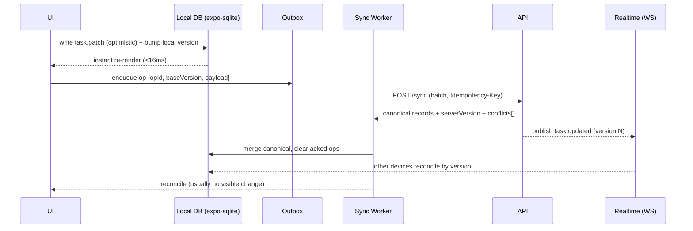
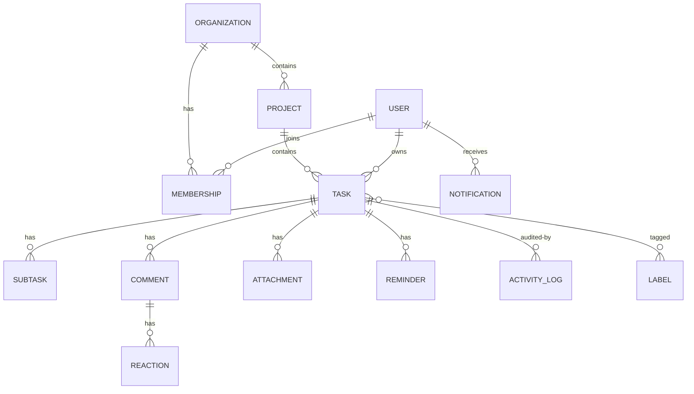
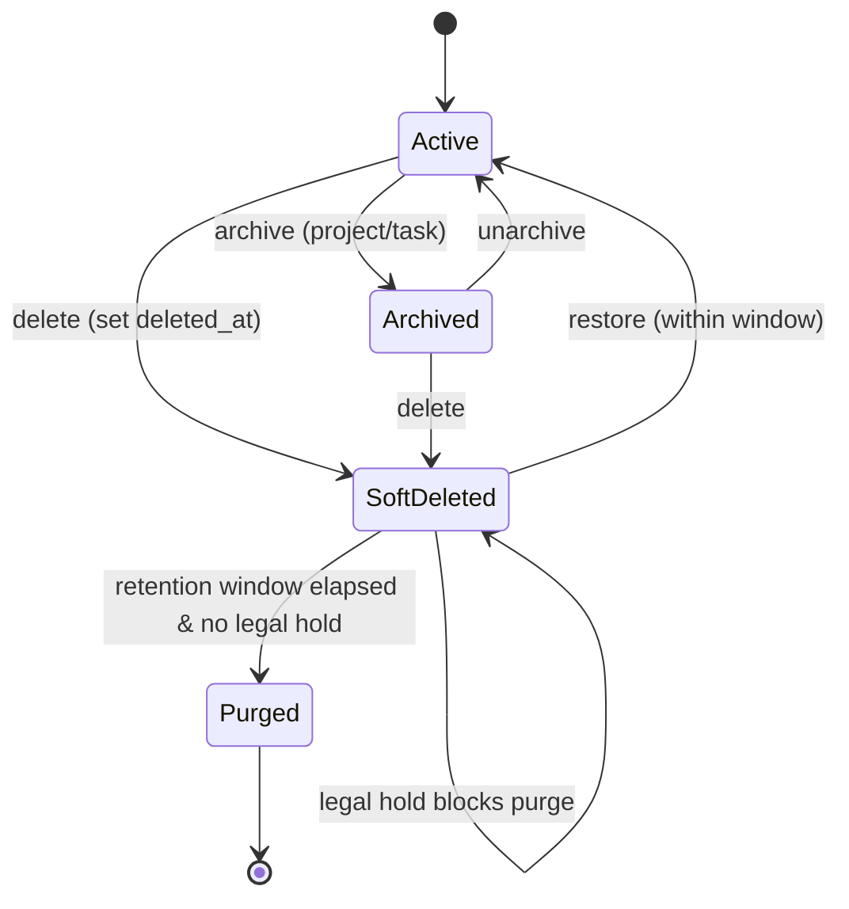

# 17 · Data Model & API

> Authoring standard: [00-prd-template.md](./00-prd-template.md).

> Follows the [Master PRD Template](./00-prd-template.md), modeled on the reference-depth
> exemplars [10 · Task Detail](./10-task-detail.md) and
> [19 · AI Assistant & Copilot](./19-ai-assistant-copilot.md). This is a **foundation
> module**: it defines the canonical entities, relationships, indexing/soft-delete/audit
> conventions, and the core REST + WebSocket surface that every other module projects.
> Built on **Expo SDK 57 · React Native 0.86 · React 19.2.3**; local mirror via
> `expo-sqlite`, offline outbox per [shared/offline-sync-engine.md](./shared/offline-sync-engine.md).

---

## 1. Purpose

The Data Model & API is the **shared vocabulary** between the iOS client, the local
offline cache, and the server. Every screen in Numil — My Tasks, Team Projects, Calendar,
Reports, Copilot — is a *projection* of the entities defined here. If the model is wrong,
every feature inherits the bug; if it is right, features compose cleanly.

**User problem it solves (indirectly).** Users never see this module, but they feel it:
tasks that sync losslessly across devices, edits that survive airplane mode, history that
never lies, and permissions that never leak a private task to an admin. A precise contract
is what makes "offline-first, organization-ready" real rather than aspirational.

**Engineering goals**
- One canonical schema, one set of relationships, one conflict strategy — no per-feature
  reinvention.
- Contracts stable enough that client and server teams build in parallel from this doc
  **without asking further questions**.
- Enterprise-grade from day one: soft-delete tombstones, immutable audit/history, versioned
  optimistic concurrency, retention + legal hold.

**Business goals**
- Lower cost of change: additive, backward-compatible evolution (see §22).
- Enterprise sales enablement: auditability, data export/erasure, residency.
- Platform leverage: the same entities power the [Developer API & Webhooks](./38-developer-api-webhooks.md)
  and [Integrations](./32-integrations.md).

**KPIs the model moves:** sync success rate (>99.9% of ops acked without loss), conflict
rate (<0.1% of writes hit non-trivial conflict), p95 read latency from cache (<16ms) and
from API (<300ms), audit completeness (100% of mutating actions logged), and schema-change
lead time (additive change shippable in <1 day).

---

## 2. Navigation

This module has no consumer-facing screen, but it exposes three **operator/developer
surfaces** and is *entered* implicitly by every data read/write.

**Entry points**
- **Admin → Data & API console** — schema browser, index/health view, retention settings.
  Route `src/app/admin/data/index.tsx` (Admin/Owner only).
- **Developer settings → API & Sync** — token scopes, webhook config (defers to
  [38-developer-api-webhooks.md](./38-developer-api-webhooks.md)), sync status/diagnostics.
  Route `src/app/settings/developer.tsx`.
- **Sync status affordance** — the small "will sync / synced / N pending" chip surfaced on
  list headers; taps into `src/app/settings/sync.tsx`.
- Deep links: `numil://admin/data`, `numil://settings/sync`.

**Navigation hierarchy & breadcrumbs**
```text
Workspace ▸ Admin ▸ Data & API ▸ [Entity]
Workspace ▸ Settings ▸ Developer ▸ API & Sync
```

**Transitions & modal-vs-push**
- Admin console entities open as **push** (deep, back-stacked inspection).
- The sync-status detail opens as a **sheet** (medium detent) from any list — quick glance,
  swipe to dismiss, per [shared/animation-spec.md](./shared/animation-spec.md).

Every other module reaches this layer through the **client data store** (Zustand +
`expo-sqlite`), not through navigation — reads resolve from cache first, writes go through
the optimistic path in §10.

---

## 3. Complete UI Layout

The only rendered surface is the **Admin Data & API console** (schema/health/retention).
It obeys the north star: one primary action (search an entity), power behind disclosure.

```text
┌───────────────────────────────────────────────┐
│  ‹ Admin        Data & API            ⓘ  ⌕     │  ← glass nav, Dynamic Island safe
├───────────────────────────────────────────────┤
│  ⌕ Search entities, fields, indexes…           │  ← search (primary action)
├───────────────────────────────────────────────┤
│  Entities                          32 tables   │
│   ▸ Task            1.2M rows   idx 6   audit ✓ │  ← disclosure rows
│   ▸ Project        18.4K rows   idx 3   audit ✓ │
│   ▸ Comment         4.9M rows   idx 2   append  │
│   ▸ Attachment      2.1M rows   idx 2   scan ✓  │
├───────────────────────────────────────────────┤
│  Task ▾  (expanded)                             │
│   Columns · Indexes · Constraints · Relations   │  ← segmented
│   ┌──────────────────────────────────────────┐ │
│   │ due_at        timestamp?   idx(assignee)  │ │
│   │ status        text         → statusColumns│ │
│   │ version       int          optimistic     │ │
│   │ deleted_at    timestamp?   soft-delete    │ │
│   └──────────────────────────────────────────┘ │
├───────────────────────────────────────────────┤
│  Health                                         │
│   Sync p95 210ms · Conflicts 0.04% · Lag 0.8s  │  ← health strip
├───────────────────────────────────────────────┤
│  [ Open API Playground ]   [ Retention rules ] │  ← secondary actions
└───────────────────────────────────────────────┘
```

- **Top:** glass nav bar with search; respects top safe area + Dynamic Island.
- **Middle:** entity list (FlashList) → tap to expand columns/indexes/constraints/relations
  as a segmented inspector. Row badges show row count, index count, and whether the entity
  is audited / append-only / malware-scanned.
- **Health strip:** live sync p95, conflict %, replication lag — links to
  [43-observability-error-monitoring.md](./43-observability-error-monitoring.md).
- **Bottom:** secondary actions (API Playground, Retention rules). Empty space is generous.
- **iPad/landscape:** two-pane — entity list left, inspector right (Notion-style).

---

## 4. Complete Component Breakdown

| Area | Components |
|------|-----------|
| Nav bar | `GlassNavBar`, back button, `InfoButton`, `SearchField` |
| Entity list | `EntityList` (FlashList), `EntityRow`, `RowCountBadge`, `IndexBadge`, `AuditBadge`, `AppendOnlyBadge`, `ScanBadge` |
| Inspector | `SegmentedControl` (Columns/Indexes/Constraints/Relations), `ColumnRow`, `IndexRow`, `ConstraintRow`, `RelationChip`, `EnumValueList` |
| Health | `HealthStrip`, `MetricTile` (p95/conflict/lag), `SparklineMini` |
| Actions | `ApiPlaygroundButton`, `RetentionRulesButton`, `ExportSchemaButton` |
| Client data layer (non-visual) | `Store` (Zustand), `LocalDb` (`expo-sqlite`), `Outbox`, `SyncWorker`, `EntityRepository<T>`, `QueryBuilder`, `ConflictResolver`, `Tombstone` |
| Feedback | `Skeleton`, `Toast`/`Snackbar`, `Banner` (offline/conflict), `ConfirmDialog` (retention change) |

Visual primitives are defined in [03-design-system-ui.md](./03-design-system-ui.md); the
client data-layer classes are architecture-level (see [02-architecture-tech-stack.md](./02-architecture-tech-stack.md)).

---

## 5. Modern Features

Each feature: **Purpose · Workflow · UI · Permissions · Offline · API · DB · Notify · AC.**

### 5.1 Optimistic concurrency via `version` + `If-Match`
- **Purpose:** safe concurrent edits without last-writer clobbering silently.
- **Workflow:** client reads `version`; mutation sends `If-Match: <version>`; server bumps
  version on success or returns `409 conflict` with the server copy.
- **UI:** invisible on success; conflict shows a non-blocking banner + merge choice.
- **Permissions:** actor must have mutate scope on the entity.
- **Offline:** `baseVersion` captured in the outbox op; reconciled at drain.
- **API:** `If-Match`/`ETag` per [shared/api-conventions.md](./shared/api-conventions.md).
- **DB:** `version int` column, monotonic, server-authoritative.
- **Notify:** none (conflict surfaces in-app only).
- **AC:** mismatched `If-Match` → `409` with server body; retried op never double-applies.

### 5.2 Soft-delete + tombstones
- **Purpose:** recoverable deletes, safe sync of removals, retention/legal-hold compliance.
- **Workflow:** delete sets `deleted_at`; a tombstone propagates via `/sync`; purge job runs
  after the retention window unless a legal hold blocks it.
- **UI:** deleted items vanish with a 5s **Undo** snackbar; Admin can view/restore within
  window from the console.
- **Permissions:** delete per role matrix (§11); restore = Admin or original owner.
- **Offline:** delete is an op; a delete beats a concurrent edit unless edit is newer +
  policy=restore (default delete wins) — see offline engine.
- **API:** `DELETE /:entity/:id` (soft) · `POST /:entity/:id/restore`.
- **DB:** `deleted_at timestamp?`; partial indexes exclude tombstones from hot paths.
- **Notify:** watchers optionally notified on delete/restore.
- **AC:** deleted rows excluded from default queries; restore returns full state + history.

### 5.3 Immutable audit + entity history
- **Purpose:** enterprise trust — who changed what, when, before→after.
- **Workflow:** every mutating action appends an `activity_log` row; select entities also
  snapshot versions (e.g., `description_versions`).
- **UI:** Task Detail Activity tab; org-wide feed in [29-activity-feed-audit-logs.md](./29-activity-feed-audit-logs.md).
- **Permissions:** read audit per role (Owner/Admin all; Manager scoped).
- **Offline:** audit is written server-side on op apply (canonical), mirrored to client.
- **API:** `GET /:entity/:id/activity?cursor=`.
- **DB:** `activity_log` (append-only), history tables append-only.
- **Notify:** none directly.
- **AC:** 100% of mutations produce an audit row; audit is append-only (no update/delete).

### 5.4 Expand, sparse fields, cursor pagination
- **Purpose:** one round-trip reads; no over-fetch on mobile.
- **Workflow:** `?expand=assignee,labels&fields=id,title,dueAt&limit=50&cursor=…`.
- **UI:** powers fast list hydration; FlashList windows the results.
- **Permissions:** expansions re-checked per relation (never leak inaccessible rows).
- **Offline:** cache stores normalized entities; expansions resolve locally.
- **API:** conventions in [shared/api-conventions.md](./shared/api-conventions.md).
- **DB:** covering indexes support common projections.
- **Notify:** n/a.
- **AC:** cursor pagination stable under insert; sparse fields honored; expands authorized.

### 5.5 Idempotent mutations + batch sync
- **Purpose:** retries never duplicate; offline outbox drains safely.
- **Workflow:** each mutation carries `Idempotency-Key`; `/sync` POSTs a batch of ops keyed
  by `opId`; server caches results 24h.
- **UI:** invisible; the "N pending" chip drops to 0 on success.
- **Permissions:** each op authorized independently.
- **Offline:** core of the outbox model (see §10 / offline engine).
- **API:** `POST /sync` (batch), `Idempotency-Key` on single mutations.
- **DB:** server keeps an idempotency ledger keyed by `opId`/`Idempotency-Key`.
- **Notify:** n/a.
- **AC:** replayed batch produces identical result; partial-failure returns per-op status.

### 5.6 Full-text + semantic search projections 🔜
- **Purpose:** fast search over titles/descriptions/comments; AI semantic layer.
- **Workflow:** writes maintain a search index + embeddings table (see [39-search-indexing-semantic.md](./39-search-indexing-semantic.md)).
- **UI:** consumed by [14-search-filters-views.md](./14-search-filters-views.md).
- **Permissions:** results filtered to accessible rows at query time.
- **API/DB:** `search_index` (FTS), `ai_embeddings` (pgvector) — kept in sync via triggers.
- **AC:** deleted/again-restricted rows never appear in results.

### 5.7 Custom fields & task types 🟣
- Project/org-defined fields stored as `custom_field_defs` + `custom_field_values`
  (typed, validated). Read paths expand them into the task projection. See
  [10-task-detail.md](./10-task-detail.md) §5.7.

---

## 6. Smart AI Features

The data layer is what makes Numil AI (see [19-ai-assistant-copilot.md](./19-ai-assistant-copilot.md))
grounded rather than hallucinatory.

| Capability | Data-layer role |
|-----------|-----------------|
| **Schema-aware NL query** | AI compiles natural language into safe, permission-scoped `QueryBuilder` filters (never raw SQL from the model). |
| **Semantic retrieval (RAG)** | `ai_embeddings` table indexes tasks/comments/docs; retrieval is filtered to the caller's scope before ranking. |
| **Auto-derived read models** | AI features read denormalized projections (e.g., workload rollups) rather than scanning hot tables. |
| **Anomaly/at-risk detection** | Reads audit + history to detect slipping dates, stale tasks. |
| **Embedding lifecycle** | Source delete cascades embedding delete (GDPR). |

**Guardrails:** AI never bypasses `can(actor, action, resource)`; retrieved content is
treated as untrusted data (prompt-injection defense); no task content in analytics; all AI
reads/writes go through the same authorization + audit path as human actions.

---

## 7. Productivity Features

- **Saved views as queries:** a `SavedView.query` is a portable filter document compiled to
  the same `?filter[...]=` + `?sort=` params used by the API — one query language for UI,
  API, and AI. See [14-search-filters-views.md](./14-search-filters-views.md).
- **Bulk operations:** multi-select maps to a single batch `POST /sync` (atomic per op,
  idempotent) — bulk complete/move/label with one round trip.
- **Quick filters:** Today/Upcoming/Overdue/Assigned are pre-baked query presets backed by
  covering indexes for instant results.
- **Prefetch on navigation:** opening a project prefetches its task page so Task Detail
  opens <150ms from cache.

---

## 8. Enterprise Features

- **Audit & history tables** (immutable) for every entity; exportable for eDiscovery.
- **Retention policy per org:** configurable purge windows for completed tasks, notifications,
  and audit; **legal hold** overrides purge (see [40-security-compliance-center.md](./40-security-compliance-center.md)).
- **Data residency & at-rest encryption:** region pinning; optional on-device SQLCipher
  (enterprise) per [shared/security-baseline.md](./shared/security-baseline.md).
- **SCIM-provisioned identities:** `User`/`Membership` accept SCIM-sourced attributes; see
  [13-organization-members-roles.md](./13-organization-members-roles.md).
- **Data export & erasure:** machine-readable export + right-to-erasure with
  cascade/anonymize — see [37-backup-import-export.md](./37-backup-import-export.md).
- **Custom roles (v2):** permission checks evaluate an org-defined allow-list identically to
  built-in roles (see [shared/rbac-permissions.md](./shared/rbac-permissions.md)).

---

## 9. Collaboration Features

- **Realtime fan-out:** mutations publish `*.created|updated|deleted` on channels
  `org:{id}`, `project:{id}`, `task:{id}`, `user:{id}`; clients reconcile by `version`.
- **Presence & typing:** ephemeral (not persisted) events on task/project channels.
- **Multi-device coherence:** per-device cursors; server fans out via push + WebSocket;
  optimistic edits reconcile via versioning.
- **Shared saved views:** `SavedView.scope = shared` makes a query visible org/project-wide.
- **Append-only collaboration data:** comments, reactions, and activity merge by id and
  never conflict.

---

## 10. Offline Architecture

Deltas over [shared/offline-sync-engine.md](./shared/offline-sync-engine.md) (canonical):

- **Local mirror:** `expo-sqlite` holds a normalized copy of orgs, projects, tasks,
  subtasks, comments, labels, saved views; blobs cached on FS via `expo-image`.
- **Outbox op shape** (`{opId, entity, type, entityId, payload, baseVersion, clientTs,
  deviceId}`) is the canonical write; all §5 mutations enqueue one.
- **Conflict strategy:** scalar fields = field-level LWW on server timestamps; structural
  conflicts (moved to a project you lost access to, deleted status column) → server wins with
  a non-blocking notice; comments/activity = append-only merge; `order` = fractional indexing.
- **Delete vs edit:** delete beats concurrent edit unless edit is newer + policy=restore
  (default delete wins). Op referencing a since-deleted parent → `409 gone`, op dropped +
  notice.
- **Priority sync:** visible screen's data + overdue reminders drain first; bulk history lazy.



---

## 11. Security

Deltas over [shared/security-baseline.md](./shared/security-baseline.md) and
[shared/rbac-permissions.md](./shared/rbac-permissions.md):

- Authorization is a pure function `can(actor, action, resource)` enforced **server-side**
  on every route and every realtime message; the client mirrors it only to hide UI.
- **List endpoints scope at the query** (filter to authorized rows) — never over-fetch then
  filter in memory.
- **Personal tasks** (`project_id IS NULL`) are readable only by their owner — even Admins
  cannot read them.
- Rich text / comments are sanitized (output encoding); attachments are type/size-validated
  + malware-scanned before availability; URLs are signed + expiring.
- No PII/task content in logs or analytics; audit stores metadata, before/after redacted per
  policy.

**Data-access & mutation permission matrix** (org roles; `*` = within accessible scope):

| Action | Owner | Admin | Manager | Member | Guest |
|--------|:-----:|:-----:|:-------:|:------:|:-----:|
| Read org-readable entity | ✅ | ✅ | ✅ | ✅ | shared |
| Read personal task (not owner) | ❌ | ❌ | ❌ | ❌ | ❌ |
| Create task | ✅ | ✅ | ✅ | ✅* | shared* |
| Update / soft-delete task | ✅ | ✅ | ✅* | own/assigned* | shared* |
| Restore soft-deleted | ✅ | ✅ | scoped | own | ❌ |
| Read audit / history | ✅ | ✅ | scoped | own actions | ❌ |
| Manage custom fields | ✅ | ✅ | project | ❌ | ❌ |
| Configure retention / legal hold | ✅ | ✅ | ❌ | ❌ | ❌ |
| Data export / erasure | ✅ | ✅ | ❌ | own data | ❌ |
| Purge (hard delete) | ✅ | ❌ | ❌ | ❌ | ❌ |

---

## 12. Notification System

Deltas over [12-notifications-alerts.md](./12-notifications-alerts.md):
- The data layer is the **source** of notification triggers: field changes (assignment, due
  change, status), append events (comment, mention), and lifecycle events (delete/restore).
- `notification.created` is emitted on the `user:{id}` channel; the `Notification` entity is
  the persisted inbox row.
- Reminder scheduling reads `due_at`/`scheduled_at`/`Reminder` rows; changing an anchor
  atomically reschedules local reminders.

---

## 13. Accessibility

Deltas over [shared/accessibility-spec.md](./shared/accessibility-spec.md):
- The Admin Data & API console is fully VoiceOver-labeled: entity rows announce name + row
  count + badges ("Task, 1.2 million rows, audited"); the segmented inspector exposes
  Columns/Indexes/Constraints/Relations as labeled tabs.
- Health metrics have text alternatives (no color-only status; "conflict rate 0.04%, healthy").
- All flows completable via Full Keyboard Access on iPad; snapshot tests at AX5.

---

## 14. Animations

Deltas over [shared/animation-spec.md](./shared/animation-spec.md):
- Entity-row expand/collapse uses `spring.gentle`; the inspector cross-fades on segment change
  (`motion.fast`).
- The sync-status chip animates count changes with `motion.instant`; a successful drain pulses
  the "synced" check once (skipped under Reduce Motion).
- No decorative motion — every animation here communicates state (syncing / synced / conflict).

---

## 15. Performance

- **Indexing over scanning:** every hot query is backed by a covering or partial index (see
  §16). Overdue/Today lists use `WHERE completed_at IS NULL AND deleted_at IS NULL`.
- **No N+1:** expansions are batched (data-loader pattern) server-side; the client reads
  normalized rows from `expo-sqlite` and joins in memory.
- **Cursor pagination** everywhere; offset pagination is banned on large tables.
- **Read models:** dashboards/reports read denormalized rollups, not live aggregates.
- **Client:** lists virtualized (FlashList); reads resolve from cache (<16ms); network is off
  the interaction path (optimistic). Startup hydrates only the active workspace's hot set.
- **Budgets:** API p95 <300ms for reads, <500ms for writes; realtime lag p95 <1s.

---

## 16. Database Design

Canonical consolidated schema (the fenced entity-relationship snippet). `?` = nullable,
`→` = FK. Every mutable entity carries `org_id`, `version`, `created_at`, `updated_at`,
`deleted_at?` unless noted append-only.

```text
users(id, name, email UNIQUE, avatar_url?, time_zone, time_format, week_start,
      created_at, updated_at)
organizations(id, name, logo_url?, default_time_zone, default_reminder_time,
      members_can_create_projects, default_project_visibility, owner_id→users,
      retention_json, region, created_at, updated_at)
memberships(id, user_id→users, org_id→organizations, role, status, last_active_at)
      UNIQUE(user_id, org_id)
invites(id, org_id→organizations, email, role, code, expires_at, accepted_at?)
projects(id, org_id→organizations, name, color, description?, visibility,
      status_columns_json, default_view, archived_at?, version, created_at, updated_at,
      deleted_at?)
project_members(project_id→projects, user_id→users, project_role)  PK(project_id,user_id)
tasks(id, org_id→organizations, project_id?→projects, owner_id→users, assignee_id?→users,
      title, description_json, status?, priority, due_at?, due_has_time, scheduled_at?,
      duration_min?, recurrence_json?, completed_at?, order, version, created_at,
      updated_at, deleted_at?)
subtasks(id, task_id→tasks, title, assignee_id?→users, due_at?, completed_at?, order,
      version, deleted_at?)
labels(id, org_id→organizations, name, color)          task_labels(task_id→tasks, label_id→labels) PK(task_id,label_id)
comments(id, task_id→tasks, author_id→users, body_json, mentions[], parent_id?→comments,
      pinned, created_at, edited_at?, deleted_at?)                 -- append-only body
reactions(id, comment_id→comments, user_id→users, emoji, created_at)
      UNIQUE(comment_id, user_id, emoji)
attachments(id, task_id→tasks, kind, url, name, size_bytes?, mime_type?, upload_state,
      scan_state, created_at, deleted_at?)
reminders(id, task_id→tasks, anchor, offset_min, absolute_at?)
task_links(id, from_task→tasks, to_task→tasks, type)              -- deps/relations
watchers(task_id→tasks, user_id→users)                            PK(task_id,user_id)
notifications(id, user_id→users, type, task_id?→tasks, project_id?→projects, body,
      read_at?, created_at)
saved_views(id, owner_id?→users, org_id?→organizations, scope, name, query_json)
activity_log(id, org_id→organizations, entity_type, entity_id, actor_id→users, action,
      before_json, after_json, created_at)                        -- immutable
description_versions(id, task_id→tasks, body_json, editor_id→users, created_at)  -- history
custom_field_defs(id, project_id→projects, name, type, config_json, order)
custom_field_values(task_id→tasks, field_id→custom_field_defs, value_json)
      PK(task_id, field_id)
search_index(entity_type, entity_id, org_id, tsv)                 -- FTS projection
ai_embeddings(id, org_id, entity_type, entity_id, vector, updated_at)  -- pgvector (RAG)
idempotency_ledger(key, actor_id, request_hash, response_json, created_at)  -- 24h TTL
```

**ER overview**


**Record lifecycle (state)**


**Indexes (representative)**
- `tasks(project_id, status) WHERE deleted_at IS NULL`
- `tasks(assignee_id, due_at) WHERE completed_at IS NULL AND deleted_at IS NULL`
- `tasks(org_id, due_at) WHERE completed_at IS NULL` (Today/Overdue)
- `comments(task_id, created_at)`, `activity_log(org_id, entity_type, entity_id, created_at)`
- `memberships(org_id, role)`, `notifications(user_id, read_at, created_at)`
- Full-text on `search_index(tsv)`; ANN (hnsw/ivfflat) on `ai_embeddings(vector)`.

**Constraints & conventions**
- `assignee_id` ∈ project members; personal task ⇒ `project_id IS NULL` and
  `assignee_id = owner_id`. Recurrence requires a `due_at` or `scheduled_at` anchor.
- `status` ∈ the project's `status_columns_json`. `order` is a float (fractional indexing).
- **Soft delete** via `deleted_at` (tombstone); hot-path indexes are partial to exclude them.
- **Audit/history** (`activity_log`, `description_versions`) are **append-only** — no update
  or delete; retention/legal-hold governs eventual purge.
- Times stored **UTC**; `due_has_time=false` ⇒ all-day (reminders use org/user default time).

---

## 17. API Design

Follows [shared/api-conventions.md](./shared/api-conventions.md) (base `https://api.numil.app/v1`,
UTC ISO-8601, UUID ids, `Authorization: Bearer`, `X-Org-Id`, `Idempotency-Key` on mutations,
`If-Match` for concurrency, cursor pagination, standard error envelope).

**Core REST surface**

| Method | Path | Purpose | Key perms |
|--------|------|---------|-----------|
| POST | `/auth/login` · `/auth/refresh` · `/auth/otp/verify` | Auth/token rotation | public/self |
| GET | `/me` | Current user + memberships | self |
| GET | `/orgs/:id` · `/orgs/:id/members` | Org profile / members | member+ |
| POST | `/orgs/:id/invites` | Invite member | admin/manager |
| PATCH | `/memberships/:id` | Change role/status | admin |
| GET | `/projects?filter[org]=&limit=&cursor=` | List accessible projects | member+ |
| POST | `/projects` | Create project | manager+ (or member if enabled) |
| GET | `/projects/:id/tasks?expand=assignee,labels&sort=-dueAt` | Tasks in project | project member |
| GET | `/tasks?filter[assignee]=me&filter[due]=today` | Filtered/quick-view tasks | self scope |
| GET | `/tasks/:id?expand=subtasks,comments,attachments` | Task detail | task scope |
| POST | `/tasks` | Create task | contributor+ |
| PATCH | `/tasks/:id` (If-Match) | Partial update | contributor+ |
| POST | `/tasks/:id/complete` | Complete (+spawn recurrence) | contributor+ |
| DELETE | `/tasks/:id` · POST `/tasks/:id/restore` | Soft-delete / restore | per §11 |
| POST | `/tasks/:id/comments` · `/comments/:id/reactions` | Comment / react | viewer+ |
| GET | `/tasks/:id/activity?cursor=` | Audit/history | scoped |
| GET | `/notifications` | Inbox feed | self |
| GET | `/sync?since=<cursor>` · POST `/sync` | Delta pull / batch push | self scope |

**Realtime (WebSocket):** connect `wss://rt.numil.app/v1?token=<access>`; channels
`org:{id}`, `project:{id}`, `task:{id}`, `user:{id}`; events `*.created|updated|deleted`,
`comment.created`, `reaction.created`, `presence.changed`, `typing.changed`,
`notification.created`. Envelope: `{ "type","channel","version","data","ts" }`. Clients
reconcile by `version`; missed events recovered via `GET /sync?since=`.

**Errors:** `validation_failed` 422, `unauthorized` 401, `forbidden` 403, `not_found` 404,
`gone` 409 (deleted), `conflict` 409 (version), `rate_limited` 429 (`Retry-After`),
`server_error` 500 (with `requestId`).

**Sample request + response** — partial update with optimistic concurrency:

```http
PATCH /v1/tasks/1f2e-…-abc HTTP/1.1
Host: api.numil.app
Authorization: Bearer <accessToken>
X-Org-Id: 9a11-…-org
Idempotency-Key: 4c0b-…-key
If-Match: 12
Content-Type: application/json

{ "priority": "high", "dueAt": "2026-07-17T11:30:00Z", "dueHasTime": true, "assigneeId": "77b3-…-usr" }
```

```json
{
  "data": {
    "id": "1f2e-…-abc",
    "priority": "high",
    "dueAt": "2026-07-17T11:30:00Z",
    "dueHasTime": true,
    "assigneeId": "77b3-…-usr",
    "version": 13,
    "updatedAt": "2026-07-16T22:41:07Z"
  },
  "meta": { "requestId": "req_8f2c…" }
}
```

**Conflict example** (`If-Match` stale) → `409`:

```json
{ "error": { "code": "conflict", "message": "Version mismatch",
  "field": "version", "requestId": "req_8f2d…" },
  "data": { "id": "1f2e-…-abc", "version": 14, "priority": "urgent" } }
```

**Batch sync push** — `POST /sync`:

```json
{ "ops": [
  { "opId": "op-1", "entity": "task", "type": "update", "entityId": "1f2e-…-abc",
    "payload": { "status": "in_progress" }, "baseVersion": 12, "clientTs": "2026-07-16T22:40:59Z" },
  { "opId": "op-2", "entity": "comment", "type": "create", "entityId": "cmt-9",
    "payload": { "taskId": "1f2e-…-abc", "bodyJson": {"t":"lgtm"} }, "clientTs": "2026-07-16T22:41:01Z" }
] }
```

Response returns per-op status + canonical records + `nextCursor`; `opId` dedupes retries.

Detailed sync semantics live in [shared/offline-sync-engine.md](./shared/offline-sync-engine.md);
public/partner surface in [38-developer-api-webhooks.md](./38-developer-api-webhooks.md).

---

## 18. Edge Cases

- **Stale `If-Match`:** `409 conflict` returns server copy; client offers merge (scalar LWW)
  or keep-both restore point for rich text.
- **Op on deleted parent:** `409 gone`; op dropped with a non-blocking notice.
- **Permission lost mid-edit:** next op `403`; local changes rolled back with notice.
- **Duplicate submit (retry/flaky net):** deduped by `opId`/`Idempotency-Key` (24h ledger).
- **Clock skew:** server timestamps authoritative; `clientTs` used only for tie ordering.
- **Enum drift (status column deleted):** structural conflict → server value wins; task lands
  in a valid default column with notice.
- **Recurrence with no anchor:** `422 validation_failed` (anchor required).
- **Personal task assigned to non-owner:** rejected `422` (invariant).
- **Attachment mid-scan:** `upload_state=ready`, `scan_state=pending` → not downloadable until
  `scan_state=clean`; `infected` → quarantined + purged.
- **Cursor invalidated (bulk delete during pagination):** server returns a fresh cursor; no
  duplicate/skipped rows.
- **Retention purge vs legal hold:** legal hold blocks purge even past the window.
- **Multi-device echo:** a device ignores realtime events whose `version` ≤ its local version.
- **Timezone/DST change:** stored UTC re-renders local; reminders recomputed.

---

## 19. User States

- **First-time (developer/admin):** empty API playground with example calls; schema browser
  seeded with core entities; coach-mark on the sync-status chip.
- **Returning/power (admin):** health strip trends; retention rules; export tools.
- **Member:** never sees this module directly; benefits via fast, offline-safe data.
- **Guest:** all reads/writes resolve only to explicitly shared resources; no audit/console.
- **Manager/Admin/Owner:** scoped→full audit and retention controls; Owner alone can purge.
- **Offline / poor network:** reads from cache; writes queued; "N pending" chip; no dead
  spinners.
- **Tablet/landscape:** two-pane schema/inspector.
- **Dark mode / large text / a11y:** tokens + Dynamic Type; VoiceOver on console verified.

---

## 20. Analytics Events

Schema + global properties per [shared/analytics-taxonomy.md](./shared/analytics-taxonomy.md)
(never log task titles/PII). Module-specific events:

| event_name | Trigger | Key properties |
|------------|---------|----------------|
| `sync_started` | Outbox drain begins | `op_count`, `trigger` (foreground/reconnect/push) |
| `sync_completed` | Batch acked | `op_count`, `duration_ms`, `conflicts` |
| `sync_conflict_resolved` | Conflict merged | `entity`, `strategy` (lww/server/keep_both) |
| `sync_failed` | Permanent failure | `op_count`, `error_code` |
| `entity_created` / `entity_updated` / `entity_deleted` | Local mutation | `entity`, `offline` |
| `entity_restored` | Soft-delete restore | `entity` |
| `api_request` | Client→server call (sampled) | `route`, `status`, `latency_ms`, `cache_hit` |
| `schema_viewed` | Admin console entity opened | `entity` |
| `retention_rule_changed` | Retention edit | `entity`, `window_days` |
| `export_requested` | Data export | `scope`, `format` |

---

## 21. Acceptance Criteria

1. All entities and relationships match the §16 schema.
2. Every mutable entity has `version`, `created_at`, `updated_at`, and `deleted_at?`.
3. Times are stored UTC; `due_has_time` distinguishes all-day from timed.
4. `PATCH` with a stale `If-Match` returns `409 conflict` plus the server copy.
5. A successful mutation increments `version` monotonically.
6. Every mutating action appends exactly one immutable `activity_log` row.
7. Audit and history tables reject updates and deletes (append-only).
8. Soft-deleted rows are excluded from default queries.
9. Restore within the retention window returns full state and history.
10. Purge (hard delete) is Owner-only and blocked by an active legal hold.
11. `Idempotency-Key`/`opId` dedupe retried mutations (no duplicates).
12. `POST /sync` accepts a batch and returns per-op status + canonical records.
13. `GET /sync?since=` returns changed entities plus a `nextCursor`.
14. Field-level LWW resolves scalar conflicts using server timestamps.
15. Comments/reactions/activity merge by id and never conflict.
16. `order` uses fractional indexing (no renumber storms on reorder).
17. Cursor pagination is stable under concurrent inserts/deletes.
18. `expand`/`fields` are honored and re-authorized per relation.
19. List endpoints scope at the query — no over-fetch-then-filter.
20. Personal tasks (`project_id IS NULL`) are unreadable by Admins/others.
21. `assignee_id` must be a member of the task's project (else `422`).
22. Personal task cannot have an assignee other than the owner (`422`).
23. Recurrence requires a `due_at`/`scheduled_at` anchor (else `422`).
24. `status` must be a member of the project's `status_columns_json`.
25. Attachments are unavailable until `scan_state = clean`.
26. Realtime events publish on the correct channels with a `version`.
27. Clients ignore realtime events with `version` ≤ local version.
28. Missed realtime events are recoverable via delta `/sync?since=`.
29. Permission is enforced server-side on every route and realtime message.
30. Guests resolve only explicitly shared resources across REST and realtime.
31. Role changes take effect immediately (claims refresh).
32. Hot queries are index-backed; overdue/Today use partial indexes.
33. API read p95 <300ms; write p95 <500ms; realtime lag p95 <1s.
34. Cache reads render in <16ms; network is off the interaction path.
35. Errors use the standard envelope with a `requestId`.
36. `429` responses include `Retry-After` and `X-RateLimit-*`.
37. Data export produces machine-readable output; erasure cascades/anonymizes.
38. Embeddings/search entries are deleted when their source row is deleted.
39. No task content or PII appears in logs or analytics.
40. Analytics events fire with correct properties, including offline-buffered.
41. Multi-device edits reconcile via versioning with no lost updates.
42. DST/timezone changes re-render times correctly and recompute reminders.

---

## 22. Future Roadmap

- **V1 (✅):** canonical entities, versioned optimistic concurrency, soft-delete +
  tombstones, immutable audit + description history, cursor pagination, expand/sparse fields,
  idempotent batch `/sync`, realtime channels, retention basics, permission-scoped queries.
- **V1.1 (🔜):** full-text `search_index`, richer delta sync (partial payload compaction),
  bulk-op transactionality guarantees, per-entity retention windows UI.
- **V2 (🟣):** custom fields/task types in the core projection, `ai_embeddings` RAG layer GA,
  custom roles evaluation, GraphQL read layer for dashboards/reports, cross-region residency.
- **Future (💡):** CRDT-backed rich-text co-editing, field-level history diff API, event
  sourcing for select entities, time-travel queries for audit replay.
- **Experimental (🧪):** on-device encrypted store (SQLCipher) by default, differential
  privacy on analytics aggregates.
- **AI track:** schema-aware NL→query compiler with safety proofs; embedding freshness SLAs.
- **Enterprise track:** eDiscovery export of audit/history, BYO-KMS for at-rest keys,
  SIEM streaming of data-access events.
