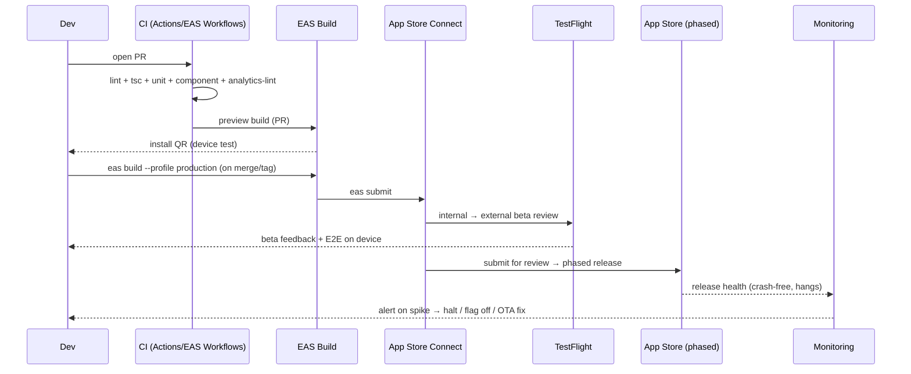
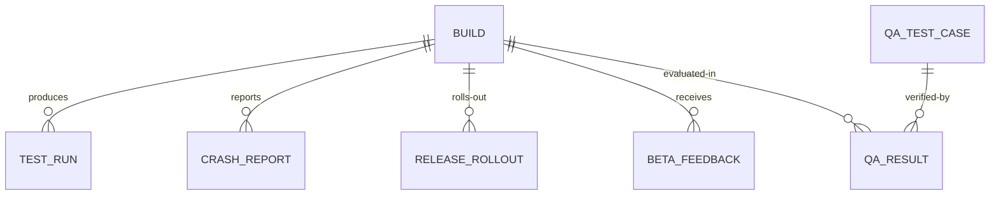
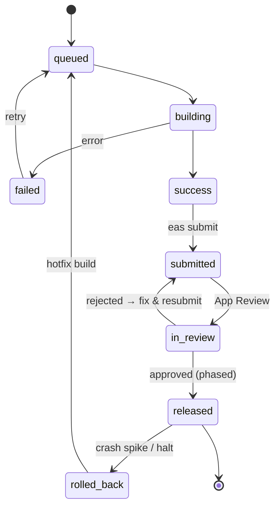

# 18 · iOS Testing & Release

> Authoring standard: [00-prd-template.md](./00-prd-template.md).

> Follows the [Master PRD Template](./00-prd-template.md), modeled on the reference-depth
> exemplars [10 · Task Detail](./10-task-detail.md) and
> [19 · AI Assistant & Copilot](./19-ai-assistant-copilot.md). This is the **quality &
> delivery** foundation module: how Numil is tested (unit → integration → E2E), built (EAS
> profiles), and shipped (TestFlight → App Store → phased rollout), plus crash/error
> monitoring and the QA test-case matrices that trace back to every module's acceptance
> criteria. Grounded in **Expo SDK 57 · React Native 0.86 · React 19.2.3 · Node 22.13+ ·
> iOS 16.4+ · Xcode 26.4+**; bundle id `com.sanketsss.numil`, EAS project
> `fc24f4f1-356f-4325-9282-ceb4712119a4`, owner `sanketsss`.

---

## 1. Purpose

Testing & Release is the discipline that turns a fast-moving codebase into a **trustworthy
iOS product**. It exists so that "offline-first, 60fps, enterprise-ready" is verified, not
assumed — on real iPhones, across OS versions, in the dark, at AX5 text size, on flaky
networks.

**Problem it solves.** Mobile release cost and risk are high: no hot-fix without review,
APNs and background scheduling can't be trusted on Simulator, and a bad build reaches
thousands of users at once. Numil needs a pipeline that catches regressions early (cheap),
verifies device-only behavior late (on TestFlight), and can **halt or roll back** a release
before it hurts users.

**Goals**
- A fast test pyramid: many unit tests, fewer integration tests, a thin E2E layer on the
  critical flows.
- Reproducible cloud builds (EAS) so a Windows dev machine can ship iOS.
- Safe delivery: internal → external TestFlight → **phased** App Store rollout with a kill
  switch (feature flags) and rollback plan.
- Objective quality gates tied to real user metrics (crash-free rate, ANR-equivalent hangs).

**Business goals:** protect the App Store rating, sustain a predictable release cadence,
satisfy enterprise buyers' security/compliance review, and keep engineering velocity high
by trusting the pipeline.

**KPIs:** crash-free sessions ≥99.8% and crash-free users ≥99.5%; E2E pass rate ≥98% on
`main`; PR CI wall-clock <10 min; TestFlight-to-store lead time <3 days; phased-rollout
halt rate <5%; % acceptance criteria with an automated test (coverage of AC, not just LOC).

---

## 2. Navigation

Testing/release is a **pipeline plus a few surfaces**, not a consumer screen.

**Operator/developer entry points**
- **EAS dashboard** (expo.dev) — builds, submissions, update channels.
- **App Store Connect** — TestFlight groups, App Review, phased release, ratings.
- **CI (GitHub Actions / EAS Workflows)** — PR checks, `main` gates, scheduled E2E.
- **Crash/error console** ([43-observability-error-monitoring.md](./43-observability-error-monitoring.md)) —
  Sentry-style crash groups, release health.

**In-app QA surfaces**
- **Shake-to-report / Beta feedback sheet** (dev + preview builds): route
  `src/app/(dev)/feedback.tsx`, deep link `numil://feedback`; captures screenshot + logs +
  build metadata.
- **Debug menu** (dev client): route `src/app/(dev)/debug.tsx` — toggle flags, force sync,
  simulate offline, dump outbox.
- **Beta banner** in preview builds indicating environment + build number.

**Hierarchy / breadcrumbs**
```text
Repo ▸ PR ▸ CI checks ▸ EAS Build ▸ TestFlight ▸ App Store ▸ Phased rollout
Settings ▸ (dev) ▸ Debug / Feedback         (in-app, non-production)
```

**Transitions & modal-vs-push:** the beta feedback surface opens as a **sheet** from the
shake gesture (medium→large detents); the debug menu is a **push** from dev settings.

---

## 3. Complete UI Layout

Two rendered surfaces: the internal **Release Readiness board** (a QA dashboard, may live in
CI/web) and the in-app **Beta Feedback sheet**. ASCII wireframe of both:

```text
┌───────────────────────────────────────────────┐
│  Release Readiness      v1.4.0 (build 214)  ⌕  │  ← version + build
├───────────────────────────────────────────────┤
│  Gates                                          │
│   ✅ Lint (expo lint)         0 errors          │
│   ✅ Types (tsc)              0 errors          │
│   ✅ Unit (jest-expo)     1,842 pass / 0 fail   │
│   ✅ Component (RNTL)       311 pass            │
│   🟡 E2E (Maestro)         57/58 (1 flaky)      │  ← attention state
│   ✅ a11y snapshots (AX5)   no clipping         │
│   ✅ Perf budget            start 780ms         │
├───────────────────────────────────────────────┤
│  Health (last release)                          │
│   Crash-free users 99.71%  ·  Hangs 0.3%        │
├───────────────────────────────────────────────┤
│  Rollout                                         │
│   ▓▓▓░░░░░░░  Phase 2 · 10% · halt available    │  ← phased release
├───────────────────────────────────────────────┤
│  [ Promote to TestFlight ]  [ Submit ]  [ Halt ]│  ← primary + guarded actions
└───────────────────────────────────────────────┘

┌───────── Beta Feedback (in-app sheet) ─────────┐
│  🐞 Report an issue          build 214 · preview│
│  [Screenshot ▣]  attach logs ( )  attach outbox()│
│  What went wrong?                                │
│  ┌───────────────────────────────────────────┐ │
│  │ Reminder fired 3 min late after DST…        │ │
│  └───────────────────────────────────────────┘ │
│  Severity:  ( )low  (•)med  ( )high  ( )blocker  │
│  [ Send to QA ]                                 │
└─────────────────────────────────────────────────┘
```

- **Release board top:** version/build + search; **gates** as pass/attention/fail rows
  (color + icon + label — never color alone).
- **Health strip:** crash-free users + hang rate from the last release.
- **Rollout:** phased-release progress with a prominent **Halt** control.
- **Beta sheet:** one primary action (**Send to QA**); attachments and severity behind simple
  controls; auto-includes build metadata. Above keyboard + home-indicator safe area.
- **iPad/landscape:** the board is two-pane (gates left, health/rollout right).

---

## 4. Complete Component Breakdown

| Area | Components / tools |
|------|--------------------|
| Release board | `VersionHeader`, `GateRow` (pass/attention/fail), `HealthStrip`, `RolloutBar`, `PromoteButton`, `SubmitButton`, `HaltButton` (guarded `ConfirmDialog`) |
| Beta feedback | `FeedbackSheet`, `ScreenshotThumb`, `LogAttachToggle`, `OutboxAttachToggle`, `SeveritySegmented`, `SendButton`, `Toast` |
| Debug menu | `FlagList`, `ForceSyncButton`, `SimulateOfflineToggle`, `OutboxDump`, `EnvBadge` |
| Test tooling | Jest + `jest-expo` preset, `@testing-library/react-native`, `jest` snapshots, **Maestro** (primary E2E) / **Detox** (alt), `tsc`, `expo lint` (ESLint 9) |
| Build/release | **EAS Build** (`development`/`preview`/`production`), **EAS Submit**, **EAS Update** (OTA JS), TestFlight, App Store Connect API, phased release |
| Monitoring | crash/error SDK (Sentry-style), release health, source maps upload, breadcrumb logger |
| CI | GitHub Actions / **EAS Workflows**, PR preview build, required checks, cache |

Visual primitives per [03-design-system-ui.md](./03-design-system-ui.md); build/runtime
architecture per [02-architecture-tech-stack.md](./02-architecture-tech-stack.md).

---

## 5. Modern Features

End-to-end delivery pipeline (the flows the features below implement):



Each feature: **Purpose · Workflow · UI · Permissions · Offline · API · DB · Notify · AC.**
(Some facets are N/A for tooling and are marked.)

### 5.1 Unit testing (Jest + `jest-expo`)
- **Purpose:** verify pure logic cheaply — date/recurrence math, reducers, selectors,
  `can()` permission checks, conflict resolution.
- **Workflow:** `npx expo install jest-expo jest @types/jest --dev`; `preset: "jest-expo"`
  (or `jest-expo/universal` for iOS/Android/web/node runners); files `*-test.ts(x)` or
  `__tests__/`. Add `"jest"` to `tsconfig.json` `types`.
- **UI:** none (CLI + CI report).
- **Permissions:** any engineer runs locally; CI runs on every PR.
- **Offline:** tests run offline by design (native mocked).
- **API/DB:** n/a (logic under test may mock the store).
- **Notify:** CI comments failures on the PR.
- **AC:** unit suite runs in CI on every PR; deterministic; date/recurrence + permission
  logic covered.

### 5.2 Component/integration testing (React Native Testing Library)
- **Purpose:** render components and assert behavior (Task row swipe, Quick-Add NL parse,
  pickers, empty states) without a device.
- **Workflow:** RNTL `render` + `fireEvent`/`userEvent`; query by role/label (a11y-first);
  snapshot at default and AX5 sizes.
- **UI:** n/a.
- **Permissions/Offline/API/DB:** mock the data layer + navigation; assert optimistic UI.
- **Notify:** CI status.
- **AC:** critical components have interaction + a11y-label tests; snapshots gate regressions.

### 5.3 End-to-end testing (Maestro primary / Detox alt)
- **Purpose:** verify whole flows on a simulator/device: login → create task → set reminder
  → complete; offline create → reconnect → sync.
- **Workflow:** Maestro YAML flows run against a `development`/`preview` build; nightly +
  pre-release in CI (Maestro Cloud or a macOS runner). Detox is the alternative for teams
  needing gray-box sync control.
- **UI:** n/a (drives the real UI).
- **Permissions:** CI service account triggers; results visible to team.
- **Offline:** dedicated flow toggles airplane mode to test the sync engine.
- **Notify:** failing flow blocks release promotion.
- **AC:** the golden-path flows pass on the current + previous iOS major before submission.

### 5.4 EAS Build profiles (`eas.json`)
- **Purpose:** reproducible cloud iOS builds without a local Mac (dev machine is Windows).
- **Workflow:** three profiles as configured:

```json
// eas.json (actual)
{
  "cli": { "version": ">= 21.0.0", "appVersionSource": "remote" },
  "build": {
    "development": { "developmentClient": true, "distribution": "internal" },
    "preview":     { "distribution": "internal" },
    "production":  { "autoIncrement": true }
  },
  "submit": { "production": {} }
}
```

| Profile | Use | `developmentClient` | Distribution | Version bump |
|---------|-----|:---:|--------------|--------------|
| `development` | Dev client on device/simulator | ✅ | internal | — |
| `preview` | Internal QA / ad-hoc / TestFlight | — | internal | — |
| `production` | App Store / TestFlight release | — | store | `autoIncrement` |

Commands:

```bash
eas build --profile development --platform ios   # dev client on a physical iPhone
eas build --profile preview     --platform ios   # internal QA build
eas build --profile production   --platform ios   # release build (auto-increments)
eas submit --platform ios                          # upload to App Store Connect / TestFlight
```

- **Permissions:** Owner/Admin trigger production; any engineer triggers dev/preview.
- **AC:** all three profiles build green; `appVersionSource: remote` + `autoIncrement`
  guarantee unique build numbers.

### 5.5 EAS Submit → TestFlight → App Store
- **Purpose:** get builds onto real iPhones and into review.
- **Workflow:** `eas submit` uploads to App Store Connect → internal TestFlight (immediate) →
  external TestFlight (beta review) → App Store submission → phased release.
- **AC:** internal testers install within minutes; external beta passes beta review;
  submission includes privacy labels + Sign in with Apple where social login exists.

### 5.6 Phased rollout + kill switch
- **Purpose:** limit blast radius; halt bad releases.
- **Workflow:** App Store **phased release** (1%→2%→5%→10%→25%→50%→100% over 7 days);
  risky features gated by [42-feature-flags-remote-config.md](./42-feature-flags-remote-config.md)
  so they can be disabled without a new build; EAS Update ships JS-only hot fixes.
- **AC:** rollout can be paused/halted; a flag can disable a feature server-side in minutes;
  a JS regression is fixable via OTA without App Review.

### 5.7 Crash & error monitoring
- **Purpose:** know about failures before users report them.
- **Workflow:** crash/error SDK captures native + JS errors with breadcrumbs; source maps
  uploaded per build; release health tracks crash-free users/sessions and hangs.
- **DB:** `crash_reports`, `release_rollouts` (see §16).
- **Notify:** alert on crash-rate spike / new fatal group during a rollout.
- **AC:** every release uploads source maps; a spike above threshold pages on-call and
  surfaces on the release board.

### 5.8 CI gates
- **Purpose:** stop regressions at the PR.
- **Workflow:** required checks — `expo lint`, `tsc`, unit, component, `analytics-lint`
  (unregistered events fail, per taxonomy); nightly E2E + a11y snapshots; PR preview build.
- **AC:** merge to `main` is blocked unless all required checks pass.

---

## 6. Smart AI Features

AI assists testing/release (all suggestive, human-in-the-loop):

| Capability | What it does |
|-----------|--------------|
| **Flaky-test detection** | Clusters intermittently-failing tests; quarantines + files an issue. |
| **AI test generation** 🧪 | Proposes RNTL/unit tests from a component/diff; engineer reviews. |
| **Crash triage & clustering** | Groups new crashes, guesses the offending commit/module, drafts a title. |
| **AI release notes** | Drafts "What's New" from merged PRs/commits since last tag. |
| **Screenshot diff triage** 🧪 | Explains visual snapshot diffs (intended vs regression). |
| **Log summarization** | Summarizes attached beta-feedback logs into a repro hypothesis. |

Guardrails per [19-ai-assistant-copilot.md](./19-ai-assistant-copilot.md): proposals only,
no auto-merge/auto-submit, no source or user data sent to external training, full audit.

---

## 7. Productivity Features

- **Fast inner loop:** Metro Fast Refresh + `jest --watch`; `expo lint --fix`.
- **PR preview builds:** every PR gets a `preview` build + QR for one-tap install on a device.
- **EAS Build cache** + remote version source keep production builds unique and quick.
- **EAS Update channels** map to `development`/`preview`/`production` for instant JS iteration.
- **One-command flows:** documented scripts (`test`, `test:e2e`, `lint`, `typecheck`) so any
  contributor can validate locally before pushing.
- **Seeded test data:** an ephemeral test org with deterministic fixtures for E2E.

---

## 8. Enterprise Features

- **Signed, reproducible builds** with managed credentials (EAS-managed or org-supplied
  certs/profiles); provenance recorded per build.
- **MDM / custom distribution** for enterprise customers (Apple Business Manager) alongside
  public App Store.
- **Release audit:** who triggered/submitted/halted each build (feeds
  [29-activity-feed-audit-logs.md](./29-activity-feed-audit-logs.md)).
- **Security gates in CI:** dependency/vuln scanning, secret scanning, SAST; a failing scan
  blocks a production build (see [40-security-compliance-center.md](./40-security-compliance-center.md)).
- **Accessibility compliance gate:** AX5 snapshot + contrast checks required for release
  (WCAG 2.2 AA per [shared/accessibility-spec.md](./shared/accessibility-spec.md)).
- **Staged rollout controls & change management** documented for SOC 2 / ISO 27001 review.

**Release & QA permission matrix** (org roles → release actions):

| Action | Owner | Admin | Manager | Member | Guest |
|--------|:-----:|:-----:|:-------:|:------:|:-----:|
| Run local / dev + preview build | ✅ | ✅ | ✅ | ✅ | ❌ |
| Trigger production build | ✅ | ✅ | ❌ | ❌ | ❌ |
| Submit to App Store / TestFlight | ✅ | ✅ | ❌ | ❌ | ❌ |
| Manage TestFlight testers | ✅ | ✅ | ✅ | ❌ | external only |
| Approve / halt phased rollout | ✅ | ✅ | ❌ | ❌ | ❌ |
| Toggle feature flags (prod) | ✅ | ✅ | scoped | ❌ | ❌ |
| View crash reports / release health | ✅ | ✅ | scoped | own crashes | ❌ |
| File beta feedback | ✅ | ✅ | ✅ | ✅ | invited beta |
| Manage signing credentials | ✅ | ✅ | ❌ | ❌ | ❌ |

---

## 9. Collaboration Features

- **Shared TestFlight groups** per squad; external groups for design partners/customers.
- **PR preview builds** let PMs/designers test a change before merge.
- **Bugbot / code review** on every PR; QA sign-off is a required check before promotion.
- **Shared test plans:** the QA test-case tables (§16) are living, owned per module, and
  linked from each module's acceptance criteria.
- **Beta feedback → issue:** in-app feedback creates a triaged issue with build metadata,
  logs, and (opt-in) outbox dump; assignable to the owning module team.

---

## 10. Offline Architecture

Deltas over [shared/offline-sync-engine.md](./shared/offline-sync-engine.md):
- A **dedicated E2E offline flow** verifies: create/edit/complete offline → reconnect →
  loss-less sync; retried ops never duplicate (`opId` idempotency); conflict resolution
  (scalar LWW, append-only merge).
- The debug menu can **simulate offline** and **dump the outbox** for repro.
- Test the "Couldn't sync N changes — Retry" banner and background sync
  (`BGTaskScheduler`) on a real device (Simulator can't fully exercise background tasks).
- Analytics events must buffer offline and flush on reconnect (assert `is_offline_queued`).

---

## 11. Security

Deltas over [shared/security-baseline.md](./shared/security-baseline.md):
- **No secrets in the bundle** — verified in CI (secret scan); config via EAS secrets +
  remote config.
- **Certificate pinning** tested (happy path + rotation/kill-switch) on a real device.
- **Dependency & SAST scanning** gate production builds; jailbreak-detection path smoke-tested.
- **Keychain-only tokens** (`expo-secure-store`) asserted; no tokens in logs/analytics.
- App Store requires `ITSAppUsesNonExemptEncryption: false` (already set in `app.json`) and
  Sign in with Apple when social login is offered.

---

## 12. Notification System

Deltas over [12-notifications-alerts.md](./12-notifications-alerts.md):
- **Push (APNs) and reliable background scheduling can only be fully verified on a physical
  iPhone via TestFlight** — Simulator is insufficient.
- Verify: reminders fire within ±60s (incl. a DST boundary date), notification action
  buttons (Complete/Snooze/Reply/Open) from the lock screen, quiet hours, and digests at
  configured times, deep links from a tapped notification.
- Test the pre-permission rationale flow and the denied-permission fallback.

---

## 13. Accessibility

Deltas over [shared/accessibility-spec.md](./shared/accessibility-spec.md):
- **CI a11y gate:** snapshot tests at **AX5** (largest Dynamic Type) catch clipping; contrast
  checks on light/dark/high-contrast; RTL pseudo-locale smoke test on list/detail screens.
- **Manual VoiceOver pass** per screen on a real device before a production submission; verify
  `accessibilityActions` on custom controls, and Full Keyboard Access flows on iPad.
- Reduce Motion / Reduce Transparency behavior verified.

---

## 14. Animations

Deltas over [shared/animation-spec.md](./shared/animation-spec.md):
- **Performance/animation checks:** verify 60fps (120fps ProMotion aware) on signature
  interactions (swipe, checkbox complete, sheet, hero); flag JS-thread layout animations.
- Reduce Motion tests assert slides/scales become cross-fades and confetti/shimmer are
  disabled.
- The release board's own motion is minimal and communicates state only.

---

## 15. Performance

- **Startup budget:** cold start p95 < 1.5s on a mid device; measured via `app_opened`
  (`startup_ms`) and a startup trace in CI.
- **Bundle size:** track JS bundle + IPA size per build; alert on regressions; code-split
  heavy editors/pickers.
- **Runtime:** FlashList virtualization, `expo-image` caching, memoization; assert no jank on
  large lists.
- **Perf regression tests:** Reassure-style render benchmarks on hot components in CI;
  memory/leak checks on long sessions.
- **Release health:** hang rate and slow-frame metrics tracked per release; a regression
  blocks promotion.

---

## 16. Database Design

Test/release artifacts (server-side + CI store). Fenced entity-relationship snippet; `?` =
nullable, `→` = FK, append-only where noted.

```text
builds(id, org_id, platform, profile, version, build_number, git_sha, eas_build_id,
       status, artifact_url?, submitted_at?, created_at)
       -- status: queued|building|success|failed|submitted|in_review|released|rolled_back
test_runs(id, build_id?→builds, git_sha, suite, total, passed, failed, skipped, flaky,
          duration_ms, coverage_pct?, created_at)          -- suite: unit|component|e2e|a11y|perf
qa_test_cases(id, module, area, title, steps_json, expected, priority, automated, owner)
qa_results(id, test_case_id→qa_test_cases, build_id→builds, status, notes?, tester_id, created_at)
          -- status: pass|fail|blocked|skipped
crash_reports(id, build_id→builds, fingerprint, kind, message, os_version, device_model,
              users_affected, sessions_affected, first_seen, last_seen, resolved_at?)
release_rollouts(id, build_id→builds, phase, percent, state, halted_at?, started_at, updated_at)
              -- state: active|paused|halted|completed
beta_feedback(id, build_id→builds, reporter_id, severity, body, screenshot_url?, logs_url?,
              outbox_dump_url?, issue_id?, created_at)      -- append-only
```

**ER overview**


**Build/release lifecycle (`builds.status`)**


**Indexes:** `builds(org_id, created_at)`, `test_runs(git_sha, suite)`,
`crash_reports(build_id, fingerprint)`, `release_rollouts(build_id, state)`,
`beta_feedback(build_id, severity)`. **Conventions:** `beta_feedback` and `qa_results` are
append-only history; `crash_reports.fingerprint` clusters identical crashes; times UTC.
Application data model is in [17-data-model-api.md](./17-data-model-api.md).

**QA test-case tables (excerpt — one per module, traced to acceptance criteria):**

| ID | Area | Steps | Expected | Priority | Auto |
|----|------|-------|----------|:--------:|:----:|
| QA-TASK-01 | Create (offline) | Airplane mode → Quick Add "Email Priya tmrw 4pm !high" → save | Task created optimistically; parsed due/priority; syncs on reconnect | P0 | ✅ |
| QA-TASK-02 | Complete + recurrence | Complete a weekly recurring task | Next occurrence spawned; history kept | P0 | ✅ |
| QA-REM-01 | Reminder timing | Set due +2m on device; lock | Notification within ±60s | P0 | manual |
| QA-REM-02 | DST boundary | Reminder across DST change | Fires at correct local time | P1 | manual |
| QA-SYNC-01 | Conflict | Edit same field on 2 devices | Scalar LWW; no lost update; notice | P0 | ✅ |
| QA-AUTH-01 | Apple sign-in | Sign in with Apple | Session established; Keychain token | P0 | manual |
| QA-A11Y-01 | Dynamic Type AX5 | Set AX5; open Task Detail | No clipping of essential text | P1 | ✅ |
| QA-PERM-01 | Personal privacy | Admin views member's personal task | 403 / not visible | P0 | ✅ |
| QA-PUSH-01 | Notification action | Complete from lock screen | Task completes; deep link opens | P1 | manual |

---

## 17. API Design

Testing/release consumes external service APIs and a small internal surface. External:
**EAS/Expo API** (builds, submit, updates), **App Store Connect API** (TestFlight, phased
release), **crash SDK ingest**. Internal endpoints follow
[shared/api-conventions.md](./shared/api-conventions.md).

| Method | Path | Purpose | Perms |
|--------|------|---------|-------|
| POST | `/beta/feedback` | Submit in-app beta feedback (multipart) | tester |
| GET | `/releases?filter[status]=released&limit=` | List releases/rollouts | manager+ |
| GET | `/releases/:buildId` | Release detail + health | manager+ |
| POST | `/releases/:buildId/rollout` | Advance/pause/halt phased rollout | admin/owner |
| GET | `/releases/:buildId/crashes?cursor=` | Crash groups for a build | admin/manager |
| GET | `/qa/test-cases?filter[module]=` | Fetch QA test cases | manager+ |
| POST | `/qa/results` | Record a QA result | tester |
| POST | `/ci/webhooks/build` (HMAC-signed) | CI/EAS build status callback | service |

**Sample request + response** — submit beta feedback:

```http
POST /v1/beta/feedback HTTP/1.1
Host: api.numil.app
Authorization: Bearer <accessToken>
X-Org-Id: 9a11-…-org
X-Client-Version: 1.4.0 (214)
Idempotency-Key: fb-4c0b-…-key
Content-Type: application/json

{
  "buildId": "eas-build-8f2c",
  "severity": "high",
  "body": "Reminder fired 3 min late after a DST change on iPhone 15.",
  "screenshotUrl": "upload://tmp/shot-1.png",
  "attachLogs": true,
  "attachOutbox": false
}
```

```json
{
  "data": {
    "id": "fb-77a1",
    "buildId": "eas-build-8f2c",
    "severity": "high",
    "issueId": "NUM-1423",
    "status": "triaged",
    "createdAt": "2026-07-16T22:52:10Z"
  },
  "meta": { "requestId": "req_ab90…" }
}
```

**Rollout control** — halt a phased release:

```http
POST /v1/releases/eas-build-8f2c/rollout
{ "action": "halt", "reason": "crash spike in comments composer" }
```
```json
{ "data": { "buildId": "eas-build-8f2c", "state": "halted", "percent": 10 },
  "meta": { "requestId": "req_ab91…" } }
```

**Errors:** standard envelope — `validation_failed` 422, `forbidden` 403 (e.g., Member
cannot halt a rollout), `not_found` 404, `rate_limited` 429. Mutations require
`Idempotency-Key`; CI webhooks are HMAC-signed (`X-Numil-Signature`) per
[38-developer-api-webhooks.md](./38-developer-api-webhooks.md).

---

## 18. Edge Cases

- **App Review rejection:** track reason; resubmit or use expedited review; keep a
  guideline-mapping checklist so rejections are rare.
- **Expired signing cert / provisioning profile:** EAS-managed credentials auto-renew;
  build fails loudly with remediation steps if manual creds lapse.
- **TestFlight build stuck "Processing":** detect via App Store Connect API; alert; retry
  submit if timed out.
- **Duplicate build number:** prevented by `appVersionSource: remote` + `autoIncrement`.
- **Crash spike mid-rollout:** auto-halt above threshold; disable the offending feature via
  flag; ship an EAS Update JS fix; roll back to previous build if native.
- **Simulator-only false pass:** APNs/background/biometric flows are marked "device-only" and
  gated behind a real-device TestFlight pass.
- **Flaky E2E:** quarantined, not counted as a hard fail, but tracked and burned down.
- **OTA/native mismatch:** EAS Update is fenced by runtime version so a JS bundle never loads
  on an incompatible native binary.
- **iOS minimum drift:** SDK 57 targets iOS 16.4+ / Xcode 26.4+; verify against Apple's
  current submission minimums before each release.
- **Network flakiness during E2E:** offline flow uses airplane-mode toggles, not real network
  dependence, to stay deterministic.
- **Large-account performance:** test with a seeded org of 1M+ tasks to catch list/query
  regressions.

---

## 19. User States

- **Internal tester (dev/preview build):** sees the beta banner, shake-to-report, and debug
  menu; can force sync / simulate offline.
- **External beta tester (TestFlight):** curated group; feedback flows to QA; no debug menu.
- **Production user:** no test surfaces; benefits from phased rollout + fast OTA fixes.
- **Manager (QA):** views release health, records QA results, manages TestFlight testers.
- **Admin/Owner:** trigger/submit/halt releases; manage credentials and flags; Owner alone
  can transfer/delete signing setup.
- **Guest:** only an invited external beta; no release visibility.
- **Device matrix states:** SE/standard/Max sizes; current + previous iOS major; light/dark;
  default + AX5 text; ≥2 time zones + a DST date; online/offline/flaky.

---

## 20. Analytics Events

Schema + global properties per [shared/analytics-taxonomy.md](./shared/analytics-taxonomy.md)
(no PII/task content; `analytics-lint` fails builds emitting unregistered events).

| event_name | Trigger | Key properties |
|------------|---------|----------------|
| `app_opened` | Cold/warm launch | `cold_start`, `startup_ms` |
| `error_shown` | User-facing error | `code`, `screen` |
| `beta_feedback_submitted` | Beta sheet sent | `severity`, `has_screenshot`, `has_logs` |
| `crash_captured` | Fatal/JS crash | `fingerprint`, `os_version`, `device_model` |
| `release_rollout_changed` | Advance/pause/halt | `phase`, `percent`, `state` |
| `ota_update_applied` | EAS Update installed | `channel`, `runtime_version` |
| `notification_permission` | Prompt result | `granted` |
| `test_run_recorded` | CI suite completed | `suite`, `passed`, `failed`, `flaky` |
| `qa_result_recorded` | QA case evaluated | `module`, `status`, `automated` |

---

## 21. Acceptance Criteria

1. The app builds and runs on the iOS Simulator and a physical iPhone (via TestFlight).
2. EAS `development`, `preview`, and `production` profiles all build green.
3. `production` builds auto-increment the build number (unique every time).
4. `eas submit` uploads to App Store Connect and reaches internal TestFlight.
5. External TestFlight beta passes beta review with a valid group.
6. Push (APNs) and local reminders are verified on a real device (not just Simulator).
7. Reminders fire within ±60s, including across a DST boundary date.
8. Notification action buttons (Complete/Snooze/Reply/Open) work from the lock screen.
9. Deep links from tapped notifications open the correct screen.
10. Unit tests run in CI on every PR and are deterministic.
11. `jest-expo` preset is configured; `*-test.ts(x)`/`__tests__` are discovered.
12. Component tests (RNTL) query by role/label and assert optimistic UI.
13. Snapshot tests run at default and AX5 sizes; clipping regressions fail.
14. E2E golden-path flows pass on current + previous iOS major before submission.
15. A dedicated offline E2E flow verifies loss-less create/edit/complete → sync.
16. Retried sync ops never duplicate (opId idempotency) — asserted in tests.
17. `expo lint`, `tsc`, unit, and component checks are required to merge to `main`.
18. `analytics-lint` blocks builds that emit unregistered analytics events.
19. Every release uploads source maps and tracks crash-free users/sessions.
20. A crash-rate spike during rollout pages on-call and shows on the release board.
21. Phased rollout can be advanced, paused, and halted.
22. A feature can be disabled server-side via a flag without a new build.
23. A JS-only regression is fixable via EAS Update without App Review.
24. EAS Update is fenced by runtime version (no incompatible bundle loads).
25. No secrets are in the bundle (verified by CI secret scanning).
26. Dependency/SAST scans gate production builds.
27. Certificate pinning is verified on device, including a rotation path.
28. Tokens are stored only in Keychain; none appear in logs/analytics.
29. Sign in with Apple is present when social login is offered.
30. Privacy nutrition labels are provided for App Store submission.
31. `ITSAppUsesNonExemptEncryption: false` is set in `app.json`.
32. Manual VoiceOver pass completed per screen before production submission.
33. Contrast + RTL smoke tests pass on light/dark/high-contrast.
34. Reduce Motion disables confetti/shimmer/parallax; state feedback retained.
35. Startup p95 < 1.5s on a mid device; regressions block promotion.
36. Bundle/IPA size tracked per build; regressions alert.
37. QA test-case tables exist per module and trace to acceptance criteria.
38. Beta feedback creates a triaged issue with build metadata + logs.
39. The device/OS/appearance/Dynamic Type/timezone/network matrix is exercised.
40. Release actions (trigger/submit/halt) are permission-gated and audited.
41. App Review rejections are tracked with a guideline-mapping remediation.
42. The full release QA checklist passes before every App Store submission.

---

## 22. Future Roadmap

- **V1 (✅):** Jest + `jest-expo` unit, RNTL component/snapshot, Maestro E2E (golden paths),
  EAS `development`/`preview`/`production` builds, EAS Submit → TestFlight → App Store, crash
  monitoring, phased rollout, PR CI gates (lint/types/unit/component), device matrix.
- **V1.1 (🔜):** EAS Update OTA channels GA, nightly E2E + a11y snapshot gate, Reassure perf
  budgets in CI, flaky-test quarantine automation, in-app beta feedback → issue pipeline.
- **V2 (🟣):** Detox gray-box sync tests, Maestro Cloud device farm matrix, automated App
  Review guideline checks, contract tests against the [Data Model & API](./17-data-model-api.md),
  MDM/enterprise distribution.
- **Future (💡):** visual regression across the full device matrix, chaos/network-fault
  testing for the sync engine, canary cohorts with automatic rollback on metric regression.
- **Experimental (🧪):** AI-generated test suites from diffs, AI screenshot-diff triage,
  self-healing E2E selectors.
- **AI track:** crash-cluster root-cause suggestions, AI release notes from merged PRs.
- **Enterprise track:** signed build provenance/SBOM, release change-management evidence for
  SOC 2 / ISO 27001, per-customer TestFlight + MDM release trains.
