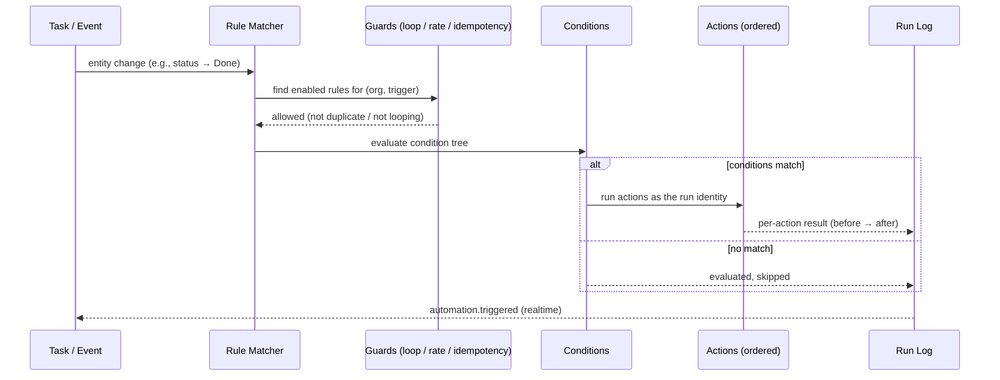

# 20 · Automation & Workflow Rules

> Follows the [Master PRD Template](./00-prd-template.md). Automation is how Numil stays
> "simple by default, deep on demand" at scale: repetitive coordination work is expressed
> once as a **trigger → condition → action** rule and then runs invisibly forever.

---

## 1. Purpose

Automation & Workflow Rules let anyone turn "every time X happens, do Y" into a durable,
no-code rule — the way **ClickUp Automations**, **Monday automations**, **Notion database
automations**, **Asana Rules**, and **Jira workflow post-functions** do — but with Numil's
calm, native, mobile-first ergonomics.

**User problem it solves.** Teams waste attention on manual bookkeeping — reassigning on
status change, nudging when a due date slips, moving "Done" cards, posting status to chat,
applying a checklist to every incoming bug. Individuals do the same at a personal scale. By
hand this is error-prone and forgettable; encoded as automation it becomes reliable.

**User goals**
- Create a useful rule in under 60 seconds from a template, without reading docs.
- Trust that rules fire predictably, exactly-once, and can be paused/undone.
- See *why* something happened ("Automation moved this to Done") via a clear run history.
- Scale from a personal "if this then that" to org-wide governed workflows.

**Business goals**
- Increase retention and team stickiness (automations create switching cost).
- Anchor a monetized power tier (quotas, advanced actions, webhooks, AI-suggested rules).
- Reduce coordination overhead → higher perceived value vs. ClickUp/Monday.

**KPIs:** `automation_created`, active rules per org, `automation_triggered` volume,
**action success rate**, time-to-first-rule, % rules created from templates, AI-suggested
rule acceptance, and reduction in manual status/assignment edits after adoption.

**Status:** core engine ✅ v1 · webhook/HTTP actions & branching 🔜 v1.1 · multi-step
sequences + approvals 🟣 v2 · autonomous AI agents 🧪 Experimental.

---

## 2. Navigation

**Entry points**
- **Project → ⋯ → Automations** (most common): rules scoped to one project.
- **Settings → Workspace → Automations** (org scope, Admin+).
- **Contextual creation:** long-press a status chip / due chip / label in Task Detail →
  "Automate this…" pre-fills a trigger.
- **AI suggestion:** [Numil AI](./19-ai-assistant-copilot.md) proposes rules from observed
  patterns ("You've moved 8 Done tasks to Archive this week — automate it?").
- Deep link `numil://automations?scope=project&id={projectId}` and
  `numil://automation/{ruleId}` (opens the rule editor / run history).

**Route:** `src/app/automations/index.tsx` (list), `src/app/automation/[id].tsx` (editor +
history). The **rule editor** is presented as a **large-detent sheet** on iPhone (keeps the
project underneath) and as a **push** when deep-linked. Sub-pickers (trigger type, action
type, field values) are **nested bottom sheets** so the builder context is never lost.

**Hierarchy / breadcrumbs**
```text
Workspace ▸ Project ▸ Automations ▸ [Rule name]
Workspace ▸ Settings ▸ Automations (org)   ▸ [Rule name]
```

**Transitions:** list → editor uses `motion.slow` hero on the rule row; adding a step
animates a new card in (`spring.gentle`); the "Test run" result streams in.

**Modal vs push:** editor is a **sheet** from the list (fast tweak), **push** from deep link
(full back stack). Run history opens as a segmented tab inside the editor screen.

---

## 3. Complete UI Layout

```text
┌───────────────────────────────────────────────┐
│  ‹ Marketing        Automations          [＋]  │  ← large title, glass nav, safe area
├───────────────────────────────────────────────┤
│  ( On )  Enabled 6   ·   Errors 1  ⚠           │  ← summary bar
│  ┌─ Templates ─────────────────────────────┐   │
│  │ [When Done → Archive] [Overdue → Notify] │   │  ← template carousel
│  │ [New bug → Assign QA]  [＋ Blank rule]   │   │
│  └──────────────────────────────────────────┘   │
├───────────────────────────────────────────────┤
│  ● When status → Done, notify + move        ⋯  │  ← RuleRow (toggle, name, menu)
│    ▸ 342 runs · last 2h ago · ✓ healthy        │
│  ● When overdue, comment @assignee          ⋯  │
│    ▸ 12 runs · last 1d · ⚠ 1 failed            │
│  ○ When label #urgent added → set High      ⋯  │  ← disabled (hollow dot)
├───────────────────────────────────────────────┤
│  Rule editor (sheet)                            │
│  ┌─────────────────────────────────────────┐   │
│  │ WHEN   ▸ Status changes to  [ Done ▾ ]   │   │  ← trigger card
│  │ IF     ▸ Priority is        [ High ▾ ]   │   │  ← condition (optional)
│  │        ▸ + Add condition                 │   │
│  │ THEN   ▸ Notify  [ @assignee ▾ ]         │   │  ← action 1
│  │        ▸ Move to [ Done column ▾ ]       │   │  ← action 2
│  │        ▸ + Add action                    │   │
│  ├─────────────────────────────────────────┤   │
│  │ [ Test run ]        [ Save & enable ]    │   │
│  └─────────────────────────────────────────┘   │
└───────────────────────────────────────────────┘
```

- **Top:** large title "Automations", `＋` primary action (one obvious action — the north
  star). Glass nav bar respects Dynamic Island + top safe area. Summary bar shows enabled
  count and an error badge that deep-links to failing rules.
- **Templates carousel:** horizontally scrollable starter recipes; the last chip is always
  "＋ Blank rule". This keeps the empty state productive.
- **Rule list:** `RuleRow` with a leading enable toggle (filled `●` on / hollow `○` off),
  name, a one-line human-readable summary, run count, last-run time, and a health chip
  (`✓ healthy` / `⚠ errors` / `⏸ paused`). Swipe → Enable/Disable, Duplicate, Delete.
- **Rule editor:** three stacked cards — **WHEN** (trigger), **IF** (conditions, optional),
  **THEN** (actions, ordered). Each row is a disclosure that opens a nested picker. A live
  natural-language sentence ("When a task's status changes to Done and priority is High,
  notify the assignee and move it to the Done column") renders above the cards so the rule
  reads like English.
- **Bottom:** sticky `[ Test run ]` (dry-run against a sample task) + `[ Save & enable ]`.
- **Empty space / calm:** conditions are hidden until "+ Add condition" is tapped; advanced
  options (rate limits, run-as, error policy) live behind a "⋯ Advanced" disclosure.
- **Landscape / iPad:** two-pane — rule list on the left, editor + run history on the right
  (Notion-style). The natural-language preview stays pinned at the top of the editor pane.
- **Tab bar:** hidden while the editor sheet is at the large detent; returns on dismiss.

**Rule execution flow (sequence):**


---

## 4. Complete Component Breakdown

| Area | Components |
|------|-----------|
| Nav / header | `GlassNavBar`, `LargeTitle`, `AddRuleButton` (FAB-in-nav), `AutomationSummaryBar`, `ErrorBadge` |
| Templates | `TemplateCarousel`, `TemplateChip`, `BlankRuleChip` |
| Rule list | `RuleRow` (enable `Toggle`, name, `RuleSummaryText`, `RunCountChip`, `HealthChip`), `SwipeActions`, `ContextMenu` |
| Editor shell | `RuleEditorSheet`, `NaturalLanguagePreview`, `TriggerCard`, `ConditionCard`, `ActionCard`, `AddStepRow`, `AdvancedDisclosure` |
| Pickers (nested sheets) | `TriggerTypePicker`, `FieldPicker`, `OperatorPicker`, `ValuePicker` (member/status/label/date/number), `ActionTypePicker`, `RecipientPicker`, `ProjectColumnPicker`, `WebhookPicker` |
| Test / history | `TestRunButton`, `TestRunResultCard` (diff preview), `SegmentedControl` (Editor / History), `RunHistoryList` (virtualized), `RunLogRow`, `RunDetailSheet` (input→output, error, retry) |
| Feedback | `Skeleton`, `Toast` (undo), `Banner` (quota/paused/error), `ConfirmDialog`, `ConflictNotice` |
| AI | `AISuggestRuleCard` (from module 19), `AIExplainRuleButton` ("what does this do?") |
| Governance | `RunAsBadge`, `ScopeChip` (Project/Org), `QuotaMeter`, `AuditLinkRow` |

Primitives are defined in [03-design-system-ui.md](./03-design-system-ui.md).

---

## 5. Modern Features

Each feature: **Purpose · Workflow · UI · Permissions · Offline · API · DB · Notify · AC.**

**Role permission matrix** (module-specific deltas; base model in
[shared/rbac-permissions.md](./shared/rbac-permissions.md)):

| Capability | Owner | Admin | Manager | Member | Guest |
|-----------|:-----:|:-----:|:-------:|:------:|:-----:|
| View project rules | ✅ | ✅ | ✅ | ✅ (own-affecting) | ❌ |
| Create/edit **project** rule | ✅ | ✅ | ✅ (own/assigned) | ❌ | ❌ |
| Create/manage **personal** rule (own tasks) | ✅ | ✅ | ✅ | ✅ | ❌ |
| Create/manage **org** rules + quotas | ✅ | ✅ | ❌ | ❌ | ❌ |
| Enable/disable a rule | ✅ | ✅ | ✅ (their projects) | personal only | ❌ |
| View run history / retry runs | ✅ | ✅ | ✅ (their projects) | own-affecting | ❌ |
| Publish org templates | ✅ | ✅ | ❌ | ❌ | ❌ |
| Configure webhook/HTTP actions ([module 38](./38-developer-api-webhooks.md)) | ✅ | ✅ | ❌ | ❌ | ❌ |

Actions always execute **as the run identity** and are re-authorized at execution time — a
rule can never grant more power than its owner/service identity holds.

### 5.1 Trigger → Condition → Action rule builder ✅ (ClickUp/Monday)
- **Purpose:** the core no-code primitive — declare *when* something happens, *optional*
  filters, and *what* to do.
- **Workflow:** tap `＋` → pick a trigger → (optionally) add conditions → add one or more
  ordered actions → Test run → Save & enable. A live English sentence confirms intent.
- **UI:** WHEN/IF/THEN cards; nested pickers; natural-language preview.
- **Permissions:** Manager (project scope) / Admin+ (org scope); Members cannot create in
  team projects but can create rules on their **personal** tasks (project-less).
- **Offline:** rules are *authored* offline (queued create/update op); they **execute
  server-side**, so a rule can only fire once its defining events reach the server.
- **API:** `POST /automations`, `PATCH /automations/:id`.
- **DB:** `automation_rules` (+ `automation_triggers`, `automation_conditions`,
  `automation_actions`).
- **Notify:** on save, watchers of the project see an activity entry "Rule created".
- **AC:** rule persists; disabling stops execution immediately; invalid rule (no action)
  cannot be saved.

### 5.2 Trigger catalog ✅
- **Purpose:** cover the events teams actually automate on.
- **Triggers (v1):** task created · status changed (to/from/any) · assignee changed · due
  date set/changed/arrived · task became overdue · priority changed · label added/removed ·
  subtask completed · task completed/reopened · comment added · mention added · moved
  between projects · custom-field value changed · **scheduled** (time-based: daily/weekly at
  HH:MM, or "N days before due").
- **Workflow:** picking a trigger reveals only the relevant parameters (e.g., "status
  changes → to which status?").
- **UI:** `TriggerTypePicker` grouped by category (Lifecycle / Dates / People / Fields /
  Schedule).
- **Permissions/Offline/API/DB/Notify:** as 5.1; scheduled triggers use a server cron
  evaluator.
- **AC:** each trigger fires exactly once per qualifying event; scheduled triggers respect
  the org timezone and DST.

### 5.3 Conditions & branching 🔜 v1.1
- **Purpose:** narrow *when* actions run and support "otherwise" paths.
- **Workflow:** add conditions combined with AND/OR groups; operators depend on field type
  (`is`, `is not`, `is empty`, `contains`, `>`, `<`, `changed`, `in`). v1.1 adds an
  **IF/ELSE** branch so one trigger can fan out to two action sets.
- **UI:** `ConditionCard` with an AND/OR toggle; branch adds a second `THEN`/`ELSE` lane.
- **Permissions/Offline/API/DB:** as 5.1; conditions stored as a JSON expression tree.
- **Notify:** none (conditions are silent filters).
- **AC:** condition tree evaluates deterministically; empty condition = always true; a rule
  whose conditions never match still records "evaluated, skipped" in history.

### 5.4 Action catalog ✅ / 🔜
- **Purpose:** the effects a rule can produce.
- **Actions (✅ v1):** set field (status/priority/assignee/label/custom field) · move to
  project/column · add/remove label · assign/unassign · add comment (with `@mention` and
  templated variables like `{{task.title}}`) · create subtask(s) from a checklist template ·
  set/clear due date (absolute or relative "+3 days") · add watcher · notify (push/in-app to
  role, assignee, or specific member) · complete/archive task.
- **Actions (🔜 v1.1):** send **webhook / HTTP request** (see
  [Developer API & Webhooks](./38-developer-api-webhooks.md)) · post to a chat channel /
  integration · start a [Focus/Pomodoro](./35-focus-pomodoro-habits.md) suggestion · apply a
  [template](./24-templates-recurring-workflows.md).
- **Actions (🟣 v2):** call another automation (sub-routine), create a task in a *different*
  project, wait/delay N minutes (multi-step sequence), require approval before continuing.
- **UI:** ordered `ActionCard`s (drag-to-reorder); each shows a success/skip indicator after
  a test run.
- **Permissions:** executes **as the run identity** (user or project service identity);
  actions it can't perform are rejected + logged.
- **Offline:** N/A (server-executed). **API:** actions inline; webhook actions reference a
  `webhook_endpoints` row. **DB:** `automation_actions(rule_id, order, type, params_json)`.
- **Notify:** notify-action emits via [Notifications](./12-notifications-alerts.md), source =
  automation.
- **AC:** actions run **in order**; a failing action follows the error policy
  (stop/continue/retry); every outcome is logged per run.

### 5.5 Templates & recipe library ✅ (Zapier/Monday recipes)
- **Purpose:** make the first rule instant.
- **Workflow:** pick a template → it pre-fills trigger/conditions/actions with placeholders →
  adjust values → save. Admins can **publish custom templates** to the workspace library.
- **UI:** `TemplateCarousel`; a full **Template gallery** grouped by use case (Task hygiene,
  Handoffs, Reminders, Reporting, Onboarding).
- **Permissions:** anyone who can create rules can *use* templates; publishing is Admin+.
- **Offline:** metadata cached; instantiation queued like any create.
- **API:** `GET /automations/templates`, `POST /automations/from-template`.
- **DB:** `automation_templates` (built-in + org-published), `is_builtin`, `definition_json`.
- **Notify:** none. **AC:** instantiating yields an editable, disabled draft; built-ins localize.

### 5.6 Run history, logs & observability ✅
- **Purpose:** trust — see exactly what fired, when, on what, and why it succeeded/failed.
- **Workflow:** open a rule → **History** → runs (newest first) → tap for input snapshot,
  evaluated conditions, per-action results, latency, and error detail with a **Retry** button.
- **UI:** `RunHistoryList` (virtualized), `RunLogRow` (status dot + target + time),
  `RunDetailSheet` (diff `before → after`, error trace, retry).
- **Permissions:** rule editors and project Managers/Admins; Members see only runs affecting
  their own tasks.
- **Offline:** read-only cache; live tail requires network.
- **API:** `GET /automations/:id/runs?cursor=`, `POST /automations/runs/:runId/retry`.
- **DB:** `automation_runs`, `automation_run_actions` (append-only).
- **Notify:** repeated failures (≥3) notify the owner + project Admin.
- **AC:** every execution appears in history within seconds; failed runs are retryable; logs
  never contain other users' personal-task content.

### 5.7 Error handling, loop guard & rate limits ✅
- **Purpose:** keep automations safe and self-limiting.
- **Workflow:** each rule has an **error policy** (Stop rule / Skip action & continue /
  Retry with backoff) and Numil enforces global guards automatically.
- **UI:** "⋯ Advanced" disclosure: error policy, max runs/hour, and an auto-disable toggle.
- **Guards:** **loop detection** (a rule whose action re-triggers itself, or an A→B→A cycle,
  is broken after a depth limit and flagged), **rate limiting** (per-rule and per-org run
  budgets), **idempotency** (an event processed once, deduped by event id + rule id), and
  **auto-disable** after N consecutive failures with an alert.
- **Permissions/Offline/API/DB:** as 5.1; guard config in `automation_rules.guard_json`.
- **Notify:** auto-disable and loop-break both notify the owner + Admin.
- **AC:** no infinite loops reach production; a runaway rule is auto-disabled and logged;
  rate-limited runs are queued or dropped per policy, never silently lost without a log.

### 5.8 Scope: personal · project · org ✅ / 🔜
- **Purpose:** the same engine serves an individual and an enterprise.
- **Personal ✅:** a Member can automate their own project-less tasks (e.g., "when I add
  #groceries, set due = today 6pm"). Never visible to Admins (personal privacy).
- **Project ✅:** Managers/Leads own project rules that act on that project's tasks.
- **Org 🔜:** Admins define workspace-wide rules (e.g., "new bug in any project → add QA
  checklist"), with a per-project opt-out list.
- **UI:** `ScopeChip` on each rule; org rules show a lock for non-Admins.
- **API/DB:** `automation_rules.scope` (`personal|project|org`) + `scope_id`.
- **AC:** scope determines visibility and the permission set of the run identity.

---

## 6. Smart AI Features

Powered by the [AI Assistant & Copilot](./19-ai-assistant-copilot.md) (`capability` ids in
parentheses). AI here is **suggestive** — every AI-authored rule is a *draft* the user must
review and enable.

| Capability | What it does for automation |
|-----------|------------------------------|
| **Suggest automations** (`risk_detect`/pattern mining) | Observes repeated manual edits ("you moved 8 Done tasks to Archive") and proposes a ready-made rule draft. |
| **Natural-language rule authoring** (`nl_parse`) | "When something's overdue, ping the assignee and set priority High" → prefilled WHEN/IF/THEN. |
| **Explain this rule** (`summarize`) | Plain-English summary + a "what could go wrong" note (possible loops, broad conditions). |
| **Smart recipient / value fill** (`auto_prioritize`) | Suggests the most likely assignee/label/column for an action based on history. |
| **Dry-run impact preview** (`workload_predict`) | Estimates how many tasks a new rule would have matched over the last 30 days before you enable it. |
| **Anomaly watch** (`project_health`) | Flags a rule firing far more/less than usual as a possible misconfiguration. |

Each AI action logs `ai_invoked` with `capability` + `accepted`, respects org AI governance,
and **never enables a rule automatically** (proposal-first, Accept/Edit/Undo). AI-suggested
rules are clearly badged `✨ Suggested` in the list until reviewed.

---

## 7. Productivity Features

- **One-tap "Automate this"** from a status/label/due chip in [Task Detail](./10-task-detail.md).
- **Templated actions with variables** (`{{task.title}}`, `{{assignee.name}}`, `{{due}}`,
  `{{project.name}}`) for personalized comments/notifications.
- **Relative dates** in actions ("set due = +2 business days", "remind 1 day before due").
- **Bulk backfill:** optionally run a new rule against existing matching tasks once at
  creation ("apply to current tasks too?").
- **Personal routines link:** automations can trigger a
  [Focus/Habit](./35-focus-pomodoro-habits.md) prompt (e.g., completing "Deep work" logs a
  habit).
- **Quiet hours awareness:** notify-actions respect the recipient's notification quiet hours
  from [Notifications](./12-notifications-alerts.md) (queued, not dropped).

---

## 8. Enterprise Features

- **Org-scoped governed rules** with per-project opt-out and change approval (Admin+).
- **Run-as service identity** so actions are attributable and permission-checked without
  impersonating a person (no "ghost" edits under a departed user).
- **Immutable audit** of rule create/edit/enable/disable/delete and every run, feeding
  [Activity Feed & Audit Logs](./29-activity-feed-audit-logs.md).
- **Quotas & tiers:** rule count, runs/month, and webhook actions gated by plan
  ([Billing](./31-billing-subscription.md)); `QuotaMeter` warns at 80%.
- **Webhook / HTTP actions** 🔜 (HMAC-signed, retried, delivery-logged) — contract in
  [Developer API & Webhooks](./38-developer-api-webhooks.md).
- **Data-scope safety:** an org rule can never read or write personal (project-less) tasks.
- **Approval gates** 🟣: a multi-step rule can pause for human approval before high-impact
  actions (delete, move to another workspace).

---

## 9. Collaboration Features

- **Shared ownership:** project rules are visible to all project members (read), editable by
  Leads/Managers; edits show "changed by" attribution.
- **Automation-authored comments/mentions** post as the run identity with an "🤖 Automation"
  badge so humans aren't confused about who spoke.
- **Handoff automations:** the canonical team recipe — "when status → Ready for QA, assign
  the QA lead + notify + add checklist" — turns coordination into a single rule.
- **Change notices:** enabling/disabling a shared rule posts to the project activity so the
  team knows behavior changed.
- **Comment threads on a rule** 🟣 for teams to discuss/adjust a workflow in place.

---

## 10. Offline Architecture

Deltas over [shared/offline-sync-engine.md](./shared/offline-sync-engine.md):
- **Authoring is offline-first, execution is server-side.** Creating/editing/enabling a rule
  is an optimistic local op queued in the outbox; the rule only *runs* on events the server
  has received.
- Rules triggered by **offline-created events** fire when those events sync (ordered by
  `clientTs`), so an offline "status → Done" edit will still run its automation on reconnect.
- **Run history is a read-through cache**; live tailing requires network and shows a "syncing
  history" state offline (no dead spinners).
- Conflicts on the rule definition itself resolve by field-level last-write-wins on scalars;
  the action list uses fractional ordering to avoid renumber storms.

---

## 11. Security

Deltas over [shared/security-baseline.md](./shared/security-baseline.md):
- Every action is authorized **as the run identity** at execution time; a rule cannot escalate
  privileges (an action the owner/service lacks permission for is rejected + logged `403`).
- **Personal tasks are invisible to org/project automation** (ownership ABAC per
  [RBAC](./shared/rbac-permissions.md)); only the owner's personal rules touch them.
- **Templated variables & comment bodies are sanitized** (no HTML/script injection);
  webhook payloads are signed (HMAC) and sent over TLS with SSRF protections
  (no internal/metadata endpoints).
- **Loop/rate guards** are a security control (prevent self-amplifying denial-of-service).
- Rule definitions and run logs never store other users' personal-task content.

---

## 12. Notification System

Deltas over [12-notifications-alerts.md](./12-notifications-alerts.md):
- **New source type `automation`** on notifications, with an "🤖" glyph and a deep link to
  the run that produced it.
- Emits: rule-driven assignment/mention/comment/status notifications (dedup-merged with
  normal task notifications so a user isn't double-pinged for one change).
- **Owner alerts:** rule failure (≥3 consecutive), auto-disable, loop-break, quota 80%/100%.
- Notify-actions respect recipient quiet hours and per-channel preferences; queued, not lost.
- iOS notification category actions: **Open rule**, **View run**, **Pause rule**.

---

## 13. Accessibility

Deltas over [shared/accessibility-spec.md](./shared/accessibility-spec.md):
- The natural-language preview is the accessible label for the whole rule ("When status
  changes to Done and priority is High, notify assignee, move to Done column").
- Enable toggles announce role + state ("Rule enabled, switch, on"); the health chip has a
  text value ("Healthy, 342 runs" / "1 failed run").
- WHEN/IF/THEN cards are grouped regions with reorder `accessibilityActions` on action rows
  ("Move action up/down").
- Run status uses icon + label + color (never color alone): ✓ Success / ⏭ Skipped / ⚠ Failed.
- Test-run results announced politely via `accessibilityLiveRegion`.

---

## 14. Animations

Deltas over [shared/animation-spec.md](./shared/animation-spec.md):
- Adding a step: action card slides + fades in (`spring.gentle`); removing collapses height
  (`motion.base`).
- Enable toggle: track fill `motion.instant` + `impactLight` haptic.
- Test run: per-action rows resolve top-to-bottom with a check/x stamp (`motion.fast`); a
  successful full run pulses the "Save & enable" button once.
- Rule fired (live, viewing history): new `RunLogRow` slides in with a subtle highlight that
  fades over `motion.slow`.
- Reduce Motion: replace slides with cross-fades; no pulse; keep state feedback.

---

## 15. Performance

- Rule list virtualized (FlashList); each `RuleRow` summary is precomputed server-side (the
  English sentence) to avoid client string-building cost.
- Run history paginated by cursor; only the visible window renders; run detail loaded lazily.
- **Execution budget (server):** rule evaluation is event-driven and indexed by
  `(org_id, trigger_type, enabled)`; the matcher targets <50ms p95 per event; actions run in
  a queued worker so user-facing writes never block on automation.
- Client editor uses code-split pickers (RecurrenceEditor, WebhookPicker lazy-imported).
- Scheduled triggers are batched by minute-bucket to avoid thundering-herd at HH:00.
- Offline authoring keeps interaction <16ms (optimistic); network off the main path.

---

## 16. Database Design

```text
automation_rules(id, org_id, scope, scope_id?, owner_id, run_as_id, name, summary_text,
                 enabled, error_policy, guard_json, created_at, updated_at, version, deleted_at?)
automation_triggers(id, rule_id→automation_rules, type, params_json)          -- 1 per rule (v1)
automation_conditions(id, rule_id→automation_rules, expr_json)                 -- AND/OR tree
automation_actions(id, rule_id→automation_rules, order, type, params_json)     -- ordered
automation_runs(id, rule_id→automation_rules, org_id, trigger_event_id, target_type,
                target_id, status, matched, duration_ms, error_code?, created_at)   -- append-only
automation_run_actions(id, run_id→automation_runs, action_order, type, status,
                       before_json, after_json, error?, created_at)            -- append-only
automation_templates(id, org_id?, is_builtin, name, category, definition_json)
webhook_endpoints(id, org_id, url, secret_ref, active)                          -- see module 38
```

**Indexes:** `automation_rules(org_id, scope, enabled)`,
`automation_rules(scope, scope_id) WHERE enabled AND deleted_at IS NULL` (hot matcher path),
`automation_runs(rule_id, created_at DESC)`, `automation_runs(org_id, status, created_at)`
(error dashboards), unique `(trigger_event_id, rule_id)` on `automation_runs` (idempotency /
exactly-once). **Constraints:** a rule requires ≥1 trigger and ≥1 action; `scope=org` ⇒
`run_as_id` is a service identity; personal-scope rules require `owner_id = actor` and
`scope_id IS NULL`. **Soft delete** via `deleted_at`. **Audit/history** tables
(`automation_runs`, `automation_run_actions`) are append-only.

Aligns with [17-data-model-api.md](./17-data-model-api.md).

---

## 17. API Design

Follows [shared/api-conventions.md](./shared/api-conventions.md).

| Method | Path | Purpose |
|--------|------|---------|
| GET | `/automations?scope=project&scopeId=…` | List rules (filtered/paginated) |
| POST | `/automations` (Idempotency-Key) | Create rule (returns disabled draft) |
| GET | `/automations/:id?expand=trigger,conditions,actions` | Fetch full rule |
| PATCH | `/automations/:id` (If-Match) | Update (name/steps/guards/enabled) |
| POST | `/automations/:id/enable` · `/disable` | Toggle execution |
| POST | `/automations/:id/test` | Dry-run against a sample/target task (no writes) |
| POST | `/automations/:id/backfill` | Run once over existing matching tasks |
| DELETE | `/automations/:id` | Soft-delete |
| GET | `/automations/:id/runs?cursor=` | Run history (append-only) |
| GET | `/automations/runs/:runId` | Single run detail (before→after, errors) |
| POST | `/automations/runs/:runId/retry` | Retry a failed run |
| GET | `/automations/templates?category=` | Template gallery |
| POST | `/automations/from-template` | Instantiate a template → draft |

**Realtime:** channel `project:{id}` / `org:{id}` emits `automation.triggered`
(`{ruleId, runId, targetId, status}`) and `automation.updated`. Client tailing the History
tab appends new `RunLogRow`s live. **Errors:** `403 forbidden` (scope / run-as lacks
permission), `409 conflict` (version), `422 validation_failed` (no action / bad expression),
`429 rate_limited` (quota). **Idempotency-Key** on all mutations; execution is deduped by
`(trigger_event_id, rule_id)`.

**Sample create request/response**
```http
POST /v1/automations   Idempotency-Key: 5f0c…   X-Org-Id: org_123
{
  "scope": "project",
  "scopeId": "proj_marketing",
  "name": "Done → notify + move",
  "trigger": { "type": "status_changed", "params": { "to": "done" } },
  "conditions": { "op": "and", "rules": [ { "field": "priority", "op": "is", "value": "high" } ] },
  "actions": [
    { "type": "notify", "params": { "recipient": "assignee" } },
    { "type": "move_to_column", "params": { "column": "done" } }
  ],
  "errorPolicy": "continue"
}
```
```json
{
  "data": {
    "id": "rule_9af2",
    "enabled": false,
    "summaryText": "When status changes to Done and priority is High, notify the assignee and move to the Done column.",
    "version": 1,
    "createdAt": "2026-07-16T09:20:00Z"
  },
  "meta": { "requestId": "req_88c1" }
}
```

---

## 18. Edge Cases

- **Offline authoring, then remote edit:** scalar fields LWW; actions merge by fractional
  order; a server-side disable wins over a local edit (safety).
- **Trigger entity deleted before actions run:** run recorded as `skipped (gone)`; no partial
  writes to a tombstoned task.
- **Run-as user offboarded:** org rules use a service identity (unaffected); personal rules
  disable and notify the owner.
- **Permission changed mid-run:** action re-checked at execution; unauthorized action logs
  `403` and follows the error policy.
- **Loop / self-trigger:** depth guard breaks the chain, auto-flags the rule, notifies owner.
- **Rate-limit / quota exhausted:** runs queued (short spillover) or dropped per policy —
  always with a `rate_limited` log entry; core app unaffected.
- **Timezone / DST on scheduled triggers:** evaluated in the org/user timezone; a 2:30am rule
  on a spring-forward day runs once at the next valid instant (never silently skipped).
- **Two rules fight** (A sets High, B sets Low): both run in deterministic creation order;
  last write wins; both logged.
- **Webhook endpoint down** 🔜: retried with backoff; after max attempts marked failed in the
  delivery log (module 38); the run continues per policy.
- **Bulk backfill on a huge project:** chunked, rate-limited, progress shown, cancelable.
- **Template references a missing field/status:** instantiation flags the gap and blocks
  enable until resolved.
- **Notification failure:** falls back to in-app; logged; never crashes the run.

---

## 19. User States

- **First-time:** empty list shows the template carousel + a one-line "Automate the boring
  parts" explainer and an AI-suggested starter rule.
- **Returning / power user:** many rules, filter by health; keyboard-driven editor on iPad;
  uses variables and relative dates.
- **Member (team project):** can view project rules and their effect on own tasks; cannot
  create/edit team rules; **can** create personal rules.
- **Manager / Lead:** full CRUD on their project rules + run history.
- **Admin / Owner:** org rules, quotas, governance, full audit; Owner also sees plan limits
  via [Billing](./31-billing-subscription.md).
- **Guest:** no automation access; only sees the *effects* on shared tasks (with the 🤖 badge).
- **Offline / poor network:** authoring works; execution/history show a clear "will run when
  synced" / "history syncing" state.
- **Tablet / landscape:** two-pane list + editor/history.
- **Dark mode / large text / a11y:** tokens + Dynamic Type; VoiceOver reads the English rule.

---

## 20. Analytics Events

Schema per [shared/analytics-taxonomy.md](./shared/analytics-taxonomy.md) (extends the core
`automation_triggered` event).

| event | key properties |
|-------|----------------|
| `automation_list_opened` | `scope` (project/org/personal) |
| `automation_created` | `scope`, `from_template`, `trigger`, `actions_count`, `via` (blank/template/ai/contextual) |
| `automation_updated` | `field` (trigger/conditions/actions/guards/enabled) |
| `automation_enabled` / `automation_disabled` | `scope`, `reason` (user/auto_fail/loop) |
| `automation_test_run` | `matched`, `actions_ok`, `actions_failed` |
| `automation_triggered` | `trigger`, `actions_count`, `status` (success/partial/failed/skipped), `latency_ms` |
| `automation_run_failed` | `error_code`, `action_type` |
| `automation_backfill_run` | `matched_count`, `applied_count` |
| `automation_template_used` | `template_id`, `category` |
| `ai_suggest_rule_shown` / `ai_suggest_rule_accepted` | `pattern`, `accepted` |
| `automation_quota_warning` | `percent` |

No task titles/PII in properties (privacy per taxonomy).

---

## 21. Acceptance Criteria

1. A rule can be created from a blank builder with a trigger + ≥1 action in under 60 seconds.
2. The builder shows a live, accurate natural-language sentence of the rule.
3. A rule cannot be saved without at least one trigger and one action.
4. Newly created rules are **disabled by default** until the user enables them.
5. Disabling a rule stops execution immediately (no in-flight or future runs).
6. All v1 triggers fire exactly once per qualifying event (deduped by event id + rule id).
7. Conditions (AND/OR) correctly filter execution; empty conditions = always match.
8. Actions execute in their defined order; reordering persists.
9. `set field`, `assign`, `add/remove label`, `move`, `add comment`, `create subtask`,
   `set due (absolute/relative)`, `add watcher`, `notify`, `complete/archive` all work (v1).
10. Templated variables (`{{task.title}}`, `{{assignee.name}}`, `{{due}}`) render correctly.
11. Test run performs a dry run with per-action results and writes nothing.
12. Optional backfill applies a new rule to existing matching tasks, chunked and cancelable.
13. Every execution is recorded in run history within seconds (success/partial/failed/skipped).
14. Failed runs show error detail and can be retried from history.
15. A run detail shows before→after for each action.
16. Loop detection breaks self-triggering/cyclic chains and flags the rule.
17. Rate limits and quotas are enforced; throttled runs are logged, never silently dropped.
18. A rule auto-disables after N consecutive failures and notifies the owner + Admin.
19. Actions run **as the run identity** and are permission-checked at execution time.
20. An action the owner/service can't perform is rejected with a logged `403` per error policy.
21. Personal (project-less) tasks are never touched by project/org automation.
22. Personal automations are invisible to Admins and act only on the owner's tasks.
23. Scope (personal/project/org) governs visibility and the run identity's permissions.
24. Scheduled triggers respect the org/user timezone and handle DST without skipping.
25. Notify-actions respect recipient quiet hours and dedupe with normal task notifications.
26. Automation-authored comments/notifications carry a visible "🤖 Automation" badge.
27. Rule create/edit/enable/disable/delete are captured in the immutable audit log.
28. Offline rule authoring queues optimistically and syncs losslessly (no duplicates).
29. Rules triggered by offline-created events run on reconnect in `clientTs` order.
30. A trigger entity deleted before actions run yields a `skipped (gone)` run, no partial writes.
31. Two conflicting rules run in deterministic order; last write wins; both logged.
32. Webhook actions (🔜) sign payloads (HMAC), retry with backoff, and log delivery.
33. Templates instantiate into an editable, disabled draft; built-ins localize.
34. AI-suggested rules appear as reviewable drafts badged `✨ Suggested`; never auto-enabled.
35. "Explain this rule" produces a correct plain-English summary + risk note.
36. Quota meter warns at 80% and blocks creation past the plan limit with an upsell.
37. VoiceOver reads the rule sentence; toggles/health chips expose role/value/state.
38. Reduce Motion disables slide/pulse animations; state feedback retained.
39. iPad landscape shows two-pane list + editor/history.
40. Analytics events fire with correct properties (including offline-buffered) and no PII.
41. Run history and logs never expose other users' personal-task content.
42. Guests have no automation access but see effects (with the 🤖 badge) on shared tasks.

---

## 22. Future Roadmap

- **V1 (✅):** trigger→condition→action builder, full v1 trigger/action catalog, templates
  + gallery, run history/logs with retry, error policies, loop/rate guards, personal &
  project scope, AI suggestions (proposal-first), audit.
- **V1.1 (🔜):** IF/ELSE branching, richer condition operators, webhook/HTTP actions +
  chat/integration posts (module 38/32), org-scoped rules with per-project opt-out,
  scheduled-trigger enhancements, apply-template action.
- **V2 (🟣):** multi-step sequences with delays/waits, sub-routine (call another rule),
  cross-project create, approval-gated actions, per-rule comment threads, shared AI threads.
- **Future (💡):** visual flow canvas (node graph) for complex workflows, versioned rule
  history with diff/rollback UI, environment promotion (draft → staging → live), marketplace
  of community recipes.
- **Experimental (🧪):** autonomous AI agents that propose *and* (with approval) maintain
  rules, self-healing rules that adapt conditions from outcomes, predictive "next best
  automation" suggestions.
- **AI track:** deeper pattern mining, anomaly detection on run volume, NL end-to-end
  authoring ("build the whole workflow for onboarding a client").
- **Enterprise track:** rule change approval workflow, environment separation, per-rule cost
  centers, eDiscovery/export of automation audit, SIEM streaming of automation events.
