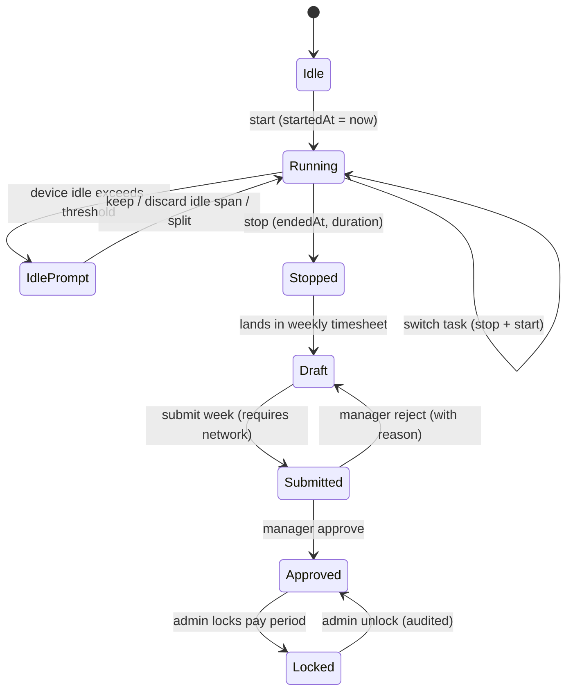

# 21 · Time Tracking & Timesheets

> Follows the [Master PRD Template](./00-prd-template.md). Numil time tracking blends the
> one-tap simplicity of **Toggl** with the invoicing rigor of **Harvest/Clockify** and the
> task-native logging of **ClickUp** — while staying calm, offline-first, and native iOS.
> Per-task time links to [10 · Task Detail](./10-task-detail.md); focus-session time links to
> [35 · Focus, Pomodoro, Habits](./35-focus-pomodoro-habits.md).

---

## 1. Purpose

Time tracking answers three questions every team eventually asks: *where did the time go,
what is billable, and are we estimating well?* Numil captures time as a first-class fact
attached to tasks and projects, then rolls it up into timesheets, billing, and reports.

**User problem it solves.** Standalone trackers (Toggl) live outside the work; PM tools
(Jira worklogs) make logging a chore. Numil makes starting a timer a **single thumb tap**
on any task, keeps a running timer visible in the **Dynamic Island / Live Activity**, and
turns raw entries into an editable **weekly timesheet** without spreadsheet pain.

**User goals**
- Start/stop a timer on the task I'm working on in <2s, from anywhere.
- Add or fix time after the fact (I forgot to start the timer).
- See my week, correct it, and submit it for approval.
- Mark what's billable and trust the totals for invoicing.

**Business goals**
- Unlock a monetized **billing/agency** tier (rates, cost, revenue, invoicing export).
- Feed estimate-vs-actual data back into AI estimates ([19](./19-ai-assistant-copilot.md)).
- Give managers utilization + capacity signals for [16 · Reports](./16-reports-analytics.md).

**KPIs:** timers started per active user, `% time logged via timer vs manual`, timesheet
submission rate, approval turnaround, estimate accuracy (actual/estimate), billable %.

**Status:** timer + manual + task rollup ✅ v1 · weekly timesheet + billable/rates 🔜 v1.1 ·
approvals + cost/revenue + locking 🟣 v2 · AI auto-timesheet 🧪.

---

## 2. Navigation

**Entry points**
- **Task Detail** → "Start timer" in the property rail / overflow (logs against that task).
- **Global timer control** — persistent pill in the tab bar area and a Live Activity in the
  Dynamic Island; tap to stop/switch.
- **My Time** tab (under More → Time) → running timer, today's entries, weekly timesheet.
- **Focus Mode** ([35](./35-focus-pomodoro-habits.md)) completion → writes a time entry.
- **Calendar** ([11](./11-calendar-scheduling.md)) → "Log time from this event" on a block.
- Deep links: `numil://timer/start?taskId=…`, `numil://timesheet?week=2026-W29`.

**Routes** (`src/app/...`): `time/index.tsx` (My Time), `time/timesheet/[week].tsx`,
`time/entry/[id].tsx` (entry editor sheet), `time/approvals.tsx` (manager). The entry editor
is a **bottom sheet** (medium detent) from a task; **push** when opened standalone.

**Hierarchy / breadcrumbs**
```text
More ▸ Time ▸ Timesheet (Week 29) ▸ [Entry]
```

**Transitions:** timer start → pill slides up + `spring.snappy`; Live Activity animates in.
Timesheet week swipe is a horizontal pager (`motion.base`). Entry sheet uses `spring.gentle`.

---

## 3. Complete UI Layout

```text
┌───────────────────────────────────────────────┐
│  My Time                          ⋯   [ Week ▾]│  ← large title, safe area / Island
├───────────────────────────────────────────────┤
│  ● 00:42:17   Draft Q3 launch email            │  ← running timer card (live)
│    Marketing · billable                 [ ⏹ ]  │
├───────────────────────────────────────────────┤
│  Today · 3h 10m                        [ + ]   │  ← day header + add manual entry
│   ▸ 09:10–10:05  Standup            0:55  $     │
│   ▸ 10:20–11:45  Draft email        1:25  $ ⏱  │
│   ▸ 13:00–13:50  Code review        0:50        │  (no $ = non-billable)
├───────────────────────────────────────────────┤
│  Timesheet · Week 29        18h 40m / 40h       │
│  ┌────┬────┬────┬────┬────┬────┬────┐           │
│  │ M  │ T  │ W  │ T  │ F  │ S  │ S  │           │  ← weekly grid (tap a cell to edit)
│  │3.5 │4.0 │3.2 │4.0 │4.0 │ –  │ –  │           │
│  └────┴────┴────┴────┴────┴────┴────┘           │
│  Status: Draft                 [ Submit week ]  │  ← primary action
└───────────────────────────────────────────────┘
```

- **Top:** large title "My Time", week selector, `⋯` (export, settings, rounding rule).
  Respects Dynamic Island + top safe area; large title collapses on scroll.
- **Running timer card:** one at a time by default; shows elapsed, task, project, billable
  dot, and a single big **Stop**. Long-press → switch task / discard / add note.
- **Today list:** grouped by day; each `TimeEntryRow` shows range, duration, billable `$`,
  and a `⏱` badge if created by a timer (vs manual `✎`). Swipe → edit / delete / duplicate.
- **Timesheet grid:** 7-day cells with hours; tap a day → that day's entries; footer shows
  total vs target with a progress bar, plus the **Submit week** primary action.
- **Bottom / FAB:** a single `+` adds a manual entry; the global timer pill floats above the
  home indicator when a timer runs on another screen.
- **iPad / landscape:** two-pane — week grid + day detail on the left, entry editor inspector
  on the right (Harvest-desktop style). Manager approvals show as a third column.
- **Tab bar:** visible; a subtle red dot on the tab when a timer is running.

**Timer & timesheet state machine** (the core lifecycle this screen drives):



---

## 4. Complete Component Breakdown

| Area | Components |
|------|-----------|
| Header | `GlassNavBar`, large title, `WeekSelector` (segmented pager), `⋯` context menu |
| Running timer | `RunningTimerCard`, `ElapsedClock` (worklet-driven), `StopButton`, `TimerPill` (global), `LiveActivityBridge` |
| Entries | `TimeEntryRow`, `SourceBadge` (timer/manual/focus/import), `BillableDot`, swipe actions, `DayHeader` with running total |
| Editor | `TimeEntrySheet`, `TaskPicker`, `TimeRangePicker` (start/end or duration), `BillableToggle`, `NoteField`, `RoundingPreview` |
| Timesheet | `WeekGrid`, `DayCell` (hours + status color), `TargetProgressBar`, `SubmitBar`, `ApprovalStatusChip` |
| Approvals (mgr) | `ApprovalQueue`, `ApprovalRow`, `ApproveRejectBar`, `ReasonSheet`, `LockBadge` |
| Rates/billing | `RateCardEditor`, `MoneyLabel`, `CostRevenueSummary` |
| Feedback | `Skeleton`, `Toast` (undo), `Banner` (idle detected / locked period / offline), `ConfirmDialog` |
| Charts | `UtilizationBar`, `BillableSparkline` (see [16](./16-reports-analytics.md)) |
| AI | `AIButton` (suggest entries / fill gaps), `AISuggestionCard` |

Primitives live in [03 · Design System](./03-design-system-ui.md).

---

## 5. Modern Features

Each: **Purpose · Workflow · UI · Permissions · Offline · API · DB · Notify · AC.**

**Role permission matrix** (module actions; per-feature deltas noted inline; canonical model
in [shared/rbac-permissions.md](./shared/rbac-permissions.md)):

| Action | Owner | Admin | Manager | Member | Guest |
|--------|:-----:|:-----:|:-------:|:------:|:-----:|
| Track own time on accessible tasks | ✅ | ✅ | ✅ | ✅ | shared |
| Edit/delete own entry (pre-lock) | ✅ | ✅ | ✅ | ✅ | shared |
| View others' time entries | ✅ | ✅ | team | ❌ | ❌ |
| Submit own timesheet | ✅ | ✅ | ✅ | ✅ | ❌ |
| Approve / reject timesheets | ✅ | ✅ | team | ❌ | ❌ |
| Lock / unlock pay period | ✅ | ✅ | ❌ | ❌ | ❌ |
| Manage rate cards / see cost rates | ✅ | ✅ | project | ❌ | ❌ |
| Export time & billing | ✅ | ✅ | team | own | ❌ |
| Configure org time settings | ✅ | ✅ | ❌ | ❌ | ❌ |

### 5.1 One-tap timer on a task ✅ (Toggl)
- **Purpose:** capture time exactly against the work, with zero setup.
- **Workflow:** tap "Start timer" on a task → a running entry opens with `startedAt=now`; tap
  Stop anywhere → `endedAt` set, duration computed. Starting a new timer offers **stop &
  switch** (default) or **allow concurrent** (org setting).
- **UI:** `RunningTimerCard` + global `TimerPill`; task shows a live "● tracking" chip.
- **Permissions:** any Member on tasks they can access; timers are always **self-owned**.
- **Offline:** fully offline; `startedAt`/`endedAt` are device timestamps; op queued.
- **API:** `POST /time-entries/start`, `POST /time-entries/:id/stop`.
- **DB:** `time_entries` row with `running=true` until stopped.
- **Notify:** none on start; optional "timer still running" nudge after N hours (see 5.5).
- **AC:** only one running timer per user unless org allows concurrent; stop computes exact
  duration; survives app kill (persisted + reconciled on relaunch).

### 5.2 Manual entry & editing ✅
- **Purpose:** log forgotten time or bulk-enter after a meeting.
- **Workflow:** `+` → pick task, set **duration** or **start/end**, date, billable, note →
  save. Edit/split/merge entries later; drag entry edges on the day timeline (🔜).
- **UI:** `TimeEntrySheet` with `TimeRangePicker` (toggle duration ⇄ range), `RoundingPreview`.
- **Permissions:** edit own entries freely **until the period is locked/approved**.
- **Offline:** full; last-write-wins on scalar fields.
- **API:** `POST /time-entries`, `PATCH /time-entries/:id`, `DELETE /time-entries/:id`.
- **DB:** `time_entries(source='manual')`.
- **Notify:** none.
- **AC:** duration ⇄ range stay consistent; overlapping entries flagged (not blocked);
  edits after lock are rejected with a clear reason.

### 5.3 Weekly timesheet & submission 🔜 (Harvest)
- **Purpose:** review, correct, and submit a week for approval.
- **Workflow:** open week → grid + per-day entries → fix → **Submit week** → status
  `submitted`; manager approves/rejects. Rejection returns to `draft` with a reason.
- **UI:** `WeekGrid`, `TargetProgressBar` (vs contracted hours/capacity), `SubmitBar`,
  `ApprovalStatusChip` (Draft/Submitted/Approved/Rejected/Locked).
- **Permissions:** submit own timesheet; Manager approves reports; Admin configures periods.
- **Offline:** view/edit offline; **submit requires connectivity** (queued with a clear chip).
- **API:** `POST /timesheets/:period/submit`, `GET /timesheets/:period`.
- **DB:** `timesheets(user_id, period, status, submitted_at, approved_by?, locked)`.
- **Notify:** submit → notify approver; approve/reject → notify submitter.
- **AC:** submitting freezes the week from casual edits; totals equal the sum of its entries;
  status transitions are auditable ([29](./29-activity-feed-audit-logs.md)).

### 5.4 Billable flag, rates, cost & revenue 🟣
- **Purpose:** turn tracked time into money for agencies/consultancies.
- **Workflow:** entry inherits **billable** default from project; rate resolved by precedence
  **entry → member-on-project → project → org**. Cost uses internal cost rate; revenue uses
  billable rate. Non-billable time still tracked for utilization.
- **UI:** `BillableToggle`, `RateCardEditor` (admin), `CostRevenueSummary`, `MoneyLabel`.
- **Permissions:** rates and cost visible to **Manager+**; Members see only billable/duration,
  never internal cost rates.
- **Offline:** billable toggle offline; rate resolution recomputed server-side on sync.
- **API:** `GET/PUT /projects/:id/rates`, `GET /reports/billing?range=`.
- **DB:** `rate_cards`, `time_entries.billable`, computed `amount` snapshot at approval.
- **Notify:** none (billing lives in reports/export).
- **AC:** rate precedence deterministic; approved entries snapshot the amount (later rate
  changes don't retro-alter approved money); Members never see cost rates.

### 5.5 Idle detection & reminders ✅
- **Purpose:** prevent wildly inflated timers when you walk away.
- **Workflow:** if the app detects the device idle/backgrounded beyond a threshold while a
  timer runs, on return it asks **"Keep or discard idle 23m?"** (keep / discard / split).
  A "timer running for Nh" nudge fires after a configurable cap (default 8h).
- **UI:** `Banner` prompt with Keep/Discard/Split; nudge via local notification.
- **Permissions:** self only.
- **Offline:** detection is local; decision queued.
- **API:** resolved via `PATCH /time-entries/:id` (adjusts `endedAt`/splits).
- **DB:** `time_entries`; split creates a second row.
- **Notify:** local "Your timer has been running 8h" (respects quiet hours).
- **AC:** idle prompt appears once per idle gap; discard trims exactly the idle span; nudge
  never double-fires.

### 5.6 Live Activity & Dynamic Island timer ✅ (iOS-native)
- **Purpose:** keep the running timer glanceable and controllable without opening the app.
- **Workflow:** starting a timer begins a **Live Activity**; the Dynamic Island shows elapsed
  + task; long-press expands with a Stop button. Lock-screen widget mirrors it.
- **UI:** `LiveActivityBridge` (ActivityKit via `expo` config plugin), compact + expanded
  layouts; `TimerPill` in-app.
- **Permissions:** self.
- **Offline:** local ticking; sync on stop.
- **API:** stop → `POST /time-entries/:id/stop`.
- **DB:** `time_entries`.
- **Notify:** Live Activity update channel (not a push alert).
- **AC:** elapsed stays accurate across background/lock; Stop from the Island ends the entry;
  Activity dismisses on stop.

### 5.7 Pomodoro-linked logging ✅ (link to module 35)
- **Purpose:** turn focus sessions into time entries automatically.
- **Workflow:** a completed **Focus/Pomodoro** session on a task ([35](./35-focus-pomodoro-habits.md))
  writes a `source='focus'` entry for the focused duration (breaks excluded).
- **UI:** entry shows a `SourceBadge` "Focus"; deep-link back to the session summary.
- **Permissions:** self.
- **Offline:** focus sessions run offline; entry queued on completion.
- **API:** internal `POST /time-entries` with `source=focus`, `focusSessionId`.
- **DB:** `time_entries.focus_session_id?`.
- **Notify:** none (session-end handled by module 35).
- **AC:** only focused time (not breaks) is logged; one entry per session; editable afterward.

### 5.8 Per-task time rollup ✅ (link to module 10)
- **Purpose:** show total tracked time and estimate-vs-actual on the task itself.
- **Workflow:** Task Detail shows `⏱ 3h 20m tracked / 4h estimate`; tap → filtered entries.
- **UI:** a time chip in the task property rail ([10](./10-task-detail.md)); progress bar of
  actual vs `durationMin` estimate.
- **Permissions:** project members see rollups; personal task time is private.
- **Offline:** rollup computed from local entries.
- **API:** `GET /tasks/:id/time-summary`.
- **DB:** aggregate over `time_entries WHERE task_id=…` (materialized for speed).
- **Notify:** optional "task over estimate" nudge to assignee (opt-in).
- **AC:** rollup equals sum of the task's entries; over-estimate state visible; updates live.

---

## 6. Smart AI Features

Powered by [19 · AI Assistant & Copilot](./19-ai-assistant-copilot.md); surfaced here as
**proposal-first** helpers (Accept/Edit/Undo, logged as `ai_invoked`).

| Capability (`capability` id) | What it does |
|------------------------------|--------------|
| `time_autofill` | Proposes entries from calendar events, task activity, and app usage to fill obvious gaps ("You had a 45m meeting — log it?"). |
| `time_categorize` | Suggests the right task/project + billable flag for an untagged block. |
| `time_gap_detect` | Flags days with suspiciously low logged time before submission. |
| `time_estimate_feedback` | Feeds actual vs estimate back to `time_estimate` on tasks (module 10). |
| `timesheet_summary` | One-paragraph "what you worked on this week" narrative for the submit screen. |

All suggestions are drafts: nothing is written until the user accepts, and Numil never
submits a timesheet automatically. Respects org AI governance + credit quotas.

---

## 7. Productivity Features

- **Start Focus/Pomodoro from a timer** — bridge to [35](./35-focus-pomodoro-habits.md);
  focus time flows back as entries (5.7).
- **Time budgets** — per-project weekly budget with a burn indicator ("32h / 40h used").
- **Quick log chips** — "Log 15m / 30m / 1h to this task" from swipe or long-press.
- **My Day integration** — planned tasks in Today ([08](./08-my-tasks.md)) show planned vs
  tracked, nudging realistic planning.
- **Rounding rules** — per-org rounding (nearest 1/5/6/15 min, up/nearest) applied to
  billable display while raw seconds are preserved.

---

## 8. Enterprise Features

- **Approval workflow** — submit → approve/reject with reason; multi-level approval (lead →
  finance) 🟣. Status transitions immutably logged.
- **Period locking** — Admin locks a pay period; locked entries are read-only; unlock is an
  audited action requiring Admin.
- **Rate cards & cost centers** — org/project/member rate precedence; billable vs internal
  cost separation; project **budgets & burn**.
- **Utilization & capacity** — billable %, capacity vs logged, feeding [16](./16-reports-analytics.md).
- **Export & invoicing** — CSV / XLSX / PDF timesheet and a billing export (QuickBooks/Xero
  field mapping) 🟣; scheduled email exports.
- **Compliance** — configurable retention; **legal hold** blocks purge (canonical rules in
  [29](./29-activity-feed-audit-logs.md)); DLP hides cost rates from unauthorized roles.

---

## 9. Collaboration Features

- **Team timesheet view** (Manager) — everyone's week at a glance with submit/approve status.
- **Approvals inbox** — approve/reject from the notification or the queue; comment on a
  rejection so the member knows what to fix.
- **Presence-free by design** — time is private-by-default per person; only rollups and
  approved totals are shared to the team, never keystroke-level tracking (trust > surveillance).
- **@mention in entry notes** — reference a teammate/decision; mention notifies them ([12](./12-notifications-alerts.md)).

---

## 10. Offline Architecture

Deltas over [shared/offline-sync-engine.md](./shared/offline-sync-engine.md):
- **Timers run entirely offline**; elapsed is derived from stored `startedAt` + wall clock, so
  a running timer survives app kill/relaunch and reconciles on reconnect.
- Time entries are **scalar, self-owned** rows → conflicts resolve field-level last-write-wins;
  a stop that arrives after a manual edit keeps the latest `endedAt`.
- **Submit/approve/lock require connectivity** (they change shared state) — queued with an
  explicit "will submit when online" chip; never optimistically shown as approved.
- Rate/cost resolution and `amount` snapshots are **server-computed** on sync (client shows an
  estimate, server value wins).
- Clock skew handled per shared engine (server timestamps authoritative for ordering).

---

## 11. Security

Deltas over [shared/security-baseline.md](./shared/security-baseline.md):
- **Cost rates are sensitive PII-adjacent data**: never sent to Member clients, never in
  analytics or logs; visible only to Manager+ per RBAC.
- Personal-task time is owner-only (even Admins can't read it), consistent with personal task
  privacy in [10](./10-task-detail.md).
- Approval, lock/unlock, and rate changes are **security-relevant** → written to the immutable
  audit log ([29](./29-activity-feed-audit-logs.md)).
- Export endpoints are rate-limited and audited; exported files carry a watermark + requester.

---

## 12. Notification System

Deltas over [12 · Notifications & Alerts](./12-notifications-alerts.md):
- **New notification types:** `timer_running_long`, `timesheet_due` (reminder to submit),
  `timesheet_submitted` (→ approver), `timesheet_approved` / `timesheet_rejected` (→ submitter).
- **Idle prompt** is an in-app banner + optional local notification, respects quiet hours.
- Notification actions on `timesheet_submitted`: **Approve**, **Reject**, **Open** (iOS
  category). Reject prompts for a reason.
- Reminders honor the user's quiet hours; approvals are treated as normal priority.

---

## 13. Accessibility

Deltas over [shared/accessibility-spec.md](./shared/accessibility-spec.md):
- Running timer announces elapsed via a polite `accessibilityLiveRegion` at coarse intervals
  (e.g., each minute), not every second, to avoid VoiceOver spam.
- `ElapsedClock` exposes value as "42 minutes 17 seconds tracking Draft Q3 launch email".
- Week grid cells expose "Wednesday, 3.2 hours, tap to edit"; billable state announced as text
  (not color-only) — "billable" / "non-billable".
- Stop is a 44×44pt+ target reachable via Full Keyboard Access; approval actions labeled.

---

## 14. Animations

Deltas over [shared/animation-spec.md](./shared/animation-spec.md):
- Timer pill slide-up on start (`spring.snappy`); elapsed digits tick with no layout thrash
  (monospaced, worklet-updated).
- Stop → duration "settles" into the day list with a `motion.base` slide + fade.
- Timesheet week pager tracks the finger 1:1; submit success → brief `spring.bouncy` check
  (skipped under Reduce Motion).
- Idle banner uses a gentle attention pulse once (no looping) — disabled under Reduce Motion.

---

## 15. Performance

- Day/entry lists virtualized (FlashList); week grid is a lightweight 7-cell layout.
- `ElapsedClock` updates on the UI thread via a reanimated worklet — the JS thread never
  ticks per-second; battery impact negligible.
- Rollups/totals are incrementally maintained (delta on entry create/edit) and cached; heavy
  utilization aggregation is server-side / GraphQL read layer.
- Live Activity updates are throttled (ActivityKit budget aware) to preserve battery.
- Screen open <150ms from local cache; export generation is async with progress + Live Activity.

---

## 16. Database Design

```text
time_entries(id, org_id, user_id→users, task_id?→tasks, project_id?→projects,
             description, started_at?, ended_at?, duration_sec, running bool,
             source enum(timer|manual|focus|import|calendar), focus_session_id?,
             billable bool, rate_snapshot_cents?, cost_snapshot_cents?, currency,
             timesheet_id?→timesheets, locked bool, version, created_at, updated_at, deleted_at?)
timesheets(id, org_id, user_id→users, period_start, period_end, status
           enum(draft|submitted|approved|rejected|locked), target_minutes,
           submitted_at?, approved_by?→users, approved_at?, reject_reason?, version)
rate_cards(id, org_id, scope enum(org|project|member_project), project_id?, user_id?,
           billable_rate_cents, cost_rate_cents, currency, effective_from, effective_to?)
time_targets(user_id→users, org_id, weekly_minutes)              -- capacity/contracted hours
approvals(id, timesheet_id→timesheets, approver_id→users, action enum(approve|reject),
          reason?, created_at)                                    -- append-only
```

**Indexes:** `time_entries(user_id, started_at)`, `time_entries(task_id)`,
`time_entries(project_id, started_at)`, partial `time_entries(user_id) WHERE running`,
`timesheets(user_id, period_start)` UNIQUE, `rate_cards(org_id, scope, effective_from)`.
**Constraints:** exactly one row per user with `running=true` unless org allows concurrent;
`duration_sec = ended_at − started_at` when both present; `timesheet.status` transitions
validated server-side; personal entries (`project_id IS NULL`) owner-visible only.
**Soft delete** via `deleted_at`; **approvals** append-only; `amount` snapshots frozen on
approval so later rate edits don't rewrite history. Aligns with [17 · Data Model](./17-data-model-api.md).

---

## 17. API Design

Follows [shared/api-conventions.md](./shared/api-conventions.md).

| Method | Path | Purpose |
|--------|------|---------|
| POST | `/time-entries/start` | Start a timer (`taskId?`, `projectId?`, `billable?`) |
| POST | `/time-entries/:id/stop` | Stop the running timer |
| POST | `/time-entries` | Create manual entry |
| PATCH | `/time-entries/:id` (If-Match) | Edit entry (blocked if locked) |
| DELETE | `/time-entries/:id` | Soft-delete entry |
| GET | `/time-entries?filter[from]=&filter[to]=&filter[task]=` | List/report entries |
| GET | `/tasks/:id/time-summary` | Per-task rollup (tracked vs estimate) |
| GET | `/timesheets/:period` | Week timesheet + status |
| POST | `/timesheets/:period/submit` | Submit for approval |
| POST | `/timesheets/:period/approve` · `/reject` | Manager action (reason on reject) |
| POST | `/timesheets/:period/lock` · `/unlock` | Admin period lock (audited) |
| GET/PUT | `/projects/:id/rates` | Rate cards (Manager+) |
| GET | `/reports/time?group=project,user&range=` | Utilization/billing rollups |
| POST | `/exports/timesheets` | Async CSV/XLSX/PDF export |

**Realtime:** channel `user:{id}` → `time_entry.updated`, `timesheet.status_changed`;
`org:{id}` → `timesheet.submitted` (to approvers). **Errors:** `409 conflict` (version),
`403 forbidden` (locked period / cost-rate access), `422 validation_failed` (bad range).
**Idempotency-Key** on all mutations; `start` is idempotent per `(user, opId)` to prevent
double timers on retry.

**Sample — start a timer**
```http
POST /v1/time-entries/start
Idempotency-Key: 5f2c…
{ "taskId": "abc", "projectId": "mkt", "billable": true }
```
```json
{ "data": { "id": "te_91", "taskId": "abc", "projectId": "mkt", "startedAt":
  "2026-07-16T09:20:00Z", "running": true, "billable": true, "source": "timer",
  "version": 1 }, "meta": { "requestId": "req_7d…" } }
```

---

## 18. Edge Cases

- **App killed with timer running:** on relaunch, running entry reloads; elapsed = now −
  `startedAt`; idle prompt if a large gap is detected.
- **Two devices, two starts:** server enforces single running timer; the older device's timer
  is auto-stopped at the second start, with a notice.
- **Overlapping entries:** allowed but flagged; utilization uses wall-clock union to avoid
  double-counting a person's capacity.
- **DST / timezone change:** durations stored in seconds (tz-independent); display uses local
  wall clock; a session spanning the DST jump keeps true elapsed seconds.
- **Edit after approval/lock:** rejected `403` with "period locked"; user must request unlock.
- **Rate changes after approval:** approved `amount` snapshots are immutable; only future
  entries use the new rate.
- **Task/project deleted:** entries retain a denormalized label ("Deleted task") and stay in
  reports; no orphan crash.
- **Negative/zero duration:** blocked (`ended_at` must be > `started_at`); manual 0-min entry
  rejected.
- **Clock skew:** server timestamps authoritative for ordering; client `startedAt` trusted for
  the user's own elapsed within tolerance.
- **Storage full:** entries are tiny; always writable; only exports/blobs deferred.
- **Concurrent submit + late entry:** submitting snapshots the set; a late entry lands in the
  next open period, not the locked one.

---

## 19. User States

- **First-time:** empty My Time with a "Start your first timer" coach-mark on a task.
- **Returning / power:** keyboard-driven manual entry on iPad, quick-log chips, rounding set.
- **Guest:** can track time only on explicitly shared tasks; no rates/cost; no approvals.
- **Member:** own timers/timesheet; sees billable but not cost rates.
- **Manager:** team timesheet + approvals + rates + utilization.
- **Admin/Owner:** period locking, rate cards, retention, exports (Owner also billing tier).
- **Offline / poor network:** timers + edits work; submit/approve queued with a clear chip.
- **Tablet / landscape:** two/three-pane (grid · day · inspector/approvals).
- **Dark mode / large text / a11y:** tokens + Dynamic Type; VoiceOver clock announcements.

---

## 20. Analytics Events

Schema per [shared/analytics-taxonomy.md](./shared/analytics-taxonomy.md); no task titles or
rates in properties.

| event | key properties |
|-------|----------------|
| `timer_started` | `source` (task/global/focus/calendar), `is_billable` |
| `timer_stopped` | `duration_bucket`, `had_idle_prompt` |
| `time_entry_created` | `source` (manual/import), `is_billable` |
| `time_entry_edited` | `field` |
| `idle_prompt_shown` | `resolution` (keep/discard/split) |
| `timesheet_submitted` | `period`, `total_minutes_bucket`, `entries` |
| `timesheet_approved` / `timesheet_rejected` | `turnaround_bucket` |
| `timesheet_locked` / `unlocked` | `by_role` |
| `time_export` | `format`, `scope` |
| `ai_invoked` | `capability` (time_autofill/categorize/gap/summary), `accepted` |
| `rate_changed` | `scope` (org/project/member) |

---

## 21. Acceptance Criteria

1. A timer starts from a task in ≤2 taps and shows a live elapsed clock.
2. Only one timer runs per user unless the org enables concurrent timers.
3. Starting a new timer offers "stop & switch" and stops the prior timer cleanly.
4. Stop computes exact duration to the second and writes `endedAt`.
5. A running timer survives app kill and reloads with correct elapsed on relaunch.
6. The running timer appears in the Dynamic Island / Live Activity and can be stopped there.
7. Manual entries accept either a duration or a start/end range, kept consistent.
8. Editing an entry updates duration and rollups optimistically and offline.
9. Overlapping entries are flagged but not blocked; utilization never double-counts capacity.
10. Idle detection prompts Keep/Discard/Split and trims exactly the idle span on discard.
11. A "timer running Nh" nudge fires once at the configured cap, respecting quiet hours.
12. Completed Focus/Pomodoro sessions create a time entry for focused time only.
13. Task Detail shows tracked-vs-estimate; over-estimate state is visible.
14. Personal-task time is never visible to Admins or teammates.
15. The weekly timesheet grid totals equal the sum of that week's entries.
16. Submitting a week sets status `submitted` and notifies the approver.
17. Approve/reject notifies the submitter; reject requires a reason.
18. Submitted/approved/locked weeks block casual edits with a clear message.
19. Period lock/unlock is Admin-only and recorded in the immutable audit log.
20. Billable rate resolves by precedence entry → member-project → project → org.
21. Members can see billable status but never internal cost rates.
22. Approved entries snapshot their monetary amount; later rate changes don't alter them.
23. Rounding rules affect displayed billable time only; raw seconds are preserved.
24. Exports (CSV/XLSX/PDF) generate asynchronously with progress and are audited.
25. Deleted tasks/projects keep denormalized labels so entries stay valid in reports.
26. Zero/negative-duration entries are rejected with a clear hint.
27. Submit/approve/lock require connectivity and queue clearly when offline.
28. Retried `start`/mutations never create duplicate timers or entries (idempotency).
29. Durations are DST-safe (stored in seconds; displayed in local wall clock).
30. Two-device double-start resolves to a single running timer with a notice.
31. VoiceOver announces elapsed politely (≤ per-minute) and labels Stop/Approve actions.
32. Reduce Motion disables the submit celebration and idle pulse; feedback still shown.
33. iPad landscape shows the two/three-pane timesheet + inspector + approvals.
34. Utilization/billable reports match the underlying approved entries.
35. Analytics events fire with correct properties (offline-buffered) and no rates/titles.
36. All destructive actions (delete entry) offer a 5s undo snackbar.

---

## 22. Future Roadmap

- **V1 (✅):** one-tap task timer, global/Live-Activity timer, manual entries, idle detection,
  focus-session logging, per-task rollup, basic per-entry export.
- **V1.1 (🔜):** weekly timesheet + submission, timeline drag-to-edit, timesheet reminders,
  time budgets/burn, AI time autofill & gap detection.
- **V2 (🟣):** approvals (multi-level), period locking, rate cards + cost/revenue, invoicing
  export (QuickBooks/Xero), utilization/capacity dashboards, scheduled exports.
- **Future (💡):** automatic activity-based tracking (app/calendar signals) with privacy
  controls, per-client portals, forecast vs actual budgeting.
- **Experimental (🧪):** fully AI-drafted timesheets from calendar + task activity (review &
  submit), anomaly detection on suspicious entries.
- **AI track:** estimate feedback loop improving task `time_estimate` accuracy over time.
- **Enterprise track:** cost centers, GL export mappings, SOC2-aligned time audit, per-region
  data residency for billing data.
