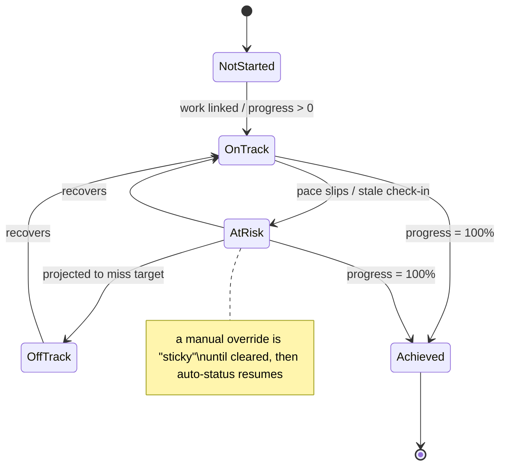

# 22 · Goals, OKRs & Milestones

> Follows the [Master PRD Template](./00-prd-template.md). Goals connect *why* to *what*:
> they sit above tasks and projects so day-to-day work rolls up into measurable outcomes —
> the way **Asana Goals**, **Monday**, **ClickUp Goals**, **Perdoo/Lattice OKRs**, and
> **Jira roadmaps** do — while staying calm, native, and one tap from the work itself.

---

## 1. Purpose

Goals, OKRs & Milestones is Numil's **outcome layer**. It lets a person or organization set
objectives, attach measurable key results, link the actual tasks/projects that move them,
and watch progress **roll up automatically** so status meetings become glanceable and
honest.

**User problem it solves.** Tasks answer "what am I doing today"; they don't answer "is it
working?" Teams set quarterly goals in slides, then never look at them; progress is updated
manually and is stale by the time anyone reads it. Individuals set personal goals ("read 12
books", "ship the app") with no link to daily action. Numil closes the loop: **work created
in the app updates the goal automatically**, and drifting goals surface before it's too late.

**User goals**
- Define an Objective and 2–5 Key Results in under two minutes.
- Link tasks/projects so progress **rolls up** without manual updates.
- See at a glance: on track / at risk / off track, and *why*.
- Run a lightweight weekly **check-in** and keep a history of confidence over time.
- Plan a **roadmap** of milestones and view a **portfolio** across teams.

**Business goals**
- Move Numil up-market from a task app to a **strategy execution platform** (enterprise ACV).
- Increase cross-module engagement (goals pull users into tasks, reports, projects).
- Anchor manager/exec personas and monetized reporting/portfolio features.

**KPIs:** goals created, % goals with ≥1 linked task/project (linkage rate), check-in
cadence adherence, % KRs auto-updating vs manual, goal completion rate, at-risk lead time
(days between "at risk" flag and due), portfolio views by managers.

**Status:** objectives/KRs/linkage/rollups/check-ins/milestones ✅ v1 · portfolio +
alignment tree + roadmap timeline 🔜 v1.1 · weighted scoring, initiatives, custom cadences
🟣 v2 · predictive attainment 🧪 Experimental.

---

## 2. Navigation

**Entry points**
- **Sidebar → Goals** (top-level destination).
- **Home dashboard** "Goals" card → tap a goal.
- From a **Project** → "Linked goals" chip → the goal.
- From [Task Detail](./10-task-detail.md) → "Contributes to" chip → the goal/KR.
- **Reports** ([16](./16-reports-analytics.md)) → a goal attainment widget → drill in.
- Deep links: `numil://goals`, `numil://goal/{goalId}`, `numil://okr/{krId}`,
  `numil://roadmap`.

**Route:** `src/app/goals/index.tsx` (list / portfolio), `src/app/goal/[id].tsx` (detail),
`src/app/goals/roadmap.tsx` (timeline). Goal detail is a **push** (it has children and a
back stack); **check-in** and **link work** open as **bottom sheets**; the create flow is a
**large-detent sheet**.

**Hierarchy / breadcrumbs**
```text
Workspace ▸ Goals ▸ [Objective]
Workspace ▸ Goals ▸ [Parent objective] ▸ [Child objective]   (alignment)
Workspace ▸ Goals ▸ Roadmap
```

**Transitions:** list → detail hero on the goal title + progress ring (`motion.slow`);
progress rings animate stroke on data change; roadmap uses horizontal paging.

**Modal vs push:** detail = push; create/check-in/link = sheet so context is preserved.

---

## 3. Complete UI Layout

```text
┌───────────────────────────────────────────────┐
│  Goals                    Q3 2026 ▾     [＋]    │  ← large title, period selector, add
├───────────────────────────────────────────────┤
│  [ My goals ] [ Team ] [ Company ] [ Roadmap ] │  ← segmented scope
├───────────────────────────────────────────────┤
│  ◍ 72%  Grow activated teams        ⚑ On track │  ← GoalCard: ring, title, status
│    KR1 ▓▓▓▓▓▓▓░░ 700/1000 signups              │
│    KR2 ▓▓▓▓░░░░░ 42/100 activated              │
│    👤 Priya · 8 linked tasks · check-in 2d ago │
│  ◍ 38%  Ship Numil 2.0            ⚠ At risk     │
│    ▸ Milestone: Beta — Aug 15 (12d)            │
│  ◍ 100% Reduce churn to <3%       ✓ Achieved   │
├───────────────────────────────────────────────┤
│  Goal detail (push)                             │
│  ┌─────────────────────────────────────────┐   │
│  │  Grow activated teams        Q3 · Priya  │   │
│  │  ◍ 72%   On track   confidence ● ● ● ○ ○ │   │  ← rollup ring + confidence
│  │  ─ Key results ─────────────────────────  │   │
│  │  KR1  Signups         700 / 1000   +auto  │   │  ← metric + source
│  │  KR2  Activated teams  42 / 100    manual │   │
│  │  ─ Linked work ─────────────────────────  │   │
│  │  ▸ Project: Growth Sprint   ▓▓▓░ 60%      │   │
│  │  ▸ Task: Onboarding revamp  ◉ done        │   │
│  │  ─ Check-ins ───────────────────────────  │   │
│  │  Jul 14 · On track · "Signups accelerating"│  │
│  │  [ + Check in ]  [ Link work ]  [ ✨ AI ] │   │
│  └─────────────────────────────────────────┘   │
└───────────────────────────────────────────────┘
```

- **Top:** large title "Goals", a **period selector** (Q3 2026 / cycle) and one primary `＋`.
  Glass nav respects Dynamic Island + safe area.
- **Scope segmented control:** My goals / Team / Company / Roadmap — the calm way to switch
  altitude without extra screens.
- **Goal list:** `GoalCard`s each with a **progress ring** (rolled-up %), title, owner,
  status chip (On track / At risk / Off track / Achieved / Not started), inline KR bars, and
  a footer (linked-work count, last check-in). Swipe → Check in, Link work, Archive.
- **Goal detail:** header ring + confidence dots; **Key Results** list (value / target /
  source badge auto|manual); **Linked work** (projects & tasks with mini progress);
  **Check-ins** timeline; sticky action bar `[+ Check in] [Link work] [✨ AI]`.
- **Milestones/Roadmap:** a horizontal timeline of milestones and goal due dates with a
  "today" line; tap a milestone → its linked goal/tasks.
- **Calm design:** KRs beyond the first two collapse behind "+3 more"; alignment tree and
  weighting live behind disclosures; the default card reads in one glance.
- **Landscape / iPad:** two-pane — goal list left, detail right; roadmap becomes a wide Gantt
  with lanes per team.
- **Tab bar:** visible on list; hidden on roadmap full-screen timeline.

**Goal status lifecycle (state):**


---

## 4. Complete Component Breakdown

| Area | Components |
|------|-----------|
| Nav / header | `GlassNavBar`, `LargeTitle`, `PeriodSelector` (popover), `AddGoalButton`, `ScopeSegmentedControl` |
| Goal list | `GoalCard` (`ProgressRing`, `StatusChip`, `KRMiniBar`, `OwnerAvatar`, `LinkedCountChip`, `CheckinAgeChip`), `SwipeActions`, `SectionHeader` (by status/team) |
| Goal detail | `GoalHeader` (ring + `ConfidenceDots`), `KeyResultList`, `KeyResultRow` (value/target, `SourceBadge` auto/manual, `TrendSparkline`), `LinkedWorkList`, `LinkedWorkRow` (project/task + `MiniProgress`), `CheckinTimeline`, `CheckinRow`, `ActionBar` |
| Create / edit | `GoalCreateSheet`, `ObjectiveField`, `KRBuilder`, `MetricTypePicker` (number/percent/currency/binary/task-based), `OwnerPicker`, `PeriodPicker`, `AlignParentPicker` |
| Milestones / roadmap | `RoadmapTimeline` (Gantt-lite), `MilestoneMarker`, `TodayLine`, `LaneHeader`, `DependencyLink` |
| Portfolio | `PortfolioGrid`, `PortfolioRow` (team → goals rollup), `HeatCell` (status), `FilterBar` |
| Alignment | `AlignmentTree` (parent/child goals), `TreeNode`, `Connector` |
| Feedback | `Skeleton`, `Toast` (undo), `Banner` (at-risk / stale check-in), `ConfirmDialog`, `EmptyState` |
| AI | `AIGoalDraftCard`, `AIRiskInsightChip`, `AICheckinSummary` (from module 19) |

Primitives per [03-design-system-ui.md](./03-design-system-ui.md).

---

## 5. Modern Features

Each feature: **Purpose · Workflow · UI · Permissions · Offline · API · DB · Notify · AC.**

**Role permission matrix** (module-specific deltas; base model in
[shared/rbac-permissions.md](./shared/rbac-permissions.md)):

| Capability | Owner | Admin | Manager | Member | Guest |
|-----------|:-----:|:-----:|:-------:|:------:|:-----:|
| View company/team goals | ✅ | ✅ | ✅ | ✅ | shared only |
| Create **personal** goal | ✅ | ✅ | ✅ | ✅ | ❌ |
| Create/edit **team** goal | ✅ | ✅ | ✅ (own team) | ❌ | ❌ |
| Create/edit **company** goal | ✅ | ✅ | ❌ | ❌ | ❌ |
| Edit target / override status | ✅ | ✅ | ✅ (own goals) | personal only | ❌ |
| Post a check-in | ✅ | ✅ | ✅ (owner/delegate) | own/assigned | ❌ |
| Manage cycles / portfolio / roadmap | ✅ | ✅ | team scope | ❌ | ❌ |
| View goal audit (target/status history) | ✅ | ✅ | scoped | ❌ | ❌ |

Personal goals are **owner-only** (invisible to Admins); linking only ever surfaces work the
viewer can already access.

### 5.1 Objectives & Key Results ✅ (Perdoo/Lattice/ClickUp)
- **Purpose:** express a qualitative Objective with 2–5 measurable Key Results.
- **Workflow:** `＋` → type objective → add KRs, each with a **metric type** (number,
  percent, currency, binary done/not-done, or **task-based** count) + start/target values →
  owner + period → save.
- **UI:** `GoalCreateSheet` → `KRBuilder`; metric type picker adapts the value inputs.
- **Permissions:** create — Manager+ for team/company goals; any Member for **personal**
  goals; edit — owner + Managers/Admins.
- **Offline:** create/edit optimistic (queued op); rollup recomputed locally then confirmed.
- **API:** `POST /goals`, `POST /goals/:id/key-results`.
- **DB:** `goals`, `key_results`.
- **Notify:** owner + followers notified on creation and target changes.
- **AC:** a goal supports 0–N KRs; each KR has a metric type, start, current, target;
  percent auto-derives from start→target.

### 5.2 Link goals to projects & tasks (goal → work) ✅ (Asana)
- **Purpose:** connect strategy to execution so progress is real, not typed.
- **Workflow:** in goal detail → "Link work" → pick projects/tasks (or, from a task's
  "Contributes to" chip, pick a KR). A KR can be driven **automatically** by the completion
  ratio of its linked tasks or a project's progress.
- **UI:** `LinkedWorkList`; `SourceBadge` shows `auto` (task/project-driven) vs `manual`.
- **Permissions:** linker needs read on the goal and the work item.
- **Offline:** link optimistic; rollup deferred until both entities are synced.
- **API:** `POST /key-results/:id/links`, `DELETE …/links/:linkId`.
- **DB:** `goal_links(kr_id, entity_type, entity_id, contribution)`.
- **Notify:** goal followers see "N tasks linked".
- **AC:** linking a task-based KR updates its value from linked-task completion within seconds
  of a task change; unlinking recomputes cleanly.

### 5.3 Progress rollups & auto-calc ✅ (Monday/ClickUp)
- **Purpose:** a single, trustworthy number per goal.
- **Workflow:** goal % = aggregate of its KRs (equal weight v1, **weighted** 🟣); KR % from
  its metric (value vs target) or linked-work completion. Parent goals roll up from children.
- **UI:** `ProgressRing` + KR bars; sparkline of progress over time.
- **Permissions:** read to view; recompute is server-authoritative.
- **Offline:** optimistic local recompute; server value reconciles by `version`.
- **API:** computed server-side; exposed on `GET /goals/:id`.
- **DB:** `goals.progress`, `goals.status`, `goal_progress_snapshots` (daily history).
- **Notify:** status transitions (e.g., On track → At risk) notify owner + followers.
- **AC:** rollups are correct and idempotent; changing a KR or linked task updates the goal;
  a daily snapshot records history for trends.

### 5.4 Check-ins & confidence ✅ (Sunsama/Weekdone)
- **Purpose:** a lightweight ritual capturing human judgment the metrics can't.
- **Workflow:** `+ Check in` → set status (On/At risk/Off track), a 1–5 confidence, and a
  short note; optionally update KR values in the same sheet. Cadence reminders (weekly
  default) nudge owners.
- **UI:** `CheckinTimeline` history; `ConfidenceDots`; a "stale check-in" banner if overdue.
- **Permissions:** goal owner + delegates; Managers can check in on team goals.
- **Offline:** compose offline → queued; append-only (never conflicts).
- **API:** `POST /goals/:id/checkins`.
- **DB:** `goal_checkins` (append-only, status, confidence, note, kr_updates_json).
- **Notify:** check-in due reminder; posted check-in notifies followers.
- **AC:** check-ins are append-only and timestamped; overdue cadence surfaces a reminder;
  confidence trend is charted.

### 5.5 Milestones & roadmap ✅ / 🔜 (Jira roadmap/Monday timeline)
- **Purpose:** time-based checkpoints and a visual plan.
- **Workflow:** add milestones (name, date, optional linked goal/tasks); view them on a
  horizontal **roadmap** with a "today" line and lane-per-team (🔜); drag to reschedule
  (Manager+).
- **UI:** `RoadmapTimeline`, `MilestoneMarker` (upcoming/at-risk/done), `TodayLine`.
- **Permissions:** create/move — Manager+; view — anyone with goal read.
- **Offline:** create/edit optimistic; drag-reschedule queued.
- **API:** `POST /milestones`, `PATCH /milestones/:id`, `GET /roadmap?period=`.
- **DB:** `milestones(id, org_id, goal_id?, name, date, status)`.
- **Notify:** milestone-approaching (configurable lead time) + milestone-missed.
- **AC:** milestones render on the timeline in the correct period; missed milestones flag
  the parent goal at risk.

### 5.6 Alignment / parent goals (cascading OKRs) 🔜 v1.1 (Perdoo tree)
- **Purpose:** cascade company → team → individual objectives.
- **Workflow:** set a goal's **parent**; child progress rolls into the parent; an
  **alignment tree** visualizes the hierarchy.
- **UI:** `AlignParentPicker` in create/edit; `AlignmentTree` view.
- **Permissions:** aligning to a company goal requires read on the parent; Managers align
  team goals.
- **Offline:** edit optimistic; tree recompute server-side.
- **API:** `PATCH /goals/:id` (`parentId`), `GET /goals/tree?root=`.
- **DB:** `goals.parent_id` (self-FK), cycle-prevented.
- **Notify:** parent owner notified when a child is aligned.
- **AC:** cycles are prevented; parent progress reflects weighted child progress; unaligning
  recomputes.

### 5.7 Portfolio view 🔜 v1.1 (Asana Portfolios)
- **Purpose:** exec-level overview across teams/goals.
- **Workflow:** managers open **Portfolio** → grid of teams × goals with status heat cells,
  filter by owner/period/status, export a snapshot to [Reports](./16-reports-analytics.md).
- **UI:** `PortfolioGrid`, `HeatCell`, `FilterBar`.
- **Permissions:** Manager+ (team scope), Admin/Owner (all).
- **Offline:** cached snapshot read-only.
- **API:** `GET /goals/portfolio?scope=&period=`.
- **DB:** derived from `goals`/`goal_progress_snapshots`.
- **Notify:** optional weekly portfolio digest.
- **AC:** portfolio reflects live rollups; respects permission scope (never shows goals the
  viewer can't access).

### 5.8 Weighted scoring & scoring methods 🟣 v2
- Per-KR weights, and a choice of scoring (simple average, weighted, or "grade" bands
  0.0–1.0 like Google OKRs). Stored on `goals.scoring_json`; default = equal-weight average.

---

## 6. Smart AI Features

Powered by [AI Assistant & Copilot](./19-ai-assistant-copilot.md) and surfaced deeply in
[AI Productivity Insights](./36-ai-productivity-insights.md).

| Capability | What it does for goals |
|-----------|-------------------------|
| **Draft objective + KRs** (`nl_parse`/`action_items`) | "Improve onboarding this quarter" → a well-formed objective with 3 measurable KRs to edit. |
| **Suggest linked work** (`semantic_search`) | Recommends existing tasks/projects that likely contribute to a KR. |
| **Risk detection** (`risk_detect`/`deadline_predict`) | Flags goals trending off-target given pace, linked-work slippage, and stale check-ins. |
| **Attainment forecast** (`workload_predict`) | Projects end-of-cycle value from current trajectory ("~78% likely to hit 1000"). |
| **Check-in draft** (`summarize`) | Pre-writes a check-in note from the week's linked-task activity; user edits/confirms. |
| **Weekly/quarterly narrative** (`summarize`) | Human-readable rollup for the goal or portfolio (feeds module 36 reviews). |

All AI outputs are **proposal-first** (Accept/Edit/Undo), logged as `ai_invoked` with
`accepted`, permission-scoped, and never post a check-in or change a target without explicit
confirmation.

---

## 7. Productivity Features

- **"Contributes to" chip** on tasks/projects for one-tap linkage from where work happens.
- **My goals on Home:** a compact card of the user's owned/followed goals with rings.
- **Cadence reminders:** weekly check-in nudges (respecting quiet hours from
  [Notifications](./12-notifications-alerts.md)).
- **Focus link:** starting a [Focus session](./35-focus-pomodoro-habits.md) on a
  goal-linked task attributes deep-work time toward the objective.
- **Streaks for check-ins:** gentle gamification for consistent weekly updates.
- **Quick target math:** relative targets ("+20% over last quarter") auto-fill from history.

---

## 8. Enterprise Features

- **Company OKRs & alignment tree** across the whole org (Admin/Owner curated).
- **Portfolio dashboards** and scheduled exec digests; export to
  [Reports & Analytics](./16-reports-analytics.md).
- **Governance:** who can create company goals, lock cycles, and edit targets is
  role-gated per [RBAC](./shared/rbac-permissions.md).
- **Audit trail** of target changes, status overrides, and check-ins →
  [Activity Feed & Audit Logs](./29-activity-feed-audit-logs.md) (targets are sensitive).
- **Automation hooks:** goal events (at-risk, milestone-missed, achieved) can trigger
  [Automation rules](./20-automation-workflow-rules.md) (e.g., notify a leader, create a
  recovery task).
- **Retention & privacy:** personal goals never visible to Admins; historical snapshots
  retained per org policy with legal-hold override.

---

## 9. Collaboration Features

- **Owner + followers + delegates:** follow a goal to get progress/check-in updates without
  owning it; delegate check-in rights.
- **@mentions in check-ins/notes**; comment thread on a goal 🔜 for discussion.
- **Shared visibility:** company/team goals are readable across the org (transparency), with
  private personal goals as the exception.
- **Reactions on check-ins** (celebrate "Achieved"); pinned "decision" notes.
- **Live rollups:** when a linked task completes, watchers of the goal see the ring move in
  realtime via WebSocket.

---

## 10. Offline Architecture

Deltas over [shared/offline-sync-engine.md](./shared/offline-sync-engine.md):
- Goals, KRs, check-ins, and links are editable offline (optimistic); **check-ins are
  append-only** → merge by id, never conflict.
- **Rollups recompute locally** from cached KRs/linked work for instant feedback, then
  reconcile to the server-authoritative value by `version` (server wins on divergence).
- Manual KR value edits use scalar last-write-wins; a target changed on two devices resolves
  by server timestamp with a non-blocking notice.
- Portfolio/roadmap are read-through caches; heavy aggregates require network (clear
  "syncing" state, no dead spinners).
- Links to a since-deleted task/project are dropped on sync with a notice; goal recomputes.

---

## 11. Security

Deltas over [shared/security-baseline.md](./shared/security-baseline.md):
- **Targets and attainment are sensitive**: read/write re-checks goal scope (company/team
  membership) on every request; personal goals are owner-only (invisible to Admins).
- Linkage cannot leak data: a KR link only surfaces work items the *viewer* can access;
  rollup math runs server-side over authorized rows.
- Check-in notes are sanitized (no HTML/script injection); mentions resolve within scope.
- Target/status **override** actions are audited with before→after.
- Portfolio/report exports respect row-level permission scope.

---

## 12. Notification System

Deltas over [12-notifications-alerts.md](./12-notifications-alerts.md):
- Emits: goal created/assigned, target changed, **status change** (On track ↔ At risk ↔ Off
  track), **check-in due** (cadence), check-in posted, mention in a note, **milestone
  approaching / missed**, **goal achieved** (celebration), and AI risk digest (opt-in).
- Rollup-driven status changes are **debounced** so a flurry of task completions produces one
  "now On track" notification, not many.
- iOS notification category actions: **Check in**, **Open goal**, **Snooze reminder**.

---

## 13. Accessibility

Deltas over [shared/accessibility-spec.md](./shared/accessibility-spec.md):
- Progress rings expose a text value ("72 percent, on track") — never color/shape alone;
  status uses icon + label + color.
- KR rows announce "Signups, 700 of 1000, auto-updated"; confidence dots read "confidence 3
  of 5".
- Roadmap markers are reachable via VoiceOver in date order with dates spoken; the timeline
  supports keyboard/Full Keyboard Access navigation on iPad.
- Check-in sheet fields are labeled; the alignment tree exposes parent/child relationships as
  hints ("child of: Company objective").

---

## 14. Animations

Deltas over [shared/animation-spec.md](./shared/animation-spec.md):
- Progress ring animates stroke-dashoffset over `motion.base` when a rollup changes.
- Goal achieved (100%): confetti (`spring.bouncy`, ≤1.2s) — only on true completion or a
  milestone; skipped under Reduce Motion.
- Status chip transition cross-fades color + label (`motion.fast`).
- Check-in added: row slides up + fade; confidence dots fill sequentially.
- Roadmap drag-reschedule: marker lifts (scale 1.03) and neighbors part with `spring.gentle`.
- Reduce Motion: cross-fades replace movement; no confetti; rings snap without easing bounce.

---

## 15. Performance

- Goal list & check-in timeline virtualized (FlashList); KR sparklines are lightweight SVG
  memoized by data hash.
- **Rollups computed server-side**, cached, and pushed via realtime diff — the client never
  recomputes a whole tree on every task change (only the affected goal path).
- Daily `goal_progress_snapshots` power trends without recomputing history on read.
- Roadmap/portfolio use windowed rendering and cursor pagination; off-screen lanes lazy-load.
- Optimistic writes keep interaction <16ms; realtime updates diffed by `version` (ignore echo
  of own ops). Screen open <150ms from cached goals.

---

## 16. Database Design

```text
goals(id, org_id, scope, scope_id?, owner_id, parent_id?→goals, title, description,
      period_id?, metric_type, progress, status, confidence, scoring_json,
      start_at?, due_at?, created_at, updated_at, version, deleted_at?)
key_results(id, goal_id→goals, title, metric_type, start_value, current_value, target_value,
            unit, source, weight, order, updated_at)      -- source: manual|task|project
goal_links(id, kr_id→key_results, entity_type, entity_id, contribution, created_at)  -- task/project
goal_checkins(id, goal_id→goals, author_id, status, confidence, note, kr_updates_json, created_at) -- append-only
milestones(id, org_id, goal_id?→goals, name, date, status, order, created_at, deleted_at?)
goal_progress_snapshots(id, goal_id→goals, progress, status, confidence, captured_on)  -- daily history
goal_periods(id, org_id, name, start_on, end_on)          -- e.g., "Q3 2026"
goal_followers(goal_id→goals, user_id)                    PK(goal_id, user_id)
```

**Indexes:** `goals(org_id, scope, period_id)`, `goals(owner_id, status)`,
`goals(parent_id)` (tree), `key_results(goal_id, order)`,
`goal_links(entity_type, entity_id)` (reverse lookup task→goals),
`goal_checkins(goal_id, created_at)`, `goal_progress_snapshots(goal_id, captured_on)`,
`milestones(org_id, date)`. **Constraints:** `parent_id` must not create a cycle;
personal goal ⇒ `scope='personal'`, `scope_id IS NULL`, owner-only; a task-sourced KR's
`current_value` is derived (read-only via manual edits). **Soft delete** via `deleted_at`;
**check-ins & snapshots** are append-only history. Aligns with
[17-data-model-api.md](./17-data-model-api.md).

---

## 17. API Design

Follows [shared/api-conventions.md](./shared/api-conventions.md).

| Method | Path | Purpose |
|--------|------|---------|
| GET | `/goals?scope=team&period=q3-2026&expand=keyResults,owner` | List (filter/paginate) |
| POST | `/goals` (Idempotency-Key) | Create objective |
| GET | `/goals/:id?expand=keyResults,links,checkins,children` | Goal detail |
| PATCH | `/goals/:id` (If-Match) | Update (title/parent/period/status override) |
| DELETE | `/goals/:id` | Soft-delete |
| POST | `/goals/:id/key-results` · PATCH/DELETE `/key-results/:id` | KR CRUD |
| POST | `/key-results/:id/links` · DELETE `…/links/:linkId` | Link/unlink work |
| POST | `/goals/:id/checkins` | Post a check-in (append-only) |
| GET | `/goals/:id/progress?from=&to=` | Progress history (snapshots) |
| GET | `/goals/tree?root=` | Alignment tree (🔜) |
| GET | `/goals/portfolio?scope=&period=` | Portfolio grid (🔜) |
| POST | `/milestones` · PATCH/DELETE `/milestones/:id` | Milestones |
| GET | `/roadmap?period=&scope=` | Roadmap timeline data |
| POST | `/goals/:id/ai/{draft-krs|forecast|risk|checkin-summary}` | AI actions (module 19) |

**Realtime:** channel `goal:{id}` + `org:{id}` — `goal.updated` (progress/status),
`checkin.created`, `milestone.updated`, `keyresult.updated`. Client reconciles by `version`.
**Errors:** `403 forbidden` (scope/personal), `409 conflict` (version), `409 gone` (deleted
link target), `422 validation_failed` (cycle in alignment / target < start for increasing
metric). **Idempotency-Key** on all mutations.

**Sample check-in request/response**
```http
POST /v1/goals/goal_7c/checkins   Idempotency-Key: 9b2e…   X-Org-Id: org_123
{
  "status": "on_track",
  "confidence": 4,
  "note": "Signups accelerating after onboarding revamp.",
  "krUpdates": [ { "keyResultId": "kr_1", "currentValue": 700 } ]
}
```
```json
{
  "data": {
    "id": "chk_51a",
    "goalId": "goal_7c",
    "status": "on_track",
    "confidence": 4,
    "createdAt": "2026-07-16T08:05:00Z",
    "goal": { "progress": 72, "status": "on_track", "version": 34 }
  },
  "meta": { "requestId": "req_2f7" }
}
```

---

## 18. Edge Cases

- **Offline check-in + remote KR change:** check-in appends cleanly; KR scalar resolves LWW;
  rollup recomputes server-side and reconciles.
- **Linked task deleted/moved out of scope:** link dropped on sync with a notice; task-based
  KR recomputes from remaining links.
- **Metric target < start (increasing) or target > start (decreasing):** validated `422`
  with a clear message; percent math guards divide-by-zero (start == target).
- **Alignment cycle attempt:** blocked `422` with explanation.
- **Period rollover:** at cycle end, goals are archived read-only into history; cloning to
  the next period offered ("carry over unmet goals?").
- **Owner offboarded:** goal flagged "needs owner"; Managers can reassign; history preserved.
- **Permission lost mid-session:** next mutation `403` → rollback + notice; goal hidden if
  scope revoked.
- **Timezone/DST on cadence & milestones:** dates evaluated in org/user timezone; a check-in
  reminder never fires twice around a DST shift.
- **Massive linked-work set:** rollup batched + cached; UI shows aggregate, details paginate.
- **Conflicting manual override vs auto-rollup:** a manual status override is sticky until
  cleared and is clearly badged "overridden"; auto-status resumes when cleared.
- **Confidence with no metric movement:** allowed (human judgment can differ from numbers);
  divergence surfaced as an insight.

---

## 19. User States

- **First-time:** empty state offers "Set your first goal" + an AI-drafted example + a short
  OKR primer; personal goal encouraged first.
- **Returning / power user:** many goals, portfolio + roadmap, weekly check-in ritual, keyboard
  on iPad, AI forecasts.
- **Member:** owns/follows personal & assigned goals; reads team/company goals; cannot create
  company goals.
- **Manager:** creates team goals, checks in on behalf, sees team portfolio.
- **Admin / Owner:** company OKRs, alignment, governance, audit; Owner sees org-wide portfolio.
- **Guest:** only explicitly shared goals (rare); read-only, no portfolio/audit.
- **Offline / poor network:** create/check-in offline; rollups optimistic; portfolio cached.
- **Tablet / landscape:** two-pane detail; wide roadmap Gantt.
- **Dark mode / large text / a11y:** tokens + Dynamic Type; rings/statuses have text values.

---

## 20. Analytics Events

Schema per [shared/analytics-taxonomy.md](./shared/analytics-taxonomy.md).

| event | key properties |
|-------|----------------|
| `goal_viewed` | `scope`, `status`, `via` |
| `goal_created` | `scope`, `kr_count`, `metric_types`, `has_parent`, `via` (manual/ai) |
| `goal_updated` | `field` (title/target/period/parent/status_override) |
| `key_result_added` | `metric_type`, `source` (manual/task/project) |
| `goal_work_linked` | `entity_type` (task/project), `source` |
| `goal_checkin_posted` | `status`, `confidence`, `updated_krs`, `on_time` |
| `goal_status_changed` | `from`, `to`, `driver` (rollup/manual) |
| `milestone_created` / `milestone_missed` | `lead_days` |
| `roadmap_viewed` | `scope`, `period` |
| `portfolio_viewed` | `scope`, `goal_count` |
| `goal_achieved` | `days_early`, `had_manual_override` |
| `ai_invoked` | `capability` (draft_krs/forecast/risk/checkin_summary), `accepted` |

No goal titles/targets in event properties beyond enums/counts (privacy per taxonomy).

---

## 21. Acceptance Criteria

1. A user can create an objective with 2–5 key results in under two minutes.
2. Each KR supports metric types: number, percent, currency, binary, and task-based count.
3. Percent auto-derives from start→target; start == target guards against divide-by-zero.
4. A KR can be linked to tasks/projects and driven **automatically** by their completion.
5. Completing a linked task updates a task-based KR (and the goal ring) within seconds.
6. Goal % rolls up from KRs (equal weight v1) and is server-authoritative.
7. Parent goals roll up from aligned children; cycles are prevented (`422`).
8. Manual KR value edits and auto-sourced values coexist with a clear source badge.
9. Status (Not started / On track / At risk / Off track / Achieved) is computed and displayed.
10. A manual status override is sticky, badged "overridden", and clearable back to auto.
11. Check-ins capture status + 1–5 confidence + note and are append-only/timestamped.
12. Weekly cadence reminders nudge owners and respect quiet hours.
13. An overdue check-in shows a "stale" banner and a reminder notification.
14. Confidence and progress trends are charted from daily snapshots.
15. Milestones render on the roadmap in the correct period with a "today" line.
16. A missed milestone flags its parent goal at risk and notifies the owner.
17. Managers can drag to reschedule milestones; changes sync and audit.
18. The alignment tree (🔜) visualizes parent/child goals and weighted rollups.
19. Portfolio (🔜) shows team × goal status heat cells within the viewer's permission scope.
20. Personal goals are owner-only and never visible to Admins.
21. Company/team goals are readable across the org (transparency) unless explicitly private.
22. Linking only surfaces work items the viewer can access; rollups run over authorized rows.
23. Target/status overrides and check-ins are captured in the immutable audit log.
24. Offline create/edit/check-in queue optimistically and sync losslessly (no duplicates).
25. Check-ins merge append-only; scalar KR conflicts resolve LWW with a non-blocking notice.
26. A deleted/out-of-scope linked item is dropped on sync and the KR recomputes.
27. Period rollover archives goals read-only and offers carry-over to the next cycle.
28. Cadence/milestone dates use org/user timezone and are DST-safe (no double reminders).
29. Goal events (at-risk/missed/achieved) can trigger automations (module 20).
30. AI can draft objectives+KRs, suggest links, forecast attainment, and pre-write check-ins.
31. All AI outputs are proposal-first (Accept/Edit/Undo); nothing posts without confirmation.
32. Rollup-driven status changes are debounced into a single notification.
33. Realtime updates move the ring for goal watchers when linked work changes.
34. VoiceOver reads ring %, status, KR values, and confidence; no color-only signals.
35. Reduce Motion disables confetti/ring bounce; state feedback retained.
36. iPad landscape shows two-pane detail and a wide roadmap Gantt.
37. Analytics events fire with correct properties (offline-buffered) and no sensitive targets.
38. Goal detail opens <150ms from cached data; no dead spinners offline.
39. Achieving a goal (true 100%) triggers a single celebration, not repeated ones.
40. Undo (5s snackbar) is available for destructive actions (delete goal/KR/milestone).

---

## 22. Future Roadmap

- **V1 (✅):** objectives + KRs, metric types incl. task-based, link work, auto rollups,
  status/confidence, check-ins with cadence reminders, milestones, basic roadmap, daily
  snapshots/trends, personal & team/company scope, AI drafts/forecasts (proposal-first),
  audit, offline.
- **V1.1 (🔜):** alignment/parent tree (cascading OKRs), portfolio dashboards, richer
  roadmap lanes + drag-reschedule, exec digests, comment threads on goals.
- **V2 (🟣):** weighted scoring + grade bands (0.0–1.0), initiatives layer between goals and
  projects, custom cadences, private team goals, scenario planning.
- **Future (💡):** goal templates library ([24](./24-templates-recurring-workflows.md)),
  cross-org/partner goals, OKR "grading" ceremonies, dependency-aware roadmap critical path.
- **Experimental (🧪):** predictive attainment with confidence intervals, auto-suggested KR
  targets from historical baselines, AI "goal coach" nudges.
- **AI track:** deep integration with [AI Productivity Insights](./36-ai-productivity-insights.md)
  for risk narratives and portfolio health.
- **Enterprise track:** cycle locking, target-change approvals, portfolio export/eDiscovery,
  SSO-scoped goal visibility, per-department cost/impact attribution.
