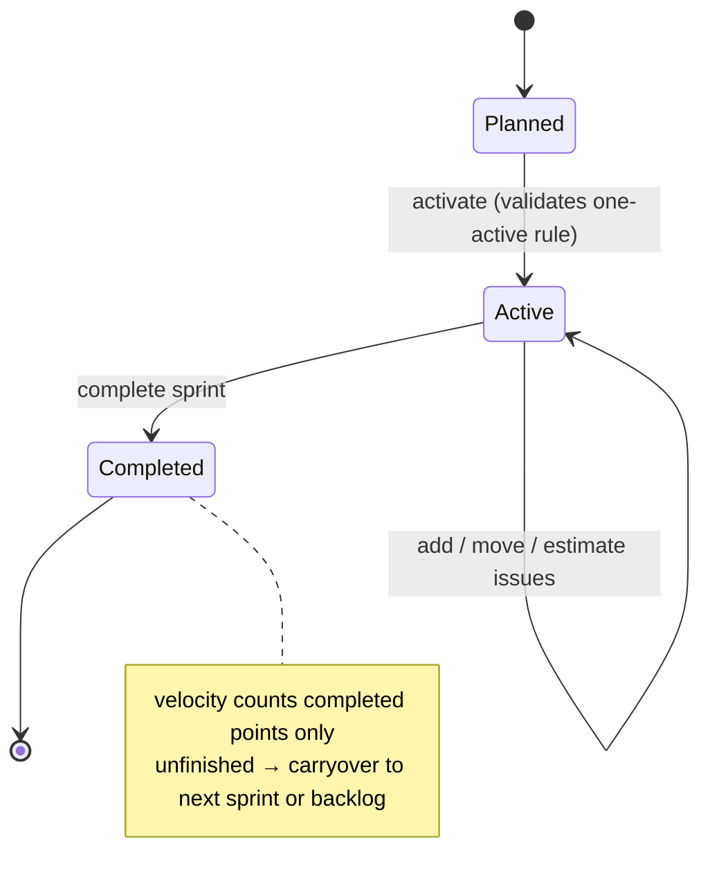

# 23 · Sprint Planning & Agile Boards

> Follows the [Master PRD Template](./00-prd-template.md). Numil brings **Linear**-grade
> keyboard speed and **Jira**-grade rigor to sprints — cycles, backlog, story points,
> velocity, burndown/burnup, swimlanes, WIP limits, and cycle-time — while staying calm and
> native. This module builds directly on projects from
> [09 · Team Tasks & Projects](./09-team-tasks-projects.md) and the task surface in
> [10 · Task Detail](./10-task-detail.md).

---

## 1. Purpose

Sprints turn a flat project into a **cadence of committed work**. Numil adds an agile layer
on top of existing projects/tasks so software and ops teams can plan iterations, forecast
with velocity, and visualize flow — without adopting a heavy separate tool.

**User problem it solves.** Simple task apps can't answer "what are we committing to this
cycle and will we finish?" Heavy tools (Jira) answer it but bury teams in configuration.
Numil exposes just enough agile structure — a board, a backlog, points, a burndown — with
one-tap defaults, and hides advanced ceremony behind disclosure.

**User goals**
- Plan a cycle: pull items from the backlog, estimate, commit a scope.
- Work a board grouped by status with **swimlanes** and **WIP limits**.
- See at a glance: are we on track (burndown), how much do we deliver (velocity).
- Run retro/close: carry over unfinished work, learn from cycle time.

**Business goals**
- Win engineering/product teams currently on Jira/Linear.
- Increase org stickiness (planning cadence = habitual weekly usage).
- Feed delivery signals into [16 · Reports](./16-reports-analytics.md) and AI risk detection.

**KPIs:** sprints created/active, `% committed points completed`, velocity stability, board
DAU, cycle-time trend, carryover rate, forecast accuracy.

**Status:** cycles + board + backlog + points ✅ v1 · burndown/velocity + WIP limits + swimlanes
🔜 v1.1 · burnup + cycle-time analytics + capacity planning 🟣 v2 · AI sprint planning 🧪.

---

## 2. Navigation

**Entry points**
- Project → **view switch** adds **Board** and **Sprints** alongside List/Calendar (extends
  the segmented switch in [09](./09-team-tasks-projects.md)).
- Sidebar → project → "Active sprint" quick link with a progress ring.
- Home ([07](./07-home-dashboard.md)) → "Your active sprint" card.
- Deep links: `numil://project/{id}/sprint/{sprintId}`, `numil://project/{id}/board`,
  `numil://project/{id}/backlog`.

**Routes** (`src/app/...`): `project/[id]/board.tsx`, `project/[id]/backlog.tsx`,
`project/[id]/sprints/index.tsx` (list + planning), `project/[id]/sprints/[sprintId].tsx`
(sprint detail: board + charts). Sprint **planning** opens as a large sheet;
individual cards open Task Detail as a sheet (medium→large).

**Hierarchy / breadcrumbs**
```text
Workspace ▸ Project ▸ Sprint 14 ▸ Board
```

**Transitions:** board columns are a horizontal pager; card drag lifts with shadow and
autoscrolls near edges (`spring.gentle`). Switching Board ⇄ Backlog cross-fades (`motion.base`).
Charts fade/animate stroke on appear.

---

## 3. Complete UI Layout

```text
┌───────────────────────────────────────────────┐
│  ‹ Mobile App     Sprint 14 ▾         ⋯   [+]  │  ← nav, sprint selector, Island-safe
│  ▓▓▓▓▓▓░░░  32/48 pts · 4 days left             │  ← sprint progress + countdown
├───────────────────────────────────────────────┤
│  ⌕ Filter   Group: Status ▾   Lanes: Assignee ▾ │  ← filter / group / swimlane
├───────────────────────────────────────────────┤
│  Priya ▸ ───────────────── swimlane header ──── │
│  ┌ To do ─┐ ┌ In prog (3/3!) ┐ ┌ Review ┐ ┌Done┐│  ← columns; WIP limit hit = amber
│  │ NUM-31 │ │ NUM-28  ●●     │ │ NUM-24 │ │NUM-9││
│  │ 3 pts  │ │ 5 pts   blocked│ │ 2 pts  │ │ 8pts││
│  │ ⋮⋮ card│ │ ⋮⋮ card       │ │        │ │     ││
│  └────────┘ └───────────────┘ └────────┘ └─────┘│
│  Marco ▸ ─────────────────────────────────────  │
│  ┌ To do ─┐ ┌ In progress   ┐ ┌ Review ┐ ┌Done┐│
│  │ NUM-33 │ │               │ │        │ │NUM-7││
│  └────────┘ └───────────────┘ └────────┘ └─────┘│
├───────────────────────────────────────────────┤
│  [ Board ]  [ Backlog ]  [ Burndown ]  [ Velo ] │  ← bottom segmented
└───────────────────────────────────────────────┘
```

- **Top:** back to project, **sprint selector** (Active / upcoming / past), progress bar with
  points done/total and days remaining, `⋯` (sprint settings, complete sprint, WIP limits),
  `+` (create issue directly into a column). Dynamic Island + top safe area respected.
- **Control bar:** filter (assignee/label/priority/estimate), **group by** (status/assignee/
  priority/epic), **swimlanes** (assignee/epic/priority/none).
- **Board body:** horizontally scrollable status columns; each shows a **count / WIP limit**
  badge that turns amber→red past the limit; cards show key (`NUM-31`), title, points, avatar,
  blocked lock, subtask progress. Drag between columns changes status; drag within reorders.
- **Backlog tab:** a single ranked list with an inline estimate chip and a "▸ Sprint 14"
  section at top; drag items up into the sprint to commit them.
- **Charts tabs:** Burndown (ideal vs actual), Velocity (last N sprints bars), Burnup/Cycle
  time (v2). 
- **Empty space:** a project with no sprint shows "Start your first sprint" with a 1-tap
  default 2-week cycle.
- **iPad / landscape:** board + right-hand **sprint inspector** (scope, capacity, charts);
  backlog and board side-by-side for drag-planning.
- **Tab bar:** hidden on full board immersion; returns on pop.

**Sprint lifecycle state machine** (one active sprint per project by default):



---

## 4. Complete Component Breakdown

| Area | Components |
|------|-----------|
| Header | `GlassNavBar`, `SprintSelector` (popover), `SprintProgressBar`, `Countdown`, `⋯` menu, `NewIssueButton` |
| Control bar | `FilterBar`, `GroupByControl`, `SwimlaneControl`, `SearchField` |
| Board | `BoardScroller`, `BoardColumn`, `ColumnHeader` (title + `WipBadge`), `SwimlaneHeader`, `IssueCard`, `PointsChip`, `BlockedBadge`, `AvatarStack`, `SubtaskProgress`, drag layer |
| Backlog | `BacklogList` (FlashList), `BacklogRow`, `EstimateChip`, `SprintSection`, `DragToCommit` handle |
| Planning | `SprintPlanSheet`, `CapacityMeter`, `ScopeSummary`, `CommitBar` |
| Charts | `BurndownChart`, `VelocityChart`, `BurnupChart`, `CycleTimeChart`, `ChartLegend` |
| Sprint mgmt | `SprintSettingsSheet`, `CompleteSprintSheet` (carryover picker), `RetroNotes` |
| Feedback | `Skeleton`, `Toast` (undo move), `Banner` (WIP exceeded / offline), `ConfirmDialog` |
| AI | `AIButton` (plan sprint / estimate / scope-risk), `AISuggestionCard` |

Primitives from [03 · Design System](./03-design-system-ui.md); `IssueCard` shares DNA with
`TaskRow`/board cards defined for [09](./09-team-tasks-projects.md).

---

## 5. Modern Features

Each: **Purpose · Workflow · UI · Permissions · Offline · API · DB · Notify · AC.**

**Role permission matrix** (module actions; per-feature deltas noted inline; canonical model
in [shared/rbac-permissions.md](./shared/rbac-permissions.md)):

| Action | Owner | Admin | Manager | Member | Guest |
|--------|:-----:|:-----:|:-------:|:------:|:-----:|
| View board / backlog | ✅ | ✅ | ✅ | project member | shared |
| Move card / change status | ✅ | ✅ | ✅ | contributor | shared* |
| Estimate / rank backlog | ✅ | ✅ | ✅ | contributor | ❌ |
| Create / activate / complete sprint | ✅ | ✅ | own/lead | ❌ | ❌ |
| Configure board (columns/WIP/lanes) | ✅ | ✅ | lead | ❌ | ❌ |
| Manage epics / capacity | ✅ | ✅ | lead | ❌ | ❌ |
| View velocity / cycle-time | ✅ | ✅ | ✅ | project member | ❌ |
| Portfolio roll-up / export | ✅ | ✅ | team | ❌ | ❌ |

`*` guests only for issues explicitly shared with them.

### 5.1 Sprints / cycles ✅ (Linear cycles / Jira sprints)
- **Purpose:** time-box committed work with a start/end and a goal.
- **Workflow:** create a sprint (name, goal, start/end, default length); set it **active**;
  add issues; **complete** it → choose carryover of unfinished items into the next sprint or
  back to backlog. Optional **auto-cadence** (rolling 1/2/3-week cycles auto-created).
- **UI:** `SprintSelector`, `SprintProgressBar`, `CompleteSprintSheet` with carryover picker.
- **Permissions:** Manager / project **Lead** create & manage; Contributors add/move issues.
- **Offline:** create/edit/move offline; sprint activation queued if it changes shared state.
- **API:** `POST /projects/:id/sprints`, `PATCH /sprints/:id`, `POST /sprints/:id/complete`.
- **DB:** `sprints`, `task.sprint_id`.
- **Notify:** sprint start/complete → project watchers; "sprint ends tomorrow" digest.
- **AC:** one active sprint per project (configurable); completing rolls over selected items
  with history preserved; overlapping active sprints prevented unless multi-team enabled.

### 5.2 Backlog & ranking ✅
- **Purpose:** a single ordered queue of everything not yet in a sprint.
- **Workflow:** rank by drag (fractional indexing); estimate inline; multi-select → "Move to
  Sprint 14"; filter by label/priority/epic. Top of backlog = next to pull.
- **UI:** `BacklogList` with `EstimateChip`, `SprintSection`, drag handles.
- **Permissions:** Contributors reorder/estimate; Viewers read-only.
- **Offline:** full; order uses fractional indexing to avoid renumber storms.
- **API:** `PATCH /tasks/:id` (`backlogRank`, `sprintId`), `POST /sprints/:id/issues` (bulk).
- **DB:** `tasks.backlog_rank` (float), `tasks.sprint_id?`.
- **Notify:** bulk add to sprint notifies assignees (batched).
- **AC:** ranking persists and syncs; moving to a sprint removes it from backlog view;
  concurrent reorders converge via fractional indices.

### 5.3 Story points & estimation ✅ (Planning Poker)
- **Purpose:** size work for forecasting.
- **Workflow:** set points per issue from a configurable scale (Fibonacci 1/2/3/5/8/13, T-shirt
  XS–XL, or hours). Optional async **planning poker**: members vote, reveal, agree.
- **UI:** `EstimateChip`, `PointsChip`, poker vote sheet (🔜).
- **Permissions:** Contributors estimate; Lead sets the scale per project.
- **Offline:** set points offline.
- **API:** `PATCH /tasks/:id` (`estimatePoints`), `POST /sprints/:id/poker` (🔜).
- **DB:** `tasks.estimate_points`, `projects.estimate_scale`, `estimate_votes` (🔜).
- **Notify:** poker "reveal ready" to voters.
- **AC:** only scale-valid values accepted; totals recompute live; scale change re-maps or
  warns rather than silently corrupting values.

### 5.4 Board with swimlanes, WIP limits & drag ✅/🔜
- **Purpose:** visualize and manage flow.
- **Workflow:** columns = statuses (reused from project status workflow in [09](./09-team-tasks-projects.md));
  **swimlanes** group rows by assignee/epic/priority; **WIP limits** per column warn/soft-block
  when exceeded; drag a card to change status/lane. Blocked cards ([10](./10-task-detail.md)
  dependencies) show a lock and can be policy-gated from Done.
- **UI:** `BoardColumn`, `ColumnHeader` + `WipBadge`, `SwimlaneHeader`, `IssueCard`.
- **Permissions:** Contributors move; Viewers read-only; Lead configures columns/WIP/lanes.
- **Offline:** moves are optimistic and queued; column config change requires sync.
- **API:** `PATCH /tasks/:id` (`status`, `order`), `PUT /projects/:id/board` (columns/WIP).
- **DB:** `board_columns` (status, wip_limit, order), `tasks.status`, `tasks.order`.
- **Notify:** status change → watchers/assignee (batched); WIP-exceeded is UI-only.
- **AC:** drag persists offline and survives reconnect; WIP over-limit shows a clear warning
  (soft) or blocks (hard) per project policy; swimlane grouping recomputes without reload.

### 5.5 Burndown, velocity, burnup & cycle time 🔜/🟣
- **Purpose:** forecast and inspect delivery.
- **Workflow:** **Burndown** (remaining points vs ideal line, updated as issues close);
  **Velocity** (completed points across last N sprints); **Burnup** (scope vs done, exposes
  scope creep) 🟣; **Cycle time** (created→done distribution) 🟣.
- **UI:** `BurndownChart`, `VelocityChart`, `BurnupChart`, `CycleTimeChart` with legends.
- **Permissions:** any project member views; underlying data respects task scope.
- **Offline:** charts render from local snapshot; refined on sync.
- **API:** `GET /sprints/:id/burndown`, `GET /projects/:id/velocity?last=6`,
  `GET /projects/:id/cycle-time`.
- **DB:** derived from `sprint_snapshots` (daily remaining/scope) + `activity_log` transitions.
- **Notify:** "sprint at risk" insight (opt-in, AI-assisted, see §6).
- **AC:** burndown reflects same-day closes; velocity excludes incomplete/removed items;
  mid-sprint scope changes visible on burnup; charts degrade gracefully with sparse data.

### 5.6 Epics, milestones & goals linkage 🔜
- **Purpose:** group issues into larger deliverables and tie to outcomes.
- **Workflow:** assign issues to an **epic**; epics link to milestones/goals
  ([22 · Goals & OKRs](./22-goals-okrs-milestones.md)); epic progress = child completion.
- **UI:** epic chip on cards; swimlane-by-epic; epic progress ring.
- **Permissions:** Lead/Manager manage epics.
- **Offline:** assign epic offline.
- **API:** `POST /projects/:id/epics`, `PATCH /tasks/:id` (`epicId`).
- **DB:** `epics(id, project_id, title, goal_id?)`, `tasks.epic_id?`.
- **Notify:** epic completion → project watchers.
- **AC:** epic progress equals child rollup; deleting an epic detaches (never deletes) issues.

### 5.7 Sprint capacity planning 🟣
- **Purpose:** commit realistic scope against team availability.
- **Workflow:** per-member capacity (points or hours, minus PTO) → `CapacityMeter` shows
  committed vs available during planning; over-commit warns.
- **UI:** `SprintPlanSheet` + `CapacityMeter`, `ScopeSummary`.
- **Permissions:** Manager/Lead.
- **Offline:** planning offline; commit on sync.
- **API:** `GET /sprints/:id/capacity`, `PUT /sprints/:id/capacity`.
- **DB:** `sprint_capacity(sprint_id, user_id, capacity)`.
- **Notify:** none.
- **AC:** capacity meter updates as issues are added; over-commit is a warning, never a hard block.

---

## 6. Smart AI Features

Powered by [19 · AI Assistant & Copilot](./19-ai-assistant-copilot.md); proposal-first
(Accept/Edit/Undo), logged as `ai_invoked`, permission-scoped.

| Capability (`capability` id) | What it does |
|------------------------------|--------------|
| `sprint_plan` | Proposes a sprint scope from backlog rank, points, and team velocity/capacity. |
| `estimate_suggest` | Suggests points for an issue from similar historical items. |
| `scope_risk` | Flags mid-sprint that committed scope is unlikely to finish (feeds "at risk"). |
| `carryover_summary` | Drafts a retro summary: what shipped, what carried over, why. |
| `backlog_groom` | Suggests duplicates, stale items, and missing estimates to tidy the backlog. |

Suggestions never auto-move issues or close a sprint; risk detection surfaces as an insight in
[36 · AI Productivity Insights](./36-ai-productivity-insights.md). Respects org AI governance.

---

## 7. Productivity Features

- **Keyboard-first (Linear-style):** on iPad, `C` new issue, `E` estimate, arrow-move between
  columns, `⌘K` command palette to jump/assign/move.
- **Quick triage swipes** on backlog rows: estimate, move to sprint, assign, snooze.
- **Focus on sprint work** — start [35 · Focus/Pomodoro](./35-focus-pomodoro-habits.md) on the
  top in-progress card; time rolls up via [21 · Time Tracking](./21-time-tracking-timesheets.md).
- **Standup mode** — a compact "yesterday/today/blockers" per-assignee view for daily standups.
- **Auto-cadence** — rolling cycles auto-create so teams never forget to open a sprint.

---

## 8. Enterprise Features

- **Multi-team sprints** 🟣 — several teams' cycles within one project/portfolio; cross-team
  dependency view.
- **Portfolio roll-up** — velocity/burnup across projects for leadership ([16](./16-reports-analytics.md)).
- **Custom workflows & statuses** — per-project columns, transition rules, and WIP policy
  (soft vs hard); status changes can trigger [20 · Automation](./20-automation-workflow-rules.md).
- **Audit** — sprint scope changes, commit/complete, and issue transitions written to the
  immutable log ([29 · Activity Feed & Audit Logs](./29-activity-feed-audit-logs.md)).
- **Data export & API** — sprint/velocity/cycle-time export for external BI ([38](./38-developer-api-webhooks.md)).
- **Compliance** — retention on sprint history; legal hold blocks purge of committed-scope records.

---

## 9. Collaboration Features

- **Live board** — card moves, new issues, and estimates broadcast via WebSocket; presence
  avatars show who's viewing/moving a card.
- **Async planning poker** 🔜 — members vote asynchronously; reveal + agree without a meeting.
- **@mentions on cards/comments** notify via [12 · Notifications](./12-notifications-alerts.md).
- **Sprint goal & retro notes** — a shared goal banner and a retro doc surfaced at completion,
  linkable in [25 · Documents](./25-documents-knowledge-base.md).
- **Blocked/blocking** relationships surface across the board so teams unblock each other fast.

---

## 10. Offline Architecture

Deltas over [shared/offline-sync-engine.md](./shared/offline-sync-engine.md):
- Board **moves and reordering** are optimistic; `status` is scalar LWW, `order`/`backlog_rank`
  use **fractional indexing** so concurrent drags converge without renumber storms.
- **Sprint lifecycle actions** (activate/complete) change shared state → queued and applied on
  reconnect; the UI never shows a sprint as "completed" until the server confirms.
- Charts render from the **local snapshot** and refine after a delta pull; no dead spinners.
- Estimates and epic assignment are fully offline. Column/WIP config edits require sync
  (structural change) and show a "will apply when online" chip.

---

## 11. Security

Deltas over [shared/security-baseline.md](./shared/security-baseline.md):
- Every board/backlog read and card move re-checks **project membership + project role**
  (Viewer can't move). Guests see only shared issues, never the whole board.
- Sprint/board config changes are **Lead/Manager-only**, enforced server-side; the client only
  hides controls.
- Sprint scope changes, commit, and completion are security-relevant → audited
  ([29](./29-activity-feed-audit-logs.md)).
- Velocity/cycle-time aggregates never leak issues the caller can't access (query-scoped).

---

## 12. Notification System

Deltas over [12 · Notifications & Alerts](./12-notifications-alerts.md):
- **New types:** `sprint_started`, `sprint_ending_soon` (default 1 day before), `sprint_completed`
  (with carryover summary), `sprint_at_risk` (opt-in insight), `poker_reveal_ready` (🔜).
- Card status changes reuse the existing status-change notification (batched to watchers).
- Board WIP-limit breaches are **in-app only** (banner), never push.
- Notification actions on `sprint_ending_soon`: **Open board**, **Review scope**.

---

## 13. Accessibility

Deltas over [shared/accessibility-spec.md](./shared/accessibility-spec.md):
- Board is navigable without drag: each card exposes `accessibilityActions` "Move to In
  Progress / Review / Done" and "Move up/down" so VoiceOver/Switch Control users reorder
  without gestures.
- Columns announce "In Progress, 3 of 3, WIP limit reached"; points announced as "5 points".
- Swimlane headers are heading-level landmarks for quick rotor navigation.
- Charts provide a text/table alternative (e.g., "Remaining 32 of 48 points, on track").
- Blocked state announced as text ("Blocked by NUM-12"), never color-only.

---

## 14. Animations

Deltas over [shared/animation-spec.md](./shared/animation-spec.md):
- Card drag: lift (scale 1.03 + shadow), neighbors part `spring.gentle`, column highlight,
  autoscroll near edges; drop settles `spring.snappy` with `impactSoft` haptic.
- WIP breach: column header pulses amber once (no loop); disabled under Reduce Motion.
- Sprint complete: progress bar fills to 100% then a single `spring.bouncy` check (skipped
  under Reduce Motion).
- Chart lines animate stroke-dashoffset over `motion.base` on first render only.

---

## 15. Performance

- Board uses windowed rendering per column (FlashList horizontal + vertical) so 500-issue
  sprints stay 60fps; off-screen swimlanes lazily mounted.
- Drag runs entirely on the UI thread (reanimated worklets); reorder writes are debounced.
- Charts computed from pre-aggregated `sprint_snapshots` (daily), not raw scans; cycle-time
  histograms computed server-side / GraphQL read layer.
- Board open <200ms from local cache; realtime moves diffed by `version`, echoes of own ops
  ignored.
- Memoized `IssueCard`; only moved cards re-render on a realtime move.

---

## 16. Database Design

```text
sprints(id, org_id, project_id→projects, name, goal, start_at, end_at, state
        enum(planned|active|completed), length_days, committed_points?,
        completed_points?, created_at, completed_at?, version, deleted_at?)
board_columns(id, project_id→projects, status_key, name, order, wip_limit?, is_done bool)
epics(id, project_id→projects, title, goal_id?→goals, color, order, deleted_at?)
sprint_snapshots(id, sprint_id→sprints, snapshot_date, remaining_points,
                 scope_points, completed_points)                     -- for burndown/burnup
estimate_votes(id, task_id→tasks, sprint_id→sprints, user_id, value, revealed bool) -- poker 🔜
sprint_capacity(sprint_id→sprints, user_id→users, capacity_points)   -- 🟣
-- tasks (module 10) gains: sprint_id?, epic_id?, estimate_points?, backlog_rank(float)
```

**Indexes:** `sprints(project_id, state)`, partial `sprints(project_id) WHERE state='active'`,
`tasks(sprint_id, status, order)`, `tasks(project_id, backlog_rank) WHERE sprint_id IS NULL`,
`sprint_snapshots(sprint_id, snapshot_date)` UNIQUE, `board_columns(project_id, order)`.
**Constraints:** at most one `active` sprint per project unless multi-team enabled;
`estimate_points` ∈ project scale; `board_columns.status_key` matches project status workflow;
carryover preserves `activity_log` history on the task. **Soft delete** via `deleted_at`;
`sprint_snapshots` and `estimate_votes` are append-only. Aligns with [17 · Data Model](./17-data-model-api.md)
and reuses `tasks` from [10](./10-task-detail.md).

---

## 17. API Design

Follows [shared/api-conventions.md](./shared/api-conventions.md).

| Method | Path | Purpose |
|--------|------|---------|
| GET | `/projects/:id/sprints?filter[state]=active` | List sprints |
| POST | `/projects/:id/sprints` | Create sprint |
| PATCH | `/sprints/:id` (If-Match) | Edit sprint (name/goal/dates/state) |
| POST | `/sprints/:id/activate` | Set active (validates one-active rule) |
| POST | `/sprints/:id/complete` | Complete + carryover payload |
| POST | `/sprints/:id/issues` | Bulk add issues to sprint |
| GET | `/projects/:id/backlog?cursor=` | Ranked backlog |
| PATCH | `/tasks/:id` (If-Match) | Set `status`,`order`,`backlogRank`,`estimatePoints`,`sprintId`,`epicId` |
| PUT | `/projects/:id/board` | Columns + WIP limits config |
| GET | `/sprints/:id/burndown` | Burndown series |
| GET | `/projects/:id/velocity?last=6` | Velocity of last N sprints |
| GET | `/projects/:id/cycle-time` | Cycle-time distribution (🟣) |

**Realtime:** channel `project:{id}` → `task.updated` (status/order), `sprint.updated`,
`sprint.completed`; presence/typing on the board. **Errors:** `409 conflict` (version on move),
`422` (invalid estimate/scale, second active sprint), `403` (Viewer move / config).
**Idempotency-Key** on all mutations; bulk `issues` add is idempotent per `opId`.

**Sample — move a card & re-rank**
```http
PATCH /v1/tasks/NUM-28 If-Match: 7
Idempotency-Key: 9a1b…
{ "status": "in_review", "order": 3.5 }
```
```json
{ "data": { "id": "NUM-28", "status": "in_review", "order": 3.5, "sprintId":
  "spr_14", "version": 8 }, "meta": { "requestId": "req_c2…" } }
```

---

## 18. Edge Cases

- **Second active sprint attempt:** `422` unless multi-team enabled; suggest completing the
  current one.
- **Completing with unfinished issues:** carryover picker (to next sprint or backlog);
  velocity counts only truly completed points.
- **Estimate scale changed mid-project:** existing values re-mapped where possible, else
  flagged; velocity history annotated so charts don't lie.
- **WIP limit reached:** soft policy warns and allows; hard policy blocks the move with reason.
- **Concurrent drags of the same card:** version conflict → last confirmed wins; the other
  device reconciles and re-renders to server truth.
- **Card moved to a project you lost access to:** move rejected `403`, rolled back.
- **Sprint dates crossing DST:** durations/countdowns use UTC math; display local; "days left"
  computed by calendar day in user tz.
- **Deleted assignee on a swimlane:** lane collapses to "Unassigned"; cards keep history.
- **Blocked card dragged to Done:** gated per project policy with an explanation; unblocking
  notifies the blocked assignee.
- **Empty sprint completed:** allowed; velocity records 0; no chart crash.
- **Offline board then remote column deleted:** structural conflict → server wins; local cards
  in the removed column move to the default status with a notice.

---

## 19. User States

- **First-time:** project with no sprint → "Start your first sprint" (1-tap 2-week default),
  coach-mark on backlog drag.
- **Returning / power:** keyboard-driven board on iPad, saved filters, planning poker, capacity.
- **Guest:** only shared issues; can move within permitted scope; no sprint config/charts of
  inaccessible data.
- **Member/Contributor:** move cards, estimate, add to sprint.
- **Manager/Lead:** create/activate/complete sprints, WIP/columns, capacity, velocity.
- **Admin/Owner:** portfolio roll-ups, audit, export, multi-team config.
- **Offline / poor network:** moves/estimates work; lifecycle actions queue; charts from cache.
- **Tablet / landscape:** board + inspector; backlog & board side-by-side for planning.
- **Dark mode / large text / a11y:** tokens + Dynamic Type; non-drag board navigation; chart
  text alternatives.

---

## 20. Analytics Events

Schema per [shared/analytics-taxonomy.md](./shared/analytics-taxonomy.md); no issue titles in
properties.

| event | key properties |
|-------|----------------|
| `sprint_created` | `length_days`, `auto_cadence` |
| `sprint_activated` | `committed_points_bucket`, `issue_count_bucket` |
| `sprint_completed` | `completed_pct_bucket`, `carryover_count_bucket` |
| `issue_moved` | `from_status`, `to_status`, `via` (drag/keyboard/menu) |
| `issue_estimated` | `scale`, `value_bucket` |
| `backlog_ranked` | `via` (drag/bulk) |
| `board_viewed` | `group_by`, `swimlane`, `wip_enabled` |
| `chart_viewed` | `chart` (burndown/velocity/burnup/cycle_time) |
| `wip_limit_hit` | `column`, `policy` (soft/hard) |
| `poker_completed` | `participants_bucket` |
| `ai_invoked` | `capability` (sprint_plan/estimate_suggest/scope_risk/…), `accepted` |

---

## 21. Acceptance Criteria

1. A project can start a sprint in one tap with a sensible default length (2 weeks).
2. At most one active sprint per project unless multi-team is enabled.
3. Backlog items can be estimated inline and ranked by drag with persistent order.
4. Multi-select "Move to sprint" commits items and removes them from the backlog view.
5. Story points accept only values valid for the project's configured scale.
6. Changing the estimate scale re-maps or warns; it never silently corrupts values.
7. The board shows status columns matching the project's status workflow.
8. Cards drag between columns to change status and reorder within a column.
9. Drag persists offline and survives reconnect without duplication.
10. WIP limits show a count/limit badge and warn (soft) or block (hard) per policy.
11. Swimlanes group by assignee/epic/priority and recompute without a reload.
12. Blocked cards show a lock and are gated from Done per project policy.
13. Completing a sprint offers carryover to the next sprint or backlog, preserving history.
14. Velocity counts only completed points and excludes removed/incomplete items.
15. Burndown reflects same-day closes against an ideal line.
16. Burnup exposes mid-sprint scope changes (v2).
17. Cycle-time distribution renders from real transition data (v2).
18. Charts degrade gracefully with sparse data and offer text/table alternatives.
19. Epics roll up child completion; deleting an epic detaches (never deletes) issues.
20. Capacity planning warns on over-commit but never hard-blocks (v2).
21. Sprint scope/commit/complete and issue transitions are recorded in the audit log.
22. Board reads and moves re-check project role server-side; Viewers cannot move.
23. Guests only see and move issues shared with them.
24. Realtime board updates broadcast card moves, new issues, and estimates.
25. Presence avatars show who is viewing/moving a card.
26. `sprint_ending_soon` notifies the team by default one day before end.
27. VoiceOver/Switch Control can move and reorder cards without gestures.
28. Reduce Motion disables card-lift bounce and WIP pulse; feedback still shown.
29. iPad landscape shows board + sprint inspector and side-by-side planning.
30. Countdown/dates are DST-safe (UTC math, local display).
31. Concurrent card drags resolve to server truth via version conflict handling.
32. Deleting a column offline reconciles orphan cards to the default status with a notice.
33. AI sprint-plan/estimate/scope-risk are proposal-first and never auto-move or auto-close.
34. Analytics events fire with correct properties (offline-buffered), no issue titles.
35. Board with 500 issues scrolls and drags at 60fps.
36. All destructive actions (remove from sprint) offer a 5s undo snackbar.

---

## 22. Future Roadmap

- **V1 (✅):** cycles/sprints (create/activate/complete + carryover), backlog + ranking, story
  points, board with status columns + drag, basic sprint progress.
- **V1.1 (🔜):** burndown + velocity, WIP limits, swimlanes, epics, planning poker, standup
  mode, auto-cadence, sprint notifications.
- **V2 (🟣):** burnup, cycle-time/flow analytics, capacity planning, multi-team sprints,
  portfolio roll-ups, custom transition rules + automation hooks.
- **Future (💡):** dependency-aware auto-scheduling of a sprint, cumulative flow diagram,
  Monte-Carlo delivery forecasts, cross-project program board.
- **Experimental (🧪):** AI auto-plans and continuously rebalances the sprint as scope shifts.
- **AI track:** scope-risk detection + retro insights piped into [36](./36-ai-productivity-insights.md).
- **Enterprise track:** SAFe/portfolio hierarchy, per-team WIP governance, delivery audit export.
