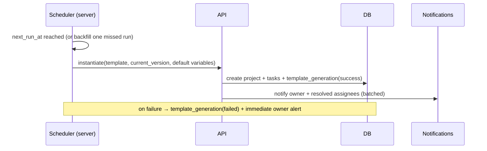

# 24 · Templates Library & Recurring Workflows

> Follows the [Master PRD Template](./00-prd-template.md). Numil templates capture repeatable
> work as reusable **blueprints** — task, checklist, and full project templates — with
> **variables**, a browsable **gallery**, and scheduled **recurring project generation**.
> Think ClickUp/Asana templates + Process Street checklists, but calm and native. Templates
> power [06 · Onboarding](./06-onboarding.md) starter content and can be *created by*
> [20 · Automation & Workflow Rules](./20-automation-workflow-rules.md).

---

## 1. Purpose

Most teams redo the same work shapes over and over: an employee onboarding, a client kickoff,
a sprint ceremony, a content release. Templates let anyone **capture a proven structure once
and instantiate it in seconds**, with the right owners, dates, and details filled in.

**User problem it solves.** Recreating a 30-step launch checklist by hand is slow and
error-prone; people forget steps. Rigid template tools force upfront configuration. Numil lets
you turn *any existing task or project into a template in one tap*, add optional variables, and
reuse it — while keeping the simple path unchanged for people who never touch templates.

**User goals**
- "Save this project as a template" and reuse it next time.
- Browse a **gallery** of org + built-in templates and start from one.
- Fill a few **variables** (client name, start date) and get a fully populated project.
- **Automatically generate** a recurring project (e.g., "Monthly close" on the 1st).

**Business goals**
- Accelerate activation ([06 · Onboarding](./06-onboarding.md) uses templates as starters).
- Increase project creation and standardization across the org.
- Enable a shareable **blueprint marketplace** (org-internal now, public later) as a growth loop.

**KPIs:** templates created, `% projects started from a template`, gallery opens → instantiate
rate, recurring-generation success rate, time-to-first-project (onboarding).

**Status:** task/checklist/project templates + gallery + instantiate ✅ v1 · variables +
recurring project generation 🔜 v1.1 · org blueprint sharing + versioning 🟣 v2 · public
marketplace + AI template generation 💡/🧪.

---

## 2. Navigation

**Entry points**
- **Gallery:** Sidebar → "Templates" (or "+ New" → "From template").
- **Save as template:** from any project/task/checklist `⋯` menu → "Save as template".
- **Onboarding** ([06](./06-onboarding.md)) → "Start with a template" during workspace setup.
- **Automation** ([20](./20-automation-workflow-rules.md)) → an action "Create project/task
  from template" can instantiate blueprints on triggers.
- Deep links: `numil://templates`, `numil://template/{id}`, `numil://template/{id}/use`.

**Routes** (`src/app/...`): `templates/index.tsx` (gallery), `templates/[id].tsx` (preview),
`templates/[id]/use.tsx` (variable fill + instantiate sheet), `templates/manage.tsx` (org
admin), `templates/recurring.tsx` (recurring blueprint schedules). The **use** flow is a
large bottom sheet; gallery preview is a **push**.

**Hierarchy / breadcrumbs**
```text
Workspace ▸ Templates ▸ Client Onboarding ▸ Use
```

**Transitions:** gallery cards animate in on scroll; preview → use sheet `spring.gentle`;
instantiate success → the new project heroes into the sidebar (`motion.slow`).

---

## 3. Complete UI Layout

```text
┌───────────────────────────────────────────────┐
│  Templates                     ⌕      [ + New ]│  ← large title, search, create
├───────────────────────────────────────────────┤
│  [ All ] [ Projects ] [ Tasks ] [ Checklists ] │  ← type segmented
│  Categories:  Onboarding · Marketing · Eng · …  │  ← category chips (scroll)
├───────────────────────────────────────────────┤
│  ┌──────────────┐  ┌──────────────┐            │
│  │ 🚀 Client     │  │ 🧾 Monthly    │  ← template cards (grid)
│  │  Kickoff      │  │  Close        │            │
│  │ Project · 24  │  │ Project · 12  │            │
│  │ steps · ▶ Use │  │ steps · 🔁    │  (🔁 = recurring)
│  └──────────────┘  └──────────────┘            │
│  ┌──────────────┐  ┌──────────────┐            │
│  │ ✅ Bug triage │  │ 📋 Content    │            │
│  │  checklist    │  │  release      │            │
│  └──────────────┘  └──────────────┘            │
├───────────────────────────────────────────────┤
│  Preview: Client Kickoff                        │
│  Variables:  Client ▸ [        ]  Start ▸ [📅]  │  ← variable fill
│  Structure:  ▸ Discovery  ▸ Setup  ▸ Launch …   │  ← collapsible tree
│  [ Use template ]                               │  ← single primary action
└───────────────────────────────────────────────┘
```

- **Top:** large title "Templates", search, `+ New` (create a template from scratch or from an
  existing project/task). Dynamic Island + top safe area respected; large title collapses.
- **Filters:** type segmented (All/Projects/Tasks/Checklists) + horizontally scrollable
  **category** chips; a "Built-in" vs "My org" toggle.
- **Gallery grid:** `TemplateCard`s (icon, name, type, step count, `🔁` recurring badge,
  usage count). Tap → preview.
- **Preview / use:** structure tree (sections, tasks, subtasks, checklist items) collapsible;
  **variable fields** at the top; a single **Use template** primary action; `⋯` (duplicate,
  edit, share, version history, delete).
- **Empty space:** an org with no templates shows built-in starters + "Turn a project into a
  template" hint.
- **iPad / landscape:** two-pane — gallery list left, live **preview + variable form** right;
  editing a template shows a structure editor with an inspector.
- **Tab bar:** visible on gallery; hidden in full editor immersion.

**Recurring generation sequence** (server-side; runs even with no client online):



---

## 4. Complete Component Breakdown

| Area | Components |
|------|-----------|
| Header | `GlassNavBar`, large title, `SearchField`, `NewTemplateButton`, `⋯` menu |
| Filters | `TypeSegmentedControl`, `CategoryChipRow`, `SourceToggle` (built-in/org) |
| Gallery | `TemplateGrid` (FlashList), `TemplateCard`, `RecurringBadge`, `UsageBadge`, `IconEmoji` |
| Preview | `TemplatePreview`, `StructureTree`, `TreeNodeRow`, `StepCountBadge`, `UseButton` |
| Variables | `VariableForm`, `VariableField` (text/date/select/person/number), `RelativeDatePicker` |
| Editor | `TemplateEditor`, `SectionRow`, `TaskTemplateRow`, `ChecklistItemRow`, `VariableDefEditor`, `PlaceholderChip` |
| Recurring | `RecurringScheduleSheet`, `RecurrenceEditor` (shared w/ tasks), `NextRunCard`, `GenerationLog` |
| Sharing | `ShareBlueprintSheet`, `VisibilityPicker`, `VersionHistoryList` |
| Feedback | `Skeleton`, `Toast` (undo), `Banner` (generation failed/offline), `ConfirmDialog` |
| AI | `AIButton` ("Generate a template for…"), `AISuggestionCard` |

Primitives from [03 · Design System](./03-design-system-ui.md); `RecurrenceEditor` is the same
component used for recurring tasks in [10 · Task Detail](./10-task-detail.md).

---

## 5. Modern Features

Each: **Purpose · Workflow · UI · Permissions · Offline · API · DB · Notify · AC.**

**Role permission matrix** (module actions; per-feature deltas noted inline; canonical model
in [shared/rbac-permissions.md](./shared/rbac-permissions.md)):

| Action | Owner | Admin | Manager | Member | Guest |
|--------|:-----:|:-----:|:-------:|:------:|:-----:|
| Browse gallery / instantiate | ✅ | ✅ | ✅ | ✅ | shared |
| Save / create template | ✅ | ✅ | ✅ | ⚙️ | ❌ |
| Edit own / team template | ✅ | ✅ | author/lead | ❌ | ❌ |
| Configure recurring generation | ✅ | ✅ | author/lead | ❌ | ❌ |
| Publish org/public + version | ✅ | ✅ | request | ❌ | ❌ |
| Curate / deprecate official library | ✅ | ✅ | ❌ | ❌ | ❌ |
| Import / export blueprint | ✅ | ✅ | ✅ | ❌ | ❌ |

`⚙️` gated by org setting "Members can create templates"; guests only see explicitly shared
templates and instantiate into shared scope.

### 5.1 Save anything as a template ✅ (ClickUp/Asana)
- **Purpose:** capture a proven structure with zero setup.
- **Workflow:** `⋯` on a project/task/checklist → "Save as template" → pick what to include
  (subtasks, descriptions, assignees→roles, dates→relative offsets, labels, custom fields) →
  name + category → saved to the org gallery.
- **UI:** `SaveAsTemplateSheet` with include toggles; assignees convert to **role
  placeholders** by default (privacy-safe).
- **Permissions:** Manager+ or the resource's Lead; Members if org allows.
- **Offline:** create offline; queued.
- **API:** `POST /templates` (with `sourceType`, `sourceId`).
- **DB:** `templates` + `template_nodes` snapshot.
- **Notify:** none (template creation is quiet).
- **AC:** absolute dates convert to relative offsets; assignees convert to roles unless the
  author opts to keep specific people; source is never mutated.

### 5.2 Template gallery & categories ✅
- **Purpose:** discover and reuse quickly.
- **Workflow:** browse by type/category, search, preview structure, see usage count; "Use".
- **UI:** `TemplateGrid`, `TemplateCard`, `TemplatePreview`, built-in vs org toggle.
- **Permissions:** everyone sees org + built-in templates within their access; guests see only
  shared ones.
- **Offline:** gallery cached; instantiate offline where structure is fully local.
- **API:** `GET /templates?filter[type]=&filter[category]=&q=`.
- **DB:** `templates(category, usage_count, visibility)`.
- **Notify:** none.
- **AC:** search matches name/category/tag; usage count increments on instantiate; built-in
  templates are read-only.

### 5.3 Variables & placeholders 🔜 (mail-merge for work)
- **Purpose:** parametrize a template so one blueprint serves many cases.
- **Workflow:** author defines variables (`{{client}}`, `{{startDate}}`, `{{owner}}`) with
  types/defaults; placeholders embed in titles/descriptions/dates. On **Use**, a `VariableForm`
  collects values; instantiation substitutes them; **relative dates** resolve from a chosen
  anchor (e.g., "Launch = start + 14d").
- **UI:** `VariableDefEditor`, `PlaceholderChip` (autocomplete `{{`), `VariableForm`,
  `RelativeDatePicker`.
- **Permissions:** author (Manager+) defines; anyone using fills.
- **Offline:** fill + instantiate offline (client-side substitution) for local structures.
- **API:** `POST /templates/:id/instantiate` (`variables{}`, `anchorDate`, `targetProjectId?`).
- **DB:** `template_variables(id, template_id, key, type, default, required)`.
- **Notify:** instantiation notifies assigned roles' resolved people.
- **AC:** required variables block instantiation until filled; unresolved placeholders never
  appear in the created work; relative dates resolve tz/DST-safe.

### 5.4 Recurring project generation 🔜 (Process Street schedules)
- **Purpose:** auto-create a fresh project/checklist on a schedule (monthly close, weekly
  report, quarterly review).
- **Workflow:** attach a **recurrence** to a template (RRULE-style: daily/weekly/monthly by
  date or nth-weekday/quarterly/custom) + an owner + default variable values → the scheduler
  generates a new instance each period, optionally with a lead time ("create 2 days before").
- **UI:** `RecurringScheduleSheet`, `RecurrenceEditor`, `NextRunCard`, `GenerationLog`.
- **Permissions:** Manager+ / Lead configures recurring blueprints.
- **Offline:** viewing schedules offline; generation is **server-side** (runs even if no client
  is online).
- **API:** `POST /templates/:id/recurrence`, `GET /templates/:id/generations`.
- **DB:** `template_recurrences`, `template_generations` (audit of each run).
- **Notify:** "Monthly Close created" to the owner + assignees; failure alerts the owner.
- **AC:** each period generates exactly one instance; a missed run (server down) backfills once
  on recovery; disabling stops future runs without deleting past instances.

### 5.5 Checklist / SOP templates ✅ (Process Street)
- **Purpose:** repeatable standard-operating-procedure checklists inside a task/project.
- **Workflow:** define ordered checklist items (optional required-to-complete, per-item
  assignee/role, links); applying it adds the checklist to a task or as a project section.
- **UI:** `ChecklistItemRow`, `StructureTree`, progress ring on apply.
- **Permissions:** Contributor+ applies; author Manager+.
- **Offline:** full.
- **API:** `POST /tasks/:id/apply-checklist-template`.
- **DB:** `template_nodes(kind='checklist_item')`.
- **Notify:** none (assignment notifies on resolve).
- **AC:** item order preserved; required items gate task completion per policy; applying twice
  is idempotent per `opId`.

### 5.6 Template editing & structure tree ✅
- **Purpose:** refine a blueprint over time.
- **Workflow:** edit sections/tasks/subtasks/checklist items, reorder (drag), edit descriptions
  and default fields, manage variables; save creates a **new version** (see 5.7).
- **UI:** `TemplateEditor`, `StructureTree`, drag reorder, inspector on iPad.
- **Permissions:** Manager+ / author.
- **Offline:** edit offline; queued.
- **API:** `PATCH /templates/:id`, `PUT /templates/:id/nodes`.
- **DB:** `template_nodes` (tree via `parent_id` + `order`).
- **Notify:** none.
- **AC:** reorder persists; editing a template never alters already-instantiated projects.

### 5.7 Blueprint sharing & versioning 🟣
- **Purpose:** share proven blueprints across the org (and later, publicly) with safe updates.
- **Workflow:** set visibility (private / team / org / public 💡); publish a **version**;
  consumers can "update to latest" for future instantiations; export/import blueprint as a
  portable file (JSON).
- **UI:** `ShareBlueprintSheet`, `VisibilityPicker`, `VersionHistoryList`.
- **Permissions:** Admin approves org-wide/public publishing; author manages private/team.
- **Offline:** view offline; publish requires connectivity.
- **API:** `POST /templates/:id/versions`, `PUT /templates/:id/visibility`,
  `POST /templates/import`, `GET /templates/:id/export`.
- **DB:** `template_versions`, `templates.visibility`, `templates.current_version`.
- **Notify:** "New version of {template}" to subscribers (opt-in).
- **AC:** versions are immutable; instantiation records which version it used; visibility
  changes are audited ([29](./29-activity-feed-audit-logs.md)).

---

## 6. Smart AI Features

Powered by [19 · AI Assistant & Copilot](./19-ai-assistant-copilot.md); proposal-first
(Accept/Edit/Undo), logged as `ai_invoked`, permission-scoped.

| Capability (`capability` id) | What it does |
|------------------------------|--------------|
| `template_generate` | "Create a template for onboarding a designer" → proposes a structured blueprint with sections, tasks, and variables. |
| `template_from_history` | Detects that a team keeps recreating the same shape and suggests saving it as a template. |
| `variable_suggest` | Scans a draft template and proposes variables from repeated literals (names, dates). |
| `template_recommend` | Recommends a gallery template when a user starts a new project ("This looks like a launch — use Launch Plan?"). |
| `checklist_expand` | Turns a one-line SOP goal into an ordered checklist proposal. |

Nothing is created until accepted; generated templates land in the gallery as drafts for review.
Respects org AI governance + credit quotas.

---

## 7. Productivity Features

- **One-tap "New from template"** in the global `+` and Quick Add.
- **Favorites & recents** — pin frequently used templates to the top of the gallery.
- **Smart defaults** — assignees resolve by role/round-robin so a blueprint distributes work
  without manual reassignment.
- **Relative scheduling** — everything anchors to a start date so instantiation lays out a full
  timeline instantly (feeds [11 · Calendar](./11-calendar-scheduling.md)).
- **Onboarding starters** — [06 · Onboarding](./06-onboarding.md) offers curated templates so a
  brand-new workspace is productive in minutes.

---

## 8. Enterprise Features

- **Org blueprint library** — curated, categorized, governed templates; Admins can **pin
  official** and deprecate stale ones.
- **Governance & approval** — org-wide/public publishing requires Admin approval; locked
  official templates can't be edited by Members.
- **Versioning & change control** — immutable versions, changelog, "update to latest" opt-in;
  every publish/visibility change audited ([29](./29-activity-feed-audit-logs.md)).
- **Automation integration** — [20 · Automation](./20-automation-workflow-rules.md) actions can
  instantiate templates on triggers (e.g., "deal won → create Client Onboarding project").
- **Import/export** — portable blueprint files for backup/migration ([37](./37-backup-import-export.md))
  and cross-org sharing.
- **Compliance** — retention on templates + generation logs; legal hold blocks purge of
  audited generation history.

---

## 9. Collaboration Features

- **Co-authoring** — multiple editors on a template with presence; changes broadcast live.
- **Comments on template nodes** 🔜 — discuss a step; resolves before publishing a version.
- **Shared team libraries** — a team space of blueprints with @mention on publish.
- **Attribution** — templates show author + contributors; usage leaderboard encourages sharing.
- **Recurring ownership handoff** — reassign a recurring blueprint's owner when someone leaves,
  without breaking the schedule.

---

## 10. Offline Architecture

Deltas over [shared/offline-sync-engine.md](./shared/offline-sync-engine.md):
- Templates and their node trees are **cached locally**; creating/editing a template and
  instantiating a **fully local** structure work offline (optimistic), queued as ops.
- **Recurring generation is server-side** and does not depend on any client being online — the
  scheduler is the source of truth; clients merely display schedules and generation logs.
- **Publishing / visibility changes / imports** require connectivity (shared-state /
  cross-org) and queue with a clear "will publish when online" chip.
- Node ordering uses **fractional indexing** so concurrent edits to a template tree converge.
- Instantiation is **idempotent per `opId`** so a retried "Use template" never creates two
  projects.

---

## 11. Security

Deltas over [shared/security-baseline.md](./shared/security-baseline.md):
- Templates strip **specific people** to role placeholders by default so a blueprint never leaks
  membership of the source project; keeping named assignees is an explicit, permission-checked
  opt-in.
- **Public/org publishing** is Admin-gated and audited; imported blueprints are sanitized
  (rich text/URLs) exactly like task content before rendering.
- Instantiation re-checks that the caller may create in the **target project/workspace**; role
  resolution never assigns to someone the caller can't see.
- Version, visibility, and generation events are written to the immutable audit log
  ([29 · Activity Feed & Audit Logs](./29-activity-feed-audit-logs.md)).

---

## 12. Notification System

Deltas over [12 · Notifications & Alerts](./12-notifications-alerts.md):
- **New types:** `template_instance_created` (recurring or automation-triggered → owner +
  resolved assignees), `template_generation_failed` (→ owner, immediate), `template_version_published`
  (→ subscribers, opt-in).
- Recurring "created" notifications are **batched** to avoid noise when many projects generate
  at once; failures are never batched.
- Notification actions on `template_instance_created`: **Open project**, **Snooze**.

---

## 13. Accessibility

Deltas over [shared/accessibility-spec.md](./shared/accessibility-spec.md):
- The `StructureTree` is a proper accessibility tree: nodes expose level, expanded/collapsed
  state, and "Expand / Collapse" actions; reading order matches visual order.
- `VariableField`s announce label, type, required state, and value ("Client, text field,
  required, empty").
- `PlaceholderChip`s read as "Variable: client name"; recurrence summaries read as full text
  ("Repeats monthly on the first, next run August 1").
- Template cards expose "Use template" and "Preview" as labeled actions for Switch Control.

---

## 14. Animations

Deltas over [shared/animation-spec.md](./shared/animation-spec.md):
- Gallery cards fade/scale in on scroll (`motion.fast`); preview → use sheet `spring.gentle`.
- Instantiation success: the structure tree "collapses" into a new project card that heroes to
  the sidebar (`motion.slow`), with a `notificationSuccess` haptic.
- Tree node expand/collapse uses height + fade `motion.base`; drag reorder lifts with shadow.
- Recurring badge `🔁` has a subtle one-time spin on schedule save (skipped under Reduce Motion).

---

## 15. Performance

- Gallery is virtualized (FlashList grid); template icons via `expo-image` with placeholders.
- Structure trees lazy-expand: only visible nodes render; large blueprints (200+ nodes) stay
  smooth.
- Instantiation of big projects is chunked server-side and reported via a Live Activity for
  long generations; the client shows optimistic skeletons.
- Recurring generation runs on a server scheduler (`BGTaskScheduler` is only for local prep),
  batched and rate-limited so a burst of monthly jobs doesn't spike load.
- Template reads cached aggressively (rarely change); versions fetched on demand.

---

## 16. Database Design

```text
templates(id, org_id, type enum(project|task|checklist), name, category, icon,
          description, visibility enum(private|team|org|public), owner_id→users,
          current_version int, usage_count int, is_builtin bool, source_type?, source_id?,
          created_at, updated_at, deleted_at?)
template_nodes(id, template_id→templates, parent_id?→template_nodes, kind
               enum(section|task|subtask|checklist_item), title, description_json?,
               role_placeholder?, assignee_id?, relative_offset_days?, anchor
               enum(start|prev_end)?, labels[], estimate_points?, order float)
template_variables(id, template_id→templates, key, type
                   enum(text|number|date|select|person|url), default_json?, required bool,
                   options_json?)
template_versions(id, template_id→templates, version int, snapshot_json, author_id→users,
                  changelog, created_at)                                   -- immutable
template_recurrences(id, template_id→templates, rrule, anchor_variable, owner_id→users,
                     default_variables_json, lead_time_days, target_workspace_id, enabled bool,
                     next_run_at, created_at)
template_generations(id, template_id→templates, recurrence_id?→template_recurrences,
                     created_project_id?→projects, source enum(recurring|automation|manual),
                     variables_json, version_used int, status enum(success|failed),
                     error?, created_at)                                   -- append-only
```

**Indexes:** `templates(org_id, type, category)`, `templates(org_id, visibility)`,
full-text on `templates(name, description)`, `template_nodes(template_id, parent_id, order)`,
`template_recurrences(enabled, next_run_at)` (scheduler poll), `template_generations(template_id, created_at)`.
**Constraints:** built-in templates read-only; `relative_offset_days` requires an anchor;
required variables must resolve before instantiation; visibility escalation to org/public
requires Admin. **Soft delete** via `deleted_at`; `template_versions` and `template_generations`
append-only. Aligns with [17 · Data Model](./17-data-model-api.md); instantiation writes normal
`projects`/`tasks` (module 09/10) so downstream features work unchanged.

---

## 17. API Design

Follows [shared/api-conventions.md](./shared/api-conventions.md).

| Method | Path | Purpose |
|--------|------|---------|
| GET | `/templates?filter[type]=&filter[category]=&q=&cursor=` | Browse/search gallery |
| POST | `/templates` | Create (from scratch or `sourceType`/`sourceId`) |
| GET | `/templates/:id?expand=nodes,variables` | Preview structure |
| PATCH | `/templates/:id` (If-Match) · `PUT /templates/:id/nodes` | Edit template/tree |
| POST | `/templates/:id/instantiate` | Create real project/task from template |
| POST | `/tasks/:id/apply-checklist-template` | Apply a checklist template to a task |
| POST | `/templates/:id/recurrence` · `PATCH`/`DELETE` | Manage recurring generation |
| GET | `/templates/:id/generations?cursor=` | Generation history/log |
| POST | `/templates/:id/versions` · `GET /templates/:id/versions` | Publish/list versions |
| PUT | `/templates/:id/visibility` | Sharing scope (Admin for org/public) |
| POST | `/templates/import` · `GET /templates/:id/export` | Portable blueprint file |

**Realtime:** channel `org:{id}` → `template.created`, `template.version_published`,
`template.instance_created`; `template:{id}` presence for co-authoring. **Errors:**
`409 conflict` (version), `403 forbidden` (visibility/publish/target scope),
`422 validation_failed` (missing required variable, invalid anchor). **Idempotency-Key** on all
mutations; `instantiate` is idempotent per `opId`.

**Sample — instantiate with variables**
```http
POST /v1/templates/tpl_kickoff/instantiate
Idempotency-Key: 3c8e…
{ "variables": { "client": "Acme", "startDate": "2026-08-01" },
  "anchorDate": "2026-08-01", "targetWorkspaceId": "ws_1" }
```
```json
{ "data": { "projectId": "prj_902", "name": "Acme — Client Kickoff",
  "taskCount": 24, "versionUsed": 3, "generationId": "gen_55" },
  "meta": { "requestId": "req_a9…" } }
```

---

## 18. Edge Cases

- **Missing required variable:** instantiation `422`; the form highlights the field.
- **Unresolved placeholder:** `{{unknown}}` left in text is blocked before creation; author
  warned in the editor.
- **Relative date across DST/tz:** offsets computed in the target user/org tz; a "start + 14d"
  lands on the correct local wall-clock day.
- **Role placeholder with no matching member:** the created task is left **unassigned** (never
  invents a person) with a notice to the owner.
- **Recurring run while server was down:** the scheduler **backfills one** missed instance on
  recovery, not every skipped period, and logs it.
- **Recurring owner deactivated:** generation continues but flags "no owner" and notifies an
  Admin to reassign.
- **Template edited after instances exist:** existing projects are untouched; only future
  instantiations use the new version.
- **Instantiating into an archived/deleted target:** rejected `409 gone`; suggest choosing a
  new destination.
- **Huge template offline:** structure caches; instantiation queues and shows a "will create
  when online" state (no partial project).
- **Built-in template edit attempt:** blocked; offer "Duplicate to edit".
- **Import of a malformed/oversized blueprint:** validated + sanitized; rejected with a clear
  reason; never partially imported.
- **Duplicate "Use" taps:** deduped by `opId`, exactly one project created.

---

## 19. User States

- **First-time:** onboarding offers curated starter templates; empty gallery shows built-ins +
  "Turn a project into a template".
- **Returning / power:** favorites/recents, keyboard-driven editor on iPad, variables + recurring.
- **Guest:** sees only templates explicitly shared; can instantiate into shared scope only.
- **Member:** browse + instantiate; create if org allows.
- **Manager/Lead:** create/edit templates, configure recurring blueprints, team libraries.
- **Admin/Owner:** curate org library, approve org/public publishing, deprecate, audit, import.
- **Offline / poor network:** browse cached, edit/instantiate local structures; publishing and
  recurring config queue clearly.
- **Tablet / landscape:** two-pane gallery + live preview/variable form; structure editor with
  inspector.
- **Dark mode / large text / a11y:** tokens + Dynamic Type; accessible tree + variable form.

---

## 20. Analytics Events

Schema per [shared/analytics-taxonomy.md](./shared/analytics-taxonomy.md); no template content
(titles/descriptions) in properties.

| event | key properties |
|-------|----------------|
| `template_created` | `type` (project/task/checklist), `from_source` (scratch/project/task) |
| `template_previewed` | `type`, `is_builtin` |
| `template_instantiated` | `type`, `via` (manual/recurring/automation/onboarding), `variables_count`, `node_count_bucket` |
| `template_variable_defined` | `var_type` |
| `recurrence_configured` | `freq`, `lead_time_days` |
| `template_generated` | `source` (recurring/automation), `status` (success/failed) |
| `template_version_published` | `visibility` |
| `template_visibility_changed` | `to` (private/team/org/public) |
| `template_shared` | `target` (link/org/public) |
| `template_imported` / `template_exported` | `node_count_bucket` |
| `ai_invoked` | `capability` (template_generate/variable_suggest/…), `accepted` |

---

## 21. Acceptance Criteria

1. Any project/task/checklist can be saved as a template in one tap.
2. Saving converts absolute dates to relative offsets and assignees to role placeholders by default.
3. Saving as a template never mutates the source resource.
4. The gallery filters by type and category and searches by name/category/tag.
5. Built-in templates are read-only and offer "Duplicate to edit".
6. Usage count increments on each successful instantiation.
7. Variables support text/number/date/select/person/url with defaults and required flags.
8. Required variables block instantiation until filled.
9. Unresolved `{{placeholders}}` never appear in created work.
10. Relative dates resolve tz/DST-safe from the chosen anchor.
11. Role placeholders resolve to real people; unmatched roles create unassigned tasks with a notice.
12. Instantiating a template creates normal projects/tasks usable by all downstream features.
13. A recurring blueprint generates exactly one instance per period.
14. A missed recurring run (server down) backfills once on recovery and is logged.
15. Disabling a recurrence stops future runs without deleting past instances.
16. Recurring generation runs server-side, independent of any client being online.
17. Generation failures notify the owner immediately (never batched).
18. Editing a template creates a new immutable version; existing instances are untouched.
19. Instantiation records which template version it used.
20. Org/public publishing requires Admin approval and is audited.
21. Visibility changes are recorded in the immutable audit log.
22. Blueprint import is validated + sanitized and never partially imports on error.
23. Export produces a portable file that re-imports to an equivalent template.
24. Checklist templates preserve item order and gate completion for required items per policy.
25. Applying a checklist template twice is idempotent (no duplicates).
26. Automation actions can instantiate templates on triggers (module 20).
27. Onboarding can start a workspace from a curated template.
28. Co-authoring shows presence and broadcasts template edits live.
29. Instantiation re-checks create permission on the target workspace/project.
30. Retried "Use template" never creates duplicate projects (idempotency).
31. Templates and local instantiation work offline; publish/recurring config queue clearly.
32. Structure tree is fully navigable via VoiceOver/Switch Control (expand/collapse actions).
33. Variable fields announce label, type, and required state.
34. Reduce Motion disables instantiation hero and recurring-badge spin; success still shown.
35. iPad landscape shows gallery + live preview/variable form.
36. Analytics events fire with correct properties (offline-buffered), no template content.

---

## 22. Future Roadmap

- **V1 (✅):** save-as-template (project/task/checklist), gallery + categories + search,
  structure editor, instantiate, checklist/SOP templates, built-in starters for onboarding.
- **V1.1 (🔜):** variables + relative dates, recurring project generation + generation log,
  favorites/recents, node comments, AI checklist expand.
- **V2 (🟣):** blueprint sharing (team/org) + immutable versioning + "update to latest",
  import/export, automation-triggered instantiation, co-authoring.
- **Future (💡):** public template marketplace, community ratings, cross-org blueprint packs,
  template analytics (which steps get skipped).
- **Experimental (🧪):** AI generates a full parametrized template from a one-line goal and
  proposes an optimal recurrence.
- **AI track:** detect repeated work shapes and proactively suggest templating them.
- **Enterprise track:** governed official library, deprecation workflow, blueprint approval
  chains, per-region template residency.
