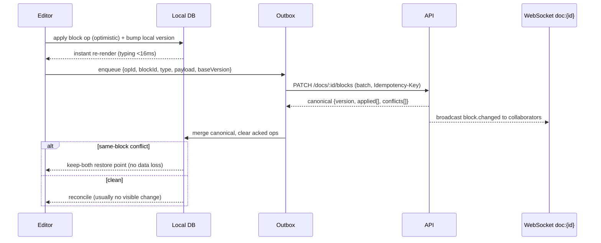

# 25 · Documents & Knowledge Base

> Follows the [Master PRD Template](./00-prd-template.md). Documents & Knowledge Base is
> Numil's Notion-class writing surface: block-based docs, wikis/spaces, doc↔task linking,
> templates, versioning, and AI Q&A. The north star applies hard here — **a mobile doc must
> feel as light as a note, yet scale to a company wiki.**

---

## 1. Purpose

Documents & Knowledge Base (KB) is where teams write, not just track. It is the durable,
searchable memory of an organization — specs, meeting notes, runbooks, decisions, PRDs,
onboarding guides — living next to the tasks they drive. It competes with **Notion,
Confluence, ClickUp Docs, Slite, and Coda** while staying mobile-first and calm.

**User problem it solves.** Knowledge is scattered across Slack threads, PDFs, and people's
heads. Heavy wikis (Confluence) are intimidating walls of chrome; light note apps lose
structure at scale. Numil docs must open in one tap, let you start typing instantly (like
Apple Notes), yet grow into a governed wiki with permissions, versioning, and links to the
work — *without* the desktop-tool clutter on a phone.

**User goals**
- Start a doc in <3s and write with the thumb (block editor, slash menu, markdown).
- Organize docs into spaces/wikis with nesting, without a filing-cabinet chore.
- Link docs to tasks/projects so decisions and specs stay attached to the work.
- Find any answer fast — search, backlinks, and **AI "Ask this space"**.
- Read and edit **offline**; never lose a paragraph.

**Business goals**
- Increase stickiness and seats-per-org (docs pull in readers who become editors).
- Anchor premium features (AI Q&A over KB, unlimited version history, advanced permissions).
- Provide the audit/versioning enterprises require for policy/runbook content.

**KPIs:** `doc_created`, weekly active editors/readers, docs-with-task-links %, `doc_search`
success (result-click rate), AI `doc_qa` acceptance, time-to-first-doc, restore-from-history
rate (a data-loss safety signal), wiki adoption (spaces with ≥5 docs).

**Status:** core block editor, spaces, linking, templates, versioning, offline ✅ v1;
real-time co-editing (CRDT) 🟣 v2; public share links 🔜 v1.1.

---

## 2. Navigation

**Entry points**
- **Docs** section in the [sidebar](./04-navigation-sidebar.md) → Spaces list.
- "＋ New" global action → **Doc** option (alongside Task/Project).
- From a task/project: **Linked docs** section → open or "＋ New linked doc".
- Home dashboard "Recent docs" and "Pinned" widgets.
- Search result → doc (deep link).
- Deep links: `numil://doc/{docId}`, `numil://space/{spaceId}`, `numil://doc/{docId}#block-{blockId}` (jump to block).

**Route:** `src/app/docs/index.tsx` (spaces/browse), `src/app/space/[id].tsx` (space tree),
`src/app/doc/[id].tsx` (editor/reader). The editor is a **push** for deep links/standalone,
and a **sheet** (medium→large) when quick-previewing from a task's Linked-docs list.

**Navigation hierarchy & breadcrumbs**
```text
Workspace ▸ Space (e.g., "Engineering Wiki") ▸ Parent doc ▸ [Doc title]
```
Breadcrumb chips are tappable; long paths collapse to `Space ▸ … ▸ Doc` with a tap-to-expand
popover. The current doc's nested children appear in a bottom "Sub-pages" list.

**Transitions**
- Row → editor: shared-element hero on the doc icon + title (`motion.slow`).
- Space tree expand/collapse: `spring.gentle` disclosure.
- Block-jump deep link: scroll-to + brief highlight pulse on the target block.

**Modal vs push**
- **Push** for full editing (own back stack + breadcrumb, immersive; tab bar hidden).
- **Sheet** for quick preview/insert (from task linking, mentions, or search peek).

---

## 3. Complete UI Layout

The editor is deliberately chrome-light: title, body, and a single floating toolbar. Power
(properties, history, permissions) hides behind the `•••` menu and the block handle.

```text
┌───────────────────────────────────────────────┐
│  ‹ Eng Wiki ▸        Launch Runbook     •••  ⋯ │  ← glass nav, Dynamic Island safe
├───────────────────────────────────────────────┤
│  🚀  Launch Runbook                             │  ← doc icon (emoji) + title (inline)
│  👤 Priya · Updated 2h · 🔒 Team · 🔗 3 tasks   │  ← meta rail (author/updated/access/links)
├───────────────────────────────────────────────┤
│  ▤  Overview                                    │  ← H2 block
│  We ship on Friday. This runbook covers…        │  ← paragraph block
│  ▸ ◻ Freeze main branch                          │  ← to-do block
│  ▸ ◻ Cut release candidate                       │
│  ┌───────────────────────────────────────────┐ │
│  │ ⚠️  Callout: rollback within 15 min if…     │ │  ← callout block
│  └───────────────────────────────────────────┘ │
│  🔗 Task: "Draft launch email"  ◷ In Progress   │  ← task-embed block (live status)
│  ▸ ⌘ /table  ▸ 🖼 image  ▸ 📄 sub-page …          │
├───────────────────────────────────────────────┤
│  Sub-pages ▸  ◦ Comms plan  ◦ On-call rota      │  ← nested pages
├───────────────────────────────────────────────┤
│  💬 2 comments · 🔖 pinned decision              │
├───────────────────────────────────────────────┤
│ [ ＋ ] [ /  ] [ 🖼 ] [ @ ] [ ✨AI ]   Aa  ⌨︎ dismiss│  ← floating block toolbar + AI
└───────────────────────────────────────────────┘
```

- **Top:** glass nav bar, tappable space breadcrumb, `•••` overflow (share, move,
  duplicate, template, history, permissions, export, delete). Respects Dynamic Island + top
  safe area; large-title collapses to inline on scroll.
- **Header block:** emoji/icon picker + optional cover image; big inline title; a compact
  **meta rail** (author, last-updated relative time, access badge, linked-task count). Empty
  docs show only title + a blinking cursor — nothing else.
- **Body:** vertically scrolling **block list**. Each block has a left **⋮⋮ handle**
  (tap = block menu, drag = reorder). Slash `/` opens the block inserter. Selection shows an
  inline format bar (bold/italic/link/code/highlight/comment).
- **Bottom:** a **floating block toolbar** (add block, slash, image, mention, ✨AI) that sits
  above the keyboard + home-indicator safe area. When keyboard is up, the toolbar docks to
  the keyboard accessory.
- **Empty space:** generous. Sub-pages, comments, and properties collapse to single chips
  until used — the simple doc stays a single column of text.
- **Reader mode:** viewers (or anyone toggling `Aa → Read`) get a distraction-free, larger-
  type rendering with no handles; tap-and-hold still allows comment/AI.
- **Landscape / iPad:** two-pane — **space tree/outline** on the left, editor on the right;
  a third **inspector** (properties/history/comments) slides in from the right. External
  keyboard shortcuts (⌘B/⌘I, ⌘K link, ⌘/ slash) enabled. Apple Pencil can scribble into text
  fields (Scribble) and annotate images.
- **Tab bar:** hidden in the editor for immersion; returns on pop.

---

## 4. Complete Component Breakdown

| Area | Components |
|------|-----------|
| Nav bar | `GlassNavBar`, back button, `BreadcrumbChip`, `•••` `ContextMenu` (popover) |
| Header | `DocIconPicker` (emoji/upload), `CoverImagePicker`, `TitleInlineEditor`, `DocMetaRail` (author avatar, `RelativeTime`, `AccessBadge`, `LinkedCountChip`) |
| Editor core | `BlockEditor`, `BlockRenderer`, `BlockHandle` (⋮⋮ drag+menu), `SlashMenu`, `InlineFormatBar`, `SelectionToolbar`, `MarkdownShortcuts`, `PlaceholderHint` |
| Block types | `ParagraphBlock`, `HeadingBlock` (H1–H3), `TodoBlock`, `BulletBlock`, `NumberedBlock`, `ToggleBlock`, `QuoteBlock`, `CalloutBlock`, `CodeBlock` (syntax), `DividerBlock`, `TableBlock`, `ImageBlock`, `VideoBlock`, `FileBlock`, `BookmarkBlock` (link unfurl), `TaskEmbedBlock`, `SubPageBlock`, `MentionInline` (user/doc/task), `EmojiInline`, `MathBlock` 🔜, `ColumnsBlock` 🟣 |
| Space/wiki | `SpaceTree`, `SpaceHeader`, `DocTreeRow` (expand chevron, drag), `NewDocButton`, `SpaceSwitcher`, `PinnedDocsRail`, `BacklinksPanel` |
| Collaboration | `PresenceAvatars`, `LiveCursor` (🟣), `CommentThread`, `CommentAnchor` (block-level), `ReactionBar`, `MentionAutocomplete`, `DecisionPin` |
| History | `VersionHistorySheet`, `VersionTimeline`, `DiffViewer` (added/removed), `RestoreButton`, `SnapshotBadge` |
| Sharing | `ShareSheet`, `PermissionRow`, `RoleSelect`, `PublicLinkToggle` (🔜), `ExportSheet` (PDF/Markdown) |
| Templates | `TemplateGallery`, `TemplateCard`, `SaveAsTemplateButton`, `TemplatePickerSheet` |
| AI | `AIButton` (✨), `AIActionSheet` (write/summarize/improve/translate), `AskThisSpaceCard`, streaming `AIResponseCard`, `SourceCitationChip` |
| Feedback | `Skeleton`, `Toast`/`Snackbar` (undo), `Banner` (offline/conflict/read-only), `ConfirmDialog`, `SyncBadge` |

All primitives are defined in [03-design-system-ui.md](./03-design-system-ui.md).

---

## 5. Modern Features

Each feature: **Purpose · Workflow · UI · Permissions · Offline · API · DB · Notify · AC.**

### 5.1 Block-based editor with slash commands (Notion) ✅
- **Purpose:** compose structured docs quickly on a phone.
- **Workflow:** type text; `/` opens the block inserter (heading, list, to-do, toggle,
  callout, code, table, image, divider, sub-page, task-embed); markdown shortcuts (`# `,
  `- `, `[] `, `> `, ``` ` ```); drag the ⋮⋮ handle to reorder; select text → inline format.
- **UI:** `BlockEditor` single column; `SlashMenu` filtered by query; `InlineFormatBar`.
- **Permissions:** Editor+ on the doc; Viewer read-only (see §8/§9 matrix).
- **Offline:** full — edits are optimistic block ops queued in the outbox.
- **API:** `PATCH /docs/:id/blocks` (batch block ops), `GET /docs/:id?expand=blocks`.
- **DB:** `doc_blocks` (ordered via fractional index); `docs.version` bumps.
- **Notify:** none per keystroke; `@mention` inside a block notifies (§12).
- **AC:** slash menu inserts every block type; markdown shortcuts convert; reorder persists;
  formatting round-trips to export.

### 5.2 Wikis, spaces & nested pages (Confluence/Notion) ✅
- **Purpose:** organize docs into a browsable knowledge tree.
- **Workflow:** create a **Space** (e.g., "Engineering"); docs nest arbitrarily deep as
  sub-pages; drag to re-parent; pin key docs; set a space **home** doc.
- **UI:** `SpaceTree` with expandable rows; `SubPageBlock` inline; `PinnedDocsRail`.
- **Permissions:** space-level roles cascade to child docs (override per doc allowed).
- **Offline:** tree + recently opened docs cached; lazy-load deep branches.
- **API:** `POST /spaces`, `GET /spaces/:id/tree`, `PATCH /docs/:id` (`parentId`, `spaceId`).
- **DB:** `spaces`, `docs.parent_id` (self-FK), `docs.space_id`.
- **Notify:** space membership changes notify affected users.
- **AC:** nesting/re-parenting persists; cascade permission with per-doc override; moving a
  doc moves its subtree.

### 5.3 Doc ↔ task/project linking & embeds (ClickUp Docs) ✅
- **Purpose:** keep specs and decisions attached to the work they describe.
- **Workflow:** `/task` embeds a live task chip (title + status, updates in realtime); `@`
  mention a doc/task/project to create a **backlink**; from [Task Detail](./10-task-detail.md)
  a "Linked docs" section shows and creates linked docs; converting a doc checklist item →
  task keeps a two-way link.
- **UI:** `TaskEmbedBlock` (live status dot), `MentionInline`, `BacklinksPanel`.
- **Permissions:** embed respects the viewer's task permissions (redacts if no access).
- **Offline:** links stored locally; embedded task status refreshes on reconnect.
- **API:** `POST /docs/:id/links` `{ targetType, targetId, kind }`; realtime `doc.link.created`.
- **DB:** `doc_links` (doc_id, target_type, target_id, kind: embed|mention|backlink).
- **Notify:** linking a doc to a task notifies task watchers (opt).
- **AC:** embeds render live status; backlinks appear on both entities; access-redaction works.

### 5.4 Templates & starters (Notion/Confluence) ✅
- **Purpose:** jump-start common docs (meeting notes, PRD, runbook, retro, 1:1, SOP).
- **Workflow:** "New doc → From template" opens `TemplateGallery`; org can publish custom
  templates; "Save as template" from any doc (with variable placeholders like `{{date}}`,
  `{{project}}`).
- **UI:** `TemplateGallery`, `TemplateCard`, `SaveAsTemplateButton`.
- **Permissions:** Manager+ publishes org templates; anyone uses; Editor saves personal.
- **Offline:** built-in + cached org templates usable offline.
- **API:** `GET /doc-templates`, `POST /doc-templates`, `POST /docs?fromTemplate=:id`.
- **DB:** `doc_templates` (scope: system|org|personal, body_json, variables[]).
- **Notify:** none.
- **AC:** template instantiates with variables resolved; org templates gated to Manager+.

### 5.5 Sharing & granular permissions (Notion) ✅ / public links 🔜
- **Purpose:** control who can read/comment/edit; optionally share externally.
- **Workflow:** `•••` → Share → add members/guests with role (Full / Edit / Comment / View);
  toggle **inherit from space** or override; **public link** (🔜) with view-only + optional
  password/expiry.
- **UI:** `ShareSheet`, `PermissionRow`, `RoleSelect`, `PublicLinkToggle`.
- **Permissions:** Full-access or Lead can change sharing (see matrix §8).
- **Offline:** permission reads cached; changes require network (queued with clear notice).
- **API:** `GET/PUT /docs/:id/permissions`, `POST /docs/:id/public-link` (🔜).
- **DB:** `doc_permissions` (doc_id, principal_type, principal_id, role), `doc_public_links`.
- **Notify:** granting access notifies the new collaborator.
- **AC:** role gates actions; inherit/override works; public link is view-only & revocable.

### 5.6 Version history & restore (Confluence) ✅
- **Purpose:** never lose content; audit changes; restore prior states.
- **Workflow:** `•••` → History → timeline of snapshots (auto every N edits/idle, or manual
  "Save version"); tap a version → **diff** (added/removed/moved blocks) → **Restore** (as a
  new version, non-destructive).
- **UI:** `VersionHistorySheet`, `VersionTimeline`, `DiffViewer`, `RestoreButton`.
- **Permissions:** Edit+ views/restores; Viewer sees read-only history if allowed.
- **Offline:** last N snapshots cached read-only; restore requires network.
- **API:** `GET /docs/:id/versions?cursor=`, `GET /docs/:id/versions/:vid`,
  `POST /docs/:id/versions/:vid/restore`.
- **DB:** `doc_versions` (append-only snapshot or delta, editor_id, created_at, label?).
- **Notify:** restore notifies collaborators ("Priya restored a version").
- **AC:** snapshots captured; diff highlights changes; restore is non-destructive + audited.

### 5.7 Rich media & embeds ✅
- **Purpose:** images, video, files, and web bookmarks inline.
- **Workflow:** `/image` (Photos/Camera/Files), `/file` (attach), paste a URL → unfurled
  `BookmarkBlock`; images support caption + alt text; files reuse
  [File Management](./28-file-management.md) storage + QuickLook preview.
- **UI:** `ImageBlock`, `VideoBlock`, `FileBlock`, `BookmarkBlock`.
- **Permissions:** Editor+ adds; Viewer views.
- **Offline:** metadata immediate; blobs upload resumably (`pending`); thumbnails cached.
- **API:** `POST /docs/:id/attachments` (resumable, signed URLs) — shared with module 28.
- **DB:** media referenced via `files` table (module 28) + `doc_blocks` payload.
- **Notify:** optional.
- **AC:** media uploads resume after interruption; alt text captured; link unfurl server-side.

### 5.8 Inline comments & decisions (Notion/Google Docs) ✅
- **Purpose:** discuss specific text/blocks; capture decisions.
- **Workflow:** select text → **Comment**; thread anchored to a block/range; `@mention`,
  react, resolve; **pin a comment as a Decision** surfaced in a doc's "Decisions" summary and
  the project [Activity Feed](./29-activity-feed-audit-logs.md).
- **UI:** `CommentAnchor` (highlight), `CommentThread`, `ReactionBar`, `DecisionPin`.
- **Permissions:** Comment+ can comment; resolve by Comment+ or author.
- **Offline:** compose offline → queued (append-only, merge by id).
- **API:** `POST /docs/:id/comments`, `POST /comments/:id/resolve`, realtime `comment.created`.
- **DB:** `doc_comments` (anchor_block_id, range_json, body_json, resolved, is_decision).
- **Notify:** mention → immediate; thread participants → batched.
- **AC:** anchors survive edits (rebind or orphan gracefully); decisions surface; resolve works.

### 5.9 Convert / duplicate / move / export ✅
- Convert a doc block → task; a task's description → doc; duplicate (with/without sub-pages);
  move across spaces (permission-validated); **export** to PDF/Markdown/HTML (single doc or
  whole space). See [Backup, Import & Export](./37-backup-import-export.md) for bulk.

---

## 6. Smart AI Features

Powered by the [AI Assistant & Copilot](./19-ai-assistant-copilot.md) module (capability ids
in parentheses). Doc-specific surfaces, all **proposal-first** (preview + Accept/Edit/Undo):

| Capability | What it does in a doc |
|-----------|-----------------------|
| **AI Write / continue** (`rewrite`) | Draft/continue from a prompt or the current block. |
| **Summarize** (`summarize`) | TL;DR of a long doc or selection; insert as a callout. |
| **Improve / shorten / expand / fix tone** (`rewrite`) | Edit selected text on confirm. |
| **Translate** (`rewrite`) | Translate a doc/selection; store per-locale variant 🟣. |
| **Action items → tasks** (`action_items`) | Extract to-dos from meeting notes → task proposals with assignees/dates. |
| **Ask this doc / space** (`project_chat` RAG) | Q&A grounded in the doc/space the user can access; answers **cite blocks** via `SourceCitationChip`. |
| **Auto-outline / structure** (`summarize`) | Suggest headings/TOC for a long doc. |
| **Semantic search** (`semantic_search`) | "Find where we decided on pricing" across KB. |

Each action logs `ai_invoked` with `capability`, `accepted`, `latency_ms`; respects org AI
governance (enable/disable, no-train, region); **never** edits the doc without confirmation;
RAG retrieval is permission-filtered (never surfaces blocks the user can't read).

---

## 7. Productivity Features

- **Quick capture → doc:** append a highlight/voice note/screenshot to a "Daily notes" doc
  from the share sheet or [Siri/Shortcuts](./34-siri-voice-apple-intelligence.md).
- **Daily/weekly notes** template auto-created with date; links to that day's tasks.
- **Outline / table of contents** auto-generated from headings; tap to jump.
- **Word/read-time count** and **checklist progress** in the meta rail.
- **Doc → Task rollups:** a doc with embedded tasks shows aggregate status.
- **Focus writing mode:** hides all chrome; optional typewriter scroll; pairs with
  [Focus & Pomodoro](./35-focus-pomodoro-habits.md).

---

## 8. Enterprise Features

- **Granular doc/space permissions** with **role matrix** below; inherit + override.

| Action | Owner | Admin | Manager | Member (Editor) | Member (Commenter) | Guest (Viewer) |
|--------|:-----:|:-----:|:-------:|:---------------:|:------------------:|:--------------:|
| View doc | ✅ | ✅ | ✅ | ✅ | ✅ | shared |
| Comment | ✅ | ✅ | ✅ | ✅ | ✅ | shared |
| Edit blocks | ✅ | ✅ | ✅ | ✅ | ❌ | ❌ |
| Create/move sub-pages | ✅ | ✅ | ✅ | ✅ | ❌ | ❌ |
| Manage sharing/permissions | ✅ | ✅ | space-lead | ❌ | ❌ | ❌ |
| Publish org template | ✅ | ✅ | ✅ | ❌ | ❌ | ❌ |
| Create public link (🔜) | ✅ | ✅ | space-lead | ❌ | ❌ | ❌ |
| View/restore version history | ✅ | ✅ | ✅ | ✅ | read-only | ❌ |
| Delete doc/space | ✅ | ✅ | space-lead | own draft | ❌ | ❌ |
| Export space | ✅ | ✅ | ✅ | ❌ | ❌ | ❌ |
| Legal hold / retention | ✅ | ✅ | ❌ | ❌ | ❌ | ❌ |

Roles reference [shared/rbac-permissions.md](./shared/rbac-permissions.md) (doc roles map to
project Lead/Contributor/Viewer). Personal docs (`spaceId = null`, `ownerId`) are never
readable by Admins.

- **Immutable audit** of doc lifecycle (create/edit/restore/permission change/export/delete)
  → [Activity Feed & Audit Logs](./29-activity-feed-audit-logs.md).
- **Retention & legal hold:** soft-delete + retention window; legal hold blocks purge.
- **DLP & watermarking** 🟣: block export/public link of sensitive spaces; watermark PDFs.
- **Verification & ownership** 🔜: mark a doc "Verified" with an owner + review date; stale
  docs flagged.

---

## 9. Collaboration Features

- **Live presence** (who's viewing) via WebSocket; **typing/active-block indicator**.
- **Real-time co-editing** 🟣: multi-cursor concurrent editing via **CRDT** — see
  [shared/offline-sync-engine.md](./shared/offline-sync-engine.md) (structural merge notes)
  and [shared/api-conventions.md](./shared/api-conventions.md) (WebSocket channels). v1 uses
  **block-level soft locking** + last-write-wins with a "being edited by Marco" indicator.
- **Inline comments, mentions, reactions, resolve, decisions** (§5.8).
- **Watchers/subscribers:** follow a doc/space for change digests.
- **Share to chat:** post a doc link/preview into [Team Chat](./26-team-chat-collaboration.md).

---

## 10. Offline Architecture

Deltas over [shared/offline-sync-engine.md](./shared/offline-sync-engine.md):
- **Docs, blocks, comments** are editable offline (optimistic). Block edits are **granular
  ops** (`block.insert|update|move|delete`) with fractional-index ordering to avoid renumber
  storms.
- **Comments/versions** are append-only → merge by id, never conflict.
- **Conflict resolution (v1):** per-block last-write-wins on server timestamp; a block edited
  on two devices creates a **keep-both restore point** (duplicate block flagged) rather than
  silent loss. Whole-doc structural conflicts fall back to a version snapshot.
- **Co-editing (v2):** CRDT (e.g., Yjs-style) merges concurrent block ops without locks.
- **Media:** metadata syncs immediately; blobs upload resumably with `pending` state; large
  docs lazy-load deep sub-pages and images.
- A `SyncBadge` shows "Saved · Synced" vs "Saving offline — will sync".

**Block edit + sync flow (optimistic):**


---

## 11. Security

Deltas over [shared/security-baseline.md](./shared/security-baseline.md):
- Every read/mutation re-checks doc scope (space membership / doc permission / personal
  ownership). List/search endpoints filter to authorized docs (no over-fetch-then-filter).
- Rich text/blocks/comments **sanitized** (no script/HTML/`javascript:` injection); code
  blocks are inert; link unfurls fetched **server-side** with SSRF protections.
- Public links (🔜) carry scoped, revocable, optionally password/expiry tokens; no indexing.
- Export/print respects DLP; watermark option for sensitive spaces.
- AI RAG retrieval permission-filtered; no doc content in analytics or logs.

---

## 12. Notification System

Deltas over [12-notifications-alerts.md](./12-notifications-alerts.md):
- Emits: `@mention` in a doc/comment, comment on a watched doc, share/access granted,
  version restored, doc moved/deleted, "verified doc due for review" (🔜), space membership
  change.
- Mentions are **immediate**; watcher change digests are **batched** (respect quiet hours).
- Notification actions (iOS category): **Open**, **Reply** (to comment), **Resolve**.
- Editing/moving a doc updates deep links so notifications still resolve to the right block.

---

## 13. Accessibility

Deltas over [shared/accessibility-spec.md](./shared/accessibility-spec.md):
- Each block exposes role + value (e.g., "Heading level 2: Overview"; "To-do, not
  completed: Freeze main branch") and `accessibilityActions` (Edit, Move up/down, Comment,
  Delete). The block handle has a labeled action menu (drag not required).
- Reading order matches visual order; the outline is navigable via the VoiceOver rotor.
- Slash menu and format bar are fully keyboard/Switch-Control operable; images require alt
  text (nudged before publish).
- Diff viewer announces "added"/"removed" per block; color pairs with +/– icons.
- Reduce Transparency swaps the glass nav/toolbar for solid `backgroundElement`.

---

## 14. Animations

Deltas over [shared/animation-spec.md](./shared/animation-spec.md):
- Doc icon/title hero from row → editor (`motion.slow`).
- Block insert: slide+fade in (`motion.base`); block drag: lift (scale 1.03 + shadow),
  neighbors part with `spring.gentle`, drop settles.
- Slash menu: `spring.gentle` sheet; filtered results cross-fade.
- Comment highlight: target block pulses on deep-link jump (skipped under Reduce Motion).
- AI streaming: token cursor pulse + per-chunk fade (per module 19).
- Version restore: restored blocks flash a brief success tint.

---

## 15. Performance

- **Block virtualization:** long docs render via FlashList/windowed block list; off-screen
  blocks recycle. Target: open a cached doc <150ms; 5,000-block doc scrolls at 60fps.
- **Incremental editing:** only changed blocks re-render (memoized `BlockRenderer` keyed by
  block id + version); typing latency <16ms (optimistic local, network off main path).
- **Lazy loading:** sub-page subtrees, images (`expo-image` with blurhash placeholders), and
  version history load on demand; deep space trees paginate.
- **Debounced persistence:** block ops batched (250ms) into the outbox; snapshots computed
  off the main thread.
- **Search:** local FTS index for cached docs; server semantic/full-text for the rest.
- **Bundle:** heavy editors (table, code syntax, diff) code-split and lazy-imported.

---

## 16. Database Design

```text
spaces(id, org_id, name, icon, home_doc_id?, visibility, created_by, created_at, updated_at, deleted_at?)
docs(id, org_id, space_id?→spaces, parent_id?→docs, owner_id, title, icon, cover_url?,
     order, is_template, verified_at?, verified_by?, review_due_at?, version, created_at,
     updated_at, deleted_at?)                                   -- personal doc ⇒ space_id NULL
doc_blocks(id, doc_id→docs, parent_block_id?→doc_blocks, type, content_json, order, version,
           created_at, updated_at, deleted_at?)                 -- order = fractional index
doc_links(id, doc_id→docs, target_type, target_id, kind, created_at)  -- embed|mention|backlink
doc_comments(id, doc_id→docs, anchor_block_id?→doc_blocks, range_json?, author_id, body_json,
             mentions[], resolved, is_decision, parent_id?, created_at, edited_at?, deleted_at?)
doc_permissions(id, doc_id→docs, principal_type, principal_id, role)  UNIQUE(doc_id,principal_type,principal_id)
doc_public_links(id, doc_id→docs, token, expires_at?, password_hash?, created_by, revoked_at?)  -- 🔜
doc_versions(id, doc_id→docs, snapshot_json|delta_json, editor_id, label?, created_at)  -- append-only
doc_templates(id, org_id?, scope, name, body_json, variables[], created_by, created_at)
doc_watchers(doc_id→docs, user_id)                              PK(doc_id,user_id)
doc_activity(id, doc_id→docs, actor_id, action, before_json?, after_json?, created_at)  -- immutable
```

**Indexes:** `docs(space_id, parent_id, order)`, `docs(org_id, updated_at)`,
`docs(owner_id) WHERE space_id IS NULL` (personal), `doc_blocks(doc_id, order)`,
`doc_links(target_type, target_id)` (backlinks), `doc_comments(doc_id, anchor_block_id)`,
`doc_versions(doc_id, created_at)`, **FTS/GIN** on block text + `docs.title`, ANN embedding
index for semantic search (see [39-search-indexing-semantic.md](./39-search-indexing-semantic.md)).
**Constraints:** `parent_id` must share `space_id`; no cyclic parenting; personal doc ⇒
`space_id IS NULL` and owner-only. **Soft delete** via `deleted_at` (subtree tombstoned).
**History/audit** tables append-only.

---

## 17. API Design

Follows [shared/api-conventions.md](./shared/api-conventions.md).

| Method | Path | Purpose |
|--------|------|---------|
| GET | `/spaces` · `/spaces/:id/tree` | List spaces / space doc tree |
| POST | `/spaces` · PATCH/DELETE `/spaces/:id` | Manage spaces |
| GET | `/docs/:id?expand=blocks,links,permissions` | Fetch doc |
| POST | `/docs` (`fromTemplate?`, `parentId?`, `spaceId?`) | Create doc |
| PATCH | `/docs/:id` (If-Match) | Title/icon/parent/space/verify |
| PATCH | `/docs/:id/blocks` (batch ops, Idempotency-Key) | Insert/update/move/delete blocks |
| POST | `/docs/:id/links` · DELETE `/doc-links/:id` | Link/embed/backlink |
| POST | `/docs/:id/comments` · POST `/comments/:id/resolve` | Comments/decisions |
| GET | `/docs/:id/versions?cursor=` · GET `/versions/:vid` · POST `/versions/:vid/restore` | History |
| GET/PUT | `/docs/:id/permissions` | Sharing |
| POST | `/docs/:id/public-link` · DELETE (🔜) | Public link |
| GET | `/doc-templates` · POST `/doc-templates` | Templates |
| POST | `/docs/:id/export?format=pdf\|md\|html` | Export |
| POST | `/docs/:id/ai/{write\|summarize\|improve\|actions\|ask}` | AI (module 19) |

**Realtime:** channel `doc:{id}` — `doc.updated`, `block.changed`, `comment.created`,
`presence.changed`, `typing.changed` (+ `doc.op` CRDT stream 🟣). Channel `space:{id}` —
`doc.created|moved|deleted`. **Pagination:** cursor for versions/tree. **Errors:**
`409 conflict` (block version), `403 forbidden` (scope), `409 gone` (deleted).
**Idempotency-Key** on all mutations; block ops carry `opId`.

**Sample: batch block update**
```http
PATCH /v1/docs/doc_812/blocks   If-Match: 47
Idempotency-Key: 5f2c-...-a1
{ "ops": [
  { "opId":"op1","type":"update","blockId":"blk_9","content":{"text":"We ship Friday."} },
  { "opId":"op2","type":"insert","after":"blk_9","block":{"type":"todo","content":{"text":"Freeze main","checked":false}} }
] }
```
```json
{ "data": { "docId":"doc_812","version":48,
  "applied":["op1","op2"],
  "blocks":[{"id":"blk_9","version":12},{"id":"blk_20","order":"0|hzk","version":1}] },
  "meta": { "requestId":"req_..." } }
```

---

## 18. Edge Cases

- **Offline edit + remote change:** per-block LWW; two-device same-block edit → keep-both
  restore point (no silent loss).
- **Comment anchor block deleted:** comment rebinds to nearest surviving block or becomes an
  **orphaned** thread pinned at top with "context removed".
- **Doc moved/re-parented while open:** breadcrumb updates live; deep links redirect.
- **Deleted doc via deep link:** "This doc is no longer available" + back; restorable from
  trash within retention.
- **Cyclic sub-page attempt:** blocked with explanation.
- **Permission lost mid-edit:** next block op `403` → local edits rolled back with notice;
  doc becomes read-only banner.
- **Huge paste (10k words / 500 images):** chunked import with progress; images upload async.
- **Template variable unresolved** (`{{project}}` with no context): left as an editable
  placeholder chip.
- **Public link revoked** (🔜): external viewers get a "link disabled" page.
- **Export of a space mid-edit:** snapshot-consistent (versioned read).
- **Storage full:** text edits continue; image uploads paused with warning.
- **Archived space:** docs read-only banner; comments/AI-read allowed if configured.

---

## 19. User States

- **First-time:** empty space + "Create your first doc" with template chips; coach-mark on
  `/` slash and the ✨AI button.
- **Returning/power:** keyboard-driven on iPad (⌘/, ⌘K), backlinks panel, saved templates.
- **Reader (Viewer/Commenter):** clean reader mode; can comment/react/AI-ask but not edit.
- **Guest:** only explicitly shared docs; no space browse; no history/export unless granted.
- **Manager/Admin/Owner:** sharing, templates, audit; Admin cannot read personal docs.
- **Offline / poor network:** optimistic edits, `SyncBadge`, deferred media; no dead spinners.
- **Tablet/landscape:** three-pane (tree / editor / inspector) with Pencil Scribble.
- **Dark mode / large text / a11y:** tokens + Dynamic Type; VoiceOver block navigation.

---

## 20. Analytics Events

Schema per [shared/analytics-taxonomy.md](./shared/analytics-taxonomy.md) (no doc/block text
in properties).

| event | key properties |
|-------|----------------|
| `doc_created` | `source` (blank/template/task/ai), `space_type` (space/personal), `template_id?` |
| `doc_opened` | `via` (sidebar/search/link/task), `is_reader_mode` |
| `doc_block_added` | `block_type` |
| `doc_edited` | `blocks_changed_bucket`, `offline` |
| `doc_linked` | `target_type` (task/project/doc), `kind` (embed/mention) |
| `doc_comment_posted` | `has_mention`, `is_decision`, `is_reply` |
| `doc_shared` | `role`, `target` (member/guest/public_link) |
| `doc_version_restored` | `age_bucket` |
| `doc_template_used` / `doc_template_saved` | `scope` |
| `doc_search` | `result_count`, `used_semantic` |
| `doc_exported` | `format`, `scope` (doc/space) |
| `ai_invoked` | `capability`, `accepted`, `latency_ms` |

---

## 21. Acceptance Criteria

1. A new doc opens to an empty title + cursor in <3s; nothing else on screen.
2. Cached docs open in <150ms; a 5,000-block doc scrolls at 60fps.
3. `/` slash menu inserts every supported block type; results filter as you type.
4. Markdown shortcuts (`#`, `-`, `[]`, `>`, backticks) convert to blocks inline.
5. Blocks reorder via drag handle and persist; order uses fractional indexing.
6. Inline formatting (bold/italic/link/code/highlight) round-trips to export.
7. Spaces nest docs arbitrarily deep; drag-reparent moves the whole subtree.
8. Space permissions cascade to child docs with per-doc override.
9. `/task` embeds render live task status and update in realtime.
10. `@mentions` of docs/tasks/projects create two-way backlinks visible on both entities.
11. Templates instantiate with variables resolved; org templates gated to Manager+.
12. Sharing roles (Full/Edit/Comment/View) correctly gate every action.
13. Public link (🔜) is view-only, revocable, and supports expiry/password.
14. Version snapshots are captured automatically and on manual save.
15. Diff viewer highlights added/removed/moved blocks between versions.
16. Restore creates a new version non-destructively and is audited.
17. Inline comments anchor to text/blocks and survive edits (rebind or orphan gracefully).
18. Pinning a comment as a Decision surfaces it in the doc and project feed.
19. Images/files upload resumably; alt text/caption captured; thumbnails cached.
20. Link paste unfurls into a bookmark block via server-side fetch.
21. Editing works fully offline; a `SyncBadge` shows sync state.
22. Two-device same-block conflict creates a keep-both restore point (no data loss).
23. Comments/versions merge by id and never conflict.
24. AI Write/Summarize/Improve/Translate are proposal-first (Accept/Edit/Undo) and logged.
25. "Ask this doc/space" answers only from accessible content and cites source blocks.
26. AI never edits a doc without explicit confirmation.
27. Semantic + full-text search returns permission-scoped results.
28. Presence shows concurrent viewers; typing/active-block indicator appears.
29. v1 block soft-lock shows "being edited by X"; v2 CRDT merges without locks.
30. Deleted doc via deep link shows a graceful unavailable state; restorable within retention.
31. Permission lost mid-edit rolls back and shows a read-only banner.
32. Archived space renders read-only.
33. Export to PDF/Markdown/HTML is snapshot-consistent.
34. Personal docs are never visible to Admins/others.
35. Rich text/blocks/comments are sanitized against injection; code blocks inert.
36. VoiceOver announces block roles/values and exposes block actions; rotor navigates outline.
37. Reduce Motion disables block-insert slide/highlight pulse; state feedback retained.
38. Reduce Transparency swaps glass surfaces for solid.
39. iPad landscape shows tree/editor/inspector three-pane with keyboard shortcuts.
40. Apple Pencil Scribble writes into text; image annotation supported.
41. `@mention` fires an immediate notification; watcher digests are batched.
42. Notification actions (Open/Reply/Resolve) work from the lock screen.
43. Analytics events fire with correct properties (incl. offline-buffered) and no text/PII.
44. Undo (5s snackbar) available for destructive actions (delete block/doc).
45. Full doc lifecycle is recorded in the immutable audit log.

---

## 22. Future Roadmap

- **V1 (✅):** block editor + slash/markdown, spaces/nested pages, doc↔task linking &
  embeds, templates, granular sharing, version history + restore, inline comments/decisions,
  rich media, export, offline editing, AI write/summarize/improve/translate + "Ask this doc".
- **V1.1 (🔜):** public share links (password/expiry), verified-doc ownership + review dates,
  math block, richer link previews, "Ask this space" over the whole KB, per-space search.
- **V2 (🟣):** real-time CRDT co-editing with multiplayer cursors, columns/layout blocks,
  synced blocks (reuse content across docs), translated locale variants, DLP/watermarking.
- **Future (💡):** doc analytics (views/dwell), embedded databases/views (Notion-style
  linked tables), whiteboard-in-doc embed ([27](./27-whiteboard-brainstorming.md)),
  cross-org doc sharing, wiki graph view.
- **Experimental (🧪):** AI-authored living docs that self-update from linked task state;
  voice-first doc dictation with structure detection.
- **AI track:** proactive "this runbook is stale" detection; auto-summaries on doc open;
  RAG over the entire KB with cross-doc citations (module 19 / [39](./39-search-indexing-semantic.md)).
- **Enterprise track:** eDiscovery/export of doc history, per-space retention policies,
  classification labels + DLP enforcement, SCIM-driven space membership.
