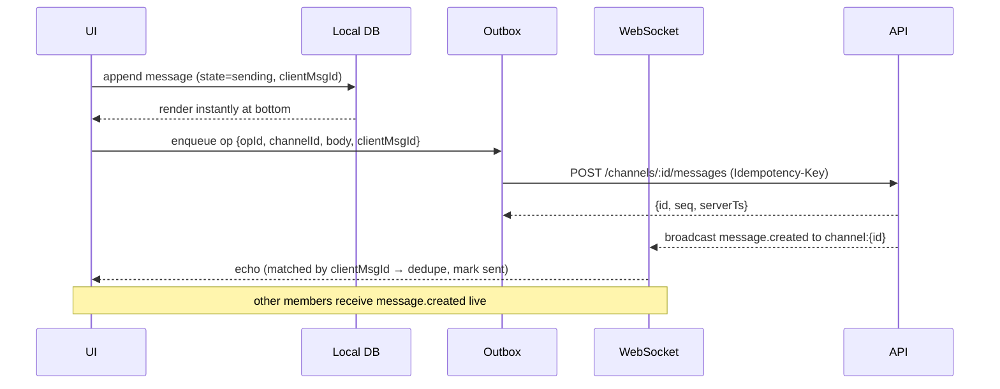

# 26 · Team Chat & Collaboration Hub

> Follows the [Master PRD Template](./00-prd-template.md). The Collaboration Hub is Numil's
> real-time messaging layer — channels, DMs, threads, mentions, reactions, presence, huddles,
> and a team feed — designed to keep conversation **attached to the work**, not in a separate
> silo. Simple by default (one clean message list); deep on demand (message→task, threads,
> huddles).

---

## 1. Purpose

Team Chat turns Numil into a place where discussion and work coexist. Instead of context
switching to **Slack or Microsoft Teams** and losing the link between "we decided X" and the
task that implements it, Numil chat lives beside projects and tasks: any message can become a
task, any task update can post to a channel, and every conversation is searchable next to the
work it produced.

**User problem it solves.** Conversation lives in Slack/Teams; work lives in a PM tool; the
two drift apart and decisions evaporate. Numil unifies them: **message ↔ task**, project
channels, and a team feed of activity, so nothing important is lost between apps.

**User goals**
- Message a channel/person in one tap; know who's online and who's typing.
- Discuss in **threads** without flooding the channel.
- Turn a message into a task (with assignee/due) without leaving the conversation.
- Get pinged only when it matters (`@`, keywords), with quiet hours respected.
- Catch up fast via unread, mentions, and a team activity feed.

**Business goals**
- Increase daily engagement and multi-user activation (chat drives return visits).
- Reduce reliance on external chat (retention + data gravity).
- Feed collaboration KPIs (orgs with ≥2 active users, cross-user threads).

**KPIs:** DAU/messages-per-active-user, `message_to_task` conversions, mention response time,
threads-per-channel, huddle adoption, notification opt-in rate, % channels linked to a project.

**Status:** channels/DMs/threads/mentions/reactions/presence/typing/message→task/feed ✅ v1;
huddles (audio) 🔜 v1.1; video huddles + screen share 🟣 v2; scheduled/announcement broadcast
🔜 v1.1.

---

## 2. Navigation

**Entry points**
- **Chat** tab / sidebar section → channel & DM list.
- Project screen → **project channel** shortcut (auto-created per project).
- From a task: "Discuss in chat" → posts a task reference into the linked channel/thread.
- Mention/notification → deep link to the exact message.
- Deep links: `numil://chat/channel/{channelId}`, `numil://chat/dm/{userId}`,
  `numil://chat/thread/{messageId}`, `numil://chat/message/{messageId}` (jump + highlight).

**Route:** `src/app/chat/index.tsx` (list), `src/app/chat/[channelId].tsx` (conversation),
thread as a **sheet** (medium→large) over the conversation. DMs and channels share the
conversation screen. Conversation is a **push** from the list; **sheet** peek from a task.

**Navigation hierarchy & breadcrumbs**
```text
Workspace ▸ Channel (#launch)  |  Direct Message ▸ Priya
Channel ▸ Thread on "Ship Friday?"          ← thread breadcrumb
```

**Transitions**
- List → conversation: iOS push slide; unread divider animates into place.
- Thread open: `spring.gentle` sheet from the parent message (shared-element on the bubble).
- New message: slide-up + fade at the bottom; jump-to-latest FAB when scrolled up.

**Modal vs push**
- **Push** for a conversation (full history, composer, back stack).
- **Sheet** for a thread (keeps the channel underneath) and for message→task creation.

---

## 3. Complete UI Layout

Calm by default: a single message list, a clean composer, and unread cues. Power (threads,
reactions, actions) appears on long-press or in the `•••`/context menu.

```text
┌───────────────────────────────────────────────┐
│  ‹ Chat        # launch      👥 6 · 🟢 3   ⋯    │  ← channel header (members/presence)
├───────────────────────────────────────────────┤
│                    ── Today ──                  │  ← date divider
│  🟢 Priya  9:04                                  │
│     Ship still on for Friday?                    │
│         ❤️2  👍1   💬 3 replies ▸                 │  ← reactions + thread affordance
│  Marco  9:06                                     │
│     Yes — blockers cleared.  #launch  @Priya     │  ← mention + channel link
│  ┌───────────────────────────────────────────┐ │
│  │ 📋 Task created: "Send launch email"  ◷ Fri │ │  ← message→task chip (live status)
│  └───────────────────────────────────────────┘ │
│              ●●● Priya is typing…                │  ← typing indicator
│  ─────────── 4 unread messages ───────────       │  ← unread divider
├───────────────────────────────────────────────┤
│  [ ＋ 😊 📎 🎤 ✨ ]  Message #launch…      ➤     │  ← composer (attach/emoji/voice/AI)
└───────────────────────────────────────────────┘
```

- **Top:** glass header with channel name/DM avatar, **presence summary** (online count),
  members avatar stack, call/huddle button, and `•••` (details, notifications, pin, search,
  add people, convert to project channel). Respects Dynamic Island + safe area.
- **Middle:** virtualized message list, newest at the bottom. **Grouped by author + time**
  (consecutive messages collapse the avatar). Date dividers, an **unread divider**, and a
  **jump-to-latest** FAB when scrolled up. Long-press a message → context menu (React, Reply
  in thread, Create task, Copy link, Pin, Edit/Delete own, Forward).
- **Bottom:** composer with grow-with-text input, add (files/photo/camera/doc/task/poll),
  emoji, **voice message**, and **✨AI** (smart reply/summarize). Sits above keyboard + home
  indicator. Slash commands (`/task`, `/poll`, `/giphy` 💡, `/remind`) supported.
- **Empty space:** a fresh channel shows a friendly starter ("This is the start of #launch")
  + suggested actions (add people, link a project).
- **Presence:** green/idle/DND dots on avatars; live **typing indicator** above composer.
- **Landscape / iPad:** two-pane — channel/DM list on the left, conversation on the right;
  threads open as a **third right pane** (Slack-style). Dynamic Island shows an ongoing
  huddle as a Live Activity.
- **Tab bar:** persistent; the Chat tab shows a **badge** for unread mentions.

---

## 4. Complete Component Breakdown

| Area | Components |
|------|-----------|
| List | `ConversationList`, `ChannelRow` (unread bold + count), `DMRow` (presence dot), `SectionHeader` (Channels/DMs/Starred), `NewMessageButton`, `SearchBar` |
| Header | `ChatHeader`, `PresenceSummary`, `MemberAvatarStack`, `HuddleButton`, `•••` `ContextMenu` |
| Messages | `MessageList` (FlashList, inverted), `MessageGroup`, `MessageBubble`, `AuthorHeader`, `DateDivider`, `UnreadDivider`, `SystemMessage` (joined/renamed), `LinkPreviewCard`, `AttachmentTile`, `VoiceMessageBubble` (waveform), `TaskRefChip` (live status), `PollCard` |
| Reactions/threads | `ReactionBar`, `EmojiPicker`, `ThreadPreview` ("N replies"), `ThreadSheet`, `MentionInline`, `ChannelLinkInline` |
| Presence | `PresenceDot`, `TypingIndicator`, `ReadReceiptRow` (DM), `ActiveNowAvatars` |
| Composer | `Composer` (grow), `SlashMenu`, `AttachmentButton`, `EmojiButton`, `VoiceRecorder`, `AIButton` (✨), `MentionAutocomplete`, `SendButton`, `EditingBanner` |
| Huddle | `HuddleBar`, `HuddleParticipants`, `MicToggle`, `LiveActivityBadge` (Dynamic Island) |
| Feed | `TeamFeedList`, `FeedItem` (activity/announcement), `AnnouncementBanner` |
| Feedback | `Skeleton`, `Toast` (undo), `Banner` (offline/connection lost), `JumpToLatestFab`, `NewMessagesPill`, `ConfirmDialog` |
| AI | `SmartReplyChips`, `ThreadSummaryCard`, `CatchUpCard` |

All primitives are defined in [03-design-system-ui.md](./03-design-system-ui.md).

---

## 5. Modern Features

Each feature: **Purpose · Workflow · UI · Permissions · Offline · API · DB · Notify · AC.**

### 5.1 Channels & Direct Messages (Slack/Teams) ✅
- **Purpose:** organized team spaces + 1:1/group private chats.
- **Workflow:** create public/private channels; auto **project channels**; DMs (1:1) and
  **group DMs** (≤9); join/leave; star/mute; rename/archive.
- **UI:** `ConversationList` sectioned; `ChatHeader`; mute/star swipe actions.
- **Permissions:** Member+ creates channels (org policy); private channel invite-only; guests
  only in explicitly shared channels.
- **Offline:** cached conversations readable; new messages queued and sent on reconnect.
- **API:** `POST /channels`, `GET /channels?filter[type]=`, `POST /channels/:id/join`.
- **DB:** `channels`, `channel_members`, `dm_threads`.
- **Notify:** added-to-channel notifies; mute suppresses.
- **AC:** public/private/DM/group DM all work; project channels auto-created; archive is
  reversible.

### 5.2 Messages, editing, formatting & attachments ✅
- **Purpose:** send rich messages with files/links/voice.
- **Workflow:** type (markdown-lite: bold/italic/code/quote/lists/links); attach from
  Files/Photos/Camera; paste link → unfurl; **voice message** with waveform; edit/delete own
  within a window (edited/deleted markers).
- **UI:** `MessageBubble`, `AttachmentTile`, `VoiceMessageBubble`, `LinkPreviewCard`.
- **Permissions:** members post in joined channels; edit/delete **own**; leads delete any.
- **Offline:** compose offline → queued (`sending` state); attachments upload resumably.
- **API:** `POST /channels/:id/messages`, `PATCH/DELETE /messages/:id`.
- **DB:** `messages` (append-only body edits tracked), `message_attachments` (module 28).
- **Notify:** channel/thread subscribers per prefs.
- **AC:** send/edit/delete markers; attachments resume; links unfurl server-side.

### 5.3 Threads (Slack) ✅
- **Purpose:** keep focused discussion out of the main channel.
- **Workflow:** reply in thread on any message; thread shows a preview ("3 replies") in the
  channel; "also send to channel" option; follow/unfollow a thread.
- **UI:** `ThreadPreview` chip; `ThreadSheet` (or right pane on iPad).
- **Permissions:** as channel.
- **Offline:** thread messages queue; order preserved by server sequence + client tiebreak.
- **API:** `POST /messages/:id/replies`, `GET /messages/:id/replies?cursor=`.
- **DB:** `messages.parent_id` (self-FK); `thread_followers`.
- **Notify:** thread replies notify participants/followers only (not whole channel).
- **AC:** threads preserve order; reply count accurate; follow controls notifications.

### 5.4 Mentions, channel links & keywords ✅
- **Purpose:** direct attention precisely.
- **Workflow:** `@user`, `@channel`/`@here`, `#channel` link, `@task`/`@doc` reference;
  personal **keyword alerts** ("deploy") notify even without a direct mention.
- **UI:** `MentionAutocomplete`, `MentionInline`, `ChannelLinkInline`; mentions highlighted.
- **Permissions:** `@channel`/`@here` may be restricted to leads (org policy, anti-noise).
- **Offline:** mentions resolve on send (validated against membership).
- **API:** mentions embedded in message payload; realtime `notification.created`.
- **DB:** `message_mentions` (message_id, mentioned_type, mentioned_id).
- **Notify:** `@mention`/keyword → immediate (bypasses channel mute unless "ignore
  mentions"); `@channel` → batched to online/relevant members.
- **AC:** autocomplete resolves; mention notifies immediately; keyword alerts fire.

### 5.5 Reactions & pins ✅
- **Purpose:** lightweight acknowledgement + surfacing key messages.
- **Workflow:** tap-and-hold → emoji reactions (with recent/skin tones); pin important
  messages to the channel (visible in details).
- **UI:** `ReactionBar`, `EmojiPicker`, pinned list in `•••` details.
- **Permissions:** anyone reacts; pin by Member+ (unpin by pinner/lead).
- **Offline:** optimistic; reconciled by server.
- **API:** `POST /messages/:id/reactions` · DELETE; `POST /messages/:id/pin`.
- **DB:** `reactions` UNIQUE(message_id,user_id,emoji); `pins`.
- **Notify:** reactions optional (off by default); pin notifies channel (opt).
- **AC:** reactions realtime with text alternatives; pins persist and are listed.

### 5.6 Presence & typing indicators ✅
- **Purpose:** know who's around and actively responding.
- **Workflow:** presence (online/idle/DND/offline) derived from activity + manual status;
  typing indicator per conversation/thread; DM **read receipts** (per-user toggle).
- **UI:** `PresenceDot`, `TypingIndicator`, `ReadReceiptRow`, `ActiveNowAvatars`.
- **Permissions:** presence visible to org members (guests limited); receipts opt-in.
- **Offline:** presence goes "offline"; typing not emitted; nothing persisted.
- **API:** realtime `presence.changed`, `typing.changed` (ephemeral, not persisted).
- **DB:** none persisted (presence in memory/Redis); status text on `users`.
- **Notify:** none.
- **AC:** presence/typing update in realtime; ephemeral (never stored); receipts respect opt-in.

### 5.7 Message → Task (the differentiator) ✅
- **Purpose:** turn conversation into tracked work without leaving chat.
- **Workflow:** long-press message → **Create task**; sheet pre-fills title from the message,
  suggests assignee (author/mentioned), due (parsed dates), and project (channel's project);
  the message shows a live `TaskRefChip` linking to [Task Detail](./10-task-detail.md).
- **UI:** `TaskRefChip` (live status); creation sheet reuses task quick-add.
- **Permissions:** create in the channel's project scope; assign per project policy.
- **Offline:** task created optimistically + queued; chip shows `pending`.
- **API:** `POST /tasks` with `source=chat`, `sourceMessageId`; realtime `doc.link`/`task.created`.
- **DB:** `messages.linked_task_id` + `tasks.source_message_id` (two-way).
- **Notify:** assignee notified of the new task; channel sees the chip.
- **AC:** task inherits context (project/assignee/due); two-way link; status stays live.

### 5.8 Huddles & announcements 🔜
- **Purpose:** quick audio sync (huddle) and broadcast (announcement) without a meeting.
- **Workflow:** start a **huddle** (audio; 🟣 video + screen share) in a channel; participants
  join with one tap; Dynamic Island **Live Activity** shows the ongoing call. **Announcement**
  channels are post-by-leads, read-by-all (broadcast, low-noise).
- **UI:** `HuddleBar`, `HuddleParticipants`, `LiveActivityBadge`, `AnnouncementBanner`.
- **Permissions:** anyone starts a huddle in a joined channel; announcements post = leads/admin.
- **Offline:** huddle requires network; announcements cached read.
- **API:** `POST /channels/:id/huddle`, realtime `huddle.updated`; announcements are messages
  with `type=announcement`.
- **DB:** `huddles` (channel_id, started_by, participants[], ended_at?), `channels.is_announcement`.
- **Notify:** huddle start pings active channel members; announcement notifies all (respect DND).
- **AC:** huddle join/leave + Live Activity; announcement channels are read-only for members.

### 5.9 Team feed ✅
- **Purpose:** a chronological, low-effort catch-up of what's happening.
- **Workflow:** aggregates key activity (task completions, mentions to you, announcements,
  doc shares, huddle recaps) into a scannable feed; tap → source.
- **UI:** `TeamFeedList`, `FeedItem`.
- **Permissions:** shows only items in the user's accessible scope.
- **Offline:** cached; refresh on reconnect.
- **API:** `GET /feed?cursor=` (composed from realtime + activity — see
  [29-activity-feed-audit-logs.md](./29-activity-feed-audit-logs.md)).
- **DB:** derived (no dedicated write path); references activity/messages.
- **Notify:** none (it's the calm alternative).
- **AC:** feed is permission-scoped, chronological, and deep-links to sources.

---

## 6. Smart AI Features

Powered by [AI Assistant & Copilot](./19-ai-assistant-copilot.md) (capability ids noted).
All proposal-first; AI **never sends a message without explicit confirmation**.

| Capability | What it does in chat |
|-----------|----------------------|
| **Smart replies** (`smart_reply`) | 1-tap contextual reply chips above the composer (confirm to send). |
| **Catch-up / summarize** (`summarize`) | "Summarize since I was away" or a long thread → TL;DR card with links. |
| **Action items → tasks** (`action_items`) | Extract to-dos from a thread → task proposals (assignee/due). |
| **Rewrite / tone / translate** (`rewrite`) | Polish or translate a draft before sending. |
| **Ask about this channel** (`project_chat` RAG) | "What did we decide on pricing?" grounded in accessible messages/docs, with citations. |
| **Semantic search** (`semantic_search`) | Natural-language search across chat/docs/tasks. |
| **Auto-suggest task** | Detects actionable phrasing ("can you send…") and offers Create-task. |

Logs `ai_invoked` (`capability`, `accepted`, `latency_ms`); respects org AI governance and
permission scoping; RAG never surfaces messages the user cannot read.

---

## 7. Productivity Features

- **`/remind me` and `/remind #channel`** → creates a reminder/notification.
- **Saved items** (bookmark a message for later) and **Later** queue.
- **Scheduled send** 🔜 (respect recipient quiet hours).
- **Message → task, poll, or doc** in one action; **decision** pins surface in the project.
- **Catch-up mode:** unread + mentions + AI summary to clear backlog fast.
- **Do Not Disturb / quiet hours** with auto-status ("In focus" from
  [Focus & Pomodoro](./35-focus-pomodoro-habits.md)).

---

## 8. Enterprise Features

- **Channel & message permissions** (role matrix):

| Action | Owner | Admin | Manager | Member | Guest |
|--------|:-----:|:-----:|:-------:|:------:|:-----:|
| View/post in joined channel | ✅ | ✅ | ✅ | ✅ | shared |
| Create public channel | ✅ | ✅ | ✅ | ⚙️ | ❌ |
| Create/manage private channel | ✅ | ✅ | own | invite-only | ❌ |
| `@channel` / `@here` broadcast | ✅ | ✅ | ✅ | policy | ❌ |
| Post in announcement channel | ✅ | ✅ | ✅ | ❌ | ❌ |
| Delete any message | ✅ | ✅ | channel-lead | own only | own only |
| Archive/rename channel | ✅ | ✅ | channel-lead | ❌ | ❌ |
| Start huddle (🔜) | ✅ | ✅ | ✅ | ✅ | shared |
| Export channel history | ✅ | ✅ | ❌ | ❌ | ❌ |
| Retention / legal hold | ✅ | ✅ | ❌ | ❌ | ❌ |

`⚙️` gated by org policy. Roles reference [shared/rbac-permissions.md](./shared/rbac-permissions.md).

- **Compliance export & eDiscovery** 🟣: export channel/DM history (with attachments) for
  legal; immutable [audit](./29-activity-feed-audit-logs.md) of message edits/deletes.
- **Retention policies** per org/channel (auto-delete after N days; legal hold overrides).
- **DLP** 🟣: block sensitive-pattern messages/attachments; guest containment.
- **Message moderation & admin delete** with audit trail.

---

## 9. Collaboration Features

- **Real-time everything** via WebSocket — see
  [shared/api-conventions.md](./shared/api-conventions.md) (channels `channel:{id}`,
  `thread:{id}`, `user:{id}`; envelope, reconnection, `GET /sync?since=`). Presence/typing are
  ephemeral; messages reconcile by server sequence.
- **Cross-surface:** message→task ([10](./10-task-detail.md)), share doc
  ([25](./25-documents-knowledge-base.md)), share whiteboard
  ([27](./27-whiteboard-brainstorming.md)); notifications via [12](./12-notifications-alerts.md).
- **Group DMs, huddles (🔜), reactions, threads, mentions, polls**, and a **team feed**.

---

## 10. Offline Architecture

Deltas over [shared/offline-sync-engine.md](./shared/offline-sync-engine.md):
- **Messages are append-only** → merge by id; ordering by server **sequence number** with a
  client `clientTs` tiebreak. Retried sends dedupe by `opId`/`clientMsgId`.
- Composed messages, reactions, edits, and message→task all queue offline (`sending`/`pending`
  states) and flush on reconnect.
- Attachments/voice notes upload resumably (metadata first, blob after).
- Presence/typing/huddles are **online-only** (never queued/persisted).
- Missed messages recovered via delta `GET /sync?since=<cursor>` on reconnect; the unread
  divider and jump-to-latest reflect the reconciled state.

**Send sequence (optimistic + realtime):**


---

## 11. Security

Deltas over [shared/security-baseline.md](./shared/security-baseline.md):
- Channel membership re-checked on every read/post; realtime subscriptions authorized on
  connect **and** per message; guests contained to shared channels.
- Messages/rich text **sanitized** (no script/HTML injection); link unfurls fetched
  server-side (SSRF-guarded); attachments type/size-validated + malware-scanned before
  availability; signed, expiring URLs.
- No message content in analytics/logs; AI RAG permission-filtered.
- DM/channel content encrypted at rest (server); optional on-device SQLCipher (enterprise).
- Rate-limited posting (anti-spam/flood); progressive throttle on abuse.

---

## 12. Notification System

Deltas over [12-notifications-alerts.md](./12-notifications-alerts.md):
- Emits: `@mention`, keyword alert, DM, thread reply (to participants), reaction (opt),
  huddle start, announcement, added-to-channel, message→task assignment.
- **Per-channel notification levels:** All / Mentions only / Nothing; DND & quiet hours;
  mute overrides everything except direct mentions (if configured).
- iOS notification categories with actions: **Reply**, **React**, **Mark read**, **Open**.
- **Communication Notifications / Focus / Time Sensitive:** DMs and `@mentions` can use the
  iOS Communication Notification style (sender avatar); huddles use Time Sensitive.
- Badges: Chat tab shows unread **mention** count (not total, to reduce anxiety).

---

## 13. Accessibility

Deltas over [shared/accessibility-spec.md](./shared/accessibility-spec.md):
- Each message announces "Author, time, message; N reactions; M replies" with actions
  (Reply in thread, React, Create task, Copy link).
- Typing indicator announced politely via `accessibilityLiveRegion` (not spammy).
- Reactions have text alternatives ("❤️ 2, you and Priya"); presence dots pair with a label
  ("Priya, online").
- Voice messages provide a transcript/caption; huddles expose participant list + mute state.
- Composer, mention autocomplete, and smart-reply chips fully keyboard/Switch-Control operable.

---

## 14. Animations

Deltas over [shared/animation-spec.md](./shared/animation-spec.md):
- New message: slide-up + fade (`motion.base`); own message settles from the composer.
- Reaction: pop `spring.bouncy`; reaction bar expands `spring.gentle`.
- Thread open: shared-element from the parent bubble into the sheet.
- Typing dots: gentle looping pulse (stops instantly when message arrives).
- Unread divider slides in; jump-to-latest FAB fades with scroll position.
- Huddle Live Activity animates into the Dynamic Island. Reduce Motion → cross-fades only.

---

## 15. Performance

- **Inverted FlashList** message list with windowing; smooth 60fps scroll on thousands of
  messages; images via `expo-image` with placeholders.
- **Realtime fan-out:** diff by server `seq`; ignore echo of own optimistic sends (matched by
  `clientMsgId`); coalesce typing/presence bursts (debounced).
- **Lazy history:** load older on scroll-up (cursor pagination); thread messages lazy.
- **Optimistic send** keeps composer interaction <16ms; network off main path.
- **Reconnect:** single delta pull + outbox flush; no duplicate rendering.
- **Battery/data:** huddles use efficient codecs; background presence heartbeats throttled;
  reconnection backoff with jitter.

---

## 16. Database Design

```text
channels(id, org_id, project_id?, name, type, is_announcement, is_archived, created_by,
         created_at, updated_at, deleted_at?)                 -- type: public|private|dm|group_dm
channel_members(channel_id→channels, user_id, role, notif_level, last_read_seq, muted, starred,
                joined_at)                                     PK(channel_id,user_id)
messages(id, channel_id→channels, author_id, parent_id?→messages, body_json, seq, client_msg_id,
         type, linked_task_id?, edited_at?, deleted_at?, created_at)   -- seq monotonic per channel
message_attachments(id, message_id→messages, file_id→files, kind)      -- files = module 28
reactions(id, message_id→messages, user_id, emoji, created_at)         UNIQUE(message_id,user_id,emoji)
message_mentions(id, message_id→messages, mentioned_type, mentioned_id)
pins(channel_id→channels, message_id→messages, pinned_by, created_at)  PK(channel_id,message_id)
thread_followers(message_id→messages, user_id)                         PK(message_id,user_id)
huddles(id, channel_id→channels, started_by, participants_json, started_at, ended_at?)  -- 🔜
polls(id, message_id→messages, question, options_json, closes_at?)     -- votes in poll_votes
user_status(user_id, text, emoji, dnd_until?, presence)                -- presence ephemeral (Redis)
```

**Indexes:** `messages(channel_id, seq DESC)` (paging), `messages(parent_id, created_at)`
(threads), `message_mentions(mentioned_type, mentioned_id)`, `channel_members(user_id)`,
`reactions(message_id)`, **FTS/GIN** on message text (permission-filtered), ANN embedding
index for semantic search ([39](./39-search-indexing-semantic.md)). **Constraints:** DM
channels have exactly 2 members; group DM ≤9; `seq` unique per channel. **Soft delete** via
`deleted_at`; message edits keep an append-only history for audit. Presence/typing are **not**
persisted.

---

## 17. API Design

Follows [shared/api-conventions.md](./shared/api-conventions.md).

| Method | Path | Purpose |
|--------|------|---------|
| GET | `/channels?filter[type]=&cursor=` | List channels/DMs |
| POST | `/channels` · PATCH/DELETE `/channels/:id` | Manage channels |
| POST | `/channels/:id/join` · `/leave` | Membership |
| PATCH | `/channels/:id/members/me` | notif_level, muted, starred, last_read_seq |
| GET | `/channels/:id/messages?cursor=&limit=50` | History (cursor) |
| POST | `/channels/:id/messages` (Idempotency-Key) | Send |
| PATCH/DELETE | `/messages/:id` | Edit/delete own |
| GET/POST | `/messages/:id/replies` | Threads |
| POST/DELETE | `/messages/:id/reactions` | Reactions |
| POST | `/messages/:id/pin` · DELETE | Pin |
| POST | `/messages/:id/task` | Message → task |
| POST | `/channels/:id/huddle` (🔜) | Start/join huddle |
| GET | `/feed?cursor=` | Team feed |
| POST | `/chat/ai/{reply\|summarize\|actions\|ask}` | AI (module 19) |

**Realtime:** channels `channel:{id}`, `thread:{messageId}`, `user:{id}` — events
`message.created|updated|deleted`, `reaction.created|deleted`, `presence.changed`,
`typing.changed`, `huddle.updated`, `notification.created`. Client reconciles by `seq`; missed
events via `GET /sync?since=`. **Pagination:** cursor (newest-first). **Errors:**
`403 forbidden` (not a member), `409 gone` (deleted channel/message), `429 rate_limited`
(flood). **Idempotency-Key** on all sends; `clientMsgId` dedupes optimistic echoes.

**Sample: send a message**
```http
POST /v1/channels/ch_launch/messages
Idempotency-Key: 9ab1-...-77
{ "body": { "text": "Yes — blockers cleared.", "mentions": [{"type":"user","id":"u_priya"}] },
  "clientMsgId": "cm_5521" }
```
```json
{ "data": { "id":"msg_7f3","channelId":"ch_launch","authorId":"u_marco","seq":10432,
  "clientMsgId":"cm_5521","createdAt":"2026-07-16T09:06:00Z","state":"sent" },
  "meta": { "requestId":"req_..." } }
```

---

## 18. Edge Cases

- **Offline send:** message stays `sending`; on reconnect flushes; dedupe by `clientMsgId`.
- **Two devices, same optimistic send:** server dedupes by `Idempotency-Key`; one canonical msg.
- **Message edited/deleted after you replied in thread:** thread keeps replies; parent shows
  "message deleted".
- **Removed from channel mid-session:** subscription revoked; next post `403`; queued drops
  with notice; channel greys out.
- **Mention of a former member / user who left:** renders "former member"; no notification.
- **`@channel` in a 5,000-member channel:** rate-limited/lead-gated; batched delivery.
- **Huddle drop / network loss:** auto-reconnect with backoff; Live Activity shows
  "reconnecting"; falls back to leave after timeout.
- **Deleted linked task:** `TaskRefChip` shows "task removed" but message stays.
- **Clock skew:** server `seq`/`serverTs` authoritative for ordering.
- **Poll after close:** votes rejected with notice.
- **Storage full:** text sends continue; media upload paused with warning.
- **Notification storm:** coalesced; badge caps display; DND/quiet hours respected.
- **Archived channel:** read-only banner; no new messages/huddles.

---

## 19. User States

- **First-time:** guided into a default channel; coach-mark on message→task and reactions.
- **Returning/power:** keyboard + `/` slash on iPad, catch-up mode, saved items, quick switch.
- **Guest:** only shared channels; no channel browse/create; presence limited; no export.
- **Manager/Admin/Owner:** announcement posting, moderation/delete-any, retention; Admin can
  moderate but **not** read personal DMs beyond legal export scope.
- **Offline / poor network:** `sending`/`pending` states, connection banner, no dead spinners.
- **DND / focus:** suppressed notifications, auto-status; mentions optionally break through.
- **Tablet/landscape:** two/three-pane (list / conversation / thread).
- **Dark mode / large text / a11y:** tokens + Dynamic Type; VoiceOver message navigation.

---

## 20. Analytics Events

Schema per [shared/analytics-taxonomy.md](./shared/analytics-taxonomy.md) (never log message
text/PII).

| event | key properties |
|-------|----------------|
| `message_sent` | `channel_type`, `has_attachment`, `has_mention`, `in_thread`, `offline` |
| `message_edited` / `message_deleted` | `age_bucket` |
| `reaction_added` | `emoji` |
| `thread_replied` | `reply_index_bucket` |
| `mention_received` / `mention_opened` | `mention_type`, `latency_bucket` |
| `message_to_task` | `assignee` (self/other), `had_due` |
| `channel_created` / `channel_joined` | `channel_type` |
| `huddle_started` / `huddle_joined` | `participant_count_bucket` |
| `announcement_posted` | `audience_size_bucket` |
| `chat_search_used` | `result_count`, `used_semantic` |
| `notification_level_changed` | `level` |
| `ai_invoked` | `capability`, `accepted`, `latency_ms` |

---

## 21. Acceptance Criteria

1. Public/private channels, 1:1 DMs, and group DMs (≤9) can be created and used.
2. Every project auto-creates a linked channel; the link is bidirectional.
3. Messages send optimistically and render instantly; state shows sending→sent.
4. Retried sends never duplicate (Idempotency-Key + clientMsgId dedupe).
5. Markdown-lite formatting round-trips; links unfurl server-side.
6. Edit/delete own messages within the window; edited/deleted markers shown.
7. Attachments and voice messages upload resumably; waveform renders.
8. Threads keep order; reply counts are accurate; follow/unfollow controls notifications.
9. `@user`/`@channel`/`@here`/`#channel` autocomplete and render correctly.
10. `@mention` and keyword alerts notify immediately (even in muted channels if configured).
11. `@channel`/`@here` is rate-limited or lead-gated per org policy.
12. Reactions add/remove in realtime with text alternatives.
13. Pins persist and are listed in channel details.
14. Presence (online/idle/DND/offline) and typing indicators update in realtime.
15. Presence/typing/huddle state is ephemeral and never persisted.
16. DM read receipts respect the per-user opt-in.
17. Message→task pre-fills title/assignee/due/project and creates a two-way live link.
18. The task-reference chip stays live as the task's status changes.
19. Huddles (🔜) start/join with one tap and show a Dynamic Island Live Activity.
20. Announcement channels are post-by-leads, read-by-all.
21. The team feed is permission-scoped, chronological, and deep-links to sources.
22. Everything works offline: read cached, queue sends/reactions/edits/tasks.
23. Missed messages recover via delta sync on reconnect; unread divider is correct.
24. Messages merge by id/seq; append-only ordering never conflicts.
25. AI smart replies/summaries/action-items/ask are proposal-first and logged.
26. AI never sends a message without explicit confirmation.
27. "Ask about this channel" answers only from accessible content and cites sources.
28. Removed-from-channel revokes realtime + rejects further posts with notice.
29. Deleted channel/message via deep link shows a graceful unavailable state.
30. Per-channel notification levels (All/Mentions/Nothing), DND, and quiet hours are honored.
31. iOS notification actions (Reply/React/Mark read/Open) work from the lock screen.
32. DMs/mentions use Communication Notification style; huddles use Time Sensitive.
33. Chat tab badge shows unread mentions (not total).
34. Messages/rich text are sanitized; attachments malware-scanned before availability.
35. No message content in analytics or logs; AI RAG is permission-filtered.
36. Guests are contained to shared channels across REST and realtime.
37. Compliance export/retention/legal hold behave per org policy (🟣 export).
38. VoiceOver announces message metadata and exposes per-message actions.
39. Reduce Motion swaps animations for cross-fades; typing/reaction feedback retained.
40. iPad landscape shows list/conversation/thread multi-pane.
41. Analytics events fire with correct properties (incl. offline-buffered), no text/PII.
42. Undo (5s snackbar) available for destructive actions (delete message).
43. Reconnect performs a single delta pull + outbox flush without duplicate rendering.

---

## 22. Future Roadmap

- **V1 (✅):** channels/DMs/group DMs, messages+attachments+voice, threads, mentions/keyword
  alerts, reactions/pins, presence/typing, message→task, team feed, notification levels,
  offline queue, AI smart reply/summarize/action-items/ask.
- **V1.1 (🔜):** audio huddles + Live Activity, announcement channels, scheduled send, polls,
  saved items/Later queue, richer link previews, per-channel keyword muting.
- **V2 (🟣):** video huddles + screen share, compliance export/eDiscovery, DLP, message
  translation inline, shared AI threads, custom channel sections, threads as right pane
  everywhere.
- **Future (💡):** Slack/Teams import & bridging, GIF/sticker picker, workflow bot messages,
  channel canvases (chat + doc + whiteboard), voice-note transcription search.
- **Experimental (🧪):** proactive AI "you have 3 unanswered mentions" assistant; on-device
  live captions for huddles; AI meeting-notes from a huddle → doc + tasks.
- **AI track:** cross-surface RAG (chat + docs + tasks) with citations; auto-catch-up digest.
- **Enterprise track:** SCIM-driven channel membership, data-residency for messages,
  retention/legal-hold UI, moderation console.
