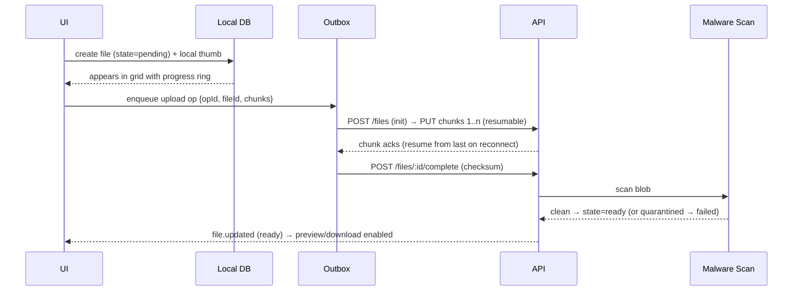

# 28 · File Management

> Follows the [Master PRD Template](./00-prd-template.md). File Management is Numil's
> workspace-wide file layer: a browser with folders, native previews (QuickLook), versions,
> storage quotas, and permissions. It is the **single source of truth** for every blob in the
> product — the attachments on a [task](./10-task-detail.md), the images in a
> [doc](./25-documents-knowledge-base.md), the media in [chat](./26-team-chat-collaboration.md),
> and the pictures on a [board](./27-whiteboard-brainstorming.md) all resolve to files here.
> Simple by default (a Files-app-like grid); deep on demand (versions, quotas, sharing).

---

## 1. Purpose

File Management gives every organization a native, mobile-first place to store, find,
preview, and share files — without leaving Numil for Google Drive/Dropbox/SharePoint. Because
it is the shared blob store, attachments across the whole product are consistent, deduplicated,
versioned, permissioned, and offline-aware.

**User problem it solves.** Files scatter across email, Drive, Slack, and task attachments;
versions multiply ("final_v3_FINAL"); you can't find the deck on your phone; storage bloats
uncontrollably. Numil centralizes files with folders, versions, previews, and quotas, and
keeps them attached to the work — while feeling as light as the iOS **Files** app.

**User goals**
- Browse/search files fast; preview any file inline (QuickLook) without downloading.
- Upload from Files/Photos/Camera/scan; organize into folders; move/rename.
- Keep versions (replace a file, keep history, restore).
- Share a file/folder with the right people (or a link), respecting permissions.
- Work offline: see recent files, queue uploads, and control what's cached (storage cap).

**Business goals**
- Increase data gravity/retention (files pull orgs in and keep them).
- Monetize **storage quotas/tiers** and advanced sharing/DLP.
- Reduce integration dependence; consistent attachment behavior across modules.

**KPIs:** `file_uploaded`, files previewed vs downloaded, storage used per org (quota
utilization), version-restore rate, share link usage, offline cache hit rate, dedupe savings,
time-to-preview.

**Status:** browser/folders/upload/QuickLook/versions/quotas/permissions/offline ✅ v1;
public share links + expiry 🔜 v1.1; DLP/watermarking + file requests 🟣 v2; on-device
encrypted vault 💡.

---

## 2. Navigation

**Entry points**
- **Files** section in the [sidebar](./04-navigation-sidebar.md) → workspace/project files.
- Project screen → **Files** tab (project-scoped folder).
- From a task/doc/chat/board: "Save to Files" or tap an attachment → opens the file here.
- iOS **Share Sheet** target ("Save to Numil") + **Files app provider** (🔜) for import.
- Deep links: `numil://file/{fileId}`, `numil://folder/{folderId}`,
  `numil://file/{fileId}?version={versionId}`, `numil://file/{fileId}?preview=1`.

**Route:** `src/app/files/index.tsx` (workspace root), `src/app/folder/[id].tsx` (folder),
`src/app/file/[id].tsx` (file details). **Preview** is a full-screen **QuickLook** modal
(`expo-quick-look`/native) presented over the browser. File **details/versions/share** open as
**sheets**; folder navigation is a **push**.

**Navigation hierarchy & breadcrumbs**
```text
Workspace ▸ Project (or "My Files") ▸ Folder ▸ Subfolder ▸ [file.pdf]
```
Breadcrumb chips are tappable; deep paths collapse to `… ▸ Folder ▸ file` with a popover.

**Transitions**
- Folder open: iOS push slide; grid/list cross-fades on view toggle.
- File tap → QuickLook: shared-element hero on the thumbnail (`motion.slow`); pinch-to-close.
- Upload: item animates into the grid with a progress ring.

**Modal vs push**
- **Push** for folder navigation (breadcrumb back stack).
- **Modal** QuickLook for preview; **sheets** for details, versions, move, and share.

---

## 3. Complete UI Layout

Feels like the iOS Files app: a clean grid/list, a prominent search, and an unobtrusive
upload FAB. Power (versions, sharing, quotas) hides in the file's `•••` and details sheet.

```text
┌───────────────────────────────────────────────┐
│  Files                              ⊞/≣   •••   │  ← large title, view toggle, overflow
│  🔎 Search files                                 │  ← search (name/type/owner/content 🔜)
│  ▸ Marketing ▸ Launch                            │  ← breadcrumb
├───────────────────────────────────────────────┤
│  Folders                                         │
│  ┌────────┐ ┌────────┐ ┌────────┐                │
│  │ 📁 Brand│ │ 📁 Docs │ │ 📁 Media│  …            │  ← folder cards
│  └────────┘ └────────┘ └────────┘                │
│  Files                          Sort: Modified ▾ │
│  ┌────────┐ ┌────────┐ ┌────────┐                │
│  │ 🖼 hero │ │ 📄 brief│ │ 🎞 promo│                │  ← thumbnails (image/pdf/video)
│  │ 2.4 MB  │ │ 1.1 MB  │ │ 48 MB ⟳ │                │  ← size + syncing indicator
│  └────────┘ └────────┘ └────────┘                │
│  ▢ brief.pdf   Priya · 2h · v3 · 🔗 2 tasks       │  ← list row: owner/updated/version/links
├───────────────────────────────────────────────┤
│  Storage: ▓▓▓▓▓▓░░░  6.2 / 10 GB                  │  ← quota meter (org/project)
├───────────────────────────────────────────────┤
│                                       ┌───────┐  │
│                                       │  ＋    │  │  ← upload FAB (Files/Photos/Camera/Scan)
│                                       └───────┘  │
└───────────────────────────────────────────────┘
```

- **Top:** large title "Files" (collapses on scroll), **grid/list toggle**, `•••` (new
  folder, select, sort, storage settings), and a prominent **search** (name/type/owner; full-
  text/semantic content search 🔜). Breadcrumb below. Respects Dynamic Island + safe areas.
- **Middle:** **Folders** section (folder cards) then **Files** (thumbnail grid or detail
  list). Each file shows a type-appropriate **thumbnail**, name, size, and small badges
  (syncing ⟳, offline-available ⤓, shared 🔗, version vN, locked 🔒). Sort menu
  (Name/Modified/Size/Type/Owner). Multi-**select mode** enables bulk move/download/delete/share.
- **Storage meter:** a slim quota bar (org and/or project scope) with a tap → storage details.
- **Bottom:** an **upload FAB** with a menu: **Files** (`expo-document-picker`), **Photos**
  (`expo-image-picker`), **Camera**, **Scan document** (VisionKit multi-page → PDF), **New
  folder**. FAB respects the home-indicator safe area.
- **Empty state:** friendly illustration + "Upload your first file" + drag-hint (iPad).
- **Preview (QuickLook):** full-screen native preview for images, PDF, video, audio, iWork,
  Office, text, and more; supports markup on images/PDF (Pencil on iPad), share, and page
  scrubbing. Pinch-to-dismiss back to the grid.
- **Landscape / iPad:** two-pane — **folder tree** on the left, contents on the right; drag-
  and-drop files between folders and **in/out of the app** (Files app interop); external
  keyboard shortcuts (⌘F search, space = QuickLook, ⌫ delete). Apple Pencil markup in preview.
- **Tab bar:** persistent; upload progress can surface as a **Live Activity** in the Island.

---

## 4. Complete Component Breakdown

| Area | Components |
|------|-----------|
| Header | `LargeTitleHeader`, `ViewToggle` (grid/list), `SortMenu`, `SearchBar`, `BreadcrumbBar`, `•••` `ContextMenu`, `SelectModeBar` |
| Browser | `FileGrid` / `FileList` (FlashList), `FolderCard`, `FileCard`, `FileRow`, `Thumbnail` (image/pdf/video/doc/generic), `Badge` (syncing/offline/shared/version/locked), `EmptyState` |
| Upload | `UploadFab`, `UploadMenu`, `DocumentPickerButton`, `PhotoPickerButton`, `CameraButton`, `ScanButton` (VisionKit), `NewFolderButton`, `UploadProgressCard`, `UploadTray` |
| Preview | `QuickLookModal`, `MediaViewer` (zoom/pan), `PdfViewer` (page scrub), `VideoPlayer`, `AudioPlayer`, `MarkupToolbar` (Pencil), `UnsupportedPreviewCard` |
| Details | `FileDetailsSheet`, `MetaRow` (size/type/owner/created/modified), `VersionList`, `VersionRow`, `RestoreButton`, `LinkedItemsList` (tasks/docs/messages/boards), `TagChips` |
| Sharing | `ShareSheet`, `PermissionRow`, `RoleSelect`, `PublicLinkToggle` (🔜), `ExpiryPicker`, `PasswordField`, `CopyLinkButton` |
| Storage | `QuotaMeter`, `StorageDetailsSheet`, `CacheControls` (offline cap, clear cache), `LargeFilesList` |
| Actions | `ContextMenu` (Open/Preview/Move/Rename/Duplicate/Download/Make available offline/Share/Lock/Version history/Delete), `MoveSheet` (folder picker), `RenameDialog`, `ConfirmDialog` |
| Feedback | `Skeleton`, `Toast` (undo), `Banner` (offline/quota-full/scan-pending), `SyncBadge`, `ScanningBadge` |
| AI | `AIButton` (✨), `SmartTagSuggest`, `DuplicateFinderCard`, `FileQACard` (module 19) |

All primitives are defined in [03-design-system-ui.md](./03-design-system-ui.md).

---

## 5. Modern Features

Each feature: **Purpose · Workflow · UI · Permissions · Offline · API · DB · Notify · AC.**

### 5.1 File browser: folders, grid/list, sort & search (iOS Files) ✅
- **Purpose:** find and organize files with zero learning curve.
- **Workflow:** browse folders; toggle grid/list; sort (name/modified/size/type/owner);
  search by name/type/owner (content full-text/semantic 🔜); breadcrumb navigation.
- **UI:** `FileGrid`/`FileList`, `FolderCard`, `SortMenu`, `SearchBar`, `BreadcrumbBar`.
- **Permissions:** shows only files/folders the user can access (query-scoped).
- **Offline:** cached folder trees + recent files browsable; thumbnails cached.
- **API:** `GET /folders/:id/children?sort=&cursor=`, `GET /files/search?q=`.
- **DB:** `folders`, `files` (see §16).
- **Notify:** none.
- **AC:** browse/sort/search return permission-scoped results; grid/list persists per user.

### 5.2 Upload: Files/Photos/Camera/Scan, resumable (Dropbox) ✅
- **Purpose:** get any file in, reliably, even on flaky networks.
- **Workflow:** FAB → pick source; **multi-select** upload; **VisionKit scan** → multi-page
  PDF; drag-drop (iPad); large files upload **resumably** (chunked multipart) with progress;
  background upload continues (Live Activity).
- **UI:** `UploadFab`, `UploadMenu`, `UploadProgressCard`, `UploadTray`.
- **Permissions:** Contributor+ in the target folder/project.
- **Offline:** queued in the outbox; metadata created immediately (`pending`); blob uploads on
  reconnect (resumable).
- **API:** `POST /files` (init) → `PUT /files/:id/chunks/:n` (resumable) → `POST /files/:id/complete`; signed URLs.
- **DB:** `files` (upload_state: pending/uploading/scanning/ready/failed), `file_chunks` (transient).
- **Notify:** optional "upload complete" for large/background uploads; failure toast + retry.
- **AC:** uploads resume after interruption; scan produces a PDF; background upload completes;
  failed uploads are retryable.

### 5.3 Native preview / QuickLook (Apple) ✅
- **Purpose:** view files instantly without a download or third-party app.
- **Workflow:** tap a file → full-screen **QuickLook** (images, PDF, video, audio, text,
  iWork, Office, more); zoom/scrub; **markup** images/PDF with Apple Pencil (iPad); share from
  preview. Unsupported types show metadata + "Open in…" hand-off.
- **UI:** `QuickLookModal`, `MediaViewer`, `PdfViewer`, `VideoPlayer`, `MarkupToolbar`.
- **Permissions:** view scope; markup requires Contributor+ (saves a new version).
- **Offline:** cached files preview offline; uncached show "download to preview".
- **API:** `GET /files/:id/content` (signed URL, range requests for video/pdf streaming).
- **DB:** `files.mime_type`, `files.thumbnail_url`, `files.preview_status`.
- **Notify:** none.
- **AC:** common types preview via QuickLook; video/PDF stream with range requests; markup
  saves as a version; unsupported types degrade gracefully.

### 5.4 Versioning & restore (Dropbox/Drive) ✅
- **Purpose:** never lose a prior file state; track changes.
- **Workflow:** **Replace** a file (same id, new version) keeps history; view version list
  (who/when/size); **preview** and **restore** any version (non-destructive → new version);
  markup/annotation also creates a version.
- **UI:** `VersionList`, `VersionRow`, `RestoreButton`.
- **Permissions:** Contributor+ replaces/restores; Viewer sees history if allowed.
- **Offline:** latest + recent versions cached read-only; restore requires network.
- **API:** `GET /files/:id/versions?cursor=`, `POST /files/:id/versions` (upload new),
  `POST /files/:id/versions/:vid/restore`.
- **DB:** `file_versions` (append-only: version_no, blob_key, size, checksum, editor, created_at).
- **Notify:** version change notifies watchers/linked-task watchers (opt).
- **AC:** replace keeps history; restore is non-destructive + audited; versions preview.

### 5.5 Organize: move, rename, duplicate, tag, star ✅
- **Purpose:** keep the workspace tidy.
- **Workflow:** move (folder picker sheet / drag on iPad), rename, duplicate, **tag** (labels),
  **star** favorites; bulk actions in select mode.
- **UI:** `MoveSheet`, `RenameDialog`, `TagChips`, context menu, `SelectModeBar`.
- **Permissions:** Contributor+ in source & destination.
- **Offline:** optimistic; queued; conflict on move to a since-deleted folder handled.
- **API:** `PATCH /files/:id` (folderId/name/tags/starred), `POST /files/bulk` (move/delete).
- **DB:** `files.folder_id`, `files.tags[]`, `file_stars`.
- **Notify:** move into a shared folder may notify folder watchers (opt).
- **AC:** move/rename/duplicate/tag/star persist; bulk actions apply atomically; undo available.

### 5.6 Storage quotas & cache control (enterprise) ✅
- **Purpose:** control cost and device storage.
- **Workflow:** org has a **storage quota** (per plan); project sub-quotas optional; a
  **quota meter** shows usage; when near/over quota, uploads warn/block with an upsell;
  **device cache** has a user-set cap (LRU eviction) + "make available offline" pinning +
  "clear cache".
- **UI:** `QuotaMeter`, `StorageDetailsSheet`, `CacheControls`, `LargeFilesList`.
- **Permissions:** Owner/Admin sees org quota; Manager sees project; all see device cache.
- **Offline:** cache controls fully offline; quota checks cached (enforced server-side on upload).
- **API:** `GET /storage/quota?scope=org|project:id`, `GET /storage/usage`.
- **DB:** `storage_quota` (scope, limit_bytes, used_bytes), `files.size_bytes` (aggregated).
- **Notify:** "80%/100% of storage used" (Owner/Admin).
- **AC:** quota meter accurate; over-quota upload blocked with clear message; device cap
  enforced (LRU); pinned files never evicted; unsynced uploads never evicted.

### 5.7 Permissions & sharing (Drive) ✅ / public links 🔜
- **Purpose:** control who accesses files/folders; optionally share externally.
- **Workflow:** file/folder inherits **project/folder permissions**; override per item
  (Owner/Editor/Commenter/Viewer); **share** with members/guests; **public link** (🔜) with
  view/download toggle, **expiry**, and optional **password**.
- **UI:** `ShareSheet`, `PermissionRow`, `RoleSelect`, `PublicLinkToggle`, `ExpiryPicker`,
  `PasswordField`.
- **Permissions:** Editor/Lead manages sharing (see §8 matrix).
- **Offline:** permission reads cached; changes require network (queued with notice).
- **API:** `GET/PUT /files/:id/permissions`, `POST /files/:id/public-link` (🔜).
- **DB:** `file_permissions` (principal, role), `file_public_links` (token, expiry, password_hash, allow_download).
- **Notify:** granting access notifies the recipient.
- **AC:** inherit + override work; roles gate actions; public link honors expiry/password/download flag; revocable.

### 5.8 Attachments across modules (single blob store) ✅
- **Purpose:** one consistent file for task attachments, doc media, chat files, board images.
- **Workflow:** attaching a file anywhere creates/links a `files` record; the file's **Linked
  items** show every task/doc/message/board referencing it; **dedupe** by content checksum so
  the same file counts once against quota.
- **UI:** `LinkedItemsList` in `FileDetailsSheet`; attachment tiles in each module reuse
  `Thumbnail`/`MediaPreview`.
- **Permissions:** attachment visibility follows the file's scope; a redaction applies if a
  viewer lacks file access.
- **Offline:** metadata immediate; blob resumable (shared with
  [offline media sync](./shared/offline-sync-engine.md)).
- **API:** `POST /tasks/:id/attachments`, `POST /docs/:id/attachments`, etc., all resolve to
  `files`; `GET /files/:id/links`.
- **DB:** `file_links` (file_id, target_type, target_id) — reverse index of all references.
- **Notify:** per hosting module.
- **AC:** the same file across modules is one blob (dedupe by checksum); linked items list is
  complete; deleting the last reference offers to delete or keep in Files.

### 5.9 Trash, retention & recovery ✅
- Deleted files go to **Trash** (soft delete) with a restore window; auto-purge per org
  retention; **legal hold** blocks purge. Bulk restore/empty trash (Admin). See
  [Backup, Recovery, Import & Export](./37-backup-import-export.md).

---

## 6. Smart AI Features

Powered by [AI Assistant & Copilot](./19-ai-assistant-copilot.md). Proposal-first; nothing is
moved/deleted without confirmation.

| Capability | What it does with files |
|-----------|-------------------------|
| **Smart tags / auto-classify** (`auto_label`) | Suggests tags/folders from filename + content. |
| **Duplicate & near-duplicate finder** (`summarize`) | Detects redundant files (checksum + visual/semantic) to reclaim storage. |
| **Summarize a document** (`summarize`) | TL;DR of a PDF/doc without opening it fully. |
| **Ask this file / folder** (`project_chat` RAG) | Q&A grounded in file content the user can access, with citations. |
| **OCR / extract** (`ocr_to_task`) | Extract text/tables from scanned images/PDFs; make searchable; create tasks. |
| **Semantic content search** (`semantic_search`) | "Find the Q3 budget spreadsheet" by meaning, not just filename. |
| **Smart cleanup suggestions** | Surfaces stale/large files to archive (with confirm). |

Logs `ai_invoked` (`capability`, `accepted`, `latency_ms`); respects org AI governance;
indexing/embeddings honor permissions and deletion (cascade). See
[39-search-indexing-semantic.md](./39-search-indexing-semantic.md).

---

## 7. Productivity Features

- **Quick capture:** iOS Share Sheet "Save to Numil" + **Scan document** → PDF; drag-drop
  (iPad) in/out.
- **Make available offline** pinning for a trip; **recent** and **starred** rails.
- **Attach existing file** picker across modules (no re-upload; reuse the blob).
- **File → task** ("review this file") and **file → doc** (import content).
- **Bulk operations** (move/download/delete/share) in select mode.
- **Storage insights:** largest files, stale files, dedupe savings.

---

## 8. Enterprise Features

- **File/folder permissions** (role matrix):

| Action | Owner | Admin | Manager | Member (Editor) | Member (Commenter) | Guest (Viewer) |
|--------|:-----:|:-----:|:-------:|:---------------:|:------------------:|:--------------:|
| View / preview | ✅ | ✅ | ✅ | ✅ | ✅ | shared |
| Download | ✅ | ✅ | ✅ | ✅ | policy | policy |
| Upload / replace (version) | ✅ | ✅ | ✅ | ✅ | ❌ | ❌ |
| Move / rename / delete | ✅ | ✅ | ✅ | own/scope | ❌ | ❌ |
| Manage sharing/permissions | ✅ | ✅ | folder-lead | ❌ | ❌ | ❌ |
| Create public link (🔜) | ✅ | ✅ | folder-lead | ❌ | ❌ | ❌ |
| Lock file | ✅ | ✅ | folder-lead | own | ❌ | ❌ |
| View/restore versions | ✅ | ✅ | ✅ | ✅ | read-only | ❌ |
| Manage quota | ✅ | ✅ | project | ❌ | ❌ | ❌ |
| Empty trash / purge | ✅ | ✅ | ❌ | ❌ | ❌ | ❌ |
| Retention / legal hold / DLP | ✅ | ✅ | ❌ | ❌ | ❌ | ❌ |

Roles reference [shared/rbac-permissions.md](./shared/rbac-permissions.md) (file roles map to
project Lead/Contributor/Viewer). Personal files (`projectId = null`, `ownerId`) are never
readable by Admins.

- **Immutable audit** of file lifecycle (upload/download/preview/share/version/move/delete) →
  [Activity Feed & Audit Logs](./29-activity-feed-audit-logs.md); download/export can be audited
  for compliance.
- **Retention & legal hold**; **DLP** 🟣 (block download/public-share of classified files);
  **watermarking** of previews/exports 🟣.
- **File locking** (check-out) to prevent conflicting edits.
- **Storage tiers & quotas** per plan; enforced server-side.
- **Malware scanning** gate before any file becomes downloadable/previewable.

---

## 9. Collaboration Features

- **Comments on files** (and per-page on PDFs 🔜); `@mention`, react, resolve — realtime via
  WebSocket ([shared/api-conventions.md](./shared/api-conventions.md), channel `file:{id}`).
- **Presence** on a file details/preview ("2 viewing"); **live version updates** (a replace
  shows "new version available").
- **Linked items** connect a file to its tasks/docs/messages/boards (two-way).
- **Share** into [chat](./26-team-chat-collaboration.md) / embed in
  [docs](./25-documents-knowledge-base.md); **file requests** 🟣 (collect uploads from guests).

---

## 10. Offline Architecture

Deltas over [shared/offline-sync-engine.md](./shared/offline-sync-engine.md) (this module *is*
the media-sync surface referenced by tasks/docs/chat/boards):
- **Metadata** (files, folders, versions, permissions, links) sync like any entity
  (optimistic + versioned); **blobs** upload/download via the resumable media pipeline.
- **Upload:** file record created immediately (`pending`), blob chunks uploaded resumably;
  interrupted uploads resume from the last acked chunk; retried by `opId`/chunk index.
- **Download/cache:** lazy + LRU-cached; **"make available offline"** pins a file (protected
  from eviction); the device cache respects a user-set cap; unsynced outbox blobs are **never**
  evicted.
- **Conflicts:** file metadata scalar LWW; a concurrent **replace** (two new versions) keeps
  **both as sequential versions** (no loss); move to a since-deleted folder → server value
  wins, file relocated to "Recovered" with notice.
- **Storage full:** metadata continues to sync; new blob uploads/caching pause with a warning.

**Resumable upload flow:**


---

## 11. Security

Deltas over [shared/security-baseline.md](./shared/security-baseline.md):
- Every file read/preview/download re-checks scope; content served via **signed, expiring
  URLs** (range-capable) — never public bucket paths. List/search query-scoped.
- **Malware scan** (type + content) before a file is previewable/downloadable; quarantined
  files blocked with reason; type/size validation on upload.
- **Checksum** (SHA-256) integrity + dedupe; server verifies on `complete`.
- Public links (🔜) carry scoped, revocable tokens with expiry/password/download flags; no
  search-engine indexing; optional watermarking.
- At rest: server-side encryption; optional per-org KMS / on-device SQLCipher for metadata;
  no file content or filenames-with-PII in analytics/logs.
- AI indexing/embeddings permission-filtered; deleted files cascade-delete embeddings (GDPR).

---

## 12. Notification System

Deltas over [12-notifications-alerts.md](./12-notifications-alerts.md):
- Emits: file shared with you, new version of a watched file, comment/`@mention` on a file,
  upload complete/failed (large/background), scan quarantine, "storage 80%/100%" (Owner/Admin),
  public-link accessed (opt, enterprise), file request fulfilled (🟣).
- Mentions/shares immediate; upload/scan results are contextual; storage warnings are digest.
- Notification actions: **Open**, **Preview**, **Reply** (comment), **Retry** (failed upload).
- Long/background uploads use a **Live Activity** (progress) in the Dynamic Island.

---

## 13. Accessibility

Deltas over [shared/accessibility-spec.md](./shared/accessibility-spec.md):
- File/folder cells announce name, type, size, owner, version, and state ("brief.pdf, PDF,
  1.1 MB, version 3, shared, syncing") with actions (Preview, Share, Move, Delete, Versions).
- QuickLook inherits Apple's accessible preview; PDFs expose text to VoiceOver; images require
  **alt text** (nudged on upload); video/audio provide transport labels + captions/transcripts.
- Upload progress announced politely; quota meter has a text value ("6.2 of 10 gigabytes used").
- Grid/list and select mode fully keyboard/Switch-Control operable; state never color-only
  (badges pair icon + label).

---

## 14. Animations

Deltas over [shared/animation-spec.md](./shared/animation-spec.md):
- Thumbnail → QuickLook hero (`motion.slow`); pinch-to-dismiss tracks the gesture 1:1.
- Upload: item scales in with an animated progress ring; completes with a subtle success tint.
- Grid/list toggle: cross-fade + reflow (`motion.base`).
- Move/delete: row collapse + fade; 5s undo snackbar.
- Version restore: brief highlight on the file card. Reduce Motion → cross-fades, no hero/scale.

---

## 15. Performance

- **Virtualized browser** (FlashList) for large folders; thumbnails via `expo-image` with
  blurhash placeholders + LRU cache; generate/store multiple thumbnail sizes server-side.
- **Range requests / streaming** for video/PDF (don't download whole files to preview).
- **Resumable chunked uploads** off the main thread; parallelized chunks with backoff.
- **Dedupe** by checksum avoids re-upload and saves quota/bandwidth.
- **Lazy metadata:** folder children paginate; version history loads on demand.
- **Search:** local name index for cached files; server full-text/semantic for content.
- **Battery/data:** background uploads batched; cellular upload cap (Wi-Fi-only option);
  cache eviction runs off-peak.

---

## 16. Database Design

```text
folders(id, org_id, project_id?, parent_id?→folders, owner_id, name, order, created_at,
        updated_at, deleted_at?)                              -- personal ⇒ project_id NULL
files(id, org_id, project_id?, folder_id?→folders, owner_id, name, mime_type, size_bytes,
      checksum_sha256, current_version_id?→file_versions, thumbnail_url?, preview_status,
      upload_state, tags[], starred_by[], is_locked, locked_by?, created_at, updated_at,
      deleted_at?)                                            -- upload_state: pending|uploading|scanning|ready|failed
file_versions(id, file_id→files, version_no, blob_key, size_bytes, checksum_sha256, editor_id,
              scan_state, created_at)                         -- append-only history
file_links(id, file_id→files, target_type, target_id, created_at)  -- task|doc|message|board (reverse index)
file_permissions(id, file_id→files, principal_type, principal_id, role)  UNIQUE(file_id,principal_type,principal_id)
folder_permissions(id, folder_id→folders, principal_type, principal_id, role)
file_public_links(id, file_id→files, token, allow_download, expires_at?, password_hash?, created_by, revoked_at?)  -- 🔜
file_comments(id, file_id→files, page?, author_id, body_json, mentions[], resolved, created_at, deleted_at?)
storage_quota(scope_type, scope_id, limit_bytes, used_bytes, updated_at)  -- scope: org|project
file_stars(file_id→files, user_id)                            PK(file_id,user_id)
file_watchers(file_id→files, user_id)                         PK(file_id,user_id)
file_activity(id, file_id→files, actor_id, action, meta_json?, created_at)  -- immutable audit
```

**Indexes:** `files(folder_id, updated_at)`, `files(project_id) WHERE deleted_at IS NULL`,
`files(owner_id) WHERE project_id IS NULL` (personal), `files(checksum_sha256)` (dedupe),
`file_versions(file_id, version_no DESC)`, `file_links(target_type, target_id)` (reverse
lookup), `file_comments(file_id, page)`, `folders(parent_id, order)`, **FTS/GIN** on
`files.name` + extracted content, ANN embedding index for semantic search
([39](./39-search-indexing-semantic.md)). **Constraints:** `folder_id` shares the file's
project/personal scope; no cyclic folder parenting; `size_bytes` counted once per unique
`checksum` toward quota (dedupe); personal file ⇒ owner-only. **Soft delete** via `deleted_at`
(Trash + retention). **Versions/audit** append-only. **Blobs** live in object storage
(S3-compatible); the DB stores `blob_key` + signed-URL issuance.

---

## 17. API Design

Follows [shared/api-conventions.md](./shared/api-conventions.md).

| Method | Path | Purpose |
|--------|------|---------|
| GET | `/folders/:id/children?sort=&cursor=` | Browse folder |
| POST | `/folders` · PATCH/DELETE `/folders/:id` | Manage folders |
| POST | `/files` (init upload) | Create file record + get upload session |
| PUT | `/files/:id/chunks/:n` | Resumable chunk upload |
| POST | `/files/:id/complete` (checksum) | Finalize + trigger scan |
| GET | `/files/:id?expand=links,permissions,current_version` | File details |
| GET | `/files/:id/content` (signed, range) | Download/stream/preview |
| PATCH | `/files/:id` (If-Match) | Rename/move/tags/star/lock |
| POST | `/files/bulk` | Bulk move/download/delete |
| GET | `/files/:id/versions?cursor=` · POST `/files/:id/versions` · POST `/versions/:vid/restore` | Versioning |
| GET/PUT | `/files/:id/permissions` · `/folders/:id/permissions` | Sharing |
| POST | `/files/:id/public-link` · DELETE (🔜) | Public link |
| POST | `/files/:id/comments` | File comments |
| GET | `/files/search?q=&filter[type]=&cursor=` | Search |
| GET | `/storage/quota?scope=` · `/storage/usage` | Quota/usage |
| POST | `/files/:id/ai/{tags\|summarize\|ask\|ocr\|dedupe}` | AI (module 19) |

**Realtime:** channel `file:{id}` — `file.updated` (state/version), `comment.created`,
`presence.changed`; channel `folder:{id}` — `file.created|moved|deleted`. **Pagination:**
cursor. **Errors:** `403 forbidden` (scope), `404/409 gone` (deleted), `409 conflict`
(version), `413 payload_too_large` / `insufficient_storage` (quota), `422` (invalid type),
`423 locked` (checked-out). **Idempotency-Key** on all mutations; uploads keyed by `opId` +
chunk index; server caches results 24h.

**Sample: initialize an upload**
```http
POST /v1/files
Idempotency-Key: 3d90-...-b4
X-Org-Id: org_12
{ "name": "brief.pdf", "mimeType": "application/pdf", "sizeBytes": 1160234,
  "folderId": "fld_launch", "checksumSha256": "9f2b…", "chunkSize": 5242880 }
```
```json
{ "data": { "id":"file_77","uploadState":"uploading","chunkCount":1,
  "uploadUrls":["https://blob.numil.app/upload/file_77/0?sig=…"],
  "deduped":false, "version":1 },
  "meta": { "requestId":"req_..." } }
```
*(If `checksumSha256` already exists in the org, the response returns `deduped:true` with the
existing blob linked — no chunk upload needed.)*

---

## 18. Edge Cases

- **Upload interrupted:** resumes from the last acked chunk; never restarts from zero.
- **Duplicate content:** deduped by checksum → one blob, quota counted once; the record still
  links to the new location.
- **Over quota:** upload blocked with `insufficient_storage` + upsell; existing files
  unaffected; metadata edits still work.
- **Malware detected:** file quarantined (`failed`/blocked), not previewable/downloadable;
  owner notified with reason.
- **Unsupported preview type:** show metadata + "Open in…" hand-off; no crash.
- **Concurrent replace (two devices):** both become sequential versions (no loss).
- **Move to a since-deleted folder:** relocated to "Recovered" with a notice.
- **Permission lost mid-session:** next action `403`; local optimistic change rolled back;
  cached blob access revoked on next fetch (signed URL expiry).
- **Deleted file via deep link:** "no longer available"; restorable from Trash within retention.
- **Locked (checked-out) file edit:** `423 locked` with who holds the lock.
- **Storage cap on device:** LRU eviction; pinned/unsynced never evicted; "make offline" may
  fail with a cap warning.
- **Huge file / cellular:** Wi-Fi-only option; warns on large cellular upload; background
  continues.
- **Public link expired/revoked (🔜):** external users get a "link disabled" page.
- **Archived project:** files read-only; downloads allowed per policy.

---

## 19. User States

- **First-time:** empty Files with "Upload your first file" + scan/photo hints; a coach-mark
  on the FAB and QuickLook.
- **Returning/power:** grid/list preference, starred/recent rails, bulk select, iPad drag-drop.
- **Viewer/Commenter:** preview + comment; download per policy; no upload/version.
- **Guest:** only shared files/folders; download per policy; no browse of the tree.
- **Manager/Admin/Owner:** quotas, permissions, retention/DLP, audit; Admin can't read personal
  files.
- **Offline / poor network:** cached browse + preview; queued uploads (`pending`); deferred
  downloads; no dead spinners.
- **Storage near/over quota:** warnings/blocks with clear guidance and upsell.
- **Tablet/landscape:** two-pane tree + contents, drag-drop, Pencil markup.
- **Dark mode / large text / a11y:** tokens + Dynamic Type; VoiceOver cell descriptions.

---

## 20. Analytics Events

Schema per [shared/analytics-taxonomy.md](./shared/analytics-taxonomy.md) (never log
filenames-with-PII or file content).

| event | key properties |
|-------|----------------|
| `file_uploaded` | `source` (files/photos/camera/scan/share), `type`, `size_bucket`, `deduped`, `offline` |
| `file_previewed` | `type`, `via` (quicklook/inapp), `cached` |
| `file_downloaded` | `type`, `size_bucket` |
| `file_version_added` / `file_version_restored` | `age_bucket` |
| `file_moved` / `file_renamed` / `file_deleted` | `bulk` |
| `file_shared` | `role`, `target` (member/guest/public_link) |
| `public_link_created` / `public_link_accessed` | `has_expiry`, `has_password` |
| `folder_created` | `depth_bucket` |
| `file_search_used` | `result_count`, `used_semantic` |
| `storage_quota_warning` | `percent`, `scope` |
| `cache_cleared` / `made_offline` | `size_bucket` |
| `ai_invoked` | `capability`, `accepted`, `latency_ms` |

---

## 21. Acceptance Criteria

1. The browser lists permission-scoped folders/files in grid or list, with sort.
2. Search returns permission-scoped results by name/type/owner (content 🔜).
3. Upload works from Files/Photos/Camera/Scan and supports multi-select.
4. Scanning produces a multi-page PDF.
5. Uploads are resumable and recover from interruption without restarting.
6. Background/large uploads continue and show a Dynamic Island Live Activity.
7. Duplicate content is deduped by checksum; quota is counted once.
8. QuickLook previews images/PDF/video/audio/text/iWork/Office inline.
9. Video/PDF stream via range requests (no full download to preview).
10. Apple Pencil markup on images/PDF saves as a new version.
11. Unsupported types show metadata + "Open in…" hand-off gracefully.
12. Replace creates a new version and preserves history.
13. Version list shows who/when/size; restore is non-destructive and audited.
14. Move/rename/duplicate/tag/star persist; bulk actions apply atomically with undo.
15. Storage quota meter is accurate for org and project scopes.
16. Over-quota uploads are blocked with a clear message and upsell.
17. Device cache cap is enforced (LRU); pinned and unsynced files are never evicted.
18. "Make available offline" pins a file for offline preview.
19. File/folder permissions inherit with per-item override; roles gate every action.
20. Public link (🔜) honors view/download flag, expiry, and password; is revocable.
21. The same file across task/doc/chat/board is one blob (single source of truth).
22. A file's Linked-items list shows every referencing task/doc/message/board.
23. Deleting the last reference offers to delete or keep the file in Files.
24. Files upload with metadata immediately (`pending`) and blob on reconnect (offline).
25. Concurrent replace on two devices keeps both as sequential versions (no loss).
26. Move to a since-deleted folder relocates the file to "Recovered" with notice.
27. Malware scanning gates preview/download; quarantined files are blocked with reason.
28. Content is served via signed, expiring URLs; no public bucket paths.
29. Checksums verify integrity on completion.
30. Deleted files go to Trash (soft delete) and are restorable within retention.
31. Legal hold blocks purge; retention auto-purges per org policy.
32. File locking (check-out) returns `423 locked` on conflicting edits.
33. Permission lost mid-session rolls back and revokes cached access on next fetch.
34. Personal files are never visible to Admins/others.
35. AI tags/summarize/ask/OCR/dedupe are proposal-first and logged; indexing is permission-scoped.
36. VoiceOver announces file cell details and exposes per-file actions.
37. Images are nudged for alt text; video/audio provide captions/transcripts.
38. State is never conveyed by color alone (badges pair icon + label).
39. Reduce Motion swaps hero/scale for cross-fades; QuickLook still works.
40. iPad landscape shows a two-pane tree + contents with drag-drop and Pencil markup.
41. Notifications (share/version/upload/scan/quota) fire with correct actions.
42. Analytics events fire with correct properties (incl. offline-buffered), no PII/content.
43. Every file lifecycle action is recorded in the immutable audit log.
44. Wi-Fi-only upload option and cellular warnings behave as configured.

---

## 22. Future Roadmap

- **V1 (✅):** browser (folders/grid/list/sort/search-by-name), resumable upload
  (Files/Photos/Camera/Scan), QuickLook preview + Pencil markup, versioning + restore,
  move/rename/duplicate/tag/star, quotas + device cache control, permissions/sharing,
  single-blob attachments + dedupe, Trash/retention, offline media sync.
- **V1.1 (🔜):** public share links (download/expiry/password), content full-text search,
  per-page PDF comments, iOS **Files provider** import/export, "Open in…" round-trip,
  smart tags/auto-classify, "Ask this file" (RAG) with citations.
- **V2 (🟣):** DLP + watermarking, file requests (collect from guests), semantic content
  search suite, near-duplicate finder, per-org KMS encryption, advanced audit/eDiscovery of
  downloads.
- **Future (💡):** on-device encrypted vault, offline full-text of cached files, external
  storage connectors (Drive/Dropbox/SharePoint) as mounts, video transcription + scene search,
  collaborative folders with granular link-role packs.
- **Experimental (🧪):** AI auto-foldering ("organize my files"), generative previews/summaries
  on open, predictive prefetch of the file you'll need next.
- **AI track:** cross-content RAG (files + docs + tasks + chat) with citations; storage cleanup
  copilot; OCR-everything searchable index (module 19 / [39](./39-search-indexing-semantic.md)).
- **Enterprise track:** classification labels + DLP enforcement, download audit/export,
  retention/legal-hold UI, SCIM-scoped folder access, region-pinned blob storage.
