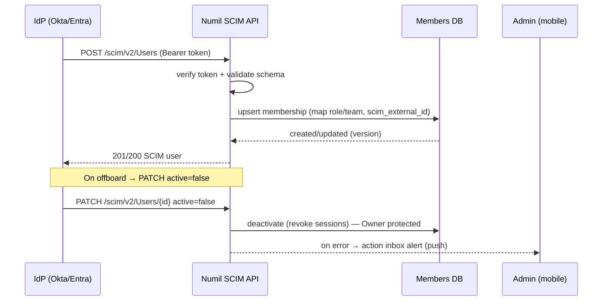

# 30 · Workspace Administration

> Follows the [Master PRD Template](./00-prd-template.md). This module is the **admin
> console** for a Numil workspace (tenant): org profile, deep member/role management,
> teams/departments/cost centers, security policies, SSO/SCIM configuration, data
> retention, and per-org feature toggles. It **complements** the day-to-day
> [Organization, Members & Roles](./13-organization-members-roles.md) surface — module 13
> is "manage my team", module 30 is "run the company workspace". Billing lives in
> [31 · Billing & Subscription](./31-billing-subscription.md); security posture in
> [40 · Security & Compliance Center](./40-security-compliance-center.md); flag delivery in
> [42 · Feature Flags & Remote Config](./42-feature-flags-remote-config.md).

---

## 1. Purpose

Workspace Administration is the control plane for a Numil organization — the **enterprise
admin console**. It defines organizational structure (teams, departments, cost centers),
governs *how* people join and authenticate (SSO/SCIM), sets *what the workspace can do*
(feature toggles, defaults, guardrails), and encodes *how long data lives* (retention).

**User problem it solves.** In small apps administration is an afterthought; in enterprise
tools (Atlassian Admin, Notion admin, Okta) it is a sprawling web console that never
translated to mobile. Numil's answer: a **clean mobile admin** that keeps the 5 daily jobs
(add person, fix a role, flip a policy, check usage, resolve a request) one thumb-tap away,
while honestly signaling that some deep flows are a **mobile view of a fuller web console**.

**User goals:** onboard/offboard fast and safely (ideally via SCIM); model the real company
(teams, departments, cost centers); set sane defaults once; see workspace health at a glance;
delegate without over-granting (least privilege).

**Business goals:** reduce time-to-value for new orgs and increase seat activation (drives
billing); make Numil defensible in procurement (RBAC depth, SSO/SCIM, retention, audit);
lower support load via self-serve admin + clear guardrails.

**KPIs:** seat activation rate, time-to-first-10-members, % orgs with SSO enforced, SCIM
provisioning success rate, admin task completion on mobile, feature-toggle adoption per org.

---

## 2. Navigation

**Entry points**
- **More tab → Admin** (visible only to Owner/Admin; Managers see a scoped read view).
- Workspace switcher → long-press an org → **Manage workspace**.
- Deep link `numil://admin` and section deep links: `numil://admin/members`,
  `numil://admin/teams`, `numil://admin/security`, `numil://admin/sso`,
  `numil://admin/retention`, `numil://admin/features`.
- From a related surface: "Manage roles" in [module 13](./13-organization-members-roles.md),
  "Security posture" jumps to [module 40](./40-security-compliance-center.md).

**Routes** (`src/app/admin/...`)
```text
src/app/admin/index.tsx            → Admin home (overview cards)
src/app/admin/members.tsx          → Members deep-dive (extends module 13)
src/app/admin/teams.tsx            → Teams / departments / cost centers
src/app/admin/roles.tsx            → Roles & custom roles
src/app/admin/security.tsx         → Security policies (delta of module 40)
src/app/admin/sso.tsx              → SSO / SCIM configuration
src/app/admin/retention.tsx        → Data retention & lifecycle
src/app/admin/features.tsx         → Feature toggles per org (module 42)
src/app/admin/usage.tsx            → Usage overview
```

**Hierarchy & breadcrumbs**
```text
Workspace ▸ Admin ▸ [Section] ▸ [Detail]
```
**Transitions:** Admin home is a **push** from More (full back stack). Section details open
as **push** on iPhone (deep, focused) and as a **two-pane master/detail** on iPad. Editors
(role picker, policy toggle rationale, SSO metadata paste) open as **nested bottom sheets**
so the admin never loses list context. **Modal vs push:** destructive confirmations
(delete team, disable SSO) are modal alerts requiring typed confirmation for high-blast-radius
actions.

---

## 3. Complete UI Layout

Admin home is a calm dashboard of **overview cards**; each drills into a focused section.
The "fuller web console" reality is acknowledged with an inline **"Open advanced on web"**
row on deep-config screens (SSO attribute mapping, bulk CSV) — the mobile app still does the
80% case natively.

```text
┌───────────────────────────────────────────────┐
│  ‹ More        Admin · Acme Inc         ⌕  ⋯  │  ← large title, Dynamic Island safe
├───────────────────────────────────────────────┤
│  Workspace health                               │
│  ┌───────────┐ ┌───────────┐ ┌───────────┐     │
│  │ 128 / 150 │ │  94 active │ │  38.2 GB  │     │  ← seats · active(7d) · storage
│  │  seats    │ │  this week │ │  of 100GB │     │
│  └───────────┘ └───────────┘ └───────────┘     │
│  ▸ 3 join requests · 1 SCIM error   [Review]    │  ← action inbox
├───────────────────────────────────────────────┤
│  Manage                                         │
│  👥 Members & roles                     128  ▸  │
│  🏢 Teams, departments & cost centers    12  ▸  │
│  🔐 Security policies              Enforced  ▸  │
│  🔗 SSO & SCIM                    Okta · on  ▸  │
│  🗄 Data retention               365d · hold ▸  │
│  🎚 Feature toggles                 18 on   ▸  │  → module 42
│  💳 Billing & plan                 Business ▸  │  → module 31
├───────────────────────────────────────────────┤
│  Recent admin activity                          │
│  • Priya changed Marco → Manager · 2h           │
│  • SCIM deprovisioned j.lee@acme · 5h           │
└───────────────────────────────────────────────┘
```

- **Top:** glass large-title nav bar "Admin · {Org}", search (jump to member/team),
  `⋯` overflow (export members CSV, audit log, transfer ownership).
- **Health strip:** three tappable KPI cards (seats, active users, storage) + an **action
  inbox** row surfacing join requests and SCIM/SSO errors — the single "what needs me now".
- **Manage list:** disclosure rows, each with a **status summary** on the right so you read
  state without opening — the progressive-disclosure spine.
- **Recent admin activity:** last few security-relevant events (full log in module 29).
- **Landscape / iPad:** iPad shows a persistent left section rail + right detail pane (true
  "console" feel); iPhone stays single-column; tab bar hidden in Admin.

---

## 4. Complete Component Breakdown

| Area | Components |
|------|-----------|
| Nav | `GlassNavBar`, `AdminSearchField`, `AdminOverflowMenu` (popover) |
| Health | `KpiCard` (seats/active/storage), `ActionInboxRow`, `UsageSparkline`, `SeatMeter` |
| Manage list | `DisclosureRow` (icon, title, `StatusSummaryChip`, chevron), `SectionGroup` |
| Members | `MemberList` (FlashList), `MemberRow` (avatar, name, email, `RoleBadge`, `StatusBadge`), `BulkSelectBar`, `RoleChangeSheet`, `InviteSheet`, `MemberDetailInspector` |
| Teams | `TeamCard`, `TeamTree` (indented department → team), `CostCenterChip`, `TeamEditorSheet`, `MemberPickerSheet`, `ReassignManagerSheet` |
| Roles | `RoleMatrixTable`, `CustomRoleBuilder` (permission allow-list), `PermissionToggleRow` |
| Security | `PolicyToggleRow`, `PolicyRationaleSheet`, `EnforcementBanner`, `PasswordPolicyEditor` |
| SSO/SCIM | `IdpCard` (Okta/Entra/Google), `SamlMetadataPaste`, `AttributeMapRow`, `ScimTokenField`, `TestConnectionButton`, `ProvisioningLogList` |
| Retention | `RetentionRuleRow`, `RetentionSimulator` (preview affected count), `LegalHoldBanner` |
| Features | `FeatureToggleRow` (name, scope, state), `RolloutStageChip`, `FlagDependencyNote` (→ module 42) |
| Usage | `UsageChart` (adoption), `TopProjectsList`, `InactiveSeatsList`, `ExportButton` |
| Feedback | `Skeleton`, `Toast` (undo), `ConfirmDialog` (typed confirm), `Banner` (offline/read-only), `WebConsoleHandoffRow` |

All primitives are defined in [03-design-system-ui.md](./03-design-system-ui.md).

---

## 5. Modern Features

Each feature: **Purpose · Workflow · UI · Permissions · Offline · API · DB · Notify · AC.**

**Module role permission matrix** (deltas over [shared/rbac-permissions.md](./shared/rbac-permissions.md);
all enforced server-side, client hides UI only):

| Admin action | Owner | Admin | Manager | Member | Guest |
|--------------|:-----:|:-----:|:-------:|:------:|:-----:|
| View admin home / usage | ✅ | ✅ | team-scoped | ❌ | ❌ |
| Bulk member ops (role/team/deactivate) | ✅ | ✅ (≤Admin) | ❌ | ❌ | ❌ |
| Create/edit teams & departments | ✅ | ✅ | own team members | ❌ | ❌ |
| Set cost centers | ✅ | ✅ | ❌ | ❌ | ❌ |
| Define custom roles 🟣 | ✅ | ✅ (no escalation) | ❌ | ❌ | ❌ |
| Configure SSO / SCIM | ✅ | ✅ | ❌ | ❌ | ❌ |
| Change security policies | ✅ | ✅ | ❌ | ❌ | ❌ |
| Edit retention / legal hold | ✅ | ✅* | ❌ | ❌ | ❌ |
| Toggle features (per org) | ✅ | ✅ | ❌ | ❌ | ❌ |
| Transfer ownership / delete org | ✅ | ❌ | ❌ | ❌ | ❌ |

`*` legal hold may require a delegated `retention.manage` permission (v2 custom roles).

### 5.1 Admin home & action inbox ✅
- **Purpose:** one screen that answers "is my workspace healthy and what needs me?"
- **Workflow:** open Admin → scan health strip → tap action inbox → resolve join requests /
  SCIM errors inline.
- **UI:** `KpiCard`s + `ActionInboxRow`; each inbox item expands to an approve/deny sheet.
- **Permissions:** Owner/Admin full; Manager read-only scoped to their teams.
- **Offline:** cached snapshot shown read-only with "as of {time}" stamp; actions queue-blocked.
- **API:** `GET /orgs/:id/admin/overview`.
- **DB:** aggregates from `orgs`, `memberships`, `usage_daily`.
- **Notify:** new join request / SCIM error → push to Admins (batched).
- **AC:** health numbers match billing seat count; inbox reflects unresolved items in realtime.

### 5.2 Member management deep-dive ✅ (extends [module 13](./13-organization-members-roles.md))
- **Purpose:** bulk + lifecycle operations beyond the simple members list.
- **Workflow:** search/filter (role, status, team, last-active, provisioned-by) → multi-select
  → bulk change role / add to team / deactivate / resend invite / export. Open a member to an
  **inspector** (profile, roles, teams, sessions, devices, activity summary, SCIM source).
- **UI:** `MemberList` with `BulkSelectBar`; `MemberDetailInspector` with tabs.
- **Permissions:** Admin can act on ≤ Admin; Owner on anyone; deactivate requires reassign
  step for open tasks. Managers: view-only for their teams.
- **Offline:** viewing cached OK; mutations require connectivity (banner explains).
- **API:** `GET /orgs/:id/members?filter[...]`, `POST /orgs/:id/members:bulk`.
- **DB:** `memberships`, `member_teams`, `sessions`, `devices`.
- **Notify:** role change / deactivation notifies the affected user + admins.
- **AC:** bulk ops are transactional per-item with a result report (succeeded/failed);
  deactivation offers task reassignment; personal tasks never exposed to admins.

### 5.3 Teams, departments & cost centers ✅
- **Purpose:** model org structure for reporting, defaults, and cost allocation.
- **Workflow:** create a **department** (top-level), nest **teams**, assign a **team lead**
  and members, tag a **cost center** code (e.g., `ENG-1042`) used by billing/reports. A member
  can belong to multiple teams; one is "primary".
- **UI:** `TeamTree` (indented), `TeamEditorSheet`, `CostCenterChip`, `MemberPickerSheet`.
- **Permissions:** Admin manage all; Manager manage own team membership (not create dept).
- **Offline:** read cached; edits online.
- **API:** `POST/PATCH/DELETE /orgs/:id/teams`, `POST /teams/:id/members`.
- **DB:** `teams` (parent_id self-ref for department nesting, cost_center), `member_teams`.
- **Notify:** added/removed from team → notify member + team lead.
- **AC:** nesting supports department → team (2 levels min); cost center flows to billing
  (module 31) and reports (module 16); deleting a team reassigns/detaches members safely.

### 5.4 Roles & custom roles 🟣 (builds on [shared/rbac-permissions.md](./shared/rbac-permissions.md))
- **Purpose:** least-privilege delegation beyond the 5 built-in roles.
- **Workflow:** view the built-in role matrix; (v2) create a **custom role** as an allow-list
  of granular permissions (`member.invite`, `automation.manage`, `report.view.team`,
  `retention.manage`, …); assign to members.
- **UI:** `RoleMatrixTable` (read), `CustomRoleBuilder` (permission toggles grouped by domain).
- **Permissions:** Owner + Admin; Admin cannot grant a permission they lack (no privilege
  escalation).
- **Offline:** read cached; edits online.
- **API:** `GET /orgs/:id/roles`, `POST/PATCH /orgs/:id/roles/custom`.
- **DB:** `custom_roles` (org_id, name, permissions[]), `memberships.role_id?`.
- **Notify:** role definition change → notify affected members; audit event.
- **AC:** custom role evaluated by the same `can()` function; guests remain share-scoped;
  changes take effect immediately (claims refresh).

### 5.5 SSO & SCIM configuration ✅ (SAML/OIDC) / 🔜 (SCIM)
- **Purpose:** centralize identity; automate provisioning/deprovisioning.
- **Workflow:** pick IdP (Okta/Entra/Google/generic) → paste SAML metadata **or** OIDC
  issuer → **Test connection** → map attributes (email, name, groups→teams, role) → toggle
  **Enforce SSO** (blocks password login) → (SCIM) generate a **bearer token + Base URL** to
  paste into the IdP for auto user lifecycle.
- **UI:** `IdpCard`, `SamlMetadataPaste`, `AttributeMapRow`, `ScimTokenField`,
  `TestConnectionButton`; a `WebConsoleHandoffRow` for the rarely-needed full attribute editor.
- **Permissions:** Owner/Admin only; enforcing SSO requires a confirmation (lockout warning).
- **Offline:** unavailable (security-sensitive; requires live validation).
- **API:** `GET/PUT /orgs/:id/sso`, `POST /orgs/:id/sso/test`, `GET/POST /orgs/:id/scim/token`.
- **DB:** `sso_config` (protocol, idp_metadata, attr_map, enforce), `scim_tokens`.
- **Notify:** SSO enforced/disabled → alert all admins; SCIM provisioning error → inbox + push.
- **AC:** JIT provisioning creates users with mapped role/team; deprovision deactivates
  within SLA; a **break-glass** local admin path survives SSO misconfig; token shown once.

**SCIM provisioning sequence** (IdP-driven lifecycle → Numil):


### 5.6 Security policies (delta of [module 40](./40-security-compliance-center.md)) ✅
- **Purpose:** set org-wide guardrails from a mobile-friendly toggle list.
- **Workflow:** toggle require 2FA, biometric app-lock, session lifetime, allowed sign-in
  methods, device allow-listing, external-guest policy, password policy; each toggle shows a
  plain-language rationale + blast radius ("affects 128 members").
- **UI:** `PolicyToggleRow` + `PolicyRationaleSheet`; `EnforcementBanner` when a change forces
  re-auth.
- **Permissions:** Owner/Admin.
- **Offline:** read cached; edits online.
- **API:** `GET/PUT /orgs/:id/security-policies` (canonical UI in module 40).
- **DB:** `security_policies` (org_id, key, value_json, updated_by, updated_at).
- **Notify:** policy change → members affected (e.g., "2FA now required by {date}").
- **AC:** enabling require-2FA grace-periods members with a deadline; disabling a factor is
  audited; deep controls link to module 40 without duplicating logic.

### 5.7 Data retention & lifecycle ✅
- **Purpose:** control how long tasks, comments, files, audit, and AI logs live.
- **Workflow:** define retention rules per data class (e.g., "delete completed tasks after
  365d", "purge audit after 730d") → a **simulator** previews affected record counts →
  legal hold **overrides** any deletion.
- **UI:** `RetentionRuleRow`, `RetentionSimulator`, `LegalHoldBanner`.
- **Permissions:** Owner/Admin; legal hold may require a `retention.manage` custom permission.
- **Offline:** read cached; edits online.
- **API:** `GET/PUT /orgs/:id/retention`, `POST /orgs/:id/retention/simulate`.
- **DB:** `retention_rules` (data_class, ttl_days, action), executed by a background purge job.
- **Notify:** rule change → admin confirmation + scheduled-purge preview notice.
- **AC:** legal hold blocks purge; simulator count matches actual purge; erasure requests
  (GDPR) honored per [module 40](./40-security-compliance-center.md).

### 5.8 Feature toggles per org ✅ (surface of [module 42](./42-feature-flags-remote-config.md))
- **Purpose:** enable/disable Numil capabilities per workspace (AI, automation, whiteboard,
  guests, integrations) — the entitlement-facing side of feature flags.
- **Workflow:** browse toggles grouped by domain; flip on/off; some are **plan-gated**
  (show upsell → module 31); some show rollout stage (`🧪 beta`).
- **UI:** `FeatureToggleRow` + `RolloutStageChip` + `FlagDependencyNote`.
- **Permissions:** Owner/Admin; plan-gated toggles require entitlement.
- **Offline:** last-known flags cached; edits online.
- **API:** `GET /orgs/:id/features`, `PUT /orgs/:id/features/:key`.
- **DB:** org overrides layered on flag defaults (see module 42 store).
- **Notify:** toggling a member-visible feature → optional broadcast.
- **AC:** flag changes propagate ≤60s; plan-gated flags cannot be force-enabled without
  entitlement; disabling a feature hides its UI gracefully everywhere.

### 5.9 Usage overview & seat reclamation ✅
- **Purpose:** understand adoption; reclaim idle seats to control cost.
- **Workflow:** view active vs. licensed seats, per-team adoption, storage, top projects, and
  **inactive seats (30/60/90d)** → one-tap deactivate or downgrade to Guest.
- **UI:** `UsageChart`, `InactiveSeatsList`, `ExportButton` (CSV → module 16/37).
- **Permissions:** Owner/Admin; Manager sees team-scoped usage.
- **Offline:** cached snapshot.
- **API:** `GET /orgs/:id/usage?range=`.
- **DB:** `usage_daily` rollups.
- **Notify:** monthly usage digest to Owner/Admin (opt-in).
- **AC:** seat counts reconcile with billing; inactive list is accurate to last-active;
  export excludes PII per policy.

---

## 6. Smart AI Features

AI here is **advisory for admins**, powered by [19 · AI Assistant & Copilot](./19-ai-assistant-copilot.md)
and governed centrally. Admin-scoped copilot actions (all proposal-first, audited):

| Capability | What it does for an admin |
|-----------|---------------------------|
| `admin_anomaly` | Flags unusual admin activity (mass role change, off-hours SSO disable). 🔜 |
| `seat_optimizer` | Recommends seats to reclaim from inactivity + projected savings. 🔜 |
| `role_review` | Suggests least-privilege downgrades ("3 Admins haven't used admin powers in 90d"). 🟣 |
| `policy_advisor` | Recommends security-policy hardening vs. peer benchmarks. 🟣 |
| `onboarding_draft` | Drafts a new-hire setup (team, role, starter projects) from a job title. 💡 |
| `nl_admin_query` | "Who was made Admin last month?" → read-only answer with citations. 🔜 |

Guardrails: admin AI is **read-only or proposal-first**, never auto-mutates roles/policies,
respects the org's AI governance toggle, and every suggestion is logged as `ai_invoked`
with `capability` + `accepted`. AI never surfaces personal-task content to admins.

---

## 7. Productivity Features

- **Bulk everything:** multi-select members/teams for role/team/deactivation ops with a
  single undo-able result report.
- **Templates:** save an **onboarding template** (role + teams + starter projects) applied on
  invite/SCIM-join to zero-touch new hires.
- **Saved admin views:** "Pending invites", "Inactive 60d", "Guests", "SCIM errors" as
  one-tap filters (mirrors [module 14](./14-search-filters-views.md)).
- **Quick actions** from the action inbox (approve join, resolve SCIM error) in place.
- **CSV import/export** of members and teams (bridges [module 37](./37-backup-import-export.md)).
- **Handoff to web** for rare deep-config tasks, with magic-link continuity.

---

## 8. Enterprise Features

- **RBAC + custom roles** (least privilege) and **ABAC** scoping — canonical model in
  [shared/rbac-permissions.md](./shared/rbac-permissions.md).
- **SSO (SAML 2.0 / OIDC) + SCIM 2.0** provisioning; **SSO enforcement** with break-glass.
- **Departments / teams / cost centers** feeding reports (module 16) and billing (module 31).
- **Data retention** + **legal hold** + **eDiscovery hooks** (deep in module 40).
- **Immutable admin audit** — every action recorded (who/what/before→after/when), streamed to
  [29 · Activity Feed & Audit Logs](./29-activity-feed-audit-logs.md) and optionally a **SIEM**.
- **Multi-workspace org** 🟣; **delegated administration** scoped to departments/teams.
- **Ownership transfer** and **org deletion** (Owner-only, typed confirmation, cooling-off).

---

## 9. Collaboration Features

- **Admin activity feed** shared among admins (who changed what) — reduces "who did this?".
- **Join-request workflow:** member requests access → admin approves/denies with a note.
- **@mention an admin** in a policy rationale note (e.g., "@Owner approve enforcing SSO").
- **Shared admin runbooks** 💡: pin a checklist ("Quarterly access review") the team works through.
- **Change proposals** 🟣: a high-blast-radius change (disable SSO) needs a second admin's
  approval (four-eyes principle).

---

## 10. Offline Architecture

Deltas over [shared/offline-sync-engine.md](./shared/offline-sync-engine.md):
- Admin **reads** (overview, members, teams, current policies/flags) are cached and shown
  read-only offline with an "as of {time}" stamp.
- Admin **mutations** are **online-only** by design (role/policy/SSO/retention changes are
  security-sensitive and require server validation + fresh state). The UI clearly disables
  actions with an offline banner rather than queuing risky ops.
- Feature-flag values are cached for gating the member app offline; admin edits are not.
- The action inbox reconciles on reconnect (a request may already be resolved by another
  admin → item collapses with a notice).

---

## 11. Security

Deltas over [shared/security-baseline.md](./shared/security-baseline.md); admin-facing
posture is owned by [40 · Security & Compliance Center](./40-security-compliance-center.md):
- Every admin route is guarded by `can(actor, 'org.admin.*', org)` server-side; the client
  only hides UI.
- **Privilege-escalation prevention:** an Admin cannot grant roles/permissions above their
  own, nor grant permissions they lack.
- **Sensitive actions require step-up re-auth** (biometric): disable SSO, delete team,
  transfer ownership, mint SCIM token.
- **SCIM tokens** are shown once, hashed at rest, scoped, and rotatable/revocable.
- **Break-glass** local Owner login always survives SSO misconfiguration.
- All admin actions produce **immutable audit** events; personal-task content is never exposed
  to admins regardless of role.

---

## 12. Notification System

Deltas over [12 · Notifications & Alerts](./12-notifications-alerts.md):
- Emits: join request received, SCIM/SSO error, member deactivated/removed, role changed,
  policy changed, retention purge scheduled, seat threshold reached (→ billing), ownership
  transfer initiated.
- **Admin-critical alerts** (SSO disabled, mass role change, break-glass used) are
  high-priority + optionally emailed to all admins and pushed even under focus modes.
- Action buttons on notifications: **Approve / Deny** (join request), **Open** (SCIM error).
- Digest option batches non-critical admin notices into a daily summary.

---

## 13. Accessibility

Deltas over [shared/accessibility-spec.md](./shared/accessibility-spec.md):
- KPI cards announce label + value + trend ("Seats, 128 of 150, up 4 this week").
- Policy toggles announce state + consequence ("Require 2FA, off, enabling affects 128
  members"); confirmation dialogs are focus-trapped and readable.
- Member/team rows expose `accessibilityActions` (Change role, Add to team, Deactivate).
- The role matrix table is navigable cell-by-cell with row/column headers announced.
- Typed-confirmation fields announce the exact phrase required; no color-only status.

---

## 14. Animations

Deltas over [shared/animation-spec.md](./shared/animation-spec.md):
- Disclosure rows expand with `spring.gentle`; status chips cross-fade on state change
  (`motion.fast`).
- Bulk-select bar slides up (`motion.base`); selected rows tick with `impactLight` haptic.
- Destructive confirmations use a deliberate, slightly slower reveal (no bounce) to signal
  gravity; `notificationWarning` haptic on confirm.
- Reduce Motion: replace expands/slides with 120ms cross-fades; no celebratory motion in
  admin (this is a serious surface).

---

## 15. Performance

- Member list virtualized (FlashList) with server-side filtering; never fetch-all-then-filter
  (also a security rule per RBAC query scoping).
- Overview aggregates precomputed server-side (`usage_daily`), cached ~5m; charts lazy.
- Section screens code-split (`admin/*` lazy routes); SSO/SCIM editors lazy-imported.
- Bulk ops stream a per-item result to keep UI responsive on large selections.
- Realtime admin feed diffed by `version`; ignore self-echo.
- Screen open target <200ms from cache; large orgs (>10k members) paginate with search-first.

---

## 16. Database Design

Aligns with [17 · Data Model & API](./17-data-model-api.md).

```text
orgs(id, name, slug, logo_url, industry, default_tz, default_reminder_time,
     default_member_role, members_can_create_projects, default_project_visibility,
     owner_id, plan_id, created_at, updated_at, deleted_at?)
memberships(id, org_id→orgs, user_id, role, role_id?→custom_roles, status,
     primary_team_id?→teams, provisioned_by(enum: manual|invite|scim), scim_external_id?,
     invited_by?, joined_at?, last_active_at?, deactivated_at?)   UNIQUE(org_id,user_id)
teams(id, org_id→orgs, parent_id?→teams, kind(enum: department|team), name,
     lead_user_id?, cost_center, created_at, deleted_at?)
member_teams(membership_id→memberships, team_id→teams, is_primary)  PK(membership_id,team_id)
custom_roles(id, org_id→orgs, name, permissions[], created_by, created_at, deleted_at?)
sso_config(org_id→orgs, protocol(enum: saml|oidc), idp_metadata_json, attr_map_json,
     enforce, break_glass_enabled, updated_by, updated_at)
scim_tokens(id, org_id→orgs, token_hash, scopes[], last_used_at?, created_by,
     created_at, revoked_at?)
security_policies(org_id→orgs, key, value_json, updated_by, updated_at)  PK(org_id,key)
retention_rules(id, org_id→orgs, data_class, ttl_days, action(enum: soft_delete|purge|anonymize),
     legal_hold, updated_by, updated_at)
feature_overrides(org_id→orgs, flag_key, value_json, updated_by, updated_at) PK(org_id,flag_key)
usage_daily(org_id→orgs, day, active_users, seats_used, storage_bytes, tasks_created,
     projects_active)  PK(org_id,day)
admin_audit(id, org_id→orgs, actor_id, action, target_type, target_id?, before_json,
     after_json, ip, created_at)   -- immutable, mirrored to module 29
join_requests(id, org_id→orgs, user_id, requested_role, note?, status, decided_by?, created_at)
```

**Indexes:** `memberships(org_id, status)`, `memberships(org_id, last_active_at)`
(inactive-seat queries), `memberships(org_id, scim_external_id)`, `teams(org_id, parent_id)`,
`admin_audit(org_id, created_at)`, `usage_daily(org_id, day)`.
**Constraints:** `role_id` XOR built-in `role`; `primary_team_id` ∈ member's teams; cost
center format validated; `sso_config.enforce=true` requires ≥1 verified admin + break-glass.
**Soft delete** via `deleted_at`; **audit** append-only. Retention purge respects `legal_hold`.

---

## 17. API Design

Follows [shared/api-conventions.md](./shared/api-conventions.md). All routes require
Owner/Admin (or scoped custom permission); Managers get read-only scoped subsets.

| Method | Path | Purpose |
|--------|------|---------|
| GET | `/orgs/:id/admin/overview` | Health KPIs + action inbox |
| GET | `/orgs/:id/members?filter[...]&cursor=` | Member deep-dive list |
| POST | `/orgs/:id/members:bulk` | Bulk role/team/deactivate ops |
| GET | `/orgs/:id/members/:mid` | Member inspector (roles/teams/sessions/devices) |
| GET/POST/PATCH/DELETE | `/orgs/:id/teams` · `/teams/:tid` | Teams/departments/cost centers |
| POST/DELETE | `/teams/:tid/members` | Team membership |
| GET/POST/PATCH | `/orgs/:id/roles` · `/roles/custom` | Roles & custom roles |
| GET/PUT | `/orgs/:id/sso` | SSO config |
| POST | `/orgs/:id/sso/test` | Validate IdP connection |
| GET/POST/DELETE | `/orgs/:id/scim/token` | SCIM bearer token lifecycle |
| (SCIM) | `/scim/v2/Users` · `/scim/v2/Groups` | IdP-driven provisioning |
| GET/PUT | `/orgs/:id/security-policies` | Org security guardrails |
| GET/PUT | `/orgs/:id/retention` · `POST /retention/simulate` | Retention + preview |
| GET/PUT | `/orgs/:id/features` · `/features/:key` | Feature toggles (module 42) |
| GET | `/orgs/:id/usage?range=` | Usage overview |
| GET | `/orgs/:id/admin/audit?cursor=` | Admin audit (mirrors module 29) |
| POST | `/orgs/:id/join-requests/:jid:decide` | Approve/deny join request |
| POST | `/orgs/:id/transfer-ownership` | Owner-only, step-up auth |

**Realtime:** channel `org:{id}` — `member.updated`, `role.changed`, `policy.changed`,
`scim.error`, `join_request.created`, `usage.updated`. **Errors:** `403 forbidden` (scope/
escalation), `409 conflict` (stale policy version, `If-Match`), `422 validation_failed`
(bad attr map/cost center), `429 rate_limited`. **Idempotency-Key** on all mutations;
`If-Match` on policy/SSO/retention edits.

**Sample request/response — bulk role change**
```http
POST /v1/orgs/acme/members:bulk
Idempotency-Key: 5c1f...  X-Org-Id: acme
{ "op": "change_role", "role": "manager",
  "memberIds": ["u_91", "u_92", "u_93"] }
```
```json
{ "data": { "requested": 3, "succeeded": 2,
    "results": [
      { "memberId": "u_91", "ok": true, "role": "manager", "version": 8 },
      { "memberId": "u_92", "ok": true, "role": "manager", "version": 5 },
      { "memberId": "u_93", "ok": false, "error": { "code": "forbidden",
        "message": "Cannot elevate above your role" } }
    ] },
  "meta": { "requestId": "req_7ab" } }
```

---

## 18. Edge Cases

- **Last Owner leaves/deactivated:** blocked; must transfer ownership first.
- **Admin demotes self / removes own admin power:** requires confirmation; blocked if it
  would leave zero admins.
- **SSO enforced but IdP down:** break-glass local Owner login remains; members see a clear
  "sign in via {IdP}" with support link.
- **SCIM deprovision of the Owner:** ignored (Owner protected); logged + admin alerted.
- **SCIM name/email conflict** (two IdP users → one email): provisioning error surfaced in
  action inbox with resolution guidance.
- **Cost center collides / invalid format:** validation error; existing allocations untouched.
- **Retention rule would purge legally-held data:** purge skips held records; simulator warns.
- **Feature toggle plan-gated off after downgrade:** feature hides gracefully; data retained,
  read-only where sensible (see module 31 entitlements).
- **Concurrent admin edits** (two admins change the same policy): `If-Match` conflict → show
  the other's change + merge/overwrite choice.
- **Deleting a team with a primary-team dependency:** members' `primary_team` reassigned or
  cleared with notice.
- **Offline admin attempt:** mutation disabled with banner; reads served from cache.
- **Bulk op partial failure:** per-item result report; no all-or-nothing surprise.
- **Retention windows:** TTLs computed in UTC; displayed in org default tz (DST-safe).

---

## 19. User States

- **First-time admin (new org):** guided setup checklist (invite team, set defaults, connect
  SSO) with progress; empty states coach each section.
- **Returning admin:** dashboard-first; action inbox highlights changes.
- **Owner:** sees billing + transfer/delete org; can do everything an Admin can.
- **Admin:** everything except billing/delete-org; cannot escalate above self.
- **Delegated/scoped admin** 🟣: sees only assigned departments/teams.
- **Manager:** read-only team-scoped views; no policy/SSO access.
- **Member/Guest:** Admin section hidden (deep link → "not authorized").
- **Offline / poor network:** cached read-only snapshot; actions disabled with banner.
- **Large org (>10k members):** search-first UX; lists paginate; heavy exports run async.
- **iPad/landscape:** two-pane console; **dark mode / large text / a11y** fully supported.

---

## 20. Analytics Events

Schema per [shared/analytics-taxonomy.md](./shared/analytics-taxonomy.md). No PII/task
content in properties.

| event | key properties |
|-------|----------------|
| `admin_opened` | `section` (home/members/teams/security/sso/retention/features/usage) |
| `member_role_changed` | `from_role`, `to_role`, `bulk`, `count` |
| `member_deactivated` | `via` (manual/scim/bulk), `reassigned_tasks` |
| `team_created` / `team_updated` / `team_deleted` | `kind` (department/team), `has_cost_center` |
| `custom_role_created` | `permission_count` |
| `sso_configured` | `protocol` (saml/oidc), `provider` |
| `sso_enforced` | `enabled` |
| `scim_provisioned` | `action` (create/update/deactivate), `ok` |
| `security_policy_changed` | `key`, `enabled` |
| `retention_rule_changed` | `data_class`, `ttl_days`, `action` |
| `retention_simulated` | `data_class`, `affected_count_bucket` |
| `feature_toggled` | `flag_key`, `enabled`, `plan_gated` |
| `join_request_decided` | `decision` (approve/deny) |
| `usage_exported` | `range`, `format` |
| `ownership_transferred` | — |
| `ai_invoked` | `capability`, `accepted`, `latency_ms` |

---

## 21. Acceptance Criteria

1. Admin section is visible only to Owner/Admin; Managers get read-only scoped views; others get "not authorized".
2. Admin home shows seats, active users (7d), and storage matching billing/usage sources.
3. The action inbox surfaces join requests and SCIM/SSO errors and updates in realtime.
4. Member deep-dive supports filter by role/status/team/last-active/provisioned-by.
5. Bulk role change/add-to-team/deactivate returns a per-item result report with undo where safe.
6. Deactivating a member offers reassignment of their open tasks before completing.
7. An Admin cannot elevate a member above the Admin's own role (no privilege escalation).
8. Personal-task content is never visible to any admin, in any view.
9. Teams support department → team nesting with a team lead and members.
10. A member can belong to multiple teams with exactly one primary team.
11. Cost center codes validate and propagate to billing (module 31) and reports (module 16).
12. Deleting a team safely reassigns/clears affected members' primary team.
13. Built-in role matrix is viewable; custom roles (v2) evaluate via the same `can()` function.
14. SSO can be configured via SAML metadata or OIDC issuer with a working Test Connection.
15. Attribute mapping maps email/name/groups→teams/role; JIT provisioning uses it.
16. Enforcing SSO warns of lockout and preserves a break-glass local Owner login.
17. SCIM token is shown once, hashed at rest, scoped, and revocable/rotatable.
18. SCIM create/update/deactivate reflects in members within the stated SLA; errors surface in the inbox.
19. SCIM deprovision cannot deactivate the Owner.
20. Security policies (2FA, app-lock, session lifetime, sign-in methods, device allow-list) toggle with rationale + blast-radius text.
21. Enabling require-2FA sets a grace deadline communicated to members.
22. Sensitive actions (disable SSO, delete team, mint SCIM token, transfer ownership) require step-up re-auth.
23. Retention rules configurable per data class; simulator preview matches actual purge counts.
24. Legal hold overrides retention purge for held records.
25. Feature toggles reflect plan entitlements; plan-gated features can't be force-enabled.
26. Feature-toggle changes propagate to member apps within ~60s.
27. Usage overview shows per-team adoption, storage, and inactive-seat lists (30/60/90d).
28. Seat counts in usage reconcile exactly with billing seat counts.
29. Every admin mutation writes an immutable audit event (actor/action/before→after/when).
30. Admin audit is viewable in-app and mirrored to module 29 (and SIEM if configured).
31. All admin mutations are enforced server-side; the client only hides/disables UI.
32. Admin reads work offline (cached, "as of {time}"); mutations are disabled offline with a clear banner.
33. Concurrent policy edits use If-Match; conflicts show the other change with merge/overwrite.
34. The last Owner cannot leave/deactivate without transferring ownership first.
35. An action leaving zero admins is blocked with explanation.
36. Ownership transfer and org deletion are Owner-only with typed confirmation and cooling-off.
37. Bulk operations never behave all-or-nothing; partial success is reported clearly.
38. iPad shows a two-pane console; iPhone stays single-column; tab bar hidden in Admin.
39. VoiceOver announces KPI values, policy states + consequences, and matrix cells; typed-confirm phrase is announced.
40. Analytics events fire with correct properties and never include PII/task content.
41. Admin AI suggestions are read-only or proposal-first and never auto-mutate roles/policies.
42. Deep-config handoff to web resumes exactly where the admin left off (magic link).

---

## 22. Future Roadmap

- **V1 (✅):** Admin home + action inbox, member deep-dive + bulk ops, teams/departments/cost
  centers, security-policy toggles, SSO (SAML/OIDC), retention rules + legal hold, feature
  toggles, usage overview, admin audit, ownership transfer.
- **V1.1 (🔜):** SCIM 2.0 provisioning, onboarding templates, NL admin query, seat optimizer,
  admin anomaly alerts, saved admin views.
- **V2 (🟣):** custom roles builder, delegated/scoped administration, four-eyes change
  proposals, multi-workspace parent org, role-review AI, policy advisor.
- **Future (💡):** shared admin runbooks, HRIS-driven org-chart sync, AI new-hire setup
  drafting, cross-org benchmarking.
- **Experimental (🧪):** autonomous compliance agent that proposes + stages access reviews.
- **AI track:** natural-language admin console, anomaly + least-privilege intelligence.
- **Enterprise track:** SIEM streaming, delegated admin scopes, data-residency-aware admin,
  eDiscovery + legal-hold console (with module 40).
