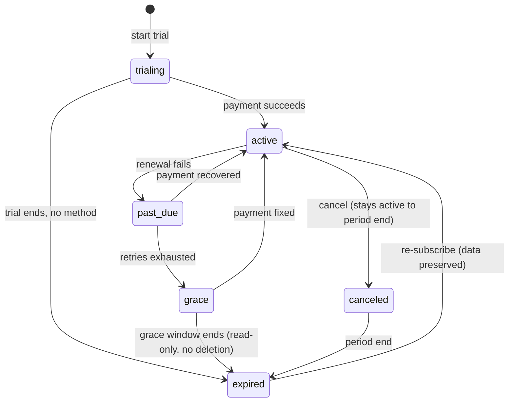

# 31 · Billing & Subscription

> Follows the [Master PRD Template](./00-prd-template.md). This module owns **plans/tiers,
> seats, AI credits, payment, invoices, proration, dunning, and enterprise contracts** for a
> Numil workspace, and translates what a workspace **paid for** into **entitlements** that
> gate features via [42 · Feature Flags & Remote Config](./42-feature-flags-remote-config.md).
> It is Owner-facing and sits beside [30 · Workspace Administration](./30-workspace-administration.md)
> (seats/usage) and [19 · AI Assistant & Copilot](./19-ai-assistant-copilot.md) (AI credits).
> Because Numil ships on iOS, this module explicitly reconciles **Apple In-App Purchase (IAP)
> policy** with web/enterprise billing.

---

## 1. Purpose

Billing turns Numil from an app into a business. It must make paying **calm and trustworthy**
for a solo user upgrading in one tap, and **auditable and contract-grade** for a 500-seat
enterprise with a purchase order. The hard part is doing both **without violating Apple's App
Store rules** while still offering the flexible SaaS billing (seats, proration, invoices,
credits) that enterprises expect.

**User problem it solves.** Team admins need to buy the right plan, add/remove seats, top up
AI credits, understand what they're paying for, retrieve invoices for finance, and never be
surprised by a charge or a sudden loss of features. Apple's rules make the *purchase surface*
non-trivial (what can be bought in-app vs. on the web); Numil hides that complexity behind a
clear UI.

**User goals**
- Upgrade/downgrade in seconds; understand price before confirming.
- Add/remove seats and see prorated cost immediately.
- Buy or auto-refill **AI credits** without leaving flow.
- Get invoices/receipts finance will accept; manage payment methods.
- Never lose data on downgrade; understand exactly what changes.

**Business goals**
- Maximize conversion + expansion (seats, AI credits, tier upgrades) while staying
  Apple-compliant.
- Minimize involuntary churn via robust **dunning**.
- Support enterprise motions (quotes, POs, annual contracts, custom entitlements).

**KPIs:** trial→paid conversion, seat expansion (net revenue retention), AI-credit attach
rate, involuntary churn (dunning recovery %), invoice self-serve rate, `checkout_completed`
by channel (IAP vs. web), refund rate.

---

## 2. Navigation

**Entry points**
- **More → Admin → Billing & plan** (Owner; Admin sees read-only unless delegated).
- Upsell entry points across the app: quota banners (AI credits low), seat-limit prompts,
  plan-gated feature taps (→ "Upgrade to use Automation").
- Deep links: `numil://billing`, `numil://billing/plans`, `numil://billing/credits`,
  `numil://billing/invoices`, `numil://billing/payment`.

**Routes** (`src/app/billing/...`)
```text
src/app/billing/index.tsx      → Billing home (current plan, seats, credits, next invoice)
src/app/billing/plans.tsx      → Plan comparison + change plan
src/app/billing/seats.tsx      → Manage seats (add/remove, proration preview)
src/app/billing/credits.tsx    → AI credits (balance, buy, auto-refill)
src/app/billing/invoices.tsx   → Invoice/receipt history
src/app/billing/payment.tsx    → Payment methods / billing details
src/app/billing/enterprise.tsx → Contract summary (read-only for annual/PO orgs)
```

**Hierarchy & breadcrumbs**
```text
Workspace ▸ Admin ▸ Billing ▸ [Plans | Seats | Credits | Invoices | Payment]
```
**Transitions:** Billing home is a **push** from Admin. **Checkout** presents as a focused
**modal sheet** (Apple's native purchase sheet for IAP; an in-app browser / hosted checkout
for web billing where permitted). Plan comparison uses a horizontal **segmented/carousel**.
**Modal vs push:** irreversible confirmations (cancel plan, remove seats) are modal alerts
with proration/impact spelled out.

---

## 3. Complete UI Layout

Billing home is a **status-first** screen: what you're on, what's next, what needs attention.
Purchase surfaces adapt to channel (IAP vs. web) and Apple policy.

```text
┌───────────────────────────────────────────────┐
│  ‹ Admin       Billing · Acme Inc         ⋯    │  ← large title
├───────────────────────────────────────────────┤
│  Business plan · Annual                         │
│  ┌───────────────────────────────────────────┐ │
│  │ Seats  128 / 150 used     [ Manage seats ] │ │
│  │ ▓▓▓▓▓▓▓▓▓▓▓▓▓▓▓░░  85%                     │ │  ← seat meter
│  └───────────────────────────────────────────┘ │
│  ┌───────────────────────────────────────────┐ │
│  │ AI credits  12,400 left   [ Buy credits ]  │ │
│  │ ▓▓▓▓▓░░░░░  auto-refill: on @ 2,000        │ │  ← credit meter
│  └───────────────────────────────────────────┘ │
│  Next invoice  $2,970.00 on Aug 1              │
├───────────────────────────────────────────────┤
│  ⚠ Payment method expires next month  [Update] │  ← dunning/attention banner
├───────────────────────────────────────────────┤
│  [ Change plan ]  [ Invoices ]  [ Payment ]     │
├───────────────────────────────────────────────┤
│  Purchased on: Web billing (Stripe)             │  ← channel disclosure
│  Manage subscription ↗ (opens billing portal)   │
└───────────────────────────────────────────────┘
```

- **Top:** large-title "Billing · {Org}"; `⋯` overflow (download W-9/tax docs, contact
  sales, redeem code, cancel plan).
- **Plan card:** current tier + term (monthly/annual), **seat meter**, **AI credit meter**
  with auto-refill state, and the **next invoice** amount/date.
- **Attention banner:** dunning/expiry/quota — the single "act now" affordance.
- **Actions:** Change plan / Invoices / Payment.
- **Channel disclosure:** honestly states whether the subscription is **App Store (IAP)** or
  **Web billing (Stripe)** or **Enterprise contract**, because management differs per channel
  (Apple requires you manage IAP subs in Settings/App Store).
- **iPad/landscape:** two-pane — plan/seats left, invoices/payment right. **Tab bar hidden.**

---

## 4. Complete Component Breakdown

| Area | Components |
|------|-----------|
| Nav | `GlassNavBar`, `BillingOverflowMenu` (tax docs, redeem code, contact sales, cancel) |
| Home | `PlanCard`, `SeatMeter`, `CreditMeter`, `NextInvoiceRow`, `AttentionBanner`, `ChannelDisclosureRow` |
| Plans | `PlanComparison` (segmented/carousel), `PlanColumn`, `FeatureCheckRow`, `TermToggle` (monthly/annual), `PriceLabel`, `UpgradeCTA` |
| Seats | `SeatStepper`, `ProrationPreviewCard`, `SeatBreakdownList` (by team/cost center) |
| Credits | `CreditBalance`, `CreditPackGrid`, `AutoRefillToggle`, `RefillThresholdStepper`, `CreditUsageChart` |
| Checkout | `IAPProductSheet` (StoreKit), `WebCheckoutBrowser`, `PurchaseConfirmSheet`, `ReceiptCard` |
| Invoices | `InvoiceList` (FlashList), `InvoiceRow`, `InvoiceDetail` (line items), `DownloadPdfButton` |
| Payment | `PaymentMethodRow` (card/Apple Pay/ACH/invoice), `AddPaymentSheet`, `BillingAddressForm`, `TaxIdField` |
| Enterprise | `ContractSummaryCard`, `PoReference`, `RenewalRow`, `SalesContactButton` |
| Entitlements | `EntitlementBadge`, `PlanGateBanner` (→ upgrade), `GracePeriodChip` |
| Feedback | `Skeleton`, `Toast` (undo where safe), `ConfirmDialog`, `Banner` (offline/dunning), `RestorePurchasesButton` |

Primitives defined in [03-design-system-ui.md](./03-design-system-ui.md).

---

## 5. Modern Features

Each feature: **Purpose · Workflow · UI · Permissions · Offline · API · DB · Notify · AC.**

**Module role permission matrix** (deltas over [shared/rbac-permissions.md](./shared/rbac-permissions.md);
billing is Owner-centric — `billing.manage` / `billing.view` are delegable via v2 custom roles):

| Billing action | Owner | Admin | Manager | Member | Guest |
|----------------|:-----:|:-----:|:-------:|:------:|:-----:|
| View plan / seats / credits | ✅ | ✅ | ❌ | ❌ | ❌ |
| Change plan / term | ✅ | `billing.manage` | ❌ | ❌ | ❌ |
| Add/remove seats | ✅ | `billing.manage` | ❌ | ❌ | ❌ |
| Buy AI credits / auto-refill | ✅ | `billing.manage` | ❌ | ❌ | ❌ |
| Manage payment methods | ✅ | `billing.manage` | ❌ | ❌ | ❌ |
| View / download invoices | ✅ | ✅ (`billing.view`) | ❌ | ❌ | ❌ |
| View contract summary | ✅ | ✅ | ❌ | ❌ | ❌ |
| Receive dunning / invoices (contact) | ✅ | finance contact | finance contact | finance contact | ❌ |
| Cancel / transfer / delete (billing side) | ✅ | ❌ | ❌ | ❌ | ❌ |

### 5.1 Plans & tiers ✅
- **Purpose:** map value to price (Free, Pro, Business, Enterprise).
- **Workflow:** compare tiers → pick term (monthly/annual, annual discounted) → change plan;
  upgrades apply immediately (prorated), downgrades apply at period end (data preserved).
- **UI:** `PlanComparison` + `TermToggle` + `PriceLabel`; feature checklist per tier.
- **Permissions:** Owner (Admin read-only unless `billing.manage` delegated).
- **Offline:** read cached plan; changes online only.
- **API:** `GET /orgs/:id/plans`, `POST /orgs/:id/subscription:change`.
- **DB:** `subscriptions`, `plans`.
- **Notify:** plan change confirmation to Owner/Admins.
- **AC:** upgrade prorates and takes effect instantly; downgrade schedules at period end with
  an impact summary; entitlements update accordingly (5.10).

### 5.2 Seat management & proration ✅
- **Purpose:** pay for the right number of licensed users.
- **Workflow:** stepper add/remove seats → **proration preview** (exact prorated charge/credit
  now) → confirm. Seats can be viewed **by team/cost center** for chargeback.
- **UI:** `SeatStepper`, `ProrationPreviewCard`, `SeatBreakdownList`.
- **Permissions:** Owner/`billing.manage`.
- **Offline:** unavailable (needs live proration compute).
- **API:** `POST /orgs/:id/seats:preview`, `POST /orgs/:id/seats:change`.
- **DB:** `subscriptions.seats`, `seat_allocations(team_id, cost_center, count)`.
- **Notify:** seat change confirmation; when seats hit 90%/100%, alert Owner/Admin (→ module 30 usage).
- **AC:** proration preview equals the actual charge; removing seats below active members is
  blocked (must deactivate first via module 30); breakdown reconciles with usage.

### 5.3 AI credits (links to [module 19](./19-ai-assistant-copilot.md)) ✅
- **Purpose:** meter AI usage as consumable credits atop seat plans.
- **Workflow:** view balance + burn rate; buy a **credit pack**; enable **auto-refill** at a
  threshold; view usage by capability/team.
- **UI:** `CreditMeter`, `CreditPackGrid`, `AutoRefillToggle`, `CreditUsageChart`.
- **Permissions:** Owner/`billing.manage`; usage visible to Admin.
- **Offline:** last balance cached (read-only); purchase online.
- **API:** `GET /orgs/:id/ai/credits`, `POST /orgs/:id/ai/credits:purchase`,
  `PUT /orgs/:id/ai/credits/auto-refill`.
- **DB:** `ai_credit_ledger` (append-only: grants, purchases, consumption), `ai_credit_balance`.
- **Notify:** low-balance warning (80%/95%), auto-refill executed, refill failed → dunning.
- **AC:** balance = sum(ledger); consumption debits atomically with AI actions
  (`ai_actions.cost`); auto-refill respects a monthly cap; exhaustion degrades AI gracefully,
  never the core app.

### 5.4 App Store IAP vs. web billing ✅ (Apple policy core)
- **Purpose:** collect payment correctly per platform + Apple rules.
- **Workflow:** individual/small in-app purchases (Pro seat, credit packs, consumables) use
  **StoreKit IAP** with Apple's native sheet; larger/enterprise/seat-based subscriptions use
  **web billing** (Stripe) initiated **outside** a blocked in-app CTA per current App Store
  guidelines. The app **reads entitlements** regardless of channel.
- **UI:** `IAPProductSheet` (StoreKit) for consumables/simple subs; `WebCheckoutBrowser` or
  external-link-out for account-level web billing (compliant with the reader/multi-platform
  and external-purchase-link entitlements where applicable); `RestorePurchasesButton`.
- **Permissions:** Owner/`billing.manage`.
- **Offline:** unavailable.
- **API:** `POST /billing/iap/verify` (App Store Server API / receipt validation +
  `App Store Server Notifications v2` webhook), `POST /billing/web/checkout` (Stripe session).
- **DB:** `iap_transactions`, `subscriptions.channel` (`app_store|web|enterprise`).
- **Notify:** purchase confirmation; renewal/refund via App Store server notifications.
- **AC:** IAP purchases validated server-side (never trust the client); **Restore Purchases**
  works; web subscriptions never show a blocked in-app purchase button; entitlements identical
  across channels; refunds/renewals from Apple reconcile automatically. See §18 for policy nuances.

### 5.5 Invoices & receipts ✅
- **Purpose:** finance-grade documentation of every charge.
- **Workflow:** browse invoice history → open line-item detail → download PDF; App Store
  purchases show an **Apple receipt** pointer (Apple issues those); web/enterprise show full
  tax invoices.
- **UI:** `InvoiceList`, `InvoiceDetail`, `DownloadPdfButton`.
- **Permissions:** Owner/Admin (`billing.view`).
- **Offline:** cached list read-only; PDFs cached after first fetch.
- **API:** `GET /orgs/:id/invoices?cursor=`, `GET /invoices/:id`, `GET /invoices/:id/pdf`.
- **DB:** `invoices`, `invoice_line_items`.
- **Notify:** invoice issued / payment succeeded / failed.
- **AC:** every web/enterprise charge has a downloadable invoice with tax breakdown; IAP shows
  the correct Apple-managed receipt guidance; totals reconcile with ledger.

### 5.6 Payment methods & billing details ✅
- **Purpose:** manage how the org pays (web/enterprise channels).
- **Workflow:** add card / Apple Pay / ACH / "invoice me" (enterprise); set billing address,
  tax ID/VAT; set a **default** method; update on expiry.
- **UI:** `PaymentMethodRow`, `AddPaymentSheet`, `BillingAddressForm`, `TaxIdField`.
- **Permissions:** Owner/`billing.manage`.
- **Offline:** unavailable.
- **API:** `GET/POST/DELETE /orgs/:id/payment-methods`, `PUT /orgs/:id/billing-details`.
- **DB:** `payment_methods` (tokenized — **PSP token only, no PAN**), `billing_details`.
- **Notify:** card expiring soon; method added/removed.
- **AC:** card data never touches Numil servers (PSP tokenization; PCI SAQ-A); tax ID
  validated; default method used for renewals/dunning. IAP has no card management in-app
  (managed by Apple ID).

### 5.7 Proration, upgrades & downgrades ✅
- **Purpose:** fair, predictable money movement on mid-cycle changes.
- **Workflow:** upgrades → immediate proration (credit unused + charge new); downgrades →
  scheduled at period end (retain data, show what will change); term switch (monthly→annual)
  applies credit.
- **UI:** `ProrationPreviewCard`, `PlanGateBanner`, `GracePeriodChip`.
- **Permissions:** Owner/`billing.manage`.
- **Offline:** unavailable.
- **API:** `POST /orgs/:id/subscription:preview` (returns proration lines).
- **DB:** `subscriptions` (current + scheduled changes), `proration_previews` (ephemeral).
- **Notify:** scheduled downgrade reminder before it applies.
- **AC:** preview matches invoice exactly; downgrade never deletes data; scheduled changes are
  cancelable before they apply.

### 5.8 Dunning & failed payments ✅
- **Purpose:** recover failed charges without abrupt lockout.
- **Workflow:** on failure → retry schedule (smart retries), in-app + email banners, grace
  period with full access, then graceful **read-only / feature-gated** degradation, never data
  deletion. Owner can fix the method to restore instantly.
- **UI:** `AttentionBanner`, `GracePeriodChip`, `PlanGateBanner`.
- **Permissions:** Owner/Admin see; Owner acts.
- **Offline:** banner shown from cached state.
- **API:** driven by PSP/App Store webhooks → `POST /billing/webhooks/{stripe|apple}`.
- **DB:** `dunning_state` (attempts, next_retry, grace_until, status).
- **Notify:** escalating reminders (payment failed → grace ending → downgraded).
- **AC:** failed payment enters grace (configurable) with full access; expiry degrades to
  read-only, not deletion; fixing payment restores access immediately; all steps audited.

**Subscription lifecycle state machine** (channel-agnostic; App Store transitions arrive via
App Store Server Notifications, web via Stripe webhooks):


### 5.9 Enterprise contracts ✅
- **Purpose:** support annual/PO/custom-priced deals off-app-store.
- **Workflow:** sales-assisted quote → order form/PO → invoice (net-30/ACH/wire) → custom
  **entitlements** (seat blocks, credit grants, SLA, data residency) provisioned to the org.
- **UI:** `ContractSummaryCard` (read-only), `PoReference`, `RenewalRow`, `SalesContactButton`.
- **Permissions:** Owner (view); changes are sales/back-office driven.
- **Offline:** cached read-only.
- **API:** `GET /orgs/:id/contract`; provisioning via internal admin/CPQ.
- **DB:** `contracts` (term, po_number, custom_entitlements_json, renewal_at).
- **Notify:** renewal reminders (90/60/30d); overage notices.
- **AC:** contract entitlements override plan defaults; renewal reminders fire; overages
  metered per contract; enterprise orgs never see IAP purchase surfaces.

### 5.10 Entitlements → feature flags (bridge to [module 42](./42-feature-flags-remote-config.md)) ✅
- **Purpose:** make "what you paid for" the source of truth for "what you can do".
- **Workflow:** subscription/contract computes an **entitlement set** (features, limits,
  credit grants) → published to module 42 as plan-gated flags → module 30 toggles respect
  them → app UI gates accordingly.
- **UI:** `EntitlementBadge`, `PlanGateBanner`.
- **Permissions:** system-computed; Owner/Admin view.
- **Offline:** entitlements cached for offline gating.
- **API:** `GET /orgs/:id/entitlements`.
- **DB:** `entitlements` (org_id, feature_key, limit, source(plan/contract/addon)).
- **Notify:** entitlement gained/lost on plan change.
- **AC:** entitlement changes propagate to flags ≤60s; losing an entitlement gates the feature
  gracefully (data retained, read-only where sensible); never a hard crash or data loss.

---

## 6. Smart AI Features

Billing AI is advisory (via [module 19](./19-ai-assistant-copilot.md)); it never charges
money without explicit human confirmation.

| Capability | What it does | Status |
|-----------|--------------|--------|
| `plan_recommender` | Recommends the cheapest plan that covers current usage/seats. | 🔜 |
| `seat_forecast` | Predicts seats needed next quarter from growth trend. | 🔜 |
| `credit_forecast` | Projects AI-credit burn; suggests refill threshold/pack size. | ✅ |
| `spend_anomaly` | Flags unusual spend (credit spike, seat surge). | 🟣 |
| `invoice_qa` | Natural-language Q&A over invoices ("why did July cost more?"). | 🟣 |
| `dunning_optimizer` | Chooses retry timing likely to succeed (back-office). | 💡 |

Guardrails: recommendations are **proposal-first**; purchases always require an explicit tap
(and Apple's native confirmation for IAP). No card/PAN data ever enters prompts; logged as
`ai_invoked`.

---

## 7. Productivity Features

- **One-tap upgrade** from any plan-gated surface with a clear "what you'll unlock + price".
- **Auto-refill** AI credits so power teams never stall mid-work (with a hard monthly cap).
- **Cost-center chargeback:** seat + credit spend attributable to teams/cost centers (feeds
  [module 16 Reports](./16-reports-analytics.md) and [module 30](./30-workspace-administration.md)).
- **Redeem code / coupon** for discounts, trials, or partner credits.
- **Billing digests:** monthly spend summary to Owner (opt-in).
- **Export** invoices/ledger to CSV/accounting (bridges [module 37](./37-backup-import-export.md)).

---

## 8. Enterprise Features

- **Contracts:** annual terms, PO/net-terms invoicing, ACH/wire, custom pricing.
- **Custom entitlements:** seat blocks, credit grants, SLA, data residency, private model
  (with module 19) provisioned per contract.
- **Chargeback/showback** by cost center; consolidated multi-workspace billing 🟣.
- **Procurement docs:** W-9, SOC 2 pointer (→ [module 40](./40-security-compliance-center.md)),
  DPA, tax exemption; **tax** (VAT/GST/US sales tax) per jurisdiction with reverse-charge.
- **Audit:** every billing action (plan/seat/credit/payment/refund) is immutable-logged
  (→ [module 29](./29-activity-feed-audit-logs.md)).
- **Purchase order approvals** 🟣 and **spend limits** per admin.

---

## 9. Collaboration Features

- **Billing contacts:** designate finance contacts (may be non-Owner) who receive invoices
  and dunning without full admin power.
- **Approval workflow** 🔜: a seat/plan change above a threshold needs Owner approval
  (four-eyes with module 30).
- **Shared invoice access:** finance role can view/download invoices but not change the plan.
- **Comment on an invoice** 💡 for reconciliation; **Contact sales** opens a shared thread.

---

## 10. Offline Architecture

Deltas over [shared/offline-sync-engine.md](./shared/offline-sync-engine.md):
- Billing **reads** (current plan, seats, credit balance, entitlements, last invoices) are
  cached and shown read-only offline with an "as of {time}" stamp; **entitlements cache is
  authoritative for offline feature gating**.
- All **money-moving operations** (checkout, seat/plan change, credit purchase, payment
  method edits) are **online-only**; the UI disables them with a clear banner (never queue a
  financial mutation).
- IAP purchases rely on StoreKit's own transaction queue (Apple handles interrupted/deferred
  purchases and finishes them on reconnect); the server reconciles via receipt validation +
  App Store Server Notifications.

---

## 11. Security

Deltas over [shared/security-baseline.md](./shared/security-baseline.md):
- **No PAN/card data on Numil servers** — PSP tokenization only (PCI DSS SAQ-A scope); IAP
  card data is entirely Apple's.
- All purchase validation is **server-side**: verify StoreKit signed transactions
  (JWS / App Store Server API) and Stripe webhooks (signature-verified) — never trust the
  client for entitlement grants.
- Billing mutations require **step-up re-auth** (biometric) and are **Owner/`billing.manage`**
  only; admins cannot silently escalate to billing.
- **Webhook security:** verify `Stripe-Signature` and Apple `x-apple-...` JWS; idempotent
  processing; replay protection.
- Invoices/tax docs contain sensitive company data → access-controlled + audited; signed,
  expiring PDF URLs.
- Fraud checks on new payment methods (AVS/CVC, velocity); refunds require authorization.

---

## 12. Notification System

Deltas over [12 · Notifications & Alerts](./12-notifications-alerts.md):
- Emits: purchase succeeded/failed, renewal upcoming, invoice issued, payment method
  expiring, AI credits low/exhausted, auto-refill executed, dunning stages (grace start →
  ending → downgraded), seat threshold reached, contract renewal (90/60/30d).
- **Financial alerts are high-priority** and also emailed to Owner + billing contacts (push
  can be missed; money can't rely on a single channel).
- Notification actions: **Update payment**, **Buy credits**, **View invoice**.
- Respect quiet hours **except** for hard failures that risk service (payment failed final).

---

## 13. Accessibility

Deltas over [shared/accessibility-spec.md](./shared/accessibility-spec.md):
- Price labels announce full context ("Business plan, $30 per seat per month, billed
  annually"); term toggle announces savings.
- Seat/credit meters announce value + limit + percent; proration preview reads the net charge
  clearly before the confirm button.
- Confirmations state the exact amount and effect; the primary purchase button is a large
  (48pt) target with a descriptive label (not just "Confirm").
- Dunning banners are announced as assertive live regions (money-critical) without spamming.
- No color-only status (past-due vs. active always paired with text/icon).

---

## 14. Animations

Deltas over [shared/animation-spec.md](./shared/animation-spec.md):
- Meters (seat/credit) animate stroke/fill over `motion.base` on change.
- Successful purchase → a **restrained** success check + `notificationSuccess` haptic (no
  confetti — money should feel trustworthy, not gamified).
- Plan comparison carousel snaps with `spring.gentle`; selected tier lifts subtly.
- Dunning banner appears with a deliberate slide (no bounce); `notificationWarning` haptic on
  entering past-due.
- Reduce Motion: cross-fade meters; disable lift/slide.

---

## 15. Performance

- Billing home aggregates (plan/seats/credits/next-invoice/entitlements) served from a single
  cached `GET /orgs/:id/billing/overview` for a <200ms open.
- Invoice list virtualized (FlashList); PDFs fetched on demand + cached.
- Proration/checkout previews computed server-side (authoritative) with optimistic UI only for
  non-financial elements.
- StoreKit product metadata prefetched; checkout sheet lazy-mounted.
- Webhook processing is idempotent + async; the app polls/receives realtime `subscription.updated`
  rather than blocking on purchase completion.
- Entitlement resolution is O(1) from cache; flag propagation ≤60s.

---

## 16. Database Design

Aligns with [17 · Data Model & API](./17-data-model-api.md).

```text
plans(id, code(enum: free|pro|business|enterprise), name, term(enum: monthly|annual),
      price_cents, currency, seat_based, features_json, ai_credit_grant, created_at)
subscriptions(id, org_id→orgs, plan_id→plans, channel(enum: app_store|web|enterprise),
      status(enum: trialing|active|past_due|grace|canceled|expired), seats, term,
      current_period_start, current_period_end, scheduled_change_json?, psp_customer_id?,
      psp_subscription_id?, created_at, updated_at)
seat_allocations(org_id→orgs, team_id?→teams, cost_center?, count)  -- chargeback view
ai_credit_balance(org_id→orgs, balance, auto_refill, refill_threshold, refill_pack_id?,
      monthly_cap)  PK(org_id)
ai_credit_ledger(id, org_id→orgs, delta, reason(enum: grant|purchase|consume|refund|expire),
      ref_type, ref_id?, balance_after, created_at)   -- append-only
invoices(id, org_id→orgs, number, status(enum: paid|open|void|uncollectible), subtotal_cents,
      tax_cents, total_cents, currency, period_start, period_end, pdf_url?, issued_at)
invoice_line_items(id, invoice_id→invoices, kind(enum: seat|credit|proration|discount|tax),
      description, quantity, unit_cents, amount_cents)
payment_methods(id, org_id→orgs, type(enum: card|apple_pay|ach|invoice), psp_token,
      brand?, last4?, exp_month?, exp_year?, is_default, created_at)
billing_details(org_id→orgs, legal_name, address_json, tax_id?, tax_country, email_contacts[])
iap_transactions(id, org_id→orgs, apple_transaction_id, original_transaction_id, product_id,
      type(enum: sub|consumable), status, purchased_at, expires_at?, raw_jws_hash)
dunning_state(org_id→orgs, attempts, next_retry_at?, grace_until?, status)  PK(org_id)
contracts(id, org_id→orgs, term, po_number?, custom_entitlements_json, mrr_cents,
      renewal_at, created_at)
entitlements(org_id→orgs, feature_key, limit?, source(enum: plan|contract|addon))
      PK(org_id, feature_key)
```

**Indexes:** `subscriptions(org_id)`, `subscriptions(status, current_period_end)` (renewals/
dunning sweeps), `ai_credit_ledger(org_id, created_at)`, `invoices(org_id, issued_at)`,
`iap_transactions(original_transaction_id)`, `entitlements(org_id, feature_key)`.
**Constraints:** one active subscription per org; `seats ≥ active members`; balance =
running ledger sum (verified); `payment_methods` store **PSP tokens only** (no PAN);
`channel=app_store` ⇒ no web payment methods manageable in-app. **Ledger + invoices are
append-only/immutable** (voids create new rows). **Soft delete** not used for financial
records (retain per tax law; see retention module 30/40).

---

## 17. API Design

Follows [shared/api-conventions.md](./shared/api-conventions.md). All routes Owner/
`billing.manage` (reads allow `billing.view`).

| Method | Path | Purpose |
|--------|------|---------|
| GET | `/orgs/:id/billing/overview` | Plan + seats + credits + next invoice + entitlements |
| GET | `/orgs/:id/plans` | Available plans/tiers |
| POST | `/orgs/:id/subscription:preview` | Proration/impact preview |
| POST | `/orgs/:id/subscription:change` | Change plan/term |
| POST | `/orgs/:id/seats:preview` · `:change` | Seat proration + apply |
| GET | `/orgs/:id/ai/credits` | Balance + burn |
| POST | `/orgs/:id/ai/credits:purchase` | Buy credit pack |
| PUT | `/orgs/:id/ai/credits/auto-refill` | Configure auto-refill |
| POST | `/billing/iap/verify` | Validate StoreKit transaction (server-side) |
| POST | `/billing/web/checkout` | Create hosted/web checkout session |
| GET | `/orgs/:id/invoices?cursor=` · `/invoices/:id` · `/invoices/:id/pdf` | Invoices |
| GET/POST/DELETE | `/orgs/:id/payment-methods` | Payment methods |
| PUT | `/orgs/:id/billing-details` | Address / tax ID / contacts |
| GET | `/orgs/:id/contract` | Enterprise contract summary |
| GET | `/orgs/:id/entitlements` | Computed entitlement set |
| POST | `/billing/webhooks/stripe` · `/billing/webhooks/apple` | PSP/App Store events |

**Realtime:** channel `org:{id}` — `subscription.updated`, `credit.updated`,
`invoice.issued`, `dunning.changed`, `entitlement.changed`. **Errors:** `402 payment_required`
(via `error.code=payment_failed`), `403 forbidden` (not billing role), `409 conflict`
(stale subscription version), `422 validation_failed` (bad tax id / seats < active),
`429 rate_limited`. **Idempotency-Key** on all mutations (critical for money);
webhooks are idempotent by event id.

**Sample request/response — seat change with proration**
```http
POST /v1/orgs/acme/seats:change
Idempotency-Key: 9f2a...  X-Org-Id: acme  If-Match: 41
{ "seats": 150, "prorate": true }
```
```json
{ "data": {
    "seats": 150,
    "proration": { "credit_cents": 0, "charge_cents": 6300, "currency": "USD",
      "description": "22 additional seats, 14 days remaining" },
    "invoiceId": "in_88123",
    "subscription": { "seats": 150, "version": 42, "status": "active" }
  },
  "meta": { "requestId": "req_c30" } }
```

---

## 18. Edge Cases

**Apple IAP policy nuances (called out explicitly):**
- **In-app digital goods must use IAP** — if Numil sells a subscription/consumable *inside*
  the iOS app UI as a digital good, it must go through StoreKit (Apple's cut applies). Numil
  therefore offers **simple consumer subs + AI credit packs via IAP**, while **seat-based team/
  enterprise plans are account-level and billed on the web** (permissible as B2B/multi-platform
  service management), and the app **does not show a blocked purchase button** for those.
- **Anti-steering compliance:** per evolving App Store rules and the external-purchase-link
  entitlement, in-app links pointing to web purchasing are gated by region/entitlement; where
  disallowed, the app simply manages the existing subscription and shows account status
  without a purchase CTA.
- **IAP is per Apple ID, not per org seat model** — reconcile Apple's `originalTransactionId`
  to the org; a user's personal IAP can't transfer to another org without re-purchase.
- **Refunds/renewals originate at Apple** — the app reflects them via App Store Server
  Notifications; Numil can't unilaterally refund an IAP (points user to Apple).
- **Restore Purchases** must exist and re-grant entitlements after reinstall/device change.
- **Family Sharing / Ask to Buy** deferred transactions must be handled (pending state).

**Other edge cases:**
- Downgrade below active seats → blocked; must deactivate members first (module 30).
- Removing the last payment method with an active web sub → blocked (dunning risk).
- Card declines / expired → dunning grace, not immediate lockout; never data deletion.
- Currency/locale mismatch → prices shown in the org's billing currency; taxes per jurisdiction.
- Timezone/DST on period boundaries → computed in UTC; displayed in org tz.
- Duplicate purchase (retry) → deduped by `Idempotency-Key` / Apple transaction id.
- Chargeback/dispute → subscription flagged; access policy per risk.
- Entitlement lost mid-session → feature gates on next action, no crash; data retained.
- Contract overage beyond grant → metered; overage invoice or soft cap per contract.
- Trial ends with no method → downgrade to Free (read-only for paid data), not deletion.

---

## 19. User States

- **Free / trialing:** upsell surfaces, trial countdown; full data, gated premium features.
- **Active paid (web/enterprise):** plan card, seats, credits, invoices, payment management.
- **Active paid (App Store/IAP):** channel disclosure explains management via Apple; no in-app
  card management; Restore Purchases available.
- **Past-due / grace:** attention banner + full access during grace; Owner prompted to fix.
- **Downgraded/expired:** premium features gated read-only; data preserved; one-tap re-upgrade.
- **Owner:** full billing control + step-up auth.
- **Admin (no billing):** read-only status; "Contact your Owner" for changes.
- **Finance contact:** invoices + dunning, no plan control.
- **Enterprise/contract org:** read-only contract summary; no IAP surfaces.
- **Offline / poor network:** cached read-only; money ops disabled with banner.
- **iPad/landscape, dark mode, large text, a11y:** two-pane, fully accessible.

---

## 20. Analytics Events

Schema per [shared/analytics-taxonomy.md](./shared/analytics-taxonomy.md). Never log
card/PAN/PII; use buckets for amounts.

| event | key properties |
|-------|----------------|
| `billing_opened` | `section` (home/plans/seats/credits/invoices/payment) |
| `plan_viewed` | `plan`, `term` |
| `checkout_started` | `channel` (app_store/web), `plan`, `seats`, `term` |
| `checkout_completed` | `channel`, `plan`, `amount_bucket`, `term` |
| `checkout_failed` | `channel`, `error_code` |
| `seats_changed` | `delta`, `direction` (add/remove), `prorated` |
| `credits_purchased` | `pack`, `amount_bucket` |
| `auto_refill_configured` | `enabled`, `threshold_bucket` |
| `credits_low` / `credits_exhausted` | `percent` |
| `invoice_viewed` / `invoice_downloaded` | `status` |
| `payment_method_added` / `_removed` | `type` |
| `dunning_stage` | `stage` (retry/grace/downgraded) |
| `payment_recovered` | `attempts` |
| `entitlement_changed` | `feature_key`, `gained` |
| `restore_purchases` | `restored_count` |
| `contract_renewal_notice` | `days_out` |
| `ai_invoked` | `capability`, `accepted` |

---

## 21. Acceptance Criteria

1. Billing is Owner-managed; Admins see read-only unless granted `billing.manage`; finance contacts see invoices/dunning only.
2. Billing home shows current plan/term, seat meter, AI credit meter, and next-invoice amount/date.
3. The channel (App Store / Web / Enterprise) is clearly disclosed with correct management guidance.
4. Plan upgrades apply immediately with accurate proration; downgrades schedule at period end without data loss.
5. Proration preview equals the actual charge/credit on the resulting invoice.
6. Seats can be added/removed with a live proration preview; removing below active members is blocked.
7. Seat usage is viewable by team/cost center and reconciles with module 30 usage.
8. AI credit balance equals the sum of the append-only ledger at all times.
9. AI credit consumption debits atomically with AI actions; exhaustion degrades AI only, never the core app.
10. Auto-refill triggers at the threshold and respects a monthly cap.
11. IAP purchases are validated server-side (signed transaction / App Store Server API); the client is never trusted.
12. Restore Purchases re-grants entitlements after reinstall/device change.
13. The app never displays a blocked in-app purchase button for web-billed plans (Apple-compliant).
14. Seat-based team/enterprise plans use web billing; simple consumer subs/credit packs may use IAP.
15. Apple refunds/renewals reconcile automatically via App Store Server Notifications.
16. Deferred/Ask-to-Buy IAP transactions are handled with a pending state.
17. Web/enterprise charges each produce a downloadable, tax-itemized invoice.
18. No card/PAN data is stored on Numil servers (PSP tokenization; SAQ-A).
19. Payment method add/edit/default works for web channels; IAP shows Apple-managed guidance.
20. Failed payments enter a grace period with full access before any degradation.
21. Expiry degrades to read-only/feature-gated, never data deletion.
22. Fixing the payment method during dunning restores access immediately.
23. Entitlements are computed from subscription/contract and propagate to feature flags within ~60s.
24. Losing an entitlement gates the feature gracefully (data retained, read-only where sensible).
25. Enterprise contracts support annual/PO/net-terms with custom entitlements overriding plan defaults.
26. Contract renewal reminders fire at 90/60/30 days.
27. Enterprise orgs never see IAP purchase surfaces.
28. Taxes (VAT/GST/US sales tax) compute per jurisdiction with tax-ID validation and reverse-charge support.
29. Every billing mutation requires step-up re-auth and is recorded in the immutable audit log.
30. Webhooks (Stripe/Apple) are signature-verified and processed idempotently.
31. All money-moving mutations use Idempotency-Key; retries never double-charge.
32. Billing reads work offline (cached, "as of {time}"); money operations are disabled offline with a banner.
33. Entitlement cache authoritatively gates features while offline.
34. Financial alerts are high-priority and also emailed to Owner + billing contacts.
35. Redeem code/coupon applies discounts/trials correctly and is reflected on the next invoice.
36. VoiceOver announces prices with full context and the exact charge before the confirm button.
37. Purchase success uses restrained feedback (no gamified confetti); Reduce Motion respected.
38. Currency/locale render in the org billing currency; period boundaries computed in UTC.
39. Duplicate purchases (retry or Apple transaction) are deduped.
40. Analytics events fire with correct properties and never include card/PAN/PII (amounts bucketed).
41. Billing AI recommendations are proposal-first and never charge without explicit confirmation.
42. Cost-center chargeback data flows to Reports (module 16) and Admin usage (module 30).

---

## 22. Future Roadmap

- **V1 (✅):** plans/tiers, seat management + proration, AI credits + auto-refill, IAP vs. web
  billing with server validation, invoices, payment methods, dunning, enterprise contracts,
  entitlements→flags, restore purchases, credit forecast.
- **V1.1 (🔜):** plan recommender, seat forecast, purchase/seat-change approval workflow,
  external-purchase-link entitlement where regionally allowed, redeem-code campaigns.
- **V2 (🟣):** spend anomaly detection, invoice NL Q&A, consolidated multi-workspace billing,
  spend limits per admin, PO approval flows.
- **Future (💡):** usage-based (metered) pricing beyond credits, dunning optimizer, in-app
  invoice comments/reconciliation, partner/reseller billing.
- **Experimental (🧪):** AI-negotiated right-sizing ("you could save $X by moving to annual").
- **AI track:** proactive cost optimization + forecasting across seats and credits.
- **Enterprise track:** CPQ integration, revenue-recognition exports, tax-engine deep
  integration, data-residency-priced entitlements (with module 40).
