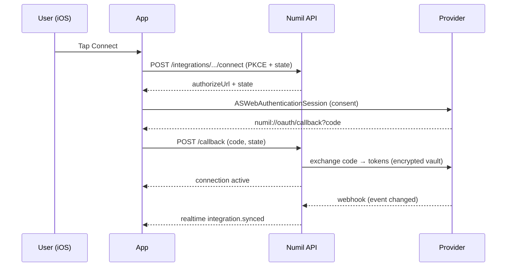

# 32 · Integrations

> Follows the [Master PRD Template](./00-prd-template.md). Integrations connect Numil to the
> tools teams already live in — calendars, chat, meetings, code, design, and no-code
> automation — while keeping the "simple by default, deep on demand" north star: a member
> connects an app in two taps; an admin governs scopes, data flow, and revocation one layer
> down. Builds directly on [Calendar & Scheduling](./11-calendar-scheduling.md),
> [Automation & Workflow Rules](./20-automation-workflow-rules.md), and
> [Developer API & Webhooks](./38-developer-api-webhooks.md).

---

## 1. Purpose

The Integrations module is Numil's **connective tissue**. Work spans many apps: meetings in
Google Calendar / Outlook, conversation in Slack / Teams, calls in Zoom, code in GitHub /
GitLab, tickets in Jira, design in Figma, and glue automation in Zapier / Make. Numil's job
is to be the calm command center that reflects and acts on all of it without forcing users to
context-switch.

**User problem it solves.** Today a user manually copies meeting times into their task list,
pastes PR links into comments, and re-announces status in Slack — every copy risking staleness.
Numil removes the copying: it **syncs two-way with calendars**, **mirrors code/ticket state
onto tasks**, and **routes notifications to the right channel** — so a task's context is always
current wherever the user looks.

**User goals**
- Connect the tools I use in seconds, from my phone, without an IT ticket.
- See meetings next to tasks, and have scheduled tasks appear on my calendar (2-way).
- Turn a Slack message, a GitHub PR, or a Jira issue into a Numil task in one tap.
- Get notifications in the channel I already watch, and trust an integration only sees what it
  needs and can be cut off instantly.

**Business goals**
- Increase stickiness and daily active use (calendar sync is a daily-return hook).
- Unlock enterprise deals requiring governance over third-party data flow.
- Grow the ecosystem: Zapier/Make + the public API (module 38) create a network effect.

**KPIs:** `integration_connected` count and per-provider mix, % of active orgs with ≥1 calendar
connected, 2-way sync reliability (drift < 60s), tasks created from integrations,
notification-to-open rate by channel, disconnect/revoke rate.

---

## 2. Navigation

**Entry points**
- **Settings ▸ Integrations** (the integrations directory) — primary hub.
- **Contextual connect** — a "Connect calendar" card in [Calendar](./11-calendar-scheduling.md),
  a "Send to Slack" action in project overflow, "Link PR" in [Task Detail](./10-task-detail.md).
- **Onboarding** offers calendar connect as an optional step.
- **Admin ▸ Workspace** exposes org-level integration governance (see module 30).
- Deep links: `numil://integrations` (directory), `numil://integrations/{provider}` (detail),
  `numil://integrations/{provider}/connect` (starts OAuth).

**Route:** `src/app/settings/integrations/index.tsx` (directory, push), `.../[provider].tsx`
(detail, push), and an OAuth handoff screen `.../connect.tsx` that opens an
`ASWebAuthenticationSession` (via `expo-web-browser` `openAuthSessionAsync`) and returns to
the redirect deep link `numil://oauth/callback`.

**Hierarchy & breadcrumbs**
```text
Settings ▸ Integrations ▸ [Provider]  ▸ (Scopes | Sync | Activity)
```

**OAuth connect + 2-way sync (sequence)**


**Modal vs push.** The directory and provider detail are **push** screens. The OAuth consent
flow is a **system sheet** (`ASWebAuthenticationSession`) so provider cookies/passkeys are
available and the user trusts native chrome. Sync-mapping editors open as **nested bottom
sheets** so provider context is never lost. Connecting shows an inline spinner that resolves to
a green "Connected" chip (`spring.gentle`).

---

## 3. Complete UI Layout

```text
┌───────────────────────────────────────────────┐
│  ‹ Settings      Integrations           ⌕      │  ← large title, glass nav, search
├───────────────────────────────────────────────┤
│  Connected                                      │  ← status dot + last sync/target
│  🗓 Google Calendar      ● Synced 2m ago     ›  │
│  💬 Slack                ● #launch           ›  │
│  Suggested:  [ 🗓 Outlook ] [ 🎥 Zoom ] [ 🐙 GitHub ]│ ← carousel
├───────────────────────────────────────────────┤
│  All integrations            Category: All ▾    │
│  ─ Calendar ──   🗓 Google · 🗓 Outlook  2-way  │
│  ─ Comms ────    💬 Slack · 👥 Teams · 🎥 Zoom   │
│  ─ Developer ─   🐙 GitHub · 🦊 GitLab · 🟦 Jira  │
│  ─ Design ────   🎨 Figma                        │
│  ─ Automation    ⚡ Zapier · 🧩 Make      [Add ▸] │
├───────────────────────────────────────────────┤
│  🔒 Admin manages org-wide connections   (i)    │  ← governance banner (member view)
└───────────────────────────────────────────────┘
```

**Provider detail screen**
```text
┌───────────────────────────────────────────────┐
│  ‹ Integrations   Google Calendar        •••   │
│  🗓 Connected as priya@acme.com                 │
│     ● Last synced 2 min ago      [ Sync now ]   │
│  Scopes: ✓ Read  ✓ Write  ✓ Free/busy           │
├───────────────────────────────────────────────┤
│  Sync mapping                                    │
│   Calendars → Numil:  (✓) Work  (✓) Personal    │
│   Numil → Calendar:   Push tasks ( ● on )       │
│    Target calendar  Numil ▾   Conflict  Cal ▾   │
├───────────────────────────────────────────────┤
│  Activity: ↓ 12 pulled · ↑ 3 pushed · 0 err     │
│  [ Disconnect ]                    (destructive)│
└───────────────────────────────────────────────┘
```

- **Top:** large title, glass nav respecting Dynamic Island + top safe area, inline search.
- **Connected:** rows show provider icon, account/target, a **status dot** (green synced /
  amber syncing / red error), last-sync time, and a chevron to detail.
- **Suggested:** a carousel of not-yet-connected providers ranked by relevance.
- **Directory:** grouped by category (Calendar, Communication, Developer, Design, Automation)
  with a filter; each row = icon, name, one-line capability, `[Add]`.
- **Governance banner:** members see who controls org connections; admins get extra controls.
- **Landscape / iPad:** two-pane master-detail. **Tab bar** stays; the OAuth sheet is
  full-screen system UI.

---

## 4. Complete Component Breakdown

| Area | Components |
|------|-----------|
| Nav | `GlassNavBar`, back, `SearchField`, `•••` overflow (Reconnect/Sync now/Disconnect) |
| Directory | `IntegrationSectionHeader`, `IntegrationRow`, `SuggestedCarousel`, `CategoryFilterMenu` |
| Status | `SyncStatusDot`, `LastSyncedLabel`, `ConnectionBadge`, `HealthBanner` |
| Connect flow | `ConnectButton`, `OAuthSheet` (`ASWebAuthenticationSession`), `ScopeConsentCard`, `AccountPickerRow` |
| Sync mapping | `MappingSheet`, `CalendarToggleRow`, `DirectionToggle`, `TargetCalendarPicker`, `ConflictPolicyPicker`, `FieldMappingTable` |
| Activity | `SyncActivityList`, `SyncActivityRow`, `RetryBanner`, `ErrorDetailSheet` |
| Channel routing | `ChannelPickerSheet`, `NotificationRoutingTable`, `EventToggleRow` |
| Capture | `SlackActionSheet`, `LinkResourceSheet`, `UnfurlPreviewCard` |
| Governance | `AdminOnlyLock`, `OrgConnectionRow`, `AllowlistEditor`, `ScopeAuditRow` |
| Feedback | `Skeleton`, `Toast` (undo 5s), `ConfirmDialog`, `Banner` (token expired) |

Primitives are defined in [03-design-system-ui.md](./03-design-system-ui.md).

---

## 5. Modern Features

Each feature: **Purpose · Workflow · UI · Permissions · Offline · API · DB · Notify · AC.**

### 5.1 Google Calendar & Outlook — two-way calendar sync ✅ (like Sunsama/Motion/Fantastical)
- **Purpose:** show external meetings inside Numil's calendar and push Numil scheduled
  tasks/time-blocks out to the user's real calendar, so one plan reflects everywhere.
- **Workflow:** connect via OAuth → pick source calendars to **import** (busy or full) →
  toggle **export** of scheduled tasks/time-blocks to a target calendar → set a **conflict
  policy**. Both sides stay in sync via incremental pull (Google `syncToken`, Graph
  `deltaLink`) plus **push webhooks** (Google `channels.watch`, Graph `subscriptions`).
- **UI:** the [Calendar module](./11-calendar-scheduling.md) renders imported events with a
  provider glyph; a pushed task shows an "on Google Calendar" chip. Mapping lives in the
  provider detail sheet.
- **Permissions:** any Member can connect **their own** calendar; Admins can require
  org-approved apps and restrict to enterprise Microsoft 365 tenants.
- **Offline:** cached events viewable; new time-blocks queue and push on reconnect; free/busy
  shown from cache with a "may be stale" note.
- **API:** internal `POST /integrations/google-calendar/connect`, `.../sync`,
  `.../mappings`; provider webhooks land on `POST /webhooks/in/google` and `/microsoft`.
- **DB:** `integration_connections`, `calendar_sync_state` (syncToken/deltaLink),
  `external_event_links` (task ↔ external event id + etag).
- **Notify:** "Calendar connected"; optional "meeting starting" via
  [Notifications](./12-notifications-alerts.md); sync errors → a single actionable alert.
- **AC:** external events appear in Numil within 60s; scheduled tasks appear on the target
  calendar; edits/deletes propagate both ways; time zones + all-day map correctly; disconnect
  stops sync and optionally removes pushed events.

### 5.2 Slack — notifications + message capture ✅ (like Linear/Asana Slack apps)
- **Purpose:** route Numil activity into Slack channels and turn Slack messages into tasks.
- **Workflow:** connect the workspace (org-level OAuth by an Admin) → map **events → channels**
  ("task assigned to me" → DM, "project X" → `#launch`) → use the Slack **message action**
  "Create Numil task" or slash command `/numil add …`.
- **UI:** `NotificationRoutingTable` (event × channel), a Slack action opens a task-preview
  sheet; unfurled Numil links show rich task cards in Slack.
- **Permissions:** connecting the workspace app requires Admin; individual members link their
  Numil↔Slack identity to attribute captures and receive DMs.
- **Offline:** outbound Slack posts are server-side (unaffected by the client being offline);
  captured tasks created from Slack sync down on reconnect.
- **API:** `POST /integrations/slack/connect`, `POST /integrations/slack/route`,
  inbound `POST /webhooks/in/slack` (events, interactivity, slash commands, signed).
- **DB:** `slack_workspaces`, `channel_routes`, `identity_links` (numil_user ↔ slack_user).
- **Notify:** delivery is the feature; failures fall back to in-app + push.
- **AC:** an assignment posts to the mapped channel within 5s; `/numil add` creates a task and
  replies with a link; unfurls render; identity linking attributes the creator.

### 5.3 Microsoft Teams — notifications + capture ✅
- **Purpose:** Teams equivalent of Slack for Microsoft-first orgs.
- **Workflow:** admin installs the Numil Teams app → configure channels → members use the
  **message extension** "Create task" and receive **Adaptive Card** notifications with inline
  Complete/Snooze actions.
- **UI:** Adaptive Cards mirror Numil task cards; routing table shared with Slack UI.
- **Permissions:** Admin installs the org app; members link identity.
- **Offline:** server-side delivery; captures sync down later.
- **API:** `POST /integrations/teams/connect`; inbound `POST /webhooks/in/teams` (Bot Framework
  activities, JWT-validated).
- **DB:** `teams_tenants`, `channel_routes` (shared, provider column), `identity_links`.
- **Notify:** Adaptive Card actions round-trip (Complete/Snooze).
- **AC:** card actions update the task; message-extension capture works; tenant isolation enforced.

### 5.4 Zoom — meetings on tasks & calls from tasks ✅
- **Purpose:** attach/generate Zoom meetings for scheduled tasks and surface join links.
- **Workflow:** connect Zoom → "Add Zoom meeting" on a task mints a meeting and stores the join
  URL on the task and any synced calendar event; after the call, an optional
  recording/transcript link and AI summary → tasks.
- **UI:** "Add Zoom" chip on the task property rail; join button; post-call summary card.
- **Permissions:** Member connects own Zoom; Admin can require a corporate Zoom account.
- **Offline:** meeting metadata cached; creation queued (needs network to mint a meeting).
- **API:** `POST /integrations/zoom/connect`, `POST /tasks/:id/zoom-meeting`; inbound
  `POST /webhooks/in/zoom` (meeting.ended, recording.completed).
- **DB:** `zoom_meetings` (task_id, meeting_id, join_url, recording_url?, transcript_ref?).
- **Notify:** "Meeting starts in 10 min · Join"; "Recording ready".
- **AC:** creating a meeting returns a join URL; ended/recording webhooks update the task;
  disconnect revokes tokens.

### 5.5 GitHub & GitLab — link code to work ✅ (like Linear/Jira Git integrations)
- **Purpose:** connect commits/branches/PRs/MRs and issues to Numil tasks; reflect CI status.
- **Workflow:** connect via OAuth or a **GitHub App / GitLab application** → link a task to a PR
  ("Link PR") → status, reviews, and merge state mirror onto the task; a branch/PR named
  `NUM-123` auto-links; merging can move the task to Done (policy).
- **UI:** a "Development" section on Task Detail with linked PR chips, CI ✓/✗ badges, and branch
  name; unfurls in comments.
- **Permissions:** Member links resources they can access; Admin installs the org App and sets
  merge→Done automation (via [Automation](./20-automation-workflow-rules.md)).
- **Offline:** cached link state viewable; new links queue.
- **API:** `POST /integrations/github/connect`, `POST /tasks/:id/dev-links`; inbound
  `POST /webhooks/in/github` and `/gitlab` (push, pull_request/merge_request, check_run).
- **DB:** `dev_links` (task_id, provider, repo, kind, external_id, url, state, ci_state).
- **Notify:** "PR merged → task Done"; "CI failed on your linked PR".
- **AC:** `NUM-123` auto-links; CI + review state mirror within 30s; merge→Done respects policy;
  duplicate links deduped.

### 5.6 Jira — two-way issue mirroring 🔜 (like Unito/Trello power-ups)
- **Purpose:** mirror Jira issues as Numil tasks (and back) for teams straddling both tools.
- **Workflow:** connect Jira Cloud (OAuth 3LO) → choose a **project ↔ project** mapping + a
  **field map** (status, assignee, priority, labels) → changes sync per a configurable
  **direction** (import/export/two-way) and conflict policy.
- **UI:** `FieldMappingTable` (Jira ↔ Numil) and a status-mapping matrix; linked issue chip on tasks.
- **Permissions:** Admin/Manager configure mappings; Members see mirrored tasks.
- **Offline:** cached mirror viewable; edits queue and reconcile on sync.
- **API:** `POST /integrations/jira/connect`, `PUT /integrations/jira/mappings`; inbound
  `POST /webhooks/in/jira` (issue events); outbound writes via Jira REST.
- **DB:** `jira_sites`, `entity_mirrors` (numil_task ↔ jira_issue, field_map_id, direction),
  `field_maps`.
- **Notify:** conflict needing resolution → assignee + configurer.
- **AC:** status/assignee/priority map per config; two-way edits converge; loops prevented via
  origin tagging; unmapped fields skipped.

### 5.7 Figma — design previews on tasks ✅
- **Purpose:** embed live Figma file/frame previews on design tasks and comments.
- **Workflow:** connect Figma → paste a link → Numil renders a thumbnail + "Open in Figma";
  thumbnails refresh on file version change.
- **UI:** `UnfurlPreviewCard` with Figma thumbnail; attachment-like chip on the task.
- **Permissions:** Member links files they can access (Figma permission enforced on open).
- **Offline:** last thumbnail cached; refresh on reconnect.
- **API:** `POST /tasks/:id/attachments` (kind=`figma_link`); server fetches thumbnail; optional
  `POST /webhooks/in/figma` for version updates.
- **DB:** `attachments` (kind=`figma_link`, url, thumb_url, version).
- **Notify:** optional "design updated" to watchers.
- **AC:** valid link renders a thumbnail; broken/permission-lost link shows a fallback.

### 5.8 Zapier & Make — no-code automation ✅ (like every modern SaaS)
- **Purpose:** let non-developers connect Numil to 6,000+ apps via triggers/actions without
  code, complementing native [Automation](./20-automation-workflow-rules.md).
- **Workflow:** in Zapier/Make, add the Numil app → authenticate with an **API key or OAuth**
  (module 38) → pick a **trigger** ("Task completed") or **action** ("Create task"); Numil
  exposes triggers via **REST hooks** and actions via the public API.
- **UI:** minimal Numil side — a "Zapier/Make" directory entry linking out plus a list of
  active subscriptions with revoke controls.
- **Permissions:** creating an API key/OAuth app is gated to Admin (or Manager per org policy).
- **Offline:** irrelevant (runs server-to-server); local shows subscription list from cache.
- **API:** REST-hook subscribe `POST /webhooks` (module 38); actions use the public API;
  polling triggers use cursor pagination.
- **DB:** `webhook_subscriptions`, `api_keys`, `oauth_apps` (shared with module 38).
- **Notify:** none by default; failures visible in the delivery log.
- **AC:** a "Task completed" Zap fires within 10s; a "Create task" action creates a task;
  revoking the key stops all Zaps immediately.

---

## 6. Smart AI Features

AI is thin glue that makes integrations feel intelligent, powered by
[AI Assistant & Copilot](./19-ai-assistant-copilot.md):

| Capability | What it does with integrations |
|-----------|--------------------------------|
| **Meeting → tasks** | Zoom/Teams transcript → action items proposed as tasks (accept/edit). |
| **Smart scheduling** | Uses imported free/busy to place time-blocks without double-booking. |
| **PR/issue summarize** | Summarizes a linked GitHub PR or Jira issue thread on the task. |
| **Auto-link detection** | Detects `NUM-123` / repo mentions / Figma links and offers to link. |
| **Duplicate mirror guard** | Warns when a Jira import would duplicate an existing task. |

Every AI action is **proposal-first** (preview + accept/undo), logged as `ai_invoked`,
respects org AI settings, and never posts externally without explicit confirmation.

---

## 7. Productivity Features

- **Unified day view:** imported meetings + Numil scheduled tasks in one timeline
  ([Calendar](./11-calendar-scheduling.md)); drag a task around meetings and it re-pushes.
- **One-tap capture:** Slack/Teams message, GitHub PR, or e-mail (`add@in.numil.app`) → task
  with parsed fields.
- **Focus protection:** a Numil focus block can auto-set Slack/Teams status and mute
  notifications; completing a calendar-pushed task marks the block done and can log time to
  [Time Tracking](./21-time-tracking-timesheets.md).

---

## 8. Enterprise Features

- **Org-approved apps allow-list:** Admins choose which providers members may connect; the rest
  is blocked with a clear message.
- **Scope governance & least privilege:** per provider, admins can require read-only calendar,
  disable message capture, or force enterprise tenants (M365/Google Workspace domain).
- **Central connections:** org-level connections (Slack/Teams/Jira) are owned by the org (not a
  user) so they survive offboarding; personal connections (calendar/Zoom) are per user.
- **Data-flow controls & DLP:** admins can restrict outbound task content to external channels
  (links only, not titles) for regulated data.
- **Audit:** every connect/disconnect/scope-change/export logs to the immutable
  [Audit Log](./29-activity-feed-audit-logs.md); token grants record scopes + actor.
- **Offboarding:** removing a user revokes personal integrations and reassigns org connections.
  Bring-your-own OAuth client (🟣) is planned for enterprises wanting their own app.

**Permission matrix**

| Action | Owner | Admin | Manager | Member | Guest |
|--------|:-----:|:-----:|:-------:|:------:|:-----:|
| Connect **personal** calendar/Zoom | ✅ | ✅ | ✅ | ✅ | ❌ |
| Connect **org** app (Slack/Teams/Jira) | ✅ | ✅ | ⚙️ policy | ❌ | ❌ |
| Configure sync mappings (org) | ✅ | ✅ | project-scoped | ❌ | ❌ |
| Route notifications to channels | ✅ | ✅ | own projects | ❌ | ❌ |
| Create API key / OAuth app (Zapier) | ✅ | ✅ | ⚙️ policy | ❌ | ❌ |
| Edit org allow-list / scope policy | ✅ | ✅ | ❌ | ❌ | ❌ |
| Disconnect **own** connection | ✅ | ✅ | ✅ | ✅ | ❌ |
| Disconnect **org** connection | ✅ | ✅ | ❌ | ❌ | ❌ |
| View integration audit | ✅ | ✅ | scoped | ❌ | ❌ |

`⚙️` = gated by org setting. Per [shared/rbac-permissions.md](./shared/rbac-permissions.md).

---

## 9. Collaboration Features

- **Shared channel routing:** a project's activity posts to a shared Slack/Teams channel so the
  team stays aligned without opening Numil.
- **Cross-tool mentions:** a Numil comment `@mention` can notify the person in Slack/Teams if
  they linked identities and opted in.
- **Team calendar overlay:** with consent, a manager sees aggregated team free/busy.

---

## 10. Offline Architecture

Deltas over [shared/offline-sync-engine.md](./shared/offline-sync-engine.md):
- **Server-authoritative bridges.** Most provider traffic is server↔provider, unaffected by
  client connectivity; the client only syncs **Numil-side** results (links, mirrored fields,
  cached events).
- **Cached read models:** imported calendar events, dev-link state, and Jira mirrors are viewable
  offline with a "may be stale" indicator.
- **Queued captures:** capturing a task from a Slack/GitHub/Zoom link offline enqueues a normal
  task op; external linking resolves server-side on reconnect (never blocks capture).
- **No offline OAuth:** connecting requires network; the connect button is disabled offline.
- **Conflict nuance:** two-way syncs (calendar, Jira) resolve on the server; the client receives
  the reconciled result and a non-blocking notice if it must choose.

---

## 11. Security

Deltas over [shared/security-baseline.md](./shared/security-baseline.md):
- **Token vault:** provider OAuth tokens are stored **server-side, encrypted** (KMS-wrapped);
  the client never holds third-party tokens — only short-lived Numil tokens (Keychain).
- **Least-privilege scopes:** request the narrowest scopes needed; document each in the consent
  card so users understand what is granted.
- **Signed inbound webhooks:** every provider webhook is verified (Google channel token, Graph
  validationToken + JWT, Slack signing secret, GitHub HMAC, Zoom token) before processing —
  see [module 38](./38-developer-api-webhooks.md).
- **PKCE + state:** all OAuth flows use PKCE and a signed `state` to prevent CSRF/interception.
- **Data minimization:** import only requested calendars; DLP can strip task content from
  outbound messages; nothing beyond the user's permission scope is mirrored out.
- **Instant revocation:** disconnect revokes provider tokens and tombstones cached data;
  offboarding cascades revocation.
- **Tenant isolation:** Slack workspace / Teams tenant / Jira site IDs are validated on every
  inbound event to prevent cross-tenant leakage.

---

## 12. Notification System

Deltas over [12-notifications-alerts.md](./12-notifications-alerts.md):
- **Outbound channels:** integrations add Slack DM/channel and Teams Adaptive Card as delivery
  targets alongside push/in-app; a routing table maps event types → channels.
- **Actionable cards:** Slack/Teams messages carry Complete/Snooze/Assign buttons that
  round-trip to Numil (interactivity webhooks).
- **Failure fallback:** a failed channel post (revoked token, deleted channel) falls back to
  in-app + push and raises a single "reconnect" alert — never silent loss.
- **Meeting alerts & digests:** synced meetings emit "starting soon · Join" with the Zoom link;
  daily/weekly digests can target a channel instead of (or with) push.

---

## 13. Accessibility

Deltas over [shared/accessibility-spec.md](./shared/accessibility-spec.md):
- Each `IntegrationRow` announces name + state ("Google Calendar, connected, synced 2 minutes
  ago, button").
- `SyncStatusDot` has a text alternative — synced/syncing/error also render as words (color is
  never the only signal).
- The OAuth system sheet is fully VoiceOver-navigable (native provider UI).
- Mapping toggles expose value + `accessibilityActions`; the field-mapping table is navigable
  row-by-row with header context.
- Destructive "Disconnect" is announced as such and confirmed with a labeled dialog.

---

## 14. Animations

Deltas over [shared/animation-spec.md](./shared/animation-spec.md):
- "Connecting" → "connected": spinner cross-fades to a green check chip (`spring.gentle`).
- Sync-in-progress: status dot pulses gently; suggested carousel snaps with press-scale chips.
- Disconnect: row collapses with a settle; undo snackbar slides up.
- Reduce Motion replaces pulses/collapses with instant state + fade.

---

## 15. Performance

- **Directory** is a static, code-split list; icons via `expo-image` (cached); renders <100ms.
- **Sync activity** lists virtualize (FlashList) and paginate; heavy sync work is server-side.
- **Incremental sync** uses provider delta tokens (Google `syncToken`, Graph `deltaLink`,
  Git event cursors) to avoid full refetch; webhooks push changes so polling is a fallback.
- **Batching & backoff:** outbound provider calls are batched and rate-limited per provider,
  with exponential backoff + jitter and a per-connection circuit breaker.
- **Battery/network:** no client-side provider polling; the client only reacts to Numil realtime
  events. Figma thumbnails are lazy and cached.

---

## 16. Database Design

```text
integration_connections(id, org_id, provider, scope_kind, owner_user_id?, external_account,
      status, scopes[], connected_by, created_at, revoked_at?, version)
      -- scope_kind: 'personal' | 'org'; status: 'active'|'error'|'revoked'
oauth_tokens(id, connection_id→integration_connections, access_enc, refresh_enc, expires_at,
      token_type, updated_at)                                   -- encrypted at rest (KMS)
calendar_sync_state(connection_id→integration_connections, calendar_id, sync_token,
      delta_link?, direction, last_synced_at, error?)
external_event_links(id, org_id, task_id→tasks, connection_id, external_event_id, etag,
      last_pushed_at, last_pulled_at)                           UNIQUE(connection_id, external_event_id)
channel_routes(id, org_id, provider, project_id?, event_type, channel_id, target,
      dlp_links_only, created_by)                               -- Slack/Teams routing
identity_links(org_id, numil_user_id, provider, external_user_id)  PK(org_id, provider, external_user_id)
dev_links(id, org_id, task_id→tasks, provider, repo, kind, external_id, url, state,
      ci_state?, created_at)                                    UNIQUE(task_id, provider, external_id)
entity_mirrors(id, org_id, task_id→tasks, provider, external_id, field_map_id, direction,
      origin, last_synced_at)                                   -- Jira two-way
field_maps(id, org_id, provider, mapping_json, created_by)
zoom_meetings(id, org_id, task_id→tasks, meeting_id, join_url, recording_url?, transcript_ref?)
integration_events(id, org_id, connection_id, direction, kind, count, error?, created_at)  -- activity/audit
```

**Indexes:** `integration_connections(org_id, provider)`, `external_event_links(task_id)`,
`dev_links(task_id)`, `entity_mirrors(provider, external_id)`,
`integration_events(connection_id, created_at)`, plus the unique constraints noted to prevent
duplicate links/mirrors. **Constraints:** `scope_kind='personal' ⇒ owner_user_id NOT NULL`; org
connections have `owner_user_id IS NULL`. **Soft delete:** `revoked_at` tombstone cascades to
dependent links. **Audit:** `integration_events` append-only; connect/disconnect also written to
the org audit log. Align with [17-data-model-api.md](./17-data-model-api.md).

---

## 17. API Design

Follows [shared/api-conventions.md](./shared/api-conventions.md); inbound provider webhooks are
detailed in [38-developer-api-webhooks.md](./38-developer-api-webhooks.md).

| Method | Path | Purpose |
|--------|------|---------|
| GET | `/integrations` | List providers + connection status for the org/user |
| POST | `/integrations/:provider/connect` | Begin OAuth (returns authorize URL + state) |
| POST | `/integrations/:provider/callback` | Exchange code (PKCE) → create connection |
| DELETE | `/integrations/connections/:id` | Disconnect + revoke provider tokens |
| POST | `/integrations/connections/:id/sync` | Force incremental sync now |
| GET | `/integrations/connections/:id/activity?cursor=` | Sync/activity log |
| PUT | `/integrations/connections/:id/mappings` | Calendar/Jira/field mappings |
| POST | `/integrations/slack/route` · `/teams/route` | Event→channel routing |
| POST | `/tasks/:id/dev-links` · DELETE `/dev-links/:id` | Link/unlink PR/issue |
| POST | `/tasks/:id/zoom-meeting` | Create Zoom meeting for a task |
| POST | `/webhooks/in/:provider` | Provider inbound webhook (signed) |

**Realtime:** `org:{id}` emits `integration.synced`, `integration.error`, `devlink.updated`,
`calendar.event.changed` so open screens update live.
**Errors:** `403 forbidden` (not allow-listed / lacks scope), `409 conflict` (mapping
version), `422 validation_failed` (bad mapping), `429 rate_limited` (provider throttle,
`Retry-After`). **Idempotency-Key** on all connect/sync/link mutations; inbound webhooks
deduped by provider delivery id.

**Sample request/response — connect Google Calendar**
```http
POST /v1/integrations/google-calendar/connect
Authorization: Bearer <token>
X-Org-Id: org_123
Idempotency-Key: 9f1c-…
{ "scopes": ["calendar.events", "calendar.freebusy"], "redirect": "numil://oauth/callback" }
```
```json
{
  "data": {
    "authorizeUrl": "https://accounts.google.com/o/oauth2/v2/auth?client_id=…&code_challenge=…&state=…",
    "state": "st_7b2…",
    "expiresIn": 600
  },
  "meta": { "requestId": "req_abc" }
}
```

After consent, the client returns to `numil://oauth/callback?code=…&state=…` and posts it to
`/integrations/google-calendar/callback`, which creates the `active` connection
(`connectionId`, `externalAccount`, granted `scopes`).

---

## 18. Edge Cases

- **OAuth denied / closed sheet:** no connection created; row returns to `[Add]` with
  "connection canceled".
- **Token expired / revoked at provider:** connection flips to `error`; a single banner prompts
  reconnect; sync pauses (no silent failures).
- **Scope downgraded:** features needing the missing scope disable with an explanation; existing
  data preserved read-only.
- **Duplicate event / echo loop:** origin tagging + `external_event_links` dedupe prevent
  ping-pong; a Numil-originated event isn't re-imported as new.
- **Time zone / DST / all-day:** all-day events map to all-day; timed events store UTC, display
  local; DST transitions recompute reminders.
- **Deleted task with pushed event:** external event removed or detached per policy.
- **Slack channel deleted / bot removed:** routing falls back to push; admin alerted.
- **Jira field with no Numil equivalent:** skipped with a note; never blocks sync.
- **Provider rate limit / outage:** circuit breaker + backoff; "provider unavailable,
  retrying"; queued ops resume on recovery.
- **Duplicate personal connection:** one per (user, provider, account); a retry reuses it.
- **Org disallows a provider post-connection:** existing connections flagged/disabled per policy
  (configurable grace period).
- **User offboarded:** personal connections revoked; org connections reassigned to an admin.

---

## 19. User States

- **First-time:** empty directory with a "Connect your calendar to see meetings next to tasks"
  hero; calendar suggested first.
- **Returning/power:** several connections, quick "Sync now", tuned channel routing.
- **Guest:** integrations hidden (guests cannot connect apps).
- **Member:** connects personal apps; org apps show "Ask an admin" if policy blocks.
- **Manager:** routes own projects' notifications; scoped mapping.
- **Admin/Owner:** full governance — allow-list, scopes, org connections, audit.
- **Offline:** connect disabled; cached status/events shown with a staleness note.
- **Tablet/landscape:** master-detail two-pane. **Dark mode / large text / a11y:** tokens +
  Dynamic Type; status by text, not color.

---

## 20. Analytics Events

Schema per [shared/analytics-taxonomy.md](./shared/analytics-taxonomy.md). `integration_connected`
is defined there; module-specific additions:

| event | key properties |
|-------|----------------|
| `integration_connected` | `provider`, `scope_kind`, `scopes_count` |
| `integration_disconnected` | `provider`, `reason` (user/error/offboard/policy) |
| `integration_sync_completed` | `provider`, `pulled`, `pushed`, `errors`, `duration_ms` |
| `integration_sync_error` | `provider`, `code` |
| `calendar_event_imported` | `provider`, `count` |
| `task_pushed_to_calendar` | `provider` |
| `task_captured_from_integration` | `provider`, `surface` (slack/teams/github/zoom/email) |
| `devlink_added` | `provider`, `kind` (pr/mr/issue/branch) |
| `channel_route_configured` | `provider`, `event_type` |
| `integration_ai_used` | `capability`, `provider`, `accepted` |
| `integration_policy_changed` | `provider`, `setting` |

No task titles/PII in properties (per taxonomy privacy rules).

---

## 21. Acceptance Criteria

1. The Integrations directory lists all providers grouped by category with connection status.
2. A member can connect a personal calendar in ≤2 taps after OAuth consent.
3. OAuth uses PKCE + signed `state`; canceling the sheet creates no connection.
4. Provider access/refresh tokens are stored encrypted server-side; the client never holds them.
5. Google/Outlook import selected calendars within 60s; created/edited/deleted events
   propagate into Numil within 60s (webhook or delta).
6. A Numil scheduled task/time-block pushes to the target calendar; Numil-side edits propagate
   back to the provider.
7. Echo loops are prevented (Numil-originated events are not re-imported as new).
8. All-day and timed events map correctly with time zones; DST transitions are handled.
9. Conflict policy (calendar-wins / Numil-wins / newest-wins) is configurable and honored.
10. Slack connects at org level (Admin) and routes events to mapped channels ≤5s.
11. `/numil add …` and the Slack message action create tasks and reply with a link.
12. Slack/Teams unfurls render Numil task cards; Adaptive Card actions round-trip.
13. Microsoft Teams tenant isolation is enforced on every inbound activity.
14. Zoom meeting creation returns a join URL on the task; ended/recording webhooks update it.
15. GitHub/GitLab links mirror PR/MR status, reviews, and CI within 30s.
16. `NUM-123` in a branch/PR/commit auto-links to the task; duplicates are deduped.
17. Merge→Done automation respects project policy (via module 20).
18. Jira mapping applies status/assignee/priority per config; two-way edits converge (🔜);
    unmapped fields are skipped with a note, never blocking sync.
19. Figma links render a thumbnail; broken/permission-lost links show a fallback.
20. Zapier/Make authenticate via API key or OAuth (module 38); revoking a key stops flows
    immediately.
21. Inbound webhooks are signature-verified per provider before processing.
22. Disconnect revokes provider tokens and tombstones cached data.
23. Admin allow-list blocks providers with a clear message; scope policy can force read-only
    calendar / disable capture / require enterprise tenant.
24. DLP "links only" mode strips task content from outbound channel messages.
25. Org-owned connections survive offboarding (reassigned to an admin); personal ones are revoked.
26. Every connect/disconnect/scope-change is written to the immutable audit log.
27. Sync/channel-post failures surface a single actionable banner and fall back to in-app +
    push — never silent loss.
28. Cached events/links/mirrors are viewable offline with a staleness indicator; connect is
    disabled offline with a hint.
29. Realtime `integration.*` events update open screens live.
30. AI integration actions are proposal-first and never post externally without confirmation.
31. Analytics events fire with correct, PII-free properties (including offline-buffered).
32. VoiceOver announces connection state (text, not color alone); Reduce Motion disables
    pulses/collapses while keeping state visible.
33. iPad landscape shows a master-detail two-pane layout.
34. Rate-limited providers back off with a circuit breaker; recovery resumes queued ops.
35. Idempotency-Key dedupes connect/sync/link retries; webhook delivery ids dedupe inbound.

---

## 22. Future Roadmap

- **V1 (✅):** Integrations directory, Google/Outlook 2-way calendar sync, Slack + Teams
  notifications & capture, Zoom meetings, GitHub/GitLab dev-links, Figma previews,
  Zapier/Make via API key/OAuth, per-connection activity, disconnect/revoke, audit.
- **V1.1 (🔜):** Jira two-way issue mirroring with field maps, AI meeting→tasks from
  transcripts, channel digests, richer conflict-resolution UI, e-mail-to-task address.
- **V2 (🟣):** bring-your-own OAuth client, Salesforce/HubSpot CRM sync, Google Drive/OneDrive
  file linking, Notion/Confluence doc linking, custom bi-directional field automation UI,
  Linear/Asana/Trello importers.
- **Future (💡):** an in-app **integration marketplace** for partner connectors, a visual
  mapping builder, and cross-tool "universal search" spanning connected apps.
- **Experimental (🧪):** an AI agent that auto-reconciles cross-tool status (keeping Jira,
  GitHub, and Numil in agreement) with approval gates.
- **AI track:** proactive "your 2pm meeting has no agenda — draft one?" using calendar +
  linked docs; auto-summary of a connected repo's week.
- **Enterprise track:** SCIM-driven provisioning of org connections, per-provider
  data-residency pinning, and per-provider eDiscovery export.
