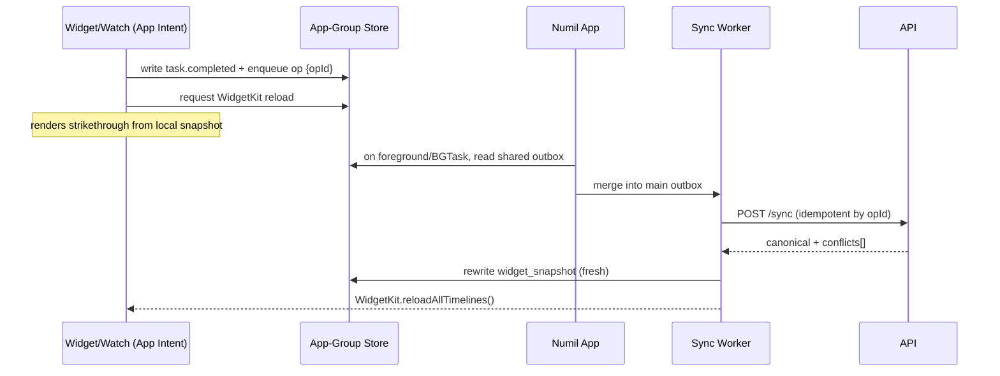

# 33 · Widgets, Live Activities & Apple Watch

> Follows the [Master PRD Template](./00-prd-template.md). This module is the Apple-platform
> "glanceable layer" of Numil — the surfaces a user sees **without opening the app**: Home
> Screen widgets, Lock Screen widgets, StandBy, Live Activities in the Dynamic Island, and
> a companion Apple Watch app with complications. It matches the reference depth of
> [10 · Task Detail](./10-task-detail.md) and [19 · AI Assistant & Copilot](./19-ai-assistant-copilot.md).

---

## 1. Purpose

Numil's north star is "simple by default, deep on demand." Nothing is simpler than **not
having to open the app at all**. This module makes the user's most important work visible
and actionable from the Home Screen, Lock Screen, StandBy nightstand, Dynamic Island, and
wrist — the places Apple users glance at dozens of times a day.

**User problem it solves.** A task manager only helps if it interrupts you at the right
moment with the right information. Opening an app, waiting for sync, and navigating to
"Today" is friction. Todoist, Things 3, TickTick, and Apple Reminders all ship widgets;
Numil must match the best of them *and* add live, timer-aware surfaces (Live Activities +
Dynamic Island) that competitors mostly lack.

**User goals**
- See "what's next" (Today / Up Next / overdue count) at a glance — no tap required.
- Complete or snooze a task from a widget or the watch in one interaction.
- Watch a running focus timer or Pomodoro count down in the Dynamic Island.
- Track a live deadline/reminder countdown on the Lock Screen without unlocking.
- Capture a task by wrist (Siri/dictation on Apple Watch) when the phone isn't handy.

**Business goals**
- Retention & habit formation: glanceable surfaces drive daily returns (`app_opened`).
- Differentiation: Live Activities + Dynamic Island + Watch complications are premium,
  Apple-native experiences few competitors execute well.
- Activation of the focus/timer loop (links to [35 · Focus, Pomodoro & Habits](./35-focus-pomodoro-habits.md)).

**KPIs:** widget install rate, `widget_action` (complete/snooze from widget), Live Activity
start→interaction rate, watch task completions, complication tap-through, and the lift in
7-day retention for users with ≥1 widget or complication installed.

**Platform reality (be honest).** Expo SDK 57 ships a **first-party `expo-widgets`** module
that builds Home/Lock-Screen widgets *and* Live Activities from `@expo/ui/swift-ui`
components via a **config plugin** — no hand-written Swift, but it **requires a development
build / EAS build (not Expo Go)** and an **App Group** for data sharing. The **Apple Watch
app + complications** are *not* covered by `expo-widgets`; they require a real **watchOS
target** added through a config plugin such as `@bacons/apple-targets` (or a bare native
target) and are therefore scoped **🔜 v1.1 / 🟣 v2**. This module states clearly what is
`✅ v1` (widgets + Live Activities) vs. later.

---

## 2. Navigation

Widgets and Live Activities are not "screens" inside the app; they are **OS-owned surfaces**
that deep-link *into* the app. The in-app surface for this module is a **management screen**.

**Entry points**
- **iOS widget gallery** → long-press Home Screen → "＋" → search "Numil" → pick a widget
  family and (iOS 17+) configure it (which list/project/view it shows).
- **Lock Screen editor** → customize → add Numil accessory widget (circular/rectangular/inline).
- **StandBy** (iPhone charging in landscape) → Numil widget auto-appears if placed.
- **Dynamic Island / Lock Screen** → Live Activity started by a focus session or a live
  countdown reminder.
- **In-app management:** `Settings → Widgets & Watch` (`src/app/settings/widgets.tsx`).
- **Apple Watch:** app launcher, Smart Stack, and watch face complications.

**Route (in-app management screen):** `src/app/(settings)/widgets.tsx` — pushed from Profile
& Settings ([15 · Profile & Settings](./15-profile-settings.md)).

**Deep links (scheme `numil`, bundle `com.sanketsss.numil`)**

| Surface tapped | Deep link | Lands on |
|----------------|-----------|----------|
| Widget task row | `numil://task/{taskId}` | Task Detail |
| Widget "Today" header | `numil://today` | Home → Today view |
| Widget "＋ Add" | `numil://add?source=widget` | Quick Add sheet |
| Lock Screen countdown | `numil://task/{taskId}?ref=lockwidget` | Task Detail |
| Live Activity (focus) | `numil://focus/{sessionId}` | Focus screen (module 35) |
| Live Activity (reminder) | `numil://task/{taskId}?ref=liveactivity` | Task Detail |
| Watch complication | `numil://today?ref=watch` | Home → Today |
| Watch "add" | `numil://add?source=watch` | Quick Add |

Live Activities carry a `url` at `start()` time (`expo-widgets` supports a deep-link URL per
activity), so a tap routes precisely. **Modal vs push:** deep links open Task Detail as a
**push** (full back stack), Quick Add as a **sheet**.

---

## 3. Complete UI Layout

The in-app **management** screen plus representative widget/Live Activity layouts.

```text
┌───────────────────────────────────────────────┐
│  ‹ Settings      Widgets & Watch               │  ← large title, glass nav
├───────────────────────────────────────────────┤
│  HOME SCREEN                                    │
│  ┌─────────┐  ┌───────────────┐                 │
│  │ Today 3 │  │ Today ▸ Marketing            ▓ │ │  ← small (2x2) + medium (4x2) preview
│  │ ◯ Email │  │ ◯ Draft launch email   5:00PM │ │
│  │ ◯ Deck  │  │ ◯ Review copy          today  │ │
│  └─────────┘  │ ◯ Ship build           ⚑     │ │
│               └───────────────────────────────┘ │
│  LOCK SCREEN                                     │
│  ( ◔ 2 )   [ 3 due · next 5:00 PM ]   overdue 1  │  ← circular / rectangular / inline
│  STANDBY                                         │
│  ┌───────────────────────────────┐              │
│  │  Up Next · 5:00 PM             │              │  ← large glanceable, night-dimmed
│  │  Draft the Q3 launch email     │              │
│  └───────────────────────────────┘              │
├───────────────────────────────────────────────┤
│  Configure                                      │
│   Which list?      Today ▾                      │  ← WidgetConfiguration (iOS 17+ intent)
│   Show completed?  ( ●)                          │
│   Accent tint      🔵 ▾                          │
├───────────────────────────────────────────────┤
│  APPLE WATCH                                🔜   │
│   ⌚ Numil app installed        ▸               │
│   Complications: Today count · Next task · Ring │
└───────────────────────────────────────────────┘
```

Dynamic Island (focus timer) — expanded + compact states:

```text
 Compact:    (⏱ 24:12 ▸ Draft…)          ← leading icon + trailing time
 Minimal:    ( ⏱ )                        ← when another app shares the Island
 Expanded:
 ┌───────────────────────────────────────┐
 │  ⏱  Focus · Draft launch email         │  expandedLeading + expandedTrailing
 │      24:12                       ▓▓▓░░  │  ← time + progress
 │  [ Pause ]     [ + 5 min ]    [ Done ] │  expandedBottom action buttons
 └───────────────────────────────────────┘
```

**Layout notes.** The management screen is a plain grouped-list settings surface (calm; one
primary action per row). Widget previews use the *real* `@expo/ui/swift-ui` render so what
the user sees equals what lands on the Home Screen. Home Screen widgets respect the widget
**content margins** and the system tint (iOS 18 tinted mode → `WidgetRenderingMode.accented`).
Lock Screen accessory widgets render in **`vibrant`** mode (monochrome), so we never rely on
color alone. StandBy uses the large family, night-dimmed (respect `isLuminanceReduced`).
**iPad/landscape:** `systemExtraLarge` widget (6×4) supported; the management screen is a
two-column form. **Tab bar** unaffected (this is a settings push).

---

## 4. Complete Component Breakdown

| Area | Components |
|------|-----------|
| Management screen | `SettingsGroup`, `WidgetPreviewCard` (live `@expo/ui` render), `FamilyPicker` (segmented), `ConfigRow` (list/project/view selector), `TintPicker`, `Toggle`, `DisclosureRow` |
| Home widget (small) | `WidgetVStack`, `CountBadge`, up to 2 `WidgetTaskRow` (checkbox glyph + title), `AddGlyph` |
| Home widget (medium/large) | `WidgetHeader` (view name + date), `WidgetTaskList` (3–8 `WidgetTaskRow`), `PriorityGlyph`, `DueChip`, `ProgressBar`, `InteractiveToggle` (AppIntent-backed complete button, iOS 17+) |
| Lock Screen accessory | `AccessoryCircularGauge` (open/overdue ring), `AccessoryRectangular` (next task + time), `AccessoryInline` (count) |
| StandBy | `StandbyCard` (large, high-contrast, dimmable) |
| Live Activity | `LiveBanner` (Lock Screen), `DynamicIslandCompact` (leading/trailing), `DynamicIslandMinimal`, `DynamicIslandExpanded` (leading/trailing/center/bottom), `LiveProgress`, `LiveActionButton` (Pause/Extend/Done) |
| Watch app | `WatchTodayList`, `WatchTaskRow`, `WatchCompleteButton`, `WatchAddButton` (dictation), `WatchTimerView`, `WatchComplication` (corner/circular/rectangular/inline) |
| Feedback | `WidgetPlaceholder` (redacted skeleton), `StaleBadge` ("updated 2h ago"), `SignedOutWidget` (CTA to open app) |

Widget/Live Activity UI is authored with **`@expo/ui/swift-ui`** primitives (`VStack`,
`HStack`, `Text`, `Image` with `systemName` SF Symbols, `Gauge`, `ProgressView`) and
**modifiers** (`font`, `foregroundStyle`, `padding`). App-side primitives come from
[03 · Design System & UI](./03-design-system-ui.md); widget primitives are a constrained
SwiftUI subset (no gesture handlers, no scroll, no live JS — snapshot rendering only).

---

## 5. Modern Features

Each feature: **Purpose · Workflow · UI · Permissions · Offline · API · DB · Notify · AC.**

### 5.1 Home Screen widgets — Today / Up Next / Project (✅ v1)
- **Purpose:** glanceable list of what matters now, like Things 3's "Today" widget.
- **Workflow:** user adds a widget → (iOS 17+) picks the source list (Today, Upcoming,
  a saved view from [14 · Search & Views](./14-search-filters-views.md), or a project) →
  the widget shows the top N tasks. The app pushes a fresh **snapshot** on data change and
  schedules a **timeline** for day boundaries (midnight roll-over, due times).
- **UI:** small = count + 2 tasks; medium = 3–4 tasks; large = 6–8 tasks + progress; extra
  large (iPad) = two columns.
- **Permissions:** only shows content the signed-in user can read (personal tasks + accessible
  projects). Guests see only shared items; personal tasks never leak to another profile.
- **Offline:** renders from the App-Group SQLite mirror; fully works offline, shows a
  `StaleBadge` if the mirror hasn't synced in > 30 min.
- **API:** none at render time (reads local mirror). Refresh piggybacks on the normal
  `GET /sync?since=` pull.
- **DB:** reads `widget_snapshot` (denormalized) from the shared App-Group store.
- **Notify:** none.
- **AC:** widget reflects a completed task within one timeline reload; empty state reads
  "All clear ✨"; signed-out state shows a "Open Numil" CTA.

### 5.2 Interactive widgets — complete & snooze in place (✅ v1, iOS 17+)
- **Purpose:** act without opening the app (Reminders-style tap-to-complete).
- **Workflow:** tap the checkbox glyph in a medium/large widget → an **App Intent** fires
  → the task is completed in the App-Group DB + an outbox op is enqueued → widget reloads
  with a strike-through then removes the row.
- **UI:** `InteractiveToggle`/`LiveActionButton` bound to an `AppIntent`; haptic-free (widgets
  can't haptic) but animates via WidgetKit reload.
- **Permissions:** requires write scope on the task; unauthorized → intent returns an error
  toast on next app open (rare, since UI only shows writable tasks).
- **Offline:** the intent writes locally + enqueues an op; syncs later (see §10).
- **API:** deferred `POST /sync` op `task.update {completedAt}` (idempotent by `opId`).
- **DB:** updates shared mirror + outbox; app reconciles on next launch.
- **Notify:** cancels that task's pending local reminders.
- **AC:** completing from a widget never double-completes after sync; a failed sync surfaces
  a non-blocking notice in-app, not on the widget.

### 5.3 Lock Screen widgets (✅ v1)
- **Purpose:** ambient awareness — count of due today / overdue / next task time.
- **Workflow:** user adds accessory widgets in the Lock Screen editor; app updates snapshots.
- **UI:** `accessoryCircular` (gauge: overdue vs. done ring), `accessoryRectangular` (next
  task title + time), `accessoryInline` (count near the clock). All render **monochrome**
  (`vibrant`) — icon + number, never color-only.
- **Permissions/Offline/DB:** same shared-mirror model as 5.1.
- **API/Notify:** none at render.
- **AC:** gauge value matches Today's open/overdue counts; inline count stays legible at all
  Dynamic Type sizes; renders correctly on always-on display (dimmed).

### 5.4 StandBy widget (✅ v1)
- **Purpose:** nightstand/desk glance while charging in landscape.
- **Workflow:** reuses the large Home widget; system shows it in StandBy automatically when
  placed.
- **UI:** high-contrast large card; respects `isLuminanceReduced` (night mode → dim, red-shift
  aware) so it doesn't glare in a dark room.
- **AC:** legible from ~1m; auto-dims at night; taps route to `numil://today`.

### 5.5 Live Activities — focus timer & Pomodoro (✅ v1)
- **Purpose:** a running timer visible on Lock Screen + Dynamic Island, like a workout app.
- **Workflow:** starting a focus/Pomodoro session (module 35) calls
  `FocusActivity.start({...}, 'numil://focus/{id}')`. As the timer ticks or the user
  pauses/extends, the app calls `instance.update(...)`; ending calls `instance.end(...)`.
- **UI:** compact (icon + remaining time), minimal (icon), expanded (task title + big time +
  progress + **Pause / +5 min / Done** buttons wired to App Intents).
- **Permissions:** any signed-in user on their own session.
- **Offline:** the timer runs locally; Live Activity updates are on-device (no network). A
  paused/ended state syncs the logged time later.
- **API:** none for the local timer; time entry syncs via [21 · Time Tracking](./21-time-tracking-timesheets.md)
  ops. Remote update path (below) uses APNs.
- **DB:** `live_activities` row (activityId, kind, targetId, startedAt, pushToken?).
- **Notify:** on completion, a local "Session complete — 25:00 focused" notification.
- **AC:** time in the Island stays within ±1s of the app timer; Done ends both the session and
  the activity; only one focus activity at a time.

### 5.6 Live Activities — live deadline / event countdown (🔜 v1.1)
- **Purpose:** count down to an imminent deadline or meeting-linked task.
- **Workflow:** a task with a near due time (< 8h, user opt-in) can pin a countdown activity;
  updated by **push-to-start** and content pushes via APNs (`enablePushNotifications: true`).
- **UI:** banner + Island showing "Due in 42 min · Draft launch email".
- **API:** server sends APNs Live Activity updates using the per-activity `pushToken` (or
  `pushToStartToken`) captured via `addPushToStartTokenListener` / `instance.getPushToken()`.
- **AC:** countdown updates remotely even if the app is closed; ends gracefully at the deadline
  with a "Due now" final state and `after(date)` dismissal.

### 5.7 Widget configuration & multiple instances (✅ v1, iOS 17+)
- **Purpose:** let users pin *different* widgets (e.g., "Work today" vs. "Personal Upcoming").
- **Workflow:** each widget instance carries a `WidgetConfiguration` (App Intent parameters:
  source view/project, show-completed, tint). Edited via long-press "Edit Widget".
- **DB:** the chosen config is read by the widget via `environment.configuration`.
- **AC:** two instances with different configs render independently and update independently.

### 5.8 Apple Watch app (🔜 v1.1)
- **Purpose:** view Today, complete tasks, and capture by voice from the wrist.
- **Workflow:** watch app reads a lightweight mirror synced via **WatchConnectivity** from the
  phone; completions queue and sync back. New task via **watch dictation** → Quick Add op.
- **UI:** `WatchTodayList` + `WatchCompleteButton` + `WatchAddButton` (Scribble/dictation) +
  `WatchTimerView` (start/stop focus).
- **Platform note:** needs a **watchOS target** (config plugin `@bacons/apple-targets` or bare)
  — not provided by `expo-widgets`; hence 🔜.
- **AC:** completing on watch reflects on phone within one sync; offline completions queue.

### 5.9 Watch complications (🔜 v1.1)
- **Purpose:** put "today's count / next task / completion ring" on the watch face.
- **UI:** corner, circular, rectangular, inline families; ClockKit/WidgetKit-for-watchOS.
- **AC:** complication shows today's open count; taps launch the watch app to Today.

---

## 6. Smart AI Features

These surfaces are **read-mostly**, so AI is used sparingly and never mutates data without
confirmation (governed by [19 · AI Assistant & Copilot](./19-ai-assistant-copilot.md)).

| Capability | On this surface |
|-----------|-----------------|
| `day_plan` preview | The Home/StandBy widget can show the AI-suggested "focus next" task (read-only badge "AI pick"). Accept happens in-app. |
| `smart_reply`/`voice_to_task` | Apple Watch dictation → `POST /ai/parse` → structured task; on-device parse when offline (see module 34). |
| `deadline_predict` | Lock Screen countdown can show an "at risk" glyph when AI flags a slipping deadline. |
| `productivity_score` | A weekly widget variant shows the AI narrative streak ("18 done, 92% on time") sourced from [36 · AI Productivity Insights](./36-ai-productivity-insights.md). |

All AI-derived widget content is precomputed **in-app** (proposal-first there) and only the
*result* is snapshotted to the widget — the widget itself never calls an LLM. `ai_invoked`
is logged in-app, not from the extension.

---

## 7. Productivity Features

- **One-tap focus from a widget:** a "Start focus" button (large widget / watch) launches a
  session in [35 · Focus, Pomodoro & Habits](./35-focus-pomodoro-habits.md) and spawns the
  Live Activity from §5.5.
- **Time-block glance:** the medium widget can show the next calendar block from
  [11 · Calendar & Scheduling](./11-calendar-scheduling.md) ("2:00 Deep work").
- **Habit ring complication (🔜):** a watch complication mirrors habit streaks.
- **Quick reschedule (🔜):** long-press a widget task → context menu → Today/Tomorrow (via
  App Intent) without opening the app.
- **Deep-link capture:** widget/watch "＋" opens Quick Add pre-scoped to the widget's project.

---

## 8. Enterprise Features

- **Org policy to disable glanceable surfaces (🔜):** admins can require that **personal task
  content not appear on the Lock Screen / StandBy** for managed devices (shows counts only),
  configured in [30 · Workspace Administration](./30-workspace-administration.md).
- **MDM / managed app config:** honor `com.apple.configuration.managed` keys to force
  "counts only" widget mode on supervised devices.
- **Data minimization on shared surfaces:** Lock Screen/StandBy can be set to redact titles
  (show "1 task due" instead of the title) for privacy-sensitive orgs.
- **Audit:** widget/Live Activity *actions* (complete/snooze) are attributed and land in the
  normal task `activity_log` ([29 · Activity Feed & Audit Logs](./29-activity-feed-audit-logs.md)),
  tagged `source=widget|watch|liveactivity`.
- **Watch provisioning:** watch app respects the same session/biometric lock policy from
  [shared/security-baseline.md](./shared/security-baseline.md).

Role visibility of the management surface:

| Capability | Owner | Admin | Manager | Member | Guest |
|-----------|:-----:|:-----:|:-------:|:------:|:-----:|
| Install/manage own widgets | ✅ | ✅ | ✅ | ✅ | ✅ |
| Start Live Activity (own focus) | ✅ | ✅ | ✅ | ✅ | ✅ |
| See personal tasks on widgets | ✅ | ✅ | ✅ | ✅ | ✅ (own) |
| Set org "counts-only" Lock Screen policy | ✅ | ✅ | ❌ | ❌ | ❌ |
| Force watch app config (MDM) | ✅ | ✅ | ❌ | ❌ | ❌ |
| View widget-sourced audit entries | ✅ | ✅ | scoped | ❌ | ❌ |

Full model: [shared/rbac-permissions.md](./shared/rbac-permissions.md).

---

## 9. Collaboration Features

- **Assignment awareness:** a widget can be scoped to "Assigned to me" so team tasks appear
  the moment they're assigned (push-triggered snapshot refresh).
- **Shared Live Activity (🟣):** for a team meeting/event, a shared countdown could broadcast
  via push-to-start to attendees who opted in (privacy-gated).
- **Presence-free by design:** widgets/watch are personal glance surfaces — no presence,
  typing, or comment streams here (those live in [10 · Task Detail](./10-task-detail.md)).
- **Watch handoff (🔜):** completing/opening a task on watch supports **Handoff** to continue
  on iPhone/iPad.

---

## 10. Offline Architecture

Deltas over [shared/offline-sync-engine.md](./shared/offline-sync-engine.md):
- Widgets and the watch app **read from a shared App-Group SQLite mirror** (`group.com.sanketsss.numil`),
  not the network. The app writes a denormalized `widget_snapshot` after each sync so the
  extension renders instantly with zero network.
- **Widget writes** (complete/snooze via App Intent) go into a **shared outbox** in the App
  Group; the main app drains it into the normal sync outbox on next foreground / BGTask.
- Live Activity timers are **fully local**; only the resulting time entry / completion syncs.
- Watch completions queue via **WatchConnectivity** → phone outbox → server.
- Conflict handling is identical (op `opId` idempotency, field-level LWW). A widget-completed
  task that was deleted server-side → op dropped with an in-app notice.



---

## 11. Security

Deltas over [shared/security-baseline.md](./shared/security-baseline.md):
- The **App Group** container holds only the minimum denormalized snapshot; tokens stay in the
  **Keychain** (shared Keychain access group) — never in the widget's plist or snapshot file.
- Lock Screen / StandBy can leak content to anyone glancing at the phone → support a
  **"counts-only" / redacted** mode (user + org policy) so titles aren't shown when locked.
- App Intent writes re-check permission when the app reconciles (server is source of truth);
  the widget never bypasses RBAC.
- Live Activity push tokens are treated as secrets; APNs payloads carry **no task content**
  beyond what's needed for display, and honor the redaction policy.
- Biometric app-lock (Face ID) does **not** gate widget rendering (OS limitation); therefore
  redaction is the privacy control on locked surfaces.
- Watch mirror is scoped to the same user; signing out on iPhone wipes the App-Group store and
  reloads widgets to the signed-out state.

---

## 12. Notification System

Deltas over [12 · Notifications & Alerts](./12-notifications-alerts.md):
- Live Activities are **not** notifications but complement them: a due-soon reminder can offer
  "Show countdown" to pin a Live Activity (§5.6).
- Completing/snoozing from a widget **cancels/reschedules** that task's local reminders
  atomically (same rule as Task Detail).
- Focus-session Live Activity ends with a local completion notification.
- Remote Live Activity updates use APNs (`aps-environment` entitlement added by
  `enablePushNotifications: true`), distinct from standard alert pushes.
- Notification **actions** (Complete/Snooze) and widget App Intents share the same handler so
  behavior is identical from lock screen, notification, or widget.

---

## 13. Accessibility

Deltas over [shared/accessibility-spec.md](./shared/accessibility-spec.md):
- Every widget exposes an **`accessibilityLabel`** summarizing content ("Today, 3 tasks, next:
  Draft launch email at 5 PM") and each interactive glyph a labeled action ("Complete Draft
  launch email").
- Lock Screen/vibrant widgets never rely on color: overdue = ⚠️ glyph + count, not red alone.
- Text uses scalable SF fonts; layouts reflow so counts/titles aren't clipped at AX sizes
  (widgets have fixed frames → we truncate gracefully with a legible minimum, never overflow).
- Dynamic Island expanded actions (Pause/+5/Done) are VoiceOver-focusable and labeled.
- StandBy content honors **Increase Contrast** and **Reduce Transparency**.
- Watch complications provide accessibility labels for the watch VoiceOver rotor.

---

## 14. Animations

Deltas over [shared/animation-spec.md](./shared/animation-spec.md):
- Widgets **cannot run Reanimated worklets**; motion is limited to WidgetKit's built-in
  transitions on reload (content cross-fade). Complete → row strikes then removes on next
  reload; no custom springs.
- Dynamic Island transitions (compact↔expanded) use the system animation; our content just
  cross-fades values.
- Live Activity numeric time uses SwiftUI's timer text so counting is smooth without JS.
- **Reduce Motion:** honored by the system for the Island; our snapshots avoid gratuitous
  change (only update when a value actually changes to prevent flicker).
- No confetti on glance surfaces (celebrations stay in-app).

---

## 15. Performance

- **Snapshot, don't compute:** the widget renders a precomputed `widget_snapshot`; no queries,
  no LLM, no network in the extension (WidgetKit budgets are strict — memory ~30 MB, fast draw).
- **Timeline discipline:** schedule the *minimum* entries (day rollover, next due time) to
  avoid burning WidgetKit's refresh budget; use `updateSnapshot` for event-driven pushes and
  reserve `updateTimeline` for time-based changes.
- **Reload throttling:** debounce `reloadAllTimelines()` (≤ once/30s under bursty sync) — iOS
  rate-limits widget reloads regardless.
- **Live Activity update rate:** batch updates; iOS 18 may reduce sync rate
  (`isActivityUpdateReduced`) — the timer text keeps counting locally so we don't need frequent
  pushes.
- **Background refresh:** use `expo-background-task` (BGTaskScheduler) for periodic snapshot
  refresh; push-triggered silent sync for immediacy.
- **App-Group I/O:** snapshot is a single compact row/JSON blob (< 16 KB typical) → cheap reads.
- **Battery:** no polling; event- + timeline-driven only.

---

## 16. Database Design

Shared App-Group store (read by extensions) + server-side registration for push-driven updates.
Aligns with [17 · Data Model & API](./17-data-model-api.md).

```text
-- App-Group SQLite (device, shared between app + widget + watch)
widget_snapshot(id, user_id, source_kind, source_id?, generated_at,
                payload_json)     -- denormalized rows: [{taskId,title,dueAt,priority,done}]
widget_config(instance_id, family, source_kind, source_id?, show_completed,
              tint, redact_titles, updated_at)   -- per pinned widget instance (iOS 17 intent)
shared_outbox(op_id PK, entity, type, entity_id, payload_json, created_at) -- widget/watch writes

-- Server (for remote Live Activity + push refresh)
live_activities(id PK, org_id, user_id, kind, target_type, target_id?,
                push_token?, push_to_start_token?, state, started_at, ended_at?)
widget_push_registrations(id PK, user_id, device_id, push_token, families[], created_at)
```

**Indexes:** `widget_snapshot(user_id, source_kind)`, `live_activities(user_id, state)`,
`shared_outbox(created_at)`. **Constraints:** one active focus `live_activities` row per user;
`widget_config.instance_id` unique per pinned widget. **Soft-delete:** snapshots are cache
(regenerated), not soft-deleted; `live_activities` keep `ended_at` for audit. **Privacy:**
`payload_json` honors `redact_titles` (stores counts, omits titles) when policy requires.

---

## 17. API Design

Follows [shared/api-conventions.md](./shared/api-conventions.md). Widgets read locally; the
API is for **registering push tokens** and **driving remote Live Activities**. Task
mutations reuse the standard sync endpoints.

| Method | Path | Purpose |
|--------|------|---------|
| POST | `/devices/:id/live-activity/register` | Register a per-activity or push-to-start token |
| POST | `/live-activities` | Server starts an activity (push-to-start) for a target |
| PATCH | `/live-activities/:id` | Push a content update (ETA/state) via APNs |
| POST | `/live-activities/:id/end` | End with final state + dismissal policy |
| POST | `/devices/:id/widgets/register` | Register widget push token + families |
| POST | `/sync` (batch ops) | Widget/watch completions (idempotent by `opId`) |
| GET | `/sync?since=` | Pull deltas to rebuild `widget_snapshot` |

**Realtime:** on `task.updated`/`task.completed` (channel `user:{id}`), the app rebuilds the
snapshot and calls `reloadAllTimelines()`; no dedicated widget WS channel.

**Sample — push a Live Activity update**
```http
PATCH /v1/live-activities/la_9f3 HTTP/1.1
Authorization: Bearer <token>
Idempotency-Key: 2f1c-…
Content-Type: application/json

{ "state": "active", "content": { "etaMinutes": 2, "status": "Due soon" },
  "dismissalPolicy": "default", "contentDate": "2026-07-16T16:58:00Z" }
```
```json
{ "data": { "id": "la_9f3", "state": "active", "deliveredVia": "apns",
            "contentDate": "2026-07-16T16:58:00Z" },
  "meta": { "requestId": "req_5b2" } }
```

**Errors:** `409 gone` (target deleted → end activity), `403 forbidden` (redaction policy
blocks content), `422 validation_failed` (stale `contentDate`), `429 rate_limited`
(APNs backoff via `Retry-After`). **Idempotency-Key** on every mutation.

---

## 18. Edge Cases

- **Widget added while signed out:** show `SignedOutWidget` with "Open Numil" CTA (no data).
- **App Group unavailable / first run:** widget shows redacted placeholder until first sync.
- **iOS < 17:** interactive widget buttons hidden (tap opens app instead); config uses a
  default source (Today) since `WidgetConfiguration` intents require iOS 17.
- **Timeline budget exhausted:** iOS delays reload; `StaleBadge` communicates "updated Xm ago".
- **Live Activity limit:** iOS caps concurrent activities; if the OS denies a start, fall back
  to a standard notification and log `live_activity_denied`.
- **Focus session killed (device reboot):** on relaunch, reconcile — end any orphaned
  `live_activities` and finalize the time entry from the last checkpoint.
- **Push token rotation:** re-register on `pushToStartToken`/`pushToken` change; drop stale.
- **DST/timezone change:** snapshot due times recompute on next reload; Live Activity uses
  absolute dates so counting stays correct.
- **Task completed both on widget and in-app:** `opId` idempotency prevents double-complete.
- **Redaction policy toggled on:** immediately regenerate snapshot to strip titles from locked
  surfaces.
- **Storage full:** snapshot is tiny; skip blob thumbnails in widgets entirely (text/SF Symbols
  only) so widgets never fail on storage pressure.
- **Watch unpaired / app not installed:** management screen shows an install CTA; no errors.
- **Multiple widget instances, different configs:** each reads its own `widget_config` row.

---

## 19. User States

- **First-time:** management screen coaches "Add a widget" with an inline preview + a step-by-step
  "long-press your Home Screen" hint; Live Activities explained on first focus start.
- **Returning/power:** several configured widgets (Work/Personal), watch complications, uses
  the Island timer daily.
- **Guest:** widgets show only shared content; personal counts scoped to guest's own tasks.
- **Manager/Admin:** additionally see org policy toggles (counts-only, MDM).
- **Signed out:** all surfaces show the signed-out CTA state.
- **Offline / poor network:** widgets render from mirror with `StaleBadge`; timers run locally.
- **Locked device:** Lock Screen widgets/StandBy honor redaction policy.
- **iPad / landscape:** `systemExtraLarge` widget; StandBy N/A (iPhone), Watch N/A.
- **Dark mode / StandBy night:** dimmed, high-contrast; **Reduce Motion/Transparency** honored.
- **watchOS-only glance:** complication + Smart Stack surface today's next task.

---

## 20. Analytics Events

Schema per [shared/analytics-taxonomy.md](./shared/analytics-taxonomy.md). Events emit from the
**app** (reconciling extension actions), never with task content.

| event | key properties |
|-------|----------------|
| `widget_installed` | `family` (small/medium/large/xl/lock_*), `source_kind` |
| `widget_configured` | `source_kind`, `show_completed`, `redact_titles` |
| `widget_action` | `action` (complete/snooze/add), `family`, `offline_queued` |
| `widget_opened` | `family`, `deeplink` |
| `lockscreen_widget_shown` | `type` (circular/rectangular/inline) |
| `standby_widget_shown` | — |
| `live_activity_started` | `kind` (focus/pomodoro/deadline), `via` (local/push) |
| `live_activity_action` | `action` (pause/extend/done), `kind` |
| `live_activity_ended` | `kind`, `duration_s`, `reason` (done/expired/denied) |
| `dynamic_island_expanded` | `kind` |
| `watch_action` | `action` (complete/add/focus), `offline_queued` |
| `complication_tapped` | `family` |
| `widget_snapshot_stale` | `age_min` |

---

## 21. Acceptance Criteria

1. A Home Screen widget can be added in small, medium, and large families.
2. `systemExtraLarge` is available on iPad.
3. The widget renders from the App-Group mirror with **no network** and no dead spinner.
4. Widget content reflects the signed-in user's permissions (guests/personal scoped correctly).
5. Completing a task from a medium/large widget (iOS 17+) marks it done locally and enqueues a sync op.
6. A widget completion never double-completes after the op syncs (`opId` idempotency).
7. If iOS < 17, widget buttons are hidden and a tap opens the app instead.
8. Lock Screen accessory widgets render monochrome and never rely on color alone.
9. A "counts-only / redacted" mode hides task titles on Lock Screen and StandBy.
10. Org policy can force redacted locked surfaces on managed devices.
11. StandBy shows the large widget, auto-dimmed at night (`isLuminanceReduced`).
12. Starting a focus session starts a Live Activity with compact, minimal, and expanded states.
13. The Dynamic Island timer stays within ±1s of the in-app timer.
14. Expanded Island actions (Pause / +5 min / Done) work and update the session.
15. Ending focus ends the Live Activity and writes the time entry.
16. Only one focus Live Activity exists per user at a time.
17. Remote deadline Live Activities update via APNs push tokens even when the app is closed (🔜).
18. Push-to-start and per-activity tokens are registered and rotated correctly.
19. Deep links from every surface route to the correct in-app destination.
20. Each pinned widget instance can have its own configuration (source/tint/show-completed).
21. Two widget instances with different configs render and update independently.
22. Snapshots refresh within one sync after a task changes anywhere.
23. A `StaleBadge` appears when the snapshot is older than 30 minutes.
24. Widget/watch actions are attributed in the task `activity_log` with `source`.
25. Signing out wipes the App-Group store and shows the signed-out widget state.
26. Tokens are stored in Keychain (shared access group), never in the snapshot/plist.
27. APNs Live Activity payloads carry no task content beyond display needs and honor redaction.
28. The Apple Watch app lists Today and completes tasks, syncing back to the phone (🔜).
29. Watch completions made offline queue and sync on reconnect (🔜).
30. Watch dictation creates a task via Quick Add / AI parse (🔜).
31. Watch complications show today's open count and launch to Today on tap (🔜).
32. Handoff continues a task from watch to iPhone (🔜).
33. All widgets expose a summarizing `accessibilityLabel` and labeled interactive actions.
34. Content is legible at AX Dynamic Type sizes without clipping essential text.
35. Reduce Motion/Transparency and Increase Contrast are honored on all surfaces.
36. The widget extension performs no LLM/network calls (AI results are precomputed in-app).
37. Widget reloads are throttled and respect iOS rate limits (no flicker/burn).
38. Orphaned Live Activities are reconciled and ended after a reboot/kill.
39. If iOS denies a Live Activity start, the app falls back to a notification and logs it.
40. All listed analytics events fire from the app with correct properties (no task content).
41. Building requires a dev/EAS build (documented); Expo Go shows a graceful "not available".
42. The App Group and widget extension bundle id are configured via the `expo-widgets` plugin.

---

## 22. Future Roadmap

- **V1 (✅):** Home Screen widgets (S/M/L/XL), Lock Screen accessory widgets, StandBy,
  interactive complete/snooze (iOS 17+), focus/Pomodoro Live Activities + Dynamic Island,
  per-instance configuration, App-Group offline snapshot, redaction/counts-only mode.
- **V1.1 (🔜):** remote (push-driven) deadline Live Activities, Apple Watch app + complications,
  watch dictation capture, quick-reschedule App Intents from widgets, Handoff.
- **V2 (🟣):** shared/team Live Activities (opt-in), Apple Vision Pro glanceable widgets,
  richer StandBy "today briefing", watch autonomous sync (independent of phone).
- **Future (💡):** interactive Lock Screen mini-actions, calendar-timeline widget, AI "next
  best action" widget powered by [36 · AI Productivity Insights](./36-ai-productivity-insights.md).
- **Experimental (🧪):** on-device generative widget layouts adapting to context/time of day.
- **AI track:** AI-picked "focus next" surfaced on widget/watch; predictive countdowns.
- **Enterprise track:** MDM-managed widget policy, per-org redaction defaults, audited glance actions.
```