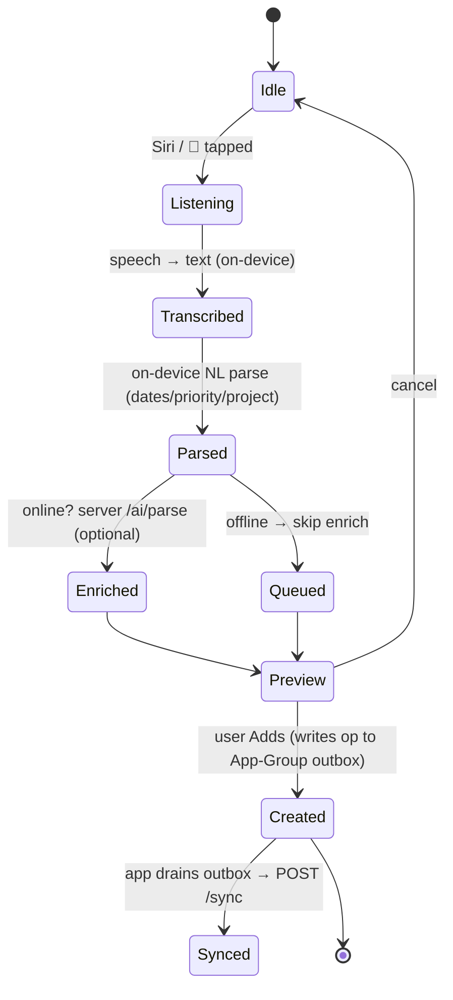

# 34 · Siri Shortcuts, Voice & Apple Intelligence

> Follows the [Master PRD Template](./00-prd-template.md). This module is Numil's **hands-free
> and system-intelligence layer**: App Intents that expose Numil verbs to Siri, Shortcuts, and
> Spotlight; voice capture ("Add task…"); Spotlight donations & search; and Apple Intelligence
> (on-device natural language + summaries). It matches the reference depth of
> [10 · Task Detail](./10-task-detail.md) and [19 · AI Assistant & Copilot](./19-ai-assistant-copilot.md),
> and routes semantic/LLM work to that module.

---

## 1. Purpose

The fastest capture is the one you never touch the screen for. This module lets a user say
"Hey Siri, add task buy milk tomorrow at 5" — or run a Shortcut, or tap a Spotlight result —
and have Numil do the right thing, on-device, instantly, even offline. It also plugs Numil
into **Apple Intelligence** so the system can summarize, draft, and reason over the user's
work using Apple's on-device models where available.

**User problem it solves.** Capture friction kills task managers. Todoist/Things/Reminders
all support Siri; Numil must match that *and* add App-Intent-powered automations (Shortcuts),
Spotlight deep results, and Apple Intelligence summaries — while keeping the "simple by
default" promise (one spoken sentence → one structured task).

**User goals**
- "Add a task by talking" — Siri or in-app voice, parsed into title/date/priority/project.
- Build **Shortcuts** automations ("When I arrive at work, show my Today list").
- Find tasks/projects from **Spotlight** without opening the app.
- Let **Apple Intelligence** summarize a project, draft a reply, or extract action items
  on-device (private, fast) and hand off to server AI ([19 · AI Assistant & Copilot](./19-ai-assistant-copilot.md))
  only when needed.

**Business goals**
- Activation & retention via frictionless capture (`task_created` with `source=voice/siri`).
- Ecosystem stickiness: the more App Intents a user wires into Shortcuts, the higher retention.
- Privacy-forward differentiation: "your tasks stay on device" for NL parse and summaries.

**KPIs:** tasks created via Siri/voice, Shortcuts run count, Spotlight tap-through, App
Intent invocations, on-device vs. server AI split, and voice-capture success rate (parse
accepted without edit).

**Platform reality (be honest).** Expo SDK 57 does **not** ship a first-party App Intents /
SiriKit / Spotlight module. `expo-speech` provides **text-to-speech only** (not recognition).
Therefore: **App Intents, Siri phrases, Spotlight (CoreSpotlight) donation, and Apple
Intelligence (Foundation Models) are implemented as a native module + config plugin**
(e.g., a custom Expo config plugin or a community plugin like `@bacons/apple-targets`) and
require a **development/EAS build (not Expo Go)** and iOS 26+ for Foundation Models. Where
Apple Intelligence is unavailable (older devices, region, Apple Intelligence off), we fall
back to on-device heuristics + server AI. On-device speech-to-text uses the iOS keyboard
**dictation** in a `TextInput` (`✅ v1`) with the native `Speech`/`SFSpeechRecognizer`
bridge as a 🔜 enhancement.

---

## 2. Navigation

App Intents/Siri/Spotlight are **system-invoked**; the in-app surfaces are a **voice capture
sheet** and a **"Siri & Shortcuts" settings screen**.

**Entry points**
- **Siri (voice):** "Hey Siri, add task in Numil…", "Hey Siri, what's due today in Numil".
- **Shortcuts app:** Numil actions appear under the app in the gallery; user composes flows.
- **Spotlight:** search surfaces Numil tasks/projects + "Add task in Numil" App Shortcut.
- **Action Button / Control Center (🔜):** map the iPhone Action Button or a Control Center
  control to "Quick capture" (an App Intent).
- **In-app voice:** the ✨/🎤 button in Quick Add and on Task/Copilot composers.
- **Apple Intelligence:** system "Summarize"/"Writing Tools" over Numil text; Siri "use the
  info in Numil" (App Intents + entities).
- **Settings:** `Settings → Siri & Shortcuts` (`src/app/(settings)/siri-shortcuts.tsx`).

**Route (in-app):** voice capture is a **sheet** `src/app/(modals)/voice-capture.tsx`; the
settings/management screen is a **push**.

**Deep links (scheme `numil`, bundle `com.sanketsss.numil`)**

| Trigger | Deep link | Lands on |
|---------|-----------|----------|
| Siri/Shortcut "Add task" (with slots) | `numil://add?title=…&due=…&project=…&source=siri` | Quick Add (prefilled) or silent create |
| Spotlight task result | `numil://task/{taskId}?ref=spotlight` | Task Detail |
| Spotlight "Add task" shortcut | `numil://add?source=spotlight` | Quick Add |
| Siri "Show my Today" | `numil://today?ref=siri` | Home → Today |
| Siri "Start focus" | `numil://focus/start?ref=siri` | Focus (module 35) |
| Apple Intelligence "Summarize project" | `numil://ai?scope=project&id={projectId}&capability=summarize` | AI Copilot (module 19) |
| Voice → task (in-app) | `numil://add?source=voice` | Voice capture sheet |

App Intents that complete silently (e.g., "add task") do **not** navigate; they run in the
background and return a Siri confirmation snippet. Intents that need review open Quick Add.

---

## 3. Complete UI Layout

In-app voice capture sheet + the Siri & Shortcuts management screen.

```text
┌───────────────────────────────────────────────┐
│                Voice capture              ✕     │  ← sheet (medium detent)
├───────────────────────────────────────────────┤
│                 ●  listening…                   │  ← animated mic level
│                                                 │
│  "Email Priya the deck tomorrow 4pm !high       │  ← live transcript
│   #launch"                                      │
├───────────────────────────────────────────────┤
│  Parsed preview                                 │
│   Title:   Email Priya the deck                 │
│   Due:     Tomorrow 4:00 PM   ▾                  │  ← editable chips
│   Priority: High ⚑          Label: #launch      │
│   Project:  Marketing ▾                          │
├───────────────────────────────────────────────┤
│  [ 🎤 again ]                    [ Add task ➤ ] │
└───────────────────────────────────────────────┘
```

```text
┌───────────────────────────────────────────────┐
│  ‹ Settings     Siri & Shortcuts                │  ← large title
├───────────────────────────────────────────────┤
│  VOICE & SIRI                                   │
│   “Add task in Numil”         [ Add to Siri ]   │  ← donates App Shortcut phrase
│   “What’s due today”          [ Add to Siri ]   │
│   Apple Intelligence          ( ● )  On         │  ← toggle (if device supports)
│   On-device parsing           ( ● )  On         │
├───────────────────────────────────────────────┤
│  SHORTCUTS ACTIONS (App Intents)                │
│   ▸ Create Task        ▸ Complete Task          │
│   ▸ Start Focus        ▸ Get Today’s Tasks      │
│   ▸ Add to My Day      ▸ Summarize Project (AI) │
│   [ Open Shortcuts app ]                        │
├───────────────────────────────────────────────┤
│  SPOTLIGHT                                       │
│   Index my tasks in Spotlight   ( ● )           │
│   Include completed             ( ○ )           │
└───────────────────────────────────────────────┘
```

**Layout notes.** The voice sheet is deliberately minimal — a mic, a transcript, an editable
parse preview, and one primary "Add task" action (simple by default). Parsed fields render as
the same chips as [10 · Task Detail](./10-task-detail.md) so editing is familiar. The settings
screen is a grouped list: "Add to Siri" rows donate App Shortcut phrases; toggles govern
Apple Intelligence, on-device parsing, and Spotlight indexing. Respects Dynamic Island + safe
areas; **iPad/landscape:** the voice sheet centers as a form sheet; settings become two-column.

---

## 4. Complete Component Breakdown

| Area | Components |
|------|-----------|
| Voice sheet | `MicLevelMeter` (animated), `LiveTranscript`, `ParsePreviewCard`, `PropertyChip` (due/priority/label/project — shared with Task Detail), `RetryMicButton`, `PrimaryAddButton` |
| Settings | `SettingsGroup`, `AddToSiriRow` (phrase + donate button), `IntentActionRow` (deep-links Shortcuts), `Toggle` (Apple Intelligence / on-device / Spotlight), `DisclosureRow`, `SupportBadge` ("Requires iPhone 15 Pro+ / iOS 26") |
| Siri snippets | `SiriResultSnippet` (confirmation card shown by Siri), `SiriDisambiguationList` (choose project/task), `SiriErrorSnippet` |
| Spotlight | `SpotlightResultCell` (title, project, due), served by CoreSpotlight index |
| Apple Intelligence | `WritingToolsAffordance` (system), `SummarizeResultCard`, `OnDeviceBadge`, `FallbackToServerBanner` |
| Feedback | `PermissionPrimer` (mic/Siri), `Toast`, `Banner` (unavailable/offline), `Skeleton` |

Voice/parse chips reuse [03 · Design System & UI](./03-design-system-ui.md) primitives.
Siri snippets and Spotlight cells are **native** (App Intents `IntentSnippet`, CoreSpotlight)
and mirror the app's visual tokens.

---

## 5. Modern Features

Each feature: **Purpose · Workflow · UI · Permissions · Offline · API · DB · Notify · AC.**

### 5.1 App Intents catalog (✅ v1)
- **Purpose:** expose Numil verbs to Siri, Shortcuts, Spotlight, Action Button.
- **Workflow:** the native App Intents extension registers intents; each maps to a deep link
  or a headless handler that reads/writes the App-Group store (see [33 · Widgets](./33-widgets-live-activities-watch.md)).
- **Intents (v1):** `CreateTaskIntent`, `CompleteTaskIntent`, `GetTodaysTasksIntent`,
  `StartFocusIntent`, `AddToMyDayIntent`. 🔜: `SnoozeTaskIntent`, `SummarizeProjectIntent`,
  `SearchTasksIntent`.
- **UI:** parameters (title, due, project, priority) with `@Parameter` prompts; Siri shows a
  confirmation snippet; Shortcuts shows a config card.
- **Permissions:** intents run as the signed-in user; write intents re-check scope on reconcile.
- **Offline:** create/complete write to the App-Group outbox → sync later (fully offline).
- **API:** deferred `POST /sync` op; read intents query the local mirror.
- **DB:** `shared_outbox` + `widget_snapshot` (shared store); `siri_donation` log.
- **Notify:** creating a task with a due date schedules its reminders as usual.
- **AC:** each intent works from Siri, Shortcuts, and Spotlight; write intents are idempotent
  (`opId`); read intents never leak inaccessible content.

### 5.2 Siri voice commands — "Add task" (✅ v1)
- **Purpose:** natural spoken capture with slot filling.
- **Workflow:** "Hey Siri, add task in Numil: draft the launch email tomorrow at 4, high
  priority, in Marketing" → `CreateTaskIntent` fills `title/dueAt/priority/project`; ambiguity
  ("which project?") → `SiriDisambiguationList`; Siri confirms with a snippet.
- **UI:** Siri confirmation snippet; optional "Open" to review in Quick Add.
- **Permissions/Offline/API/DB:** as 5.1.
- **Notify:** as normal task creation.
- **AC:** dates/times/priority/project parse from natural speech; disambiguation resolves
  project by name (fuzzy) against the user's accessible projects only.

### 5.3 In-app voice capture & dictation (✅ v1; native STT 🔜)
- **Purpose:** capture by voice inside the app when Siri isn't ideal.
- **Workflow:** tap 🎤 → keyboard **dictation** (v1) or native `SFSpeechRecognizer` (🔜) →
  live transcript → **on-device NL parse** (Apple `NaturalLanguage`/Foundation Models) into
  fields → editable preview → Add.
- **UI:** `MicLevelMeter`, `LiveTranscript`, `ParsePreviewCard` (§3).
- **Permissions:** microphone + speech-recognition permission (primed with rationale).
- **Offline:** dictation + on-device parse work offline; server enrichment ([19](./19-ai-assistant-copilot.md))
  queued for reconnect.
- **API:** `POST /ai/parse` for server enrichment (optional); creation via `/sync`.
- **DB:** creates `tasks`; logs `voice_capture` analytics.
- **Notify:** as task creation.
- **AC:** transcript editable; parse preview always shown before save; works fully offline for
  dates/priority/labels.

### 5.4 Shortcuts automations (✅ v1)
- **Purpose:** let users automate Numil in the Shortcuts app (like Things' Shortcuts support).
- **Workflow:** users chain Numil App Intents with system triggers ("When I arrive at Work →
  Get Today's Tasks → speak them"; "Every night 9pm → Add to My Day tomorrow's plan").
- **UI:** actions appear in Shortcuts; each exposes typed parameters + output entities
  (a `TaskEntity` so results feed the next action).
- **Permissions/Offline:** as 5.1; automations honor the signed-in scope.
- **API/DB:** as 5.1; outputs are `TaskEntity`/`ProjectEntity` (App Intents entities).
- **AC:** actions accept input and return entities usable downstream; personal-automation
  triggers (time/location/NFC/focus) work; failures return a readable Shortcuts error.

### 5.5 Spotlight donation & search (✅ v1)
- **Purpose:** find and act on Numil content system-wide.
- **Workflow:** the app **donates** tasks/projects to **CoreSpotlight** (`CSSearchableItem`)
  and registers **App Shortcuts** ("Add task in Numil"); searching in Spotlight surfaces
  matching tasks and the add shortcut; tapping deep-links in.
- **UI:** `SpotlightResultCell` (title, project chip, due) + the App Shortcut suggestion.
- **Permissions:** only the user's accessible/own items are indexed; personal tasks stay on
  device (not shared to other profiles); org policy can disable content indexing.
- **Offline:** Spotlight index is local → works offline.
- **API:** none for search; index maintained from `/sync` deltas.
- **DB:** `spotlight_index` (local mirror of indexable ids + keywords).
- **Notify:** none.
- **AC:** newly created tasks appear in Spotlight within a short delay; deleted/completed
  (per setting) are de-indexed; tapping opens the right task.

### 5.6 Apple Intelligence — on-device NL & summaries (🔜 v1.1, iOS 26+)
- **Purpose:** private, fast summaries/drafts/parse using Apple's **Foundation Models** on
  device, before touching server AI.
- **Workflow:** "Summarize this project" / Writing Tools "make it a task list" → Foundation
  Models run on device → result shown with an **`OnDeviceBadge`**; if unavailable or the task
  exceeds on-device capability, `FallbackToServerBanner` routes to
  [19 · AI Assistant & Copilot](./19-ai-assistant-copilot.md).
- **UI:** `SummarizeResultCard`, Writing Tools affordance on any Numil text field.
- **Permissions:** governed by org AI settings (module 19) + device Apple Intelligence toggle.
- **Offline:** on-device models run offline; server AI queued when needed + online.
- **API:** on-device = no API; server = `POST /ai/summarize` / `/ai/parse` (module 19).
- **DB:** none persisted unless the result is accepted into a task/comment.
- **Notify:** none.
- **AC:** on-device is preferred when available; a clear badge indicates on-device vs. server;
  proposal-first (Accept/Edit) — never auto-mutates.

### 5.7 Siri Suggestions & predicted shortcuts (🔜 v1.1)
- **Purpose:** iOS proactively suggests "Add task" / "Start focus" based on donated usage.
- **Workflow:** the app donates intent usage (`INInteraction`/App Intents donation) so iOS
  Spotlight/Lock Screen suggests the right action at the right time/place.
- **AC:** frequently used intents are surfaced by iOS; suggestions deep-link correctly.

### 5.8 Action Button & Control Center capture (🔜 v1.1)
- **Purpose:** one-press quick capture from the hardware Action Button or a Control Center
  control (iOS 18+ controls are App Intents).
- **AC:** pressing the mapped control opens voice capture or runs a silent "Add to inbox".

---

## 6. Smart AI Features

This module is the **Apple-native front door** to AI; the intelligence itself lives in
[19 · AI Assistant & Copilot](./19-ai-assistant-copilot.md). Mapping of capabilities:

| capability (module 19) | Apple surface here | On-device? |
|------------------------|--------------------|-----------|
| `nl_parse` | Siri/voice "add task" slot filling | ✅ (Apple NL / Foundation Models) then server enrich |
| `voice_to_task` | in-app dictation → task | ✅ dictation, on-device parse |
| `summarize` | Apple Intelligence / Writing Tools "Summarize" | 🔜 on-device, server fallback |
| `action_items` | Writing Tools "make task list" | 🔜 on-device, server fallback |
| `rewrite` | Writing Tools rewrite on Numil fields | ✅ system, confirm to apply |
| `smart_reply` | Siri "reply to comment" | server (module 19) |
| `semantic_search` | Siri "find tasks about launch" (🔜 `SearchTasksIntent`) | server (module 39) |

**Guardrails:** all writes are proposal-first (Accept/Edit/Undo), permission-scoped, and
logged as `ai_invoked` with `offline_fallback` + `on_device` flags. Apple Intelligence never
sees content the user can't access, and on-device processing is preferred for privacy.

---

## 7. Productivity Features

- **"Start focus" by voice** → launches [35 · Focus, Pomodoro & Habits](./35-focus-pomodoro-habits.md)
  and its Live Activity (module 33).
- **"Plan my day" Shortcut** → runs the AI day plan (module 19) and speaks/shows the result.
- **"Add to My Day"** intent (Microsoft To Do parity) for a lightweight daily list.
- **Location/time/NFC automations:** "arrive at office → show Today"; "9 PM → evening review".
- **Calendar-aware capture:** dictated "after my 3pm meeting" resolves against
  [11 · Calendar & Scheduling](./11-calendar-scheduling.md).
- **Batch voice capture:** dictate several lines → multiple tasks parsed (each editable).

---

## 8. Enterprise Features

- **AI governance inheritance:** Apple Intelligence/server-AI availability here obeys the org
  **AI settings** in [19 · AI Assistant & Copilot](./19-ai-assistant-copilot.md) and
  [30 · Workspace Administration](./30-workspace-administration.md) (capabilities per role,
  no-train, region).
- **Disable content indexing / Siri exposure:** admins can turn off **Spotlight content
  indexing** and **Siri content phrases** org-wide for data-sensitive workspaces (intents that
  reveal titles are gated; "add task" capture still allowed).
- **DLP on voice/AI:** dictated/parsed content is subject to the same DLP as module 19; server
  enrichment can be disabled, leaving on-device only.
- **Audit:** intent invocations and AI actions land in [29 · Activity Feed & Audit Logs](./29-activity-feed-audit-logs.md)
  with `source=siri|shortcut|spotlight|voice`.
- **Managed devices:** MDM can disable Siri per-app; app degrades gracefully to in-app voice.

Role permission matrix for this module:

| Capability | Owner | Admin | Manager | Member | Guest |
|-----------|:-----:|:-----:|:-------:|:------:|:-----:|
| Use Siri/voice "add task" | ✅ | ✅ | ✅ | ✅ | ✅ (own scope) |
| Run Shortcuts actions | ✅ | ✅ | ✅ | ✅ | scoped |
| Spotlight content indexing (self) | ✅ | ✅ | ✅ | ✅ | own/shared |
| Use Apple Intelligence summaries | policy | policy | policy | policy | policy |
| Disable org Spotlight/Siri content | ✅ | ✅ | ❌ | ❌ | ❌ |
| Configure org AI availability | ✅ | ✅ | ❌ | ❌ | ❌ |
| View intent/AI audit | ✅ | ✅ | scoped | ❌ | ❌ |

Full model: [shared/rbac-permissions.md](./shared/rbac-permissions.md). "policy" = subject to
org AI settings (module 19/30).

---

## 9. Collaboration Features

- **Voice → assign:** "add task for Priya…" resolves an assignee among accessible members
  (fuzzy match; disambiguation if ambiguous) and notifies them ([12 · Notifications](./12-notifications-alerts.md)).
- **Siri "reply to last comment" (🔜):** dictate a reply to a mention; drafts via `smart_reply`
  and requires confirmation before sending (never auto-posts).
- **Summarize a thread by voice (🔜):** "summarize the launch discussion" → module 19 RAG with
  citations, spoken/shown.
- **Shared Shortcuts (🟣):** teams can publish org Shortcut templates (e.g., "Daily standup
  capture") via [24 · Templates & Recurring Workflows](./24-templates-recurring-workflows.md).

---

## 10. Offline Architecture

Deltas over [shared/offline-sync-engine.md](./shared/offline-sync-engine.md):
- App Intents & voice capture write to the **App-Group outbox** (shared with widgets, module
  33); the main app drains it into the sync outbox on foreground/BGTask.
- **On-device NL parse** (Apple `NaturalLanguage` / Foundation Models) works offline for
  dates/priority/labels/project matching; server enrichment (`/ai/parse`) is queued.
- Read intents ("what's due today") and **Spotlight search** read the **local mirror/index** →
  fully offline.
- Apple Intelligence summaries run on-device offline; server-AI capabilities show a clear
  "needs connection" state and queue when a write is intended.
- Conflict/idempotency identical (op `opId`); a voice-created task retried never duplicates.



---

## 11. Security

Deltas over [shared/security-baseline.md](./shared/security-baseline.md):
- Tokens stay in the **Keychain** (shared access group with the App-Intents extension); the
  extension never stores credentials in its own plist.
- Intent handlers and Spotlight index expose **only** content the signed-in user can access;
  personal tasks never surface to another iOS user/profile and are never shared to other orgs.
- Voice audio is **not persisted** server-side by Numil; dictation/recognition uses Apple's
  on-device pipeline where possible; if server recognition is ever used it's transient + opt-in.
- Apple Intelligence/on-device processing keeps content on device; server AI obeys module 19
  no-train/region settings; **no task content in analytics** (only counts/flags).
- Prompt-injection defense: dictated/parsed text is treated as **data**, never instructions
  (aligned with module 19); resolved assignees/projects are validated against real records.
- Org can disable Siri content exposure + Spotlight indexing (§8); MDM disabling Siri is honored.

---

## 12. Notification System

Deltas over [12 · Notifications & Alerts](./12-notifications-alerts.md):
- Voice/Siri-created tasks schedule their reminders exactly like any task (offset rules,
  default reminder time for all-day).
- Long AI jobs kicked off by Siri/Shortcuts ("plan my week") surface a **Live Activity** +
  completion notification (module 33 / module 19).
- Siri confirmations are **snippets**, not push notifications (no duplicate alerts).
- "Add to Siri" success and Shortcuts automation runs are silent (no notification spam);
  only the resulting task reminders notify.
- Assignment via voice notifies the new assignee through the normal push pipeline.

---

## 13. Accessibility

Deltas over [shared/accessibility-spec.md](./shared/accessibility-spec.md):
- Voice capture **is** an accessibility feature; it must also be fully operable via VoiceOver +
  Switch Control (start/stop mic, edit each parsed chip, submit).
- Live transcript is announced politely (`accessibilityLiveRegion`) without spamming.
- Every parsed chip exposes value + `accessibilityActions` ("Change due date", "Remove label").
- Siri snippets and Spotlight cells provide full labels; on-device/server badges have text
  alternatives ("Summarized on device").
- All voice-only flows have a visible transcript and text alternative (no audio-only output).
- Dictation respects the system when a user has speech input as their primary modality.

---

## 14. Animations

Deltas over [shared/animation-spec.md](./shared/animation-spec.md):
- `MicLevelMeter` pulses with audio level (`spring.gentle`); disabled under **Reduce Motion**
  (swap for a static "listening" label).
- Parsed chips fade/slide in per field (`motion.fast`) as parsing completes.
- AI summary streams token-by-token with the shared streaming cursor (module 19 spec).
- Siri/Spotlight are system-animated; we don't override them.
- No celebratory motion here — capture is calm and quick.

---

## 15. Performance

- **On-device first:** NL parse and summaries prefer Apple's on-device models → no round-trip,
  instant, private; server AI only when necessary (cost + latency control).
- **Intent handlers are headless & fast:** read/write the App-Group SQLite directly; target
  < 100 ms so Siri/Shortcuts feel instant; heavy work deferred to the app.
- **Spotlight indexing is incremental & batched** from `/sync` deltas (never full re-index on
  each change); de-index on delete/complete per setting.
- **Debounced parse** as the transcript grows; cancel in-flight server enrich if the user edits.
- **Speech pipeline** runs off the main thread; mic released promptly to save battery.
- **Cold start avoidance:** intents that don't need UI never launch the full RN app; they use
  the lightweight extension + App Group.

---

## 16. Database Design

Shared App-Group store (with module 33) + small server-side donation/index metadata. Aligns
with [17 · Data Model & API](./17-data-model-api.md).

```text
-- App-Group SQLite (shared with widgets/watch)
shared_outbox(op_id PK, entity, type, entity_id, payload_json, source, created_at) -- siri/voice writes
spotlight_index(entity_type, entity_id PK, title_keywords, project_id?, due_at?,
                indexed_at, is_completed)   -- local CoreSpotlight mirror
voice_capture_draft(id PK, transcript, parsed_json, created_at)  -- transient, cleared on submit/cancel

-- Server
siri_donations(id PK, user_id, intent, params_hash, donated_at)  -- for Siri Suggestions (no content)
ai_actions(...)          -- reuse module 19 audit (capability, on_device, accepted, cost)
integration_settings(org_id, siri_content_enabled, spotlight_index_enabled, apple_intel_enabled)
```

**Indexes:** `spotlight_index(title_keywords)`, `shared_outbox(created_at)`,
`siri_donations(user_id, donated_at)`. **Constraints:** `spotlight_index` rows only for
accessible/own entities; `voice_capture_draft` never leaves the device and is purged on
submit/cancel. **Privacy:** `siri_donations` store an intent + hashed params, **never** task
titles/content. **Soft-delete:** Spotlight rows are cache (de-indexed on source delete).

---

## 17. API Design

Follows [shared/api-conventions.md](./shared/api-conventions.md). Most work is on-device or via
existing endpoints; the module-specific server surface is small.

| Method | Path | Purpose |
|--------|------|---------|
| POST | `/ai/parse` | Enrich a transcript into a structured task (module 19) |
| POST | `/sync` (batch ops) | Persist Siri/voice-created or completed tasks (idempotent) |
| POST | `/siri/donations` | Record intent usage for Siri Suggestions (no content) |
| GET | `/sync?since=` | Deltas used to maintain the local Spotlight index |
| GET/PUT | `/orgs/:id/integration-settings` | Org toggles: Siri content, Spotlight, Apple Intelligence |
| POST | `/ai/summarize` `/ai/action-items` | Server fallback for Apple Intelligence (module 19) |

**Realtime:** none specific; task changes arrive on `user:{id}`/`project:{id}` and update the
local Spotlight index + widget snapshot.

**Sample — voice transcript → structured task (server enrich)**
```http
POST /v1/ai/parse HTTP/1.1
Authorization: Bearer <token>
Idempotency-Key: 7ac1-…
Content-Type: application/json

{ "text": "Email Priya the deck tomorrow 4pm !high #launch in Marketing",
  "source": "voice", "tz": "America/Los_Angeles", "on_device_hint": true }
```
```json
{ "data": {
    "title": "Email Priya the deck",
    "dueAt": "2026-07-17T23:00:00Z", "dueHasTime": true,
    "priority": "high", "labels": ["launch"],
    "projectId": "prj_mktg", "assigneeId": "usr_priya",
    "confidence": 0.94, "processedOnDevice": false },
  "meta": { "requestId": "req_88a" } }
```

**Errors:** `422 validation_failed` (unparseable → prompt user to edit), `403 forbidden`
(AI/Siri disabled by org, or project not accessible), `429 rate_limited` (AI quota →
on-device fallback). **Idempotency-Key** on all writes; the follow-up `/sync` create reuses
the same `opId`.

---

## 18. Edge Cases

- **Siri permission / mic denied:** show a primer explaining value; app-typed capture still works.
- **Apple Intelligence unavailable** (older device, region off, toggle off): hide on-device
  summaries; route to server AI or show "not available", never crash.
- **Ambiguous slot** ("in Marketing" matches 2 projects): Siri disambiguation list; in-app
  shows a project picker before save.
- **Unparseable transcript:** keep the raw text as the title; show the editable preview.
- **Offline server enrich:** on-device parse only; queue enrichment; task still creates.
- **DST / "tomorrow 4pm" near a shift:** show the resolved absolute time for confirmation.
- **Assignee/project hallucinated by NL:** matched to real accessible records; unmatched → left
  blank (never invented).
- **Duplicate Siri invocation** (double "Hey Siri"): `opId` idempotency prevents duplicate task.
- **Spotlight index drift:** reconcile on each `/sync`; a tapped stale result that was deleted
  → "This task is no longer available".
- **Org disabled Siri content / Spotlight:** read intents & indexing suppressed; capture-only
  intents remain; UI explains the policy.
- **Shortcuts action on a lost-access resource:** returns a readable Shortcuts error, not a crash.
- **MDM disables Siri:** settings show "Managed by your organization"; in-app voice still works.
- **Expo Go:** App Intents/Spotlight/Apple Intelligence unavailable → graceful "requires a
  development build" notice; in-app dictation via keyboard still functions.
- **Multi-device:** donations/index per device; created tasks sync across devices normally.

---

## 19. User States

- **First-time:** "Add to Siri" primer + a sample Shortcut; mic/Siri permission rationale; a
  one-line explainer that parsing is on-device/private.
- **Returning/power:** several donated phrases, custom Shortcuts automations, Action Button
  mapped, Apple Intelligence on.
- **Guest:** capture limited to shared scope; content indexing scoped to own/shared items.
- **Manager/Admin:** additionally control org Siri/Spotlight/AI toggles.
- **Offline / poor network:** on-device parse + local Spotlight; server enrich/AI queued with
  clear affordance.
- **Device without Apple Intelligence:** on-device NL parse still works; summaries fall back to
  server or hide.
- **iPad / landscape:** form-sheet voice capture; keyboard + Shortcuts still available.
- **Dark mode / large text / a11y:** transcript announced; chips labeled; Reduce Motion honored.
- **MDM-managed:** Siri/Spotlight may be disabled by policy; app degrades gracefully.

---

## 20. Analytics Events

Schema per [shared/analytics-taxonomy.md](./shared/analytics-taxonomy.md). Never logs
transcripts or task content — only structural flags.

| event | key properties |
|-------|----------------|
| `siri_shortcut_added` | `phrase_key` (add_task/today/focus/…) |
| `intent_invoked` | `intent` (create/complete/today/focus/summarize), `source` (siri/shortcut/spotlight/action_button), `offline_queued` |
| `voice_capture_started` | `entry` (siri/in_app), `stt` (dictation/native) |
| `voice_capture_completed` | `parsed_fields` (count), `edited_before_save`, `on_device` |
| `task_created` | `source=voice|siri|spotlight`, `has_due`, `has_time`, `priority` |
| `spotlight_result_tapped` | `entity_type` |
| `spotlight_index_toggled` | `enabled`, `include_completed` |
| `apple_intelligence_used` | `capability` (summarize/action_items/rewrite), `on_device`, `fallback_server` |
| `ai_invoked` | `capability`, `accepted`, `latency_ms`, `offline_fallback`, `on_device` |
| `shortcut_automation_run` | `trigger` (time/location/nfc/focus), `actions_count` |
| `siri_disambiguation_shown` | `slot` (project/assignee) |
| `intent_error` | `code`, `intent` |

---

## 21. Acceptance Criteria

1. "Hey Siri, add task in Numil …" creates a structured task via `CreateTaskIntent`.
2. Siri parses title, date/time, priority, label, and project from natural speech.
3. Ambiguous project/assignee triggers Siri disambiguation limited to accessible records.
4. In-app 🎤 dictation produces a live transcript and an editable parse preview.
5. On-device NL parse extracts dates/priority/labels/project **offline**.
6. Server enrichment (`/ai/parse`) runs when online and is skipped/queued offline.
7. The parse preview is always shown and editable before the task is saved.
8. Voice/Siri task creation is idempotent (`opId`); repeated invocation never duplicates.
9. `CompleteTaskIntent` completes a task and cancels its pending reminders.
10. `GetTodaysTasksIntent` returns only the user's accessible tasks.
11. `StartFocusIntent` launches a focus session and its Live Activity (module 33/35).
12. `AddToMyDayIntent` adds a task to the daily list.
13. All v1 App Intents appear in the Shortcuts app with typed parameters and entity outputs.
14. Shortcuts automations (time/location/NFC/focus) run Numil actions and chain outputs.
15. "Add to Siri" donates phrases from the settings screen and confirms success.
16. Spotlight surfaces the user's tasks/projects and the "Add task" App Shortcut.
17. Tapping a Spotlight result deep-links to the correct Task Detail.
18. New tasks are indexed in Spotlight promptly; deleted/completed de-index per setting.
19. Spotlight/Siri content indexing can be disabled per user and per org.
20. Apple Intelligence "Summarize"/"Writing Tools" work on Numil text where supported (🔜).
21. On-device processing is preferred and clearly badged; server fallback is explicit (🔜).
22. Apple Intelligence unavailability degrades gracefully (hide or server fallback).
23. Voice audio is not persisted server-side; recognition prefers Apple's on-device pipeline.
24. No transcripts or task content appear in analytics or logs.
25. Resolved assignees/projects are validated against real records; unmatched left blank.
26. Dictated/parsed text is treated as data, not instructions (prompt-injection safe).
27. Org AI settings (no-train/region/capabilities) govern all server AI here (module 19/30).
28. Tokens live only in Keychain (shared access group); the intent extension stores no secrets.
29. Intent handlers respond quickly (target < 100 ms) and never require a full app launch.
30. Long AI jobs from Siri/Shortcuts show a Live Activity + completion notification.
31. Siri Suggestions surface frequently used intents (🔜) with correct deep links.
32. Action Button / Control Center capture runs the quick-capture intent (🔜).
33. Microphone/Siri permission is primed with rationale; denial leaves typed capture working.
34. All voice flows are operable via VoiceOver/Switch Control with a visible transcript.
35. Reduce Motion disables the mic pulse; parsed-chip motion degrades to fades.
36. MDM-disabled Siri shows a "managed" state; in-app voice still functions.
37. Expo Go shows a "requires development build" notice for native intents/Spotlight/AI.
38. Intent/AI actions are audited with `source` in the activity/audit log.
39. DST/timezone-ambiguous dates show the resolved absolute time for confirmation.
40. Every listed analytics event fires with correct, content-free properties.

---

## 22. Future Roadmap

- **V1 (✅):** App Intents catalog (create/complete/today/start-focus/add-to-my-day), Siri
  "add task" with slot filling, in-app dictation + on-device NL parse, Shortcuts actions with
  entities, Spotlight donation + search + "Add task" App Shortcut, org toggles.
- **V1.1 (🔜):** Apple Intelligence on-device summaries/Writing Tools with server fallback,
  native `SFSpeechRecognizer` STT, Siri Suggestions, Action Button / Control Center capture,
  `SnoozeTaskIntent` / `SummarizeProjectIntent` / `SearchTasksIntent`, voice → assign & reply.
- **V2 (🟣):** shared org Shortcut templates, summarize-thread-by-voice with citations,
  multi-step Siri conversations, deeper Foundation Models tool-use (agentic capture).
- **Future (💡):** proactive Siri ("you usually plan your day now — want to?"), cross-app
  intents (create Numil task from Mail/Messages via system share + intent).
- **Experimental (🧪):** fully on-device conversational planning using Foundation Models; live
  ambient capture.
- **AI track:** tight Apple Intelligence ↔ [19 · AI Assistant & Copilot](./19-ai-assistant-copilot.md)
  handoff (on-device draft → server refine), semantic search via [39 · Search Indexing & Semantic](./39-search-indexing-semantic.md).
- **Enterprise track:** DLP-scoped voice/AI, audited intent usage, per-org Siri/Spotlight policy,
  managed-device configuration.
```