# 35 · Focus Mode, Pomodoro, Habits & Routines

> Follows the [Master PRD Template](./00-prd-template.md). This module is Numil's
> **attention & consistency layer**: a deep-work timer, Pomodoro, distraction shielding,
> habit tracking, and daily routines — blending **Forest, Session, Focus To-Do, Streaks,
> Fabulous, Sunsama, and Apple Focus** into one calm, native surface.

---

## 1. Purpose

This module helps people actually *do* the work their tasks describe. Task lists tell you
*what*; Focus & Habits protect the *when* and *how consistently*.

**User problem it solves.** Users capture tasks but get derailed by notifications and
context-switching; they intend to build habits (exercise, journaling, inbox-zero) but lack
a lightweight tracker; and they want a repeatable daily routine (Sunsama-style shutdown)
without a second app. Numil unifies a **focus timer**, **Pomodoro**, **Do Not Disturb
shielding** (with iOS Focus integration), a **habit tracker with streaks**, and **routines**
— all wired to the tasks and time data users already keep in Numil.

**User goals**
- Start a distraction-free focus session on a task in one tap; log the time automatically.
- Use Pomodoro (25/5) or custom intervals with gentle breaks.
- Silence noise during focus (in-app DND + iOS Focus filter) without missing what matters.
- Track habits with streaks and see progress without guilt-tripping UX.
- Run a morning "Plan my day" and evening "Shut down" routine.

**Business goals**
- Increase daily active use and session depth (retention + habit loops).
- Differentiate on wellbeing/deep-work vs. pure PM tools.
- Feed [Time Tracking](./21-time-tracking-timesheets.md) and
  [AI Productivity Insights](./36-ai-productivity-insights.md) with high-signal focus data.

**KPIs:** focus sessions/day, avg session length, completion rate (finished vs abandoned),
Pomodoro adoption, habit check-in rate, longest/median streaks, routine completion rate,
`focus_time → task time logged` attribution, D7/D30 retention lift for focus users.

**Status:** focus timer, Pomodoro, in-app DND, habits + streaks, routines ✅ v1 · iOS Focus
filter + Live Activity + Watch controls 🔜 v1.1 · AI focus suggestions, habit insights,
Screen Time shielding 🟣 v2 · adaptive interval coaching 🧪 Experimental.

---

## 2. Navigation

**Entry points**
- **Task Detail → "Start focus"** (most common) — launches a session bound to the task,
  logging time against it (see [Task Detail §7](./10-task-detail.md)).
- **Tab bar / More → Focus** hub (timer + habits + routines).
- **Home dashboard** routine card ("Plan my day" / "Shut down").
- **Widget / Live Activity / Apple Watch** controls (see
  [Widgets, Live Activities & Watch](./33-widgets-live-activities-watch.md)).
- **Siri / Shortcuts:** "Start a focus session" (see
  [Siri & Apple Intelligence](./34-siri-voice-apple-intelligence.md)).
- Deep links: `numil://focus`, `numil://focus/start?taskId=…`, `numil://habits`,
  `numil://routine/morning`.

**Route:** `src/app/focus/index.tsx` (hub), `src/app/focus/session.tsx` (active session,
full-screen immersive), `src/app/habits/index.tsx`, `src/app/routine/[key].tsx`. The active
**session** is a full-screen modal (tab bar hidden); starting focus from a task opens it as a
cover sheet with a hero from the task.

**Hierarchy / breadcrumbs**
```text
Focus ▸ Session (Deep work · "Draft Q3 email")
Focus ▸ Habits ▸ [Habit]
Focus ▸ Routines ▸ Morning / Evening
```

**Transitions:** task → session hero on title + timer ring materializes (`motion.slow`);
break ↔ focus phases cross-fade; habit check pops (`spring.bouncy`, celebratory but brief).

**Modal vs push:** active session = full-screen modal; habit/routine detail = push; pickers
(duration, sound, iOS Focus) = bottom sheets.

---

## 3. Complete UI Layout

```text
┌───────────────────────────────────────────────┐
│                                          ✕     │  ← minimal chrome, safe area
│               Deep Work · Focus                 │
│                                                 │
│                   ◍  23:41                      │  ← large progress ring + countdown
│              Pomodoro 2 of 4 · break next       │
│                                                 │
│           Draft the Q3 launch email             │  ← bound task (tappable)
│                #launch · Marketing              │
│                                                 │
│         🌙 Do Not Disturb ON · Focus: Work      │  ← DND + iOS Focus status
│                                                 │
│     [  ⏸ Pause  ]   [  ⏹ End  ]   [  ⤴ Log ]   │  ← primary controls
│         🎧 Rain · ambient  ▾    ✨ Suggest       │
└───────────────────────────────────────────────┘

┌──────────── Focus hub (not in session) ────────┐
│  Focus                                    [＋]  │  ← large title
│  [ Start focus ]   ← one big primary action     │
│  Today: 2h 15m focused · 5 pomodoros            │
├───────────────────────────────────────────────┤
│  Habits                          ▓▓▓░ 3/4 today │
│  ◉ Exercise   🔥 12   ○ Read   🔥 4   ◉ Journal │  ← habit chips w/ streaks
├───────────────────────────────────────────────┤
│  Routines                                       │
│  ☀ Plan my day   ›     🌙 Shut down   ›         │
└───────────────────────────────────────────────┘
```

- **Active session (immersive):** near-empty screen — a large **progress ring** with
  countdown, the phase label (Focus / Short break / Long break, Pomodoro N of M), the bound
  task, DND + iOS Focus status, and a compact control row (Pause / End / Log). Ambient sound
  and an AI "Suggest" affordance sit at the bottom. Respects safe areas; the **Dynamic
  Island** shows a Live Activity (ring + time) so the timer persists when the app is
  backgrounded.
- **Focus hub:** one obvious `[ Start focus ]` primary; a small "today" summary; a **Habits**
  strip with streak flames; a **Routines** list. Calm — advanced settings (interval lengths,
  auto-start breaks, sound, shielding) live behind `＋`/⋯ and per-section disclosures.
- **Habits screen:** week grid of check dots per habit, streak + best-streak, and a calendar
  heatmap; add via a sheet.
- **Routine screen:** an ordered checklist of steps (e.g., review today, pick top 3, set
  intentions) with progress and a completion celebration.
- **Landscape / iPad:** session ring centered with task + controls beside it; hub becomes a
  two-column layout (Focus/Routines left, Habits calendar right).
- **Tab bar:** hidden during an active session; visible on hub/habits/routines.

**Focus session & Pomodoro lifecycle (state):**

```mermaid
stateDiagram-v2
  [*] --> Idle
  Idle --> Focus: start session (bind task)
  Focus --> Paused: pause
  Paused --> Focus: resume
  Focus --> ShortBreak: interval done (cycle < N)
  ShortBreak --> Focus: break over
  Focus --> LongBreak: interval done (cycle = N)
  LongBreak --> Focus: start next set
  Focus --> Ended: end → log focus time to task
  ShortBreak --> Ended: end
  Ended --> [*]
  note right of Focus: only Focus phases log task time;\nbreaks never do
```


---

## 4. Complete Component Breakdown

| Area | Components |
|------|-----------|
| Session | `FocusRing` (animated countdown), `PhaseLabel`, `BoundTaskChip`, `DNDStatusBar`, `IOSFocusChip`, `SessionControls` (`PauseButton`/`EndButton`/`LogButton`), `AmbientSoundPicker`, `AISuggestButton`, `LiveActivityBinding` |
| Focus hub | `LargeTitle`, `StartFocusButton` (primary), `TodayFocusSummary`, `HabitStrip`, `HabitChip` (`StreakFlame`), `RoutineList`, `RoutineRow` |
| Timer config | `IntervalPicker` (focus/short/long), `PomodoroCountStepper`, `AutoStartToggle`, `SoundPicker`, `ShieldingSheet` (DND + iOS Focus + Screen Time) |
| Habits | `HabitCreateSheet`, `HabitList`, `HabitWeekGrid`, `HabitCheckDot`, `HabitHeatmap` (calendar), `StreakBadge`, `FrequencyPicker` (daily/weekly/x-per-week), `ReminderRow` |
| Routines | `RoutineChecklist`, `RoutineStepRow`, `RoutineProgress`, `ShutdownSummaryCard`, `PlanDayCard` (pulls tasks + AI) |
| Feedback | `Skeleton`, `Toast` (undo), `Banner` (DND permission / Focus not linked), `ConfirmDialog`, `CelebrationOverlay` (confetti) |
| AI | `AIFocusSuggestCard` (what to focus on now), `AIRoutineSummary` (from module 19/36) |
| Platform | `LiveActivityController` (module 33), `WatchSessionBridge`, `SiriDonation` (module 34) |

Primitives per [03-design-system-ui.md](./03-design-system-ui.md).

---

## 5. Modern Features

Each feature: **Purpose · Workflow · UI · Permissions · Offline · API · DB · Notify · AC.**

**Role permission matrix** (module-specific deltas; base model in
[shared/rbac-permissions.md](./shared/rbac-permissions.md)):

| Capability | Owner | Admin | Manager | Member | Guest |
|-----------|:-----:|:-----:|:-------:|:------:|:-----:|
| Use focus timer / Pomodoro / DND | ✅ | ✅ | ✅ | ✅ | ✅ (device-local) |
| Track **personal** habits & routines | ✅ | ✅ | ✅ | ✅ | ✅ |
| Log focus time to a **team** task | ✅ | ✅ | ✅ | ✅ (task write) | ❌ |
| View **own** focus/habit data | ✅ | ✅ | ✅ | ✅ | ✅ |
| View **team aggregate** focus trends | ✅ | ✅ | ✅ (their team) | ❌ | ❌ |
| Manage shared team habits/rituals (🟣) | ✅ | ✅ | ✅ | ❌ | ❌ |
| Set org focus-norm policies | ✅ | ✅ | ❌ | ❌ | ❌ |

> Personal habit and focus **content** is never visible to any other role — including
> Owner/Admin. Managers only ever see de-identified, aggregate team trends.

### 5.1 Deep-work focus timer ✅ (Session/Forest)
- **Purpose:** a single, distraction-free countdown (or count-up/stopwatch) bound to a task.
- **Workflow:** start from a task or the hub → pick duration (or open-ended) → immersive
  screen → pause/resume/end → on end, **time is logged** to the task.
- **UI:** `FocusRing` + `SessionControls`; minimal chrome.
- **Permissions:** any user (personal feature); logging to a *team* task needs task write.
- **Offline:** fully offline — the timer runs locally; the session + logged time queue as ops.
- **API:** `POST /focus/sessions` (start), `PATCH /focus/sessions/:id` (pause/resume/end).
- **DB:** `focus_sessions` (+ writes a `time_entries` row — see
  [Time Tracking](./21-time-tracking-timesheets.md)).
- **Notify:** session-complete local notification; optional "time to focus" nudge.
- **AC:** timer is accurate across background/lock; ending logs elapsed time to the bound
  task; pausing excludes paused time.

### 5.2 Pomodoro technique ✅ (Focus To-Do)
- **Purpose:** structured focus/break cycles to sustain attention.
- **Workflow:** choose interval preset (25/5, 50/10, custom) and cycle count; the timer
  auto-advances Focus → Short break → … → Long break; auto-start toggles per phase.
- **UI:** `PhaseLabel` "Pomodoro 2 of 4 · break next"; break screens are visually softer.
- **Permissions/Offline:** as 5.1; fully offline.
- **API/DB:** `focus_sessions.mode='pomodoro'`, `interval_json`, `phase`, `cycle_index`.
- **Notify:** phase-change local notifications ("Break over — back to it").
- **AC:** phases advance correctly; only **focus** phases log task time (breaks don't);
  interrupting mid-cycle records completed pomodoros.

### 5.3 Focus filters, DND & iOS Focus integration ✅ / 🔜
- **Purpose:** shield attention while focusing.
- **Workflow:** starting a session enables **in-app DND** (suppresses non-critical Numil
  notifications) ✅; optionally activates a chosen **iOS Focus** and offers a **Focus
  filter** so the OS silences other apps 🔜; a per-session **allow-list** lets urgent
  mentions/assignments through.
- **UI:** `DNDStatusBar`, `IOSFocusChip`, `ShieldingSheet` (choose Focus, allow-list rules).
- **Permissions:** device-level (user grants Focus/notification permissions); no org role.
- **Offline:** DND is local; iOS Focus toggling requires the OS (works offline).
- **API:** none for OS Focus (device); Numil records `shielding_json` on the session.
- **DB:** `focus_sessions.shielding_json` (dnd, iosFocus, allowList).
- **Notify:** suppressed/queued during DND; delivered after (respecting quiet hours from
  [Notifications](./12-notifications-alerts.md)); critical allow-listed items pass through.
- **AC:** in-app DND suppresses noise during a session and restores after; iOS Focus filter
  (🔜) activates/deactivates with the session; allow-listed urgents still arrive.

### 5.4 Habit tracker & streaks ✅ (Streaks/Habitica)
- **Purpose:** build consistency with a lightweight, non-punitive tracker.
- **Workflow:** create a habit (name, icon, color, **frequency**: daily / specific weekdays /
  N-per-week, reminder time) → check it off each period → streak increments; a **grace/skip**
  option preserves a streak for planned rest days without shame.
- **UI:** `HabitStrip`, `HabitWeekGrid`, `HabitHeatmap`, `StreakFlame`, `StreakBadge`.
- **Permissions:** personal by default; **shared/team habits** (🟣) require a shared space.
- **Offline:** fully offline; check-ins are append-only per date (idempotent).
- **API:** `POST /habits`, `POST /habits/:id/checkins`, `DELETE …/checkins/:date`.
- **DB:** `habits`, `habit_checkins` (unique per habit+date), streaks computed.
- **Notify:** habit reminders at the set time; streak-milestone celebration; "streak at
  risk tonight" nudge (opt-in).
- **AC:** streak math handles frequency (weekly habit doesn't break on off-days); skip/grace
  preserves streaks per rule; checking off past dates recomputes correctly; timezone-safe.

### 5.5 Daily routines (morning / evening) ✅ (Sunsama/Fabulous)
- **Purpose:** repeatable rituals to start and close the day intentionally.
- **Workflow:** **Plan my day** — review today's tasks, pick a **top 3**, set intentions,
  optionally auto-schedule (AI, module 19); **Shut down** — mark done, reflect, roll
  incomplete tasks to tomorrow, see a day summary. Steps are a customizable checklist.
- **UI:** `RoutineChecklist`, `PlanDayCard`, `ShutdownSummaryCard`, completion celebration.
- **Permissions:** personal.
- **Offline:** fully offline; task rollovers queue as task ops.
- **API:** `GET/PUT /routines/:key`, `POST /routines/:key/runs`.
- **DB:** `routines` (steps_json), `routine_runs` (completed steps, date).
- **Notify:** morning/evening routine reminders (respecting quiet hours).
- **AC:** routine steps are customizable; completing "Shut down" can roll incomplete tasks;
  a routine run is recorded once per day and contributes to a routine streak.

### 5.6 Ambient sounds & focus environment ✅ / 🔜
- **Purpose:** optional soundscapes (rain, café, white noise, lofi) to aid focus.
- **Workflow:** pick a sound in-session; plays with a fade; mixes with system audio politely;
  stops on session end.
- **UI:** `AmbientSoundPicker` (compact).
- **Permissions/Offline:** local; bundled/cached sounds work offline; streamed packs (🔜)
  need network.
- **API/DB:** preference on `focus_prefs.sound`; no server dependency for playback.
- **Notify:** none.
- **AC:** sound respects the silent switch/volume, ducks for VoiceOver/calls, and never
  auto-plays without user choice.

### 5.7 Distraction blocking / Screen Time shielding 🟣 v2
- **Purpose:** actively block distracting apps during deep work (Forest-style).
- **Workflow:** opt-in to a Screen Time `ManagedSettings` shield for a chosen category during
  the session; ends automatically when the session ends.
- **UI:** `ShieldingSheet` → "Block distracting apps" with app/category picker.
- **Permissions:** device Screen Time authorization; no org role.
- **Offline:** OS-level, works offline.
- **API/DB:** `focus_sessions.shielding_json.screenTime`.
- **AC:** shield activates/lifts with the session; cannot outlive the session; user can end
  early.

---

## 6. Smart AI Features

Powered by [AI Assistant & Copilot](./19-ai-assistant-copilot.md) (`focus_suggest`,
`smart_schedule`, `summarize`); insights deep-dive in
[AI Productivity Insights](./36-ai-productivity-insights.md).

| Capability | What it does for focus/habits |
|-----------|-------------------------------|
| **What to focus on now** (`focus_suggest`) | Recommends the best task for a session based on priority, due, energy tag, and calendar gaps. |
| **Optimal interval** (`smart_schedule`) | Suggests focus/break lengths from your history of completed vs abandoned sessions. |
| **Plan-my-day assist** (`day_plan`) | Proposes a top-3 and time blocks in the morning routine (proposal-first). |
| **Shutdown narrative** (`summarize`) | Writes the evening summary: focused time, pomodoros, habits done, tasks rolled. |
| **Habit nudge timing** (`workload_predict`) | Learns when you actually complete a habit and shifts the reminder to that time. |
| **Streak-save suggestion** | Gently proposes a quick action when a streak is at risk tonight. |

All AI is **suggestive** (Accept/Edit/Undo), logged as `ai_invoked` with `accepted`, respects
org AI governance, and never auto-starts a session or auto-checks a habit.

---

## 7. Productivity Features

- **One-tap focus from a task** with automatic time logging to
  [Time Tracking](./21-time-tracking-timesheets.md).
- **Top-3 / "My Day"** selection integrated with the morning routine.
- **Energy/effort tags** (light/medium/deep) inform AI focus suggestions and habit timing.
- **Streak gamification** with milestone celebrations (7/30/100 days) — celebratory, never
  punitive.
- **Live Activity + Dynamic Island** timer, **Apple Watch** start/pause/end, and **widgets**
  (see [module 33](./33-widgets-live-activities-watch.md)).
- **Siri Shortcuts:** "Start focus", "Log my habit", "Run my shutdown" (module 34).
- **Goal attribution:** focus time on a goal-linked task rolls toward the
  [goal](./22-goals-okrs-milestones.md).

---

## 8. Enterprise Features

- **Team focus norms (opt-in):** an org can suggest (never force) focus hours / no-meeting
  blocks; individuals always control their own DND.
- **Aggregate, privacy-safe wellbeing metrics:** managers see *team-level* focus trends
  (e.g., average deep-work hours) — **never individual habit content or personal habits**.
- **Shared team habits/rituals** 🟣 (e.g., "daily standup logged") in a shared space.
- **Focus data feeds** [Reports & Analytics](./16-reports-analytics.md) and
  [AI Insights](./36-ai-productivity-insights.md) at an aggregate level.
- **Automation hooks:** completing a focus session or habit can trigger an
  [automation](./20-automation-workflow-rules.md) (e.g., log a habit when a workout task
  completes).
- **Governance:** admins can disable ambient-sound streaming or AI focus features per policy;
  personal habit data is never exported in team reports.

---

## 9. Collaboration Features

- **Focus status presence** (opt-in): teammates see a "🌙 In focus until 3:30" indicator so
  they hold non-urgent pings; urgent mentions still break through per allow-list.
- **Shared routines/rituals** 🟣: a team can share a shutdown/standup template.
- **Accountability partners** 💡: opt-in habit buddies who see streak status (not content).
- **Celebrations in chat** 🟣: a milestone can post an optional cheer to
  [Team Chat](./26-team-chat-collaboration.md).
- Focus sessions themselves are **private by default** — collaboration is opt-in and coarse.

---

## 10. Offline Architecture

Deltas over [shared/offline-sync-engine.md](./shared/offline-sync-engine.md):
- **Everything core runs offline:** the timer, Pomodoro phases, habit check-ins, and routine
  runs execute locally with no network; sessions and time entries queue as ops.
- The **authoritative clock is the device monotonic clock** for elapsed time (immune to
  wall-clock/DST changes); `startedAt`/`endedAt` stored UTC for server records.
- **Habit check-ins are append-only per date** (idempotent by `habit_id+date`) → never
  conflict; toggling off deletes that date's check-in (tombstone).
- Focus session + resulting time entry sync as a linked pair (session `opId` referenced by
  the time entry) so a partial sync never orphans logged time.
- iOS Focus/DND/Screen Time are OS-local and work fully offline; only analytics/insights need
  the network later.

---

## 11. Security

Deltas over [shared/security-baseline.md](./shared/security-baseline.md):
- **Habits and personal focus data are strictly personal** — never readable by Admins or
  teammates; team reports receive only aggregated, de-identified metrics.
- Session→task time logging re-checks task write scope; a team task time entry follows task
  permissions.
- iOS Focus/Screen Time authorizations are device-scoped and revocable; Numil stores only
  the user's chosen configuration, not other apps' data.
- Ambient sound streaming (🔜) uses signed, expiring URLs; no third-party trackers.
- Routine reflection notes are sanitized and stored with the user's private data.

---

## 12. Notification System

Deltas over [12-notifications-alerts.md](./12-notifications-alerts.md):
- Emits: session-complete, **phase change** (break start/end), habit reminders,
  streak-milestone + streak-at-risk, routine reminders (morning/evening).
- **In-app DND during a session** suppresses non-critical Numil notifications and delivers a
  batched summary afterward; **allow-listed** urgent mentions/assignments pass through.
- **Live Activity** on the lock screen / Dynamic Island shows the running timer with
  end/pause actions (module 33).
- iOS notification category actions: **Start break / Skip break**, **Log habit**, **Snooze**.

---

## 13. Accessibility

Deltas over [shared/accessibility-spec.md](./shared/accessibility-spec.md):
- The focus ring exposes a text value ("Focus, 23 minutes 41 seconds remaining, Pomodoro 2 of
  4") and updates politely via `accessibilityLiveRegion` at coarse intervals (not per-second
  spam).
- Habit check dots announce state + streak ("Exercise, completed, 12-day streak"); the week
  grid is navigable by day with dates spoken.
- All timer/session controls have 44×44pt+ targets and labels; celebrations are optional and
  never the sole feedback.
- Ambient sound never masks VoiceOver; ducks for speech and calls.
- Reduce Motion swaps ring/confetti animation for static state; countdown remains legible.

---

## 14. Animations

Deltas over [shared/animation-spec.md](./shared/animation-spec.md):
- Focus ring animates stroke-dashoffset continuously (`motion.base` cadence) on the UI thread;
  phase changes cross-fade the ring color (focus = accent, break = calm green).
- Habit check: dot fills + `spring.bouncy` pop + `notificationSuccess` haptic; streak flame
  scales on increment.
- Streak milestone / routine complete: confetti (`spring.bouncy`, ≤1.2s) — skipped under
  Reduce Motion.
- Session start from a task: hero title + ring materialize (`motion.slow`).
- Break screen: softer, slower ambient pulse to signal "rest".
- Reduce Motion: cross-fades replace pulses; no confetti; ring updates without bounce.

---

## 15. Performance

- The countdown uses a single UI-thread worklet driven by the monotonic clock; **no
  per-second JS re-renders** — the ring interpolates and the label updates via derived value.
- Live Activity updates are throttled (coarse cadence) to preserve battery and stay within
  iOS push budgets (module 33).
- Habit heatmap/week grid virtualized; streak computations memoized and recomputed only on
  check-in change.
- Ambient audio uses efficient looping buffers; playback pauses on session end to avoid
  battery drain.
- Offline-first: all interactions <16ms; sync of sessions/time entries is batched off the
  main path. Focus hub opens <150ms from cache.

---

## 16. Database Design

```text
focus_sessions(id, org_id?, user_id, task_id?→tasks, goal_id?→goals, mode, interval_json,
               phase, cycle_index, started_at, ended_at?, paused_ms, elapsed_ms,
               shielding_json, sound?, source, created_at, version, deleted_at?)
focus_prefs(user_id, default_mode, interval_json, auto_start_breaks, sound, dnd_default,
            ios_focus_id?, allow_list_json)
habits(id, user_id, org_id?, name, icon, color, frequency_json, reminder_time?, archived,
       created_at, updated_at, deleted_at?)
habit_checkins(id, habit_id→habits, on_date, value, note?, created_at)   UNIQUE(habit_id,on_date)
routines(id, user_id, key, name, steps_json, reminder_time?, enabled)     -- morning/evening/custom
routine_runs(id, routine_id→routines, on_date, completed_steps_json, created_at)  UNIQUE(routine_id,on_date)
```

**Indexes:** `focus_sessions(user_id, started_at DESC)`,
`focus_sessions(task_id) WHERE ended_at IS NOT NULL` (task time attribution),
`habit_checkins(habit_id, on_date)`, `habits(user_id, archived)`,
`routine_runs(routine_id, on_date)`. **Constraints:** `habit_checkins` unique per
`(habit_id, on_date)` (idempotent, timezone-normalized to the user's day);
`routine_runs` unique per `(routine_id, on_date)`; a focus session logging to a team task
requires task write scope; personal habits have `org_id IS NULL` and are owner-only.
**Soft delete** via `deleted_at`; check-ins/runs are append-only history. A completed focus
session **spawns a `time_entries` row** referencing `session_id` (see
[Time Tracking](./21-time-tracking-timesheets.md)). Aligns with
[17-data-model-api.md](./17-data-model-api.md).

---

## 17. API Design

Follows [shared/api-conventions.md](./shared/api-conventions.md).

| Method | Path | Purpose |
|--------|------|---------|
| POST | `/focus/sessions` (Idempotency-Key) | Start a session (mode/interval/task/shielding) |
| PATCH | `/focus/sessions/:id` (If-Match) | Pause/resume/phase-advance/end |
| GET | `/focus/sessions?from=&to=&cursor=` | History (paginated) |
| GET/PUT | `/focus/prefs` | User focus preferences |
| POST | `/habits` · PATCH/DELETE `/habits/:id` | Habit CRUD |
| POST | `/habits/:id/checkins` · DELETE `…/checkins/:date` | Check-in / undo (idempotent) |
| GET | `/habits/:id/streak` | Streak + heatmap data |
| GET/PUT | `/routines/:key` | Routine config (steps) |
| POST | `/routines/:key/runs` | Record a routine run (rollovers) |
| POST | `/focus/ai/{suggest|interval|shutdown-summary}` | AI helpers (module 19) |

**Realtime:** channel `user:{id}` — `focus.session.updated` (multi-device: pause on phone
reflects on Watch/iPad), `habit.checkin.created`. Presence "in focus" broadcast to
`org:{id}` (opt-in, coarse). **Errors:** `403 forbidden` (logging to inaccessible task),
`409 conflict` (version), `422 validation_failed` (interval < min). **Idempotency-Key** on
session start and check-ins (deduped by `opId` / `habit_id+date`).

**Sample start-session request/response**
```http
POST /v1/focus/sessions   Idempotency-Key: a71f…   X-Org-Id: org_123
{
  "mode": "pomodoro",
  "taskId": "task_abc",
  "intervalJson": { "focusMin": 25, "shortBreakMin": 5, "longBreakMin": 15, "cycles": 4 },
  "shieldingJson": { "dnd": true, "iosFocusId": "work", "allowList": ["mention","assignment"] },
  "sound": "rain",
  "source": "task_detail"
}
```
```json
{
  "data": {
    "id": "fs_9d2",
    "mode": "pomodoro",
    "phase": "focus",
    "cycleIndex": 0,
    "startedAt": "2026-07-16T02:41:00Z",
    "elapsedMs": 0,
    "version": 1
  },
  "meta": { "requestId": "req_5aa" }
}
```

---

## 18. Edge Cases

- **App killed / device restart mid-session:** on relaunch, elapsed time is recovered from
  the persisted `startedAt` + monotonic anchor + Live Activity state; the session resumes or
  is finalized with accurate elapsed time (no lost focus time).
- **Timezone / DST change during a session:** elapsed uses the monotonic clock, unaffected;
  the habit "day" boundary uses the user's local day, resolved deterministically at check-in.
- **Habit check-in near midnight / travel across timezones:** normalized to the user's
  current local date; a duplicate same-date check-in is idempotent (no double count).
- **Streak with skip/grace days:** frequency-aware — a 3×/week habit doesn't break on the
  off days; a planned skip preserves the streak per rule.
- **Logging focus time to a task you lost access to:** time entry rejected `403`; the local
  session still records personal focus time (not attributed to the task) with a notice.
- **iOS Focus/DND permission denied:** session still runs with in-app DND only; a banner
  explains the OS shield is unavailable.
- **Incoming call / interruption:** timer keeps counting (deep work) or auto-pauses per
  preference; ambient audio ducks; session resumes after.
- **Multi-device (phone + Watch + iPad):** one active session syncs; pause/end on any device
  reflects everywhere via realtime; conflicting controls resolve by latest server version.
- **Offline for days:** sessions/check-ins accumulate locally and sync losslessly (idempotent
  by opId / date) on reconnect; streaks recompute server-side identically.
- **Notification failure during DND:** suppressed items are queued and delivered after,
  never dropped; allow-listed urgents bypass.
- **Battery-saver / Low Power Mode:** Live Activity cadence reduces; timer accuracy preserved.

---

## 19. User States

- **First-time:** hub shows a friendly explainer + `[ Start focus ]`, one starter habit
  suggestion, and the two default routines; permissions requested contextually (Focus/DND on
  first shield).
- **Returning / power user:** custom intervals, multiple habits with long streaks, customized
  routines, Watch/widget controls, AI suggestions.
- **Member / Manager / Admin / Owner:** identical personal experience; managers additionally
  see **aggregate** team focus trends in reports (never individual habits).
- **Guest:** personal focus/habits available (device-local); no team aggregate exposure.
- **Offline / poor network:** everything works; sync deferred; clear "will sync" chips.
- **On a call / interrupted:** auto-pause/duck per preference.
- **Tablet / landscape:** centered ring + side controls; two-column hub.
- **Dynamic Island / Live Activity active:** timer persists across the OS; lock-screen
  controls.
- **Dark mode / large text / a11y:** tokens + Dynamic Type; ring/streak have text values;
  Reduce Motion honored.

---

## 20. Analytics Events

Schema per [shared/analytics-taxonomy.md](./shared/analytics-taxonomy.md).

| event | key properties |
|-------|----------------|
| `focus_started` | `mode` (deep/pomodoro/stopwatch), `has_task`, `planned_min`, `source` (task/hub/widget/watch/siri) |
| `focus_phase_changed` | `from`, `to` (focus/short_break/long_break) |
| `focus_ended` | `elapsed_min`, `completed` (vs abandoned), `pomodoros`, `logged_to_task` |
| `focus_dnd_enabled` | `ios_focus_linked`, `allow_list` |
| `ambient_sound_selected` | `sound` |
| `habit_created` | `frequency`, `has_reminder` |
| `habit_checked` | `streak`, `via` (app/notification/siri/widget), `backfilled` |
| `habit_streak_milestone` | `days` |
| `routine_run_completed` | `key` (morning/evening), `steps_done`, `tasks_rolled` |
| `focus_status_shared` | `enabled` |
| `ai_invoked` | `capability` (focus_suggest/interval/shutdown_summary), `accepted` |

No habit names/notes/PII in properties (privacy per taxonomy); habit content stays personal.

---

## 21. Acceptance Criteria

1. A focus session can start from a task in one tap and binds to that task.
2. The timer is accurate across backgrounding, lock, and app relaunch (monotonic clock).
3. Ending a session logs elapsed focus time to the bound task (excluding paused time).
4. Pause/resume works; paused duration is excluded from logged time.
5. Pomodoro auto-advances Focus → Short break → … → Long break per the chosen preset.
6. Only focus phases log task time; breaks do not.
7. Custom intervals and cycle counts are configurable and persisted per user.
8. Auto-start-breaks and auto-start-focus toggles behave per preference.
9. Starting a session enables in-app DND that suppresses non-critical Numil notifications.
10. Allow-listed urgent mentions/assignments still break through during DND.
11. DND restores prior state when the session ends; suppressed items deliver afterward.
12. iOS Focus filter (🔜) activates/deactivates with the session when linked and permitted.
13. Habits support daily / specific-weekday / N-per-week frequencies.
14. Checking a habit increments its streak; streak math is frequency-aware.
15. Skip/grace days preserve streaks per rule without a break.
16. Habit check-ins are idempotent per local date (no double counting near midnight/travel).
17. Backfilling a past date recomputes the streak correctly.
18. Habit reminders fire at the set time and respect quiet hours.
19. Streak milestones (7/30/100) trigger a single celebration.
20. Morning "Plan my day" routine surfaces today's tasks and a top-3 selection.
21. Evening "Shut down" can roll incomplete tasks to tomorrow and shows a day summary.
22. Routine steps are customizable; a run is recorded once per day and builds a routine streak.
23. Ambient sound respects the silent switch, ducks for VoiceOver/calls, and stops on end.
24. A Live Activity shows the running timer with pause/end actions in the Dynamic Island.
25. Apple Watch and widget controls can start/pause/end a session (module 33).
26. Siri Shortcuts can start focus, log a habit, and run shutdown (module 34).
27. Focus time on a goal-linked task rolls toward the goal (module 22).
28. Everything core works fully offline; sessions/check-ins sync losslessly (idempotent).
29. A session + its logged time entry sync as a linked pair (no orphaned time).
30. Logging to a task you lost access to is rejected `403`; personal focus time still records.
31. Multi-device: pause/end on any device reflects everywhere via realtime.
32. Habits and personal focus data are never visible to Admins or teammates.
33. Team reports receive only aggregate, de-identified focus metrics.
34. Completing a session/habit can trigger an automation (module 20).
35. AI focus/interval/shutdown suggestions are proposal-first; nothing auto-starts/auto-checks.
36. VoiceOver announces ring value, phase, and streaks politely (no per-second spam).
37. Reduce Motion disables ring/confetti animation; countdown stays legible.
38. Low Power Mode reduces Live Activity cadence without losing timer accuracy.
39. Analytics events fire with correct properties (offline-buffered) and no habit content.
40. Interruptions (calls) duck audio and pause/continue per user preference.

---

## 22. Future Roadmap

- **V1 (✅):** deep-work timer, Pomodoro, in-app DND, ambient sounds (bundled), habit tracker
  + streaks, morning/evening routines, task time logging, offline, basic celebrations.
- **V1.1 (🔜):** iOS Focus filter integration, Live Activity + Dynamic Island timer, Apple
  Watch controls, Siri Shortcuts, streamed sound packs, AI focus/interval suggestions.
- **V2 (🟣):** Screen Time app-shielding (Forest-style), shared team habits/rituals, focus
  presence in chat, habit insights suite (module 36), adaptive reminder timing.
- **Future (💡):** accountability partners, focus leaderboards (opt-in, privacy-safe),
  environment themes/soundscapes marketplace, "focus rooms" (co-working presence).
- **Experimental (🧪):** adaptive interval coaching that learns your attention curve,
  biometric-aware breaks (Watch heart-rate), proactive "you focus best now" nudges.
- **AI track:** deep integration with [AI Productivity Insights](./36-ai-productivity-insights.md)
  for habit/focus narratives and burnout-risk early warnings.
- **Enterprise track:** org focus-norm policies, aggregate wellbeing dashboards, governance
  controls for AI/wellbeing features, no-meeting-block coordination with
  [Calendar](./11-calendar-scheduling.md).
