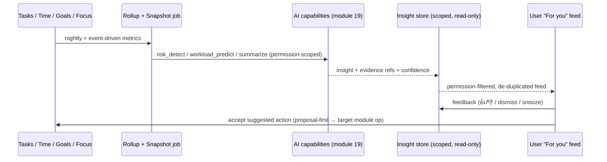

# 36 · AI Productivity Insights

> Follows the [Master PRD Template](./00-prd-template.md). This module is Numil's
> **analytical brain**: it turns raw task/time/goal/focus data into *narrative* insight —
> project health, risk detection, a productivity score, workload prediction, and a weekly
> review — competing with **Linear's insights, ClickUp dashboards, Motion, Reclaim, and
> Viva Insights**, while staying calm, private, and one tap from the work.

---

## 1. Purpose

AI Productivity Insights answers the questions dashboards can't: *"Are we going to make it?
What's slipping? Am I overloaded? What should I do differently?"* It **consumes** the
capabilities of [AI Assistant & Copilot](./19-ai-assistant-copilot.md) and the metrics of
[Reports & Analytics](./16-reports-analytics.md), then presents proactive, explainable,
human-readable insights instead of charts to interpret.

**User problem it solves.** [Reports](./16-reports-analytics.md) show *what happened* but
require the user to spot patterns and draw conclusions — and busy people don't have time.
Numil's insights layer does the noticing: **at-risk projects before the deadline**,
**overload before burnout**, and a **weekly narrative** like a chief-of-staff memo — each
with evidence and a suggested next action.

**User goals**
- See "what needs my attention" without building a dashboard.
- Get early warning on slipping projects/goals and overloaded people.
- Understand a personal **productivity score** and how to improve it (non-judgmentally).
- Receive a **weekly review** narrative (Sunsama-style) auto-drafted from real activity.
- Trust the insight: every claim links to its underlying data.

**Business goals**
- Differentiate on *proactive intelligence* (Motion/Reclaim/Viva territory).
- Drive manager/exec adoption and premium/enterprise upgrades (insights as a paid tier).
- Increase retention via a valuable weekly touchpoint (the review email/notification).

**KPIs:** insight views, **insight → action conversion** (accepted suggestions), risk
early-warning lead time (days before due a risk was flagged), weekly-review open rate,
productivity-score engagement, false-positive/dismissal rate (quality), premium conversion
attributable to insights.

**Status:** productivity score, project health, risk detection, workload prediction, weekly
review ✅ v1 · team/portfolio health, burnout early-warning, anomaly detection 🔜 v1.1 ·
custom insight rules, benchmarks, predictive scenario planning 🟣 v2 · autonomous
recommendations 🧪 Experimental. All insights are **read-only and explainable**.

---

## 2. Navigation

**Entry points**
- **Sidebar → Insights** (dedicated hub) and a **Home dashboard "For you" card**
  (top 1–3 insights).
- **In-context badges:** an "⚠ At risk" chip on a project/goal opens its health insight;
  a workload chip on a person opens their capacity insight.
- **Weekly review** arrives as a notification + a full-screen story on Friday/Monday.
- From [Reports](./16-reports-analytics.md): "Explain this trend" → an AI narrative.
- From [Goals](./22-goals-okrs-milestones.md): "Forecast / Why at risk?".
- Deep links: `numil://insights`, `numil://insights/project/{id}`,
  `numil://insights/review/{period}`, `numil://insights/score`.

**Route:** `src/app/insights/index.tsx` (hub), `src/app/insights/[type]/[id].tsx` (detail),
`src/app/insights/review/[period].tsx` (weekly review story). The hub is a **push**
destination; individual insights open as **bottom sheets** (glanceable) with a "See details"
push; the weekly review is a **full-screen paged story** (like Spotify Wrapped, but calm).

**Hierarchy / breadcrumbs**
```text
Insights ▸ For you
Insights ▸ Project health ▸ [Project]
Insights ▸ Weekly review ▸ [Week of Jul 13]
Insights ▸ Productivity score
```

**Transitions:** hub cards expand to detail (`spring.gentle`); the weekly review pages
horizontally with a soft parallax; score ring animates on open.

**Modal vs push:** hub/detail = push; quick insight = sheet; weekly review = full-screen
modal story with a dismiss.

---

## 3. Complete UI Layout

```text
┌───────────────────────────────────────────────┐
│  Insights                              🗓 ▾     │  ← large title, period selector
├───────────────────────────────────────────────┤
│  For you                                        │
│  ┌─────────────────────────────────────────┐   │
│  │ ⚠ "Launch" project is at risk            │   │  ← InsightCard (priority)
│  │   3 tasks slipped · due in 5d · 62% done │   │
│  │   [ See why ]      [ Suggest fix ✨ ]    │   │
│  ├─────────────────────────────────────────┤   │
│  │ 🔥 You're overloaded Thu–Fri (137%)      │   │
│  │   [ Rebalance ✨ ]   [ Dismiss ]         │   │
│  ├─────────────────────────────────────────┤   │
│  │ ✅ On-time rate up 12% this week         │   │
│  └─────────────────────────────────────────┘   │
├───────────────────────────────────────────────┤
│  Productivity score                             │
│     ◍ 82  Good   ▲ +5    "Strong focus week"    │  ← score ring + trend + one-liner
│     Focus 2.1h/day · On-time 91% · Balance ●●●○ │
├───────────────────────────────────────────────┤
│  Weekly review · Week of Jul 13     [ Open ▸ ]  │  ← narrative entry
└───────────────────────────────────────────────┘

┌──────────── Insight detail (sheet) ────────────┐
│  ⚠ "Launch" is at risk            confidence ●●●○│
│  Because:                                        │
│   • 3 tasks slipped their due date (avg +2.4d)  │  ← evidence, each links to data
│   • Velocity down 30% vs last 2 weeks           │
│   • 1 blocker unresolved 4d (dependency)        │
│  Projected completion: Jul 24 (due Jul 19)      │  ← forecast
│  Suggested actions:                              │
│   [ Reassign 2 tasks ✨ ] [ Extend due ] [ Snooze ]│
│  Sources: 6 tasks, 2 goals ▸                     │  ← citations
└───────────────────────────────────────────────┘
```

- **Top:** large title "Insights" + a **period selector** (this week / month / quarter).
- **"For you" feed:** a prioritized, de-duplicated list of `InsightCard`s (risk, overload,
  wins, nudges). Each card is a single claim + minimal evidence + **actions** (mostly
  proposal-first AI actions, plus Dismiss/Snooze). This is the one screen a manager checks.
- **Productivity score:** a ring (0–100) with a band label, week-over-week trend arrow, a
  one-line narrative, and the contributing factors (focus, on-time, balance, throughput).
- **Weekly review:** an entry to the full narrative story.
- **Insight detail (sheet):** the claim, a **confidence** indicator, an **explainable
  "Because"** list where every bullet links to the underlying tasks/goals/time entries, a
  **forecast**, **suggested actions**, and **source citations** (transparency is mandatory —
  no black-box claims).
- **Calm design:** at most 3 cards at rest ("See all" reveals more); dismissed insights don't
  return unless the situation materially changes; no red-alert spam.
- **Landscape / iPad:** two-pane — feed left, selected insight detail right; the weekly
  review becomes a wide multi-panel layout.
- **Tab bar:** visible on hub; hidden during the full-screen weekly review story.

**Insight generation pipeline (sequence):**


---

## 4. Complete Component Breakdown

| Area | Components |
|------|-----------|
| Nav / header | `GlassNavBar`, `LargeTitle`, `PeriodSelector` (popover) |
| Feed | `InsightFeed` (virtualized), `InsightCard` (`SeverityIcon`, `ClaimText`, `EvidenceMiniList`, `ActionBar`), `DismissSnoozeMenu`, `WinCard` (positive) |
| Score | `ScoreRing` (0–100), `ScoreBandLabel`, `TrendArrow`, `FactorBreakdown` (`FactorBar` ×4), `ScoreNarrativeLine` |
| Insight detail | `InsightDetailSheet`, `ConfidenceDots`, `BecauseList` (`EvidenceRow` → deep link), `ForecastCard`, `SuggestedActionList` (proposal-first), `SourceCitationChip` (from module 19) |
| Weekly review | `ReviewStory` (paged), `ReviewPage` (headline + stat + chart), `ReviewShareCard`, `ReflectionPrompt`, `NextWeekPlanCard` |
| Health | `ProjectHealthGauge`, `RiskBadge`, `VelocitySparkline`, `BlockerCallout`, `WorkloadHeatstrip` |
| Feedback | `Skeleton`, `Toast` (undo), `Banner` (data warming / AI off), `FeedbackThumbs` (👍/👎), `EmptyState` |
| Governance | `AIDisclosureBadge`, `InsightSourceInfo`, `OptOutRow` |

Primitives per [03-design-system-ui.md](./03-design-system-ui.md); AI proposal/citation
components are shared with [module 19](./19-ai-assistant-copilot.md).

---

## 5. Modern Features

Each feature: **Purpose · Workflow · UI · Permissions · Offline · API · DB · Notify · AC.**
All insights are **read-only, explainable, and dismissible**; any *action* is proposal-first.

**Role permission matrix** (module-specific deltas; base model in
[shared/rbac-permissions.md](./shared/rbac-permissions.md)):

| Capability | Owner | Admin | Manager | Member | Guest |
|-----------|:-----:|:-----:|:-------:|:------:|:-----:|
| View **own** productivity score (private) | ✅ | ✅ | ✅ | ✅ | ❌ |
| View own risks / workload | ✅ | ✅ | ✅ | ✅ | ❌ |
| View **team** health/workload (aggregate) | ✅ | ✅ | ✅ (their team) | ❌ | ❌ |
| View **org** portfolio health | ✅ | ✅ | ❌ | ❌ | ❌ |
| Configure insight types / thresholds | ✅ | ✅ | ❌ | ❌ | ❌ |
| Manage AI governance ([module 19](./19-ai-assistant-copilot.md)) | ✅ | ✅ | ❌ | ❌ | ❌ |
| Share a team review to chat/doc | ✅ | ✅ | ✅ | ❌ | ❌ |

> A user's personal score, personal tasks, and habit data are **never** visible to
> managers/Admins; team/portfolio views are aggregate and k-anonymized only.

### 5.1 Productivity score ✅ (personal, non-judgmental)
- **Purpose:** a single, improvable measure of a person's productive week — motivating, never
  shaming.
- **Workflow:** the score (0–100) is computed from weighted factors — **focus time** (module
  35), **on-time completion rate**, **workload balance** (avoid overload/underload), and
  **throughput vs personal baseline**. A one-line narrative explains the biggest driver;
  tapping shows the breakdown and how to nudge it up.
- **UI:** `ScoreRing`, `FactorBreakdown`, `ScoreNarrativeLine`.
- **Permissions:** **personal and private** — a user's own score is never shown to managers
  or Admins; only the user sees it.
- **Offline:** last computed score cached; recompute needs server (clear "as of" timestamp).
- **API:** `GET /insights/score?period=`.
- **DB:** `productivity_scores` (per user/period, factors_json).
- **Notify:** weekly score summary (opt-in); "score improved" celebration.
- **AC:** score is explainable (factor breakdown), compares to the user's own baseline (not
  peers), is private to the user, and never uses guilt framing.

### 5.2 Project & goal health ✅ (Linear/Asana health)
- **Purpose:** a red/amber/green health signal with the *reason*.
- **Workflow:** for each project/goal the model evaluates schedule variance (slipped due
  dates), velocity trend, open blockers, scope change, and check-in confidence
  ([Goals](./22-goals-okrs-milestones.md)) → a health status + a short "Because" list + a
  projected completion date.
- **UI:** `ProjectHealthGauge`, `RiskBadge`, `VelocitySparkline`, `BlockerCallout`.
- **Permissions:** requires read on the project/goal (per
  [RBAC](./shared/rbac-permissions.md)); managers see their scope, Admins broader.
- **Offline:** cached snapshot; live recompute needs network.
- **API:** `GET /insights/project/:id`, `GET /insights/goal/:id`.
- **DB:** `insights` rows (type=`project_health`), evidence_json, confidence.
- **Notify:** health downgrade (green→amber→red) notifies the project lead (debounced).
- **AC:** health status is explainable with linked evidence; a downgrade is surfaced before
  the due date; every claim is traceable to source tasks/goals.

### 5.3 Risk detection & early warning ✅ (Motion/Reclaim)
- **Purpose:** flag what will slip *before* it does.
- **Workflow:** continuously scans for at-risk tasks/projects/goals (deadline vs remaining
  work, stalled items, unresolved dependencies, stale check-ins) and raises an insight with a
  suggested mitigation (reassign, reschedule, split, escalate).
- **UI:** priority `InsightCard`s in "For you"; in-context ⚠ badges.
- **Permissions:** scope-limited to what the viewer can access.
- **Offline:** cached; new detections need network.
- **API:** `GET /insights?filter[type]=risk&scope=`.
- **DB:** `insights` (type=`risk`), `insight_feedback` for tuning.
- **Notify:** at-risk digest (opt-in, batched — never alarm spam).
- **AC:** risks come with evidence + a concrete suggested action; false positives can be
  dismissed and won't recur unless the situation changes; lead time is measurable.

### 5.4 Workload prediction & capacity ✅ (Reclaim/Motion)
- **Purpose:** predict overload/underload per person and day.
- **Workflow:** estimates committed effort (task durations/estimates) vs available capacity
  (working hours, meetings from [Calendar](./11-calendar-scheduling.md), focus prefs) to
  produce a **load %** per day; flags >100% (overload) and suggests rebalancing (defer,
  reassign, or AI reschedule via [module 19](./19-ai-assistant-copilot.md)).
- **UI:** `WorkloadHeatstrip` (day-by-day), overload `InsightCard` with "Rebalance ✨".
- **Permissions:** self always; managers see **team** capacity (aggregate + per-member within
  scope), not personal tasks outside scope.
- **Offline:** cached prediction; recompute needs network.
- **API:** `GET /insights/workload?scope=&period=`.
- **DB:** `insights` (type=`workload`), inputs referenced not copied.
- **Notify:** overload warning (self) / team-capacity alert (manager), debounced.
- **AC:** load % accounts for estimates + meetings + working hours; rebalance suggestions are
  proposal-first and reversible; personal tasks stay private in team views.

### 5.5 Weekly review narrative ✅ (Sunsama/Viva)
- **Purpose:** an auto-drafted, human-readable weekly recap + a plan for next week.
- **Workflow:** Friday/Monday the model composes a **story**: what you completed, focus time,
  on-time rate, wins, what slipped and why, and 2–3 suggested focuses for next week. The user
  can add a **reflection**, tweak the plan, and (opt-in) share a team version.
- **UI:** `ReviewStory` paged narrative; `NextWeekPlanCard`; `ReflectionPrompt`.
- **Permissions:** personal review is private; a **team review** (manager) aggregates the
  team without exposing individuals' private data.
- **Offline:** last review cached and readable offline; generation needs network.
- **API:** `POST /insights/review` (generate), `GET /insights/review/:period`.
- **DB:** `weekly_reviews` (period, narrative_json, reflection, plan_json).
- **Notify:** "Your week in review is ready" (Friday/Monday, respecting quiet hours).
- **AC:** the narrative is grounded in real data with source links; the plan is editable and
  can create tasks (proposal-first); reflections persist; team review excludes private data.

### 5.6 Explainability & source citations ✅ (trust requirement)
- **Purpose:** never a black box — every insight shows *why* and links to evidence.
- **Workflow:** each insight has a "Because" list; tapping a bullet deep-links to the exact
  tasks/goals/time entries/blockers that drove it; a confidence indicator sets expectations.
- **UI:** `BecauseList`, `EvidenceRow`, `SourceCitationChip`, `ConfidenceDots`.
- **Permissions:** citations only ever link to data the viewer can access.
- **Offline:** cached evidence viewable; live re-verification needs network.
- **API:** evidence embedded in the insight payload (`evidence[]` with entity refs).
- **DB:** `insights.evidence_json` (entity refs, not copied content).
- **Notify:** none.
- **AC:** every insight exposes evidence + confidence; citations respect permissions and are
  re-validated at view time (stale evidence omitted).

### 5.7 Feedback loop & tuning ✅
- **Purpose:** improve relevance and reduce false positives.
- **Workflow:** 👍/👎 and Dismiss/Snooze on every insight; feedback tunes thresholds
  per-user/org over time; dismissed insights don't recur unless the situation materially
  changes.
- **UI:** `FeedbackThumbs`, `DismissSnoozeMenu`.
- **Permissions:** any viewer of the insight.
- **Offline:** feedback queued (append-only).
- **API:** `POST /insights/:id/feedback`.
- **DB:** `insight_feedback` (append-only).
- **Notify:** none.
- **AC:** feedback is recorded; a downvoted/dismissed insight type is suppressed appropriately;
  suppression is reversible in settings.

### 5.8 Team & portfolio health 🔜 v1.1
- **Purpose:** roll project/goal health into a team and org portfolio view for managers/execs.
- **Workflow:** aggregate health across projects/goals with drill-down; anomaly detection
  flags sudden velocity drops or risk clusters.
- **UI:** portfolio grid of health gauges (aligns with
  [Goals portfolio](./22-goals-okrs-milestones.md) and
  [Reports](./16-reports-analytics.md)).
- **Permissions:** Manager (team) / Admin+ (org); scope-enforced.
- **Offline:** cached snapshot.
- **API:** `GET /insights/portfolio?scope=`.
- **DB:** derived from `insights` + `goal_progress_snapshots`.
- **Notify:** weekly portfolio health digest (opt-in).
- **AC:** portfolio reflects live health within permission scope; anomalies flagged with
  evidence.

---

## 6. Smart AI Features

This module is a **consumer** of the [AI Assistant & Copilot](./19-ai-assistant-copilot.md)
capability registry — it does not define new models, it composes existing capabilities into
insights. Capability mapping (stable `capability` ids for analytics + governance):

| Insight | Underlying AI capability (module 19) |
|---------|--------------------------------------|
| Productivity score narrative | `productivity_score` + `summarize` |
| Project/goal health | `project_health` |
| Risk detection / early warning | `risk_detect` + `deadline_predict` |
| Workload prediction & rebalance | `workload_predict` + `smart_schedule` (for the fix) |
| Weekly review narrative | `summarize` + `action_items` (for the plan) |
| "Explain this trend" (from Reports) | `summarize` over [module 16](./16-reports-analytics.md) metrics |
| Suggested actions on any insight | `auto_prioritize` / `smart_schedule` (proposal-first) |

**Guardrails (inherited from module 19):** proposal-first for any write (Accept/Edit/Undo),
permission-scoped context and citations, no external-model training on org data (per policy),
full AI audit (`ai_actions`), per-org enable/disable + credit quotas, and prompt-injection
defenses (task/comment content treated as data). Every insight logs `ai_invoked` with the
capability, latency, and whether a suggested action was accepted.

---

## 7. Productivity Features

- **"For you" morning surface:** the 1–3 things that need attention, integrated with the
  [Focus](./35-focus-pomodoro-habits.md) morning routine ("Plan my day").
- **Rebalance my week:** one-tap hand-off to AI scheduling (module 19) from an overload
  insight; fully reversible.
- **Score → habit loop:** the productivity score rewards consistent focus/on-time behavior,
  reinforcing [habits & routines](./35-focus-pomodoro-habits.md).
- **Weekly review ritual:** a durable retention touchpoint that closes the week and seeds the
  next, with an editable plan that creates tasks.
- **Goal forecast:** attainment prediction surfaced directly on
  [goals](./22-goals-okrs-milestones.md) ("~78% likely to hit target").
- **Insight → automation:** a recurring risk pattern can be turned into an
  [automation](./20-automation-workflow-rules.md) (e.g., "auto-escalate tasks 2 days
  overdue").

---

## 8. Enterprise Features

- **Team & portfolio health dashboards** (Manager/Admin) with scope-enforced drill-down.
- **Burnout / overload early warning** 🔜 at a **team-aggregate** level — flags sustained
  overload trends **without exposing any individual's private score or personal tasks**.
- **Custom insight rules & thresholds** 🟣: admins tune what counts as "at risk" per org.
- **Benchmarks** 🟣: compare a team's on-time rate/velocity to org norms (opt-in, aggregate).
- **AI governance:** insights honor the org's AI settings (capabilities, no-train, region,
  quotas) from [module 19](./19-ai-assistant-copilot.md) §8; insights can be disabled per role.
- **Audit & explainability for compliance:** every insight's inputs are traceable; AI actions
  logged in `ai_actions` and surfaced to
  [Activity Feed & Audit Logs](./29-activity-feed-audit-logs.md).
- **Export:** insight snapshots and weekly reviews export to
  [Reports & Analytics](./16-reports-analytics.md).

---

## 9. Collaboration Features

- **Shared team review** (opt-in): a manager shares the team's aggregate weekly narrative to
  [Team Chat](./26-team-chat-collaboration.md) or a project doc.
- **Insight → discussion:** post an insight (with evidence) as a comment to rally the team
  around a risk (proposal-first).
- **Assign a mitigation:** from a risk insight, create/assign a follow-up task in one step.
- **Privacy-first:** only aggregate/team-scoped insights are shareable; personal scores,
  tasks, and habit data are **never** exposed to others.
- **Celebrations:** team wins ("on-time rate up 12%") can be shared as reinforcement.

---

## 10. Offline Architecture

Deltas over [shared/offline-sync-engine.md](./shared/offline-sync-engine.md):
- Insights are **derived/read-only**: they are **computed server-side** and cached locally as
  read-through snapshots with an "as of {time}" label — never recomputed on-device.
- Offline, the last snapshot is fully viewable (feed, score, last weekly review); a subtle
  banner notes data may be stale; **no dead spinners**.
- **User interactions that write** (dismiss, snooze, 👍/👎, accepting a suggested action) are
  optimistic and queued as ops; feedback is append-only (never conflicts).
- Accepting a suggested action (reassign/reschedule/create task) routes through the target
  module's normal offline op path (e.g., a task PATCH), so it syncs losslessly like any edit.
- Fresh insight generation (weekly review, new risk scan) requires network and is clearly
  gated.

---

## 11. Security

Deltas over [shared/security-baseline.md](./shared/security-baseline.md):
- **Strict permission-scoped computation:** an insight is generated only from data the viewer
  can access; RAG/aggregation runs over authorized rows server-side (per
  [RBAC](./shared/rbac-permissions.md)); citations re-checked at view time.
- **Personal privacy is inviolable:** a user's productivity score, personal tasks, and habit
  data are never visible to managers/Admins; team insights are aggregated/de-identified.
- **No task content in analytics or AI audit** (metadata + hashes only, per
  [module 19](./19-ai-assistant-copilot.md) §11); insights store entity *references*, not
  copied content.
- **Prompt-injection defense:** task/comment text used as evidence is treated as untrusted
  data, never instructions.
- **DLP:** insights cannot surface content outside the user's scope, even indirectly via
  aggregates (k-anonymity threshold for team metrics to prevent re-identification).

---

## 12. Notification System

Deltas over [12-notifications-alerts.md](./12-notifications-alerts.md):
- Emits: **weekly review ready**, **project/goal health downgrade** (to the lead), **at-risk
  digest** (opt-in, batched), **overload warning** (self), **team-capacity alert** (manager),
  **score improved** celebration, and **anomaly detected** (🔜).
- All insight notifications are **debounced and digested** — Numil never spams alarms; a flurry
  of risks becomes one "3 items need attention" summary.
- Respects quiet hours and per-category preferences; the weekly review is scheduled at a
  user-chosen day/time.
- iOS notification category actions: **Open**, **Snooze insight**, **See why**.

---

## 13. Accessibility

Deltas over [shared/accessibility-spec.md](./shared/accessibility-spec.md):
- The score ring exposes a text value ("Productivity score 82 out of 100, Good, up 5") — never
  color/number-shape alone; severity uses icon + label + color.
- Insight cards read as: claim, then evidence, then available actions; the "Because" list and
  citations are navigable with dates/names spoken.
- The weekly review story is fully navigable without gesture-only paging (buttons + VoiceOver
  swipe), with each page's headline + stat announced.
- Charts/sparklines have text-equivalent summaries; confidence dots read "confidence 3 of 4".
- Suggested actions expose labeled `accessibilityActions` (Accept / Edit / Dismiss).

---

## 14. Animations

Deltas over [shared/animation-spec.md](./shared/animation-spec.md):
- Score ring animates stroke-dashoffset over `motion.base` on open; trend arrow slides in.
- Insight card appear/dismiss: slide + fade (`spring.gentle`); dismissing collapses height and
  offers a 5s undo.
- Weekly review story: horizontal paging with soft parallax on headline/stat; a gentle
  celebration on the "wins" page (`spring.bouncy`, ≤1.2s).
- Accepting a suggested action: the item animates toward its destination (shared-element).
- Reduce Motion: cross-fades replace slides/parallax; no celebration; ring updates without
  bounce; content remains fully legible.

---

## 15. Performance

- **Heavy computation is server-side and precomputed** on a schedule (nightly + event-driven
  incremental updates); the client fetches ready snapshots — the insight feed opens <150ms
  from cache.
- Insight feed & evidence lists virtualized (FlashList); the weekly review pages lazy-mount.
- Score/health recompute is incremental (only affected entities), targeting sub-second
  freshness after a relevant change, with a bounded backfill window.
- AI narrative generation is streamed (SSE) for perceived speed and cancelable; strict
  timeouts fall back to a metric-only summary (never hangs).
- Aggregates use materialized rollups (shared with [Reports](./16-reports-analytics.md)) to
  avoid scanning raw tables on every view; k-anonymity checks run at query time.

---

## 16. Database Design

```text
insights(id, org_id, scope_type, scope_id?, subject_user_id?, type, severity, status,
         claim, evidence_json, confidence, forecast_json?, suggested_actions_json,
         valid_from, valid_until?, generated_by_model, created_at, dismissed_at?)  -- read-only
insight_feedback(id, insight_id→insights, user_id, rating, action, created_at)     -- append-only
productivity_scores(id, user_id, period, score, band, factors_json, baseline_json, created_at)
weekly_reviews(id, org_id?, user_id?, scope_type, scope_id?, period, narrative_json,
               plan_json, reflection?, shared, created_at)
insight_snapshots(id, org_id, scope_type, scope_id, metrics_json, captured_at)     -- rollup cache
insight_settings(org_id, enabled_types[], thresholds_json, review_schedule_json)
```

**Indexes:** `insights(org_id, scope_type, scope_id, status)`,
`insights(subject_user_id, type) WHERE status='active'`,
`insights(org_id, severity, created_at DESC)` (feed), `insight_feedback(insight_id)`,
`productivity_scores(user_id, period)`, `weekly_reviews(user_id, period)`,
`insight_snapshots(org_id, scope_type, scope_id, captured_at)`. **Constraints:** a personal
insight (`productivity_score`) has `subject_user_id = viewer` and is owner-only; team/portfolio
insights enforce a **k-anonymity threshold** (min group size) before exposing aggregates;
`insights` are **read-only/immutable** (superseded rows get `valid_until`, never edited in
place); feedback/snapshots are append-only. Insights store entity **references** in
`evidence_json`, never copied task content. Aligns with
[17-data-model-api.md](./17-data-model-api.md) and reuses AI audit tables from
[module 19](./19-ai-assistant-copilot.md) (`ai_actions`).

---

## 17. API Design

Follows [shared/api-conventions.md](./shared/api-conventions.md).

| Method | Path | Purpose |
|--------|------|---------|
| GET | `/insights?scope=&filter[type]=risk,workload&filter[status]=active&cursor=` | Feed (scoped, paginated) |
| GET | `/insights/:id?expand=evidence` | Insight detail + citations |
| POST | `/insights/:id/feedback` | 👍/👎 / dismiss / snooze (append-only) |
| POST | `/insights/:id/actions/:actionId/accept` | Accept a suggested action (routes to target module) |
| GET | `/insights/score?period=` | Personal productivity score (private) |
| GET | `/insights/project/:id` · `/insights/goal/:id` | Health for a project/goal |
| GET | `/insights/workload?scope=&period=` | Workload/capacity prediction |
| POST | `/insights/review?period=` (SSE) | Generate weekly review narrative (stream) |
| GET | `/insights/review/:period` | Fetch a generated review + reflection |
| PUT | `/insights/review/:period/reflection` | Save reflection / edited plan |
| GET | `/insights/portfolio?scope=` | Team/org portfolio health (🔜) |
| GET/PUT | `/orgs/:id/insights/settings` | Enabled types, thresholds, review schedule (Admin) |

**Realtime:** channel `user:{id}` — `insight.created` / `insight.updated` (new risk, health
change) so the "For you" feed updates live; `org:{id}` for portfolio health changes.
**Streaming:** `POST /insights/review` returns SSE narrative tokens; client can `abort`.
**Errors:** `403 forbidden` (scope / another user's private score), `422` (unknown period),
`429 rate_limited` (AI quota — falls back to metric-only), `409 gone` (subject deleted).
**Idempotency-Key** on feedback and action-accept; insight generation is safe to retry.

**Sample request/response (insight detail)**
```http
GET /v1/insights/ins_launch_risk?expand=evidence   X-Org-Id: org_123
```
```json
{
  "data": {
    "id": "ins_launch_risk",
    "type": "risk",
    "severity": "high",
    "scopeType": "project",
    "scopeId": "proj_launch",
    "claim": "\"Launch\" is at risk of missing its Jul 19 due date.",
    "confidence": 0.78,
    "forecast": { "projectedCompletion": "2026-07-24", "dueAt": "2026-07-19" },
    "evidence": [
      { "kind": "slipped_tasks", "count": 3, "avgSlipDays": 2.4, "refs": ["task_a","task_b","task_c"] },
      { "kind": "velocity_drop", "pct": -30, "window": "14d" },
      { "kind": "blocker", "taskId": "task_d", "ageDays": 4 }
    ],
    "suggestedActions": [
      { "id": "act_reassign", "type": "reassign", "label": "Reassign 2 tasks", "capability": "smart_schedule" },
      { "id": "act_extend", "type": "extend_due", "label": "Extend due date" }
    ]
  },
  "meta": { "requestId": "req_c19" }
}
```

---

## 18. Edge Cases

- **New user / cold start (little data):** insights show a friendly "gathering signal" state
  and only surface high-confidence items; the score shows "warming up" until a baseline exists.
- **Sparse data / low confidence:** an insight below the confidence threshold is not shown as
  an alert (kept as a low-key observation) to avoid false alarms.
- **Permission lost / scope changed:** insights and citations re-validate at view time; items
  the viewer can no longer access are omitted; a stale detail deep link shows "no longer
  available".
- **Subject deleted (project/task/goal):** dependent insights are invalidated (`valid_until`)
  and drop from the feed; no dangling references.
- **Timezone/DST on weekly boundaries:** the "week" and score period use the user's local
  calendar week; a DST week is normalized so the review fires once at the scheduled local time.
- **k-anonymity breach risk:** a team aggregate over too few people is suppressed (shows "not
  enough people to report anonymously") to prevent re-identification.
- **AI quota exhausted / model outage:** narratives fall back to a **metric-only** summary
  (still useful, clearly labeled "AI unavailable"); the app is never blocked.
- **Prompt injection in evidence content:** treated as data; never alters the insight's logic
  or actions.
- **Dismissed insight recurs:** suppressed unless the situation materially changes (e.g., a
  dismissed risk that then worsens re-surfaces once, labeled "worsened").
- **Offline:** last snapshot readable; generation gated; feedback/actions queued.
- **Conflicting suggestions (two insights suggest opposite actions):** the feed de-duplicates
  and prioritizes by severity/confidence so the user isn't given contradictory one-tap actions.
- **Score gaming:** score is personal + baseline-relative (no leaderboard by default), reducing
  incentive to game; anomaly checks flag implausible spikes.

---

## 19. User States

- **First-time:** "gathering signal" empty state + an explainer that insights are private by
  default and how evidence works; opt-in to weekly review.
- **Returning / power user:** rich "For you" feed, score trend, weekly review ritual, one-tap
  rebalance, feedback-tuned relevance.
- **Member:** personal score (private), risks/workload for their own work and accessible
  projects.
- **Manager:** team health, workload, and portfolio within scope; **aggregate** wellbeing only
  (no individual private data).
- **Admin / Owner:** org portfolio, insight settings/thresholds, AI governance; Owner sees
  plan/credit usage ([Billing](./31-billing-subscription.md)).
- **Guest:** no insights (or limited to explicitly shared reviews); no aggregates.
- **Offline / poor network:** cached snapshots viewable; generation gated; no dead spinners.
- **Tablet / landscape:** two-pane feed + detail; wide weekly-review layout.
- **Dark mode / large text / a11y:** tokens + Dynamic Type; ring/severity have text values;
  streaming announced politely; Reduce Motion honored.

---

## 20. Analytics Events

Schema per [shared/analytics-taxonomy.md](./shared/analytics-taxonomy.md) (reuses `ai_invoked`
from [module 19](./19-ai-assistant-copilot.md)).

| event | key properties |
|-------|----------------|
| `insights_opened` | `scope`, `card_count` |
| `insight_viewed` | `type` (risk/health/workload/score/win), `severity`, `confidence_bucket` |
| `insight_evidence_opened` | `type`, `evidence_kind` |
| `insight_action_accepted` | `type`, `action` (reassign/reschedule/extend/create_task), `capability` |
| `insight_dismissed` / `insight_snoozed` | `type`, `reason` |
| `insight_feedback` | `type`, `rating` (up/down) |
| `productivity_score_viewed` | `band`, `trend` |
| `weekly_review_generated` | `scope`, `period`, `ai_fallback` |
| `weekly_review_opened` | `via` (notification/hub), `pages_viewed` |
| `weekly_review_shared` | `target` (chat/doc) |
| `insight_notification_opened` | `type`, `action` |

No task titles/PII in properties; team aggregates respect k-anonymity (privacy per taxonomy
and [module 19](./19-ai-assistant-copilot.md) §11).

---

## 21. Acceptance Criteria

1. The "For you" feed shows a prioritized, de-duplicated set of insights (≤3 at rest).
2. Every insight has a plain-language claim, evidence, and (where relevant) a suggested action.
3. Every insight exposes a "Because" list where each item deep-links to underlying data.
4. Citations only ever link to data the viewer is permitted to access (re-validated at view).
5. Each insight shows a confidence indicator; low-confidence items aren't shown as alerts.
6. The productivity score (0–100) is explainable via a factor breakdown.
7. The score compares to the user's own baseline, not peers, and uses non-judgmental framing.
8. A user's productivity score and personal/habit data are private — never visible to managers/Admins.
9. Project/goal health shows R/A/G status with reasons and a projected completion date.
10. A health downgrade surfaces before the due date and notifies the lead (debounced).
11. Risk detection flags at-risk items early with evidence and a concrete suggested mitigation.
12. Dismissed/false-positive risks don't recur unless the situation materially worsens.
13. Workload prediction computes a per-day load % from estimates + meetings + working hours.
14. Overload (>100%) is flagged with a proposal-first "Rebalance" hand-off to AI scheduling.
15. Team workload views show aggregate/scoped data; personal tasks stay private.
16. The weekly review generates a data-grounded narrative with source links.
17. The weekly review's next-week plan is editable and can create tasks (proposal-first).
18. Reflections persist; a team review excludes any individual's private data.
19. Team aggregates enforce a k-anonymity minimum group size (no re-identification).
20. All insights are read-only/immutable; superseded insights are versioned, not edited.
21. Any *action* on an insight is proposal-first (Accept/Edit/Undo) and reversible.
22. Accepting an action routes through the target module's normal offline op path.
23. 👍/👎, Dismiss, and Snooze are recorded and tune future relevance.
24. Insight computation is permission-scoped server-side (RBAC/ABAC enforced).
25. No task content is stored in analytics or AI audit (references/metadata only).
26. Prompt-injection content in evidence is treated as data, never instructions.
27. AI quota exhaustion/model outage falls back to a metric-only summary; app never blocks.
28. Notifications are debounced/digested (no alarm spam) and respect quiet hours.
29. The weekly review notification fires at the user's chosen day/time (DST-safe).
30. Insight capabilities honor org AI governance (enable/disable per role, no-train, region).
31. Offline shows the last cached snapshot with an "as of" label and no dead spinners.
32. Offline feedback/actions queue optimistically and sync losslessly (idempotent).
33. Cold-start users see a "gathering signal" state; the score shows "warming up".
34. A deleted subject invalidates dependent insights (no dangling references).
35. Insights feed opens <150ms from cache; narratives stream and are cancelable.
36. VoiceOver reads score value, severity, evidence, and confidence; charts have text summaries.
37. Reduce Motion disables paging parallax/celebration; content stays legible.
38. iPad landscape shows two-pane feed + detail and a wide weekly-review layout.
39. Analytics events fire with correct properties (offline-buffered) and no PII.
40. A recurring risk pattern can be converted into an automation (module 20).

---

## 22. Future Roadmap

- **V1 (✅):** productivity score, project/goal health, risk detection + early warning,
  workload prediction, weekly review narrative, explainability + citations, feedback loop,
  proposal-first suggested actions, offline snapshots, AI governance inheritance.
- **V1.1 (🔜):** team & portfolio health, burnout/overload early warning (aggregate), anomaly
  detection, "Explain this trend" from [Reports](./16-reports-analytics.md), richer forecasts.
- **V2 (🟣):** custom insight rules/thresholds per org, benchmarks vs org norms, predictive
  scenario planning ("what if we add a person?"), insight → automation authoring, BYO-metric.
- **Future (💡):** cross-tool insights (integrations data), proactive "chief-of-staff" nudges,
  meeting-load insights, personalized coaching plans tied to
  [Focus & Habits](./35-focus-pomodoro-habits.md).
- **Experimental (🧪):** autonomous recommendations with approval gates, predictive attainment
  with confidence intervals, on-device personal insight model for privacy.
- **AI track:** deeper narrative quality, multi-week trend reasoning, natural-language Q&A over
  insights ("why did last week dip?").
- **Enterprise track:** compliance-grade explainability exports, per-department health cost
  centers, SIEM streaming of insight/AI events, eDiscovery of AI-generated insights.
