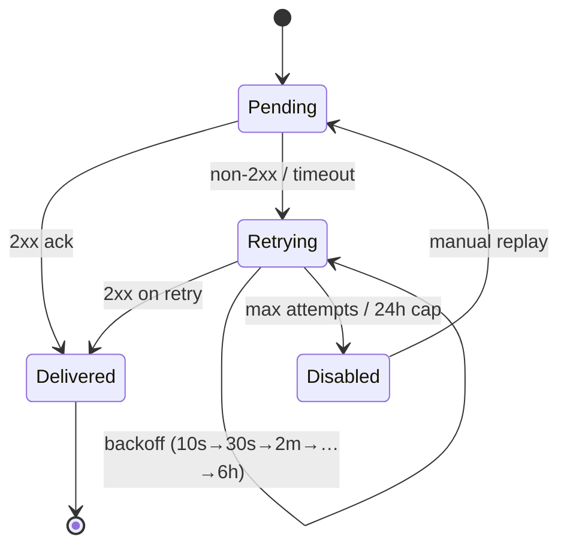

# 38 · Developer API & Webhooks

> Follows the [Master PRD Template](./00-prd-template.md). This module specifies Numil's
> **public** developer platform — the REST API, authentication (API keys + OAuth apps),
> scopes, rate limits, pagination, outbound webhooks (signing/retries/replay), SDKs, a
> sandbox, and a developer portal. It **builds on** the internal
> [shared/api-conventions.md](./shared/api-conventions.md) (envelope, pagination, errors,
> idempotency, realtime) and powers the no-code connectors in
> [Integrations](./32-integrations.md).

---

## 1. Purpose

The Developer API turns Numil from a closed app into a **platform**. Enterprises need to push
data in from their systems of record, pull data out for reporting/BI, and react to events in
real time. No-code users (via [Integrations](./32-integrations.md) → Zapier/Make) and pro
developers (custom scripts, internal tools, partner apps) all consume the same public surface.

**User problem it solves.** Without a public API, every custom need becomes a feature request
or a brittle scraping hack. Teams can't sync Numil with their data warehouse, provision users
from their HRIS, or trigger workflows in other systems when a task completes. The public API +
webhooks makes Numil **programmable and event-driven** while enforcing the same RBAC and
audit guarantees as the app.

**Audiences & goals**
- **No-code makers:** authenticate a Zapier/Make connector and use triggers/actions.
- **Internal developers:** script bulk imports, build dashboards, wire internal tools.
- **Partners / ISVs:** build a public OAuth app installable by many orgs (marketplace).
- **Data/BI teams:** pull incremental changes into a warehouse via the sync/export endpoints.
- **Ops/security:** governance — who has keys, what scopes, revoke instantly, full audit.

**Business goals**
- Ecosystem lock-in and network effects (more integrations → more retention).
- Enterprise requirement checkbox (API + webhooks + audit) to win deals.
- A future partner marketplace and usage-based monetization of high-volume API tiers.

**KPIs:** active API keys/OAuth apps, API call volume + error rate, webhook delivery success
rate (target ≥99.5%), median webhook delivery latency, time-to-first-successful-call for new
developers (portal funnel), % of orgs with ≥1 active integration.

---

## 2. Navigation

The developer platform is **primarily web** (developer portal at `https://developers.numil.app`)
because coding happens on a computer — but the iOS app exposes the governance surfaces a
mobile admin needs (view/rotate/revoke keys, see webhook health, install/approve OAuth apps).

**Entry points (in-app)**
- **Settings ▸ Developer** (Admin/Owner) → API keys, OAuth apps, webhooks, usage.
- **Settings ▸ Integrations ▸ Zapier/Make** links out to the portal (see module 32).
- Deep links: `numil://developer` (hub), `numil://developer/keys`, `numil://developer/webhooks`.

**Entry points (web portal)**
- Sign in with the same Numil identity/SSO → org-scoped developer console.
- API reference (OpenAPI), interactive explorer, SDK downloads, sandbox toggle, changelog.

**Route (app):** `src/app/settings/developer/index.tsx` (hub, push),
`.../keys.tsx`, `.../oauth-apps.tsx`, `.../webhooks.tsx`, `.../usage.tsx`. Creating a secret
opens a **one-time reveal sheet** (modal) because the plaintext is shown only once.

**Hierarchy & breadcrumbs**
```text
Settings ▸ Developer ▸ (API Keys | OAuth Apps | Webhooks | Usage & Logs)
```

**Modal vs push.** Hub and sub-sections are **push**. Secret creation/reveal and webhook
secret rotation are **modals** (one-time, must be copied before dismissing).

---

## 3. Complete UI Layout

```text
┌───────────────────────────────────────────────┐
│  ‹ Settings      Developer                      │  ← large title, glass nav
├───────────────────────────────────────────────┤
│  [ API Keys ] [ OAuth Apps ] [ Webhooks ] [Usage]│ ← segmented control
├───────────────────────────────────────────────┤
│  API Keys                              [ + New ]│
│  ┌───────────────────────────────────────────┐ │
│  │ 🔑 CI bot        scopes: tasks:rw   ● live │ │
│  │    sk_live_…4f2a   created Jul 2 · used 3m › │ │
│  │ 🔑 Warehouse     scopes: read-only  ● live │ │
│  │    sk_live_…9c10   created Jun 8 · used 1h › │ │
│  └───────────────────────────────────────────┘ │
├───────────────────────────────────────────────┤
│  Environment:  ( Live ●   Sandbox ○ )           │  ← sandbox toggle
├───────────────────────────────────────────────┤
│  Webhooks                              [ + New ]│
│   ▸ https://acme.co/numil-hook   ● healthy      │
│     events: task.*, comment.created  99.8% 24h  │  ← delivery success
└───────────────────────────────────────────────┘
```

**One-time secret reveal (modal)**
```text
┌──────────────── New API key ─────────────────┐
│  Copy this secret now — it won't be shown again│
│                                                │
│   sk_live_9f1c2a7b4e8d…                 [Copy] │
│                                                │
│  Scopes: tasks:read tasks:write comments:read  │
│  Expires: never (rotate every 90d recommended) │
│                                                │
│                       [ I've copied it ]       │
└────────────────────────────────────────────────┘
```

- **Top:** large title "Developer"; a **segmented control** switches API Keys / OAuth Apps /
  Webhooks / Usage.
- **API Keys list:** each row shows a name, **prefix-masked** key (`sk_live_…4f2a`), scope
  summary, live/sandbox badge, created + last-used, chevron to detail (rotate/revoke/scopes).
- **Environment toggle:** Live vs Sandbox — sandbox keys hit an isolated dataset.
- **Webhooks list:** endpoint URL, subscribed events, and a **health chip** (rolling success
  rate + last delivery), chevron → delivery log with replay.
- **Usage tab:** call volume, error rate, rate-limit headroom, top endpoints, per-key usage.
- **Landscape / iPad:** master-detail; the OpenAPI explorer embeds in the right pane.
- **Tab bar:** persists (Settings context); secret reveal is a blocking modal.

---

## 4. Complete Component Breakdown

| Area | Components |
|------|-----------|
| Nav | `GlassNavBar`, `SegmentedControl` (Keys/OAuth/Webhooks/Usage), `EnvironmentToggle` (Live/Sandbox) |
| API keys | `ApiKeyRow` (masked prefix, scopes, last-used), `NewKeySheet`, `ScopePicker` (grouped checkboxes), `SecretRevealModal` (one-time, Copy), `RotateKeyDialog`, `RevokeDialog` |
| OAuth apps | `OAuthAppRow`, `AppRegistrationForm` (name, redirect URIs, scopes, logo), `ClientSecretModal`, `InstalledOrgsList`, `ConsentPreviewCard` |
| Webhooks | `WebhookRow` (URL, events, health), `WebhookForm` (URL, event picker, secret), `EventMultiSelect`, `SigningSecretModal`, `DeliveryLogList`, `DeliveryRow` (status, code, latency), `ReplayButton`, `RetryTimeline` |
| Usage | `UsageChart` (calls/errors), `RateLimitMeter`, `TopEndpointsTable`, `PerKeyUsageRow` |
| Governance | `AdminOnlyLock`, `AuditRow`, `IpAllowlistEditor`, `ScopeAuditChip` |
| Feedback | `Skeleton`, `Toast` (copied / revoked with 5s undo where safe), `Banner` (sandbox mode, quota), `ConfirmDialog` |
| Portal (web) | OpenAPI explorer, code-sample tabs (cURL/JS/Python), SDK download cards, changelog feed |

Primitives per [03-design-system-ui.md](./03-design-system-ui.md).

---

## 5. Modern Features

Each feature: **Purpose · Workflow · UI · Permissions · Offline · API · DB · Notify · AC.**

### 5.1 API keys (server-to-server) ✅ (like Stripe/GitHub PATs)
- **Purpose:** simple bearer credentials for scripts, cron jobs, warehouses, CI bots.
- **Workflow:** Admin → New key → name + pick scopes + env (live/sandbox) → **secret shown
  once** (`sk_live_…` / `sk_test_…`) → use as `Authorization: Bearer sk_live_…`. Rotate
  (overlapping grace window) or revoke anytime.
- **UI:** `NewKeySheet` → `ScopePicker` → `SecretRevealModal`; list shows masked prefix +
  last-used.
- **Permissions:** create/rotate/revoke gated to Admin/Owner (or Manager per org policy).
- **Offline:** the app shows cached key metadata read-only; creation needs network.
- **API:** `POST /developer/api-keys`, `POST /developer/api-keys/:id/rotate`,
  `DELETE /developer/api-keys/:id`.
- **DB:** `api_keys` stores only a **hash** of the secret + prefix; plaintext never persisted.
- **Notify:** "New API key created", "key rotated/revoked" to org admins + audit log.
- **AC:** secret shown exactly once; only a hash is stored; revoke takes effect immediately
  (next call `401`); rotation supports an overlap window.

### 5.2 OAuth 2.0 apps (act on behalf of a user) ✅ (like Slack/Google apps)
- **Purpose:** let third-party/partner apps request user consent to act within their scope,
  without sharing passwords or long-lived org keys.
- **Workflow:** developer registers an app (name, redirect URIs, scopes, logo) → gets a
  `client_id` + `client_secret` → runs **Authorization Code + PKCE** flow → user sees a
  **consent screen** listing scopes → app receives an access + refresh token scoped to that
  user's permissions.
- **UI:** `AppRegistrationForm`, `ConsentPreviewCard` (what the user will see), `InstalledOrgsList`.
- **Permissions:** any developer can register an app; **installing** into an org and granting
  org-wide scopes requires an Admin; user-scoped grants require the user.
- **Offline:** N/A (browser flow); app shows registered apps from cache.
- **API:** `POST /developer/oauth-apps`; standard `GET /oauth/authorize`,
  `POST /oauth/token` (grant types: `authorization_code`, `refresh_token`, `client_credentials`
  for confidential server apps).
- **DB:** `oauth_apps`, `oauth_grants` (per user/org), `oauth_tokens` (hashed).
- **Notify:** "App X was installed / granted scopes" to admins + audit.
- **AC:** PKCE enforced; consent lists exact scopes; tokens honor the **user's** permissions
  (never elevate); refresh rotates; revoke kills the token family.

### 5.3 Scopes & least-privilege authorization ✅
- **Purpose:** constrain what a credential can do, independent of the actor's role.
- **Workflow:** every key/token carries scopes like `tasks:read`, `tasks:write`,
  `projects:read`, `comments:write`, `webhooks:manage`, `members:read`, `admin:audit`. The
  effective permission is `scope ∩ actorRolePermission` — a scope can never grant more than
  the underlying user/role allows (per [shared/rbac-permissions.md](./shared/rbac-permissions.md)).
- **UI:** `ScopePicker` grouped by resource with read/write toggles; scope audit chips on keys.
- **Permissions:** granting `admin:*` scopes requires Admin/Owner.
- **Offline:** scope metadata cached.
- **API:** scopes attached at key/app creation; enforced in API middleware.
- **DB:** `scopes[]` column on `api_keys`/`oauth_grants`.
- **Notify:** scope changes audited.
- **AC:** a `tasks:read`-only key gets `403` on writes; scope never exceeds role; scope changes
  take effect immediately.

### 5.4 Rate limits & quotas ✅
- **Purpose:** protect the platform and offer predictable tiers.
- **Workflow:** token-bucket limits per key/app/org (extends the global limits in
  [api-conventions](./shared/api-conventions.md)); responses include `X-RateLimit-Limit`,
  `X-RateLimit-Remaining`, `X-RateLimit-Reset`; `429` returns `Retry-After`. Plans define
  ceilings (e.g., Free 60 rpm, Pro 600 rpm, Enterprise custom); burst allowed within the bucket.
- **UI:** `RateLimitMeter` on Usage; a banner near-limit.
- **Permissions:** limits are org/plan level; admins view usage.
- **Offline:** N/A.
- **API:** returned headers on every response; `GET /developer/usage`.
- **DB:** counters in a fast store (Redis) + rolled-up `api_usage` for reporting.
- **Notify:** "80% of API quota used" to admins.
- **AC:** limits enforced per key; headers accurate; `429` includes `Retry-After`; bursts
  handled; quota warnings fire.

### 5.5 Pagination, filtering, sorting, expand ✅
- **Purpose:** efficient, consistent list access for large datasets.
- **Workflow:** cursor pagination (`?limit=50&cursor=…`), filtering
  (`?filter[status]=open&filter[assignee]=me`), sorting (`?sort=-dueAt,priority`), sparse
  fields/expand (`?fields=id,title&expand=assignee`) — all per the shared conventions. Lists
  return `meta.nextCursor` + `meta.total`.
- **UI:** portal explorer builds query strings; app not involved.
- **Permissions:** results are permission-scoped (query-level, never over-fetch-then-filter).
- **Offline:** N/A (server API).
- **API:** applies to all collection endpoints.
- **DB:** keyset pagination on indexed columns.
- **Notify:** none.
- **AC:** cursors are stable/opaque; filters combine (AND across keys, OR within); sort +
  expand behave per spec; deep pagination stays performant (keyset, not offset).

### 5.6 Webhooks — outbound events (signing/retries/replay) ✅ (like Stripe webhooks)
- **Purpose:** push events to a developer's endpoint in near real time instead of polling.
- **Workflow:** register an endpoint URL + select events (`task.created`, `task.updated`,
  `task.completed`, `comment.created`, `project.updated`, `automation.triggered`, …) → Numil
  POSTs a signed JSON payload → the endpoint returns `2xx` to ack. Non-2xx / timeout triggers
  **retries with exponential backoff**; each delivery is logged and can be **replayed** from
  the portal. Endpoints are verified on creation (challenge) and secrets can be rotated.
- **UI:** `WebhookForm`, `EventMultiSelect`, `DeliveryLogList` with `ReplayButton` +
  `RetryTimeline`; a health chip.
- **Permissions:** `webhooks:manage` scope + Admin (or Manager per policy).
- **Offline:** N/A (server→developer).
- **API:** `POST /webhooks`, `GET /webhooks/:id/deliveries`, `POST /webhooks/:id/deliveries/:did/replay`.
- **DB:** `webhook_subscriptions`, `webhook_deliveries` (status, code, attempts, next_retry_at).
- **Notify:** endpoint auto-disabled after sustained failure → alert admin.
- **AC:** payloads are HMAC-signed; retries back off and cap; deliveries logged with
  status/latency; replay re-sends the exact payload; failing endpoints auto-disable with alert.

**Webhook delivery lifecycle (state diagram)**


### 5.7 REST Hooks / subscribe triggers (for Zapier/Make) ✅
- **Purpose:** dynamic subscriptions so no-code platforms can "subscribe" and "unsubscribe"
  to a specific trigger event for a specific user's Zap.
- **Workflow:** the platform calls `POST /webhooks` (subscribe) with a target URL for one
  event type; Numil delivers matching events; the platform calls `DELETE /webhooks/:id`
  (unsubscribe) when the Zap is turned off.
- **UI:** managed by the connector, mirrored under Integrations (module 32).
- **Permissions:** the key/app's scope governs which events it may subscribe to.
- **Offline:** N/A.
- **API:** same webhook endpoints; `subscription_kind='rest_hook'`.
- **DB:** `webhook_subscriptions` (kind, event_type, target_url, owner).
- **Notify:** none.
- **AC:** subscribe/unsubscribe round-trip; only scope-permitted events deliver; per-user Zaps
  isolate correctly.

### 5.8 Sandbox environment ✅
- **Purpose:** let developers build and test without touching production data.
- **Workflow:** toggle Sandbox → get `sk_test_…` keys hitting an **isolated dataset** with the
  same schema; webhooks can point at test endpoints; a test-clock/fixtures seed sample data.
  Sandbox has generous limits and never sends real notifications/emails.
- **UI:** `EnvironmentToggle`; a persistent "Sandbox" banner when active.
- **Permissions:** same as live (Admin/Manager to create keys).
- **Offline:** N/A.
- **API:** identical surface; base host `https://api.numil.app/v1` with a `sk_test_` key routes
  to sandbox (key prefix determines environment).
- **DB:** separate logical namespace (`env='sandbox'`) — never mixed with live.
- **Notify:** suppressed / redirected to a test inbox.
- **AC:** sandbox data is isolated from live; test keys can't touch live and vice versa;
  notifications suppressed; fixtures available.

### 5.9 SDKs & developer portal ✅
- **Purpose:** reduce time-to-first-call with typed clients + great docs.
- **Workflow:** portal offers an **OpenAPI 3.1 spec**, an interactive explorer, copy-paste
  code samples (cURL / TypeScript / Python), and official SDKs (`@numil/sdk` for TS/JS,
  `numil` for Python) with auth, pagination iterators, retries, and webhook-signature helpers
  built in. A changelog + `Sunset` deprecation headers keep consumers informed.
- **UI:** web portal; the app links out. SDK cards show install commands.
- **Permissions:** public docs; authenticated explorer uses the developer's org keys.
- **Offline:** N/A.
- **API:** `GET /openapi.json` (public, versioned).
- **DB:** N/A.
- **Notify:** changelog subscription (email/RSS) for breaking-change notices.
- **AC:** OpenAPI validates and matches runtime; SDKs handle auth/pagination/retries; explorer
  executes real (sandbox) calls; deprecations emit `Sunset` headers + changelog entries.

---

## 6. Smart AI Features

The public API also **exposes AI capabilities** (governed by [module 19](./19-ai-assistant-copilot.md))
and uses AI to smooth the developer experience:

| Capability | What it does |
|-----------|--------------|
| **AI endpoints (metered)** | `POST /v1/ai/parse`, `/ai/summarize`, `/ai/search` available to apps with `ai:*` scope, billed against the org's AI quota. |
| **Natural-language API explorer** | Portal: "list my overdue tasks in Marketing" → generated request + code sample. |
| **Webhook payload explainer** | AI annotates a captured delivery ("this fired because status changed to Done"). |
| **Error diagnosis** | On a `4xx`, the portal suggests the likely fix (missing scope, bad cursor, stale `If-Match`). |
| **Anomaly detection** | Flags unusual key usage (spike, new IP/geo) → security alert. |

All AI endpoints are **proposal-first** where they write, respect org AI governance, are
logged in `ai_actions`, and count against the AI quota — never bypassing app-level guardrails.

---

## 7. Productivity Features

- **Bulk operations:** `POST /v1/batch` executes up to N sub-requests in one round-trip
  (each independently idempotent) for efficient imports.
- **Incremental export / sync:** `GET /v1/sync?since=<cursor>` streams changed entities for
  warehouses (mirrors the offline sync cursor) so BI stays fresh cheaply.
- **Query presets / saved API views** (🔜): store a filter+sort combo and call it by id.
- **Code snippets everywhere:** every portal endpoint has copy-paste cURL/TS/Python.
- **Postman/Insomnia collection** auto-generated from the OpenAPI spec.

---

## 8. Enterprise Features

- **Governance console:** admins see all keys/apps/webhooks, who created them, scopes,
  last-used, and can revoke instantly (kill switch).
- **IP allow-listing:** restrict a key to specific CIDR ranges.
- **Scoped + expiring keys:** optional expiry and mandatory rotation policy (e.g., 90 days).
- **mTLS / signed requests** (🟣) for high-assurance server-to-server.
- **Audit everything:** key create/rotate/revoke, app install, scope change, webhook config,
  and high-risk API calls flow to the immutable [Audit Log](./29-activity-feed-audit-logs.md).
- **Usage-based tiers & billing hooks:** metered API/AI usage integrates with
  [Billing](./31-billing-subscription.md).
- **Data-residency & no-train** honored for AI endpoints; DLP can restrict which fields the
  API returns for regulated orgs.

**Permission matrix**

| Action | Owner | Admin | Manager | Member | Guest |
|--------|:-----:|:-----:|:-------:|:------:|:-----:|
| View developer hub | ✅ | ✅ | ⚙️ policy | ❌ | ❌ |
| Create/rotate/revoke API key | ✅ | ✅ | ⚙️ policy | ❌ | ❌ |
| Register OAuth app | ✅ | ✅ | ✅ | ✅ (personal) | ❌ |
| Install/grant org-wide OAuth scopes | ✅ | ✅ | ❌ | ❌ | ❌ |
| Create/manage webhooks | ✅ | ✅ | own projects | ❌ | ❌ |
| Grant `admin:*` scopes | ✅ | ✅ | ❌ | ❌ | ❌ |
| Set IP allow-list / rotation policy | ✅ | ✅ | ❌ | ❌ | ❌ |
| View usage & audit | ✅ | ✅ | scoped | ❌ | ❌ |
| Use API within a granted token's scope | ✅ | ✅ | ✅ | ✅* | shared* |

`⚙️` gated by org policy; `*` limited to the actor's permission scope. Model per
[shared/rbac-permissions.md](./shared/rbac-permissions.md).

---

## 9. Collaboration Features

- **Team ownership of credentials:** keys/webhooks belong to the org, not one person, so they
  survive offboarding; a creator field + audit shows provenance.
- **Shared sandbox:** teammates share sandbox fixtures to reproduce issues.
- **App submission & review** (🟣): partners submit OAuth apps for a review workflow before
  marketplace listing; reviewers comment inline.
- **Changelog subscriptions:** teams subscribe to breaking-change notices as a group.
- **Support hooks:** a failing webhook can open a shared troubleshooting view with the last
  delivery + suggested fix.

---

## 10. Offline Architecture

Deltas over [shared/offline-sync-engine.md](./shared/offline-sync-engine.md):
- The **public API itself is server-side** — offline behavior applies only to the in-app
  governance screens.
- Key/app/webhook **metadata is cached** and viewable offline (read-only); create/rotate/
  revoke require network and are disabled offline with a clear hint.
- The **one-time secret reveal must be online** (secret is generated server-side); it is never
  cached to disk.
- Usage charts show the last synced snapshot with a "as of" timestamp offline.
- Webhook consumers integrate with the same `GET /sync?since=` cursor the app uses, so external
  systems and the app share one incremental-change contract.

---

## 11. Security

Deltas over [shared/security-baseline.md](./shared/security-baseline.md):
- **Secret hygiene:** API keys/client secrets are stored as salted hashes; only a prefix is
  retained for display; plaintext is shown once and never logged or cached.
- **Signing:** outbound webhooks carry `X-Numil-Signature: t=<ts>,v1=<hmac>` (HMAC-SHA256 over
  `timestamp.body` with the endpoint secret); consumers verify signature **and** timestamp
  freshness (≤5 min) to prevent replay. SDK helpers do this.
- **PKCE + state** mandatory on OAuth authorization-code flows; exact redirect-URI matching.
- **Scope ∩ role:** a token can never exceed the granting user's/role's permissions; every
  route runs the `can()` guard (per [rbac](./shared/rbac-permissions.md)) **and** a scope check.
- **Rate limiting + anomaly detection** on auth and high-volume endpoints; brute-force
  protection on token endpoints.
- **Idempotency:** non-GET mutations require `Idempotency-Key` (cached 24h) to make retries
  safe — critical for at-least-once webhook consumers and flaky networks.
- **Instant revocation & kill switch:** revoking a key/app/token takes effect on the next
  request; org-level kill switch disables all external access in an incident.
- **No PII in webhook logs beyond ids;** payloads redactable per DLP policy.

---

## 12. Notification System

Deltas over [12-notifications-alerts.md](./12-notifications-alerts.md):
- **Developer alerts:** webhook endpoint failing/auto-disabled, quota at 80/100%, key expiring
  soon, anomalous key usage (new IP/geo), OAuth app installed/uninstalled.
- Alerts go to org admins via in-app + push + optional email; each links to the relevant
  developer screen with a one-tap remediation (rotate, re-enable, replay).
- **Not** a source of end-user task notifications — those remain in module 12; the API only
  *emits* the events that downstream systems turn into their own notifications.

---

## 13. Accessibility

Deltas over [shared/accessibility-spec.md](./shared/accessibility-spec.md):
- The one-time `SecretRevealModal` is fully reachable; the Copy button is labeled and the
  secret field is readable by VoiceOver (with a warning it won't be shown again).
- Health chips convey status by **text + icon**, not color alone ("healthy / degraded /
  disabled").
- Delivery-log rows announce status code + latency + timestamp.
- The segmented control and scope checkboxes expose state and are Full-Keyboard-Access usable
  on iPad.

---

## 14. Animations

Deltas over [shared/animation-spec.md](./shared/animation-spec.md):
- Segmented control: sliding selection (`motion.fast`).
- Health chip: gentle pulse while a delivery is retrying (static under Reduce Motion).
- Secret reveal: modal springs up; Copy → checkmark morph + haptic.
- Revoke: row strike + collapse; replay: a subtle "sent" fly-out on the delivery row.
- Reduce Motion swaps all motion for instant state + fade.

---

## 15. Performance

- **Governance screens** are light lists (FlashList) + a cached usage snapshot; no heavy work
  on device.
- **API tier:** stateless horizontally-scaled workers; keyset pagination avoids deep-offset
  cost; hot rate-limit counters in Redis; ETags enable client caching.
- **Webhook delivery** is a queue-backed worker pool with per-endpoint concurrency caps and a
  circuit breaker; retries use exponential backoff (e.g., 10s, 30s, 2m, 10m, 1h, 6h) up to a
  cap (24h), then auto-disable.
- **Payload size** bounded; large collections must be fetched via pagination, not embedded.
- **Batch endpoint** amortizes round-trips for imports; `Idempotency-Key` prevents duplicate
  work on retry.

---

## 16. Database Design

```text
api_keys(id, org_id, name, prefix, secret_hash, scopes[], env, created_by, created_at,
      last_used_at?, expires_at?, ip_allowlist[]?, revoked_at?)     -- secret_hash only
oauth_apps(id, owner_org_id, name, client_id, client_secret_hash, redirect_uris[], scopes[],
      logo_url?, status, created_at)                                -- status: draft/active/suspended
oauth_grants(id, app_id→oauth_apps, org_id, user_id, scopes[], created_at, revoked_at?)
oauth_tokens(id, grant_id→oauth_grants, access_hash, refresh_hash, expires_at, rotated_from?)
webhook_subscriptions(id, org_id, kind, target_url, events[], secret_hash, status,
      created_by, created_at, disabled_at?)                         -- kind: webhook|rest_hook
webhook_deliveries(id, subscription_id→webhook_subscriptions, event_id, event_type, status,
      response_code?, attempts, next_retry_at?, latency_ms?, created_at)
api_usage(org_id, key_id?, period, endpoint, calls, errors, p95_ms)  -- rolled-up metering
api_audit(id, org_id, actor_id, action, target_type, target_id, meta_json, created_at)  -- immutable
```

**Indexes:** `api_keys(org_id)`, unique `api_keys(prefix)`, `oauth_apps(client_id)` unique,
`webhook_subscriptions(org_id, status)`, `webhook_deliveries(subscription_id, created_at)`,
`webhook_deliveries(status, next_retry_at)` (retry scan), `api_usage(org_id, period)`.
**Constraints:** secrets stored **only** as hashes; `env ∈ {live, sandbox}`; a `rest_hook`
subscription targets exactly one event type. **Soft delete:** `revoked_at`/`disabled_at`
tombstones. **Audit/history:** `api_audit` and `webhook_deliveries` are append-only. Align
with [17-data-model-api.md](./17-data-model-api.md).

---

## 17. API Design

Extends [shared/api-conventions.md](./shared/api-conventions.md) (envelope, pagination,
errors, idempotency, realtime). Developer-platform management endpoints:

| Method | Path | Purpose |
|--------|------|---------|
| GET | `/openapi.json` | Public OpenAPI 3.1 spec (versioned) |
| POST | `/developer/api-keys` | Create key (secret returned once) |
| POST | `/developer/api-keys/:id/rotate` · DELETE `/:id` | Rotate / revoke |
| POST | `/developer/oauth-apps` · PATCH/DELETE | Register / manage OAuth app |
| GET | `/oauth/authorize` · POST `/oauth/token` | OAuth 2.0 (code+PKCE, refresh, client_creds) |
| POST | `/oauth/revoke` | Revoke a token/family |
| POST | `/webhooks` · GET · DELETE `/webhooks/:id` | Manage subscriptions (webhook & rest-hook) |
| GET | `/webhooks/:id/deliveries?cursor=` | Delivery log |
| POST | `/webhooks/:id/deliveries/:did/replay` | Replay a delivery |
| POST | `/webhooks/:id/rotate-secret` | Rotate signing secret |
| GET | `/developer/usage?period=` | Usage & rate-limit stats |
| POST | `/batch` | Batch sub-requests (idempotent) |
| GET | `/sync?since=<cursor>` | Incremental change feed (BI/warehouse) |

**Public data endpoints** reuse the app's resource routes (`/tasks`, `/projects`, `/comments`,
`/members`, `/ai/*`) — the same contracts, gated by key/token **scopes**.

**Webhook event catalog (excerpt):** `task.created|updated|completed|deleted`,
`comment.created`, `project.created|updated|archived`, `member.added|removed`,
`automation.triggered`, `integration.synced`. Payloads mirror the realtime envelope.

**Errors:** `401 unauthorized` (bad/expired/revoked key), `403 forbidden` (scope/role),
`409 conflict` (If-Match), `422 validation_failed`, `429 rate_limited` (`Retry-After`).
**Idempotency-Key** on all mutations. **Realtime** clients may prefer WebSocket
(api-conventions) instead of webhooks for in-app consumers.

**Sample — create an API key (secret shown once)**
```http
POST /v1/developer/api-keys
Authorization: Bearer <admin-token>
X-Org-Id: org_123
Idempotency-Key: 3ab9-…
{ "name": "Warehouse export", "scopes": ["tasks:read","projects:read"], "env": "live",
  "expiresAt": null }
```
```json
{
  "data": {
    "id": "key_88",
    "name": "Warehouse export",
    "prefix": "sk_live_9c10",
    "secret": "sk_live_9c10f2a7b4e8d1c6a5…",   // shown ONCE, never returned again
    "scopes": ["tasks:read","projects:read"],
    "env": "live",
    "createdAt": "2026-07-16T09:00:00Z"
  },
  "meta": { "requestId": "req_9f2" }
}
```

**Sample — webhook delivery payload (signed)**
```http
POST https://acme.co/numil-hook
X-Numil-Signature: t=1752656400,v1=5f8a…hmacsha256
X-Numil-Event: task.completed
X-Numil-Delivery: dlv_71c2
{ "id":"evt_44","type":"task.completed","version":13,
  "data":{ "id":"task_abc","projectId":"prj_9","completedAt":"2026-07-16T09:05:00Z" },
  "ts":"2026-07-16T09:05:00Z" }
```

---

## 18. Edge Cases

- **Secret lost (never copied):** cannot be recovered by design → rotate to get a new one.
- **Revoked key still used:** next call `401 unauthorized`; audited.
- **Clock skew on signature verify:** timestamp tolerance ±5 min; outside → reject as replay.
- **Endpoint down / 5xx / timeout:** retries with backoff; sustained failure auto-disables the
  subscription + alerts admin; deliveries remain replayable.
- **Slow consumer (>timeout):** delivery marked failed even if eventually processed → consumers
  must be idempotent (use `X-Numil-Delivery`/event id to dedupe).
- **Duplicate delivery (at-least-once):** by design; consumers dedupe by event/delivery id.
- **Scope revoked mid-use:** in-flight allowed to finish; next call `403`.
- **OAuth redirect mismatch:** rejected; exact-match required.
- **Refresh-token reuse (theft):** family revoked (replay detection) → app must re-consent.
- **Rate limit hit:** `429` + `Retry-After`; SDK auto-retries with backoff.
- **Stale `If-Match` version:** `409 conflict` with server copy; client refetches.
- **Sandbox key used on live host (or vice-versa):** rejected with a clear environment error.
- **Deleted resource referenced:** `409 gone`.
- **Very deep pagination:** keyset cursors keep it O(1); offset not supported for large sets.
- **Batch partial failure:** each sub-request returns its own status; the batch is not atomic
  unless `atomic=true` requested.

---

## 19. User States

- **First-time developer:** empty hub with a "Create your first key" CTA + link to the portal
  quickstart; sandbox suggested first.
- **Returning/power:** multiple keys/webhooks, usage dashboards, rotation reminders.
- **No-code maker:** never sees this hub directly — authenticates via the Integrations
  connector (module 32).
- **Partner/ISV:** OAuth app in draft → review → active; installed-orgs list.
- **Member:** can register a personal OAuth app (if policy allows) but not org keys.
- **Manager:** may manage own-project webhooks if org policy enables.
- **Admin/Owner:** full governance, kill switch, audit, billing tie-in.
- **Offline:** governance screens read-only; secret reveal blocked; usage shows "as of".
- **Tablet/landscape:** master-detail with the OpenAPI explorer in the right pane.
- **Dark mode / large text / a11y:** tokens + Dynamic Type; status by text+icon.

---

## 20. Analytics Events

Schema per [shared/analytics-taxonomy.md](./shared/analytics-taxonomy.md). No secrets or
payload content in properties.

| event | key properties |
|-------|----------------|
| `api_key_created` | `scopes_count`, `env` |
| `api_key_rotated` / `api_key_revoked` | `reason` |
| `oauth_app_registered` | `scopes_count` |
| `oauth_app_installed` | `org_scope` |
| `oauth_token_issued` | `grant_type` |
| `webhook_created` | `events_count`, `kind` (webhook/rest_hook) |
| `webhook_delivery_attempted` | `event_type`, `status`, `attempt`, `latency_ms` |
| `webhook_delivery_replayed` | `event_type` |
| `webhook_auto_disabled` | `failure_streak` |
| `api_request_made` | `endpoint`, `status`, `latency_ms` (sampled) |
| `api_rate_limited` | `endpoint` |
| `api_quota_warning` | `percent` |
| `sandbox_toggled` | `enabled` |
| `sdk_downloaded` | `language` |

---

## 21. Acceptance Criteria

1. An admin can create an API key; the plaintext secret is shown exactly once.
2. Only a salted hash + prefix of a secret is stored; plaintext never logged or cached.
3. Revoking a key takes effect immediately (next call `401`).
4. Key rotation supports an overlap grace window so consumers can migrate.
5. Keys carry scopes; a `tasks:read` key gets `403` on any write.
6. A scope can never grant more than the underlying user's/role's permission.
7. OAuth apps register with name, redirect URIs, scopes, and logo.
8. Authorization-code flow enforces PKCE and exact redirect-URI matching.
9. The consent screen lists the exact scopes being granted.
10. OAuth tokens honor the granting user's permissions and never elevate.
11. Refresh rotates tokens; refresh-token reuse revokes the family.
12. `client_credentials` grant works for confidential server apps.
13. Rate limits are enforced per key/app/org with `X-RateLimit-*` headers.
14. `429` responses include `Retry-After`; SDKs auto-retry with backoff.
15. Quota warnings fire at 80% and 100% to admins.
16. Cursor pagination returns stable opaque cursors + `nextCursor`/`total`.
17. Filtering combines AND across keys, OR within a key; sorting + expand behave per spec.
18. All list results are permission-scoped at the query level.
19. Non-GET mutations require `Idempotency-Key`; retries are deduped for 24h.
20. Updates use `If-Match`; version mismatch returns `409 conflict` with the server copy.
21. Webhooks can subscribe to a documented event catalog.
22. Webhook payloads are HMAC-SHA256 signed with a timestamp; SDK verifies signature+freshness.
23. Failed deliveries retry with exponential backoff up to a cap.
24. Every delivery is logged with status, code, attempts, and latency.
25. A delivery can be replayed and re-sends the exact original payload.
26. Endpoints failing persistently are auto-disabled and the admin is alerted.
27. Consumers can dedupe via a stable delivery/event id (at-least-once semantics documented).
28. REST-hook subscribe/unsubscribe works for Zapier/Make per-Zap isolation.
29. Sandbox keys (`sk_test_`) hit an isolated dataset; live keys cannot touch sandbox and vice-versa.
30. Sandbox suppresses real notifications/emails.
31. A public, versioned OpenAPI 3.1 spec is served and matches runtime behavior.
32. Official TS and Python SDKs handle auth, pagination iteration, retries, and signature verify.
33. The portal explorer executes real sandbox calls and shows code samples (cURL/TS/Python).
34. Deprecations emit a `Sunset` header and a changelog entry.
35. `GET /sync?since=` returns incremental changes for warehouse/BI consumers.
36. `POST /batch` executes multiple idempotent sub-requests with per-item status.
37. AI endpoints require `ai:*` scope, count against AI quota, and respect org AI governance.
38. IP allow-listing restricts a key to configured CIDR ranges.
39. Key create/rotate/revoke, app install, scope change, and webhook config are audited immutably.
40. An org-level kill switch can disable all external API access instantly.
41. Governance screens are read-only offline; secret reveal is blocked offline.
42. Anomalous key usage (new IP/geo/spike) raises a security alert.
43. VoiceOver reads the one-time secret + warning; status chips convey state by text+icon.
44. Reduce Motion disables pulses/morphs; state changes remain visible.

---

## 22. Future Roadmap

- **V1 (✅):** API keys, OAuth 2.0 apps (code+PKCE, refresh, client_credentials), scopes,
  rate limits + quotas, cursor pagination/filter/sort/expand, signed webhooks with retries +
  replay, REST hooks, sandbox, OpenAPI + TS/Python SDKs + portal, batch + sync endpoints,
  audit + kill switch.
- **V1.1 (🔜):** saved query presets, richer usage analytics, webhook payload filtering
  (conditional subscriptions), granular field-level scopes, portal AI explorer GA.
- **V2 (🟣):** partner **app marketplace** with review workflow, mTLS/signed-request option,
  GraphQL read layer (per api-conventions), event streaming (Kafka/EventBridge/SNS export),
  usage-based billing tiers, per-app rate-limit tiers.
- **Future (💡):** self-serve developer onboarding with automated app verification, webhook
  transformation/mapping in-portal, regional API endpoints.
- **Experimental (🧪):** AI-generated client code for any language from the OpenAPI spec;
  natural-language → live API workflow builder.
- **AI track:** AI anomaly/abuse detection on API traffic; auto-remediation suggestions.
- **Enterprise track:** eDiscovery/export of API + webhook activity, per-cost-center metering,
  data-residency-pinned API endpoints, SCIM-driven credential provisioning.
