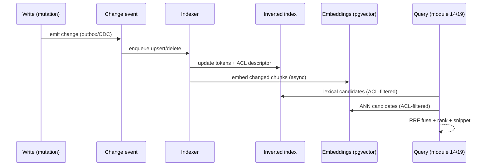

# 39 · Search Indexing & Semantic Search Infrastructure

> Follows the [Master PRD Template](./00-prd-template.md). This is the **infrastructure**
> module behind finding anything in Numil: the indexing pipeline, a hybrid **inverted index +
> vector embeddings (pgvector)**, incremental indexing on writes, permission-filtered
> retrieval, ranking, and typo tolerance — kept in sync with the offline engine. It **powers**
> the user-facing [Search, Filters & Saved Views](./14-search-filters-views.md) and the RAG
> retrieval used by [AI Assistant & Copilot](./19-ai-assistant-copilot.md). User-facing search
> UI is specified in module 14; this doc specifies the engine and its admin/observability
> surfaces.

---

## 1. Purpose

Search is the connective retrieval layer for the whole product. Every "find my overdue tasks",
"what did we decide about the launch?", and AI answer ("summarize the auth project") ultimately
issues a query against this engine. It must be **fast (<150ms P95 lexical)**, **fresh
(indexed within seconds of a write)**, **correct (never returns content the user can't see)**,
and **smart (semantic + typo-tolerant)** — while remaining cheap enough to run for every org.

**User problem it solves.** A keyword-only search misses "the doc about billing" when the doc
says "invoicing"; a naive vector search leaks content across permission boundaries or returns
stale results after edits. Numil needs a **hybrid** engine: lexical precision (exact terms,
labels, ids) fused with **semantic recall** (meaning), always **permission-filtered** and
**incrementally fresh**, and gracefully degrading to the on-device cache when offline.

**Goals**
- Sub-150ms lexical search; sub-400ms hybrid/semantic search at P95.
- Index a create/edit within a few seconds (near-real-time), losslessly.
- **Zero permission leakage** — retrieval respects RBAC/ABAC at query time.
- Typo tolerance, synonyms, prefix/as-you-type, and multilingual support.
- One engine serving both app search (module 14) and AI RAG (module 19).
- Consistent results across online and offline (cache subset) with clear staleness.

**Business goals**
- Retention: fast find = daily habit; AI answers depend entirely on retrieval quality.
- Enterprise trust: provable permission-safe search + auditability.
- Cost control: shared embeddings + incremental indexing keep unit economics viable.

**KPIs:** search P50/P95 latency, index freshness lag (write→searchable), zero-result rate,
click-through rank (MRR/nDCG), RAG citation accuracy, embedding coverage %, permission-leak
incidents (must be 0), indexing error rate.

---

## 2. Navigation

This module has **no primary end-user screen** — users experience it through module 14's
search UI and module 19's AI answers. It exposes an **admin observability surface** and
developer diagnostics.

**Entry points**
- **Admin ▸ Workspace ▸ Search Health** (index status, freshness, reindex controls).
- **Developer ▸ Search diagnostics** (query explain, ranking debug) — see
  [Developer API](./38-developer-api-webhooks.md).
- Internal deep link `numil://admin/search-health`.
- Programmatic: the search API endpoints consumed by modules 14 and 19.

**Route (admin app):** `src/app/admin/search-health/index.tsx` (push). The **user** search
route (`src/app/search/index.tsx`) belongs to module 14 and calls this engine.

**Hierarchy & breadcrumbs**
```text
Admin ▸ Workspace ▸ Search Health ▸ (Index status | Freshness | Reindex | Query explain)
```

**Modal vs push.** Admin surfaces are **push**; a destructive **full reindex** confirmation is
a modal. Query-explain opens as a nested sheet from a diagnostic query bar.

---

## 3. Complete UI Layout

The user search UI lives in [module 14](./14-search-filters-views.md). Below is the **admin
Search Health** console this module owns.

```text
┌───────────────────────────────────────────────┐
│  ‹ Workspace     Search Health                  │  ← large title, glass nav
├───────────────────────────────────────────────┤
│  Index status                                   │
│  ┌───────────────────────────────────────────┐ │
│  │ Tasks       ● healthy   1.2M docs  lag 0.8s │ │  ← per-entity health
│  │ Comments    ● healthy   4.8M docs  lag 1.1s │ │
│  │ Docs        ● healthy   210K docs  lag 0.6s │ │
│  │ Embeddings  ◐ building  92% covered         │ │  ← vector coverage
│  └───────────────────────────────────────────┘ │
├───────────────────────────────────────────────┤
│  Freshness (write → searchable)                 │
│   ▁▂▂▁▃▂▁  P50 0.9s   P95 2.4s   backlog 0      │  ← sparkline + percentiles
├───────────────────────────────────────────────┤
│  Query explain                                  │
│   [ billing invoice overdue         ]  [Run]    │
│   ▸ lexical 41 hits · vector 60 · fused 50      │
│   ▸ top: "Q3 invoicing" (0.82)  why? ▾          │  ← ranking rationale
├───────────────────────────────────────────────┤
│  Maintenance                                    │
│   [ Rebuild embeddings ]   [ Full reindex ]     │  ← destructive (confirm)
└───────────────────────────────────────────────┘
```

- **Top:** large title "Search Health", glass nav respecting Dynamic Island + safe areas.
- **Index status:** per-entity cards (tasks/comments/docs/projects/files/embeddings) with a
  health dot, doc count, and **freshness lag**; embeddings show coverage %.
- **Freshness panel:** a sparkline + P50/P95 write-to-searchable latency and current backlog.
- **Query explain:** a diagnostic query box that shows the **hybrid pipeline** (lexical hits,
  vector hits, fused/ranked) and a per-result "why ranked here" breakdown.
- **Maintenance:** reindex / rebuild-embeddings controls (guarded, rate-limited, backgrounded).
- **Landscape / iPad:** two-pane — entity list left, detail/explain right.
- **Tab bar:** persists (Admin context); full-reindex confirm is a blocking modal.

---

## 4. Complete Component Breakdown

| Area | Components |
|------|-----------|
| Nav | `GlassNavBar`, back button, `•••` (export health, docs link) |
| Index status | `EntityIndexCard` (health dot, doc count, lag), `CoverageBar` (embeddings %), `IndexStatusDot` |
| Freshness | `FreshnessSparkline`, `PercentileStat` (P50/P95), `BacklogBadge` |
| Query explain | `DiagnosticQueryBar`, `PipelineBreakdownRow` (lexical/vector/fused counts), `RankExplainSheet` (score components), `SynonymHitChip` |
| Maintenance | `ReindexButton`, `RebuildEmbeddingsButton`, `ReindexProgress` (Live Activity), `ConfirmDialog` (destructive) |
| Shared search UI (module 14) | `SearchField`, `ResultRow`, `HighlightedSnippet`, `SourceCitationChip` (AI) — defined there, listed for reference |
| Feedback | `Skeleton`, `Toast`, `Banner` (degraded/rebuilding), `EmptyState` |

Primitives per [03-design-system-ui.md](./03-design-system-ui.md); the user-facing search
components are owned by [module 14](./14-search-filters-views.md).

---

## 5. Modern Features

Each feature: **Purpose · Workflow · UI · Permissions · Offline · API · DB · Notify · AC.**

### 5.1 Incremental indexing pipeline ✅ (like Elasticsearch/Meilisearch pipelines)
- **Purpose:** keep the index fresh within seconds of any write, without full rebuilds.
- **Workflow:** every entity mutation emits a **change event** (from the same outbox/CDC that
  drives realtime + [offline sync](./shared/offline-sync-engine.md)) → an **indexer worker**
  normalizes the doc (extract text fields, labels, ids, ACL tuple), updates the **inverted
  index** (tokens) and enqueues an **embedding job** for semantic content → the doc becomes
  searchable. Deletes tombstone the doc immediately.
- **UI:** freshness sparkline + per-entity lag on Search Health.
- **Permissions:** the pipeline stamps each doc with an **ACL descriptor** (org, project,
  visibility, owner) so retrieval can filter; admins view health only.
- **Offline:** N/A for the server pipeline; the on-device index (5.7) mirrors a subset.
- **API:** internal `POST /index/upsert`, `/index/delete` (event-driven, not public);
  `GET /admin/search/health`.
- **DB:** `search_documents`, `search_tokens` (or GIN `tsvector`), `search_embeddings`
  (pgvector), `index_queue`.
- **Notify:** admin alert if freshness lag or backlog exceeds a threshold.
- **AC:** a created/edited entity is searchable within a few seconds (P95 target); deletes
  disappear immediately; no lost updates under load; reprocessing is idempotent.

**Indexing & retrieval pipeline (sequence)**


### 5.2 Inverted index & lexical search ✅ (Postgres FTS / tsvector, upgradable to OpenSearch)
- **Purpose:** exact, fast keyword search with highlighting, prefixes, and field boosts.
- **Workflow:** text fields → tokenized `tsvector` (or an external lexical engine) with
  weights (title > labels > body > comments); queries parse to `tsquery` supporting AND/OR/
  phrase and Numil **operators** (`is:overdue`, `assignee:me`, `#label`, `priority:high`).
  Prefix matching powers as-you-type.
- **UI:** module 14 search field; admin explain shows lexical hit count.
- **Permissions:** enforced via the ACL filter joined into the query (5.5).
- **Offline:** subset served by the on-device index (5.7).
- **API:** `POST /search` (mode=`lexical|semantic|hybrid`), operators parsed server-side.
- **DB:** GIN index on `tsvector`; `search_tokens`; operator fields indexed on
  `search_documents`.
- **Notify:** none.
- **AC:** exact terms, phrases, prefixes, and operators return correct results with match
  highlighting; field boosts rank title matches above body; P95 < 150ms lexical.

### 5.3 Vector embeddings & semantic search ✅ (pgvector; like Notion/Glean semantic search)
- **Purpose:** find by **meaning**, not just words ("billing" ↔ "invoicing"), and power RAG.
- **Workflow:** on index, semantic content is chunked (title+body+key comments) and embedded
  via the configured model into fixed-dim vectors stored in **pgvector**; queries embed the
  text and run **approximate nearest-neighbor (ANN)** search (HNSW / IVFFlat) to retrieve
  candidates by cosine similarity, then filter by ACL and fuse with lexical (5.4).
- **UI:** admin explain shows vector hits + similarity scores; module 19 shows citations.
- **Permissions:** ACL filter applied **after/with** ANN (never return inaccessible vectors);
  candidate set over-fetched then permission-filtered to preserve recall.
- **Offline:** semantic requires the server; offline falls back to on-device lexical.
- **API:** `POST /search` (mode=`semantic|hybrid`), `POST /ai/search` (cited, module 19).
- **DB:** `search_embeddings(entity, vector, chunk, acl)` with an HNSW/IVFFlat ANN index.
- **Notify:** none.
- **AC:** semantically related content ranks well without shared keywords; ANN recall meets
  target; inaccessible content never surfaces; embeddings deleted on source delete (GDPR).

### 5.4 Hybrid ranking & fusion ✅ (Reciprocal Rank Fusion + signals)
- **Purpose:** combine lexical precision and semantic recall into one ranked list.
- **Workflow:** run lexical + vector in parallel → **Reciprocal Rank Fusion (RRF)** merges the
  two ranked lists → apply **boost signals**: recency, assignee=me, project membership,
  status (open > done), popularity/opens, exact-title match, and (for AI) chunk relevance.
  Final list is sorted, deduped by entity, and snippet-highlighted.
- **UI:** `RankExplainSheet` shows each score component ("lexical 0.4 + vector 0.5 + recency
  0.1").
- **Permissions:** ranking runs only over ACL-filtered candidates.
- **Offline:** lexical-only ranking on device.
- **API:** ranking config in `POST /search`; explain via `?explain=true`.
- **DB:** signal columns on `search_documents` (updated_at, opens, status).
- **Notify:** none.
- **AC:** hybrid outperforms either alone on nDCG; explain reproduces the score; ties broken
  deterministically; results stable across identical queries.

### 5.5 Permission-filtered retrieval ✅ (security-first; like Glean's permission-aware search)
- **Purpose:** guarantee a user only ever sees results they're authorized to access.
- **Workflow:** each indexed doc carries an **ACL descriptor** (org_id, project_id,
  visibility, owner_id, guest-share ids). At query time the engine derives the **caller's
  access set** (org role + project memberships + guest shares + personal ownership) and
  injects it as a mandatory filter into **both** lexical and vector queries — so restricted
  rows never enter the candidate pool, not merely hidden post-hoc. Personal tasks
  (`project_id = null`) match only the owner (even Admins excluded), per
  [rbac](./shared/rbac-permissions.md).
- **UI:** invisible to users; admins can run "explain as user" diagnostics.
- **Permissions:** the filter itself is the permission; changes to membership re-scope
  immediately (access set derived live, not cached stale).
- **Offline:** the on-device index only contains docs the user can access, so offline is
  inherently scoped.
- **API:** enforced inside `POST /search` and `POST /ai/search`; no bypass path.
- **DB:** `acl` descriptor on `search_documents`/`search_embeddings`; membership tables joined
  or an access-set precomputed per user.
- **Notify:** any detected leak is a P0 alert.
- **AC:** no query returns content outside the caller's scope; personal tasks never appear to
  others/Admins; guests see only shared resources; membership loss removes access on the next
  query; verified by automated permission tests.

### 5.6 Typo tolerance, synonyms & multilingual ✅ (like Algolia/Meilisearch)
- **Purpose:** forgiving search that matches intent despite spelling, jargon, or language.
- **Workflow:** fuzzy matching (edit distance 1–2 scaled by term length) + trigram similarity
  for lexical; a per-org **synonym map** (e.g., "PR"→"pull request", "OOO"→"out of office");
  language detection + language-specific analyzers/stemmers; semantic layer inherently handles
  paraphrase and cross-lingual matches via multilingual embeddings.
- **UI:** "Did you mean…" and synonym-hit chips in module 14; admin explain shows fuzzy hits.
- **Permissions:** synonym maps managed by Admin.
- **Offline:** basic trigram/prefix on device; full fuzzy server-side.
- **API:** `POST /search` (typo tolerance on by default; `fuzzy=off` to disable);
  `PUT /admin/search/synonyms`.
- **DB:** `pg_trgm` index; `search_synonyms(org_id, term, synonyms[])`.
- **Notify:** none.
- **AC:** single-character typos still match; synonyms expand queries; stemming works per
  language; multilingual queries retrieve relevant cross-language content semantically.

### 5.7 On-device index & offline consistency ✅
- **Purpose:** search works offline over locally cached data, consistent with server results.
- **Workflow:** the local mirror ([offline engine](./shared/offline-sync-engine.md)) maintains
  a lightweight **on-device inverted index** (e.g., SQLite FTS5) over cached tasks/projects/
  comments the user can access; queries run locally when offline or as an instant first pass,
  then reconcile with server results when online. Semantic search requires the server and is
  clearly unavailable offline.
- **UI:** module 14 shows "offline — results may be incomplete".
- **Permissions:** the local cache is already permission-scoped (only accessible docs sync).
- **Offline:** this *is* the offline story.
- **API:** none (local); on reconnect, delta sync refreshes the local index.
- **DB (local):** SQLite FTS5 virtual table mirroring key text fields.
- **Notify:** none.
- **AC:** offline lexical search returns cached results with a staleness note; results
  reconcile without flicker when back online; semantic gracefully marked unavailable offline.

### 5.8 RAG retrieval for AI ✅ (powers module 19)
- **Purpose:** feed the AI copilot high-quality, permission-safe, cited context.
- **Workflow:** an AI question triggers `POST /ai/search` → hybrid retrieval returns top-k
  **chunks** with source ids + scores → the AI layer (module 19) composes an answer and
  attaches `SourceCitationChip`s; citations are **re-validated at answer time** (access still
  valid, chunk not stale) before display.
- **UI:** citations rendered by module 19; explain available to admins.
- **Permissions:** identical ACL filter as 5.5; content is treated as **data, not
  instructions** (prompt-injection defense).
- **Offline:** unavailable (server LLM + retrieval).
- **API:** `POST /ai/search` (returns chunks+citations), consumed by `/ai/chat`.
- **DB:** `search_embeddings` chunk-level; citation metadata (entity id, chunk range).
- **Notify:** none.
- **AC:** RAG returns only accessible chunks; citations resolve to real, current sources;
  stale/again-restricted chunks are dropped at answer time; injection content never executed.

---

## 6. Smart AI Features

This module is the retrieval substrate for AI ([module 19](./19-ai-assistant-copilot.md)); it
also uses ML internally:

| Capability | Role in search |
|-----------|----------------|
| **Query understanding** | Classifies intent (lexical vs question), extracts operators/entities from NL ("overdue in Marketing"). |
| **Embeddings** | Generates document + query vectors for semantic recall (pluggable model). |
| **Semantic re-ranking** (🔜) | A cross-encoder re-ranks the fused top-k for higher precision. |
| **Learning-to-rank** (🟣) | Personalizes ranking from click/open signals (privacy-safe, per-org). |
| **Auto-synonyms** (🔜) | Mines org content to suggest synonym mappings for admin approval. |
| **Answer grounding** | Supplies cited chunks so AI answers are traceable, not hallucinated. |

All ML respects org AI governance (no-train/region), stores no raw content in analytics, and
keeps retrieval permission-scoped. Embedding model choice is configurable per org (enterprise).

---

## 7. Productivity Features

- **Instant as-you-type** results (prefix + local index) so search feels immediate.
- **Search operators** (`is:overdue`, `assignee:me`, `due:today`, `#label`, `priority:high`)
  parsed by the engine, surfaced in [module 14](./14-search-filters-views.md).
- **Saved views & recent searches** are powered by fast repeat retrieval + cached cursors.
- **Cross-entity results** (tasks, projects, comments, docs, files, members) in one ranked list.
- **Jump-to** / command-palette style navigation uses the same lexical index for speed.

---

## 8. Enterprise Features

- **Search Health console:** index status, freshness lag, embedding coverage, backlog, and
  guarded reindex controls (see wireframe).
- **Permission-audit mode:** "search as user" diagnostics to prove no-leak behavior; every
  such diagnostic is itself audited.
- **Configurable embedding model + region** and **no-train** mode for regulated orgs.
- **Retention & right-to-erasure:** deleting a source cascades to its tokens + embeddings;
  legal hold can retain per policy ([security baseline](./shared/security-baseline.md)).
- **Tenant isolation:** all indexes are org-scoped; a query can never cross org boundaries.
- **Reindex/rebuild jobs** are backgrounded, rate-limited, and observable (Live Activity).

**Permission matrix**

| Action | Owner | Admin | Manager | Member | Guest |
|--------|:-----:|:-----:|:-------:|:------:|:-----:|
| Run a scoped search | ✅ | ✅ | ✅ | ✅* | shared* |
| Use AI RAG search | ✅ | ✅ | ✅ | ✅* | ⚙️ policy |
| View Search Health console | ✅ | ✅ | ❌ | ❌ | ❌ |
| Run "search as user" diagnostic | ✅ | ✅ | ❌ | ❌ | ❌ |
| Edit synonym map | ✅ | ✅ | ❌ | ❌ | ❌ |
| Trigger reindex / rebuild embeddings | ✅ | ✅ | ❌ | ❌ | ❌ |
| Choose embedding model / region | ✅ | ✅ | ❌ | ❌ | ❌ |

`*` limited to the actor's permission scope; `⚙️` gated by org AI policy. Model per
[shared/rbac-permissions.md](./shared/rbac-permissions.md).

---

## 9. Collaboration Features

- **Shared discoverability:** org-readable projects surface in teammates' searches (read-only)
  without exposing private content.
- **Comment/decision search:** find where a decision was made (comment body deep-links to the
  task), enabling shared institutional memory.
- **RAG for team Q&A:** module 19's project chat answers "what's blocking launch?" from shared,
  accessible content with citations everyone can open.
- **Synonym governance:** admins curate org vocabulary so the whole team's searches improve.
- **Consistent results:** everyone with the same access sees the same ranked results for a
  query (deterministic ranking), aiding shared references.

---

## 10. Offline Architecture

Deltas over [shared/offline-sync-engine.md](./shared/offline-sync-engine.md):
- The **on-device inverted index** (SQLite FTS5) mirrors cached, permission-scoped text; it is
  rebuilt incrementally as the local mirror syncs (no separate offline outbox for search — the
  index is derived from synced data).
- **Semantic/RAG search is server-only**; offline clearly degrades to lexical with a staleness
  banner.
- On reconnect, delta sync refreshes local docs and the FTS index reconciles; server results
  supersede local ones without visible flicker (server is authoritative).
- Because only accessible docs sync to the device, the offline index is **inherently
  permission-scoped** — no separate ACL check needed locally.

---

## 11. Security

Deltas over [shared/security-baseline.md](./shared/security-baseline.md):
- **Permission-filtered retrieval is the core security property:** the ACL filter is injected
  into every lexical + vector query server-side; there is **no code path** that returns
  unfiltered candidates. Personal tasks are owner-only (Admins excluded).
- **No content in logs/analytics:** queries and results are not logged with raw content;
  diagnostics store ids + scores, not bodies (except opt-in debug with redaction).
- **Prompt-injection defense for RAG:** retrieved content is treated as untrusted **data**,
  never instructions.
- **Erasure & retention:** embeddings/tokens cascade-delete with their source; legal hold
  overrides; tenant isolation enforced on every index.
- **Reindex safety:** rebuild jobs run with least privilege; "search as user" diagnostics are
  audited to prevent misuse as a data-exfiltration tool.
- **Input hardening:** query parsing is injection-safe (parameterized `tsquery`/vector ops; no
  string-built SQL).

---

## 12. Notification System

Deltas over [12-notifications-alerts.md](./12-notifications-alerts.md):
- **Operational alerts only** (to Admins): index freshness lag over threshold, indexing
  backlog growing, embedding rebuild started/completed, ANN index degraded, or a
  **permission-leak canary** firing (P0).
- Long reindex/rebuild jobs show a **Live Activity** with progress + a completion notification.
- This module does **not** emit end-user task notifications; it only surfaces the search results
  those notifications may link to.

---

## 13. Accessibility

Deltas over [shared/accessibility-spec.md](./shared/accessibility-spec.md):
- Search Health cards announce entity + status + lag ("Tasks, healthy, 1.2 million documents,
  lag 0.8 seconds"); status conveyed by **text**, not color alone.
- The freshness sparkline has a text summary (P50/P95/backlog) for VoiceOver.
- Query-explain results are navigable as a list with per-result score rationale read aloud.
- The user-facing result list a11y (announced result counts, highlighted snippets) is specified
  in [module 14](./14-search-filters-views.md).

---

## 14. Animations

Deltas over [shared/animation-spec.md](./shared/animation-spec.md):
- Freshness sparkline updates with a smooth draw (static under Reduce Motion).
- Index status dot: gentle pulse while "building" (static amber under Reduce Motion).
- Reindex progress animates a determinate bar / Live Activity ring.
- User-facing result transitions (skeleton→results, snippet highlight) are defined in module 14.
- Reduce Motion replaces all motion with instant state.

---

## 15. Performance

- **Lexical:** GIN-indexed `tsvector` (or external engine) targets P95 < 150ms; prefix/
  as-you-type debounced and served partly by the on-device index for instant feedback.
- **Semantic:** ANN (HNSW default; IVFFlat for very large sets) over pgvector; over-fetch
  candidates (e.g., 3–5× k) before ACL filter to preserve recall; P95 < 400ms hybrid.
- **Incremental indexing:** event-driven upserts (batched, idempotent) keep write→searchable
  lag low; embedding jobs run async off the write path so writes stay fast.
- **Caching:** hot queries + per-user access sets cached briefly; embeddings cached; results
  paginated (cursor) so payloads stay small.
- **Scaling:** indexes are org-sharded; ANN index build/maintenance runs in the background;
  reindex jobs throttle to protect OLTP; a circuit breaker sheds semantic load under pressure
  (falls back to lexical) rather than failing search entirely.
- **Cost:** embeddings deduped by content hash; only changed chunks re-embedded on edit.

---

## 16. Database Design

```text
search_documents(id, org_id, entity_type, entity_id, title, body_text, labels[], status,
      priority?, project_id?, owner_id?, visibility, acl_json, tsv tsvector, updated_at,
      opens, deleted_at?)                                    -- one row per searchable entity
      UNIQUE(org_id, entity_type, entity_id)
search_embeddings(id, org_id, entity_type, entity_id, chunk_no, content_hash, vector vector(1024),
      acl_json, updated_at)                                  -- pgvector; multiple chunks/entity
      UNIQUE(org_id, entity_type, entity_id, chunk_no)
search_synonyms(org_id, term, synonyms[], created_by, updated_at)
index_queue(id, org_id, entity_type, entity_id, op, enqueued_at, attempts, status)  -- upsert/delete jobs
search_query_log(id, org_id, user_id, query_hash, mode, result_count, latency_ms, created_at) -- no raw text
access_sets(user_id, org_id, project_ids[], guest_share_ids[], computed_at)  -- cached ACL for fast filter
```

**Indexes:**
- `GIN(tsv)` on `search_documents` (lexical); `GIN(labels)`; `pg_trgm` on `title` (typo).
- `search_documents(org_id, entity_type, updated_at)`; partial `WHERE deleted_at IS NULL`.
- **ANN** index on `search_embeddings.vector` (`hnsw` cosine; `ivfflat` for huge sets).
- `index_queue(status, enqueued_at)` (worker scan); `search_query_log(org_id, created_at)`.

**Constraints & rules:** `acl_json` required on every indexed row (no unscoped docs);
personal entities have `project_id = null` + `owner_id` set (owner-only retrieval).
**Soft delete:** `deleted_at` tombstone on `search_documents`; deletes cascade to
`search_embeddings` (GDPR). **History:** `search_query_log` is append-only (ids + metadata
only, no raw query text/content). Align with [17-data-model-api.md](./17-data-model-api.md).

---

## 17. API Design

Follows [shared/api-conventions.md](./shared/api-conventions.md). Public search is exposed via
[module 38](./38-developer-api-webhooks.md); internal index endpoints are event-driven only.

| Method | Path | Purpose |
|--------|------|---------|
| POST | `/search` | Unified search (`mode=lexical\|semantic\|hybrid`), filters, operators |
| POST | `/ai/search` | RAG retrieval → cited chunks (consumed by module 19) |
| GET | `/search/suggest?q=` | As-you-type prefix suggestions (local + server) |
| PUT | `/admin/search/synonyms` | Manage org synonym map |
| GET | `/admin/search/health` | Index status, freshness, coverage, backlog |
| POST | `/admin/search/reindex` | Trigger reindex (scope=all/entity), backgrounded |
| POST | `/admin/search/rebuild-embeddings` | Recompute embeddings (backgrounded) |
| POST | `/index/upsert` · `/index/delete` | **Internal** event-driven index ops (not public) |

**Realtime:** admin channel `org:{id}` emits `search.index.progress`, `search.health.changed`
during reindex/rebuild. **Errors:** `403 forbidden` (not admin / out of scope),
`422 validation_failed` (bad query/operator), `429 rate_limited` (reindex throttle),
`503 degraded` (semantic temporarily unavailable → client retries lexical). **Idempotency-Key**
on reindex/rebuild/synonym mutations; `?explain=true` adds ranking diagnostics (admin only).

**Sample request — hybrid search**
```http
POST /v1/search
Authorization: Bearer <token>
X-Org-Id: org_123
{ "q": "overdue billing", "mode": "hybrid", "limit": 20,
  "filter": { "entity": ["task","doc"], "project": "prj_9" }, "explain": true }
```
```json
{
  "data": [
    { "entityType": "doc", "entityId": "doc_41", "title": "Q3 invoicing plan",
      "snippet": "…<em>billing</em> cycle and <em>overdue</em> follow-ups…",
      "score": 0.82,
      "explain": { "lexical": 0.34, "vector": 0.41, "recency": 0.07 } },
    { "entityType": "task", "entityId": "task_abc", "title": "Chase overdue invoices",
      "snippet": "…mark <em>overdue</em> after 30d…", "score": 0.76 }
  ],
  "meta": { "requestId": "req_7c1", "nextCursor": "opaque", "total": 50,
            "pipeline": { "lexicalHits": 41, "vectorHits": 60, "fused": 50 } }
}
```

---

## 18. Edge Cases

- **Write burst / backlog:** indexer batches + backpressures; freshness lag surfaces on the
  console; search still serves last-consistent state (never blocks).
- **Embedding model change / dim mismatch:** a versioned `rebuild-embeddings` migrates vectors;
  old + new coexist during migration; queries use the active version.
- **Permission change mid-session:** access set recomputed on next query so newly-restricted
  content vanishes immediately; newly-granted content appears once indexed.
- **Deleted source with lingering vector:** delete cascades tombstone tokens + embeddings;
  RAG re-validates at answer time so a stale chunk is dropped even before cascade completes.
- **ANN index degraded/building:** fall back to lexical + brute-force vector on a small set;
  banner shows "semantic temporarily limited".
- **Very long document:** chunked with overlap; each chunk embedded; ranking dedupes to one
  result per entity.
- **Non-Latin / mixed language query:** language-appropriate analyzer + multilingual embeddings;
  no crash on scripts without whitespace tokenization.
- **Typo vs operator collision** (`is:ovrdue`): operator parser tolerant; unknown operator
  treated as literal term with a hint.
- **Offline:** lexical-only over local index; semantic clearly unavailable; reconcile on
  reconnect.
- **Injection attempt in content** (RAG): treated as data, never instructions.
- **Zero results:** graceful empty state with suggestions/clear-filters (module 14).
- **Tenant boundary:** a query never crosses org; cross-org attempt returns empty, is audited.

---

## 19. User States

- **First-time:** search "just works" from day one over their (small) index; no setup.
- **Returning/power:** operators, saved views, as-you-type, semantic questions.
- **Guest:** search resolves only shared resources; AI/RAG may be disabled by policy.
- **Member/Manager:** scoped results across accessible projects.
- **Admin/Owner:** Search Health console, synonyms, reindex, "search as user" diagnostics.
- **Offline / poor network:** local lexical results + staleness banner; semantic unavailable.
- **Large org:** sharded indexes; freshness + ANN scale; reindex backgrounded.
- **Tablet/landscape:** two-pane admin console.
- **Dark mode / large text / a11y:** tokens + Dynamic Type; status by text; VoiceOver flows.

---

## 20. Analytics Events

Schema per [shared/analytics-taxonomy.md](./shared/analytics-taxonomy.md). `search_used` is
defined there; this module adds engine-level (privacy-safe, no raw query text) events:

| event | key properties |
|-------|----------------|
| `search_used` | `result_count`, `used_operators`, `mode` (lexical/semantic/hybrid) |
| `search_latency` | `mode`, `p_ms`, `lexical_hits`, `vector_hits` (sampled) |
| `search_zero_results` | `mode`, `had_operators` |
| `search_result_opened` | `entity_type`, `rank` |
| `search_offline_fallback` | `result_count` |
| `rag_retrieval` | `k`, `citations`, `latency_ms` |
| `index_freshness` | `entity_type`, `lag_ms` (rolled-up) |
| `index_backlog_alert` | `entity_type`, `backlog` |
| `reindex_started` / `reindex_completed` | `scope`, `duration_ms` |
| `embeddings_rebuilt` | `coverage_pct`, `duration_ms` |
| `search_permission_denied_canary` | `source` (P0 leak canary) |

No query text, task titles, or content in properties (per taxonomy privacy rules).

---

## 21. Acceptance Criteria

1. A created or edited entity becomes searchable within a few seconds (P95 freshness target).
2. Deleted entities disappear from results immediately (tombstoned).
3. Incremental indexing is idempotent; reprocessing never duplicates or loses docs.
4. Lexical search returns exact terms, phrases, and prefixes with match highlighting.
5. Field boosts rank title matches above body/comment matches.
6. Search operators (`is:overdue`, `assignee:me`, `#label`, `priority:high`) parse correctly.
7. Lexical search P95 latency is under 150ms at target scale.
8. Semantic search finds meaning-related content without shared keywords.
9. Hybrid (RRF) fusion outperforms lexical-only and vector-only on nDCG.
10. Ranking `explain` reproduces the final score from its components deterministically.
11. Every query is permission-filtered at retrieval; restricted rows never enter candidates.
12. Personal tasks are owner-only in results (Admins and others excluded).
13. Guests only ever retrieve explicitly shared resources.
14. Losing project membership removes access to those results on the next query.
15. Semantic search P95 (hybrid) is under 400ms at target scale.
16. Typo tolerance matches single-character errors; trigram similarity works.
17. Org synonym maps expand queries; admins can edit them.
18. Language-specific analyzers/stemmers apply; multilingual queries retrieve cross-language content.
19. As-you-type suggestions return quickly (local + server) and are debounced.
20. Offline lexical search returns cached, permission-scoped results with a staleness note.
21. Semantic/RAG is clearly marked unavailable offline (no dead spinner).
22. Online reconciliation supersedes local results without visible flicker.
23. RAG retrieval returns only accessible chunks with resolvable source citations.
24. Citations are re-validated at answer time; stale/again-restricted chunks are dropped.
25. Retrieved content is treated as data, never instructions (prompt-injection safe).
26. Deleting a source cascades deletion of its tokens and embeddings (GDPR).
27. Legal hold retains index data per policy despite deletion requests.
28. Indexes are strictly org-scoped; no query crosses tenant boundaries.
29. Search Health shows per-entity status, doc counts, freshness lag, and embedding coverage.
30. Freshness panel reports accurate P50/P95 write→searchable latency and backlog.
31. Admins can trigger a scoped reindex and embedding rebuild; jobs run in the background.
32. Reindex/rebuild show a Live Activity with progress and a completion notification.
33. Embedding model/dimension changes migrate via versioned rebuild without downtime.
34. Under semantic-tier pressure, the engine sheds to lexical rather than failing search.
35. `503 degraded` prompts the client to retry with lexical.
36. Query parsing is injection-safe (parameterized; no string-built SQL).
37. Query logs store ids + metadata only — no raw query text or content.
38. "Search as user" diagnostics are admin-only and audited.
39. Analytics events fire with correct, PII-free properties (including offline-buffered).
40. A permission-leak canary would fire a P0 alert (verified in tests).
41. Zero-result queries show a graceful empty state with suggestions (module 14).
42. VoiceOver reads index health and result rationale; status conveyed by text, not color.
43. Reduce Motion disables sparkline/pulse animations; state remains visible.
44. iPad landscape shows a two-pane admin console.

---

## 22. Future Roadmap

- **V1 (✅):** incremental indexing pipeline, Postgres FTS inverted index, pgvector semantic
  search, hybrid RRF ranking, permission-filtered retrieval, typo tolerance + synonyms +
  multilingual, on-device offline lexical index, RAG retrieval for AI, Search Health console.
- **V1.1 (🔜):** cross-encoder semantic re-ranking, auto-synonym mining (admin-approved),
  richer query understanding (NL → operators), per-user recency personalization, file-content
  (OCR/PDF) indexing.
- **V2 (🟣):** learning-to-rank from click signals (privacy-safe), external engine option
  (OpenSearch/Elastic) for very large orgs, configurable/BYO embedding model + region,
  federated search across [Integrations](./32-integrations.md) (connected tools).
- **Future (💡):** unified "universal search" across Numil + connected apps, conversational
  search memory, graph-aware ranking (dependencies/relationships), image/design semantic search.
- **Experimental (🧪):** on-device semantic search via small local embedding models (Apple
  Intelligence), fully agentic multi-hop retrieval for complex questions.
- **AI track:** answer grounding quality metrics, retrieval-augmented planning, automatic
  chunking strategy tuning.
- **Enterprise track:** eDiscovery-grade search export, per-index data-residency pinning,
  index-level access reviews and leak-canary attestation reports.
