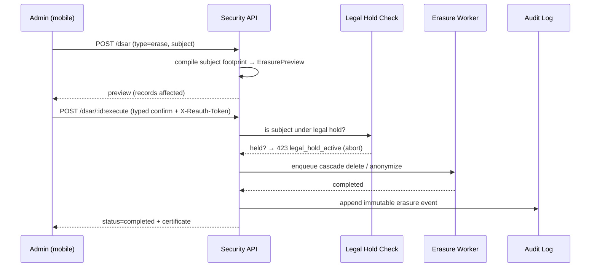

# 40 · Security & Compliance Center

> Follows the [Master PRD Template](./00-prd-template.md). This is the **admin-facing security
> posture** surface: a mobile console where Owners/Admins see and control the workspace's
> security state — SSO/2FA/passkey enforcement, device trust, session management, the audit
> log viewer, data export & erasure (GDPR/CCPA), retention, legal hold, DLP, and SOC 2 /
> ISO 27001 status. It **builds on** [shared/security-baseline.md](./shared/security-baseline.md)
> (the engineering baseline every module inherits) and turns it into **admin controls +
> evidence**. It complements [30 · Workspace Administration](./30-workspace-administration.md)
> (org structure) and reads the [29 · Activity Feed & Audit Logs](./29-activity-feed-audit-logs.md).

---

## 1. Purpose

The Security & Compliance Center is where a workspace answers three questions: **"Are we
secure?"**, **"Can we prove it?"**, and **"Can we respond to a request/incident fast?"**
The shared security baseline defines *how the app is built securely*; this module exposes the
*knobs and evidence* an admin, security team, or auditor needs — designed as a **clean mobile
console** that is honest about being the mobile view of a fuller web console for the heaviest
flows (SIEM config, bulk eDiscovery export).

**User problem it solves.** Security posture is usually scattered across settings, invisible,
and unprovable. When a customer's security review, a GDPR data-subject request, or an incident
lands, admins scramble. Numil centralizes posture, enforcement, and evidence so the answer is
"open the Security Center" — from a phone.

**User goals**
- See a single **posture score / checklist**: what's enforced, what's risky.
- Enforce identity controls (SSO required, 2FA/passkeys) and trust only known devices.
- View/terminate sessions; investigate the audit log.
- Fulfill **data export & erasure** (GDPR/CCPA) and set **retention** + **legal hold**.
- Access **compliance evidence** (SOC 2 / ISO reports, DPA, subprocessors).
- Prevent leaks with **DLP** rules.

**Business goals**
- Win enterprise procurement/security reviews faster (self-serve trust).
- Reduce breach/leak risk and regulatory exposure.
- Provide auditable controls that satisfy SOC 2 / ISO 27001 / GDPR / CCPA.

**KPIs:** posture score adoption, % orgs enforcing SSO+2FA, mean time to fulfill DSAR, %
sessions covered by device trust, audit-log query usage, DLP incidents caught, security alert
acknowledgement time.

---

## 2. Navigation

**Entry points**
- **More → Admin → Security posture** (Owner/Admin; scoped security-role read where delegated).
- From [module 30](./30-workspace-administration.md) security-policy toggles ("Advanced →
  Security Center").
- Deep links: `numil://security`, `numil://security/identity`, `numil://security/devices`,
  `numil://security/sessions`, `numil://security/audit`, `numil://security/privacy`,
  `numil://security/retention`, `numil://security/compliance`, `numil://security/dlp`.

**Routes** (`src/app/security/...`)
```text
src/app/security/index.tsx       → Posture dashboard (score + checklist + alerts)
src/app/security/identity.tsx    → SSO / 2FA / passkey enforcement
src/app/security/devices.tsx     → Device trust & management
src/app/security/sessions.tsx    → Active sessions (org-wide)
src/app/security/audit.tsx       → Audit log viewer (reads module 29)
src/app/security/privacy.tsx     → Data export & erasure (GDPR/CCPA)
src/app/security/retention.tsx   → Retention & legal hold (shared with module 30)
src/app/security/compliance.tsx  → SOC 2 / ISO / DPA / subprocessors
src/app/security/dlp.tsx         → DLP rules & incidents
```

**Hierarchy & breadcrumbs**
```text
Workspace ▸ Admin ▸ Security ▸ [Identity | Devices | Sessions | Audit | Privacy | Retention | Compliance | DLP]
```
**Transitions:** posture dashboard is a **push** from Admin; sections **push** on iPhone,
**two-pane** on iPad. Enforcement changes and erasure requests open as **nested sheets** with
explicit blast-radius + typed confirmation. **Modal vs push:** high-impact actions (enforce
SSO, terminate all sessions, execute erasure, release legal hold) are **modal** with step-up
re-auth.

---

## 3. Complete UI Layout

Posture-first: a **score + prioritized checklist** answers "are we secure?" in one glance,
with an alert inbox for what needs action now.

```text
┌───────────────────────────────────────────────┐
│  ‹ Admin      Security · Acme Inc          ⋯   │  ← large title
├───────────────────────────────────────────────┤
│           ╭───────────────╮                     │
│           │  Posture  82  │  Good               │  ← score ring (0–100)
│           ╰───────────────╯                     │
│  ▸ 2 alerts · 1 open DSAR        [ Review ]      │  ← security alert inbox
├───────────────────────────────────────────────┤
│  Hardening checklist                            │
│  ✅ SSO enforced (SAML · Okta)                  │
│  ✅ 2FA required for all members                │
│  🔶 Passkeys optional  → [ Require ]            │  ← one-tap fix
│  🔶 Device trust: 12 unmanaged  → [ Review ]    │
│  ✅ Audit log streaming to SIEM                 │
├───────────────────────────────────────────────┤
│  Controls                                       │
│  🪪 Identity & MFA                          ▸   │
│  📱 Device trust                     12 new ▸   │
│  🧭 Sessions                     318 active ▸   │
│  📜 Audit log                              ▸   │  → reads module 29
│  🔏 Privacy: export & erasure       1 DSAR ▸   │
│  🗄 Retention & legal hold        2 holds  ▸   │
│  🛡 DLP rules                     3 rules   ▸   │
│  🏅 Compliance (SOC 2 · ISO · DPA)         ▸   │
└───────────────────────────────────────────────┘
```

- **Top:** large-title "Security · {Org}"; `⋯` overflow (download evidence pack, export audit,
  security contact, run access review).
- **Posture ring:** 0–100 score derived from enforced controls; tap for the weighted breakdown.
- **Alert inbox:** impossible-travel, new-device admin login, DLP hit, open DSAR — the "act now".
- **Hardening checklist:** prioritized, each with a **one-tap fix** (progressive disclosure).
- **Controls list:** disclosure rows with live status summaries.
- **iPad/landscape:** persistent section rail + detail pane (console feel). **Tab bar hidden.**
- **Web-console honesty:** SIEM setup and bulk eDiscovery export show an "Open advanced on web"
  handoff; everything else is fully native.

---

## 4. Complete Component Breakdown

| Area | Components |
|------|-----------|
| Nav | `GlassNavBar`, `SecurityOverflowMenu` (evidence pack, export audit, access review) |
| Posture | `PostureScoreRing`, `ScoreBreakdownSheet`, `SecurityAlertInbox`, `AlertRow` |
| Checklist | `HardeningChecklistRow` (status icon, title, one-tap `FixButton`) |
| Identity | `EnforcementToggleRow` (SSO/2FA/passkey), `FactorMatrix`, `GracePeriodEditor`, `BreakGlassNote` |
| Devices | `DeviceRow` (model, OS, trust state, last seen), `TrustToggle`, `AllowListEditor`, `WipeSessionButton` |
| Sessions | `SessionList` (FlashList), `SessionRow` (user, device, IP, geo, started), `TerminateButton`, `TerminateAllSheet` |
| Audit | `AuditQueryBar` (actor/action/date), `AuditRow` (before→after), `AuditDetailSheet`, `ExportAuditButton` |
| Privacy | `DsarRow` (subject, type, due, status), `ExportBuilder`, `ErasurePreview`, `ExecuteErasureSheet` |
| Retention | `RetentionRuleRow`, `RetentionSimulator`, `LegalHoldRow`, `LegalHoldBanner` |
| DLP | `DlpRuleRow`, `DlpRuleBuilder` (pattern/scope/action), `DlpIncidentList`, `IncidentDetailSheet` |
| Compliance | `ComplianceBadge` (SOC 2 / ISO 27001 / GDPR), `EvidenceDocRow`, `SubprocessorList`, `DpaRow`, `RequestReportSheet` |
| Feedback | `Skeleton`, `Toast`, `ConfirmDialog` (typed + step-up), `Banner` (offline/read-only), `WebConsoleHandoffRow` |

Primitives defined in [03-design-system-ui.md](./03-design-system-ui.md).

---

## 5. Modern Features

Each feature: **Purpose · Workflow · UI · Permissions · Offline · API · DB · Notify · AC.**

**Module role permission matrix** (deltas over [shared/rbac-permissions.md](./shared/rbac-permissions.md);
all mutations require a step-up **elevation token**; a delegated **Security-role**/**Privacy-role**
🟣 can be scoped via v2 custom roles):

| Security action | Owner | Admin | Manager | Member | Guest |
|-----------------|:-----:|:-----:|:-------:|:------:|:-----:|
| View posture / alerts | ✅ | ✅ | ❌ | ❌ | ❌ |
| Enforce SSO / 2FA / passkeys | ✅ | ✅ | ❌ | ❌ | ❌ |
| Trust / revoke devices | ✅ | ✅ | ❌ | ❌ | ❌ |
| Terminate sessions (one / all) | ✅ | ✅ | ❌ | ❌ | ❌ |
| Query / export audit log | ✅ | ✅ | team-scoped read | ❌ | ❌ |
| Open / execute DSAR (export/erase) | ✅ | ✅ (privacy-role) | ❌ | ❌ | ❌ |
| Retention rules / legal hold | ✅ | ✅* | ❌ | ❌ | ❌ |
| DLP rules / incidents 🔜 | ✅ | ✅ | ❌ | ❌ | ❌ |
| Download compliance evidence | ✅ | ✅ | ❌ | ❌ | ❌ |
| Configure SIEM streaming | ✅ | ✅ | ❌ | ❌ | ❌ |

`*` releasing a legal hold requires a reason + step-up regardless of role.

### 5.1 Security posture score & hardening checklist ✅
- **Purpose:** turn scattered settings into one actionable score.
- **Workflow:** score computed from enforced controls (SSO, 2FA, passkeys, device trust,
  session limits, audit streaming, DLP) → checklist ranks gaps → one-tap fix each.
- **UI:** `PostureScoreRing`, `HardeningChecklistRow` + `FixButton`, `ScoreBreakdownSheet`.
- **Permissions:** Owner/Admin/security-role (read for scoped delegates).
- **Offline:** cached read-only snapshot with "as of {time}".
- **API:** `GET /orgs/:id/security/posture`.
- **DB:** derived from `security_policies`, `sso_config`, `dlp_rules`, device/session stats.
- **Notify:** score drop (control disabled) → alert admins.
- **AC:** score reflects real enforced state; each checklist item links to its control;
  fixing an item raises the score deterministically.

### 5.2 Identity & MFA enforcement ✅ (SSO/2FA/passkeys — baseline in [shared/security-baseline.md](./shared/security-baseline.md))
- **Purpose:** enforce strong authentication org-wide.
- **Workflow:** require **SSO** (blocks password login, keeps break-glass), require **2FA**
  (TOTP now, passkeys/WebAuthn v2) with a grace deadline for enrollment; view a **factor
  coverage matrix** (who lacks 2FA).
- **UI:** `EnforcementToggleRow`, `FactorMatrix`, `GracePeriodEditor`, `BreakGlassNote`.
- **Permissions:** Owner/Admin; enforcing requires step-up re-auth.
- **Offline:** unavailable (security-sensitive).
- **API:** `PUT /orgs/:id/security/identity` (SSO config lives with [module 30](./30-workspace-administration.md)).
- **DB:** `security_policies` (require_sso, require_2fa, require_passkey, grace_days), `user_factors`.
- **Notify:** members told "2FA required by {date}"; admins alerted on enforcement change.
- **AC:** enforcing 2FA grace-periods members with a deadline then blocks non-compliant logins;
  passkey enforcement supported (v2); break-glass Owner path preserved; every change audited.

### 5.3 Device trust & management ✅ / 🔜
- **Purpose:** restrict access to known/managed devices.
- **Workflow:** each login registers a `deviceId`; admin sees devices, marks trusted, or
  requires **allow-listed/managed (MDM)** devices for sensitive orgs; can remotely sign a
  device out (revoke its sessions).
- **UI:** `DeviceRow` (trust state), `TrustToggle`, `AllowListEditor`, `WipeSessionButton`.
- **Permissions:** Owner/Admin/security-role.
- **Offline:** read cached; actions online.
- **API:** `GET /orgs/:id/devices`, `POST /devices/:id/trust`, `POST /devices/:id/revoke`.
- **DB:** `devices` (user_id, model, os, trust_state, mdm_managed, last_seen, first_seen).
- **Notify:** new-device login (esp. admin) → security alert (email + push, baseline behavior).
- **AC:** unknown-device policy blocks or step-ups per setting; revoking a device kills its
  sessions immediately; new-device admin login always alerts.

### 5.4 Session management ✅
- **Purpose:** see and control who is logged in, everywhere.
- **Workflow:** list active sessions (user, device, IP, geo, start, last activity) org-wide →
  terminate one or **terminate all for a user** (offboarding) or **all org sessions** (incident);
  set idle + absolute session lifetimes (baseline enforces).
- **UI:** `SessionList`, `SessionRow`, `TerminateButton`, `TerminateAllSheet`.
- **Permissions:** Owner/Admin/security-role; terminate-all requires step-up.
- **Offline:** read cached; actions online.
- **API:** `GET /orgs/:id/sessions`, `POST /sessions/:id/terminate`,
  `POST /orgs/:id/sessions:terminate-all`.
- **DB:** `sessions` (user_id, device_id, ip, geo, created_at, last_active_at, revoked_at?).
- **Notify:** forced logout notifies the user; incident terminate-all alerts admins.
- **AC:** termination revokes tokens within seconds (refresh-family invalidation per baseline);
  geo/impossible-travel surfaced; lifetimes enforced.

### 5.5 Audit log viewer ✅ (reads [module 29](./29-activity-feed-audit-logs.md))
- **Purpose:** investigate who did what, when (security-relevant events).
- **Workflow:** query by actor/action/target/date/IP; open an event to see before→after;
  export a filtered set (CSV/JSON); stream to **SIEM** (enterprise).
- **UI:** `AuditQueryBar`, `AuditRow`, `AuditDetailSheet`, `ExportAuditButton`.
- **Permissions:** Owner/Admin (scoped for Managers per module 13); security-role full read.
- **Offline:** recent cached; deep queries online.
- **API:** `GET /orgs/:id/audit?filter[...]&cursor=`, `POST /orgs/:id/audit:export`,
  `PUT /orgs/:id/audit/siem`.
- **DB:** canonical `audit_log` (append-only, module 29); this module is a **read/query** view.
- **Notify:** export completion; SIEM delivery failure alert.
- **AC:** audit is immutable and append-only; queries are permission-scoped; export is itself
  audited; SIEM streaming verifies delivery + retries.

### 5.6 Data export & erasure — GDPR/CCPA ✅
- **Purpose:** fulfill data-subject access (DSAR) and right-to-erasure requests.
- **Workflow:** open a DSAR (subject email, type: **export** or **erase**) → system compiles
  the subject's data across the org → **export** produces a machine-readable archive; **erase**
  shows a preview of what will be deleted/anonymized, requires typed confirmation + step-up,
  then executes (respecting **legal hold** overrides).
- **UI:** `DsarRow`, `ExportBuilder`, `ErasurePreview`, `ExecuteErasureSheet`.
- **Permissions:** Owner/Admin/privacy-role; erasure requires step-up.
- **Offline:** unavailable.
- **API:** `POST /orgs/:id/dsar` (type=export|erase), `GET /dsar/:id`, `POST /dsar/:id:execute`.
- **DB:** `dsar_requests` (subject, type, status, due_at, executed_at, actor), export artifacts
  in a temp signed bucket.
- **Notify:** DSAR opened/due-soon/completed; erasure completion is audited.
- **AC:** export is machine-readable and complete; erasure cascades/anonymizes per retention
  policy and **respects legal hold**; personal-task privacy preserved; SLA timers tracked;
  every DSAR action audited.

**DSAR erasure sequence** (step-up + legal-hold gate before any deletion):


### 5.7 Retention & legal hold ✅ (shared with [module 30](./30-workspace-administration.md))
- **Purpose:** control data lifespan and freeze data for litigation.
- **Workflow:** per-data-class retention (delete/anonymize after N days) with a **simulator**;
  place a **legal hold** on a user/project/date-range that **overrides all deletion**
  (retention + erasure) until released.
- **UI:** `RetentionRuleRow`, `RetentionSimulator`, `LegalHoldRow`, `LegalHoldBanner`.
- **Permissions:** Owner/Admin/`retention.manage`; releasing a hold requires step-up + reason.
- **Offline:** read cached; edits online.
- **API:** `GET/PUT /orgs/:id/retention`, `POST /orgs/:id/legal-holds`, `POST /legal-holds/:id:release`.
- **DB:** `retention_rules`, `legal_holds` (scope_json, reason, created_by, released_at?).
- **Notify:** hold placed/released → admins; scheduled purge preview.
- **AC:** legal hold blocks purge **and** erasure for held scope; simulator counts match
  actual purge; release is reasoned + audited.

### 5.8 DLP (Data Loss Prevention) 🔜
- **Purpose:** detect/prevent sensitive data leaving the workspace.
- **Workflow:** define rules (patterns: credit-card/SSN/secret/keyword; scope: comments/
  attachments/exports/AI prompts; action: warn/block/redact/alert) → matches create incidents;
  admin reviews incident detail + resolves.
- **UI:** `DlpRuleBuilder`, `DlpRuleRow`, `DlpIncidentList`, `IncidentDetailSheet`.
- **Permissions:** Owner/Admin/security-role.
- **Offline:** rules cached for on-device pre-checks; server enforces.
- **API:** `GET/POST /orgs/:id/dlp/rules`, `GET /orgs/:id/dlp/incidents`.
- **DB:** `dlp_rules` (pattern, scope, action), `dlp_incidents` (rule_id, actor, context_ref, outcome).
- **Notify:** high-severity DLP hit → immediate admin alert.
- **AC:** block-action prevents the leak (comment/export/AI prompt); incidents logged without
  storing the raw sensitive payload (hash/redacted); false-positive tuning supported.

### 5.9 Compliance evidence (SOC 2 / ISO 27001 / GDPR / CCPA) ✅
- **Purpose:** self-serve trust artifacts for procurement/auditors.
- **Workflow:** view compliance badges + status; download **SOC 2 Type II report** (under NDA),
  **ISO 27001 cert**, **DPA**, **subprocessor list**, pen-test summary; request access to gated
  docs; run an **access review** attestation.
- **UI:** `ComplianceBadge`, `EvidenceDocRow`, `SubprocessorList`, `DpaRow`, `RequestReportSheet`.
- **Permissions:** Owner/Admin; some docs gated behind NDA acceptance.
- **Offline:** metadata cached; docs fetched on demand + cached.
- **API:** `GET /orgs/:id/compliance`, `GET /compliance/docs/:id` (signed URL),
  `POST /orgs/:id/access-review`.
- **DB:** `compliance_docs`, `access_reviews`, `subprocessors`.
- **Notify:** new report available; access-review due; subprocessor change (advance notice).
- **AC:** documents are access-controlled, signed, expiring; downloads audited; access review
  records attestations with reviewer + date.

---

## 6. Smart AI Features

Security AI is advisory (via [module 19](./19-ai-assistant-copilot.md)); it never auto-executes
destructive actions (terminate/erase/release-hold) — those are human-confirmed + step-up.

| Capability | What it does | Status |
|-----------|--------------|--------|
| `anomaly_detect` | Impossible travel, credential-stuffing, burst admin changes → alerts. | ✅ |
| `posture_advisor` | Recommends the highest-impact hardening steps vs. peer benchmarks. | 🔜 |
| `audit_nl_query` | "Show all exports by admins last 30 days" → scoped audit results. | 🔜 |
| `dsar_assist` | Compiles/summarizes a subject's data footprint for a DSAR. | 🟣 |
| `dlp_classify` | Classifies attachments/comments for sensitive content to seed DLP rules. | 🟣 |
| `incident_summary` | Drafts an incident timeline from audit + sessions for review. | 💡 |

Guardrails: read-only or proposal-first; respects org AI governance + no-train/residency;
never surfaces personal-task content; logs `ai_invoked` with `capability`/`accepted`. DLP
classification runs on-device where possible to avoid sending sensitive data to the model.

---

## 7. Productivity Features

- **One-tap hardening** from the checklist (no digging through settings).
- **Access reviews:** periodic attestation campaigns ("confirm these 6 Admins still need
  access") with reminders and completion tracking.
- **Evidence pack export:** bundle SOC 2 + ISO + DPA + subprocessors into one shareable
  (bridges [module 37](./37-backup-import-export.md)).
- **Saved audit queries** (e.g., "admin role changes", "exports") — one tap to re-run.
- **Incident quick-actions:** from an alert → terminate sessions, revoke device, open DSAR.
- **Web handoff** for SIEM configuration and bulk eDiscovery export with session continuity.

---

## 8. Enterprise Features

- **SSO/SAML+OIDC enforcement, SCIM deprovisioning** (config in [module 30](./30-workspace-administration.md)).
- **SIEM streaming** of security events (Splunk/Sentinel/Datadog) — see also
  [43 · Observability](./43-observability-error-monitoring.md).
- **Legal hold + eDiscovery** export; **DLP**; **data residency** (region pinning) and
  **customer-managed keys (BYOK/CMEK)** 🟣.
- **Compliance program:** SOC 2 Type II, ISO 27001, GDPR/CCPA, plus HIPAA/BAA 💡 for regulated
  orgs; documented controls, access reviews, change management, vendor management.
- **Immutable audit + tamper-evidence** (hash-chained entries) 🟣.
- **Delegated security roles:** scope a "Security Admin" who manages posture but not billing.
- **Anomaly detection + automated response** hooks (auto-terminate on impossible travel) 🟣.

---

## 9. Collaboration Features

- **Shared alert inbox:** the admin/security team triages the same queue; acknowledgements are
  visible to avoid double-work.
- **DSAR workflow assignment:** assign a request to a privacy owner with due-date tracking.
- **Four-eyes on destructive ops** 🟣: erase/terminate-all/release-hold requires a second
  approver (with [module 30](./30-workspace-administration.md) change proposals).
- **Incident notes/timeline:** collaboratively annotate an alert; export for post-mortem.
- **Auditor guest access** 💡: time-boxed, read-only, scoped-to-evidence external access.

---

## 10. Offline Architecture

Deltas over [shared/offline-sync-engine.md](./shared/offline-sync-engine.md):
- Security **reads** (posture score, checklist, recent alerts, device/session lists, recent
  audit, compliance metadata, retention rules) are cached read-only with "as of {time}".
- **All security mutations** (enforce SSO/2FA, trust/revoke device, terminate sessions, execute
  erasure, place/release hold, edit DLP) are **online-only** — never queue a security or
  destructive op; the UI disables with a clear banner and requires live server validation +
  step-up re-auth.
- DLP rules are cached to enable on-device pre-flight checks (e.g., warn before an offline
  export), but authoritative enforcement is server-side on sync.

---

## 11. Security

This module **is** the security surface; here are deltas/self-referential rules over
[shared/security-baseline.md](./shared/security-baseline.md):
- Every route guarded by `can(actor, 'org.security.*', org)`; delegated security-role scoped.
- **Step-up re-authentication** (biometric/`expo-local-authentication`) required for all
  destructive/enforcement actions; a fresh, short-lived elevation token gates the action.
- **No privilege escalation:** an admin cannot grant a security permission they lack; cannot
  weaken controls below a contract-mandated floor.
- **Break-glass** Owner access always survives identity misconfiguration.
- Sensitive payloads (DLP matches, DSAR content) are **never stored raw** in logs/analytics;
  hashes/redactions only.
- Evidence docs served via signed, expiring URLs; access audited. The Security Center's own
  actions are themselves the most heavily audited events.

---

## 12. Notification System

Deltas over [12 · Notifications & Alerts](./12-notifications-alerts.md):
- Emits: new-device (admin) login, impossible-travel/anomaly, DLP hit, control disabled
  (posture drop), forced logout, DSAR opened/due/completed, legal hold placed/released, SIEM
  delivery failure, access-review due, subprocessor change.
- **Security alerts are highest-priority**, bypass quiet hours for critical categories, and
  fan out to email + push to all admins/security-role (never a single channel).
- Notification actions: **Acknowledge**, **Terminate session**, **Revoke device**, **Open**.
- Digest option for low-severity posture reminders.

---

## 13. Accessibility

Deltas over [shared/accessibility-spec.md](./shared/accessibility-spec.md):
- Posture ring announces "Security posture, 82 of 100, Good" + a text checklist alternative
  (never score-by-color alone).
- Enforcement toggles announce state + consequence + who is affected; grace-period editors
  read the deadline.
- Session/device rows expose `accessibilityActions` (Terminate, Revoke, Trust); destructive
  confirmations are focus-trapped and read the exact typed phrase required.
- Alerts use assertive live regions for critical items (announced once, not spammed).
- Audit table navigable cell-by-cell with headers; no color-only severity.

---

## 14. Animations

Deltas over [shared/animation-spec.md](./shared/animation-spec.md):
- Posture ring animates to its value over `motion.base`; checklist item resolves with a calm
  check (no celebratory bounce — security is serious).
- Alerts slide in with a deliberate, non-playful motion; critical alerts pulse subtly to draw
  the eye (respecting Reduce Motion → static emphasis).
- Destructive confirmations use a slower reveal + `notificationWarning` haptic; success uses
  `notificationSuccess` without confetti.
- Reduce Motion: cross-fade ring/alerts; disable pulse.

---

## 15. Performance

- Posture/overview served from a single cached aggregate (`GET /security/posture`) for <200ms open.
- Session/device/audit lists virtualized (FlashList) with server-side filtering (never
  fetch-all-then-filter — also a security rule).
- Audit deep queries paginate (cursor) and run against an indexed/columnar store; heavy
  exports run **async** with a completion notification.
- Anomaly detection runs server-side/streaming; the app subscribes to alerts, never polls hot.
- DLP on-device pre-checks run off the main thread; server enforcement is authoritative.
- Realtime security events diffed by `version`; ignore self-echo.

---

## 16. Database Design

Aligns with [17 · Data Model & API](./17-data-model-api.md); reuses `sso_config`,
`scim_tokens`, `security_policies` from [module 30](./30-workspace-administration.md) and
`audit_log` from [module 29](./29-activity-feed-audit-logs.md).

```text
security_policies(org_id→orgs, key, value_json, updated_by, updated_at)  PK(org_id,key)
  -- keys: require_sso, require_2fa, require_passkey, grace_days, session_idle_min,
  --       session_absolute_h, device_trust_mode(enum: off|trusted|allowlist|mdm)
user_factors(user_id, org_id→orgs, factor(enum: totp|passkey|sms?), verified_at, disabled_at?)
devices(id, org_id→orgs, user_id, model, os, trust_state(enum: unknown|trusted|blocked),
        mdm_managed, first_seen, last_seen, revoked_at?)
sessions(id, org_id→orgs, user_id, device_id→devices, ip, geo, created_at, last_active_at,
        revoked_at?, revoked_by?)
audit_log(id, org_id→orgs, actor_id, action, target_type, target_id?, before_json,
        after_json, ip, prev_hash?, entry_hash?, created_at)   -- append-only, hash-chained (🟣)
dsar_requests(id, org_id→orgs, subject_email, type(enum: export|erase), status, due_at,
        artifact_url?, executed_at?, actor_id, created_at)
retention_rules(id, org_id→orgs, data_class, ttl_days, action(enum: soft_delete|purge|anonymize),
        updated_by, updated_at)
legal_holds(id, org_id→orgs, scope_json, reason, created_by, created_at, released_by?, released_at?)
dlp_rules(id, org_id→orgs, name, pattern, scope(enum: comment|attachment|export|ai_prompt),
        action(enum: warn|block|redact|alert), severity, enabled)
dlp_incidents(id, org_id→orgs, rule_id→dlp_rules, actor_id, context_type, context_ref,
        outcome, payload_hash, created_at)   -- never store raw sensitive payload
compliance_docs(id, org_id?→orgs, kind(enum: soc2|iso27001|dpa|pentest|subprocessors),
        version, requires_nda, url, published_at)
subprocessors(id, name, purpose, location, added_at, removed_at?)
access_reviews(id, org_id→orgs, scope, reviewer_id, status, due_at, completed_at?)
security_alerts(id, org_id→orgs, type, severity, subject_ref, status(enum: open|ack|resolved),
        acked_by?, created_at)
```

**Indexes:** `sessions(org_id, revoked_at)`, `sessions(user_id, last_active_at)`,
`devices(org_id, trust_state)`, `audit_log(org_id, created_at)`, `audit_log(org_id, actor_id)`,
`dsar_requests(org_id, status, due_at)`, `dlp_incidents(org_id, created_at)`,
`security_alerts(org_id, status)`.
**Constraints:** `require_sso=true` requires break-glass + ≥1 verified admin; legal hold
overrides `retention_rules` **and** DSAR erasure; `audit_log`/`dlp_incidents`/`dsar_requests`
are **append-only**; DLP incidents store `payload_hash` only (never raw). Retention purge job
skips any record in a `legal_holds` scope.

---

## 17. API Design

Follows [shared/api-conventions.md](./shared/api-conventions.md). All routes Owner/Admin/
delegated security-role; reads scoped, mutations require step-up elevation token.

| Method | Path | Purpose |
|--------|------|---------|
| GET | `/orgs/:id/security/posture` | Score + checklist + alerts |
| PUT | `/orgs/:id/security/identity` | Enforce SSO/2FA/passkey + grace |
| GET | `/orgs/:id/devices` · POST `/devices/:id/trust` · `/devices/:id/revoke` | Device trust |
| GET | `/orgs/:id/sessions` · POST `/sessions/:id/terminate` · `:terminate-all` | Sessions |
| GET | `/orgs/:id/audit?filter[...]&cursor=` | Audit query (reads module 29) |
| POST | `/orgs/:id/audit:export` | Async filtered export |
| PUT | `/orgs/:id/audit/siem` | SIEM streaming config |
| POST | `/orgs/:id/dsar` · GET `/dsar/:id` · POST `/dsar/:id:execute` | Export/erasure |
| GET/PUT | `/orgs/:id/retention` | Retention rules |
| POST | `/orgs/:id/legal-holds` · POST `/legal-holds/:id:release` | Legal hold |
| GET/POST | `/orgs/:id/dlp/rules` · GET `/orgs/:id/dlp/incidents` | DLP |
| GET | `/orgs/:id/compliance` · GET `/compliance/docs/:id` | Evidence (signed URLs) |
| POST | `/orgs/:id/access-review` | Access-review attestation |
| GET | `/orgs/:id/security/alerts` · POST `/security/alerts/:aid:ack` | Alert inbox |

**Realtime:** channel `org:{id}` — `security.alert`, `session.terminated`, `device.revoked`,
`posture.changed`, `dsar.updated`, `dlp.incident`. **Errors:** `403 forbidden` (scope/no
elevation), `409 conflict` (stale policy `If-Match`; legal-hold blocks erase),
`422 validation_failed` (bad DLP pattern), `423 locked` (action blocked by legal hold),
`429 rate_limited`. **Idempotency-Key** on all mutations; step-up **elevation token** required
header (`X-Reauth-Token`) on destructive routes.

**Sample request/response — execute erasure (blocked by legal hold)**
```http
POST /v1/dsar/dsar_77:execute
Idempotency-Key: a1b2...  X-Org-Id: acme  X-Reauth-Token: rt_9d...
{ "confirm": "ERASE j.doe@acme.com" }
```
```json
{ "error": { "code": "legal_hold_active",
    "message": "Subject is under legal hold 'Matter-2043'; release the hold before erasure.",
    "field": "subject_email", "requestId": "req_e40" } }
```

---

## 18. Edge Cases

- **Enforce SSO with a broken IdP:** break-glass Owner login remains; members get a clear
  "sign in via {IdP}" + support path; posture flags the risk.
- **Enforce 2FA with members mid-enrollment:** grace window enforced; non-compliant blocked at
  deadline with self-serve enrollment.
- **Terminate-all during an incident:** admins' own sessions handled last; break-glass unaffected.
- **Erasure vs. legal hold conflict:** erasure blocked (`423/legal_hold_active`) until hold
  released with reason.
- **DSAR for a user in multiple orgs:** scoped strictly to the requesting org's data.
- **DLP false positive blocks legitimate work:** override path (with justification, audited);
  rule tuning.
- **Impossible-travel from VPN:** flagged, not auto-blocked by default; admin decides
  (auto-response is opt-in).
- **SIEM endpoint down:** events buffered + retried; delivery-failure alert; no security event
  lost.
- **Audit export of huge range:** runs async; link expires; export itself audited.
- **Offline security action attempt:** disabled with banner; nothing queued.
- **Clock skew / DST in retention & DSAR SLAs:** computed in UTC; displayed in org tz.
- **Concurrent policy edits:** `If-Match` conflict → show other change; re-confirm.
- **Personal-task data in a DSAR/DLP scope:** privacy preserved — admins never see personal
  content; only the subject's export includes their own personal items.
- **Revoking a device you're currently using:** confirmation warns it will sign you out.

---

## 19. User States

- **First-time (new org):** posture score low; guided checklist to enforce SSO/2FA; empty
  audit/alerts with explainers.
- **Returning admin:** posture-first; alert inbox highlights changes since last visit.
- **Owner:** everything, incl. break-glass + contract-floor controls.
- **Admin:** full security controls except billing; cannot weaken below floor.
- **Delegated security-role** 🟣: posture/identity/sessions/audit/DLP, no billing/org-delete.
- **Privacy-role:** DSAR + retention + legal hold focus.
- **Manager:** scoped audit read only (per module 13); no enforcement controls.
- **Member/Guest:** Security section hidden (deep link → "not authorized").
- **Auditor guest** 💡: time-boxed read-only evidence access.
- **Offline / poor network:** cached read-only posture; actions disabled with banner.
- **iPad/landscape, dark mode, large text, a11y:** two-pane console, fully accessible.

---

## 20. Analytics Events

Schema per [shared/analytics-taxonomy.md](./shared/analytics-taxonomy.md). Never log raw
sensitive content, DLP payloads, or PII; use references/hashes and buckets.

| event | key properties |
|-------|----------------|
| `security_opened` | `section` (posture/identity/devices/sessions/audit/privacy/retention/dlp/compliance) |
| `posture_score_viewed` | `score_bucket` |
| `hardening_fix_applied` | `control` |
| `enforcement_changed` | `control` (sso/2fa/passkey), `enabled`, `grace_days` |
| `device_trust_changed` | `action` (trust/block/revoke) |
| `session_terminated` | `scope` (one/user/org) |
| `audit_queried` | `filters`, `result_bucket` |
| `audit_exported` | `format`, `range` |
| `siem_configured` | `provider`, `enabled` |
| `dsar_opened` | `type` (export/erase) |
| `dsar_executed` | `type`, `blocked_by_hold` |
| `retention_rule_changed` | `data_class`, `ttl_days`, `action` |
| `legal_hold_changed` | `action` (placed/released) |
| `dlp_rule_changed` | `action`, `scope` |
| `dlp_incident` | `severity`, `outcome` |
| `security_alert` | `type`, `severity` |
| `security_alert_ack` | `type`, `time_to_ack_bucket` |
| `access_review_completed` | `scope`, `attested_count` |
| `compliance_doc_downloaded` | `kind` |
| `ai_invoked` | `capability`, `accepted` |

---

## 21. Acceptance Criteria

1. Security Center is visible only to Owner/Admin/delegated security-role; others get "not authorized".
2. Posture score reflects real enforced controls and updates when a control changes.
3. Each hardening checklist item links to its control and offers a one-tap fix that raises the score.
4. The alert inbox surfaces anomalies, new-device admin logins, DLP hits, and open DSARs in realtime.
5. SSO enforcement blocks password login while preserving a break-glass Owner path.
6. 2FA enforcement grace-periods members with a deadline, then blocks non-compliant logins.
7. Passkey/WebAuthn enforcement is supported (v2) and reflected in the factor matrix.
8. Device trust modes (off/trusted/allow-list/MDM) enforce per setting; unknown devices are blocked or step-upped.
9. Revoking a device immediately terminates its sessions.
10. New-device admin login always raises a security alert (email + push).
11. Active sessions list shows user/device/IP/geo/times org-wide.
12. Terminating a session (or all for a user/org) revokes tokens within seconds.
13. Idle and absolute session lifetimes are enforced per baseline.
14. Audit log is immutable, append-only, and permission-scoped; queries filter by actor/action/target/date/IP.
15. Audit export runs async, produces a signed expiring link, and is itself audited.
16. SIEM streaming verifies delivery, retries on failure, and alerts on persistent failure.
17. DSAR export produces a complete machine-readable archive of the subject's org data.
18. DSAR erasure previews impact, requires typed confirmation + step-up, then cascades/anonymizes.
19. Erasure and retention purge both respect legal hold (blocked while held).
20. Legal hold can be placed on user/project/date scope and blocks all deletion until released.
21. Releasing a legal hold requires a reason + step-up and is audited.
22. Retention simulator counts match actual purge counts.
23. DLP rules (pattern/scope/action) enforce; block actions prevent the leak (comment/export/AI prompt).
24. DLP incidents store hashes/redactions, never the raw sensitive payload.
25. Compliance docs (SOC 2 / ISO 27001 / DPA / subprocessors / pen-test) are access-controlled, signed, expiring, and audited on download.
26. Access reviews record reviewer, scope, attestations, and completion date.
27. Every security mutation requires step-up re-authentication (elevation token).
28. No admin can grant a security permission they lack or weaken a control below a contract floor.
29. Personal-task content is never exposed to admins in audit, DSAR, or DLP views.
30. All security mutations are enforced server-side; the client only hides/disables UI.
31. Security reads work offline (cached, "as of {time}"); mutations are disabled offline with a banner.
32. Concurrent policy edits use If-Match; conflicts show the other change and re-confirm.
33. Impossible-travel/anomaly alerts fire; auto-response (terminate) is opt-in only.
34. Security alerts are highest-priority, bypass quiet hours for critical categories, and reach email + push.
35. Notification actions (Acknowledge/Terminate/Revoke/Open) work from the lock screen.
36. VoiceOver announces posture score, enforcement consequences, and destructive-confirm phrases; no color-only status.
37. Reduce Motion disables pulses/celebration; critical emphasis remains via static means.
38. iPad shows a two-pane console; iPhone single-column; tab bar hidden in Security.
39. Analytics events fire correctly and never include raw sensitive content, DLP payloads, or PII.
40. Security AI is read-only/proposal-first and never auto-executes terminate/erase/release-hold.
41. SIEM/eDiscovery deep flows offer a web handoff with session continuity; the mobile app covers the 80% natively.
42. Timezone/DST-safe SLAs and retention windows (UTC storage, org-tz display).

---

## 22. Future Roadmap

- **V1 (✅):** posture score + hardening checklist, SSO/2FA enforcement, device trust,
  session management, audit viewer + export, DSAR export & erasure, retention + legal hold,
  compliance evidence, anomaly alerts.
- **V1.1 (🔜):** passkey enforcement rollout, DLP rules + incidents, SIEM streaming, posture
  advisor, audit NL query, access-review campaigns, MDM device requirement.
- **V2 (🟣):** hash-chained tamper-evident audit, delegated security roles, automated
  anomaly response, BYOK/CMEK, data-residency pinning, four-eyes on destructive ops, DSAR
  assist + DLP classification AI.
- **Future (💡):** HIPAA/BAA program, auditor guest access, incident-summary AI, continuous
  control monitoring, customer-facing trust portal parity.
- **Experimental (🧪):** autonomous compliance agent staging access reviews + remediation PRs.
- **AI track:** natural-language security investigations, predictive risk scoring.
- **Enterprise track:** eDiscovery console, SOC 2 continuous evidence automation, region-pinned
  security operations, integration with [43 · Observability](./43-observability-error-monitoring.md).
