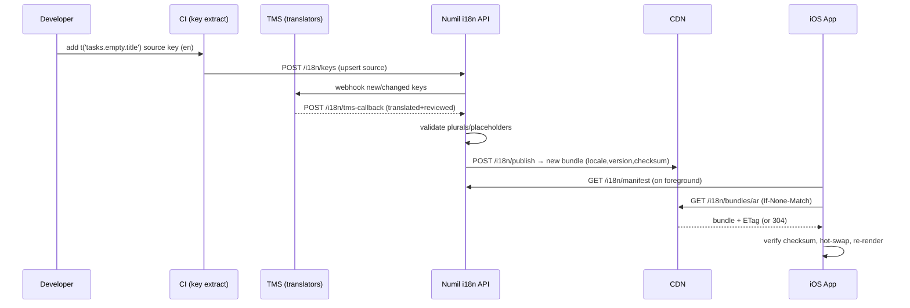

# 41 · Localization & Multi-language

> Authoring standard: [00-prd-template.md](./00-prd-template.md).

> Follows the [Master PRD Template](./00-prd-template.md). Localization is a cross-cutting
> platform capability: every screen in Numil renders through it, yet — true to the north
> star — it is **invisible when it works**. A user in Tokyo, Riyadh, or São Paulo opens the
> app and it simply speaks their language, mirrors for their script, and formats dates the
> way their brain expects.

---

## 1. Purpose

Localization & Multi-language (L10n/i18n) makes Numil feel **native to each user's language,
script, region, and reading direction** without shipping a separate build per market. It is
the layer that turns one codebase into a product that is trustworthy in 30+ locales.

**User problem it solves.** Productivity tools are intimate — people plan their lives in
them. An app that shows English strings to a Spanish speaker, left-to-right layouts to an
Arabic reader, or `7/8/26` (ambiguous) to a German user feels foreign and untrustworthy.
Enterprise buyers in the EU, Middle East, LATAM, and APAC often *require* localized UI,
locale-correct exports, and the ability to standardize a whole org on one language.

**User goals**
- See the entire UI — labels, dates, numbers, plurals, empty states, errors — in my language.
- Read right-to-left content correctly mirrored (Arabic, Hebrew, Farsi, Urdu).
- Keep my personal language even if my org standardizes on another.
- Trust that dates/times/currencies/units match my region and time zone.

**Business goals**
- Unlock non-English markets and enterprise deals that mandate localization.
- Ship new locales as **over-the-air string bundles** without an App Store release.
- Keep translation cost predictable via a governed string catalog + TMS pipeline.

**KPIs:** % MAU on a non-default locale, locale coverage (translated keys ÷ total), missing-
key rate in production, RTL defect rate, time-to-localize a new string (author → live),
and activation parity between English and non-English cohorts.

---

## 2. Navigation

**Entry points**
- **Settings ▸ Language & Region** (`src/app/settings/language.tsx`) — the primary surface.
- **First-run onboarding** proposes a language derived from `expo-localization` device
  locale; user can accept or change.
- **Org Admin ▸ Workspace ▸ Localization** (`src/app/settings/org-localization.tsx`) — sets
  the org default language, allowed languages, and whether members may override.
- Deep link `numil://settings/language`; `numil://settings/org-localization` (admin).

**Route hierarchy & breadcrumbs**
```text
Settings ▸ Language & Region
Workspace ▸ Localization (Admin)
```

**Transitions**
- Language change applies **live** (no relaunch): the i18n provider swaps the active bundle
  and React re-renders. Direction (LTR↔RTL) changes require an `I18nManager.forceRTL`
  toggle that prompts a one-tap **restart** (iOS constraint — layout direction is set at
  native init).
- Pickers open as bottom sheets (`spring.gentle`), medium→large detents, matching module 15.

**Modal vs push:** language/region pickers are **sheets** (keep Settings underneath); the
Admin localization console is a **pushed** screen with its own sub-tabs.

---

## 3. Complete UI Layout

Top → middle → bottom of **Settings ▸ Language & Region**, respecting the Dynamic Island,
large-title nav bar, and bottom safe area:

```text
┌───────────────────────────────────────────────┐
│  ‹ Settings                                     │  ← glass nav, large title collapses
│  Language & Region                              │
├───────────────────────────────────────────────┤
│  App Language                                   │
│   🌐 English (US)                        ▸      │  ← disclosure → language sheet
│   ( ) Match device                              │  ← toggle: follow system locale
├───────────────────────────────────────────────┤
│  Region & Formats                               │
│   📅 Region            United States      ▸     │
│   🔢 First day of week Monday             ▾     │
│   🕓 Time format       24-hour            (•)   │
│   Preview:  Fri, 17 Jul 2026 · 14:30 · 1,234.5 │  ← live format preview card
├───────────────────────────────────────────────┤
│  Writing & Layout                               │
│   ➡️ Layout direction   Auto (LTR)        ▾     │  ← Auto / LTR / RTL (Auto follows lang)
│   🔤 Dynamic Type       Follows iOS Settings    │  ← link out to accessibility
├───────────────────────────────────────────────┤
│  Content Language 🔜                            │
│   Translate comments & docs to English   ( )    │  ← on-device / server translation
├───────────────────────────────────────────────┤
│  ⓘ Your org default is Español. You've chosen  │
│     English for yourself.                 [Reset]│  ← per-user override banner
└───────────────────────────────────────────────┘
```

- **Top:** large title "Language & Region"; glass nav bar with back to Settings.
- **App Language:** current language row (flag/globe + endonym like "Español", never a flag
  alone — flags ≠ languages) and a "Match device" toggle.
- **Region & Formats:** region, first-day-of-week, time format, plus a **live preview card**
  that renders a sample date, time, number, and currency in the chosen locale.
- **Writing & Layout:** layout-direction control and a pointer to Dynamic Type (module 13).
- **Governance banner:** when the org sets a default that differs from the user's choice, a
  non-blocking banner explains the override with a one-tap Reset.
- **Landscape / iPad:** two-pane — categories left, detail right (Settings split-view).
- **Empty space:** calm; advanced content-translation sits below the fold (progressive).

---

## 4. Complete Component Breakdown

| Area | Components |
|------|-----------|
| Nav | `GlassNavBar`, back button, large-title header |
| Language selection | `LanguageRow`, `LanguagePickerSheet` (searchable list of endonyms), `MatchDeviceToggle`, `TranslationProgressBadge` (e.g., "92% translated") |
| Region & formats | `RegionPickerSheet`, `FirstDayOfWeekPicker`, `TimeFormatSegmented`, `FormatPreviewCard` (date/time/number/currency), `MeasurementUnitPicker` |
| Writing & layout | `LayoutDirectionPicker` (Auto/LTR/RTL), `RestartRequiredBanner`, `DynamicTypeLinkRow` |
| Content translation 🔜 | `ContentTranslateToggle`, `TranslateInlineButton`, `TranslatedByBadge` ("Translated by Numil AI"), `ShowOriginalLink` |
| Admin console | `OrgDefaultLanguagePicker`, `AllowedLanguagesMultiSelect`, `AllowOverrideToggle`, `LocaleCoverageTable`, `MissingKeysList`, `PublishBundleButton` |
| Feedback | `Skeleton`, `Toast` (undo), `Banner` (missing-translation / restart-required), `ConfirmDialog` (RTL restart) |
| Governance | `PseudoLocaleToggle` (dev), `StringInspector` (long-press a label → shows key, dev builds) |

Primitives are defined in [03-design-system-ui.md](./03-design-system-ui.md). All text
components consume the `t()` translator and scalable font tokens — no hard-coded strings.

---

## 5. Modern Features

Each feature: **Purpose · Workflow · UI · Permissions · Offline · API · DB · Notify · AC.**

### 5.1 i18n architecture (react-i18next + expo-localization) ✅
- **Purpose:** one runtime that resolves any UI string by key for the active locale.
- **Workflow:** app boots → `expo-localization` reports device locale, calendar, region,
  measurement, and `isRTL` → `i18next` initializes with the resolved language, ICU
  pluralization, and a fallback chain (`es-419 → es → en`). Components call
  `const { t } = useTranslation()` and render `t('tasks.empty.title')`.
- **UI:** invisible; every label routes through `t()`.
- **Permissions:** none to read; changing app language is self-service (any role).
- **Offline:** default (English + the user's last-selected language) bundles are embedded in
  the JS bundle; other locales are OTA-fetched and cached (see 5.6).
- **API:** `GET /i18n/bundles/:locale?version=` (CDN-backed, ETag-cached).
- **DB:** server-side `translation_keys` + `translation_strings`; client caches bundles in
  `expo-sqlite`/FS.
- **Notify:** none.
- **AC:** missing key never renders raw `t('key')` — it falls back through the chain, then to
  the key's English source string; a `i18n_missing_key` event is logged.

### 5.2 Locale-aware dates, times, numbers, currency, units ✅
- **Purpose:** format every value the way the user's region expects.
- **Workflow:** formatting goes through `Intl.DateTimeFormat` / `Intl.NumberFormat` (Hermes
  ICU) wrapped by `src/lib/format.ts`; `date-fns` + locale packs handle relative time
  ("in 2 days", "hace 3 horas"). Time zone stays user-scoped (module 11); locale controls
  presentation only.
- **UI:** `FormatPreviewCard` shows the effect live; all list/detail chips reformat instantly.
- **Permissions:** self-service.
- **Offline:** fully offline (ICU data is on-device).
- **API/DB:** none for formatting; region/format prefs persist on `user_locale_prefs`.
- **Notify:** local reminder copy re-renders in the active locale.
- **AC:** dates never show ambiguous `M/D/Y`; numbers use locale grouping/decimal separators;
  currency uses the value's own currency code, not the UI locale's.

### 5.3 Right-to-Left (RTL) support ✅
- **Purpose:** fully mirror the UI for Arabic, Hebrew, Farsi, Urdu.
- **Workflow:** styles use **logical** properties (`start`/`end`, `marginStart`,
  `textAlign: 'start'`) — never `left`/`right`. Selecting an RTL language flips
  `I18nManager` and prompts a restart. Icons that imply direction (back chevron, send,
  progress) are mirrored; brand marks and media are **not**.
- **UI:** `RestartRequiredBanner`; a pseudo-RTL dev toggle for QA.
- **Permissions:** self-service.
- **Offline:** fully offline.
- **API/DB:** stored as `layout_direction` (auto/ltr/rtl) on prefs.
- **Notify:** push/notification text mirrors via OS.
- **AC:** no `left/right` literals leak into layout; swipe actions and progress fill mirror;
  bidi text (mixed LTR numbers in RTL sentence) renders with correct isolation.

### 5.4 Dynamic Type interplay ✅
- **Purpose:** localized strings must also scale with iOS Dynamic Type (XS → AX5).
- **Workflow:** translated strings are often 30–40% longer (German, Finnish) — layouts must
  reflow at *both* larger text sizes *and* longer translations simultaneously. All labels use
  scalable font tokens; containers wrap/scroll, never truncate essential text.
- **UI:** snapshot tests render each screen at AX5 in the three longest locales.
- **Permissions:** self-service (follows iOS Settings).
- **Offline:** fully offline.
- **API/DB:** none.
- **Notify:** n/a.
- **AC:** no clipped essential text at AX5 in de-DE, fi-FI, or ru-RU; buttons grow or wrap.

### 5.5 Per-user & per-org language ✅
- **Purpose:** individuals keep their language while orgs can standardize.
- **Workflow:** resolution order = **user override → org default → device locale →
  `en`**. Admins set an org default and an **allowed languages** list, and may lock overrides
  (regulated orgs) or allow them (default). A banner explains any active override.
- **UI:** governance banner + Reset; Admin console multi-select.
- **Permissions:** users set their own; Owner/Admin set org policy (see §matrix).
- **Offline:** last resolved locale cached; policy syncs when online.
- **API:** `PUT /users/me/locale`, `PUT /orgs/:id/localization`.
- **DB:** `user_locale_prefs`, `org_localization_settings`.
- **Notify:** org policy change → in-app banner to affected members.
- **AC:** locking overrides forces org default on next resolve without data loss; unlocking
  restores prior user choice.

### 5.6 Over-the-air (OTA) string bundles ✅
- **Purpose:** ship/patch translations without an App Store release.
- **Workflow:** translation bundles are versioned artifacts on a CDN. On foreground the app
  checks `GET /i18n/manifest`, downloads changed locale bundles (ETag/If-None-Match), and
  hot-swaps them. Embedded bundles guarantee a working baseline offline.
- **UI:** silent; `TranslationProgressBadge` reflects coverage.
- **Permissions:** none (read).
- **Offline:** uses cached/embedded bundle; updates when online.
- **API:** `GET /i18n/manifest`, `GET /i18n/bundles/:locale`.
- **DB:** `translation_bundles(locale, version, checksum, published_at)`.
- **Notify:** none (silent).
- **AC:** a corrupt/partial download is rejected by checksum and never replaces a good bundle.

### 5.7 Translation pipeline & string catalog governance ✅
- **Purpose:** a governed workflow from source string → reviewed translation → live.
- **Workflow:** developers add keys to the source catalog (`en` = source of truth). CI
  extracts keys, pushes to the TMS (e.g., Lokalise/Crowdin/Phrase) via webhook, translators
  fill/review, approved strings sync back and publish as a new bundle version. A
  **pseudo-locale** (`en-XA`) in dev exposes hard-coded strings and truncation early.
- **UI:** Admin `LocaleCoverageTable` + `MissingKeysList`; dev `StringInspector`.
- **Permissions:** developers author keys; translators (external TMS) translate; Admins
  publish bundles.
- **API:** `POST /i18n/keys`, `POST /i18n/publish`, TMS webhook `POST /i18n/tms-callback`.
- **DB:** `translation_keys`, `translation_strings`, `translation_reviews`.
- **AC:** a key without an English source cannot be published; CI fails on hard-coded UI
  strings (`i18n-lint`); orphaned keys are flagged for removal.

**Translation pipeline & runtime resolution (sequence):**


---

## 6. Smart AI Features

Powered by the [AI Assistant & Copilot](./19-ai-assistant-copilot.md) module; localization
surfaces these deltas:

| Capability | What it does for localization |
|-----------|-------------------------------|
| **AI draft translation** | Pre-fills TMS suggestions for new keys; humans review before publish (never auto-published to production). |
| **On-device content translation** 🔜 | Translate a comment/description inline via Apple Translation / `NaturalLanguage`; shows "Translated by Numil AI" + Show original. |
| **Glossary & tone enforcement** | AI checks translations against the org glossary + brand tone; flags inconsistent terms (e.g., "Task" vs "To-do"). |
| **Locale QA** | AI scans for placeholder mismatches (`{{count}}` missing), truncation risk, and untranslated leakage. |
| **Language detection** | Detects the language of user-generated content to offer inline translation. |

All AI translation is **suggestive** (preview + accept), logged as `ai_invoked` with
`capability=translate`, respects org AI + no-train settings, and never overwrites a
human-reviewed string.

---

## 7. Productivity Features

- **Match device** so switching iOS language switches Numil automatically.
- **Instant preview** while choosing region/format — no guesswork before committing.
- **One-tap "Reset to org default"** from the governance banner.
- **Locale-aware quick-add parsing:** natural-language dates ("mañana 3pm", "nächsten Montag")
  parse in the active locale (feeds module 19's NL parser).
- **Keyboard & dictation** follow the OS input language; no in-app switching needed.
- **Smart week start & working days** default from region (feeds Calendar module 11).

---

## 8. Enterprise Features

- **Org language policy:** default language, allowed-languages allow-list, and override
  lock/unlock for regulated environments.
- **Localized exports & reports:** CSV/PDF exports (module 16/37) render headers, dates, and
  numbers in the requester's locale; number/date columns stay machine-parseable in raw
  exports.
- **Glossary & termbase governance:** per-org protected terminology surfaced to translators.
- **Locale coverage dashboard:** Admins see translated %, missing keys, and last publish per
  locale; gate a locale as "Beta" until ≥95% coverage.
- **Audit of localization changes:** default-language changes, override locks, and bundle
  publishes are written to the immutable audit log (module 29).
- **Compliance:** localized consent/legal copy (privacy, ToS) per region, versioned.

**Permission matrix** (roles per [shared/rbac-permissions.md](./shared/rbac-permissions.md)):

| Action | Owner | Admin | Manager | Member | Guest |
|--------|:-----:|:-----:|:-------:|:------:|:-----:|
| Set own app language/region/direction | ✅ | ✅ | ✅ | ✅ | ✅ |
| Use inline content translation 🔜 | ✅ | ✅ | ✅ | ✅ | shared scope |
| Set org default language | ✅ | ✅ | ❌ | ❌ | ❌ |
| Manage allowed-languages list | ✅ | ✅ | ❌ | ❌ | ❌ |
| Lock/unlock user overrides | ✅ | ✅ | ❌ | ❌ | ❌ |
| View locale coverage dashboard | ✅ | ✅ | scoped | ❌ | ❌ |
| Publish translation bundle | ✅ | ✅ | ❌ | ❌ | ❌ |
| Edit org glossary/termbase | ✅ | ✅ | ❌ | ❌ | ❌ |
| View localization audit entries | ✅ | ✅ | ❌ | ❌ | ❌ |

All checks are enforced server-side; the client only hides/disables affordances.

---

## 9. Collaboration Features

- **Mixed-locale teams:** each member reads the UI in their own language while shared data
  (task titles, comments) stays in whatever language the author wrote.
- **Inline "Translate" on comments/docs** 🔜 with "Show original", so a Spanish PM and a
  Japanese engineer collaborate in one thread.
- **Locale-aware mentions & notifications:** the *recipient* receives notification copy in
  *their* language, even if the actor used another.
- **Shared glossary** keeps product terminology consistent across a team's translations.

---

## 10. Offline Architecture

Deltas over [shared/offline-sync-engine.md](./shared/offline-sync-engine.md):
- **Embedded baseline bundles** (`en` + last-selected language) ship in the JS bundle so the
  UI is never untranslated offline; additional locales are cached after first fetch.
- Locale/region/direction **preferences** are local-first and sync as normal ops
  (`user_locale_prefs`), field-level LWW.
- ICU + `date-fns` locale data is fully on-device — all formatting works offline.
- OTA bundle downloads are deferred until connectivity; a stale-but-valid bundle is always
  preferred over a broken update (checksum-gated).

---

## 11. Security

Deltas over [shared/security-baseline.md](./shared/security-baseline.md):
- Translation bundles are static, signed, checksum-verified assets — no executable content;
  strings are treated as **data**, never interpolated as code/HTML (prevents injection).
- User-generated content passed to AI translation is scoped to the caller's permissions and
  honors the org **no-train** setting; translated content is not persisted server-side unless
  the user saves it.
- Legal/consent copy is versioned per locale so the exact text a user agreed to is auditable.
- No PII or task content in localization telemetry (only keys, locales, counts).

---

## 12. Notification System

Deltas over [12-notifications-alerts.md](./12-notifications-alerts.md):
- Push and local notification copy is rendered in the **recipient's** resolved locale (server
  localizes push payloads using the recipient's stored locale; local reminders localize on
  device).
- Notification categories/action titles ("Complete", "Snooze", "Reply") are localized per iOS
  category registration and refreshed when the app language changes.
- Org-policy changes ("Your workspace language is now Español") emit a low-priority in-app
  notification with a Reset action.

---

## 13. Accessibility

Deltas over [shared/accessibility-spec.md](./shared/accessibility-spec.md):
- **VoiceOver** reads localized labels/values/hints; `accessibilityLanguage` is set per
  element so a mixed-language screen is pronounced correctly.
- **RTL** mirrors reading order and swipe actions; logical (start/end) layout guarantees
  correct focus order.
- **Dynamic Type × translation** verified together at AX5 in the longest locales (see 5.4).
- Language/region controls are fully operable via Switch Control / Full Keyboard Access.
- Numbers, dates, and units are spoken using localized numeric/temporal pronunciation.

---

## 14. Animations

Deltas over [shared/animation-spec.md](./shared/animation-spec.md):
- Language switch cross-fades affected text (`motion.fast`) rather than hard-cutting.
- Direction change (LTR↔RTL) is applied on restart (no animated flip — iOS constraint), with
  a calm restart confirmation.
- `FormatPreviewCard` value change cross-fades on each selection.
- All directional/gesture animations honor RTL (swipe-to-complete originates from the correct
  edge). Reduce Motion swaps to fades per the shared spec.

---

## 15. Performance

- **Bundle strategy:** only `en` + the active locale are loaded into memory; other locales
  are code-split and lazy-fetched. A full locale bundle is ~40–120KB gzipped.
- **Formatting cache:** `Intl.*` formatters are memoized per (locale, options) — constructing
  them is expensive; reuse keeps list rendering <16ms.
- **Startup:** locale resolution is synchronous from cached prefs; no network on the boot
  path. Cold-start impact of i18n init budgeted <15ms.
- **Hermes ICU:** full-ICU Hermes ensures `Intl` correctness without a JS polyfill payload.
- **OTA:** bundle diffs downloaded via ETag; parsing happens off the main thread.
- **Virtualized lists** re-render only visible rows on language change (memoized `t`).

---

## 16. Database Design

Aligns with [17-data-model-api.md](./17-data-model-api.md). Server holds the catalog; the
client caches resolved bundles.

```text
translation_keys(id, key, namespace, source_text_en, description, max_length?, is_plural,
                 placeholders_json, created_at, deprecated_at?)
translation_strings(id, key_id→translation_keys, locale, text, plural_forms_json?,
                    state, updated_by, updated_at)             -- state: draft|translated|reviewed|published
translation_reviews(id, string_id→translation_strings, reviewer_id, decision, note, created_at)
translation_bundles(id, locale, version, checksum, coverage_pct, published_at, published_by)
org_localization_settings(org_id PK, default_locale, allowed_locales[], allow_user_override,
                          measurement_system, first_day_of_week, updated_at)
user_locale_prefs(user_id PK, app_locale?, region?, layout_direction, time_format,
                  measurement_system?, match_device, content_translate_to?, updated_at)
locale_glossary(id, org_id, term_source, term_target, locale, note)   -- protected terminology
```

**Indexes:** `translation_strings(key_id, locale)` UNIQUE, `translation_strings(locale, state)`,
`translation_bundles(locale, version)` UNIQUE, `translation_keys(namespace, key)` UNIQUE.
**Constraints:** a `translation_string` requires an existing `source_text_en`; publishing a
bundle requires all `is_plural` keys to have valid plural forms for the locale's CLDR
categories. **Soft-delete** keys via `deprecated_at` (kept for history/rollback). **History**
lives in `translation_reviews` (append-only) and versioned `translation_bundles` (rollback).

---

## 17. API Design

Follows [shared/api-conventions.md](./shared/api-conventions.md).

| Method | Path | Purpose |
|--------|------|---------|
| GET | `/i18n/manifest` | List locales + current bundle versions/checksums |
| GET | `/i18n/bundles/:locale?version=` | Fetch a locale bundle (CDN, ETag) |
| GET | `/i18n/coverage` | Per-locale coverage + missing keys (admin) |
| POST | `/i18n/keys` | Register/upsert source keys (CI) |
| POST | `/i18n/publish` | Publish reviewed strings → new bundle version (admin) |
| POST | `/i18n/tms-callback` | TMS webhook: translated/reviewed strings sync back |
| PUT | `/users/me/locale` | Set per-user language/region/direction/format prefs |
| GET/PUT | `/orgs/:id/localization` | Get/set org default, allowed locales, override lock |
| POST | `/i18n/translate` | On-device fallback → server AI translate a snippet 🔜 |

**Realtime:** channel `org:{id}` emits `localization.updated` (policy change) and
`i18n.bundle.published` (new bundle available) so clients refresh. **Errors:**
`422 validation_failed` (missing plural form / placeholder mismatch), `403 forbidden`
(non-admin publish), `409 conflict` (bundle version). **Idempotency-Key** on publish/keys.

**Sample request/response**
```http
PUT /v1/users/me/locale
Authorization: Bearer <token>
Idempotency-Key: 3f2a...
Content-Type: application/json

{ "appLocale": "ar", "region": "AE", "layoutDirection": "auto",
  "timeFormat": "24h", "matchDevice": false }
```
```json
{
  "data": {
    "userId": "u_82",
    "appLocale": "ar",
    "region": "AE",
    "layoutDirection": "rtl",
    "timeFormat": "24h",
    "matchDevice": false,
    "resolvedFrom": "user_override",
    "requiresRestart": true
  },
  "meta": { "requestId": "req_9d1c" }
}
```

---

## 18. Edge Cases

- **Missing translation key:** falls back locale-chain → English source → key name (dev only);
  logs `i18n_missing_key`; never crashes.
- **Partial/corrupt OTA bundle:** checksum fails → keep prior good bundle; retry later.
- **Placeholder mismatch** (`{{count}}` in source, absent in translation): blocked at publish;
  runtime uses source string if it slips through.
- **Plural category gap** (e.g., Arabic has 6 forms): publish blocked until all CLDR forms
  present; runtime falls back to `other`.
- **RTL restart declined:** UI stays in current direction with a persistent banner until
  restart; text still switches language.
- **Locale removed from org allow-list** while a user uses it: user is migrated to org default
  on next resolve, with a notice.
- **Device locale unsupported** (e.g., `gd-GB`): resolve to closest supported (`en-GB → en`).
- **Region ≠ language** (English UI, German region): language and formats are independent — no
  forced coupling.
- **Time zone vs locale:** DST/tz handled by module 11; locale only changes presentation.
- **Mixed-direction (bidi) content:** phone numbers/URLs/emoji in RTL text isolated so they
  don't reorder.
- **Very long translation at AX5:** container wraps/scrolls; primary action never clipped.
- **Offline first launch in a new locale never fetched:** falls back to embedded baseline.

---

## 19. User States

- **First-time:** onboarding proposes device language; one tap to confirm/change.
- **Returning:** last locale restored instantly from cache (no flash of English).
- **Power user:** distinct app language, region, and content-translate target configured.
- **Guest:** reads UI in their own language; sees shared content in the author's language.
- **Manager:** same as member for self; no org policy powers.
- **Admin/Owner:** set org default, allowed locales, override lock; view coverage.
- **Offline / poor network:** embedded/cached bundle; OTA deferred; no dead spinners.
- **RTL user:** fully mirrored UI after restart; bidi content correct.
- **Large text / a11y:** localized + scaled together; VoiceOver reads correct language.
- **Dark mode / tablet / landscape:** split-view Settings; formats unaffected.

---

## 20. Analytics Events

Schema per [shared/analytics-taxonomy.md](./shared/analytics-taxonomy.md) (never log string
content — only keys, locales, and counts).

| event | key properties |
|-------|----------------|
| `locale_changed` | `from_locale`, `to_locale`, `source` (user/org/device) |
| `region_changed` | `from_region`, `to_region` |
| `layout_direction_changed` | `direction` (ltr/rtl), `required_restart` |
| `i18n_bundle_downloaded` | `locale`, `version`, `bytes`, `duration_ms` |
| `i18n_missing_key` | `key`, `locale` (sampled/rate-limited) |
| `content_translate_used` | `source_lang`, `target_lang`, `surface` (comment/doc) |
| `org_localization_updated` | `default_locale`, `allowed_count`, `override_locked` |
| `i18n_coverage_viewed` | `locale`, `coverage_pct` |
| `format_pref_changed` | `pref` (time_format/first_day/measurement) |
| `ai_invoked` | `capability=translate`, `accepted`, `latency_ms` |

Missing-key events are sampled to avoid floods and feed a coverage/health dashboard
(module 43).

---

## 21. Acceptance Criteria

1. Every user-facing string is resolved via `t()`; no hard-coded UI text ships (CI `i18n-lint` enforces).
2. Device locale is detected on first run and proposed during onboarding.
3. Users can change app language in Settings and it applies live without relaunch (LTR↔LTR).
4. "Match device" makes the app follow the iOS system language automatically.
5. A missing key falls back through the locale chain to the English source, never showing raw `t('key')`.
6. Dates render unambiguously per locale (no bare `M/D/Y`).
7. Numbers use locale grouping and decimal separators.
8. Currency formats by the value's currency code, independent of UI locale.
9. Relative times ("in 2 days") localize correctly via `date-fns` locale packs.
10. Time zone handling is unchanged by locale; only presentation changes.
11. Selecting an RTL language flips layout after a one-tap restart.
12. No `left`/`right` literals affect layout; only logical `start`/`end` are used.
13. Direction-implying icons mirror in RTL; brand marks and media do not.
14. Bidi content (LTR numbers/URLs in RTL text) renders with correct isolation.
15. Swipe actions and progress fills mirror correctly in RTL.
16. Translated strings reflow (wrap/scroll) at Dynamic Type AX5 with no clipped essential text.
17. de-DE, fi-FI, and ru-RU pass AX5 snapshot tests on all primary screens.
18. First day of week and measurement system default from region and are overridable.
19. Locale resolution order is user override → org default → device → `en`.
20. Admins can set an org default language and an allowed-languages list.
21. Admins can lock user overrides; locking migrates users to the org default without data loss.
22. A governance banner explains any active override and offers one-tap Reset.
23. OTA bundles download and hot-swap without an App Store release.
24. Corrupt/partial OTA bundles fail checksum and never replace a good bundle.
25. Embedded baseline bundles guarantee a translated UI offline.
26. All formatting (dates/numbers/currency/units) works fully offline.
27. `Intl` formatters are memoized; language switch keeps list scroll at 60fps.
28. Publishing blocks keys lacking an English source.
29. Publishing blocks plural keys missing required CLDR forms for the locale.
30. Placeholder mismatches are blocked at publish and safe at runtime.
31. A pseudo-locale (`en-XA`) is available in dev to surface hard-coded/truncated strings.
32. Notification copy renders in the recipient's locale (push + local).
33. Notification action titles are localized and refresh on language change.
34. VoiceOver reads localized labels and sets `accessibilityLanguage` per element.
35. Locale changes are captured in analytics without logging any string content.
36. Missing-key events are sampled/rate-limited and feed the coverage dashboard.
37. Org default and override-lock changes are written to the audit log.
38. Localized exports render locale-correct headers/dates while raw exports stay machine-parseable.
39. Content translation 🔜 shows "Translated by Numil AI" with a Show original toggle.
40. AI-drafted translations are never auto-published to production without human review.
41. Removing a locale from the org allow-list migrates active users with a notice.
42. Unsupported device locales resolve to the nearest supported language.

---

## 22. Future Roadmap

- **V1 (✅):** react-i18next + expo-localization architecture, ICU pluralization, locale-aware
  dates/numbers/currency/units, RTL, Dynamic Type interplay, per-user & per-org language, OTA
  bundles, translation pipeline + pseudo-locale, coverage dashboard, localized notifications.
- **V1.1 (🔜):** inline content translation (comments/docs) via Apple Translation/AI,
  language auto-detection, glossary/termbase enforcement in the TMS, "Beta locale" gating.
- **V2 (🟣):** community/crowdsourced translation portal, per-project language overrides,
  locale-specific onboarding content, regional legal/consent variants at scale.
- **Future (💡):** real-time speech translation in voice comments, locale-aware AI tone
  adaptation, automatic screenshot localization QA in CI.
- **Experimental (🧪):** on-device LLM translation with zero network, adaptive
  transliteration for names.
- **AI track:** AI-assisted first-draft translations with confidence scoring + glossary QA.
- **Enterprise track:** SCIM-driven language provisioning, data-residency-aware translation
  processing, per-locale compliance copy management.
