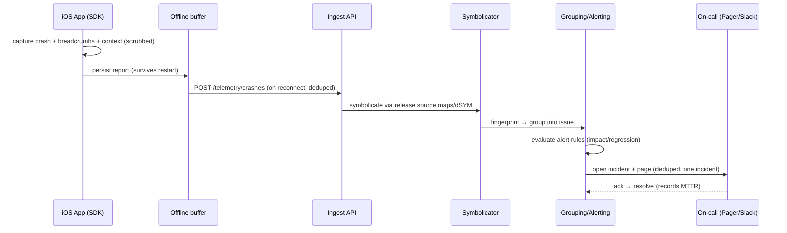

# 43 · Observability, Errors & Analytics Platform

> Authoring standard: [00-prd-template.md](./00-prd-template.md).

> Follows the [Master PRD Template](./00-prd-template.md). Observability is how Numil *knows*
> it is fast, reliable, and correct in the field. It unifies crash reporting, structured
> logs, performance/APM, distributed tracing, health dashboards, and alerting into one
> privacy-safe telemetry platform — the operator counterpart to the user-facing app, and the
> place where every other module's analytics events (see
> [shared/analytics-taxonomy.md](./shared/analytics-taxonomy.md)) land and are made sense of.

---

## 1. Purpose

The Observability, Errors & Analytics Platform lets the Numil team **detect, diagnose, and
resolve** issues before users feel them, and prove that the product meets its speed/reliability
promises. It is the connective tissue between the client SDK, the backend, and the humans
on-call.

**User problem it solves.** An offline-first mobile app runs on thousands of device/OS/network
permutations the team can't reproduce locally. Without telemetry, crashes are invisible, slow
screens go unnoticed, and a bad release is discovered via App Store reviews. Enterprises also
demand SLAs, uptime evidence, and privacy guarantees about what telemetry is collected.

**User goals (operators — Eng/SRE/PM/Admin)**
- Know within minutes when crash-free rate, latency, or error rate regresses.
- Jump from an alert → the exact stack trace, breadcrumbs, and trace of a failing request.
- Watch a release's health as it rolls out (tie into module 42 flags).
- Trust that no task content/PII leaks into logs or telemetry.
- Give enterprise admins an uptime/incident view without exposing internals.

**Business goals**
- Protect retention by keeping crash-free sessions high and screens fast.
- Reduce MTTR (mean time to resolve) and change-failure rate.
- Provide SLA/uptime evidence for enterprise contracts (module 40).
- Feed data-driven product decisions from the unified analytics platform.

**KPIs:** crash-free sessions %, crash-free users %, ANR/hang rate, cold/warm start p95,
screen-render p95, API error rate, MTTR, alert precision (true-positive %), telemetry
delivery success %, and analytics event completeness.

---

## 2. Navigation

**Entry points (operator-facing; an internal/admin surface, not for end users)**
- **Admin ▸ Health** (`src/app/settings/health.tsx`) — org-scoped uptime/incident summary for
  enterprise admins (read-only, sanitized).
- **Ops console** (web + `src/app/(internal)/observability/index.tsx` on iPad) — full
  dashboards, issues, traces, alerts for the Numil team.
- **Issue detail** (`src/app/(internal)/observability/issue/[id].tsx`).
- **In-app diagnostics** (any user): Settings ▸ Help ▸ **Send diagnostics** attaches a
  privacy-scrubbed report to a support ticket.
- Deep links `numil://admin/health`, `numil://ops/issue/{id}`.

**Route hierarchy & breadcrumbs**
```text
Admin ▸ Health (enterprise, sanitized)
Ops ▸ Dashboards ▸ [service]  |  Ops ▸ Issues ▸ [issue]  |  Ops ▸ Traces ▸ [trace]
```

**Transitions**
- Dashboard → Issue → Trace are **push** navigations (deep drill-down, preserve back stack).
- Filters/time-range pickers open as **sheets** (`spring.gentle`).
- "Send diagnostics" is a **modal sheet** with a clear consent + preview of what's shared.

**Modal vs push:** drill-downs are **pushed**; pickers and the diagnostics flow are **sheets**.

---

## 3. Complete UI Layout

**Admin ▸ Health** (enterprise, sanitized) and an **Ops ▸ Issue detail**, respecting the
Dynamic Island, large-title nav, and bottom safe area:

```text
┌───────────────────────────────────────────────┐
│  ‹ Admin        Health              Last 24h ▾ │  ← time-range picker
├───────────────────────────────────────────────┤
│  Status: ● All systems operational              │  ← rollup badge
│  ┌ Crash-free sessions ─┐ ┌ API availability ─┐ │
│  │      99.94% ▲         │ │     99.99%        │ │  ← stat cards + trend
│  └──────────────────────┘ └───────────────────┘ │
│  Cold start p95  1.8s   Screen render p95  240ms │
│  ┌ Incidents (0 active) ───────────────────────┐│
│  │  ✔ Resolved · Sync latency · Jul 12 · 34m    ││
│  └──────────────────────────────────────────────┘│
├───────────────────────────────────────────────┤
│  OPS — ISSUE DETAIL                              │
│  ⦿ TypeError: undefined is not an object         │
│     HomeScreen · 1,204 events · 318 users        │  ← impact
│     First seen 2h · release 1.4.0 (rollout 25%)  │  ← ties to flags/release
│  [ Assign ▾ ] [ Resolve ] [ Ignore ] [ Link ]   │  ← triage actions
│  ┌ Stack trace (symbolicated) ─────────────────┐│
│  │ HomeScreen.tsx:88  renderStats              ││
│  │ useStore.ts:142    selectToday              ││
│  └──────────────────────────────────────────────┘│
│  Breadcrumbs: app_opened → screen_viewed(home)   │  ← privacy-scrubbed trail
│  Trace: mobile→/tasks (412ms) ▸ db (established)  │  ← linked distributed trace
└───────────────────────────────────────────────┘
```

- **Health (top):** overall status badge, `StatCard`s (crash-free, availability, latency),
  and an incidents list — all **sanitized** for enterprise admins.
- **Ops issue (middle/bottom):** issue title, **impact** (events/users), first/last seen,
  associated **release + rollout %**, triage actions (assign/resolve/ignore/link to task),
  the **symbolicated stack trace**, **breadcrumbs** (scrubbed), and a linked **distributed
  trace**.
- **Empty/healthy state:** calm "All systems operational" with sparklines.
- **Landscape / iPad:** three-pane ops layout (issues list · detail · trace waterfall).
- **End-user side:** only the consented "Send diagnostics" sheet; nothing else is visible.

---

## 4. Complete Component Breakdown

| Area | Components |
|------|-----------|
| Nav | `GlassNavBar`, large-title header, `TimeRangePicker` (sheet), `EnvSelector` (dev/staging/prod) |
| Health rollup | `StatusBadge`, `StatCard` (value + trend sparkline), `AvailabilityGauge`, `LatencyHistogram`, `IncidentList`, `IncidentRow` |
| Issues | `IssueList` (virtualized), `IssueRow` (impact, release, assignee), `SeverityChip`, `TriageActionBar` (Assign/Resolve/Ignore/Link), `StackTraceView` (symbolicated, collapsible frames), `BreadcrumbTrail`, `DeviceContextCard` (model/OS/locale/network) |
| Tracing | `TraceWaterfall`, `SpanRow`, `SpanDetailSheet`, `ServiceMap` |
| Logs | `LogStream` (virtualized, level-filtered), `LogRow`, `StructuredFieldChips`, `LogSearchBar` |
| Performance | `VitalsPanel` (cold/warm start, TTI, render p95, ANR/hang), `SlowScreenList`, `RegressionBadge` |
| Alerting | `AlertRuleList`, `AlertRuleEditor` (metric/threshold/window), `OnCallScheduleCard`, `AlertHistoryRow`, `SilenceButton` |
| Analytics platform | `FunnelChart`, `RetentionGrid`, `EventExplorer`, `ExperimentReadoutCard` (from module 42) |
| Diagnostics (end user) | `SendDiagnosticsSheet`, `ConsentToggle`, `RedactionPreview` |
| Feedback | `Skeleton`, `Toast`, `Banner` (sampling active / consent off), `ConfirmDialog` (resolve/ignore) |

Primitives are defined in [03-design-system-ui.md](./03-design-system-ui.md).

---

## 5. Modern Features

Each feature: **Purpose · Workflow · UI · Permissions · Offline · API · DB · Notify · AC.**

**From crash to on-call (sequence):**


### 5.1 Crash & error reporting (Sentry-style) ✅
- **Purpose:** capture every unhandled crash/JS error with a symbolicated, actionable report.
- **Workflow:** a global error boundary + native crash handler capture the exception, attach
  **breadcrumbs** (recent scrubbed events), device context, active flags, and release; the
  SDK persists the report offline and uploads on reconnect. The server **symbolicates** using
  uploaded source maps / dSYMs and **groups** duplicates into one issue by a stable
  fingerprint.
- **UI:** `IssueList`, `StackTraceView`, `BreadcrumbTrail`, `DeviceContextCard`.
- **Permissions:** ops (Numil team) full; enterprise Admin sees only their org's sanitized
  aggregate.
- **Offline:** reports queued in a dedicated crash buffer; survive app restart.
- **API:** `POST /telemetry/crashes` (batch), `POST /telemetry/sourcemaps` (CI).
- **DB:** `error_events`, `error_issues` (grouped), `release_artifacts` (source maps/dSYM).
- **Notify:** new high-impact issue / regression → on-call alert.
- **AC:** stack traces are symbolicated; duplicates group into one issue; no PII/task content
  in payloads.

### 5.2 Structured logging ✅
- **Purpose:** queryable, level-based logs with consistent structured fields.
- **Workflow:** a `log(level, message, fields)` API emits JSON with correlation ids
  (`requestId`, `traceId`, `sessionId`), never free-typing PII. Client logs are **sampled**
  and buffered; server logs stream to the log store. Search by field, level, time, release.
- **UI:** `LogStream`, `LogSearchBar`, `StructuredFieldChips`.
- **Permissions:** ops only; enterprise admins do not see raw logs.
- **Offline:** buffered; flushed on reconnect at reduced sampling to save bandwidth.
- **API:** `POST /telemetry/logs` (batch), `GET /logs?query=`.
- **DB:** `log_records` (retention-tiered).
- **Notify:** log-based alert rules (e.g., error-level spike).
- **AC:** logs carry correlation ids; PII scrubbing enforced at the SDK boundary + server.

### 5.3 Performance monitoring / APM & Mobile Vitals ✅
- **Purpose:** measure and defend the "fast & native" promise.
- **Workflow:** the SDK measures cold/warm start, time-to-interactive, JS/UI frame drops,
  **ANR/hangs**, slow screen renders, and network timings; the backend measures endpoint
  latency/throughput/error rate. Vitals are bucketed by release, device tier, and OS.
- **UI:** `VitalsPanel`, `SlowScreenList`, `LatencyHistogram`, `RegressionBadge`.
- **Permissions:** ops; Admin sees sanitized latency/availability only.
- **Offline:** vitals buffered; timers use monotonic clocks (immune to wall-clock skew).
- **API:** `POST /telemetry/vitals`, `GET /vitals?metric=&release=`.
- **DB:** `performance_metrics` (aggregated rollups + raw sample store).
- **Notify:** p95 regression vs baseline → alert.
- **AC:** cold-start p95 and screen-render p95 are tracked per release with regression alerts.

### 5.4 Distributed tracing ✅
- **Purpose:** follow one user action across mobile → API → DB/services.
- **Workflow:** the SDK starts a **trace** on a user action, propagates `traceId`/`spanId`
  via `traceparent` (W3C Trace Context) headers on requests; the backend continues the trace
  across services. A trace links directly from a crash/slow event.
- **UI:** `TraceWaterfall`, `SpanRow`, `SpanDetailSheet`, `ServiceMap`.
- **Permissions:** ops only.
- **Offline:** client spans buffered; trace stitched server-side when uploaded.
- **API:** `POST /telemetry/traces`, `GET /traces/:traceId`.
- **DB:** `trace_spans` (parent/child, durations).
- **Notify:** trace-derived latency anomalies feed alerts.
- **AC:** a request's `traceId` links client span → server spans; sampling is head-based +
  tail-based for errors.

### 5.5 Health dashboards ✅
- **Purpose:** at-a-glance system health per environment/release.
- **Workflow:** curated dashboards (reliability, performance, adoption) with time-range and
  release filters; an enterprise-facing **sanitized** Health view for org admins.
- **UI:** `StatCard`, `AvailabilityGauge`, `FunnelChart`, `RetentionGrid`, `IncidentList`.
- **Permissions:** ops full; Admin sanitized; Manager none.
- **Offline:** dashboards are online reads (cached last snapshot).
- **API:** `GET /dashboards/:key`, `GET /health/summary?org=`.
- **DB:** `metric_rollups`, `incidents`.
- **Notify:** incident open/resolve posts to the Health view + status page.
- **AC:** enterprise Health view exposes only aggregate/sanitized metrics (no other orgs).

### 5.6 Alerting & on-call ✅
- **Purpose:** turn signals into timely human action.
- **Workflow:** alert rules (metric, threshold, window, severity) evaluate continuously; a
  breach opens an **incident**, pages the on-call rotation (PagerDuty/Opsgenie via module 32),
  and can trigger an automated mitigation — e.g., **kill a flag** (module 42) via a
  pre-authorized runbook. Alerts support silencing/snoozing and dedupe.
- **UI:** `AlertRuleEditor`, `OnCallScheduleCard`, `AlertHistoryRow`, `SilenceButton`.
- **Permissions:** ops manage; Admin views incident summaries.
- **Offline:** server-side (independent of any single client).
- **API:** `POST /alerts/rules`, `POST /alerts/:id/ack`, `POST /alerts/:id/silence`.
- **DB:** `alert_rules`, `alerts`, `oncall_schedules`.
- **Notify:** page on-call (high priority) + Slack channel + Health status page.
- **AC:** a breach opens exactly one incident (deduped), pages on-call, and records
  acknowledge/resolve timestamps for MTTR.

### 5.7 Privacy-safe telemetry ✅
- **Purpose:** observability without harvesting user data.
- **Workflow:** a **scrubbing pipeline** at the SDK boundary strips PII/task content (deny-by-
  default field allowlist), redacts strings matching PII patterns, and drops payload bodies.
  Telemetry respects the user's **consent** setting: consent off → only crash/health minimal
  telemetry (per [shared/security-baseline.md](./shared/security-baseline.md) &
  [shared/analytics-taxonomy.md](./shared/analytics-taxonomy.md)); analytics disabled.
- **UI:** `SendDiagnosticsSheet` with `RedactionPreview` + `ConsentToggle`.
- **Permissions:** user controls their own consent; Admin sets org policy.
- **Offline:** scrubbing happens before persistence, so even buffered data is clean.
- **API:** `GET/PUT /users/me/telemetry-consent`, `PUT /orgs/:id/telemetry-policy`.
- **DB:** `telemetry_consent`, `org_telemetry_policy`.
- **Notify:** none.
- **AC:** no task title/description/PII ever appears in any telemetry payload; consent off
  disables analytics and keeps only minimal crash/health.

### 5.8 Retention & data lifecycle ✅
- **Purpose:** keep enough history to debug, no more.
- **Workflow:** tiered retention (e.g., raw errors 90d, logs 30d, traces 14d, aggregated
  rollups 13mo); per-org overrides for enterprise; **right-to-erasure** cascades to telemetry
  keyed by hashed user id. Legal hold overrides deletion.
- **UI:** Admin retention settings; ops see retention tier per store.
- **Permissions:** Owner/Admin set retention (within compliance bounds).
- **Offline:** n/a (server lifecycle).
- **API:** `PUT /orgs/:id/telemetry-retention`, `POST /telemetry/erase` (GDPR).
- **DB:** retention policies per store; TTL indexes/partitions.
- **Notify:** retention change audited.
- **AC:** data is purged at its tier boundary; erasure requests remove a user's telemetry
  (except legal hold); all changes audited.

### 5.9 Unified analytics platform ✅
- **Purpose:** the destination for every module's Section-20 events.
- **Workflow:** events defined in [shared/analytics-taxonomy.md](./shared/analytics-taxonomy.md)
  flow through the same offline-buffered, deduped pipeline; the platform computes funnels,
  retention, adoption, and **experiment readouts** (joined via `flag_exposure` from module
  42). An `analytics-lint` CI check rejects unregistered events.
- **UI:** `FunnelChart`, `RetentionGrid`, `EventExplorer`, `ExperimentReadoutCard`.
- **Permissions:** ops/PM full; Admin sanitized aggregates.
- **Offline:** events buffered in SQLite, flushed on connectivity, deduped by `event_id`.
- **API:** `POST /telemetry/events` (batch), `GET /analytics/query`.
- **DB:** `analytics_events` (partitioned), `metric_rollups`.
- **Notify:** anomaly detection on key metrics → alert.
- **AC:** events are deduped (idempotent), schema-validated, and never contain PII; offline
  events flush with `is_offline_queued=true`.

---

## 6. Smart AI Features

Powered by the [AI Assistant & Copilot](./19-ai-assistant-copilot.md) and productivity
insights (module 36); observability deltas:

| Capability | What it does for observability |
|-----------|--------------------------------|
| **Anomaly detection** | Learns metric baselines and pages on statistically-significant deviations (fewer false alarms than static thresholds). |
| **Error triage & grouping** | Suggests fingerprints/root-cause clusters and links likely-duplicate issues. |
| **Root-cause summary** | Natural-language "what changed" across release, flag, and trace to speed diagnosis. |
| **Alert noise reduction** | Correlates related alerts into a single incident narrative. |
| **Release health verdict** | "Safe to ramp" / "roll back" recommendation feeding module 42's rollout guardrails. |

All AI outputs are **advisory** (with confidence + evidence links), logged as `ai_invoked`,
respect the org no-train setting, and never auto-resolve an incident without an on-call
confirmation (except pre-authorized auto-mitigations, which are audited).

---

## 7. Productivity Features

- **Alert → task** in one tap (creates a Numil task linked to the issue, module 10).
- **Saved dashboards & queries** per team; shareable deep links.
- **Release annotations** overlaid on charts (deploy/rollout markers from module 42).
- **Command palette** (iPad ⌘K): jump to an issue, dashboard, or trace by id.
- **Regression watchlist:** star a metric to get proactive nudges on regressions.
- **One-tap "Send diagnostics"** from any error screen for faster support resolution.

---

## 8. Enterprise Features

- **Sanitized Health/status page** for enterprise admins (uptime, incident history, SLA
  attainment) without exposing internal traces/logs.
- **SLA & uptime reporting** with exportable evidence (module 16/40).
- **SIEM export** of security-relevant telemetry and audit (module 40).
- **Per-org retention & residency** controls; data-residency-aware processing.
- **Audit of observability config** (alert rules, retention, consent policy) — immutable
  (module 29).
- **Access control:** role-scoped dashboards; internal ops surfaces hidden from customers.

**Permission matrix** (roles per [shared/rbac-permissions.md](./shared/rbac-permissions.md)):

| Action | Owner | Admin | Manager | Member | Guest |
|--------|:-----:|:-----:|:-------:|:------:|:-----:|
| App emits telemetry (consented) | ✅ | ✅ | ✅ | ✅ | ✅ |
| Manage own telemetry consent | ✅ | ✅ | ✅ | ✅ | ✅ |
| Send diagnostics to support | ✅ | ✅ | ✅ | ✅ | ✅ |
| View sanitized org Health/status | ✅ | ✅ | ❌ | ❌ | ❌ |
| Set org telemetry policy/consent | ✅ | ✅ | ❌ | ❌ | ❌ |
| Set retention / residency | ✅ | ✅ | ❌ | ❌ | ❌ |
| View SLA/uptime reports | ✅ | ✅ | scoped | ❌ | ❌ |
| Export telemetry to SIEM | ✅ | ✅ | ❌ | ❌ | ❌ |
| View raw issues/logs/traces (ops) | internal | internal | ❌ | ❌ | ❌ |
| Manage alert rules / on-call | internal | internal | ❌ | ❌ | ❌ |

`internal` = Numil operations team (not customer roles). All checks enforced server-side.

---

## 9. Collaboration Features

- **Issue assignment, comments, and status** shared across the ops team; changes audited.
- **Incident channels:** an open incident auto-creates a Slack/Teams channel (module 32) and
  a Numil task with the on-call as assignee.
- **Shared saved views** and dashboards; deep-linkable to paste into a thread.
- **Handoff notes:** on-call handover summarizes active incidents and recent regressions.
- **Cross-module links:** an issue links to the offending release (module 42), the task it
  spawned (module 10), and the audit entries (module 29).

---

## 10. Offline Architecture

Deltas over [shared/offline-sync-engine.md](./shared/offline-sync-engine.md):
- Telemetry uses the **same offline-buffered queue** pattern as analytics: crashes, logs,
  vitals, spans, and events persist in SQLite and flush on connectivity.
- Payloads are **deduped by id** (`event_id`/`crashId`/`spanId`) so retries never double-count.
- Buffers are **capacity-bounded** (ring buffer) with lossy downsampling under pressure —
  crashes are highest priority and never dropped before analytics.
- Scrubbing runs **before** persistence so buffered data is already privacy-safe.
- Monotonic clocks timestamp durations; server time reconciles wall-clock for ordering.

---

## 11. Security

Deltas over [shared/security-baseline.md](./shared/security-baseline.md):
- **Deny-by-default** field allowlist + PII pattern redaction at the SDK boundary and re-
  validated server-side; payload bodies are stripped.
- No task content, no auth tokens, no PII in any telemetry store.
- Telemetry ingestion endpoints are authenticated, rate-limited, and signed; source maps/dSYMs
  are access-controlled build artifacts.
- Security-relevant telemetry feeds SIEM; observability config changes are audited immutably.
- Consent + retention honor GDPR/CCPA; erasure cascades to hashed-user-keyed telemetry.

---

## 12. Notification System

Deltas over [12-notifications-alerts.md](./12-notifications-alerts.md):
- **Operator/on-call alerts** (not end users): pages via PagerDuty/Opsgenie, plus Slack/Teams
  incident posts and a Health status-page update.
- Alert notifications are **deduped** (one incident → one page) and support ack/snooze/resolve
  from the notification action buttons.
- End users receive only the **"Send diagnostics"** confirmation; no observability push.

---

## 13. Accessibility

Deltas over [shared/accessibility-spec.md](./shared/accessibility-spec.md):
- Status/severity are conveyed by **text + icon**, never color alone (green/amber/red always
  paired with a label).
- Charts expose an accessible **data summary** ("Crash-free 99.94%, up 0.02% vs yesterday")
  and a data-table alternative for VoiceOver.
- The `SendDiagnosticsSheet` clearly announces what data is shared and requires an explicit,
  labeled consent action.
- Ops controls (assign/resolve/silence) expose VoiceOver labels + `accessibilityActions`.

---

## 14. Animations

Deltas over [shared/animation-spec.md](./shared/animation-spec.md):
- Live metric updates cross-fade values (`motion.fast`); sparklines animate stroke, never jump.
- New issues/alerts slide-up + fade into their lists.
- Trace waterfall spans grow in on load (`motion.base`); Reduce Motion shows them statically.
- Incident status change settles without bounce; `notificationWarning` haptic on a new page.

---

## 15. Performance

- **SDK overhead budget:** telemetry adds <1% CPU and <2MB memory; capture is async and off
  the main thread; batching + compression (gzip) minimizes radio wakeups (battery-aware).
- **Sampling:** head-based sampling for traces/logs with **100% capture for errors**
  (tail-based) so nothing important is lost while volume stays bounded.
- **Batching:** events flushed on interval/size/foreground triggers; coalesced network calls.
- **Backpressure:** bounded buffers with lossy downsample under pressure (crashes protected).
- **Dashboards:** server-side pre-aggregated rollups; virtualized issue/log lists (FlashList);
  queries paginated + cached.
- **Ingestion:** horizontally scalable, idempotent, partitioned stores for time-series.

---

## 16. Database Design

Aligns with [17-data-model-api.md](./17-data-model-api.md). Time-series stores are partitioned
and retention-tiered.

```text
error_issues(id, fingerprint UNIQUE, title, culprit, level, status, assignee_id?, first_seen,
             last_seen, events_count, users_count, first_release, latest_release, created_at)
error_events(id, issue_id→error_issues, release, environment, device_json, os, locale, network,
             flags_json, breadcrumbs_json, stack_json, trace_id?, occurred_at, received_at)
release_artifacts(id, release, platform, artifact_type, checksum, uploaded_at)  -- sourcemaps/dSYM
log_records(id, level, message, fields_json, request_id?, trace_id?, session_id?, release,
            occurred_at)                                                          -- retention-tiered
performance_metrics(id, metric, value, unit, release, device_tier, os, environment, bucket_ts)
trace_spans(trace_id, span_id, parent_span_id?, service, name, start_ts, duration_ms,
            status, attributes_json)                                             -- PK(trace_id,span_id)
analytics_events(id, event_name, props_json, user_hash, org_id, session_id, is_offline_queued,
                 client_ts, server_ts)                                           -- partitioned by day
metric_rollups(id, metric, dimension_json, window, value, computed_at)
alert_rules(id, metric, comparator, threshold, window_sec, severity, enabled, owner_id)
alerts(id, rule_id→alert_rules, opened_at, acked_at?, resolved_at?, acked_by?, incident_id?)
incidents(id, org_scope?, title, severity, status, opened_at, resolved_at?, mttr_sec?)
oncall_schedules(id, team, rotation_json, current_oncall_id)
telemetry_consent(user_id PK, analytics_enabled, crash_enabled, updated_at)
org_telemetry_policy(org_id PK, analytics_default, retention_json, residency_region, updated_at)
observability_audit(id, actor_id, action, before_json, after_json, created_at)   -- immutable
```

**Indexes:** `error_events(issue_id, occurred_at)`, `error_issues(status, last_seen)`,
`analytics_events(event_name, server_ts)` + daily partitions, `trace_spans(trace_id)`,
`log_records(level, occurred_at)`, `performance_metrics(metric, release, bucket_ts)`,
`alerts(rule_id, opened_at)`. **Constraints:** an `error_event` must reference an existing
`error_issues` fingerprint (auto-created on first sight); `analytics_events.event_name` must
be a registered event (FK to the taxonomy registry); no PII columns exist by schema.
**Retention:** per-store TTL/partition drop (raw 90d/logs 30d/traces 14d/rollups 13mo,
org-overridable). **Audit/history** (`observability_audit`) is append-only.

---

## 17. API Design

Follows [shared/api-conventions.md](./shared/api-conventions.md). Ingestion is batch +
idempotent; reads are paginated.

| Method | Path | Purpose |
|--------|------|---------|
| POST | `/telemetry/events` | Batch analytics events (deduped by `event_id`) |
| POST | `/telemetry/crashes` | Batch crash/error reports |
| POST | `/telemetry/logs` | Batch structured logs |
| POST | `/telemetry/vitals` | Batch performance vitals |
| POST | `/telemetry/traces` | Batch trace spans |
| POST | `/telemetry/sourcemaps` | Upload source maps/dSYM (CI) |
| GET | `/health/summary?org=&range=` | Sanitized org health (admin) |
| GET | `/issues?filter[status]=unresolved&cursor=` | List grouped issues (ops) |
| POST | `/issues/:id/resolve` · `/issues/:id/assign` | Triage |
| GET | `/traces/:traceId` | Distributed trace detail |
| POST | `/alerts/rules` · `POST /alerts/:id/ack` | Alerting |
| GET/PUT | `/users/me/telemetry-consent` | Per-user consent |
| PUT | `/orgs/:id/telemetry-policy` · `/telemetry-retention` | Org policy/retention |
| POST | `/telemetry/erase` | GDPR erasure by hashed user id |

**Realtime:** channel `ops:{team}` emits `alert.opened`, `incident.updated`, `issue.regressed`.
**Errors:** `422 validation_failed` (unregistered event / bad batch item — partial-success
body lists rejected items), `403 forbidden` (customer role hitting ops endpoint),
`429 rate_limited` (`Retry-After`). **Idempotency:** each batch item carries an id; the batch
carries an `Idempotency-Key`; server returns per-item accept/reject.

**Sample request/response**
```http
POST /v1/telemetry/events
Authorization: Bearer <token>
Idempotency-Key: 5b21...
Content-Type: application/json

{ "events": [
  { "event_id": "e_9f31", "event_name": "app_opened",
    "props": { "cold_start": true, "startup_ms": 1810 },
    "user_hash": "h_7c…", "org_id": "org_12", "session_id": "s_88",
    "is_offline_queued": false, "client_ts": "2026-07-16T04:12:00Z" }
] }
```
```json
{
  "data": {
    "accepted": 1,
    "rejected": 0,
    "results": [ { "event_id": "e_9f31", "status": "accepted" } ]
  },
  "meta": { "requestId": "req_c47a" }
}
```

---

## 18. Edge Cases

- **Offline for days:** buffered telemetry flushes on reconnect; bounded buffer downsamples
  (crashes protected); duplicates deduped by id.
- **Clock skew:** durations use monotonic clocks; server `received_at` orders events.
- **Unsymbolicated crash** (missing source map): issue still created; marked "needs symbols";
  re-symbolicated when the artifact uploads.
- **Unregistered analytics event:** rejected (`422`), logged as `analytics_schema_violation`;
  CI `analytics-lint` prevents it shipping.
- **PII slips into a payload:** server-side scrubber redacts on ingest; a policy violation is
  recorded (no raw PII stored).
- **Consent revoked mid-session:** analytics stops immediately; buffered analytics dropped;
  minimal crash/health continues per policy.
- **Alert storm:** dedupe + correlation collapse related alerts into one incident; rate-limit
  pages.
- **Sampling drops a trace but its request errors:** tail-based sampling forces 100% capture
  for error traces.
- **Backend outage of the telemetry pipeline:** client keeps buffering; app functionality is
  unaffected (telemetry is never on the user's critical path).
- **Erasure request during active buffering:** future events for that hashed user are dropped;
  stored telemetry purged (except legal hold).
- **Release with source maps not yet uploaded:** issues queue for symbolication.
- **Duplicate batch retry:** per-item ids + `Idempotency-Key` make ingestion idempotent.

---

## 19. User States

- **End user:** telemetry is invisible; only the consented "Send diagnostics" flow is exposed.
- **Consent-off user:** analytics disabled; minimal crash/health only (per policy).
- **First-time operator:** healthy dashboards, guided "create your first alert".
- **Returning ops/on-call:** issues triage, traces, alert ack/resolve, release health.
- **Manager:** scoped SLA/uptime summaries; no raw issues/logs.
- **Admin/Owner:** sanitized Health, telemetry policy, retention, residency, SIEM export.
- **Offline / poor network:** buffering + downsampling; no dead spinners; app unaffected.
- **Tablet/landscape:** three-pane ops layout (issues · detail · trace).
- **Dark mode / large text / a11y:** status by text+icon; charts have data-table alternatives.
- **Enterprise auditor:** read-only sanitized Health + exportable SLA/uptime evidence.

---

## 20. Analytics Events

This module is the **destination** for the taxonomy in
[shared/analytics-taxonomy.md](./shared/analytics-taxonomy.md); it adds only its own
operational (meta-telemetry) events (never containing PII/task content).

| event | key properties |
|-------|----------------|
| `crash_captured` | `release`, `handled` (false), `has_symbols`, `fatal` |
| `error_captured` | `release`, `handled` (true), `issue_fingerprint` |
| `issue_regressed` | `issue_id`, `release`, `impact_users` |
| `perf_vital_recorded` | `metric` (cold_start/render_p95/anr), `value`, `device_tier` |
| `perf_regression_detected` | `metric`, `delta_pct`, `release` |
| `trace_recorded` | `sampled`, `span_count`, `had_error` |
| `alert_opened` / `alert_resolved` | `severity`, `metric`, `mttr_sec?` |
| `incident_opened` / `incident_resolved` | `severity`, `mttr_sec?` |
| `telemetry_consent_changed` | `analytics_enabled`, `crash_enabled` |
| `telemetry_flush` | `queued_count`, `flush_reason` (interval/size/foreground/reconnect) |
| `analytics_schema_violation` | `event_name` (rejected) |
| `diagnostics_sent` | `redacted`, `attached_logs` |
| `ai_invoked` | `capability` (anomaly/triage/root_cause), `accepted` |

Every event inherits the global properties (hashed `user_id`, `org_id`, `role`, `platform`,
`app_version`, `network`, `is_offline_queued`, …) defined in the shared taxonomy.

---

## 21. Acceptance Criteria

1. Unhandled crashes and JS errors are captured with breadcrumbs, device context, active flags, and release.
2. Crash reports persist offline and upload on reconnect without loss.
3. Stack traces are symbolicated server-side using uploaded source maps/dSYM.
4. Duplicate errors group into a single issue by stable fingerprint.
5. No task content, tokens, or PII ever appear in any telemetry payload.
6. Structured logs carry correlation ids (`requestId`/`traceId`/`sessionId`).
7. Client logs are sampled and buffered; flush at reduced sampling on reconnect.
8. Cold/warm start, TTI, render p95, and ANR/hang rate are measured per release.
9. Performance regressions vs baseline trigger alerts.
10. A user action's `traceId` links client spans to server spans (W3C Trace Context).
11. Traces use head-based sampling with 100% capture for error traces (tail-based).
12. Health dashboards filter by time range, environment, and release.
13. The enterprise Health view exposes only sanitized aggregates (never other orgs' data).
14. Alert rules evaluate continuously; a breach opens exactly one deduped incident.
15. A breach pages the on-call rotation and records ack/resolve for MTTR.
16. An alert can trigger a pre-authorized auto-mitigation (e.g., kill a flag via module 42).
17. Alerts support acknowledge, silence/snooze, and resolve.
18. Telemetry scrubbing runs at the SDK boundary and is re-validated server-side.
19. Consent off disables analytics and keeps only minimal crash/health telemetry.
20. Users can send privacy-scrubbed diagnostics with a preview + explicit consent.
21. Retention is tiered per store and overridable per org within compliance bounds.
22. GDPR erasure removes a user's telemetry (except legal hold) and is audited.
23. Every module's Section-20 events flow through one offline-buffered, deduped pipeline.
24. Analytics events are schema-validated; unregistered events are rejected (`422`).
25. Offline-captured events flush with `is_offline_queued=true` and are deduped by `event_id`.
26. Ingestion is idempotent (per-item ids + `Idempotency-Key`); retries never double-count.
27. Batch ingestion returns per-item accept/reject on partial success.
28. Telemetry SDK overhead stays within CPU/memory/battery budgets and off the main thread.
29. Buffers are bounded; under pressure they downsample lossily but never drop crashes first.
30. Durations use monotonic clocks; server time reconciles ordering under clock skew.
31. Status/severity are conveyed by text + icon, never color alone.
32. Charts provide accessible data summaries and table alternatives for VoiceOver.
33. Ops triage controls (assign/resolve/silence) are fully operable via VoiceOver/keyboard.
34. Operator alerts are deduped (one incident → one page); end users get no observability push.
35. An alert can be converted to a linked Numil task in one tap.
36. Release annotations (deploy/rollout) overlay on charts (from module 42).
37. Observability config changes (alert rules, retention, consent policy) are audited immutably.
38. Customer roles cannot access internal ops endpoints (`403`); enforced server-side.
39. Unsymbolicated crashes still create an issue and re-symbolicate when artifacts arrive.
40. The telemetry pipeline is never on the app's critical path (outage doesn't affect users).
41. SLA/uptime evidence is exportable for enterprise reporting.
42. AI anomaly detection pages on significant deviations and reduces false positives vs static thresholds.

---

## 22. Future Roadmap

- **V1 (✅):** crash/error reporting with symbolication + grouping, structured logging,
  mobile vitals/APM, distributed tracing, health dashboards, alerting + on-call, privacy-safe
  telemetry + consent, retention/lifecycle, unified analytics pipeline with schema lint.
- **V1.1 (🔜):** anomaly-detection alerts, alert→task automation, release annotations,
  enterprise sanitized status page, AI error triage/grouping.
- **V2 (🟣):** AI root-cause summaries across release+flag+trace, auto-mitigation runbooks
  wired to flag guardrails (module 42), SLO/error-budget tracking, session replay
  (privacy-masked).
- **Future (💡):** predictive reliability ("this release trends toward a regression"),
  cross-signal correlation (metrics↔logs↔traces↔events) in one view.
- **Experimental (🧪):** on-device anomaly pre-filtering, LLM-generated incident retrospectives.
- **AI track:** release-health verdicts feeding automated rollout decisions, alert noise
  reduction via correlation.
- **Enterprise track:** SIEM streaming, data-residency-aware processing, customer-facing SLA
  dashboards with signed uptime attestations.
