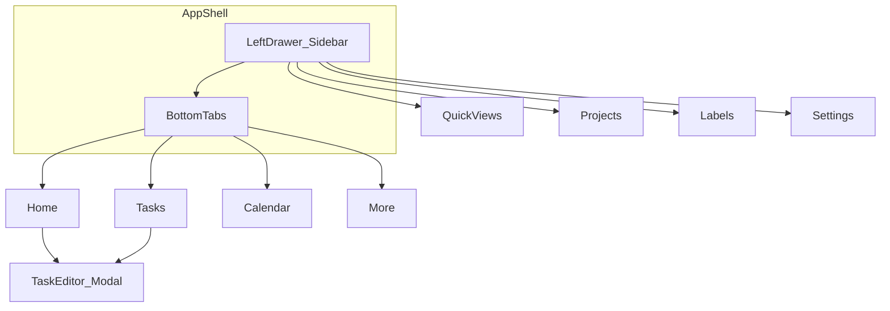
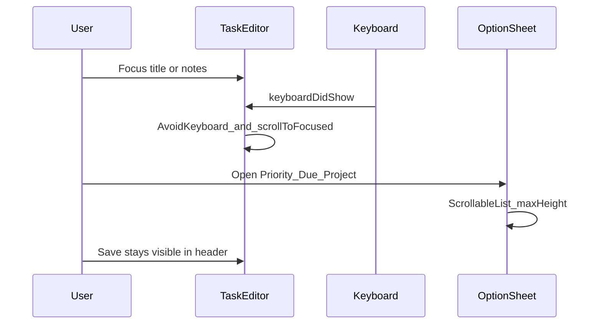

# 44 · Todos v2 — Sidebar, Mobile UX & Advanced Features (Discussion)

> **Authoring standard:** [00-prd-template.md](./00-prd-template.md)  
> **Status:** Discussion source of truth for the **next free offline build** — read, debate, then implement.  
> **Product:** **Todos** (not Numil enterprise cloud) · **Expo SDK 54** · Expo Go · AsyncStorage · no paid APIs  
> **Related:** [04-navigation-sidebar.md](./04-navigation-sidebar.md) (enterprise IA) · [10-task-detail.md](./10-task-detail.md)

---

## 0. How to use this doc

1. Read **§1 Problems** and **§4 Keyboard UX** first — those unblock feeling “mobile friendly.”
2. Review **§3 Sidebar** and **§5 Phases** — decide order and what to cut.
3. Answer **§10 Discussion questions** before coding.
4. Implementation starts only after you approve Phases **A → B** (minimum).

**This doc is not a full 22-section enterprise rewrite.** It is a build brief for the app that already runs in Expo Go.

---

## 1. Problem summary

### 1.1 What exists today (shipping code)

| Area | Location | Reality |
|------|----------|---------|
| Tabs | `src/app/(tabs)/` | Home · Tasks · Calendar · More |
| Task editor | `src/app/task/[id].tsx` | Modal with title, notes, priority, due, time, reminder, project, labels (comma text), subtasks |
| Option pickers | `src/components/option-sheet.tsx` | Bottom sheet; list can be long; weak keyboard behavior |
| Projects | More tab + `project/[id]` | Create / list / detail |
| Persistence | Zustand + AsyncStorage | Offline-only, free |
| Sidebar / drawer | — | **Missing** |
| Keyboard avoidance | Task editor | **Missing** — fields sit under the iOS keyboard |

### 1.2 What’s broken on phone (reported)

When **adding or editing a task**:

- The soft keyboard covers priority / due / project / subtask blocks.
- The form does not reliably scroll so the focused field stays visible.
- Option sheets (priority, due, time, reminder, project) feel cramped; long lists need an explicit **scrollable** region with a max height.
- Cancel / Save live in the nav header (good) but the **body** content is not keyboard-aware, so the editor feels unfriendly.

### 1.3 What’s missing vs Things / Todoist (free offline bar)

- Left **sidebar / drawer** for quick views + projects + labels (More tab alone is shallow).
- First-class **labels** (not only comma-separated strings).
- **Recurring** tasks.
- Polished **search** and optional **saved filters**.
- Editor UX that never hides controls under the keyboard.

### 1.4 Goals for Todos v2 (free)

1. Feel native and thumb-friendly on iPhone (keyboard + sheets).
2. Add a Things/Todoist-like **drawer** without removing tabs.
3. Ship advanced power features in **phases**, all offline and free.
4. Keep Expo Go as the run target (no Apple Developer fee required to develop).

---

## 2. Navigation target

**Model:** hybrid **bottom tabs + left drawer** (same idea as enterprise [04](./04-navigation-sidebar.md), slimmed for offline Todos).

```text
Root (_layout.tsx)
└─ Drawer (Sidebar)
   └─ Tabs
      ├─ Home
      ├─ Tasks
      ├─ Calendar
      └─ More          ← stays; sidebar becomes primary for collections
```

**Open sidebar via:** hamburger on Home/Tasks large header · left-edge swipe · optional long-press avatar (later).

**Keep:** FAB / quick-add · task modal · project screens · settings.

**Do not require:** org switcher, RBAC, command palette (⌘K) in Phase B — those stay enterprise-future.

### 2.1 Route / flow diagram



---

## 3. Complete UI layout (ASCII wireframes)

### 3.1 Tabs only (today) vs drawer open (v2)

```text
TODAY (tabs only)                    V2 (drawer open over tabs)
┌────────────────────────┐           ┌────────────┬───────────────┐
│ Good morning      ⚙    │           │ Todos      │ Good morning  │
│ [Quick add………]         │           │────────────│ …             │
│ Today 3  Overdue 1     │           │ QUICK VIEWS│               │
│ … task rows …          │           │ Inbox      │               │
│                        │           │ Today   3  │               │
│                        │           │ Upcoming   │               │
│ [Home Tasks Cal More]  │           │ Overdue 1  │               │
└────────────────────────┘           │ Priority   │               │
                                     │ Completed  │               │
                                     │────────────│               │
                                     │ PROJECTS   │               │
                                     │ ● Work  2  │               │
                                     │ ● Home  1  │               │
                                     │ + New…     │               │
                                     │────────────│               │
                                     │ LABELS     │               │
                                     │ #errand    │               │
                                     │ + New…     │               │
                                     │────────────│               │
                                     │ ⚙ Settings │               │
                                     └────────────┴───────────────┘
```

### 3.2 Task editor — keyboard covering content (BUG)

```text
┌────────────────────────┐
│ Cancel     New Task  Save│  ← header OK
├────────────────────────┤
│ Title________________  │
│ Notes________________  │
│ Priority ▸ High        │
│ Due date ▸ Today       │  ← these sit UNDER the keyboard
│ Project  ▸ Work        │
│ Subtasks …             │
│████████ KEYBOARD ██████│
│ Q W E R T Y …          │
└────────────────────────┘
```

### 3.3 Task editor — target (keyboard-safe)

```text
┌────────────────────────┐
│ Cancel     New Task  Save│  ← always visible
├────────────────────────┤
│ Title________________  │  ← focused; scrolled into view
│ Notes________________  │
│ Priority ▸ High        │
│ Due date ▸ Today       │
│ … scrollable body …    │
│████ pad for keyboard ██│
│████████ KEYBOARD ██████│
└────────────────────────┘
```

### 3.4 Option sheet — target (scrollable)

```text
┌────────────────────────┐
│      dimmed editor     │
│  ┌──────────────────┐  │
│  │ ══ grabber       │  │
│  │ DUE DATE         │  │
│  │ Today            │  │  ← ScrollView
│  │ Tomorrow         │  │     maxHeight ~55% screen
│  │ In 2 days        │  │     safe-area bottom
│  │ This weekend     │  │
│  │ Next week        │  │
│  │ No date          │  │
│  └──────────────────┘  │
└────────────────────────┘
```

---

## 4. Mobile keyboard UX spec (Phase A — must-fix)

### 4.1 Principles

1. **Never hide primary actions** — Cancel / Save stay in the stack header.
2. **Focused field always visible** — scroll the form when the keyboard opens or focus changes.
3. **Taps still work** — `keyboardShouldPersistTaps="handled"` on scroll containers.
4. **Sheets are lists** — option sheets scroll inside a capped height; they do not grow forever under the thumb.
5. **Dismiss keyboard** on sheet open (optional but recommended) so the sheet owns the lower half of the screen.

### 4.2 Task editor technical requirements

| Requirement | Implementation note (when we build) |
|-------------|-------------------------------------|
| Avoid keyboard | Wrap body in `KeyboardAvoidingView` with `behavior="padding"` on iOS |
| Scroll form | Keep `ScrollView` / `KeyboardAwareScrollView`-style pattern; `contentContainerStyle` bottom padding ≥ keyboard inset |
| Persist taps | `keyboardShouldPersistTaps="handled"` |
| Scroll to focus | On `TextInput` focus, `scrollTo` / measure layout so the field clears the keyboard |
| Header | Continue using `Stack.Screen` `headerLeft` / `headerRight` (already correct) |
| Safe area | Bottom padding includes `useSafeAreaInsets().bottom` when keyboard is hidden |

### 4.3 Option sheet technical requirements

| Requirement | Detail |
|-------------|--------|
| Max height | ~50–60% of window height |
| Inner scroll | `ScrollView` wrapping options (not a static `View` column only) |
| Safe area | `paddingBottom: insets.bottom + 8` |
| Long lists | Project picker and label picker must scroll when > ~6 rows |
| Backdrop | Tap outside dismisses; does not steal scroll from the list |

### 4.4 Keyboard flow (target)



### 4.5 Files that will change in Phase A (later)

- `src/app/task/[id].tsx` — KeyboardAvoidingView + scroll-to-focus
- `src/components/option-sheet.tsx` — maxHeight + ScrollView
- Possibly a small `src/components/keyboard-safe-scroll.tsx` helper

---

## 5. Sidebar information architecture (Phase B)

### 5.1 Sections (top → bottom)

1. **Header** — “Todos” title · optional subtitle (“On this device”)
2. **Quick views**
   - Inbox (no project)
   - Today
   - Upcoming (next 7 days)
   - Overdue
   - Priority (high + urgent)
   - Completed
3. **Projects** — color dot · name · incomplete count · “New project”
4. **Labels** — `#name` · count · “New label” (Phase C can deepen; Phase B can show placeholder or seed from existing task label strings)
5. **Footer** — Settings

### 5.2 Interactions

| Action | Result |
|--------|--------|
| Tap quick view | Close drawer · jump to Tasks tab with that filter (reuse `useUI.jumpToFilter`) |
| Tap project | Close drawer · open `/project/[id]` |
| Tap label | Close drawer · Tasks filtered by label (Phase C) |
| New project | Prompt → create → open project |
| Edge swipe | Open / close drawer |
| Tap backdrop | Close drawer |

### 5.3 Relationship to More tab

- **More** remains for Settings entry + project list for users who never open the drawer.
- Sidebar becomes the **primary** collections surface.
- Avoid duplicating three different UIs for the same list: shared selectors (`src/lib/selectors.ts`) power both.

### 5.4 Files that will change in Phase B (later)

- New drawer layout wrapping tabs (e.g. `src/app/(drawer)/` or Drawer in root)
- `src/components/sidebar.tsx` (or similar)
- Header hamburger on Home / Tasks / Calendar
- Bridge to existing `useUI` pending filter

Enterprise depth (orgs, command palette, iPad split): stay in [04-navigation-sidebar.md](./04-navigation-sidebar.md); not Phase B.

---

## 6. Advanced features — phased roadmap (all free / offline)

| Phase | Features | Why first |
|-------|----------|-----------|
| **A – UX fix** | Keyboard-safe task editor + scrollable option sheets | App must feel mobile-friendly before more chrome |
| **B – Sidebar** | Left drawer + quick views + projects (+ Settings) | Discoverability like Todoist / Things |
| **C – Power lists** | Label entity, filter by label, smarter grouping | Advanced without cloud |
| **D – Scheduling depth** | Recurring tasks, clearer reminder UI | Daily-use power |
| **E – Find & views** | Search polish + saved filters / custom views | Scales as task count grows |

### 6.1 Phase C — Labels (detail)

**Today:** `Task.labels: string[]` edited as comma-separated text.

**Target:**

- `Label` entity: `{ id, name, color, createdAt }`
- Tasks reference label ids **or** keep string names but manage a registry in the store
- Sidebar Lists section + chip picker in task editor (scrollable multi-select sheet)
- Tasks filter: “has label X”

### 6.2 Phase D — Recurrence (detail)

- Optional `recurrence` on Task: `{ frequency: daily\|weekly\|monthly, interval, byWeekday?, endDate? }` or simplified presets (Every day / Every week / Every month)
- On complete: spawn next occurrence (copy incomplete task with next due date)
- UI: property row “Repeat” in task editor (sheet of presets)

### 6.3 Phase E — Search & saved views (detail)

- Strengthen existing Tasks search
- Saved view: `{ id, name, filter: QuickFilter \| { labelId?, projectId?, priority? } }`
- Appear under sidebar “Saved” section

---

## 7. Out of scope (free offline Todos v2)

Do **not** block Phases A–E on these. They remain enterprise / future modules:

| Topic | Enterprise module |
|-------|-------------------|
| Login / SSO / org members | [05](./05-authentication-login.md), [13](./13-organization-members-roles.md) |
| Realtime team sync | [shared/offline-sync-engine.md](./shared/offline-sync-engine.md) + API |
| AI copilot (cloud) | [19](./19-ai-assistant-copilot.md) |
| Billing / IAP | [31](./31-billing-subscription.md) |
| Chat / whiteboard / docs | [25](./25-documents-knowledge-base.md)–[27](./27-whiteboard-brainstorming.md) |
| App Store permanent install without Apple Developer | Platform limitation — Expo Go / tunnel share only |

---

## 8. Data model deltas (for later implementation)

### 8.1 Existing (keep)

```text
Task { id, title, notes?, projectId?, priority, dueAt?, dueHasTime,
       completed, labels[], subtasks[], reminderOffsetMin?, … }
Project { id, name, color, createdAt }
Settings { themePreference, defaultReminderHour, hapticsEnabled }
```

### 8.2 Add in Phase C+

```text
Label {
  id: string
  name: string
  color: string
  createdAt: string
}

Task.recurrence?: {
  frequency: 'daily' | 'weekly' | 'monthly'
  interval: number          // every N days/weeks/months
  byWeekday?: number[]      // 0=Sun … 6=Sat (weekly)
  endAt?: string | null
} | null

SavedView {
  id: string
  name: string
  filter: {
    kind: 'quick' | 'custom'
    quick?: 'today' | 'upcoming' | 'overdue' | 'flagged' | 'completed' | 'inbox' | 'all'
    projectId?: string | null
    labelId?: string | null
    priority?: Priority | null
  }
  createdAt: string
}
```

Store: extend Zustand persist key carefully (migrate `todos-store-v1` → `v2` if shape breaks).

---

## 9. Acceptance criteria

### Phase A — Keyboard / mobile editor (must pass before Phase B)

1. With keyboard open on title, **Save** and **Cancel** remain tappable in the header.
2. Focusing **Notes** scrolls Notes above the keyboard (not covered).
3. Scrolling the form can reach **Subtasks** and **Delete** while keyboard is open (or after dismiss).
4. Opening Priority / Due / Time / Reminder / Project sheets shows a list that **scrolls** if content exceeds ~55% screen height.
5. Tapping an option in a sheet does not require dismissing the keyboard first in a broken way (either keyboard dismissed on open, or taps still register).
6. No layout jump that hides the first property row permanently under the home indicator.
7. Works on a physical iPhone in Expo Go (SDK 54).

### Phase B — Sidebar

8. Hamburger (or equivalent) opens a left drawer from Home and Tasks.
9. Left-edge swipe opens/closes the drawer.
10. Quick views apply the correct Tasks filter and close the drawer.
11. Tapping a project opens project detail and closes the drawer.
12. Settings from drawer opens Settings.
13. Drawer content scrolls if projects/labels overflow.
14. Tabs still work with the drawer closed; FAB still adds tasks.

### Phases C–E (discuss-ready, implement later)

15. Labels can be created, assigned, and used as a filter.
16. Completing a recurring task creates the next occurrence with the next due date.
17. At least one saved view can be created and opened from the sidebar.

---

## 10. Discussion questions (answer before coding)

1. **Phase order** — Confirm **A then B** first, or do you want sidebar before keyboard fix?
2. **More tab** — Keep as-is, slim it down after sidebar ships, or merge More into sidebar only?
3. **Labels in Phase B** — Show empty Labels section early, or wait until Phase C?
4. **Recurrence complexity** — Presets only (daily/weekly/monthly), or full weekday rules in v1?
5. **Share with friends** — Stay on Expo Go + tunnel (free), documented as the only free distribution path?

**Recommended defaults (if you don’t answer):** A → B → C → D → E; keep More; Labels section stub in B, full in C; presets-only recurrence; Expo Go share.

---

## 11. Suggested implementation order (after approval)

1. **Phase A** — `task/[id].tsx` + `option-sheet.tsx` keyboard/scroll fix  
2. **Phase B** — Drawer shell + `Sidebar` + header buttons + filter jump  
3. **Phase C** — Label store + picker UI + filters  
4. **Phase D** — Recurrence field + complete-and-spawn  
5. **Phase E** — Saved views + search polish  

---

## 12. Success metrics (lightweight, local)

No analytics cloud required. Manually verify:

- Can create a task with due + priority + project **without** fighting the keyboard.
- Can open Today / a project from the sidebar in ≤ 2 taps from Home.
- Friend can still open via Expo Go tunnel while your PC runs (unchanged free path).

---

*End of discussion doc 44. Approve phases, then implement — do not mix enterprise cloud scope into this free offline track.*
