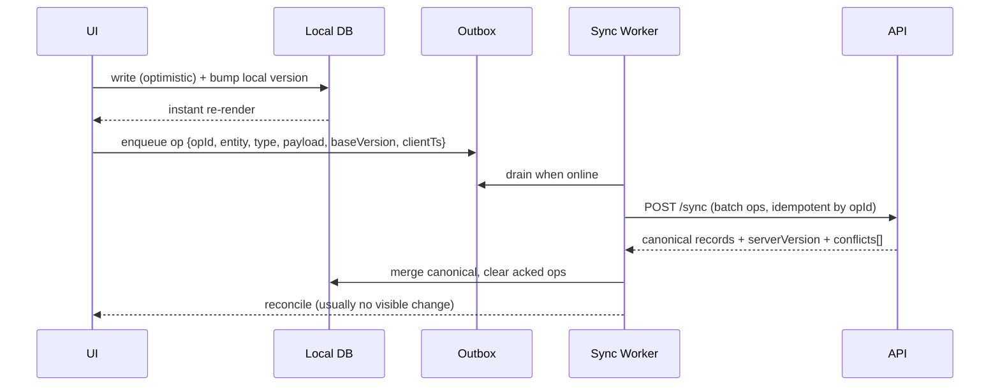

# Shared · Offline Sync Engine

Canonical offline-first architecture. Module **Section 10 (Offline Architecture)** links
here and lists only module-specific deltas (which entities, conflict nuances, media).

## Goals

- The app is **fully usable with no network** (create/edit/complete/reorder/comment).
- Zero data loss; deterministic conflict resolution; fast, invisible sync.

## Storage layers

| Layer | Tech | Contents |
|-------|------|----------|
| **Local DB** | `expo-sqlite` (or WatermelonDB) | Canonical local mirror of orgs, projects, tasks, comments, views |
| **Outbox** | SQLite table | Pending mutations (ops) awaiting server ack |
| **Blob cache** | FS + `expo-image` cache | Attachments/thumbnails; LRU eviction |
| **Secure store** | Keychain (`expo-secure-store`) | Tokens, keys |
| **Analytics buffer** | SQLite | Offline-captured events |

## Data flow (optimistic)



## Op model

```json
{
  "opId": "uuid",            // idempotency key; dedupes retries
  "entity": "task",
  "type": "create|update|delete",
  "entityId": "uuid",
  "payload": { "field": "value" },  // partial for updates
  "baseVersion": 12,          // version the client edited from
  "clientTs": "iso8601",
  "deviceId": "uuid"
}
```

## Versioning & conflict resolution

- Every entity has a monotonic `version` (server-authoritative) + `updatedAt`.
- **Delta sync (pull):** `GET /sync?since=<cursor>` returns changed entities since cursor.
- **Conflict strategy:**
  - **Field-level last-write-wins** using server timestamps for scalar fields.
  - **Structural/semantic conflicts** (e.g., status column deleted, task moved to a
    project you lost access to) → server value wins; client shows a non-blocking notice.
  - **Comments/activity** are append-only → never conflict (merge by id).
  - **Ordering** (`order` float) uses fractional indexing to avoid renumber storms.
- **Tombstones** for deletes; a delete beats a concurrent edit unless edit is newer +
  policy = restore (configurable per entity; default delete wins).

## Sync scheduling

| Trigger | Behavior |
|---------|----------|
| App foreground | Immediate delta pull + outbox flush |
| Mutation while online | Debounced flush (250ms) |
| Reconnect | Flush outbox, then pull |
| Background | `BGTaskScheduler` periodic sync (iOS), push-triggered silent sync |
| Push received | Silent content-available → targeted pull |

- **Priority sync:** visible screen's data + overdue reminders sync first; bulk history lazily.
- **Retry:** exponential backoff (1s→2s→4s… cap 5m), jitter; permanent failure surfaces
  "Couldn't sync N changes — Retry" banner.

## Media sync

- Attachments upload via resumable multipart; queued separately from metadata.
- Task references the attachment with a `pending` state until upload completes.
- Downloads are lazy + cached; cache respects storage limits (LRU, user-set cap).

## Storage limits & eviction

- Soft cap (default 500MB) with settings control; evict blob cache LRU first, then old
  completed-task history (re-fetchable). Never evict unsynced outbox data.
- "Storage full" → pause media caching, keep metadata sync, warn user.

## Encryption

- Tokens/keys in Keychain. Optional at-rest DB encryption (SQLCipher) for enterprise.
- No plaintext PII in logs.

## Multi-device

- Same user on multiple devices: each has a `deviceId`; server fans out changes via push;
  cursors are per-device. Optimistic edits reconcile via versioning.

## Edge cases (global)

- Clock skew → server timestamps authoritative; client clientTs only for tie ordering.
- Op references a since-deleted parent → server rejects with `409 gone`; client drops op + notifies.
- Permission lost mid-edit → op rejected `403`; local changes rolled back with notice.
- Duplicate create after retry → deduped by `opId`.

## Acceptance (global)

- [ ] Create/edit/complete/reorder/comment all work offline and sync losslessly.
- [ ] Retried ops never duplicate (opId idempotency).
- [ ] Field-level LWW resolves scalar conflicts; append-only merges cleanly.
- [ ] Media uploads resume after interruption.
- [ ] Storage cap respected; unsynced data never evicted.
